# Behaviour Analysis Dashboard

Generated on: 2025-10-24 09:11:14

This dashboard contains all the generated figures from the behaviour analysis.

## 1. PILT Learning Curves by Session

## 2. PILT Learning Curves by Session and Valence

## 3. Working Memory Learning Curves by Session

## 4. Working Memory Learning Curves by Delay Bins and Session (Individual Participants)

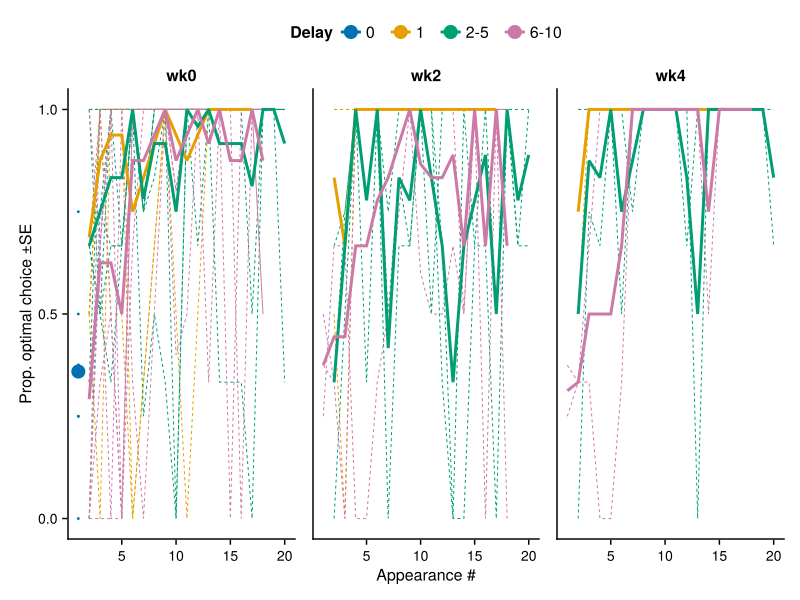

## 5. Working Memory Learning Curves by Delay Bins and Session (Group Average)

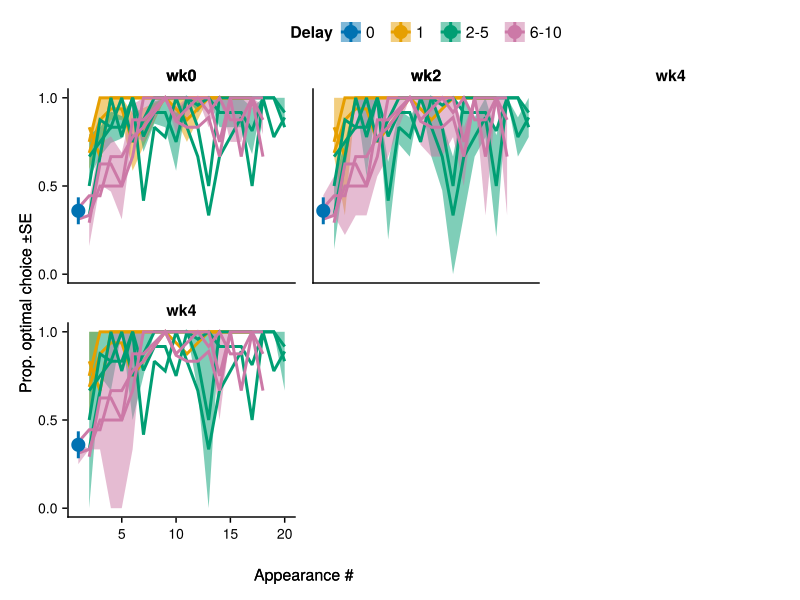

## 6. Reversal Learning Accuracy Curve

## 7. Delay Discounting Curve by Session

## 8. Vigour: Press Rate by Reward Rate

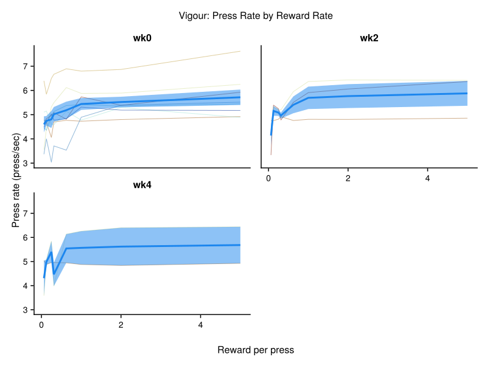

## 9. PIT: Press Rate by Pavlovian Stimuli

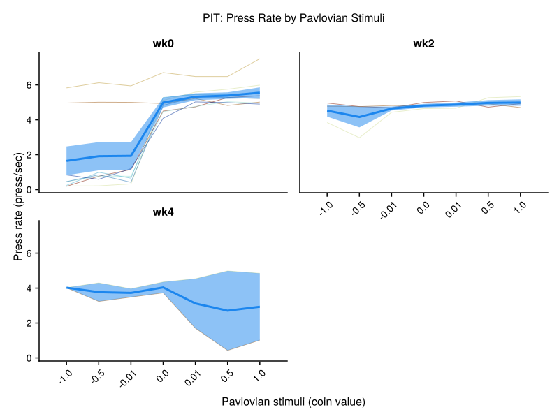

## 10. Control: Exploration Presses by Current Strength

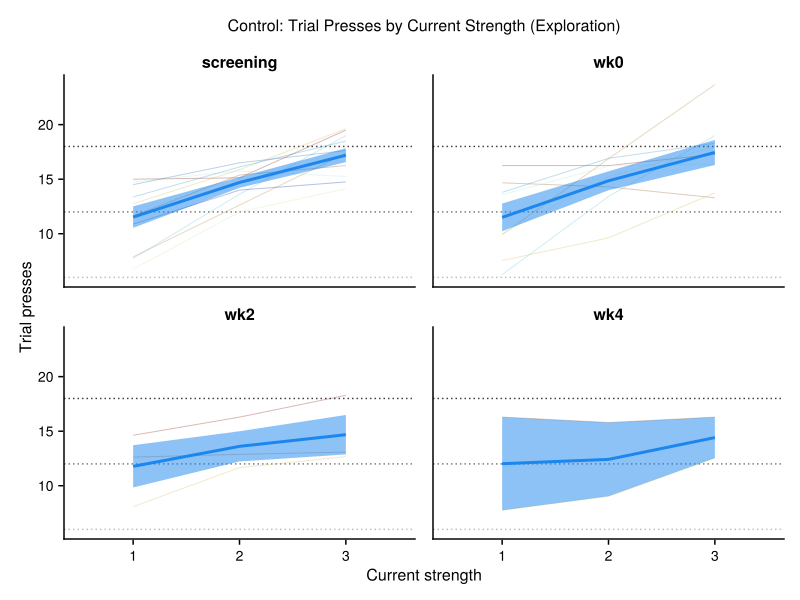

## 11. Control: Prediction Accuracy Over Time

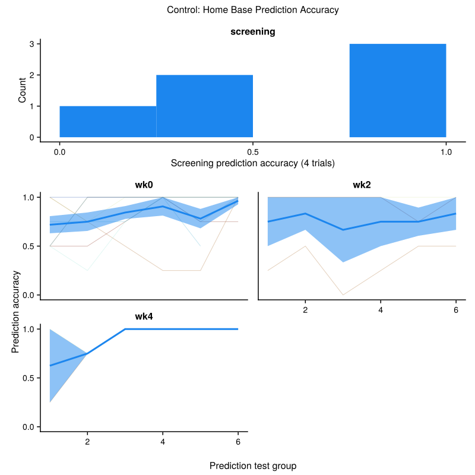

## 12. Control: Confidence Ratings Over Time

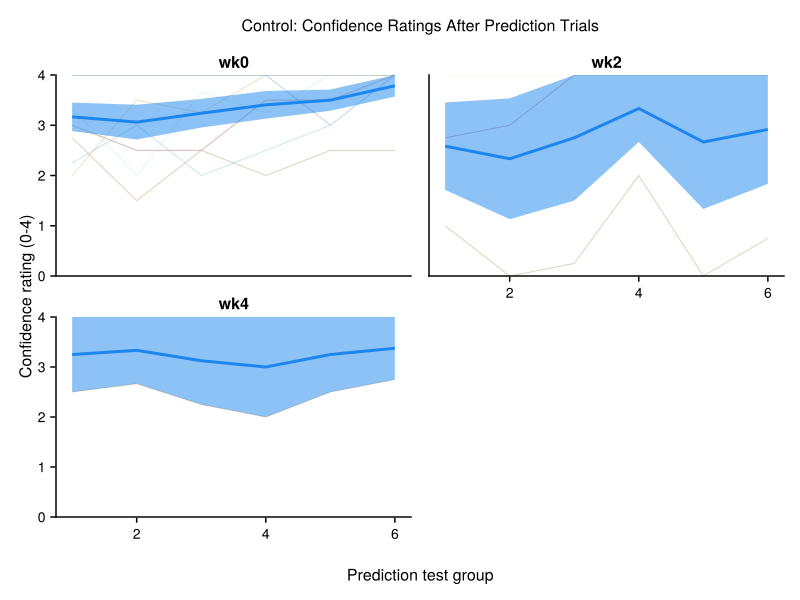

## 13. Control: Controllability Ratings Over Time

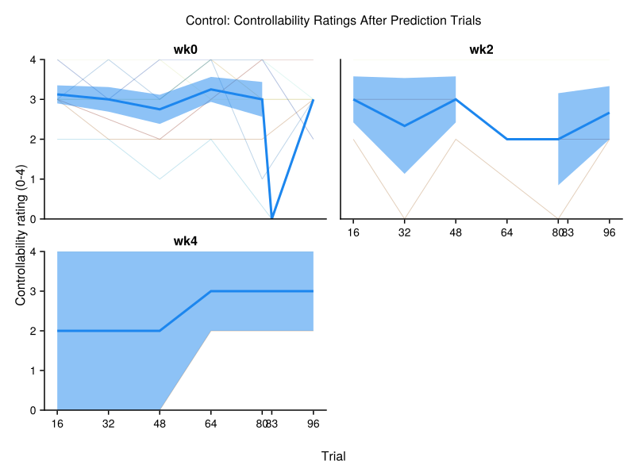

## 14. Control: Reward Rate by Current Strength

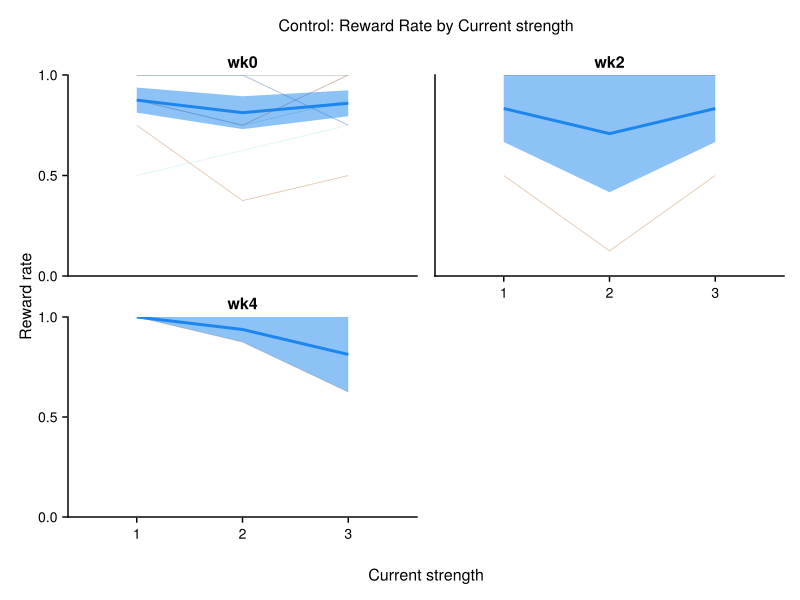

## 15. Control: Reward Rate by Reward Amount

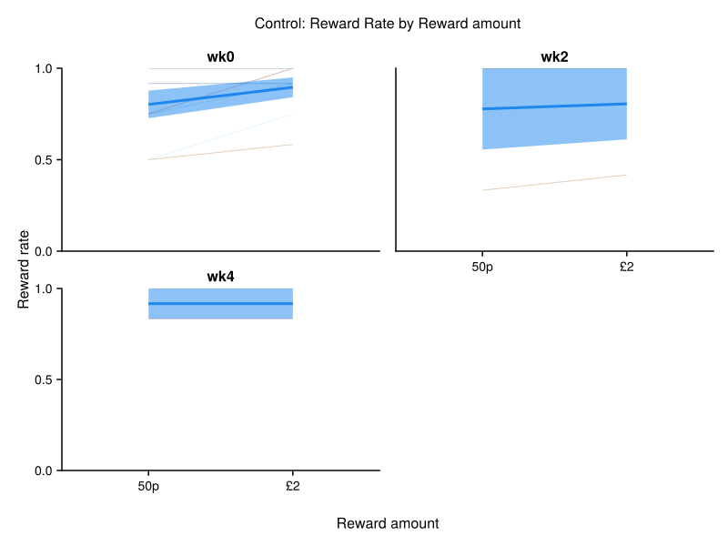

## 16. Questionnaire Score Distributions

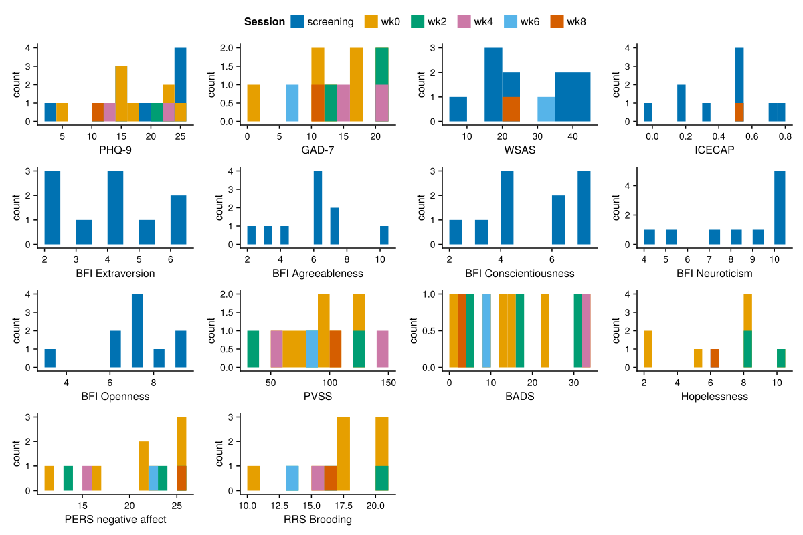

## 17. Max Press Rate Distribution by Session

## 18. Pavlovian Lottery Reaction Times by Pavlovian Value and Session

## 19. Open Text Response Lengths by Session

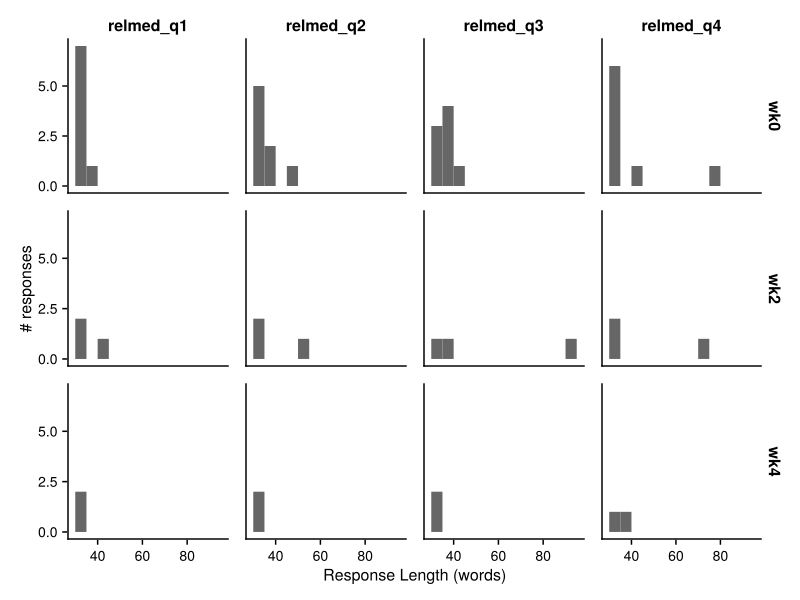

---

**Summary**: Generated 19 figures from the behaviour analysis pipeline.

**Figure files**: All figures are saved as SVG files in the `results/` directory.
