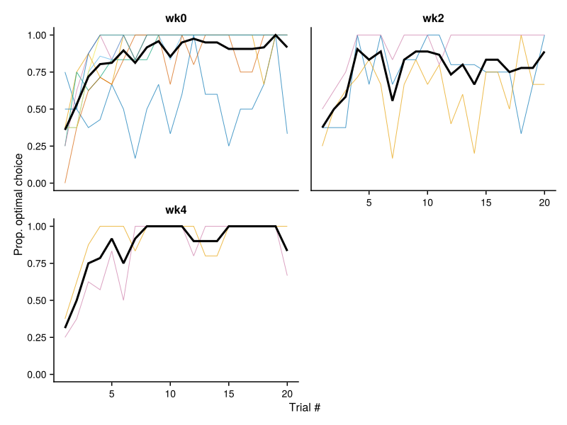
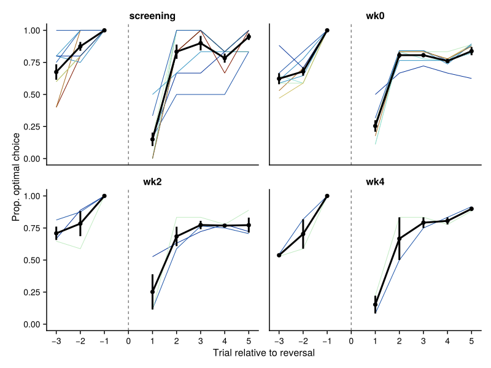

# Behaviour Analysis Dashboard

Generated on: 2025-09-21 20:46:55

This dashboard contains all the generated figures from the behaviour analysis.

## 1. PILT Learning Curves by Session

## 2. Working Memory Learning Curves by Session

## 3. Working Memory Learning Curves by Delay Bins and Session (Individual Participants)

## 4. Working Memory Learning Curves by Delay Bins and Session (Group Average)

## 5. Reversal Learning Accuracy Curve

## 6. Delay Discounting Curve

---

**Summary**: Generated 6 figures from the behaviour analysis pipeline.

**Figure files**: All figures are saved as SVG files in the `results/` directory.
