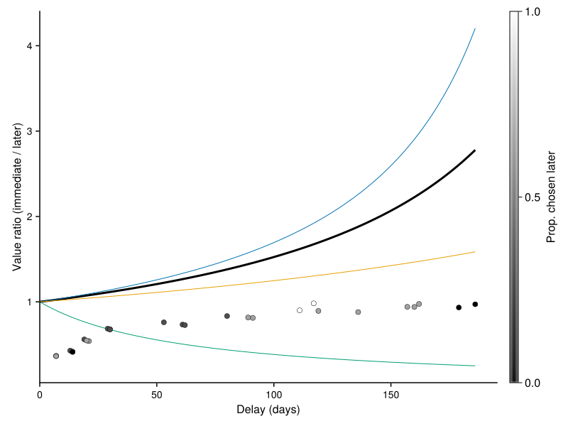
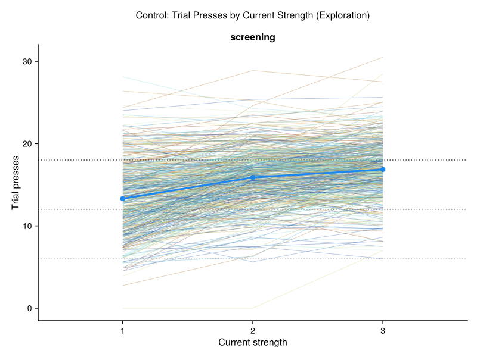

# Behaviour Analysis Dashboard

Generated on: 2025-10-27 11:35:29

This dashboard contains all the generated figures from the behaviour analysis.

## 1. Reversal Learning Accuracy Curve


## 2. Reversal Learning Accuracy Curve


## 3. Questionnaire Score Distributions


## 4. Max Press Rate Distribution by Session


## 5. Working Memory Learning Curves by Session


## 6. Working Memory Learning Curves by Delay Bins and Session (Individual Participants)


## 7. Working Memory Learning Curves by Delay Bins and Session (Group Average)


## 8. Reversal Learning Accuracy Curve


## 9. Delay Discounting Curve by Session



## 10. Vigour: Press Rate by Reward Rate


## 11. PIT: Press Rate by Pavlovian Stimuli


## 12. Control: Exploration Presses by Current Strength



## 13. Control: Prediction Accuracy Over Time


## 14. Control: Confidence Ratings Over Time


## 15. Control: Controllability Ratings Over Time


## 16. Control: Reward Rate by Current Strength


## 17. Control: Reward Rate by Reward Amount


## 18. Questionnaire Score Distributions


## 19. Max Press Rate Distribution by Session


## 20. Pavlovian Lottery Reaction Times by Pavlovian Value and Session


## 21. Open Text Response Lengths by Session


## 22. Control: Exploration Presses by Current Strength


## 23. Control: Exploration Presses by Current Strength


## 24. Control: Exploration Presses by Current Strength


## 25. Control: Prediction Accuracy Over Time


## 26. Control: Exploration Presses by Current Strength


## 27. Control: Prediction Accuracy Over Time


---

**Summary**: Generated 27 figures from the behaviour analysis pipeline.

**Figure files**: All figures are saved as SVG files in the `results/` directory.


### Data Quality Overview

<details><summary>Click to expand</summary>

```text
┌──────────────────────────┬───────────┬───────────────────────┬───────────────────┬──────────────────────────────┬─────────────────────────────┬──────────────────┬───────────────────┬─────────────────────────┬───────────────┬─────────────────────┬──────────────────────┬────────────────┬───────────────────────────┬─────────────┬───────────┬───────────────────┬────────────────────────┬─────────┐
│             PROLIFIC_PID │   session │ prop_missing_reversal │ prop_missing_pilt │ prop_missing_control_presses │ prop_missing_control_choice │ prop_missing_all │ reversal_accuracy │ reversal_critical_value │ pilt_accuracy │ pilt_critical_value │ n_pilt_quiz_attempts │ max_press_rate │ completion_time_screening │ rt_reversal │   rt_pilt │ focus_loss_events │ fullscreen_exit_events │ include │
│                   String │    String │              Float64? │          Float64? │                     Float64? │                    Float64? │         Float64? │          Float64? │                Float64? │      Float64? │             Missing │               Int64? │       Float64? │                   String? │     String? │   String? │            Int64? │                 Int64? │    Bool │
├──────────────────────────┼───────────┼───────────────────────┼───────────────────┼──────────────────────────────┼─────────────────────────────┼──────────────────┼───────────────────┼─────────────────────────┼───────────────┼─────────────────────┼──────────────────────┼────────────────┼───────────────────────────┼─────────────┼───────────┼───────────────────┼────────────────────────┼─────────┤
│ 63d169a794b8af9770a39e7e │ screening │                   0.0 │               0.0 │                    0.0416667 │                        0.25 │         0.021978 │              0.66 │                    0.64 │          0.83 │             missing │                    1 │        11.1429 │                     20:17 │   151 (233) │ 459 (127) │                 0 │                      0 │    true │
│ 6775f7bf80cba9df1032a472 │ screening │                   0.0 │               0.0 │                        0.125 │                         0.0 │        0.0211268 │              0.72 │                    0.62 │          0.42 │             missing │                    2 │        6.85714 │                     16:51 │   221 (259) │ 427 (301) │                 3 │                      0 │    true │
│ 67657a1d50f6c9eb353769fa │ screening │                   0.0 │               0.0 │                    0.0416667 │                         0.0 │        0.0111111 │              0.74 │                    0.62 │           1.0 │             missing │                    1 │        7.57143 │                     12:33 │   186 (158) │ 662 (153) │                 0 │                      0 │    true │
│ 6767202a0793489cda4738d2 │ screening │                   0.0 │               0.0 │                          0.0 │                        0.25 │       0.00892857 │              0.72 │                    0.64 │           0.6 │             missing │                    2 │        5.85714 │                     20:27 │   331 (271) │ 479 (149) │                 1 │                      0 │    true │
└──────────────────────────┴───────────┴───────────────────────┴───────────────────┴──────────────────────────────┴─────────────────────────────┴──────────────────┴───────────────────┴─────────────────────────┴───────────────┴─────────────────────┴──────────────────────┴────────────────┴───────────────────────────┴─────────────┴───────────┴───────────────────┴────────────────────────┴─────────┘
```

</details>
