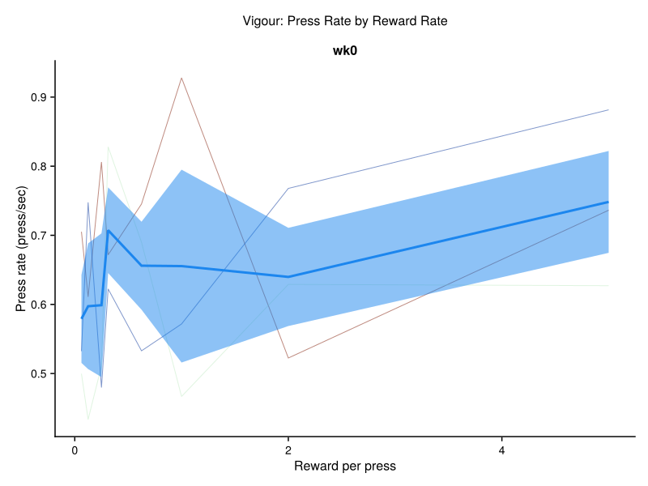
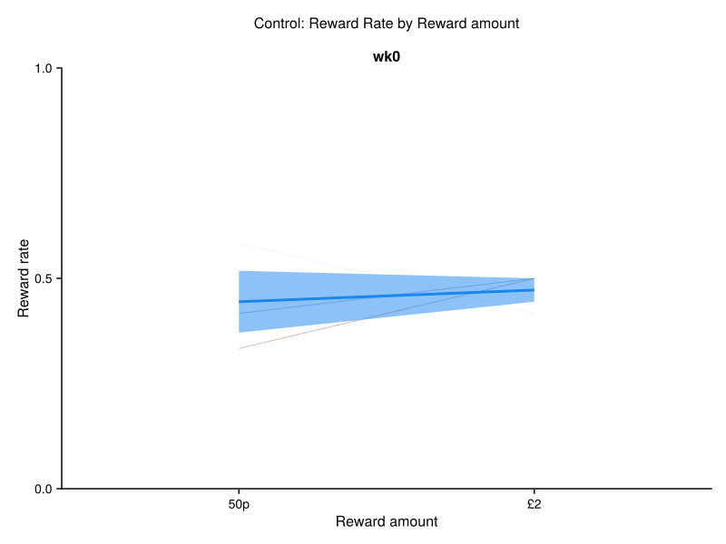

# Behaviour Analysis Dashboard

Generated on: 2025-11-21 11:47:03

This dashboard contains all the generated figures from the behaviour analysis.

## 1. PILT Learning Curves by Session


## 2. PILT Learning Curves by Session and Valence


## 3. PILT Learning Curves by Block


## 4. Working Memory Learning Curves by Session


## 5. Working Memory Learning Curves by Delay Bins and Session (Individual Participants)


## 6. Working Memory Learning Curves by Delay Bins and Session (Group Average)


## 7. Reversal Learning Accuracy Curve


## 8. Vigour: Press Rate by Reward Rate



## 9. Vigour: Test Curve by ΔRPP


## 10. PIT: Press Rate by Pavlovian Stimuli


## 11. PIT: Test Accuracy by Valence


## 12. Control: Exploration Presses by Current Strength


## 13. Control: Prediction Accuracy Over Time


## 14. Control: Confidence Ratings Over Time


## 15. Control: Controllability Ratings Over Time


## 16. Control: Reward Rate by Current Strength


## 17. Control: Reward Rate by Reward Amount



## 18. Questionnaire Score Distributions


## 19. PVSS Domain Distributions


## 20. Demographics Overview


## 21. Max Press Rate Distribution by Session


## 22. Pavlovian Lottery Reaction Times by Pavlovian Value and Session


## 23. Open Text Response Lengths by Session


## 24. PILT Learning Curves by Session


## 25. PILT Learning Curves by Session and Valence


## 26. PILT Learning Curves by Block


## 27. Working Memory Learning Curves by Session


## 28. Working Memory Learning Curves by Delay Bins and Session (Individual Participants)


## 29. Working Memory Learning Curves by Delay Bins and Session (Group Average)


## 30. Reversal Learning Accuracy Curve


## 31. Vigour: Press Rate by Reward Rate


## 32. Vigour: Test Curve by ΔRPP


## 33. PIT: Press Rate by Pavlovian Stimuli


## 34. PIT: Test Accuracy by Valence


## 35. Control: Exploration Presses by Current Strength


## 36. Control: Prediction Accuracy Over Time


## 37. Control: Confidence Ratings Over Time


## 38. Control: Controllability Ratings Over Time


## 39. Control: Reward Rate by Current Strength


## 40. Control: Reward Rate by Reward Amount


## 41. Questionnaire Score Distributions


## 42. PVSS Domain Distributions


## 43. Demographics Overview


## 44. Max Press Rate Distribution by Session


## 45. Pavlovian Lottery Reaction Times by Pavlovian Value and Session


## 46. Open Text Response Lengths by Session


---

**Summary**: Generated 46 figures from the behaviour analysis pipeline.

**Figure files**: All figures are saved as SVG files in the `results/` directory.


### Data Quality Overview

<details><summary>Click to expand</summary>

```text
┌──────────────────────────┬───────────┬─────────┬───────────────────────┬───────────────────┬──────────────────────────┬──────────────────────────────┬─────────────────────────────┬─────────────────────┬──────────────────┬──────────────────┬───────────────────┬─────────────────────────┬───────────────┬─────────────────────┬─────────────┬───────────────────┬──────────────┬──────────────────────┬────────────────┬───────────────────────────┬──────────────────────────┬──────────────────────────────┬─────────────────────────┬────────────────────┬────────────────────────┬─────────────┬─────────────┬────────────────┬───────────────────┬────────────────────────┬──────────────────────────────────────────────────────────────────────────────────────────────────────────────────────────────┬──────────────────────────────────────────────────────────────────────────────────────────────────────────────────────────────┬─────────────────────┬───────────────────────────────────────────────────────────────────────────────────────────────────────────────────────────────────────────────────────────────────────┬─────────────┬─────────┬─────────┐
│             PROLIFIC_PID │   session │ include │ prop_missing_reversal │ prop_missing_pilt │ prop_missing_discounting │ prop_missing_control_presses │ prop_missing_control_choice │ prop_missing_vigour │ prop_missing_pit │ prop_missing_all │ reversal_accuracy │ reversal_critical_value │ pilt_accuracy │ pilt_critical_value │ wm_accuracy │ wm_critical_value │ any_accuracy │ n_pilt_quiz_attempts │ max_press_rate │ completion_time_screening │ completion_time_reversal │ completion_time_pilt_to_test │ completion_time_control │ completion_time_wm │ completion_time_quests │ rt_reversal │     rt_pilt │ rt_discounting │ focus_loss_events │ fullscreen_exit_events │                                                                                                                     study_id │                                                                                                                   session_id │  session_start_time │                                                                                                                                                all_module_start_times │ total_bonus │     sex │     age │
│                  String? │    String │   Bool? │              Float64? │          Float64? │                 Float64? │                     Float64? │                    Float64? │            Float64? │         Float64? │         Float64? │          Float64? │                Float64? │      Float64? │            Float64? │    Float64? │          Float64? │        Bool? │               Int64? │       Float64? │                   String? │                  String? │                      String? │                 String? │            String? │                String? │     String? │     String? │        String? │            Int64? │                 Int64? │                                                                                                                      String? │                                                                                                                      String? │           DateTime? │                                                                                                                                                     Vector{DateTime}? │    Float64? │     Any │     Any │
├──────────────────────────┼───────────┼─────────┼───────────────────────┼───────────────────┼──────────────────────────┼──────────────────────────────┼─────────────────────────────┼─────────────────────┼──────────────────┼──────────────────┼───────────────────┼─────────────────────────┼───────────────┼─────────────────────┼─────────────┼───────────────────┼──────────────┼──────────────────────┼────────────────┼───────────────────────────┼──────────────────────────┼──────────────────────────────┼─────────────────────────┼────────────────────┼────────────────────────┼─────────────┼─────────────┼────────────────┼───────────────────┼────────────────────────┼──────────────────────────────────────────────────────────────────────────────────────────────────────────────────────────────┼──────────────────────────────────────────────────────────────────────────────────────────────────────────────────────────────┼─────────────────────┼───────────────────────────────────────────────────────────────────────────────────────────────────────────────────────────────────────────────────────────────────────┼─────────────┼─────────┼─────────┤
│ 5a0c4184fe645f0001e9f5dd │ screening │   false │                   0.0 │               0.0 │                  missing │                          0.0 │                        0.25 │             missing │          missing │         0.010989 │               0.6 │                0.627451 │          0.83 │             missing │     missing │           missing │      missing │                    1 │        6.71429 │                     18:02 │                  missing │                      missing │                 missing │            missing │                missing │   319 (136) │   644 (181) │        missing │                 0 │                      0 │                                                                                                     690244e1307009242604c6ac │                                                                                                     6902463d0945c8cf6558ac13 │ 2025-10-29T16:56:47 │                                                                                                                                     [DateTime("2025-10-29T16:56:47")] │     missing │  Female │      41 │
│ 5a94f57289de8200013ecbc8 │ screening │   false │                   0.0 │               0.0 │                  missing │                    0.0416667 │                         0.0 │             missing │          missing │        0.0111111 │              0.56 │                0.607843 │           1.0 │             missing │     missing │           missing │      missing │                    1 │        7.71429 │                     25:09 │                  missing │                      missing │                 missing │            missing │                missing │   217 (151) │   544 (569) │        missing │                 3 │                      1 │                                                                                                     690148ffbf28a11a1cda4237 │                                                                                                     6901db613224ba0231b8a15b │ 2025-10-29T09:20:09 │                                                                                                                                     [DateTime("2025-10-29T09:20:09")] │     missing │  Female │      51 │
│ 5b68c9eb87af310001584803 │ screening │   false │                  0.42 │          0.122807 │                  missing │                         0.25 │                        0.75 │             missing │          missing │         0.274074 │          0.758621 │                0.633333 │          0.44 │             missing │     missing │           missing │      missing │                    1 │        4.85714 │                     33:51 │                  missing │                      missing │                 missing │            missing │                missing │ 1668 (1599) │ 1213 (1312) │        missing │                19 │                      0 │                                                                                                     69014840b00bb061886baef1 │                                                                                                     6901da93b4ceb11958019661 │ 2025-10-29T09:13:09 │                                                                                                                                     [DateTime("2025-10-29T09:13:09")] │     missing │    Male │      29 │
│ 5b8cda8d4f3d5f0001ad7662 │ screening │   false │               missing │               0.0 │                  missing │                      missing │                     missing │             missing │          missing │              0.0 │           missing │                 missing │          0.88 │             missing │     missing │           missing │      missing │                    1 │        6.57143 │                      5:55 │                  missing │                      missing │                 missing │            missing │                missing │     missing │   356 (110) │        missing │                 0 │                      0 │                                                                                                     68fff3002e9ba202d9902c18 │                                                                                                     6900c3c5441ec156b2cf0638 │ 2025-10-28T13:23:44 │                                                                                                                                     [DateTime("2025-10-28T13:23:44")] │     missing │ missing │ missing │
│ 5c5d36bc034e280001644c3b │ screening │   false │                   0.0 │               0.0 │                  missing │                          0.0 │                        0.25 │             missing │          missing │        0.0103093 │              0.16 │                0.235294 │           1.0 │             missing │     missing │           missing │      missing │                    2 │        6.71429 │                     22:14 │                  missing │                      missing │                 missing │            missing │                missing │   386 (183) │   809 (778) │        missing │                 0 │                      0 │                                                                                                     690148ffbf28a11a1cda4237 │                                                                                                     6901db6fbf981a7945330c90 │ 2025-10-29T09:16:56 │                                                                                                                                     [DateTime("2025-10-29T09:16:56")] │     missing │  Female │      58 │
│ 5d29c671bc573b00165c9014 │ screening │   false │               missing │               0.0 │                  missing │                      missing │                     missing │             missing │          missing │              0.0 │           missing │                 missing │          0.83 │             missing │     missing │           missing │      missing │                    1 │            8.0 │                      5:58 │                  missing │                      missing │                 missing │            missing │                missing │     missing │   695 (221) │        missing │                 0 │                      0 │                                                                                                     69014840b00bb061886baef1 │                                                                                                     6901d8c54018b879cca1a702 │ 2025-10-29T09:06:39 │                                                                                                                                     [DateTime("2025-10-29T09:06:39")] │     missing │ missing │ missing │
│ 5ea0162cd60d6d023bb84bc3 │ screening │   false │                   0.0 │               0.0 │                  missing │                    0.0833333 │                         0.0 │             missing │          missing │        0.0222222 │              0.62 │                0.627451 │           1.0 │             missing │     missing │           missing │      missing │                    1 │        5.57143 │                     17:29 │                  missing │                      missing │                 missing │            missing │                missing │   466 (258) │   958 (255) │        missing │                 0 │                      0 │                                                                                                     68fff2536518b35a3b04fc29 │                                                                                                     6900cf3f95a9390f4ea7b9f3 │ 2025-10-28T14:12:39 │                                                                                                                                     [DateTime("2025-10-28T14:12:39")] │     missing │    Male │      72 │
│ 5ebea2620b9433066ef8bc7b │ screening │   false │               missing │               0.0 │                  missing │                      missing │                     missing │             missing │          missing │              0.0 │           missing │                 missing │          0.75 │             missing │     missing │           missing │      missing │                    1 │        4.42857 │                      4:21 │                  missing │                      missing │                 missing │            missing │                missing │     missing │   943 (333) │        missing │                 0 │                      0 │                                                                                                     68fff3002e9ba202d9902c18 │                                                                                                     6900f32f24aaaf14a798481c │ 2025-10-28T16:47:41 │                                                                                                                                     [DateTime("2025-10-28T16:47:41")] │     missing │ missing │ missing │
│ 5ecd22e76997ec03464c71aa │ screening │   false │                   0.0 │               0.0 │                  missing │                          0.0 │                         0.0 │             missing │          missing │              0.0 │              0.56 │                0.607843 │           1.0 │             missing │     missing │           missing │      missing │                    1 │        7.28571 │                     12:54 │                  missing │                      missing │                 missing │            missing │                missing │   296 (458) │   772 (236) │        missing │                 1 │                      0 │                                                                                                     69014840b00bb061886baef1 │                                                                                                     6901da62e34a8b255eb08a41 │ 2025-10-29T09:12:29 │                                                                                                                                     [DateTime("2025-10-29T09:12:29")] │     missing │    Male │      59 │
│ 60e845f301f5a5901200baf4 │ screening │   false │                   0.0 │               0.0 │                  missing │                          0.0 │                         0.0 │             missing │          missing │              0.0 │               0.6 │                0.607843 │          0.71 │             missing │     missing │           missing │      missing │                    1 │            7.0 │                     16:54 │                  missing │                      missing │                 missing │            missing │                missing │   308 (175) │   602 (164) │        missing │                 0 │                      0 │                                                                                                     690148ffbf28a11a1cda4237 │                                                                                                     6901dbd8bef49a4f84fc4bbb │ 2025-10-29T09:18:49 │                                                                                                                                     [DateTime("2025-10-29T09:18:49")] │     missing │  Female │      52 │
│ 6319ff03df1e7848122f18b1 │ screening │   false │               missing │               0.0 │                  missing │                      missing │                     missing │             missing │          missing │              0.0 │           missing │                 missing │           1.0 │             missing │     missing │           missing │      missing │                    1 │        7.85714 │                      3:18 │                  missing │                      missing │                 missing │            missing │                missing │     missing │   537 (161) │        missing │                 0 │                      0 │                                                                                                     69014840b00bb061886baef1 │                                                                                                     6901dafa3814aca8528872fe │ 2025-10-29T09:14:48 │                                                                                                                                     [DateTime("2025-10-29T09:14:48")] │     missing │ missing │ missing │
│ 637e3bedd8c3601a81a65889 │ screening │   false │                  0.02 │               0.0 │                  missing │                        0.375 │                         0.0 │             missing │          missing │         0.102041 │          0.795918 │                     0.6 │          0.83 │             missing │     missing │           missing │      missing │                    2 │        6.85714 │                     17:04 │                  missing │                      missing │                 missing │            missing │                missing │   429 (130) │   847 (378) │        missing │                 3 │                      0 │                                                                                                     69014840b00bb061886baef1 │                                                                                                     6901d888e038d1beef7d821a │ 2025-10-29T09:04:27 │                                                                                                                                     [DateTime("2025-10-29T09:04:27")] │     missing │    Male │      54 │
│ 65a68c275eb21fadd5a5bb41 │ screening │   false │                   0.0 │               0.0 │                  missing │                          0.0 │                         0.0 │             missing │          missing │              0.0 │              0.62 │                0.627451 │           1.0 │             missing │     missing │           missing │      missing │                    1 │            7.0 │                     15:20 │                  missing │                      missing │                 missing │            missing │                missing │   291 (240) │  1117 (560) │        missing │                 0 │                      0 │                                                                                                     68fff2536518b35a3b04fc29 │                                                                                                     6900ae7bbb1908f729cfdf72 │ 2025-10-28T11:53:24 │                                                                                                                                     [DateTime("2025-10-28T11:53:24")] │     missing │    Male │      31 │
│ 65b12332fabe68f957b75131 │ screening │   false │                   0.0 │          0.210526 │                  missing │                    0.0416667 │                         0.5 │             missing │          missing │         0.111111 │               0.7 │                0.607843 │          0.53 │             missing │     missing │           missing │      missing │                    1 │        7.71429 │                     44:00 │                  missing │                      missing │                 missing │            missing │                missing │   180 (193) │  841 (1093) │        missing │                13 │                      5 │                                                                                                     68fff2536518b35a3b04fc29 │                                                                                                     6900cdf3add714da61d6ec4f │ 2025-10-28T14:07:28 │                                                                                                                                     [DateTime("2025-10-28T14:07:28")] │     missing │    Male │      26 │
│ 66986ab71f2b54203f26ad32 │ screening │   false │                  0.06 │               0.0 │                  missing │                          0.0 │                        0.25 │             missing │          missing │        0.0363636 │          0.319149 │                  0.5625 │          0.64 │             missing │     missing │           missing │      missing │                    1 │        6.85714 │                     21:35 │                  missing │                      missing │                 missing │            missing │                missing │   588 (634) │   672 (247) │        missing │                10 │                      2 │                                                                                                     69014840b00bb061886baef1 │                                                                                                     6901dbb92ce2776e0c30eeec │ 2025-10-29T09:21:24 │                                                                                                                                     [DateTime("2025-10-29T09:21:24")] │     missing │    Male │      28 │
│ 669faeb6d07d662c8f3de95b │ screening │   false │                   0.0 │               0.0 │                  missing │                    0.0416667 │                         0.0 │             missing │          missing │        0.0103093 │               0.6 │                0.627451 │          0.58 │             missing │     missing │           missing │      missing │                    1 │        5.85714 │                     14:09 │                  missing │                      missing │                 missing │            missing │                missing │   421 (212) │   665 (180) │        missing │                 1 │                      0 │                                                                                                     690148ffbf28a11a1cda4237 │                                                                                                     6901dc1100420eb8a4c7f847 │ 2025-10-29T09:19:51 │                                                                                                                                     [DateTime("2025-10-29T09:19:51")] │     missing │  Female │      55 │
│ 66c20b634a3b292d25596fbc │ screening │   false │               missing │               0.0 │                  missing │                      missing │                     missing │             missing │          missing │              0.0 │           missing │                 missing │          0.54 │             missing │     missing │           missing │      missing │                    1 │            3.0 │                      6:32 │                  missing │                      missing │                 missing │            missing │                missing │     missing │   499 (290) │        missing │                 0 │                      0 │                                                                                                     69014840b00bb061886baef1 │                                                                                                     6901d8123c9cfada34390a56 │ 2025-10-29T09:02:42 │                                                                                                                                     [DateTime("2025-10-29T09:02:42")] │     missing │ missing │ missing │
│ 671a3ac3dada5efe6d439698 │ screening │   false │               missing │               0.0 │                  missing │                          0.0 │                         0.0 │             missing │          missing │              0.0 │           missing │                 missing │           1.0 │             missing │     missing │           missing │      missing │                    1 │        7.14286 │                     12:59 │                  missing │                      missing │                 missing │            missing │                missing │     missing │   532 (218) │        missing │                 0 │                      0 │                                                                                                     69022acb90ae5189942c6f96 │                                                                                                     69022bd9706f07fd6eb1d8e1 │ 2025-10-29T15:00:25 │                                                                                                                                     [DateTime("2025-10-29T15:00:25")] │     missing │ missing │ missing │
│ 67235d355a019e0628deb389 │ screening │   false │                   0.0 │          0.078125 │                  missing │                    0.0833333 │                        0.25 │             missing │          missing │         0.056338 │               0.6 │                0.627451 │          0.57 │             missing │     missing │           missing │      missing │                    2 │        5.85714 │                     32:26 │                  missing │                      missing │                 missing │            missing │                missing │   428 (652) │ 1211 (1375) │        missing │                 0 │                      0 │                                                                                                     68fff2536518b35a3b04fc29 │                                                                                                     6900da8cfc4ae3d4df0eaced │ 2025-10-28T15:01:43 │                                                                                                                                     [DateTime("2025-10-28T15:01:43")] │     missing │    Male │      76 │
│ 67605917d4dfdf4aeb4e5625 │ screening │   false │                   0.0 │               0.0 │                  missing │                    0.0416667 │                         0.0 │             missing │          missing │        0.0111111 │              0.62 │                0.627451 │           1.0 │             missing │     missing │           missing │      missing │                    1 │            8.0 │                     15:58 │                  missing │                      missing │                 missing │            missing │                missing │   385 (288) │    395 (87) │        missing │                 0 │                      0 │                                                                                                     68fff3002e9ba202d9902c18 │                                                                                                     69008b2c6ad408fabfcb9c61 │ 2025-10-28T09:22:16 │                                                                                                                                     [DateTime("2025-10-28T09:22:16")] │     missing │  Female │      35 │
│ 67605dd77aab925c43397d05 │ screening │   false │                   0.0 │               0.0 │                  missing │                    0.0416667 │                         0.0 │             missing │          missing │        0.0103093 │               0.6 │                0.627451 │          0.58 │             missing │     missing │           missing │      missing │                    1 │            7.0 │                     12:49 │                  missing │                      missing │                 missing │            missing │                missing │   290 (378) │   643 (444) │        missing │                 5 │                      1 │                                                                                                     68fff3002e9ba202d9902c18 │                                                                                                     69009a5ca84d6878adc3e031 │ 2025-10-28T10:26:59 │                                                                                                                                     [DateTime("2025-10-28T10:26:59")] │     missing │  Female │      42 │
│ 676074391a929c87476d397f │ screening │   false │                   0.0 │               0.0 │                  missing │                     0.208333 │                         0.0 │             missing │          missing │        0.0416667 │              0.54 │                0.607843 │          0.67 │             missing │     missing │           missing │      missing │                    3 │        6.71429 │                     13:58 │                  missing │                      missing │                 missing │            missing │                missing │   265 (468) │   457 (200) │        missing │                 1 │                      0 │                                                                                                     68fff3002e9ba202d9902c18 │                                                                                                     6900e8977eace25c33fe3fee │ 2025-10-28T16:01:05 │                                                                                                                                     [DateTime("2025-10-28T16:01:05")] │     missing │  Female │      24 │
│ 6763319d93b606ee9bee6e54 │ screening │   false │                   0.0 │               0.0 │                  missing │                     0.541667 │                         0.0 │             missing │          missing │         0.134021 │              0.68 │                0.607843 │          0.58 │             missing │     missing │           missing │      missing │                    1 │        6.57143 │                     18:09 │                  missing │                      missing │                 missing │            missing │                missing │   619 (718) │   730 (373) │        missing │                 0 │                      0 │                                                                                                     68fff3002e9ba202d9902c18 │                                                                                                     6900b1800fd64ae39e02e127 │ 2025-10-28T12:06:17 │                                                                                                                                     [DateTime("2025-10-28T12:06:17")] │     missing │  Female │      19 │
│ 676700ebaf4a1fdf1868d7c6 │ screening │   false │               missing │         0.0444444 │                  missing │                      missing │                     missing │             missing │          missing │        0.0444444 │           missing │                 missing │          0.76 │             missing │     missing │           missing │      missing │                    2 │        6.85714 │                     11:53 │                  missing │                      missing │                 missing │            missing │                missing │     missing │  1150 (631) │        missing │                 0 │                      0 │                                                                                                     68fff3002e9ba202d9902c18 │                                                                                                     6900f71b67f99b410a7731db │ 2025-10-28T17:06:20 │                                                                                                                                     [DateTime("2025-10-28T17:06:20")] │     missing │ missing │ missing │
│ 676937f22f44a9f6c9a8294c │ screening │   false │               missing │         0.0769231 │                  missing │                      missing │                     missing │             missing │          missing │        0.0769231 │           missing │                 missing │          0.55 │             missing │     missing │           missing │      missing │                    2 │        6.85714 │                      7:31 │                  missing │                      missing │                 missing │            missing │                missing │     missing │  1074 (476) │        missing │                 6 │                      0 │                                                                                                     68fff2536518b35a3b04fc29 │                                                                                                     6900ddf889a2c326abd4b480 │ 2025-10-28T15:15:41 │                                                                                                                                     [DateTime("2025-10-28T15:15:41")] │     missing │ missing │ missing │
│ 6773dc7bcec34c5f04788eff │ screening │   false │                  0.02 │               0.0 │                  missing │                    0.0416667 │                        0.25 │             missing │          missing │        0.0222222 │          0.408163 │                     0.6 │          0.36 │             missing │     missing │           missing │      missing │                    1 │        5.28571 │                     35:14 │                  missing │                      missing │                 missing │            missing │                missing │   296 (244) │   526 (288) │        missing │                 3 │                      0 │                                                                                                     68ff47cdca64b7d364d85179 │                                                                                                     68ff4ec2ca68b6b6f11fa7c2 │ 2025-10-27T11:03:25 │                                                                                                                                     [DateTime("2025-10-27T11:03:25")] │     missing │    Male │      37 │
│ 677723f5cb416c3806aaf069 │ screening │   false │                   0.0 │               0.0 │                  missing │                          0.0 │                         0.0 │             missing │          missing │              0.0 │              0.62 │                0.627451 │          0.53 │             missing │     missing │           missing │      missing │                    1 │        6.42857 │                     15:27 │                  missing │                      missing │                 missing │            missing │                missing │   228 (178) │   432 (288) │        missing │                 0 │                      0 │                                                                                                     68fff3002e9ba202d9902c18 │                                                                                                     6900ce432d9ce13b3c0cef44 │ 2025-10-28T14:09:40 │                                                                                                                                     [DateTime("2025-10-28T14:09:40")] │     missing │  Female │      35 │
│ 67783bf14b442aebc6d7dd28 │ screening │   false │                   0.0 │               0.0 │                  missing │                          0.0 │                        0.25 │             missing │          missing │        0.0108696 │              0.56 │                0.627451 │          0.71 │             missing │     missing │           missing │      missing │                    1 │        6.85714 │                     18:35 │                  missing │                      missing │                 missing │            missing │                missing │   194 (152) │   524 (193) │        missing │                 0 │                      0 │                                                                                                     68fff3002e9ba202d9902c18 │                                                                                                     6900a2652f918395e7415751 │ 2025-10-28T11:03:16 │                                                                                                                                     [DateTime("2025-10-28T11:03:16")] │     missing │  Female │      22 │
│ 677c01679916a0f348104d66 │ screening │   false │                   0.0 │               0.0 │                  missing │                    0.0416667 │                         0.0 │             missing │          missing │       0.00970874 │              0.58 │                0.627451 │           0.5 │             missing │     missing │           missing │      missing │                    1 │        5.57143 │                     14:06 │                  missing │                      missing │                 missing │            missing │                missing │   264 (336) │   509 (275) │        missing │                 1 │                      0 │                                                                                                     68fff3002e9ba202d9902c18 │                                                                                                     6901198b0ae5af820e9d0289 │ 2025-10-28T19:29:57 │                                                                                                                                     [DateTime("2025-10-28T19:29:57")] │     missing │  Female │      47 │
│ 67c60b46b619cad09b65ab51 │ screening │   false │                  0.02 │               0.0 │                  missing │                    0.0833333 │                        0.25 │             missing │          missing │        0.0338983 │          0.489796 │                     0.6 │          0.58 │             missing │     missing │           missing │      missing │                    2 │        5.42857 │                     25:27 │                  missing │                      missing │                 missing │            missing │                missing │   281 (182) │   772 (441) │        missing │                 0 │                      0 │                                                                                                     69014840b00bb061886baef1 │                                                                                                     6901e6927130c52fef1ceee3 │ 2025-10-29T10:05:29 │                                                                                                                                     [DateTime("2025-10-29T10:05:29")] │     missing │  Female │      50 │
│ 67e264bbd3349ed10ad830e5 │ screening │   false │               missing │         0.0666667 │                  missing │                          0.6 │                     missing │             missing │          missing │         0.142857 │           missing │                 missing │          0.43 │             missing │     missing │           missing │      missing │                    1 │        3.14286 │                     43:40 │                  missing │                      missing │                 missing │            missing │                missing │     missing │ 1152 (1216) │        missing │                 1 │                      1 │                                                                                                     68fff3002e9ba202d9902c18 │                                                                                                     6900f539d3e52e0d3552786b │ 2025-10-28T16:55:00 │                                                                                                                                     [DateTime("2025-10-28T16:55:00")] │     missing │ missing │ missing │
│ 67fd78082caa40e32b3e9292 │ screening │   false │               missing │               0.0 │                  missing │                      missing │                     missing │             missing │          missing │              0.0 │           missing │                 missing │          0.83 │             missing │     missing │           missing │      missing │                    1 │        5.28571 │                      9:19 │                  missing │                      missing │                 missing │            missing │                missing │     missing │   951 (289) │        missing │                 0 │                      0 │                                                                                                     68fff2536518b35a3b04fc29 │                                                                                                     69010332f8ae04c417332878 │ 2025-10-28T17:55:04 │                                                                                                                                     [DateTime("2025-10-28T17:55:04")] │     missing │ missing │ missing │
│ 55d51a6b8ce09000127d4821 │ screening │    true │                   0.0 │               0.0 │                  missing │                          0.0 │                         0.0 │             missing │          missing │              0.0 │              0.78 │                0.607843 │           1.0 │             missing │     missing │           missing │      missing │                    1 │        8.28571 │                     12:49 │                  missing │                      missing │                 missing │            missing │                missing │   266 (138) │   523 (114) │        missing │                 1 │                      0 │                                                                                                     69014840b00bb061886baef1 │                                                                                                     6901d8909ef89a449296f133 │ 2025-10-29T09:05:35 │                                                                                                                                     [DateTime("2025-10-29T09:05:35")] │     missing │    Male │      36 │
│ 563f734bcbd4c60005dc9442 │ screening │    true │                   0.0 │               0.0 │                  missing │                    0.0416667 │                         0.0 │             missing │          missing │       0.00934579 │              0.68 │                0.627451 │           0.8 │             missing │     missing │           missing │      missing │                    2 │        7.71429 │                     16:04 │                  missing │                      missing │                 missing │            missing │                missing │   461 (132) │   664 (226) │        missing │                 0 │                      0 │                                                                                                     69014840b00bb061886baef1 │                                                                                                     6901d88b88689ceacbb519b3 │ 2025-10-29T09:06:37 │                                                                                                                                     [DateTime("2025-10-29T09:06:37")] │     missing │    Male │      52 │
│ 573dbfc9cc30e7000dc57410 │ screening │    true │                   0.0 │               0.0 │                  missing │                          0.0 │                        0.25 │             missing │          missing │        0.0111111 │               0.7 │                0.627451 │           1.0 │             missing │     missing │           missing │      missing │                    1 │        6.28571 │                     19:50 │                  missing │                      missing │                 missing │            missing │                missing │   268 (446) │   861 (491) │        missing │                 0 │                      0 │                                                                                                     690148ffbf28a11a1cda4237 │                                                                                                     6901dc04db494112b540df36 │ 2025-10-29T09:20:10 │                                                                                                                                     [DateTime("2025-10-29T09:20:10")] │     missing │  Female │      60 │
│ 57ea425e5b88f5000106bb9f │ screening │    true │                   0.0 │               0.0 │                  missing │                          0.0 │                         0.0 │             missing │          missing │              0.0 │              0.74 │                0.627451 │           0.8 │             missing │     missing │           missing │      missing │                    1 │            6.0 │                     15:11 │                  missing │                      missing │                 missing │            missing │                missing │   322 (177) │   735 (333) │        missing │                 0 │                      0 │                                                                                                     69014840b00bb061886baef1 │                                                                                                     6901d870de373c76b7bc4e3c │ 2025-10-29T09:04:35 │                                                                                                                                     [DateTime("2025-10-29T09:04:35")] │     missing │    Male │      57 │
│ 581ccd016c73180001fa5b2a │ screening │    true │                   0.0 │               0.0 │                  missing │                          0.0 │                        0.25 │             missing │          missing │         0.010989 │              0.74 │                0.607843 │          0.83 │             missing │     missing │           missing │      missing │                    1 │        7.85714 │                     18:29 │                  missing │                      missing │                 missing │            missing │                missing │   255 (139) │   575 (118) │        missing │                 1 │                      0 │                                                                                                     69014840b00bb061886baef1 │                                                                                                     6901da16e038d1beef7d8232 │ 2025-10-29T09:35:24 │                                                                                                                                     [DateTime("2025-10-29T09:35:24")] │     missing │    Male │      47 │
│ 582468295f4d1c0001c7c467 │ screening │    true │                   0.0 │               0.0 │                  missing │                          0.0 │                         0.0 │             missing │          missing │              0.0 │              0.76 │                0.607843 │           1.0 │             missing │     missing │           missing │      missing │                    1 │        7.14286 │                     15:08 │                  missing │                      missing │                 missing │            missing │                missing │   367 (132) │    452 (77) │        missing │                 0 │                      0 │                                                                                                     69014840b00bb061886baef1 │                                                                                                     6901d86375a990ec40bc4ff3 │ 2025-10-29T09:04:00 │                                                                                                                                     [DateTime("2025-10-29T09:04:00")] │     missing │    Male │      31 │
│ 5875778b5c17910001ea4f35 │ screening │    true │                   0.0 │               0.0 │                  missing │                    0.0416667 │                        0.25 │             missing │          missing │        0.0222222 │              0.76 │                0.607843 │           1.0 │             missing │     missing │           missing │      missing │                    1 │        4.14286 │                     16:32 │                  missing │                      missing │                 missing │            missing │                missing │   439 (165) │   600 (104) │        missing │                 1 │                      0 │                                                                                                     69014840b00bb061886baef1 │                                                                                                     6901d82789f7ba10c3cdb88f │ 2025-10-29T09:05:58 │                                                                                                                                     [DateTime("2025-10-29T09:05:58")] │     missing │    Male │      45 │
│ 58c8497430c4cf0001ce9caf │ screening │    true │                   0.0 │               0.0 │                  missing │                          0.0 │                         0.5 │             missing │          missing │        0.0222222 │              0.68 │                0.627451 │           1.0 │             missing │     missing │           missing │      missing │                    1 │            6.0 │                     16:58 │                  missing │                      missing │                 missing │            missing │                missing │   292 (177) │    634 (79) │        missing │                 0 │                      0 │                                                                                                     69014840b00bb061886baef1 │                                                                                                     6901d820fd4b4c509c2fe36f │ 2025-10-29T09:03:05 │                                                                                                                                     [DateTime("2025-10-29T09:03:05")] │     missing │    Male │      45 │
│ 594ea461c6a70f00010aaa8d │ screening │    true │                   0.0 │               0.0 │                  missing │                    0.0416667 │                         0.0 │             missing │          missing │         0.010989 │              0.72 │                0.607843 │          0.83 │             missing │     missing │           missing │      missing │                    1 │        6.42857 │                     15:19 │                  missing │                      missing │                 missing │            missing │                missing │   270 (184) │   663 (194) │        missing │                 1 │                      0 │                                                                                                     690148ffbf28a11a1cda4237 │                                                                                                     6901db86b3206f9f60850817 │ 2025-10-29T09:17:32 │                                                                                                                                     [DateTime("2025-10-29T09:17:32")] │     missing │  Female │      57 │
│ 59789a60bf453d00010a94c7 │ screening │    true │                  0.02 │               0.0 │                  missing │                          0.0 │                         0.0 │             missing │          missing │        0.0111111 │          0.734694 │                    0.62 │           1.0 │             missing │     missing │           missing │      missing │                    1 │        7.42857 │                     22:12 │                  missing │                      missing │                 missing │            missing │                missing │   272 (191) │   561 (145) │        missing │                 0 │                      0 │                                                                                                     690148ffbf28a11a1cda4237 │                                                                                                     6901db8202617dfa34c8350d │ 2025-10-29T09:17:32 │                                                                                                                                     [DateTime("2025-10-29T09:17:32")] │     missing │  Female │      54 │
│ 59b5a275c05bb50001eb3c4b │ screening │    true │                   0.0 │               0.0 │                  missing │                          0.0 │                        0.25 │             missing │          missing │        0.0105263 │              0.72 │                0.627451 │           0.9 │             missing │     missing │           missing │      missing │                    1 │            6.0 │                     22:34 │                  missing │                      missing │                 missing │            missing │                missing │    287 (97) │    469 (84) │        missing │                 0 │                      0 │                                                                                                     69014840b00bb061886baef1 │                                                                                                     6901de4bebbd828685c8353a │ 2025-10-29T09:30:37 │                                                                                                                                     [DateTime("2025-10-29T09:30:37")] │     missing │    Male │      47 │
│ 59d4c100078dbe0001951236 │ screening │    true │                   0.0 │               0.0 │                  missing │                          0.0 │                        0.25 │             missing │          missing │        0.0105263 │               0.7 │                0.627451 │           0.8 │             missing │     missing │           missing │      missing │                    1 │        7.14286 │                     16:25 │                  missing │                      missing │                 missing │            missing │                missing │   368 (300) │   784 (141) │        missing │                 1 │                      0 │                                                                                                     69022acb90ae5189942c6f96 │                                                                                                     69022cda277a97effb3757b5 │ 2025-10-29T15:04:43 │                                                                                                                                     [DateTime("2025-10-29T15:04:43")] │     missing │  Female │      40 │
│ 59dccd61e75b450001a689b7 │ screening │    true │                   0.0 │               0.0 │                  missing │                    0.0416667 │                         0.0 │             missing │          missing │         0.010989 │               0.8 │                0.607843 │          0.83 │             missing │     missing │           missing │      missing │                    1 │        6.85714 │                     18:29 │                  missing │                      missing │                 missing │            missing │                missing │   419 (227) │   806 (218) │        missing │                 2 │                      0 │                                                                                                     69014840b00bb061886baef1 │                                                                                                     6901d91bfe9d62725b2fa90e │ 2025-10-29T09:11:07 │                                                                                                                                     [DateTime("2025-10-29T09:11:07")] │     missing │    Male │      58 │
│ 59feed1da383a100011b3eaa │ screening │    true │                   0.0 │               0.0 │                  missing │                          0.0 │                         0.0 │             missing │          missing │              0.0 │              0.82 │                0.607843 │          0.83 │             missing │     missing │           missing │      missing │                    1 │            6.0 │                     14:42 │                  missing │                      missing │                 missing │            missing │                missing │   250 (214) │   552 (133) │        missing │                 1 │                      0 │                                                                                                     69014840b00bb061886baef1 │                                                                                                     6901d93c91ddb2b2f9b605d7 │ 2025-10-29T09:07:42 │                                                                                                                                     [DateTime("2025-10-29T09:07:42")] │     missing │    Male │      50 │
│ 5a47473899311d0001df550e │ screening │    true │                   0.0 │               0.0 │                  missing │                          0.0 │                         0.0 │             missing │          missing │              0.0 │              0.72 │                0.607843 │          0.78 │             missing │     missing │           missing │      missing │                    1 │        6.85714 │                     16:01 │                  missing │                      missing │                 missing │            missing │                missing │   232 (182) │   673 (349) │        missing │                 0 │                      0 │                                                                                                     690148ffbf28a11a1cda4237 │                                                                                                     6901dade76d2a45aaaa8b87a │ 2025-10-29T09:17:44 │                                                                                                                                     [DateTime("2025-10-29T09:17:44")] │     missing │  Female │      42 │
│ 5a6b844fe6cc4a0001b6a656 │ screening │    true │                   0.0 │               0.0 │                  missing │                          0.0 │                         0.0 │             missing │          missing │              0.0 │               0.7 │                0.607843 │           0.8 │             missing │     missing │           missing │      missing │                    1 │        5.71429 │                     15:13 │                  missing │                      missing │                 missing │            missing │                missing │   287 (300) │   663 (254) │        missing │                 0 │                      0 │                                                                                                     690148ffbf28a11a1cda4237 │                                                                                                     6901dc01f1ec6b407c730271 │ 2025-10-29T09:19:31 │                                                                                                                                     [DateTime("2025-10-29T09:19:31")] │     missing │  Female │      41 │
│ 5a991dd86475f900019fe4b6 │ screening │    true │                   0.0 │               0.0 │                  missing │                    0.0416667 │                        0.25 │             missing │          missing │        0.0210526 │              0.76 │                0.607843 │           0.9 │             missing │     missing │           missing │      missing │                    1 │        7.85714 │                     17:06 │                  missing │                      missing │                 missing │            missing │                missing │   371 (261) │   766 (170) │        missing │                 0 │                      0 │                                                                                                     69022acb90ae5189942c6f96 │                                                                                                     69022c2d108f78fdaccbbdac │ 2025-10-29T15:03:36 │                                                                                                                                     [DateTime("2025-10-29T15:03:36")] │     missing │  Female │      46 │
│ 5aad8499e1546900019aef29 │ screening │    true │                   0.0 │               0.0 │                  missing │                          0.0 │                         0.0 │             missing │          missing │              0.0 │              0.66 │                0.627451 │          0.83 │             missing │     missing │           missing │      missing │                    2 │        9.14286 │                     14:46 │                  missing │                      missing │                 missing │            missing │                missing │   332 (386) │   602 (191) │        missing │                 1 │                      0 │                                                                                                     69014840b00bb061886baef1 │                                                                                                     6901dc1a3236707f77f1973f │ 2025-10-29T09:20:57 │                                                                                                                                     [DateTime("2025-10-29T09:20:57")] │     missing │    Male │      25 │
│ 5aafd9eff69e940001d88bf4 │ screening │    true │                   0.0 │               0.0 │                  missing │                    0.0416667 │                         0.0 │             missing │          missing │         0.010989 │              0.78 │                0.607843 │          0.83 │             missing │     missing │           missing │      missing │                    1 │        6.14286 │                     16:04 │                  missing │                      missing │                 missing │            missing │                missing │   305 (181) │   606 (173) │        missing │                 0 │                      0 │                                                                                                     690148ffbf28a11a1cda4237 │                                                                                                     6901db6b6555e12b12b96876 │ 2025-10-29T09:18:03 │                                                                                                                                     [DateTime("2025-10-29T09:18:03")] │     missing │  Female │      59 │
│ 5abbe13268b65b00018cf94b │ screening │    true │                   0.0 │               0.0 │                  missing │                    0.0416667 │                         0.0 │             missing │          missing │        0.0111111 │              0.74 │                0.607843 │           1.0 │             missing │     missing │           missing │      missing │                    1 │        6.28571 │                     14:24 │                  missing │                      missing │                 missing │            missing │                missing │   189 (190) │   545 (124) │        missing │                 1 │                      1 │                                                                                                     69014840b00bb061886baef1 │                                                                                                     6901da936c1375ed0472023c │ 2025-10-29T09:15:49 │                                                                                                                                     [DateTime("2025-10-29T09:15:49")] │     missing │    Male │      26 │
│ 5ace82e135eccf0001a11c96 │ screening │    true │                   0.0 │               0.0 │                  missing │                     0.166667 │                        0.25 │             missing │          missing │        0.0543478 │              0.76 │                0.607843 │          0.71 │             missing │     missing │           missing │      missing │                    1 │        7.71429 │                     25:46 │                  missing │                      missing │                 missing │            missing │                missing │   488 (714) │   733 (250) │        missing │                 2 │                      2 │                                                                                                     690148ffbf28a11a1cda4237 │                                                                                                     6901daf2598f13c99e4be039 │ 2025-10-29T09:17:35 │                                                                                                                                     [DateTime("2025-10-29T09:17:35")] │     missing │  Female │      60 │
│ 5aeabf2c15a9c300011acbc3 │ screening │    true │                   0.0 │               0.0 │                  missing │                          0.0 │                        0.25 │             missing │          missing │        0.0111111 │              0.78 │                0.607843 │           1.0 │             missing │     missing │           missing │      missing │                    1 │        8.14286 │                     16:03 │                  missing │                      missing │                 missing │            missing │                missing │   293 (260) │   535 (184) │        missing │                 0 │                      0 │                                                                                                     69014840b00bb061886baef1 │                                                                                                     6901dcea6ae9a6f95ab5776e │ 2025-10-29T09:31:25 │                                                                                                                                     [DateTime("2025-10-29T09:31:25")] │     missing │    Male │      28 │
│ 5b0710e7a84dcf0001beee8a │ screening │    true │                   0.0 │               0.0 │                  missing │                    0.0416667 │                         0.0 │             missing │          missing │         0.010989 │              0.78 │                0.607843 │          0.83 │             missing │     missing │           missing │      missing │                    1 │        6.42857 │                     19:35 │                  missing │                      missing │                 missing │            missing │                missing │   405 (308) │   948 (314) │        missing │                 0 │                      0 │                                                                                                     690148ffbf28a11a1cda4237 │                                                                                                     6901db7b1c434a4395ccd4f0 │ 2025-10-29T09:17:13 │                                                                                                                                     [DateTime("2025-10-29T09:17:13")] │     missing │  Female │      58 │
│ 5b2a2d855b5c0900018b0bf5 │ screening │    true │                   0.0 │               0.0 │                  missing │                    0.0416667 │                        0.25 │             missing │          missing │         0.021978 │              0.78 │                0.607843 │          0.83 │             missing │     missing │           missing │      missing │                    1 │        6.85714 │                     15:51 │                  missing │                      missing │                 missing │            missing │                missing │   308 (203) │   766 (144) │        missing │                 2 │                      0 │                                                                                                     690148ffbf28a11a1cda4237 │                                                                                                     6901db70df430185ce136dbe │ 2025-10-29T09:16:58 │                                                                                                                                     [DateTime("2025-10-29T09:16:58")] │     missing │  Female │      50 │
│ 5b44a4d396bc8a0001a9c4db │ screening │    true │                   0.0 │               0.0 │                  missing │                    0.0416667 │                         0.0 │             missing │          missing │         0.010989 │              0.76 │                0.607843 │          0.83 │             missing │     missing │           missing │      missing │                    1 │        8.28571 │                     14:11 │                  missing │                      missing │                 missing │            missing │                missing │   303 (235) │   606 (194) │        missing │                 0 │                      0 │                                                                                                     690244906f1a95154413e3ac │                                                                                                     69024864982b84ce5d818a33 │ 2025-10-29T17:02:38 │                                                                                                                                     [DateTime("2025-10-29T17:02:38")] │     missing │    Male │      26 │
│ 5b490405bc06c90001f8d6a5 │ screening │    true │                   0.0 │               0.0 │                  missing │                          0.0 │                         0.0 │             missing │          missing │              0.0 │              0.72 │                0.607843 │          0.56 │             missing │     missing │           missing │      missing │                    1 │        6.85714 │                     17:38 │                  missing │                      missing │                 missing │            missing │                missing │   281 (324) │   391 (192) │        missing │                 0 │                      0 │                                                                                                     69014840b00bb061886baef1 │                                                                                                     6901d86946da3b1c9c067972 │ 2025-10-29T09:04:00 │                                                                                                                                     [DateTime("2025-10-29T09:04:00")] │     missing │    Male │      57 │
│ 5b5ecd4b7757ed000198d434 │ screening │    true │                   0.0 │               0.0 │                  missing │                    0.0833333 │                         0.0 │             missing │          missing │        0.0204082 │               0.7 │                0.607843 │          0.77 │             missing │     missing │           missing │      missing │                    1 │        7.85714 │                     14:55 │                  missing │                      missing │                 missing │            missing │                missing │   301 (242) │   960 (452) │        missing │                 2 │                      0 │                                                                                                     69014840b00bb061886baef1 │                                                                                                     6901dc032420ae790d45ba02 │ 2025-10-29T09:19:29 │                                                                                                                                     [DateTime("2025-10-29T09:19:29")] │     missing │    Male │      48 │
│ 5b99663d4cefb60001e7a214 │ screening │    true │                   0.0 │               0.0 │                  missing │                          0.0 │                         0.0 │             missing │          missing │              0.0 │              0.66 │                0.607843 │          0.83 │             missing │     missing │           missing │      missing │                    1 │        7.14286 │                     15:28 │                  missing │                      missing │                 missing │            missing │                missing │   369 (209) │   536 (131) │        missing │                 0 │                      0 │                                                                                                     690148ffbf28a11a1cda4237 │                                                                                                     6901dc819420cb4f7f1ed575 │ 2025-10-29T09:21:19 │                                                                                                                                     [DateTime("2025-10-29T09:21:19")] │     missing │  Female │      49 │
│ 5ba33d995196c600014853b6 │ screening │    true │                   0.0 │               0.0 │                  missing │                    0.0416667 │                        0.25 │             missing │          missing │        0.0222222 │              0.78 │                0.607843 │           1.0 │             missing │     missing │           missing │      missing │                    1 │        7.42857 │                     15:42 │                  missing │                      missing │                 missing │            missing │                missing │   332 (235) │   848 (271) │        missing │                 0 │                      0 │                                                                                                     69014840b00bb061886baef1 │                                                                                                     6901d85e3013364a325723f4 │ 2025-10-29T09:03:45 │                                                                                                                                     [DateTime("2025-10-29T09:03:45")] │     missing │    Male │      54 │
│ 5bb609520cb04c00014efb8a │ screening │    true │                   0.0 │               0.0 │                  missing │                    0.0416667 │                         0.0 │             missing │          missing │         0.010989 │               0.8 │                0.607843 │          0.83 │             missing │     missing │           missing │      missing │                    1 │        7.14286 │                     12:39 │                  missing │                      missing │                 missing │            missing │                missing │   316 (210) │   656 (157) │        missing │                 1 │                      0 │                                                                                                     69014840b00bb061886baef1 │                                                                                                     6901d928553c580585e1242f │ 2025-10-29T09:07:40 │                                                                                                                                     [DateTime("2025-10-29T09:07:40")] │     missing │    Male │      28 │
│ 5bbb5e3f118c0600013c3202 │ screening │    true │                   0.0 │               0.0 │                  missing │                          0.0 │                         0.0 │             missing │          missing │              0.0 │               0.8 │                0.607843 │          0.83 │             missing │     missing │           missing │      missing │                    1 │        8.57143 │                     15:28 │                  missing │                      missing │                 missing │            missing │                missing │   268 (185) │   519 (179) │        missing │                 0 │                      0 │                                                                                                     690148ffbf28a11a1cda4237 │                                                                                                     6901db72a5659f65f5026731 │ 2025-10-29T09:19:35 │                                                                                                                                     [DateTime("2025-10-29T09:19:35")] │     missing │  Female │      39 │
│ 5bc07659b8d38c0001de0516 │ screening │    true │                   0.0 │               0.0 │                  missing │                          0.0 │                         0.0 │             missing │          missing │              0.0 │              0.72 │                0.627451 │          0.83 │             missing │     missing │           missing │      missing │                    1 │        5.57143 │                     17:18 │                  missing │                      missing │                 missing │            missing │                missing │   406 (165) │   693 (218) │        missing │                 0 │                      0 │                                                                                                     690148ffbf28a11a1cda4237 │                                                                                                     6901db2885570c626cb547e5 │ 2025-10-29T09:21:28 │                                                                                                                                     [DateTime("2025-10-29T09:21:28")] │     missing │  Female │      50 │
│ 5bc744dcedc59100010c9de5 │ screening │    true │                   0.0 │               0.0 │                  missing │                          0.0 │                        0.25 │             missing │          missing │       0.00862069 │               0.8 │                0.607843 │          0.61 │             missing │     missing │           missing │      missing │                    1 │        7.28571 │                     17:51 │                  missing │                      missing │                 missing │            missing │                missing │   425 (340) │   646 (295) │        missing │                 0 │                      0 │                                                                                                     68fff2536518b35a3b04fc29 │                                                                                                     6900f3c124aaaf14a798482f │ 2025-10-28T16:48:38 │                                                                                                                                     [DateTime("2025-10-28T16:48:38")] │     missing │    Male │      55 │
│ 5bcdc51fad25080001447512 │ screening │    true │                   0.0 │               0.0 │                  missing │                          0.0 │                         0.0 │             missing │          missing │              0.0 │              0.78 │                0.607843 │          0.83 │             missing │     missing │           missing │      missing │                    1 │        8.14286 │                     13:25 │                  missing │                      missing │                 missing │            missing │                missing │   423 (364) │   641 (150) │        missing │                 0 │                      0 │                                                                                                     69022b3f1aad77a3ecad8d36 │                                                                                                     69022c7fc99e03bf7d935284 │ 2025-10-29T15:03:19 │                                                                                                                                     [DateTime("2025-10-29T15:03:19")] │     missing │    Male │      28 │
│ 5be30116dd850e0001d2ba99 │ screening │    true │                   0.0 │               0.0 │                  missing │                          0.0 │                         0.0 │             missing │          missing │              0.0 │              0.78 │                0.607843 │           1.0 │             missing │     missing │           missing │      missing │                    1 │        7.28571 │                     12:45 │                  missing │                      missing │                 missing │            missing │                missing │   185 (192) │   534 (164) │        missing │                 0 │                      0 │                                                                                                     69014840b00bb061886baef1 │                                                                                                     6901d7a9a193a655962c9ffc │ 2025-10-29T09:00:51 │                                                                                                                                     [DateTime("2025-10-29T09:00:51")] │     missing │    Male │      31 │
│ 5c336b366f160f0001348481 │ screening │    true │                   0.0 │               0.0 │                  missing │                    0.0416667 │                         0.0 │             missing │          missing │        0.0111111 │               0.7 │                0.627451 │           1.0 │             missing │     missing │           missing │      missing │                    1 │        7.42857 │                     19:20 │                  missing │                      missing │                 missing │            missing │                missing │   802 (455) │  1999 (638) │        missing │                 0 │                      0 │                                                                                                     69014840b00bb061886baef1 │                                                                                                     6901d88f861ca5405f7934b4 │ 2025-10-29T09:06:22 │                                                                                                                                     [DateTime("2025-10-29T09:06:22")] │     missing │    Male │      45 │
│ 5c36448c2e98540001f7dc4f │ screening │    true │                   0.0 │               0.0 │                  missing │                    0.0416667 │                        0.25 │             missing │          missing │         0.021978 │              0.64 │                0.627451 │          0.83 │             missing │     missing │           missing │      missing │                    1 │        7.42857 │                     25:26 │                  missing │                      missing │                 missing │            missing │                missing │   295 (192) │   714 (476) │        missing │                 0 │                      0 │                                                                                                     690148ffbf28a11a1cda4237 │                                                                                                     6901dd09ded79ae0e8d5bcf5 │ 2025-10-29T09:28:29 │                                                                                                                                     [DateTime("2025-10-29T09:28:29")] │     missing │  Female │      51 │
│ 5c3b5b466c3b030001987457 │ screening │    true │                   0.0 │               0.0 │                  missing │                          0.0 │                         0.0 │             missing │          missing │              0.0 │              0.78 │                0.607843 │          0.83 │             missing │     missing │           missing │      missing │                    2 │            6.0 │                     16:21 │                  missing │                      missing │                 missing │            missing │                missing │   195 (198) │   605 (172) │        missing │                 0 │                      0 │                                                                                                     690148ffbf28a11a1cda4237 │                                                                                                     6901df242b72f32a77755bc0 │ 2025-10-29T09:33:31 │                                                                                                                                     [DateTime("2025-10-29T09:33:31")] │     missing │  Female │      50 │
│ 5c3b67cf3ce2c8000112b9d2 │ screening │    true │                   0.0 │               0.0 │                  missing │                          0.0 │                         0.0 │             missing │          missing │              0.0 │              0.66 │                0.627451 │          0.61 │             missing │     missing │           missing │      missing │                    2 │        7.42857 │                     18:58 │                  missing │                      missing │                 missing │            missing │                missing │   714 (411) │  1043 (366) │        missing │                 1 │                      0 │                                                                                                     68fff3002e9ba202d9902c18 │                                                                                                     690089679533b880966a9227 │ 2025-10-28T09:17:05 │                                                                                                                                     [DateTime("2025-10-28T09:17:05")] │     missing │  Female │      37 │
│ 5c3d0637e0ea8200014601a4 │ screening │    true │                   0.0 │               0.0 │                  missing │                    0.0416667 │                         0.0 │             missing │          missing │         0.010989 │               0.7 │                0.627451 │          0.83 │             missing │     missing │           missing │      missing │                    1 │        6.71429 │                     17:47 │                  missing │                      missing │                 missing │            missing │                missing │   320 (345) │   603 (175) │        missing │                 8 │                      0 │                                                                                                     69022b3f1aad77a3ecad8d36 │                                                                                                     69022bf919ce5c76cf4081d6 │ 2025-10-29T15:00:53 │                                                                                                                                     [DateTime("2025-10-29T15:00:53")] │     missing │    Male │      36 │
│ 5c4782d9cae0ab000188d2b4 │ screening │    true │                   0.0 │               0.0 │                  missing │                          0.0 │                        0.25 │             missing │          missing │         0.010989 │               0.7 │                0.627451 │          0.83 │             missing │     missing │           missing │      missing │                    1 │        7.85714 │                     18:59 │                  missing │                      missing │                 missing │            missing │                missing │   269 (252) │   689 (283) │        missing │                 0 │                      0 │                                                                                                     690148ffbf28a11a1cda4237 │                                                                                                     6901de107a8015c9bed0aa9b │ 2025-10-29T09:28:19 │                                                                                                                                     [DateTime("2025-10-29T09:28:19")] │     missing │  Female │      54 │
│ 5c4f5967aac8be0001716a65 │ screening │    true │                   0.0 │               0.0 │                  missing │                    0.0416667 │                         0.0 │             missing │          missing │         0.010101 │              0.74 │                0.607843 │          0.86 │             missing │     missing │           missing │      missing │                    1 │           10.0 │                     34:20 │                  missing │                      missing │                 missing │            missing │                missing │   348 (334) │   553 (126) │        missing │                 1 │                      0 │                                                                                                     69014840b00bb061886baef1 │                                                                                                     6901da8e9ca383baf1cc59e1 │ 2025-10-29T09:13:00 │                                                                                                                                     [DateTime("2025-10-29T09:13:00")] │     missing │    Male │      34 │
│ 5c5cad3e4ee81200018eafe2 │ screening │    true │                   0.0 │               0.0 │                  missing │                          0.0 │                        0.25 │             missing │          missing │         0.010989 │              0.72 │                0.627451 │          0.83 │             missing │     missing │           missing │      missing │                    1 │        7.42857 │                     15:36 │                  missing │                      missing │                 missing │            missing │                missing │   212 (196) │   579 (252) │        missing │                 0 │                      0 │                                                                                                     690148ffbf28a11a1cda4237 │                                                                                                     6901db1f3e159d9622ce3ab1 │ 2025-10-29T09:16:14 │                                                                                                                                     [DateTime("2025-10-29T09:16:14")] │     missing │  Female │      75 │
│ 5c7594e9026669001091ea79 │ screening │    true │                   0.0 │               0.0 │                  missing │                    0.0416667 │                         0.0 │             missing │          missing │       0.00917431 │               0.7 │                0.607843 │          0.75 │             missing │     missing │           missing │      missing │                    1 │        7.85714 │                     18:54 │                  missing │                      missing │                 missing │            missing │                missing │   452 (345) │  1191 (447) │        missing │                 0 │                      0 │                                                                                                     68fff3002e9ba202d9902c18 │                                                                                                     69010c0456fbface811a91a0 │ 2025-10-28T18:32:23 │                                                                                                                                     [DateTime("2025-10-28T18:32:23")] │     missing │  Female │      52 │
│ 5c87e674c558df0014565c72 │ screening │    true │                   0.0 │               0.0 │                  missing │                          0.0 │                         0.0 │             missing │          missing │              0.0 │               0.7 │                0.627451 │          0.83 │             missing │     missing │           missing │      missing │                    1 │        7.57143 │                     17:23 │                  missing │                      missing │                 missing │            missing │                missing │   276 (210) │   836 (287) │        missing │                 1 │                      0 │                                                                                                     69014840b00bb061886baef1 │                                                                                                     6901d8573caba30c6d9720d5 │ 2025-10-29T09:04:17 │                                                                                                                                     [DateTime("2025-10-29T09:04:17")] │     missing │    Male │      49 │
│ 5cba2e9af429ff00159dda71 │ screening │    true │                   0.0 │               0.0 │                  missing │                        0.125 │                         0.0 │             missing │          missing │        0.0315789 │              0.76 │                0.607843 │           0.9 │             missing │     missing │           missing │      missing │                    1 │        6.42857 │                     21:15 │                  missing │                      missing │                 missing │            missing │                missing │   530 (459) │   800 (235) │        missing │                 0 │                      0 │                                                                                                     690148ffbf28a11a1cda4237 │                                                                                                     6901db056a257f1d429e95fa │ 2025-10-29T09:15:37 │                                                                                                                                     [DateTime("2025-10-29T09:15:37")] │     missing │  Female │      61 │
│ 5ccb28d18da3dd0001c77395 │ screening │    true │                   0.0 │               0.0 │                  missing │                    0.0416667 │                         0.0 │             missing │          missing │         0.010989 │              0.76 │                0.607843 │          0.83 │             missing │     missing │           missing │      missing │                    1 │        7.57143 │                     20:12 │                  missing │                      missing │                 missing │            missing │                missing │   223 (221) │   687 (250) │        missing │                 5 │                      0 │                                                                                                     69022b3f1aad77a3ecad8d36 │                                                                                                     6902313c1bfeafbaa3087ed7 │ 2025-10-29T15:41:04 │                                                                                                                                     [DateTime("2025-10-29T15:41:04")] │     missing │    Male │      25 │
│ 5cd310705882710018e544b0 │ screening │    true │                   0.0 │               0.0 │                  missing │                    0.0416667 │                         0.0 │             missing │          missing │         0.010989 │              0.74 │                0.627451 │          0.83 │             missing │     missing │           missing │      missing │                    1 │        7.28571 │                     14:23 │                  missing │                      missing │                 missing │            missing │                missing │   439 (294) │   884 (369) │        missing │                 1 │                      0 │                                                                                                     69014840b00bb061886baef1 │                                                                                                     6901d815608a9e402e322a0a │ 2025-10-29T09:02:40 │                                                                                                                                     [DateTime("2025-10-29T09:02:40")] │     missing │    Male │      61 │
│ 5cdffda79ab6de001afabd77 │ screening │    true │                   0.0 │               0.0 │                  missing │                    0.0416667 │                        0.25 │             missing │          missing │         0.021978 │              0.78 │                0.607843 │          0.83 │             missing │     missing │           missing │      missing │                    1 │        6.57143 │                     15:14 │                  missing │                      missing │                 missing │            missing │                missing │   336 (118) │   504 (255) │        missing │                 0 │                      0 │                                                                                                     68fff3002e9ba202d9902c18 │                                                                                                     6900ca2ea6a601415cc757ba │ 2025-10-28T13:51:22 │                                                                                                                                     [DateTime("2025-10-28T13:51:22")] │     missing │  Female │      33 │
│ 5ce15b0ea7b516001828c646 │ screening │    true │                   0.0 │               0.0 │                  missing │                          0.0 │                         0.0 │             missing │          missing │              0.0 │              0.72 │                0.627451 │           1.0 │             missing │     missing │           missing │      missing │                    1 │        6.71429 │                     16:28 │                  missing │                      missing │                 missing │            missing │                missing │   525 (191) │   941 (305) │        missing │                 0 │                      0 │                                                                                                     69014840b00bb061886baef1 │                                                                                                     6901d88a91ddb2b2f9b605ce │ 2025-10-29T09:05:03 │                                                                                                                                     [DateTime("2025-10-29T09:05:03")] │     missing │    Male │      62 │
│ 5cebde57caa0480018e53bef │ screening │    true │                   0.0 │               0.0 │                  missing │                          0.0 │                         0.0 │             missing │          missing │              0.0 │               0.7 │                0.607843 │           1.0 │             missing │     missing │           missing │      missing │                    1 │        7.28571 │                     15:03 │                  missing │                      missing │                 missing │            missing │                missing │   252 (273) │    543 (88) │        missing │                 0 │                      0 │                                                                                                     68fff3002e9ba202d9902c18 │                                                                                                     6900cf54553be90d3682935a │ 2025-11-23T14:15:17 │                                                                                                                                     [DateTime("2025-11-23T14:15:17")] │     missing │  Female │      28 │
│ 5cf3ad4f392ca3001a118064 │ screening │    true │                   0.0 │               0.0 │                  missing │                          0.0 │                         0.0 │             missing │          missing │              0.0 │              0.74 │                0.607843 │          0.77 │             missing │     missing │           missing │      missing │                    2 │        7.71429 │                     13:23 │                  missing │                      missing │                 missing │            missing │                missing │   255 (205) │    470 (99) │        missing │                 0 │                      0 │                                                                                                     68fff2536518b35a3b04fc29 │                                                                                                     6901028fe1976d24beffefb5 │ 2025-10-28T17:51:31 │                                                                                                                                     [DateTime("2025-10-28T17:51:31")] │     missing │    Male │      40 │
│ 5cfbf333ac28dd00196e807b │ screening │    true │                   0.0 │               0.0 │                  missing │                          0.0 │                         0.0 │             missing │          missing │              0.0 │              0.74 │                0.607843 │           1.0 │             missing │     missing │           missing │      missing │                    1 │        5.85714 │                     19:44 │                  missing │                      missing │                 missing │            missing │                missing │   495 (279) │   691 (108) │        missing │                 0 │                      0 │                                                                                                     690148ffbf28a11a1cda4237 │                                                                                                     6901db74fc92a59dccf7885a │ 2025-10-29T09:19:27 │                                                                                                                                     [DateTime("2025-10-29T09:19:27")] │     missing │  Female │      52 │
│ 5cfccc437189a800011a3606 │ screening │    true │                   0.0 │               0.0 │                  missing │                          0.0 │                         0.0 │             missing │          missing │              0.0 │              0.72 │                0.627451 │          0.83 │             missing │     missing │           missing │      missing │                    1 │        7.85714 │                     19:06 │                  missing │                      missing │                 missing │            missing │                missing │   459 (215) │   867 (190) │        missing │                 0 │                      0 │                                                                                                     690148ffbf28a11a1cda4237 │                                                                                                     6901dc2859e79bb4bf875507 │ 2025-10-29T09:20:54 │                                                                                                                                     [DateTime("2025-10-29T09:20:54")] │     missing │  Female │      46 │
│ 5cfd24ccf8ff8a00017319d0 │ screening │    true │                   0.0 │               0.0 │                  missing │                    0.0833333 │                        0.25 │             missing │          missing │         0.032967 │              0.74 │                0.607843 │          0.83 │             missing │     missing │           missing │      missing │                    1 │        7.85714 │                     16:36 │                  missing │                      missing │                 missing │            missing │                missing │   254 (186) │   646 (187) │        missing │                 1 │                      0 │                                                                                                     69014840b00bb061886baef1 │                                                                                                     6901da074c007fde7e838c39 │ 2025-10-29T09:11:41 │                                                                                                                                     [DateTime("2025-10-29T09:11:41")] │     missing │    Male │      61 │
│ 5cfde288bab656000198b943 │ screening │    true │                   0.0 │               0.0 │                  missing │                     0.208333 │                         0.0 │             missing │          missing │        0.0555556 │              0.76 │                0.607843 │           1.0 │             missing │     missing │           missing │      missing │                    1 │        7.14286 │                     17:11 │                  missing │                      missing │                 missing │            missing │                missing │   268 (197) │   955 (616) │        missing │                 0 │                      0 │                                                                                                     69014840b00bb061886baef1 │                                                                                                     6901d9a12350f4fd2aef6598 │ 2025-10-29T09:13:00 │                                                                                                                                     [DateTime("2025-10-29T09:13:00")] │     missing │    Male │      54 │
│ 5d07fc124e753800168ccafe │ screening │    true │                   0.0 │               0.0 │                  missing │                    0.0416667 │                         0.0 │             missing │          missing │        0.0108696 │              0.74 │                0.607843 │          0.86 │             missing │     missing │           missing │      missing │                    1 │        6.57143 │                     12:07 │                  missing │                      missing │                 missing │            missing │                missing │   203 (133) │   634 (113) │        missing │                 7 │                      1 │                                                                                                     69014840b00bb061886baef1 │                                                                                                     6901dc26c7d7ae7b6c5dd47d │ 2025-10-29T09:19:54 │                                                                                                                                     [DateTime("2025-10-29T09:19:54")] │     missing │    Male │      18 │
│ 5d21016c7e17470018e1c697 │ screening │    true │                   0.0 │               0.0 │                  missing │                          0.0 │                        0.25 │             missing │          missing │         0.010989 │               0.7 │                0.627451 │          0.83 │             missing │     missing │           missing │      missing │                    1 │        6.42857 │                     17:22 │                  missing │                      missing │                 missing │            missing │                missing │   347 (218) │   967 (400) │        missing │                 0 │                      0 │                                                                                                     68fff3002e9ba202d9902c18 │                                                                                                     6900dda8180f17ff2086d2a4 │ 2025-10-28T15:14:41 │                                                                                                                                     [DateTime("2025-10-28T15:14:41")] │     missing │  Female │      38 │
│ 5d62e42406ed5a001a2084f3 │ screening │    true │                   0.0 │               0.0 │                  missing │                    0.0416667 │                         0.0 │             missing │          missing │         0.010989 │               0.8 │                0.607843 │          0.83 │             missing │     missing │           missing │      missing │                    1 │        6.57143 │                     14:39 │                  missing │                      missing │                 missing │            missing │                missing │   279 (243) │   731 (189) │        missing │                 0 │                      0 │                                                                                                     690148ffbf28a11a1cda4237 │                                                                                                     6901dac4d4fd368819c5b3a2 │ 2025-10-29T09:14:45 │                                                                                                                                     [DateTime("2025-10-29T09:14:45")] │     missing │  Female │      62 │
│ 5d8b66f5d189bd001a378273 │ screening │    true │                   0.0 │               0.0 │                  missing │                          0.0 │                         0.0 │             missing │          missing │              0.0 │              0.76 │                0.607843 │          0.83 │             missing │     missing │           missing │      missing │                    1 │        8.14286 │                     18:47 │                  missing │                      missing │                 missing │            missing │                missing │   327 (112) │   566 (149) │        missing │                 0 │                      0 │                                                                                                     690148ffbf28a11a1cda4237 │                                                                                                     6901db992e7fdd9e57053176 │ 2025-10-29T09:19:38 │                                                                                                                                     [DateTime("2025-10-29T09:19:38")] │     missing │  Female │      47 │
│ 5d8cef3c28e183001a335ab0 │ screening │    true │                   0.0 │               0.0 │                  missing │                          0.0 │                        0.25 │             missing │          missing │         0.010989 │              0.76 │                0.607843 │          0.83 │             missing │     missing │           missing │      missing │                    1 │            9.0 │                     11:39 │                  missing │                      missing │                 missing │            missing │                missing │   248 (171) │   550 (241) │        missing │                 0 │                      0 │                                                                                                     690148ffbf28a11a1cda4237 │                                                                                                     6901db9ca13cda0d387034f1 │ 2025-10-29T09:24:04 │                                                                                                                                     [DateTime("2025-10-29T09:24:04")] │     missing │  Female │      38 │
│ 5d921a2e34fc500016df8e5f │ screening │    true │                   0.0 │               0.0 │                  missing │                          0.0 │                         0.0 │             missing │          missing │              0.0 │              0.76 │                0.607843 │           1.0 │             missing │     missing │           missing │      missing │                    1 │        6.42857 │                     17:06 │                  missing │                      missing │                 missing │            missing │                missing │   361 (468) │   707 (327) │        missing │                 0 │                      0 │                                                                                                     69022acb90ae5189942c6f96 │                                                                                                     69022d616fe484a2208e00f3 │ 2025-10-29T15:07:15 │                                                                                                                                     [DateTime("2025-10-29T15:07:15")] │     missing │  Female │      43 │
│ 5d94ebfaa79ab70017df2508 │ screening │    true │                   0.0 │               0.0 │                  missing │                          0.0 │                        0.25 │             missing │          missing │        0.0111111 │              0.68 │                0.627451 │           1.0 │             missing │     missing │           missing │      missing │                    1 │        6.28571 │                     20:49 │                  missing │                      missing │                 missing │            missing │                missing │   345 (225) │   754 (232) │        missing │                 3 │                      0 │                                                                                                     68fff3002e9ba202d9902c18 │                                                                                                     6900fb957aba260456a530f7 │ 2025-10-28T17:22:20 │                                                                                                                                     [DateTime("2025-10-28T17:22:20")] │     missing │  Female │      40 │
│ 5da18dd5f362630015ee5f72 │ screening │    true │                   0.0 │               0.0 │                  missing │                    0.0416667 │                         0.0 │             missing │          missing │             0.01 │              0.68 │                0.607843 │           0.8 │             missing │     missing │           missing │      missing │                    1 │            7.0 │                     17:19 │                  missing │                      missing │                 missing │            missing │                missing │   388 (193) │  1070 (278) │        missing │                 1 │                      0 │                                                                                                     690148ffbf28a11a1cda4237 │                                                                                                     6901dac7c0541a6e368f2264 │ 2025-10-29T09:15:32 │                                                                                                                                     [DateTime("2025-10-29T09:15:32")] │     missing │  Female │      46 │
│ 5da486f989f3800015f5a4d3 │ screening │    true │                   0.0 │               0.0 │                  missing │                          0.0 │                         0.0 │             missing │          missing │              0.0 │               0.7 │                0.607843 │          0.71 │             missing │     missing │           missing │      missing │                    1 │        5.42857 │                     12:57 │                  missing │                      missing │                 missing │            missing │                missing │   267 (193) │   661 (197) │        missing │                 2 │                      0 │                                                                                                     69014840b00bb061886baef1 │                                                                                                     6901d9fe35f22c12c2edd56b │ 2025-10-29T09:10:34 │                                                                                                                                     [DateTime("2025-10-29T09:10:34")] │     missing │    Male │      53 │
│ 5db01e642282410011fc7f17 │ screening │    true │                   0.0 │               0.0 │                  missing │                    0.0416667 │                         0.5 │             missing │          missing │        0.0333333 │              0.74 │                0.627451 │           1.0 │             missing │     missing │           missing │      missing │                    1 │        5.71429 │                     20:55 │                  missing │                      missing │                 missing │            missing │                missing │   255 (181) │  1096 (838) │        missing │                 0 │                      0 │                                                                                                     690148ffbf28a11a1cda4237 │                                                                                                     6901ddaf5dce4b37a4e95483 │ 2025-10-29T09:26:46 │                                                                                                                                     [DateTime("2025-10-29T09:26:46")] │     missing │  Female │      56 │
│ 5dd05d80b2204f1487f7812c │ screening │    true │                   0.0 │               0.0 │                  missing │                          0.0 │                         0.0 │             missing │          missing │              0.0 │              0.76 │                0.607843 │           1.0 │             missing │     missing │           missing │      missing │                    1 │        6.85714 │                     15:22 │                  missing │                      missing │                 missing │            missing │                missing │   324 (115) │   512 (126) │        missing │                 1 │                      0 │                                                                                                     69014840b00bb061886baef1 │                                                                                                     6901d7f3f09b08e12484a9fd │ 2025-10-29T09:02:19 │                                                                                                                                     [DateTime("2025-10-29T09:02:19")] │     missing │    Male │      41 │
│ 5dee265613911c4bb3c0ac7e │ screening │    true │                   0.0 │               0.0 │                  missing │                          0.0 │                         0.0 │             missing │          missing │              0.0 │              0.78 │                0.607843 │          0.83 │             missing │     missing │           missing │      missing │                    1 │        6.28571 │                     15:30 │                  missing │                      missing │                 missing │            missing │                missing │   383 (225) │   797 (234) │        missing │                 0 │                      0 │                                                                                                     69014840b00bb061886baef1 │                                                                                                     6901d9043235884e47ee7e8d │ 2025-10-29T09:06:32 │                                                                                                                                     [DateTime("2025-10-29T09:06:32")] │     missing │    Male │      55 │
│ 5df03fabc1ef790aa5595f8f │ screening │    true │                   0.0 │               0.0 │                  missing │                    0.0416667 │                         0.0 │             missing │          missing │         0.010989 │              0.66 │                0.607843 │          0.83 │             missing │     missing │           missing │      missing │                    1 │        7.71429 │                     20:53 │                  missing │                      missing │                 missing │            missing │                missing │   238 (164) │   515 (139) │        missing │                 0 │                      0 │                                                                                                     690148ffbf28a11a1cda4237 │                                                                                                     6901db583814aca852887303 │ 2025-10-29T09:16:24 │                                                                                                                                     [DateTime("2025-10-29T09:16:24")] │     missing │  Female │      46 │
│ 5e07dcb369a11714d628ec22 │ screening │    true │                   0.0 │               0.0 │                  missing │                          0.0 │                        0.25 │             missing │          missing │       0.00980392 │              0.64 │                0.607843 │           0.8 │             missing │     missing │           missing │      missing │                    2 │        7.71429 │                     18:29 │                  missing │                      missing │                 missing │            missing │                missing │   510 (328) │  1306 (603) │        missing │                 0 │                      0 │                                                                                                     68fff2536518b35a3b04fc29 │                                                                                                     6900d4f27aa2dd01e7a77988 │ 2025-10-28T14:37:39 │                                                                                                                                     [DateTime("2025-10-28T14:37:39")] │     missing │    Male │      51 │
│ 5e1b795dc799223a3b447ada │ screening │    true │                   0.0 │               0.0 │                  missing │                    0.0416667 │                         0.0 │             missing │          missing │        0.0105263 │               0.7 │                0.627451 │           0.6 │             missing │     missing │           missing │      missing │                    1 │        6.57143 │                     12:07 │                  missing │                      missing │                 missing │            missing │                missing │   238 (230) │   506 (140) │        missing │                 7 │                      1 │                                                                                                     69014840b00bb061886baef1 │                                                                                                     6901da6c2c73a68abb051714 │ 2025-10-29T09:13:03 │                                                                                                                                     [DateTime("2025-10-29T09:13:03")] │     missing │    Male │      24 │
│ 5e35373e1ddb124e6c306747 │ screening │    true │                   0.0 │               0.0 │                  missing │                          0.0 │                         0.0 │             missing │          missing │              0.0 │               0.8 │                0.607843 │          0.83 │             missing │     missing │           missing │      missing │                    1 │        7.42857 │                     21:58 │                  missing │                      missing │                 missing │            missing │                missing │   218 (158) │   422 (117) │        missing │                 0 │                      0 │                                                                                                     690148ffbf28a11a1cda4237 │                                                                                                     6901db524318473872f6be0c │ 2025-10-29T09:17:00 │                                                                                                                                     [DateTime("2025-10-29T09:17:00")] │     missing │  Female │      49 │
│ 5e370bc58390cf6992ba7b1f │ screening │    true │                   0.0 │               0.0 │                  missing │                    0.0833333 │                        0.25 │             missing │          missing │         0.032967 │              0.74 │                0.607843 │          0.83 │             missing │     missing │           missing │      missing │                    1 │            9.0 │                     12:21 │                  missing │                      missing │                 missing │            missing │                missing │   212 (189) │   537 (169) │        missing │                 1 │                      0 │                                                                                                     69014840b00bb061886baef1 │                                                                                                     6901d9c1f115ac1704952463 │ 2025-10-29T09:09:36 │                                                                                                                                     [DateTime("2025-10-29T09:09:36")] │     missing │    Male │      45 │
│ 5e38777a87243b095c67543b │ screening │    true │                   0.0 │               0.0 │                  missing │                    0.0416667 │                        0.75 │             missing │          missing │        0.0377358 │              0.72 │                0.627451 │          0.48 │             missing │     missing │           missing │      missing │                    1 │        5.71429 │                     21:33 │                  missing │                      missing │                 missing │            missing │                missing │   451 (274) │   752 (382) │        missing │                 0 │                      0 │                                                                                                     690148ffbf28a11a1cda4237 │                                                                                                     6901db0e94f5b6f8c3473b08 │ 2025-10-29T09:15:57 │                                                                                                                                     [DateTime("2025-10-29T09:15:57")] │     missing │  Female │      74 │
│ 5e469f9ef0d398000b1f13f2 │ screening │    true │                   0.0 │               0.0 │                  missing │                          0.0 │                        0.25 │             missing │          missing │        0.0111111 │              0.78 │                0.607843 │           1.0 │             missing │     missing │           missing │      missing │                    1 │            7.0 │                     16:25 │                  missing │                      missing │                 missing │            missing │                missing │   398 (427) │   704 (380) │        missing │                 0 │                      0 │                                                                                                     69014840b00bb061886baef1 │                                                                                                     6901da1b26321b7d90b56b18 │ 2025-10-29T09:11:09 │                                                                                                                                     [DateTime("2025-10-29T09:11:09")] │     missing │    Male │      55 │
│ 5e56b73082df8703b934a008 │ screening │    true │                   0.0 │               0.0 │                  missing │                    0.0416667 │                        0.25 │             missing │          missing │         0.021978 │              0.66 │                0.627451 │          0.83 │             missing │     missing │           missing │      missing │                    1 │            6.0 │                     16:47 │                  missing │                      missing │                 missing │            missing │                missing │   313 (463) │   684 (189) │        missing │                 0 │                      0 │                                                                                                     69014840b00bb061886baef1 │                                                                                                     6901d87b06d9cfef7c14428f │ 2025-10-29T09:04:20 │                                                                                                                                     [DateTime("2025-10-29T09:04:20")] │     missing │    Male │      58 │
│ 5e7fa0e918b10804bb87eb63 │ screening │    true │                   0.0 │               0.0 │                  missing │                    0.0416667 │                        0.25 │             missing │          missing │        0.0222222 │              0.74 │                0.627451 │           1.0 │             missing │     missing │           missing │      missing │                    1 │        6.28571 │                     15:24 │                  missing │                      missing │                 missing │            missing │                missing │   297 (194) │   662 (197) │        missing │                 0 │                      0 │                                                                                                     69014840b00bb061886baef1 │                                                                                                     6901d84d8b99531cdcc6693d │ 2025-10-29T09:03:31 │                                                                                                                                     [DateTime("2025-10-29T09:03:31")] │     missing │    Male │      53 │
│ 5e81f05139ea6d017220e9c2 │ screening │    true │                   0.0 │               0.0 │                  missing │                          0.0 │                        0.25 │             missing │          missing │       0.00980392 │              0.66 │                0.607843 │          0.59 │             missing │     missing │           missing │      missing │                    1 │        5.28571 │                     17:06 │                  missing │                      missing │                 missing │            missing │                missing │   458 (301) │   675 (392) │        missing │                 0 │                      0 │                                                                                                     68fff2536518b35a3b04fc29 │                                                                                                     690121070490f7efa7025fdc │ 2025-10-28T20:01:47 │                                                                                                                                     [DateTime("2025-10-28T20:01:47")] │     missing │    Male │      69 │
│ 5e9593f997af0e19c6073957 │ screening │    true │                   0.0 │               0.0 │                  missing │                    0.0416667 │                         0.0 │             missing │          missing │         0.010989 │              0.76 │                0.607843 │          0.83 │             missing │     missing │           missing │      missing │                    1 │        6.42857 │                     14:47 │                  missing │                      missing │                 missing │            missing │                missing │   271 (161) │   595 (122) │        missing │                 0 │                      0 │                                                                                                     690148ffbf28a11a1cda4237 │                                                                                                     6901db1461010a4e5353049f │ 2025-10-29T09:18:00 │                                                                                                                                     [DateTime("2025-10-29T09:18:00")] │     missing │  Female │      29 │
│ 5e96cbf9b1d496150ca1eb02 │ screening │    true │                   0.0 │               0.0 │                  missing │                    0.0416667 │                        0.25 │             missing │          missing │        0.0192308 │              0.64 │                0.607843 │          0.75 │             missing │     missing │           missing │      missing │                    2 │        6.85714 │                     16:40 │                  missing │                      missing │                 missing │            missing │                missing │   207 (208) │   532 (134) │        missing │                 1 │                      0 │                                                                                                     69014840b00bb061886baef1 │                                                                                                     6901d8de04c70bd779ce9aef │ 2025-10-29T09:05:53 │                                                                                                                                     [DateTime("2025-10-29T09:05:53")] │     missing │    Male │      35 │
│ 5e96e85aa7f126177e00ea9f │ screening │    true │                   0.0 │               0.0 │                  missing │                          0.0 │                         0.0 │             missing │          missing │              0.0 │              0.76 │                0.607843 │          0.83 │             missing │     missing │           missing │      missing │                    1 │        8.14286 │                     20:25 │                  missing │                      missing │                 missing │            missing │                missing │   486 (446) │   687 (260) │        missing │                 0 │                      0 │                                                                                                     69014840b00bb061886baef1 │                                                                                                     6901d9aeadf3c4d901d4cdbc │ 2025-10-29T09:09:33 │                                                                                                                                     [DateTime("2025-10-29T09:09:33")] │     missing │    Male │      30 │
│ 5e9f0adcae8f8e0313f91180 │ screening │    true │                   0.0 │               0.0 │                  missing │                    0.0833333 │                         0.5 │             missing │          missing │        0.0444444 │              0.72 │                0.607843 │           1.0 │             missing │     missing │           missing │      missing │                    1 │        7.14286 │                     22:27 │                  missing │                      missing │                 missing │            missing │                missing │   321 (171) │   795 (245) │        missing │                 0 │                      0 │                                                                                                     69014840b00bb061886baef1 │                                                                                                     6901da042fd0a0e770baf71e │ 2025-10-29T09:11:02 │                                                                                                                                     [DateTime("2025-10-29T09:11:02")] │     missing │    Male │      61 │
│ 5ea16cb48366db01843ff38b │ screening │    true │                   0.0 │               0.0 │                  missing │                    0.0416667 │                         0.0 │             missing │          missing │        0.0111111 │              0.76 │                0.607843 │           1.0 │             missing │     missing │           missing │      missing │                    1 │        5.57143 │                     16:12 │                  missing │                      missing │                 missing │            missing │                missing │   361 (207) │   511 (140) │        missing │                 1 │                      0 │                                                                                                     69014840b00bb061886baef1 │                                                                                                     6901d806a4ba84f4a4ce45ec │ 2025-10-29T09:03:09 │                                                                                                                                     [DateTime("2025-10-29T09:03:09")] │     missing │    Male │      58 │
│ 5ea6f118ffcc05082764a8d4 │ screening │    true │                   0.0 │               0.0 │                  missing │                          0.0 │                        0.25 │             missing │          missing │        0.0111111 │              0.76 │                0.607843 │           1.0 │             missing │     missing │           missing │      missing │                    1 │            6.0 │                     16:31 │                  missing │                      missing │                 missing │            missing │                missing │   201 (497) │   719 (383) │        missing │                 0 │                      0 │                                                                                                     69014840b00bb061886baef1 │                                                                                                     6901d98a030bc3ca698b0274 │ 2025-10-29T09:09:56 │                                                                                                                                     [DateTime("2025-10-29T09:09:56")] │     missing │    Male │      65 │
│ 5eb463628b63a22bad15771c │ screening │    true │                   0.0 │               0.0 │                  missing │                    0.0416667 │                         0.0 │             missing │          missing │        0.0102041 │              0.68 │                0.627451 │          0.83 │             missing │     missing │           missing │      missing │                    2 │        7.28571 │                     13:48 │                  missing │                      missing │                 missing │            missing │                missing │   240 (167) │   714 (330) │        missing │                 1 │                      0 │                                                                                                     690148ffbf28a11a1cda4237 │                                                                                                     6901dc1d03417e95f98a5bc5 │ 2025-10-29T09:19:50 │                                                                                                                                     [DateTime("2025-10-29T09:19:50")] │     missing │  Female │      46 │
│ 5ebc0abd2cc5f1054c82a0d7 │ screening │    true │                   0.0 │               0.0 │                  missing │                          0.0 │                        0.25 │             missing │          missing │        0.0104167 │              0.72 │                0.607843 │          0.82 │             missing │     missing │           missing │      missing │                    1 │           10.0 │                     20:11 │                  missing │                      missing │                 missing │            missing │                missing │   152 (375) │   640 (196) │        missing │                 0 │                      1 │                                                                                                     69014840b00bb061886baef1 │                                                                                                     6901d89e0aa727ad8d196759 │ 2025-10-29T09:05:29 │                                                                                                                                     [DateTime("2025-10-29T09:05:29")] │     missing │    Male │      44 │
│ 5ed12ef48cd1b204eabd2afd │ screening │    true │                   0.0 │               0.0 │                  missing │                     0.208333 │                         0.0 │             missing │          missing │        0.0390625 │               0.8 │                0.607843 │          0.58 │             missing │     missing │           missing │      missing │                    1 │        5.14286 │                     21:44 │                  missing │                      missing │                 missing │            missing │                missing │   373 (351) │   522 (367) │        missing │                 0 │                      0 │                                                                                                     69014840b00bb061886baef1 │                                                                                                     6901d9818783bb74f753ca66 │ 2025-10-29T09:09:18 │                                                                                                                                     [DateTime("2025-10-29T09:09:18")] │     missing │    Male │      61 │
│ 5ee0edcb962eba464f486b40 │ screening │    true │                   0.0 │               0.0 │                  missing │                          0.0 │                        0.25 │             missing │          missing │       0.00980392 │              0.72 │                0.627451 │           0.9 │             missing │     missing │           missing │      missing │                    2 │        6.28571 │                     19:53 │                  missing │                      missing │                 missing │            missing │                missing │   494 (300) │   774 (171) │        missing │                 0 │                      0 │                                                                                                     69014840b00bb061886baef1 │                                                                                                     6901d91d324714ac507204a3 │ 2025-10-29T09:09:15 │                                                                                                                                     [DateTime("2025-10-29T09:09:15")] │     missing │    Male │      67 │
│ 5ee5defbfe74a3000d106f51 │ screening │    true │                   0.0 │               0.0 │                  missing │                    0.0416667 │                         0.0 │             missing │          missing │        0.0104167 │              0.66 │                0.607843 │          0.73 │             missing │     missing │           missing │      missing │                    1 │        7.14286 │                     13:30 │                  missing │                      missing │                 missing │            missing │                missing │   308 (139) │   683 (319) │        missing │                 0 │                      0 │                                                                                                     69014840b00bb061886baef1 │                                                                                                     6901d7e5ec3683ded8da447c │ 2025-10-29T09:02:04 │                                                                                                                                     [DateTime("2025-10-29T09:02:04")] │     missing │    Male │      33 │
│ 5ef07f0ba383185b3570273e │ screening │    true │                   0.0 │               0.0 │                  missing │                    0.0416667 │                        0.25 │             missing │          missing │        0.0148148 │              0.72 │                0.607843 │          0.44 │             missing │     missing │           missing │      missing │                    1 │            6.0 │                     18:29 │                  missing │                      missing │                 missing │            missing │                missing │   219 (133) │   326 (125) │        missing │                 0 │                      0 │                                                                                                     690148ffbf28a11a1cda4237 │                                                                                                     6901db8e89f7ba10c3cdb8c2 │ 2025-10-29T09:17:46 │                                                                                                                                     [DateTime("2025-10-29T09:17:46")] │     missing │  Female │      51 │
│ 5ef9b444fe0184017adcb10f │ screening │    true │                   0.0 │               0.0 │                  missing │                          0.0 │                        0.25 │             missing │          missing │         0.010989 │              0.68 │                0.607843 │          0.83 │             missing │     missing │           missing │      missing │                    1 │            7.0 │                     19:15 │                  missing │                      missing │                 missing │            missing │                missing │   379 (194) │   826 (388) │        missing │                 0 │                      0 │                                                                                                     68fff2536518b35a3b04fc29 │                                                                                                     69008a1d4bc74e966133e16f │ 2025-10-28T09:18:14 │                                                                                                                                     [DateTime("2025-10-28T09:18:14")] │     missing │    Male │      32 │
│ 5f0ced9d5a17786fb11b7f47 │ screening │    true │                   0.0 │               0.0 │                  missing │                          0.0 │                         0.0 │             missing │          missing │              0.0 │              0.72 │                0.627451 │          0.83 │             missing │     missing │           missing │      missing │                    1 │        7.14286 │                     19:20 │                  missing │                      missing │                 missing │            missing │                missing │   295 (185) │   675 (234) │        missing │                 0 │                      0 │                                                                                                     690148ffbf28a11a1cda4237 │                                                                                                     6901db2053eee7e2398fc29a │ 2025-10-29T09:17:30 │                                                                                                                                     [DateTime("2025-10-29T09:17:30")] │     missing │  Female │      58 │
│ 5f1833a16e55c522eeaf4dbe │ screening │    true │                   0.0 │               0.0 │                  missing │                    0.0416667 │                         0.0 │             missing │          missing │        0.0107527 │              0.76 │                0.607843 │          0.75 │             missing │     missing │           missing │      missing │                    1 │        6.71429 │                     15:59 │                  missing │                      missing │                 missing │            missing │                missing │   348 (179) │   669 (219) │        missing │                 0 │                      0 │                                                                                                     690148ffbf28a11a1cda4237 │                                                                                                     6901db67099372c91b0f08db │ 2025-10-29T09:16:38 │                                                                                                                                     [DateTime("2025-10-29T09:16:38")] │     missing │  Female │      58 │
│ 5f1ca37bcecc12026413cb96 │ screening │    true │                   0.0 │               0.0 │                  missing │                    0.0416667 │                         0.0 │             missing │          missing │        0.0111111 │              0.66 │                0.627451 │           1.0 │             missing │     missing │           missing │      missing │                    1 │        6.42857 │                     14:53 │                  missing │                      missing │                 missing │            missing │                missing │   305 (308) │   708 (229) │        missing │                 0 │                      0 │                                                                                                     690148ffbf28a11a1cda4237 │                                                                                                     6901dbf481dbc9fba60ce555 │ 2025-10-29T09:19:16 │                                                                                                                                     [DateTime("2025-10-29T09:19:16")] │     missing │  Female │      46 │
│ 5f3bd56999a44d9324b76ddb │ screening │    true │                   0.0 │               0.0 │                  missing │                          0.0 │                        0.25 │             missing │          missing │        0.0111111 │              0.74 │                0.607843 │           1.0 │             missing │     missing │           missing │      missing │                    1 │        6.14286 │                     17:08 │                  missing │                      missing │                 missing │            missing │                missing │   396 (361) │  1009 (514) │        missing │                 0 │                      0 │                                                                                                     69014840b00bb061886baef1 │                                                                                                     6901d975ea468c3534893156 │ 2025-10-29T09:13:48 │                                                                                                                                     [DateTime("2025-10-29T09:13:48")] │     missing │    Male │      40 │
│ 5f649a5cd14d460266092062 │ screening │    true │                   0.0 │               0.0 │                  missing │                          0.0 │                         0.0 │             missing │          missing │              0.0 │              0.72 │                0.607843 │           1.0 │             missing │     missing │           missing │      missing │                    1 │        5.71429 │                     23:13 │                  missing │                      missing │                 missing │            missing │                missing │   308 (142) │   687 (194) │        missing │                 0 │                      0 │                                                                                                     69014840b00bb061886baef1 │                                                                                                     6901d98bdb2fc8effc71c015 │ 2025-10-29T09:11:19 │                                                                                                                                     [DateTime("2025-10-29T09:11:19")] │     missing │    Male │      57 │
│ 5f6674b8ff4a11134f4ff972 │ screening │    true │                   0.0 │               0.0 │                  missing │                          0.0 │                        0.25 │             missing │          missing │        0.0111111 │              0.78 │                0.607843 │           1.0 │             missing │     missing │           missing │      missing │                    1 │        9.57143 │                     18:07 │                  missing │                      missing │                 missing │            missing │                missing │   320 (145) │   679 (136) │        missing │                 0 │                      0 │                                                                                                     69014840b00bb061886baef1 │                                                                                                     6901d8220d6739cbd492610f │ 2025-10-29T09:07:07 │                                                                                                                                     [DateTime("2025-10-29T09:07:07")] │     missing │    Male │      36 │
│ 5f6f2da91b5cc64887afd65d │ screening │    true │                   0.0 │               0.0 │                  missing │                        0.125 │                         0.0 │             missing │          missing │        0.0306122 │              0.78 │                0.607843 │          0.83 │             missing │     missing │           missing │      missing │                    2 │        5.28571 │                     19:29 │                  missing │                      missing │                 missing │            missing │                missing │   373 (243) │  1094 (711) │        missing │                 0 │                      0 │                                                                                                     69014840b00bb061886baef1 │                                                                                                     6901d8de8d96522b495d881b │ 2025-10-29T09:08:18 │                                                                                                                                     [DateTime("2025-10-29T09:08:18")] │     missing │    Male │      60 │
│ 5faed3b0bc045b08acb353e0 │ screening │    true │                   0.0 │               0.0 │                  missing │                          0.0 │                         0.0 │             missing │          missing │              0.0 │              0.72 │                0.627451 │          0.83 │             missing │     missing │           missing │      missing │                    1 │        6.42857 │                     14:52 │                  missing │                      missing │                 missing │            missing │                missing │   215 (148) │   478 (123) │        missing │                 0 │                      0 │                                                                                                     690148ffbf28a11a1cda4237 │                                                                                                     6901e04cc69f70664471f8b7 │ 2025-10-29T09:38:28 │                                                                                                                                     [DateTime("2025-10-29T09:38:28")] │     missing │  Female │      28 │
│ 5fb27993b8283f85f0b9004d │ screening │    true │                   0.0 │               0.0 │                  missing │                          0.0 │                         0.0 │             missing │          missing │              0.0 │              0.74 │                0.607843 │          0.88 │             missing │     missing │           missing │      missing │                    1 │        6.57143 │                     15:21 │                  missing │                      missing │                 missing │            missing │                missing │   314 (237) │   771 (320) │        missing │                 0 │                      0 │                                                                                                     68fff2536518b35a3b04fc29 │                                                                                                     69010284abd5a52cd6dfe63e │ 2025-10-28T17:51:37 │                                                                                                                                     [DateTime("2025-10-28T17:51:37")] │     missing │    Male │      64 │
│ 5fb281433a31c686f0ec3ecb │ screening │    true │                   0.0 │               0.0 │                  missing │                          0.0 │                        0.25 │             missing │          missing │         0.010101 │              0.72 │                0.627451 │          0.71 │             missing │     missing │           missing │      missing │                    2 │            7.0 │                     12:03 │                  missing │                      missing │                 missing │            missing │                missing │   205 (122) │   491 (265) │        missing │                 3 │                      1 │                                                                                                     69014840b00bb061886baef1 │                                                                                                     6901dc650ffdf91d8a4be042 │ 2025-10-29T09:21:35 │                                                                                                                                     [DateTime("2025-10-29T09:21:35")] │     missing │    Male │      49 │
│ 5fbb3ad7b35218c2a9120d15 │ screening │    true │                   0.0 │               0.0 │                  missing │                     0.166667 │                        0.25 │             missing │          missing │        0.0549451 │              0.64 │                0.607843 │          0.83 │             missing │     missing │           missing │      missing │                    1 │        8.28571 │                     14:13 │                  missing │                      missing │                 missing │            missing │                missing │   264 (210) │  1095 (506) │        missing │                17 │                      1 │                                                                                                     68fff2536518b35a3b04fc29 │                                                                                                     6900f082bd1418f262b5018d │ 2025-10-28T16:34:40 │                                                                                                                                     [DateTime("2025-10-28T16:34:40")] │     missing │    Male │      25 │
│ 5fbf90f025a567296d943c7e │ screening │    true │                   0.0 │               0.0 │                  missing │                          0.0 │                        0.25 │             missing │          missing │         0.010989 │              0.74 │                0.607843 │          0.83 │             missing │     missing │           missing │      missing │                    1 │            8.0 │                     18:19 │                  missing │                      missing │                 missing │            missing │                missing │   188 (195) │   593 (141) │        missing │                 2 │                      0 │                                                                                                     69014840b00bb061886baef1 │                                                                                                     6901d928b58bef146e687ac8 │ 2025-10-29T09:10:21 │                                                                                                                                     [DateTime("2025-10-29T09:10:21")] │     missing │    Male │      42 │
│ 5fff2877a99bcb65a14a223c │ screening │    true │                   0.0 │         0.0181818 │                  missing │                    0.0416667 │                        0.25 │             missing │          missing │        0.0225564 │              0.64 │                0.627451 │           0.5 │             missing │     missing │           missing │      missing │                    1 │            6.0 │                     23:32 │                  missing │                      missing │                 missing │            missing │                missing │   156 (278) │   242 (304) │        missing │                 0 │                      0 │                                                                                                     69014840b00bb061886baef1 │                                                                                                     6901e1aae6c5e5246c2b4ccd │ 2025-10-29T09:43:47 │                                                                                                                                     [DateTime("2025-10-29T09:43:47")] │     missing │    Male │      31 │
│ 60314f566c0b9306e3956ebc │ screening │    true │                  0.02 │               0.0 │                  missing │                    0.0416667 │                        0.25 │             missing │          missing │          0.03125 │          0.755102 │                     0.6 │          0.82 │             missing │     missing │           missing │      missing │                    1 │        6.14286 │                     15:00 │                  missing │                      missing │                 missing │            missing │                missing │   477 (436) │   855 (291) │        missing │                 0 │                      0 │                                                                                                     69014840b00bb061886baef1 │                                                                                                     6901da50422fc2f2b1a11079 │ 2025-10-29T09:11:56 │                                                                                                                                     [DateTime("2025-10-29T09:11:56")] │     missing │    Male │      55 │
│ 604541676af7216614098dde │ screening │    true │                   0.0 │               0.0 │                  missing │                    0.0416667 │                         0.0 │             missing │          missing │         0.010989 │              0.76 │                0.607843 │          0.83 │             missing │     missing │           missing │      missing │                    1 │        7.85714 │                     15:02 │                  missing │                      missing │                 missing │            missing │                missing │   347 (105) │   758 (193) │        missing │                 1 │                      0 │                                                                                                     69014840b00bb061886baef1 │                                                                                                     6901d8aa7f5f27286bff47e5 │ 2025-10-29T09:05:10 │                                                                                                                                     [DateTime("2025-10-29T09:05:10")] │     missing │    Male │      42 │
│ 607d81b8f1743b52d56bf66e │ screening │    true │                   0.0 │               0.0 │                  missing │                          0.0 │                         0.0 │             missing │          missing │              0.0 │              0.74 │                0.607843 │          0.78 │             missing │     missing │           missing │      missing │                    1 │        5.28571 │                     17:17 │                  missing │                      missing │                 missing │            missing │                missing │   380 (344) │   671 (113) │        missing │                 2 │                      0 │                                                                                                     690148ffbf28a11a1cda4237 │                                                                                                     6901dbbfb14583a1a65a2515 │ 2025-10-29T09:18:18 │                                                                                                                                     [DateTime("2025-10-29T09:18:18")] │     missing │  Female │      48 │
│ 608ab6edcbea5439dc2f537e │ screening │    true │                   0.0 │               0.0 │                  missing │                    0.0416667 │                         0.0 │             missing │          missing │        0.0102041 │              0.76 │                0.607843 │          0.83 │             missing │     missing │           missing │      missing │                    2 │            8.0 │                     41:28 │                  missing │                      missing │                 missing │            missing │                missing │   241 (556) │   523 (205) │        missing │                25 │                      1 │                                                                                                     69014840b00bb061886baef1 │                                                                                                     6901d8d40d1963f995b99e17 │ 2025-10-29T09:05:40 │                                                                                                                                     [DateTime("2025-10-29T09:05:40")] │     missing │    Male │      23 │
│ 60db493dda701f3725d38ee0 │ screening │    true │                   0.0 │               0.0 │                  missing │                          0.0 │                         0.0 │             missing │          missing │              0.0 │              0.78 │                0.607843 │          0.83 │             missing │     missing │           missing │      missing │                    1 │        7.42857 │                     12:27 │                  missing │                      missing │                 missing │            missing │                missing │   293 (244) │   739 (249) │        missing │                 1 │                      0 │                                                                                                     68fff2536518b35a3b04fc29 │                                                                                                     69009c8b4e8ae8aaf861f6fc │ 2025-10-28T10:36:39 │                                                                                                                                     [DateTime("2025-10-28T10:36:39")] │     missing │    Male │      31 │
│ 60ddc62b071a009e0b0c2922 │ screening │    true │                   0.0 │               0.0 │                  missing │                    0.0416667 │                         0.0 │             missing │          missing │         0.010989 │              0.72 │                0.607843 │          0.83 │             missing │     missing │           missing │      missing │                    1 │        7.57143 │                     16:44 │                  missing │                      missing │                 missing │            missing │                missing │   268 (170) │   825 (470) │        missing │                 0 │                      0 │                                                                                                     69014840b00bb061886baef1 │                                                                                                     6901d7ff2ec30975b85d6fa9 │ 2025-10-29T09:02:21 │                                                                                                                                     [DateTime("2025-10-29T09:02:21")] │     missing │    Male │      39 │
│ 60f154e3b41e8202276ccc73 │ screening │    true │                   0.0 │               0.0 │                  missing │                          0.0 │                         0.0 │             missing │          missing │              0.0 │              0.72 │                0.627451 │          0.82 │             missing │     missing │           missing │      missing │                    1 │            8.0 │                     14:30 │                  missing │                      missing │                 missing │            missing │                missing │   322 (150) │   691 (192) │        missing │                 0 │                      0 │                                                                                                     69022acb90ae5189942c6f96 │                                                                                                     69022cef83852ac2f5e4efef │ 2025-10-29T15:04:38 │                                                                                                                                     [DateTime("2025-10-29T15:04:38")] │     missing │  Female │      42 │
│ 60f5df9db9380d875c320307 │ screening │    true │                   0.0 │               0.0 │                  missing │                          0.0 │                        0.25 │             missing │          missing │       0.00900901 │              0.74 │                0.627451 │          0.74 │             missing │     missing │           missing │      missing │                    2 │        5.57143 │                     19:52 │                  missing │                      missing │                 missing │            missing │                missing │   471 (301) │  1047 (443) │        missing │                 0 │                      0 │                                                                                                     69014840b00bb061886baef1 │                                                                                                     6901d87f723f6936d1fb161d │ 2025-10-29T09:04:36 │                                                                                                                                     [DateTime("2025-10-29T09:04:36")] │     missing │    Male │      61 │
│ 60fb51c7493e3f8a4c82833b │ screening │    true │                   0.0 │               0.0 │                  missing │                          0.0 │                         0.0 │             missing │          missing │              0.0 │              0.72 │                0.607843 │           0.9 │             missing │     missing │           missing │      missing │                    1 │        6.85714 │                     17:46 │                  missing │                      missing │                 missing │            missing │                missing │   353 (314) │   669 (223) │        missing │                 0 │                      0 │                                                                                                     690244906f1a95154413e3ac │                                                                                                     69024bbf22aa59932e8daa21 │ 2025-10-29T17:17:06 │                                                                                                                                     [DateTime("2025-10-29T17:17:06")] │     missing │    Male │      22 │
│ 60fde2f0d7936b5e07c3955b │ screening │    true │                   0.1 │               0.0 │                  missing │                          0.0 │                         0.0 │             missing │          missing │        0.0555556 │          0.644444 │                0.608696 │           1.0 │             missing │     missing │           missing │      missing │                    1 │        8.28571 │                     15:02 │                  missing │                      missing │                 missing │            missing │                missing │  709 (1096) │   604 (207) │        missing │                 0 │                      0 │                                                                                                     69022b3f1aad77a3ecad8d36 │                                                                                                     69022de867bc640045a3f458 │ 2025-10-29T15:09:28 │                                                                                                                                     [DateTime("2025-10-29T15:09:28")] │     missing │    Male │      23 │
│ 6128d76bf2f6b1df98035506 │ screening │    true │                   0.0 │               0.0 │                  missing │                          0.0 │                         0.0 │             missing │          missing │              0.0 │              0.74 │                0.607843 │          0.54 │             missing │     missing │           missing │      missing │                    1 │        6.42857 │                     15:59 │                  missing │                      missing │                 missing │            missing │                missing │   303 (260) │   506 (199) │        missing │                 0 │                      0 │                                                                                                     690148ffbf28a11a1cda4237 │                                                                                                     6901db0594176e59c0829b44 │ 2025-10-29T09:16:10 │                                                                                                                                     [DateTime("2025-10-29T09:16:10")] │     missing │  Female │      30 │
│ 61472d4634b6f07a6a991ec4 │ screening │    true │                   0.0 │               0.0 │                  missing │                          0.0 │                         0.0 │             missing │          missing │              0.0 │              0.68 │                0.607843 │           0.8 │             missing │     missing │           missing │      missing │                    1 │        6.85714 │                     16:59 │                  missing │                      missing │                 missing │            missing │                missing │   279 (267) │   629 (226) │        missing │                 0 │                      0 │                                                                                                     68fff3002e9ba202d9902c18 │                                                                                                     69008dc54ba671245c1993eb │ 2025-10-28T09:34:04 │                                                                                                                                     [DateTime("2025-10-28T09:34:04")] │     missing │  Female │      38 │
│ 61485270e1957e4bc3686dfc │ screening │    true │                   0.0 │               0.0 │                  missing │                    0.0833333 │                        0.25 │             missing │          missing │        0.0288462 │               0.7 │                0.607843 │          0.75 │             missing │     missing │           missing │      missing │                    2 │        6.57143 │                     15:54 │                  missing │                      missing │                 missing │            missing │                missing │   320 (272) │   534 (144) │        missing │                 0 │                      0 │                                                                                                     69022acb90ae5189942c6f96 │                                                                                                     69022c0892074af61f46b9bb │ 2025-10-29T15:01:40 │                                                                                                                                     [DateTime("2025-10-29T15:01:40")] │     missing │  Female │      45 │
│ 615eda024a5f84f408625b4f │ screening │    true │                   0.0 │               0.0 │                  missing │                          0.0 │                        0.25 │             missing │          missing │         0.010989 │              0.78 │                0.607843 │          0.83 │             missing │     missing │           missing │      missing │                    1 │        7.14286 │                     17:23 │                  missing │                      missing │                 missing │            missing │                missing │   278 (146) │   514 (125) │        missing │                 1 │                      0 │                                                                                                     69014840b00bb061886baef1 │                                                                                                     6901db097aba260456a54865 │ 2025-10-29T09:15:14 │                                                                                                                                     [DateTime("2025-10-29T09:15:14")] │     missing │    Male │      35 │
│ 6266b0409582f553a3e10d9a │ screening │    true │                   0.0 │               0.0 │                  missing │                    0.0416667 │                        0.25 │             missing │          missing │        0.0210526 │               0.8 │                0.607843 │           0.8 │             missing │     missing │           missing │      missing │                    1 │        5.57143 │                     16:40 │                  missing │                      missing │                 missing │            missing │                missing │   414 (106) │   644 (278) │        missing │                 3 │                      0 │                                                                                                     69014840b00bb061886baef1 │                                                                                                     6901d83bb0d056f54da8964a │ 2025-10-29T09:03:31 │                                                                                                                                     [DateTime("2025-10-29T09:03:31")] │     missing │    Male │      56 │
│ 629f6b8c65fcae219e245284 │ screening │    true │                   0.0 │               0.0 │                  missing │                          0.0 │                         0.0 │             missing │          missing │              0.0 │              0.78 │                0.607843 │          0.83 │             missing │     missing │           missing │      missing │                    1 │        8.85714 │                     14:00 │                  missing │                      missing │                 missing │            missing │                missing │   302 (148) │   487 (117) │        missing │                 0 │                      0 │                                                                                                     69014840b00bb061886baef1 │                                                                                                     6901d9001d3957ed5c8b1ba1 │ 2025-10-29T09:06:33 │                                                                                                                                     [DateTime("2025-10-29T09:06:33")] │     missing │    Male │      32 │
│ 62a2042e8813ab2f55d8ecf9 │ screening │    true │                   0.0 │               0.0 │                  missing │                    0.0416667 │                         0.0 │             missing │          missing │        0.0104167 │              0.76 │                0.607843 │          0.82 │             missing │     missing │           missing │      missing │                    1 │        6.71429 │                     12:14 │                  missing │                      missing │                 missing │            missing │                missing │   283 (188) │   745 (374) │        missing │                 0 │                      0 │                                                                                                     68fff3002e9ba202d9902c18 │                                                                                                     6900c524aa94eedda41e121d │ 2025-10-28T13:29:40 │                                                                                                                                     [DateTime("2025-10-28T13:29:40")] │     missing │  Female │      25 │
│ 62a3389abe7c183c70e5377d │ screening │    true │                   0.0 │               0.0 │                  missing │                        0.125 │                         0.0 │             missing │          missing │        0.0291262 │              0.62 │                0.607843 │          0.67 │             missing │     missing │           missing │      missing │                    1 │        6.14286 │                     12:26 │                  missing │                      missing │                 missing │            missing │                missing │   215 (250) │   498 (184) │        missing │                 7 │                      2 │                                                                                                     68fff2536518b35a3b04fc29 │                                                                                                     6900caf06613041aae854bf2 │ 2025-10-28T13:54:11 │                                                                                                                                     [DateTime("2025-10-28T13:54:11")] │     missing │    Male │      32 │
│ 62a3b97d41ae082b602e815b │ screening │    true │                   0.0 │               0.0 │                  missing │                    0.0416667 │                        0.25 │             missing │          missing │        0.0222222 │              0.74 │                0.607843 │           1.0 │             missing │     missing │           missing │      missing │                    1 │        7.85714 │                     19:03 │                  missing │                      missing │                 missing │            missing │                missing │   500 (224) │    833 (93) │        missing │                 0 │                      0 │                                                                                                     69014840b00bb061886baef1 │                                                                                                     6901d96d4a062248555cc117 │ 2025-10-29T09:08:49 │                                                                                                                                     [DateTime("2025-10-29T09:08:49")] │     missing │    Male │      33 │
│ 62c4291de038dd8aab9d0312 │ screening │    true │                   0.0 │               0.0 │                  missing │                          0.0 │                        0.25 │             missing │          missing │         0.010989 │               0.7 │                0.627451 │          0.83 │             missing │     missing │           missing │      missing │                    1 │            7.0 │                     11:39 │                  missing │                      missing │                 missing │            missing │                missing │   272 (303) │   736 (189) │        missing │                 0 │                      0 │                                                                                                     69014840b00bb061886baef1 │                                                                                                     6901dbd2c71675697d621851 │ 2025-10-29T09:17:26 │                                                                                                                                     [DateTime("2025-10-29T09:17:26")] │     missing │    Male │      30 │
│ 62c448626986fa2b298598d6 │ screening │    true │                   0.0 │               0.0 │                  missing │                    0.0416667 │                         0.0 │             missing │          missing │         0.010989 │              0.72 │                0.607843 │          0.83 │             missing │     missing │           missing │      missing │                    1 │        8.14286 │                     29:45 │                  missing │                      missing │                 missing │            missing │                missing │   638 (621) │   721 (462) │        missing │                 2 │                      1 │                                                                                                     69014840b00bb061886baef1 │                                                                                                     6901dba80d89f4abfb978bbb │ 2025-10-29T09:19:15 │                                                                                                                                     [DateTime("2025-10-29T09:19:15")] │     missing │    Male │      21 │
│ 62de61fae2250a8fb855eae6 │ screening │    true │                   0.0 │               0.0 │                  missing │                          0.0 │                        0.25 │             missing │          missing │        0.0102041 │              0.66 │                0.627451 │          0.83 │             missing │     missing │           missing │      missing │                    2 │        7.14286 │                     16:57 │                  missing │                      missing │                 missing │            missing │                missing │   300 (208) │   917 (666) │        missing │                 6 │                      2 │                                                                                                     69014840b00bb061886baef1 │                                                                                                     6901dba865a017bc3be91d30 │ 2025-10-29T09:18:06 │                                                                                                                                     [DateTime("2025-10-29T09:18:06")] │     missing │    Male │      46 │
│ 62e02b26e879244a99e852fa │ screening │    true │                   0.0 │               0.0 │                  missing │                    0.0416667 │                         0.0 │             missing │          missing │         0.010989 │              0.72 │                0.627451 │          0.83 │             missing │     missing │           missing │      missing │                    1 │        7.42857 │                     14:07 │                  missing │                      missing │                 missing │            missing │                missing │   281 (196) │   976 (233) │        missing │                 1 │                      0 │                                                                                                     69014840b00bb061886baef1 │                                                                                                     6901e54d6985607bf81dc72c │ 2025-10-29T09:59:12 │                                                                                                                                     [DateTime("2025-10-29T09:59:12")] │     missing │    Male │      49 │
│ 62e954148bf79af7799f0b43 │ screening │    true │                   0.0 │               0.0 │                  missing │                          0.0 │                         0.0 │             missing │          missing │              0.0 │              0.64 │                0.607843 │          0.83 │             missing │     missing │           missing │      missing │                    1 │        6.28571 │                     24:39 │                  missing │                      missing │                 missing │            missing │                missing │   366 (301) │   746 (271) │        missing │                 1 │                      0 │                                                                                                     68fff3002e9ba202d9902c18 │                                                                                                     6901051b3caba30c6d9714b3 │ 2025-10-28T18:02:45 │                                                                                                                                     [DateTime("2025-10-28T18:02:45")] │     missing │  Female │      50 │
│ 63039577b518c6981e54da62 │ screening │    true │                   0.0 │               0.0 │                  missing │                    0.0833333 │                         0.0 │             missing │          missing │        0.0208333 │              0.72 │                0.627451 │          0.82 │             missing │     missing │           missing │      missing │                    1 │        6.57143 │                     13:41 │                  missing │                      missing │                 missing │            missing │                missing │   251 (166) │   594 (215) │        missing │                 0 │                      0 │                                                                                                     69014840b00bb061886baef1 │                                                                                                     6901d96d27eb5b15127343cc │ 2025-10-29T09:08:41 │                                                                                                                                     [DateTime("2025-10-29T09:08:41")] │     missing │    Male │      30 │
│ 6329c13285c93cafdf51ed77 │ screening │    true │                   0.0 │               0.0 │                  missing │                    0.0416667 │                         0.0 │             missing │          missing │        0.0111111 │              0.74 │                0.627451 │           1.0 │             missing │     missing │           missing │      missing │                    1 │        6.57143 │                     14:27 │                  missing │                      missing │                 missing │            missing │                missing │   335 (189) │   759 (291) │        missing │                 0 │                      0 │                                                                                                     69014840b00bb061886baef1 │                                                                                                     6901da365593a4f212391a48 │ 2025-10-29T09:11:46 │                                                                                                                                     [DateTime("2025-10-29T09:11:46")] │     missing │    Male │      45 │
│ 632fa070979be5d81a188249 │ screening │    true │                   0.0 │               0.0 │                  missing │                          0.0 │                         0.0 │             missing │          missing │              0.0 │              0.76 │                0.607843 │          0.83 │             missing │     missing │           missing │      missing │                    1 │        7.14286 │                     11:04 │                  missing │                      missing │                 missing │            missing │                missing │   285 (230) │   606 (188) │        missing │                 1 │                      0 │                                                                                                     68fff2536518b35a3b04fc29 │                                                                                                     6901194edf88b7e4bd7d7415 │ 2025-10-28T19:28:41 │                                                                                                                                     [DateTime("2025-10-28T19:28:41")] │     missing │    Male │      27 │
│ 635323806c7ff82ef5ea2489 │ screening │    true │                   0.0 │               0.0 │                  missing │                          0.0 │                         0.0 │             missing │          missing │              0.0 │              0.68 │                0.627451 │          0.62 │             missing │     missing │           missing │      missing │                    1 │        6.57143 │                     17:25 │                  missing │                      missing │                 missing │            missing │                missing │   278 (200) │   529 (207) │        missing │                 0 │                      0 │                                                                                                     68fff2536518b35a3b04fc29 │                                                                                                     69012668d6e18527e32f235f │ 2025-10-28T20:26:14 │                                                                                                                                     [DateTime("2025-10-28T20:26:14")] │     missing │    Male │      24 │
│ 6365606a6ef147ca962c9397 │ screening │    true │                   0.0 │               0.0 │                  missing │                        0.125 │                         0.0 │             missing │          missing │          0.03125 │              0.76 │                0.607843 │          0.73 │             missing │     missing │           missing │      missing │                    1 │        8.85714 │                     14:43 │                  missing │                      missing │                 missing │            missing │                missing │   288 (319) │   701 (296) │        missing │                 0 │                      0 │                                                                                                     68fff2536518b35a3b04fc29 │                                                                                                     6900a3b71aea38beb067dfec │ 2025-10-28T11:07:33 │                                                                                                                                     [DateTime("2025-10-28T11:07:33")] │     missing │    Male │      29 │
│ 637a1cf43c549ff57f6aec9d │ screening │    true │                   0.0 │               0.0 │                  missing │                    0.0416667 │                         0.0 │             missing │          missing │         0.010989 │              0.76 │                0.607843 │          0.83 │             missing │     missing │           missing │      missing │                    1 │        6.28571 │                     18:17 │                  missing │                      missing │                 missing │            missing │                missing │   400 (298) │  1102 (834) │        missing │                 0 │                      0 │                                                                                                     68fff3002e9ba202d9902c18 │                                                                                                     690113017879bd9382ce44ae │ 2025-10-28T19:02:43 │                                                                                                                                     [DateTime("2025-10-28T19:02:43")] │     missing │  Female │      55 │
│ 6383388a0cc16114f0acd699 │ screening │    true │                  0.02 │               0.0 │                  missing │                          0.0 │                         0.0 │             missing │          missing │        0.0111111 │           0.77551 │                    0.62 │           1.0 │             missing │     missing │           missing │      missing │                    1 │        7.14286 │                     15:40 │                  missing │                      missing │                 missing │            missing │                missing │   250 (169) │   512 (221) │        missing │                 0 │                      0 │                                                                                                     68fff2536518b35a3b04fc29 │                                                                                                     690123cb2c73a68abb050a47 │ 2025-10-28T20:14:10 │                                                                                                                                     [DateTime("2025-10-28T20:14:10")] │     missing │    Male │      28 │
│ 63a595f6647550ecffa24f9e │ screening │    true │                   0.0 │               0.0 │                  missing │                    0.0416667 │                        0.25 │             missing │          missing │        0.0222222 │               0.7 │                0.607843 │           1.0 │             missing │     missing │           missing │      missing │                    1 │            8.0 │                     13:32 │                  missing │                      missing │                 missing │            missing │                missing │   182 (217) │    455 (78) │        missing │                 0 │                      0 │                                                                                                     69014840b00bb061886baef1 │                                                                                                     6901d842b748258d5b380c94 │ 2025-10-29T09:03:13 │                                                                                                                                     [DateTime("2025-10-29T09:03:13")] │     missing │    Male │      52 │
│ 63af557b3d4f219c3226b7d6 │ screening │    true │                   0.0 │               0.0 │                  missing │                          0.0 │                         0.0 │             missing │          missing │              0.0 │               0.8 │                0.607843 │          0.83 │             missing │     missing │           missing │      missing │                    1 │            7.0 │                     14:01 │                  missing │                      missing │                 missing │            missing │                missing │   216 (191) │   633 (184) │        missing │                 0 │                      0 │                                                                                                     690148ffbf28a11a1cda4237 │                                                                                                     6901db6c846207168677bcb0 │ 2025-10-29T09:17:02 │                                                                                                                                     [DateTime("2025-10-29T09:17:02")] │     missing │  Female │      51 │
│ 63babb3f30c7eea8b8114f14 │ screening │    true │                   0.0 │               0.0 │                  missing │                    0.0833333 │                        0.25 │             missing │          missing │         0.032967 │              0.74 │                0.627451 │          0.83 │             missing │     missing │           missing │      missing │                    1 │        5.14286 │                     20:53 │                  missing │                      missing │                 missing │            missing │                missing │   456 (436) │   996 (534) │        missing │                 0 │                      0 │                                                                                                     69014840b00bb061886baef1 │                                                                                                     6901d8493013364a325723f2 │ 2025-10-29T09:04:39 │                                                                                                                                     [DateTime("2025-10-29T09:04:39")] │     missing │    Male │      58 │
│ 63beebaa4c5884797ff00a98 │ screening │    true │                   0.0 │               0.0 │                  missing │                    0.0833333 │                         0.5 │             missing │          missing │         0.043956 │              0.72 │                0.627451 │          0.83 │             missing │     missing │           missing │      missing │                    1 │        6.71429 │                     23:05 │                  missing │                      missing │                 missing │            missing │                missing │   467 (193) │   789 (233) │        missing │                 0 │                      0 │                                                                                                     690148ffbf28a11a1cda4237 │                                                                                                     6901dfdce95dc01e5e3b6038 │ 2025-10-29T09:36:27 │                                                                                                                                     [DateTime("2025-10-29T09:36:27")] │     missing │  Female │      74 │
│ 63c3d40087c635e7f521b300 │ screening │    true │                   0.0 │               0.0 │                  missing │                    0.0416667 │                         0.0 │             missing │          missing │       0.00970874 │              0.66 │                0.627451 │          0.82 │             missing │     missing │           missing │      missing │                    2 │        6.42857 │                     19:19 │                  missing │                      missing │                 missing │            missing │                missing │   360 (249) │   570 (211) │        missing │                 0 │                      0 │                                                                                                     690148ffbf28a11a1cda4237 │                                                                                                     6901db6b8fd8897cf7c24b4f │ 2025-10-29T09:22:26 │                                                                                                                                     [DateTime("2025-10-29T09:22:26")] │     missing │  Female │      53 │
│ 63d14342f60038715f2e79b8 │ screening │    true │                   0.0 │               0.0 │                  missing │                    0.0416667 │                         0.0 │             missing │          missing │       0.00900901 │               0.8 │                0.607843 │          0.65 │             missing │     missing │           missing │      missing │                    1 │        8.28571 │                     28:56 │                  missing │                      missing │                 missing │            missing │                missing │   282 (310) │   793 (638) │        missing │                 2 │                      1 │                                                                                                     68fff2536518b35a3b04fc29 │                                                                                                     6900bc9ccb61945bbb78da2a │ 2025-10-28T12:53:04 │                                                                                                                                     [DateTime("2025-10-28T12:53:04")] │     missing │  Female │      30 │
│ 63d169a794b8af9770a39e7e │ screening │    true │                   0.0 │               0.0 │                  missing │                    0.0416667 │                        0.25 │             missing │          missing │         0.021978 │              0.66 │                0.627451 │          0.83 │             missing │     missing │           missing │      missing │                    1 │        11.1429 │                     20:17 │                  missing │                      missing │                 missing │            missing │                missing │   151 (233) │   459 (127) │        missing │                 0 │                      0 │                                                                                                     68dbcefe568cd080c5a3d441 │                                                                                                     68fb8fe7b79ddcd9c78ba77a │ 2025-10-24T15:42:30 │                                                                                                                                     [DateTime("2025-10-24T15:42:30")] │     missing │    Male │      24 │
│ 63d4001d20a694463b11bea0 │ screening │    true │                  0.04 │               0.0 │                  missing │                     0.208333 │                         0.0 │             missing │          missing │        0.0777778 │              0.75 │                0.612245 │           1.0 │             missing │     missing │           missing │      missing │                    1 │        7.71429 │                     21:04 │                  missing │                      missing │                 missing │            missing │                missing │   363 (359) │  1140 (643) │        missing │                 2 │                      0 │                                                                                                     68fff2536518b35a3b04fc29 │                                                                                                     6900fa57ba4686531d4efdd2 │ 2025-10-28T17:33:25 │                                                                                                                                     [DateTime("2025-10-28T17:33:25")] │     missing │    Male │      49 │
│ 63d4010ea4c8c8d2af56018c │ screening │    true │                   0.0 │               0.0 │                  missing │                    0.0416667 │                        0.25 │             missing │          missing │        0.0222222 │              0.74 │                0.607843 │           1.0 │             missing │     missing │           missing │      missing │                    1 │        7.42857 │                     14:41 │                  missing │                      missing │                 missing │            missing │                missing │   366 (429) │   521 (226) │        missing │                 0 │                      0 │                                                                                                     68fff3002e9ba202d9902c18 │                                                                                                     6900ced98c52079277339c3e │ 2025-10-28T14:11:00 │                                                                                                                                     [DateTime("2025-10-28T14:11:00")] │     missing │  Female │      39 │
│ 63d79fcd741f9cfb2f87152f │ screening │    true │                   0.0 │               0.0 │                  missing │                          0.0 │                         0.0 │             missing │          missing │              0.0 │              0.72 │                0.607843 │          0.82 │             missing │     missing │           missing │      missing │                    2 │        6.42857 │                     24:58 │                  missing │                      missing │                 missing │            missing │                missing │   371 (162) │   646 (231) │        missing │                 0 │                      0 │                                                                                                     69014840b00bb061886baef1 │                                                                                                     6901d8533d35cf35e3c23fe8 │ 2025-10-29T09:05:49 │                                                                                                                                     [DateTime("2025-10-29T09:05:49")] │     missing │    Male │      50 │
│ 63d7bb4b4f64b1f8a2d4d790 │ screening │    true │                   0.0 │               0.0 │                  missing │                          0.0 │                        0.25 │             missing │          missing │         0.010989 │               0.7 │                0.607843 │          0.83 │             missing │     missing │           missing │      missing │                    1 │        4.42857 │                     29:30 │                  missing │                      missing │                 missing │            missing │                missing │   630 (542) │   850 (324) │        missing │                 1 │                      0 │                                                                                                     690148ffbf28a11a1cda4237 │                                                                                                     6901db20513f0b52502a7595 │ 2025-10-29T09:21:23 │                                                                                                                                     [DateTime("2025-10-29T09:21:23")] │     missing │  Female │      78 │
│ 63dbc3dab2c8d9b6afa58b7b │ screening │    true │                   0.0 │               0.0 │                  missing │                          0.0 │                         0.0 │             missing │          missing │              0.0 │              0.68 │                0.627451 │           1.0 │             missing │     missing │           missing │      missing │                    1 │        6.28571 │                     19:14 │                  missing │                      missing │                 missing │            missing │                missing │   490 (221) │   899 (504) │        missing │                 0 │                      0 │                                                                                                     68fff3002e9ba202d9902c18 │                                                                                                     69011da55b34b7be1284de61 │ 2025-10-28T19:47:31 │                                                                                                                                     [DateTime("2025-10-28T19:47:31")] │     missing │  Female │      69 │
│ 63e51daceddfbd7092a84868 │ screening │    true │                   0.0 │               0.0 │                  missing │                    0.0416667 │                        0.25 │             missing │          missing │         0.021978 │              0.72 │                0.607843 │          0.83 │             missing │     missing │           missing │      missing │                    1 │        7.42857 │                     14:41 │                  missing │                      missing │                 missing │            missing │                missing │   334 (418) │   694 (336) │        missing │                 0 │                      0 │                                                                                                     68ff487442f6f0f87d99ca07 │                                                                                                     68ff6e18e18633109bda0059 │ 2025-10-27T13:06:12 │                                                                                                                                     [DateTime("2025-10-27T13:06:12")] │     missing │  Female │      32 │
│ 63ea46ac57c552d3b4ff83bc │ screening │    true │                   0.0 │               0.0 │                  missing │                     0.333333 │                         0.0 │             missing │          missing │        0.0879121 │               0.7 │                0.607843 │          0.83 │             missing │     missing │           missing │      missing │                    1 │        6.28571 │                     17:14 │                  missing │                      missing │                 missing │            missing │                missing │   418 (507) │   634 (256) │        missing │                 1 │                      1 │                                                                                                     68fff2536518b35a3b04fc29 │                                                                                                     6900cc7536a8180083394e34 │ 2025-10-28T14:00:57 │                                                                                                                                     [DateTime("2025-10-28T14:00:57")] │     missing │    Male │      27 │
│ 63ea4a7fa7d709c8e7887a93 │ screening │    true │                   0.0 │               0.0 │                  missing │                          0.0 │                         0.0 │             missing │          missing │              0.0 │              0.72 │                0.627451 │           1.0 │             missing │     missing │           missing │      missing │                    1 │        6.57143 │                     18:28 │                  missing │                      missing │                 missing │            missing │                missing │   265 (175) │   487 (166) │        missing │                 0 │                      0 │                                                                                                     69014840b00bb061886baef1 │                                                                                                     6901dbfd8ef35a72fa051009 │ 2025-10-29T09:20:00 │                                                                                                                                     [DateTime("2025-10-29T09:20:00")] │     missing │    Male │      49 │
│ 63fbd3e8b4865c6e1fb04614 │ screening │    true │                   0.0 │               0.0 │                  missing │                          0.0 │                         0.0 │             missing │          missing │              0.0 │              0.66 │                0.607843 │           1.0 │             missing │     missing │           missing │      missing │                    1 │        7.57143 │                     22:09 │                  missing │                      missing │                 missing │            missing │                missing │   299 (222) │   569 (176) │        missing │                 1 │                      0 │                                                                                                     69014840b00bb061886baef1 │                                                                                                     6901de54105cf5347e23b1c9 │ 2025-10-29T09:30:05 │                                                                                                                                     [DateTime("2025-10-29T09:30:05")] │     missing │    Male │      24 │
│ 64136e8022435e169a89fd82 │ screening │    true │                   0.0 │               0.0 │                  missing │                          0.0 │                        0.25 │             missing │          missing │         0.010989 │              0.76 │                0.607843 │          0.83 │             missing │     missing │           missing │      missing │                    1 │        7.42857 │                     16:06 │                  missing │                      missing │                 missing │            missing │                missing │   276 (314) │   911 (497) │        missing │                 6 │                      2 │                                                                                                     69022b3f1aad77a3ecad8d36 │                                                                                                     69023148148c74a549dc7d42 │ 2025-10-29T15:24:26 │                                                                                                                                     [DateTime("2025-10-29T15:24:26")] │     missing │    Male │      31 │
│ 641384b3dffcf39ec42d3c23 │ screening │    true │                   0.0 │               0.0 │                  missing │                    0.0416667 │                         0.0 │             missing │          missing │         0.010989 │              0.84 │                0.607843 │          0.83 │             missing │     missing │           missing │      missing │                    1 │        5.71429 │                     16:38 │                  missing │                      missing │                 missing │            missing │                missing │   242 (253) │   613 (181) │        missing │                 1 │                      0 │                                                                                                     69014840b00bb061886baef1 │                                                                                                     6901d875904541b113dda7b4 │ 2025-10-29T09:04:17 │                                                                                                                                     [DateTime("2025-10-29T09:04:17")] │     missing │    Male │      50 │
│ 6414bb5268067523aa656cf6 │ screening │    true │                   0.0 │               0.0 │                  missing │                          0.0 │                        0.25 │             missing │          missing │        0.0103093 │              0.72 │                0.627451 │          0.58 │             missing │     missing │           missing │      missing │                    1 │            8.0 │                     16:06 │                  missing │                      missing │                 missing │            missing │                missing │   377 (261) │   788 (276) │        missing │                 2 │                      1 │                                                                                                     69022b3f1aad77a3ecad8d36 │                                                                                                     690233731e23f3cdebdf1802 │ 2025-10-29T15:32:22 │                                                                                                                                     [DateTime("2025-10-29T15:32:22")] │     missing │    Male │      28 │
│ 6447d3bdefa2187d92883e30 │ screening │    true │                   0.0 │               0.0 │                  missing │                    0.0833333 │                         0.5 │             missing │          missing │         0.036036 │              0.74 │                0.607843 │          0.68 │             missing │     missing │           missing │      missing │                    2 │        7.14286 │                     23:36 │                  missing │                      missing │                 missing │            missing │                missing │   652 (385) │  1358 (634) │        missing │                 0 │                      0 │                                                                                                     68ff487442f6f0f87d99ca07 │                                                                                                     68ff97682b39cb38e7f3c240 │ 2025-10-27T16:01:20 │                                                                                                                                     [DateTime("2025-10-27T16:01:20")] │     missing │  Female │      66 │
│ 644805884189b40893adfa53 │ screening │    true │                   0.0 │               0.0 │                  missing │                    0.0416667 │                         0.0 │             missing │          missing │        0.0111111 │              0.68 │                0.607843 │           1.0 │             missing │     missing │           missing │      missing │                    1 │        5.71429 │                     18:53 │                  missing │                      missing │                 missing │            missing │                missing │   407 (185) │   736 (425) │        missing │                 0 │                      0 │                                                                                                     690148ffbf28a11a1cda4237 │                                                                                                     6901dbfd07eeb5da9fe2c8a8 │ 2025-10-29T09:19:29 │                                                                                                                                     [DateTime("2025-10-29T09:19:29")] │     missing │  Female │      56 │
│ 645d03acd1302079adbc39f9 │ screening │    true │                   0.0 │               0.0 │                  missing │                    0.0416667 │                         0.0 │             missing │          missing │        0.0111111 │               0.7 │                0.627451 │           1.0 │             missing │     missing │           missing │      missing │                    1 │        7.14286 │                     17:50 │                  missing │                      missing │                 missing │            missing │                missing │   303 (160) │   635 (155) │        missing │                 0 │                      0 │                                                                                                     690148ffbf28a11a1cda4237 │                                                                                                     6901db99846207168677bcb4 │ 2025-10-29T09:17:32 │                                                                                                                                     [DateTime("2025-10-29T09:17:32")] │     missing │  Female │      52 │
│ 645f2d6b7d2fa796bd75c72e │ screening │    true │                   0.0 │               0.0 │                  missing │                          0.0 │                         0.0 │             missing │          missing │              0.0 │              0.68 │                0.607843 │          0.46 │             missing │     missing │           missing │      missing │                    1 │        4.57143 │                     17:17 │                  missing │                      missing │                 missing │            missing │                missing │   333 (442) │   404 (251) │        missing │                 0 │                      0 │                                                                                                     690148ffbf28a11a1cda4237 │                                                                                                     6901dc0f99f1666832bfdf85 │ 2025-10-29T09:19:30 │                                                                                                                                     [DateTime("2025-10-29T09:19:30")] │     missing │  Female │      53 │
│ 646346fe4c7507b84b11a28a │ screening │    true │                   0.0 │               0.0 │                  missing │                          0.0 │                        0.25 │             missing │          missing │       0.00917431 │              0.72 │                0.627451 │           0.5 │             missing │     missing │           missing │      missing │                    1 │        7.85714 │                     26:29 │                  missing │                      missing │                 missing │            missing │                missing │   316 (239) │   548 (295) │        missing │                 0 │                      0 │                                                                                                     69014840b00bb061886baef1 │                                                                                                     6901d894c2e33ce2af761cda │ 2025-10-29T09:14:44 │                                                                                                                                     [DateTime("2025-10-29T09:14:44")] │     missing │    Male │      53 │
│ 647849063b9fd9be24803727 │ screening │    true │                   0.0 │               0.0 │                  missing │                          0.0 │                         0.0 │             missing │          missing │              0.0 │              0.72 │                0.607843 │           1.0 │             missing │     missing │           missing │      missing │                    1 │        6.57143 │                     19:02 │                  missing │                      missing │                 missing │            missing │                missing │   584 (172) │    601 (63) │        missing │                 0 │                      0 │                                                                                                     69014840b00bb061886baef1 │                                                                                                     6901d99cbf96b9b0c62e9099 │ 2025-10-29T09:10:08 │                                                                                                                                     [DateTime("2025-10-29T09:10:08")] │     missing │    Male │      40 │
│ 64784c2bc85267b924936813 │ screening │    true │                   0.0 │               0.0 │                  missing │                          0.0 │                         0.0 │             missing │          missing │              0.0 │              0.78 │                0.607843 │           1.0 │             missing │     missing │           missing │      missing │                    1 │        6.42857 │                     16:13 │                  missing │                      missing │                 missing │            missing │                missing │   327 (150) │   855 (243) │        missing │                 0 │                      0 │                                                                                                     690148ffbf28a11a1cda4237 │                                                                                                     6901db90717e0e7ad9e48a14 │ 2025-10-29T09:18:33 │                                                                                                                                     [DateTime("2025-10-29T09:18:33")] │     missing │  Female │      63 │
│ 647d8ec53c83eb34e4dbcd9d │ screening │    true │                   0.0 │               0.0 │                  missing │                          0.0 │                         0.0 │             missing │          missing │              0.0 │               0.7 │                0.607843 │           0.8 │             missing │     missing │           missing │      missing │                    1 │        7.14286 │                     15:13 │                  missing │                      missing │                 missing │            missing │                missing │   300 (249) │   590 (183) │        missing │                 0 │                      0 │                                                                                                     68fff2536518b35a3b04fc29 │                                                                                                     6900db7b6b4186b585b0e219 │ 2025-10-28T15:04:55 │                                                                                                                                     [DateTime("2025-10-28T15:04:55")] │     missing │    Male │      55 │
│ 648372339f2307df269b2851 │ screening │    true │                   0.0 │               0.0 │                  missing │                          0.0 │                        0.25 │             missing │          missing │        0.0111111 │              0.66 │                0.607843 │           1.0 │             missing │     missing │           missing │      missing │                    1 │        6.14286 │                     17:05 │                  missing │                      missing │                 missing │            missing │                missing │   458 (362) │   597 (237) │        missing │                 1 │                      0 │                                                                                                     68ff487442f6f0f87d99ca07 │                                                                                                     68ff8d67919b8adf6c35f2de │ 2025-10-27T15:19:25 │                                                                                                                                     [DateTime("2025-10-27T15:19:25")] │     missing │  Female │      52 │
│ 64a9858be9b52e570ffb3c1e │ screening │    true │                   0.0 │               0.0 │                  missing │                          0.0 │                        0.25 │             missing │          missing │        0.0102041 │              0.76 │                0.607843 │          0.83 │             missing │     missing │           missing │      missing │                    2 │        8.42857 │                     12:15 │                  missing │                      missing │                 missing │            missing │                missing │   154 (183) │   577 (310) │        missing │                 2 │                      0 │                                                                                                     690148ffbf28a11a1cda4237 │                                                                                                     6901dd23562afed454846567 │ 2025-10-29T09:39:58 │                                                                                                                                     [DateTime("2025-10-29T09:39:58")] │     missing │  Female │      68 │
│ 64ef443e512eff93ca367ead │ screening │    true │                   0.0 │               0.0 │                  missing │                    0.0833333 │                         0.5 │             missing │          missing │         0.038835 │              0.66 │                0.607843 │          0.56 │             missing │     missing │           missing │      missing │                    1 │        6.14286 │                     26:00 │                  missing │                      missing │                 missing │            missing │                missing │   695 (356) │  1042 (263) │        missing │                 0 │                      0 │                                                                                                     68fff2536518b35a3b04fc29 │                                                                                                     690098958f376132ff021b84 │ 2025-10-28T10:20:24 │                                                                                                                                     [DateTime("2025-10-28T10:20:24")] │     missing │    Male │      75 │
│ 65017e37444eabcb98a0f4c9 │ screening │    true │                   0.0 │               0.0 │                  missing │                    0.0416667 │                         0.0 │             missing │          missing │            0.008 │               0.7 │                0.627451 │          0.57 │             missing │     missing │           missing │      missing │                    1 │        6.42857 │                     24:46 │                  missing │                      missing │                 missing │            missing │                missing │   391 (233) │   571 (163) │        missing │                 0 │                      0 │                                                                                                     68fff2536518b35a3b04fc29 │                                                                                                     69009be5fdfa4f7e0eeb03f9 │ 2025-10-28T10:33:52 │                                                                                                                                     [DateTime("2025-10-28T10:33:52")] │     missing │    Male │      38 │
│ 65031d5ca9f619d9e0412f0a │ screening │    true │                   0.0 │               0.0 │                  missing │                          0.0 │                         0.0 │             missing │          missing │              0.0 │              0.68 │                0.627451 │          0.78 │             missing │     missing │           missing │      missing │                    1 │            7.0 │                     15:51 │                  missing │                      missing │                 missing │            missing │                missing │   230 (175) │    480 (93) │        missing │                 0 │                      0 │                                                                                                     69014840b00bb061886baef1 │                                                                                                     6901dc1511eb04838b05f144 │ 2025-10-29T09:20:21 │                                                                                                                                     [DateTime("2025-10-29T09:20:21")] │     missing │  Female │      21 │
│ 650702a07f5f7972c3fe74fd │ screening │    true │                   0.0 │               0.0 │                  missing │                    0.0416667 │                        0.25 │             missing │          missing │        0.0188679 │              0.72 │                0.627451 │          0.48 │             missing │     missing │           missing │      missing │                    1 │        6.71429 │                     20:49 │                  missing │                      missing │                 missing │            missing │                missing │   225 (229) │   760 (480) │        missing │                 0 │                      0 │                                                                                                     68fff3002e9ba202d9902c18 │                                                                                                     6900e5711dc16d83ceb499e8 │ 2025-10-28T15:48:27 │                                                                                                                                     [DateTime("2025-10-28T15:48:27")] │     missing │  Female │      40 │
│ 6509de33bd1b69732d0009ab │ screening │    true │                   0.0 │               0.0 │                  missing │                          0.0 │                         0.0 │             missing │          missing │              0.0 │               0.8 │                0.607843 │          0.78 │             missing │     missing │           missing │      missing │                    1 │        7.85714 │                     13:44 │                  missing │                      missing │                 missing │            missing │                missing │   291 (188) │   527 (167) │        missing │                 1 │                      0 │                                                                                                     69014840b00bb061886baef1 │                                                                                                     6901d926bcd5263f641f29bc │ 2025-10-29T09:33:57 │                                                                                                                                     [DateTime("2025-10-29T09:33:57")] │     missing │    Male │      37 │
│ 651ac88823e71c05dbc1ff63 │ screening │    true │                   0.0 │               0.0 │                  missing │                          0.0 │                        0.25 │             missing │          missing │        0.0105263 │              0.78 │                0.607843 │           0.8 │             missing │     missing │           missing │      missing │                    1 │        7.85714 │                     14:41 │                  missing │                      missing │                 missing │            missing │                missing │   377 (334) │   674 (311) │        missing │                 0 │                      0 │                                                                                                     69014840b00bb061886baef1 │                                                                                                     6901d80f76d2a45aaaa8b84c │ 2025-10-29T09:03:03 │                                                                                                                                     [DateTime("2025-10-29T09:03:03")] │     missing │    Male │      56 │
│ 653a6722702e18cf2dcfbdb9 │ screening │    true │                   0.0 │               0.0 │                  missing │                          0.0 │                         0.0 │             missing │          missing │              0.0 │              0.72 │                0.627451 │          0.83 │             missing │     missing │           missing │      missing │                    1 │        5.85714 │                     15:13 │                  missing │                      missing │                 missing │            missing │                missing │   381 (169) │   882 (464) │        missing │                 0 │                      0 │                                                                                                     68ff487442f6f0f87d99ca07 │                                                                                                     68ff99d9905304dd257157cb │ 2025-10-27T16:12:57 │                                                                                                                                     [DateTime("2025-10-27T16:12:57")] │     missing │  Female │      54 │
│ 653fc6073035a31db0314d04 │ screening │    true │                   0.0 │               0.0 │                  missing │                    0.0833333 │                         0.0 │             missing │          missing │         0.021978 │              0.72 │                0.607843 │          0.83 │             missing │     missing │           missing │      missing │                    1 │        8.28571 │                     17:11 │                  missing │                      missing │                 missing │            missing │                missing │   301 (161) │   541 (167) │        missing │                 0 │                      0 │                                                                                                     69014840b00bb061886baef1 │                                                                                                     6901dab0fe4ac0d07ffce7e2 │ 2025-10-29T09:16:20 │                                                                                                                                     [DateTime("2025-10-29T09:16:20")] │     missing │    Male │      28 │
│ 653fed546a45118a32fe378e │ screening │    true │                   0.0 │               0.0 │                  missing │                          0.0 │                        0.25 │             missing │          missing │         0.010989 │              0.82 │                0.607843 │          0.83 │             missing │     missing │           missing │      missing │                    1 │        5.57143 │                     13:52 │                  missing │                      missing │                 missing │            missing │                missing │   258 (123) │   640 (256) │        missing │                 0 │                      0 │                                                                                                     690148ffbf28a11a1cda4237 │                                                                                                     6901db5a3c470a900f6e790b │ 2025-10-29T09:18:08 │                                                                                                                                     [DateTime("2025-10-29T09:18:08")] │     missing │  Female │      45 │
│ 65537e14439274fe5036b4d2 │ screening │    true │                   0.0 │               0.0 │                  missing │                          0.0 │                         0.0 │             missing │          missing │              0.0 │              0.78 │                0.607843 │           1.0 │             missing │     missing │           missing │      missing │                    1 │        6.71429 │                     16:06 │                  missing │                      missing │                 missing │            missing │                missing │   236 (136) │   474 (113) │        missing │                 0 │                      0 │                                                                                                     69014840b00bb061886baef1 │                                                                                                     6901d7f81b21b34580b82306 │ 2025-10-29T09:02:33 │                                                                                                                                     [DateTime("2025-10-29T09:02:33")] │     missing │    Male │      38 │
│ 656898202d8d902bbfe1edfb │ screening │    true │                   0.0 │               0.0 │                  missing │                    0.0833333 │                         0.0 │             missing │          missing │        0.0186916 │              0.66 │                0.607843 │          0.77 │             missing │     missing │           missing │      missing │                    1 │        6.14286 │                     20:08 │                  missing │                      missing │                 missing │            missing │                missing │   263 (345) │   873 (411) │        missing │                 0 │                      0 │                                                                                                     68ff487442f6f0f87d99ca07 │                                                                                                     68ffcb9a3566b78a72e25ed3 │ 2025-10-27T19:45:31 │                                                                                                                                     [DateTime("2025-10-27T19:45:31")] │     missing │  Female │      50 │
│ 657b91830c807b69681bf0ef │ screening │    true │                   0.0 │               0.0 │                  missing │                          0.0 │                         0.0 │             missing │          missing │              0.0 │              0.78 │                0.607843 │          0.83 │             missing │     missing │           missing │      missing │                    1 │        7.14286 │                     15:58 │                  missing │                      missing │                 missing │            missing │                missing │   258 (186) │   541 (128) │        missing │                 1 │                      0 │                                                                                                     69022b3f1aad77a3ecad8d36 │                                                                                                     69022c3fd9fbc3b2a066a8ce │ 2025-10-29T15:02:09 │                                                                                                                                     [DateTime("2025-10-29T15:02:09")] │     missing │    Male │      27 │
│ 65c242831388550b0a42bd25 │ screening │    true │                   0.0 │               0.0 │                  missing │                          0.0 │                        0.25 │             missing │          missing │        0.0105263 │              0.68 │                0.588235 │           0.8 │             missing │     missing │           missing │      missing │                    1 │            7.0 │                     14:05 │                  missing │                      missing │                 missing │            missing │                missing │   361 (486) │   744 (257) │        missing │                 0 │                      0 │                                                                                                     690148ffbf28a11a1cda4237 │                                                                                                     6901db84d012e0eb191849d6 │ 2025-10-29T09:17:15 │                                                                                                                                     [DateTime("2025-10-29T09:17:15")] │     missing │  Female │      47 │
│ 65cbf2a6d8d8456e10aaf77d │ screening │    true │                   0.0 │               0.0 │                  missing │                    0.0416667 │                        0.25 │             missing │          missing │         0.021978 │              0.72 │                0.627451 │          0.83 │             missing │     missing │           missing │      missing │                    1 │        6.14286 │                     19:19 │                  missing │                      missing │                 missing │            missing │                missing │   519 (307) │  1002 (279) │        missing │                 0 │                      0 │                                                                                                     68fff3002e9ba202d9902c18 │                                                                                                     690101e1701f9fd5a0195d42 │ 2025-10-28T17:50:42 │                                                                                                                                     [DateTime("2025-10-28T17:50:42")] │     missing │  Female │      57 │
│ 65cfa0cbe181af6a9d2bc3f9 │ screening │    true │                   0.0 │               0.0 │                  missing │                          0.0 │                         0.0 │             missing │          missing │              0.0 │               0.8 │                0.607843 │           1.0 │             missing │     missing │           missing │      missing │                    1 │        5.57143 │                     16:28 │                  missing │                      missing │                 missing │            missing │                missing │   264 (215) │   697 (234) │        missing │                 0 │                      1 │                                                                                                     68fff2536518b35a3b04fc29 │                                                                                                     6901252613afc842b198da6a │ 2025-10-28T20:19:33 │                                                                                                                                     [DateTime("2025-10-28T20:19:33")] │     missing │    Male │      52 │
│ 65de30b34b701c678a13c75b │ screening │    true │                   0.0 │               0.0 │                  missing │                    0.0416667 │                        0.25 │             missing │          missing │        0.0192308 │               0.7 │                0.627451 │          0.74 │             missing │     missing │           missing │      missing │                    1 │        5.71429 │                     22:46 │                  missing │                      missing │                 missing │            missing │                missing │   413 (297) │  1009 (570) │        missing │                 0 │                      0 │                                                                                                     690148ffbf28a11a1cda4237 │                                                                                                     6901db1176b3e03add0070da │ 2025-10-29T09:15:33 │                                                                                                                                     [DateTime("2025-10-29T09:15:33")] │     missing │  Female │      64 │
│ 65e3434e8d58b05bcee42c3d │ screening │    true │                   0.0 │               0.0 │                  missing │                    0.0833333 │                         0.0 │             missing │          missing │        0.0148148 │               0.7 │                0.607843 │          0.44 │             missing │     missing │           missing │      missing │                    1 │        6.85714 │                     15:17 │                  missing │                      missing │                 missing │            missing │                missing │   380 (318) │   447 (210) │        missing │                 0 │                      0 │                                                                                                     690148ffbf28a11a1cda4237 │                                                                                                     6901dc1308b77ae09429a4fc │ 2025-10-29T09:20:00 │                                                                                                                                     [DateTime("2025-10-29T09:20:00")] │     missing │  Female │      53 │
│ 65fabb1d61654c7963a36d30 │ screening │    true │                   0.0 │               0.0 │                  missing │                    0.0833333 │                        0.25 │             missing │          missing │         0.027027 │              0.66 │                0.627451 │          0.74 │             missing │     missing │           missing │      missing │                    2 │            6.0 │                     19:13 │                  missing │                      missing │                 missing │            missing │                missing │   340 (561) │  1114 (475) │        missing │                 0 │                      0 │                                                                                                     68fff3002e9ba202d9902c18 │                                                                                                     6901291106a66de40b317e84 │ 2025-10-28T20:35:54 │                                                                                                                                     [DateTime("2025-10-28T20:35:54")] │     missing │  Female │      64 │
│ 660ea65b18972d0e6a14a896 │ screening │    true │                   0.0 │               0.0 │                  missing │                        0.125 │                         0.0 │             missing │          missing │        0.0333333 │              0.76 │                0.607843 │           1.0 │             missing │     missing │           missing │      missing │                    1 │        6.57143 │                     18:50 │                  missing │                      missing │                 missing │            missing │                missing │   377 (248) │   698 (334) │        missing │                 0 │                      0 │                                                                                                     690148ffbf28a11a1cda4237 │                                                                                                     6901db5c6d11664474cad261 │ 2025-10-29T09:17:47 │                                                                                                                                     [DateTime("2025-10-29T09:17:47")] │     missing │  Female │      59 │
│ 660fed3f67d10f8289a3d999 │ screening │    true │                  0.02 │               0.0 │                  missing │                     0.166667 │                        0.25 │             missing │          missing │        0.0659341 │           0.77551 │                    0.62 │          0.83 │             missing │     missing │           missing │      missing │                    1 │        6.71429 │                     14:18 │                  missing │                      missing │                 missing │            missing │                missing │   222 (314) │   877 (515) │        missing │                 0 │                      0 │                                                                                                     68fff2536518b35a3b04fc29 │                                                                                                     6901200c651750b767a1492a │ 2025-10-28T19:58:10 │                                                                                                                                     [DateTime("2025-10-28T19:58:10")] │     missing │    Male │      25 │
│ 662266d75f37a6781e7d67d7 │ screening │    true │                   0.0 │               0.0 │                  missing │                          0.0 │                         0.0 │             missing │          missing │              0.0 │              0.68 │                0.607843 │          0.83 │             missing │     missing │           missing │      missing │                    1 │        8.14286 │                     12:20 │                  missing │                      missing │                 missing │            missing │                missing │   332 (187) │   665 (138) │        missing │                 0 │                      0 │                                                                                                     68fff3002e9ba202d9902c18 │                                                                                                     690101c29ed49ad70c9d9c7d │ 2025-10-28T17:48:24 │                                                                                                                                     [DateTime("2025-10-28T17:48:24")] │     missing │  Female │      28 │
│ 662e3e72d494903379b6956a │ screening │    true │                   0.0 │               0.0 │                  missing │                          0.0 │                        0.25 │             missing │          missing │        0.0107527 │              0.68 │                0.607843 │          0.88 │             missing │     missing │           missing │      missing │                    1 │        4.85714 │                     21:24 │                  missing │                      missing │                 missing │            missing │                missing │   401 (401) │   918 (216) │        missing │                 0 │                      0 │                                                                                                     69014840b00bb061886baef1 │                                                                                                     6901da5f74c4bf2276022126 │ 2025-10-29T09:15:29 │                                                                                                                                     [DateTime("2025-10-29T09:15:29")] │     missing │    Male │      31 │
│ 6632bae2e96cd548e8b80982 │ screening │    true │                   0.0 │               0.0 │                  missing │                    0.0416667 │                         0.5 │             missing │          missing │        0.0315789 │              0.72 │                0.627451 │           0.8 │             missing │     missing │           missing │      missing │                    1 │        7.14286 │                     26:18 │                  missing │                      missing │                 missing │            missing │                missing │   410 (232) │  1172 (655) │        missing │                 0 │                      0 │                                                                                                     68ff47cdca64b7d364d85179 │                                                                                                     68ff88dcb97d5d47a609c3e7 │ 2025-10-27T15:00:46 │                                                                                                                                     [DateTime("2025-10-27T15:00:46")] │     missing │    Male │      57 │
│ 6635ec373cc9a46db56d6832 │ screening │    true │                   0.0 │               0.0 │                  missing │                          0.0 │                        0.25 │             missing │          missing │         0.010989 │              0.74 │                0.627451 │          0.83 │             missing │     missing │           missing │      missing │                    1 │        6.57143 │                     15:50 │                  missing │                      missing │                 missing │            missing │                missing │   290 (298) │   763 (226) │        missing │                 0 │                      0 │                                                                                                     69014840b00bb061886baef1 │                                                                                                     6901d9c5e56ea32b9334af16 │ 2025-10-29T09:10:14 │                                                                                                                                     [DateTime("2025-10-29T09:10:14")] │     missing │    Male │      51 │
│ 663f7196a07afa04b277db38 │ screening │    true │                   0.0 │               0.0 │                  missing │                    0.0833333 │                        0.25 │             missing │          missing │         0.032967 │              0.72 │                0.607843 │          0.83 │             missing │     missing │           missing │      missing │                    1 │        5.85714 │                     28:38 │                  missing │                      missing │                 missing │            missing │                missing │   590 (205) │   911 (243) │        missing │                 0 │                      0 │                                                                                                     690148ffbf28a11a1cda4237 │                                                                                                     6901df1b9d472b1d9f2e8541 │ 2025-10-29T09:33:19 │                                                                                                                                     [DateTime("2025-10-29T09:33:19")] │     missing │  Female │      58 │
│ 664360aecf9dfaef5b770244 │ screening │    true │                   0.0 │               0.0 │                  missing │                          0.0 │                         0.0 │             missing │          missing │              0.0 │              0.64 │                0.627451 │           1.0 │             missing │     missing │           missing │      missing │                    1 │        7.14286 │                     13:41 │                  missing │                      missing │                 missing │            missing │                missing │   564 (565) │   658 (186) │        missing │                 1 │                      0 │                                                                                                     68fff3002e9ba202d9902c18 │                                                                                                     69009cc6e0e964f510ad0ec2 │ 2025-10-28T10:39:55 │                                                                                                                                     [DateTime("2025-10-28T10:39:55")] │     missing │  Female │      29 │
│ 6647b24d0c9937a6661a565f │ screening │    true │                  0.08 │               0.0 │                  missing │                    0.0416667 │                         0.0 │             missing │          missing │         0.037037 │           0.73913 │                0.617021 │          0.48 │             missing │     missing │           missing │      missing │                    1 │        7.71429 │                     18:26 │                  missing │                      missing │                 missing │            missing │                missing │   354 (395) │   557 (317) │        missing │                 0 │                      0 │                                                                                                     68fff2536518b35a3b04fc29 │                                                                                                     6900cd6f229d4137f1530047 │ 2025-10-28T14:04:51 │                                                                                                                                     [DateTime("2025-10-28T14:04:51")] │     missing │    Male │      57 │
│ 6659fd3ad066e575382a0f56 │ screening │    true │                   0.0 │               0.0 │                  missing │                     0.166667 │                         0.0 │             missing │          missing │         0.040404 │              0.68 │                0.607843 │          0.64 │             missing │     missing │           missing │      missing │                    1 │        7.57143 │                     25:19 │                  missing │                      missing │                 missing │            missing │                missing │   366 (448) │   620 (363) │        missing │                 3 │                      0 │                                                                                                     68fff3002e9ba202d9902c18 │                                                                                                     6900b07a1028ef88cdaa812e │ 2025-10-28T12:01:27 │                                                                                                                                     [DateTime("2025-10-28T12:01:27")] │     missing │  Female │      32 │
│ 665a0153581153685eceb902 │ screening │    true │                   0.0 │               0.0 │                  missing │                    0.0416667 │                        0.25 │             missing │          missing │        0.0212766 │              0.74 │                0.627451 │          0.89 │             missing │     missing │           missing │      missing │                    1 │        8.14286 │                     16:26 │                  missing │                      missing │                 missing │            missing │                missing │   295 (481) │   788 (426) │        missing │                 0 │                      0 │                                                                                                     68fff3002e9ba202d9902c18 │                                                                                                     6901165487de79f42a7dc3c3 │ 2025-10-28T19:17:54 │                                                                                                                                     [DateTime("2025-10-28T19:17:54")] │     missing │  Female │      19 │
│ 665af670c32544bf63236164 │ screening │    true │                   0.0 │               0.0 │                  missing │                    0.0416667 │                         0.0 │             missing │          missing │        0.0111111 │              0.74 │                0.607843 │           1.0 │             missing │     missing │           missing │      missing │                    1 │        8.14286 │                     15:25 │                  missing │                      missing │                 missing │            missing │                missing │   267 (179) │   495 (135) │        missing │                24 │                      1 │                                                                                                     69014840b00bb061886baef1 │                                                                                                     6901d81f9880681829380985 │ 2025-10-29T09:03:41 │                                                                                                                                     [DateTime("2025-10-29T09:03:41")] │     missing │    Male │      43 │
│ 665b7324e787897c9e846f79 │ screening │    true │                   0.0 │               0.0 │                  missing │                    0.0416667 │                         0.0 │             missing │          missing │        0.0108696 │              0.68 │                0.627451 │          0.71 │             missing │     missing │           missing │      missing │                    1 │        5.57143 │                     18:50 │                  missing │                      missing │                 missing │            missing │                missing │   368 (184) │   716 (274) │        missing │                 0 │                      0 │                                                                                                     68fff3002e9ba202d9902c18 │                                                                                                     6900d1cb8bf22eac35abdc7f │ 2025-10-28T14:24:19 │                                                                                                                                     [DateTime("2025-10-28T14:24:19")] │     missing │  Female │      21 │
│ 665ddc38a270e0c579baf993 │ screening │    true │                   0.0 │               0.0 │                  missing │                        0.125 │                         0.0 │             missing │          missing │        0.0258621 │              0.76 │                0.607843 │          0.71 │             missing │     missing │           missing │      missing │                    2 │        9.71429 │                     16:26 │                  missing │                      missing │                 missing │            missing │                missing │   257 (279) │   624 (187) │        missing │                 0 │                      0 │                                                                                                     68fff3002e9ba202d9902c18 │                                                                                                     6900c18202aae1f1d07277c9 │ 2025-10-28T13:14:21 │                                                                                                                                     [DateTime("2025-10-28T13:14:21")] │     missing │  Female │      21 │
│ 66620dcab9b110fb263758ab │ screening │    true │                   0.0 │               0.0 │                  missing │                    0.0416667 │                         0.0 │             missing │          missing │         0.010989 │              0.82 │                0.607843 │          0.83 │             missing │     missing │           missing │      missing │                    1 │        6.28571 │                     18:38 │                  missing │                      missing │                 missing │            missing │                missing │   313 (212) │   753 (314) │        missing │                 0 │                      0 │                                                                                                     68ff487442f6f0f87d99ca07 │                                                                                                     68ff6e6acd728541b566cd8b │ 2025-10-27T13:07:41 │                                                                                                                                     [DateTime("2025-10-27T13:07:41")] │     missing │  Female │      42 │
│ 6666c0a8a6946a690bc0cdbf │ screening │    true │                   0.0 │               0.0 │                  missing │                          0.0 │                         0.0 │             missing │          missing │              0.0 │              0.66 │                0.607843 │           1.0 │             missing │     missing │           missing │      missing │                    2 │        5.71429 │                     12:45 │                  missing │                      missing │                 missing │            missing │                missing │   340 (313) │   757 (366) │        missing │                 0 │                      0 │                                                                                                     68fff2536518b35a3b04fc29 │                                                                                                     6900cf5517423ede3851b954 │ 2025-10-28T14:13:03 │                                                                                                                                     [DateTime("2025-10-28T14:13:03")] │     missing │    Male │      46 │
│ 666ee3edd64e15b3f825e899 │ screening │    true │                   0.0 │               0.0 │                  missing │                    0.0833333 │                         0.0 │             missing │          missing │         0.019802 │               0.7 │                0.607843 │          0.62 │             missing │     missing │           missing │      missing │                    1 │        7.14286 │                     18:43 │                  missing │                      missing │                 missing │            missing │                missing │   311 (125) │   396 (123) │        missing │                 0 │                      0 │                                                                                                     690148ffbf28a11a1cda4237 │                                                                                                     6901db15d7dc12beb1577bae │ 2025-10-29T09:15:42 │                                                                                                                                     [DateTime("2025-10-29T09:15:42")] │     missing │  Female │      49 │
│ 6671f8979384370db5e1c713 │ screening │    true │                   0.0 │               0.0 │                  missing │                    0.0833333 │                         0.0 │             missing │          missing │         0.021978 │              0.72 │                0.607843 │          0.83 │             missing │     missing │           missing │      missing │                    1 │        6.42857 │                     16:44 │                  missing │                      missing │                 missing │            missing │                missing │   273 (156) │   816 (197) │        missing │                 0 │                      0 │                                                                                                     68fff3002e9ba202d9902c18 │                                                                                                     6900fad45e73cccbf51ed806 │ 2025-10-28T17:22:31 │                                                                                                                                     [DateTime("2025-10-28T17:22:31")] │     missing │  Female │      52 │
│ 6673d3da57fc64dec6476474 │ screening │    true │                   0.0 │               0.0 │                  missing │                          0.0 │                         0.5 │             missing │          missing │        0.0222222 │              0.78 │                0.607843 │           1.0 │             missing │     missing │           missing │      missing │                    1 │        5.71429 │                     17:54 │                  missing │                      missing │                 missing │            missing │                missing │   372 (171) │   632 (207) │        missing │                 0 │                      0 │                                                                                                     68ff47cdca64b7d364d85179 │                                                                                                     68ff7f1fc6eac0a2afa22e43 │ 2025-10-27T14:19:31 │                                                                                                                                     [DateTime("2025-10-27T14:19:31")] │     missing │    Male │      79 │
│ 667421c7935b32b9cc3b362b │ screening │    true │                   0.0 │               0.0 │                  missing │                          0.0 │                         0.0 │             missing │          missing │              0.0 │              0.72 │                0.607843 │          0.67 │             missing │     missing │           missing │      missing │                    1 │        5.71429 │                     23:01 │                  missing │                      missing │                 missing │            missing │                missing │   389 (198) │   662 (385) │        missing │                 1 │                      1 │                                                                                                     68fe884328a6d7fb4cfabf41 │                                                                                                     68ff416a0d4228b3c417121d │ 2025-10-27T09:55:45 │                                                                                                                                     [DateTime("2025-10-27T09:55:45")] │     missing │  Female │      65 │
│ 66747432cb123b3a67767efe │ screening │    true │                   0.0 │               0.0 │                  missing │                    0.0416667 │                         0.0 │             missing │          missing │        0.0106383 │              0.72 │                0.607843 │          0.89 │             missing │     missing │           missing │      missing │                    1 │        7.71429 │                     13:49 │                  missing │                      missing │                 missing │            missing │                missing │   337 (233) │   849 (373) │        missing │                 0 │                      0 │                                                                                                     68fff3002e9ba202d9902c18 │                                                                                                     6900d791c369baa6a9a47730 │ 2025-10-28T14:48:15 │                                                                                                                                     [DateTime("2025-10-28T14:48:15")] │     missing │  Female │      32 │
│ 667494736c38e63a9b2d5915 │ screening │    true │                   0.0 │               0.0 │                  missing │                     0.333333 │                        0.25 │             missing │          missing │        0.0882353 │               0.7 │                0.607843 │           0.9 │             missing │     missing │           missing │      missing │                    2 │        4.71429 │                     27:21 │                  missing │                      missing │                 missing │            missing │                missing │   714 (509) │  1032 (518) │        missing │                 0 │                      0 │                                                                                                     68ff487442f6f0f87d99ca07 │                                                                                                     68ffbf1fa20b137e0a1f6ad8 │ 2025-10-27T18:52:55 │                                                                                                                                     [DateTime("2025-10-27T18:52:55")] │     missing │  Female │      82 │
│ 667838a533e4f29fcd1b6cb4 │ screening │    true │                   0.0 │               0.0 │                  missing │                          0.0 │                        0.25 │             missing │          missing │        0.0103093 │               0.7 │                0.627451 │           1.0 │             missing │     missing │           missing │      missing │                    2 │        6.57143 │                     23:07 │                  missing │                      missing │                 missing │            missing │                missing │   403 (247) │   840 (397) │        missing │                 1 │                      1 │                                                                                                     68fff3002e9ba202d9902c18 │                                                                                                     690109cc50a61141d971b632 │ 2025-10-27T20:46:53 │                                                                                                                                     [DateTime("2025-10-27T20:46:53")] │     missing │  Female │      32 │
│ 667a9bdad0e1a943ee3d04bb │ screening │    true │                   0.0 │               0.0 │                  missing │                          0.0 │                         0.0 │             missing │          missing │              0.0 │               0.8 │                0.607843 │          0.83 │             missing │     missing │           missing │      missing │                    1 │        4.14286 │                     15:11 │                  missing │                      missing │                 missing │            missing │                missing │   298 (171) │   589 (160) │        missing │                 2 │                      1 │                                                                                                     69014840b00bb061886baef1 │                                                                                                     6901da3caba8d817365d7ae4 │ 2025-10-29T09:12:20 │                                                                                                                                     [DateTime("2025-10-29T09:12:20")] │     missing │    Male │      26 │
│ 667c206ae3f2165c7919591f │ screening │    true │                   0.0 │               0.0 │                  missing │                    0.0416667 │                         0.0 │             missing │          missing │       0.00934579 │              0.62 │                0.607843 │           0.8 │             missing │     missing │           missing │      missing │                    2 │        8.57143 │                     19:04 │                  missing │                      missing │                 missing │            missing │                missing │   328 (408) │  1272 (870) │        missing │                 0 │                      0 │                                                                                                     68fff2536518b35a3b04fc29 │                                                                                                     6900d8603302fabbe6540262 │ 2025-10-28T14:52:04 │                                                                                                                                     [DateTime("2025-10-28T14:52:04")] │     missing │    Male │      30 │
│ 66854ca22a0b1e7e87b469a4 │ screening │    true │                   0.0 │               0.0 │                  missing │                          0.0 │                         0.0 │             missing │          missing │              0.0 │              0.78 │                0.607843 │          0.83 │             missing │     missing │           missing │      missing │                    1 │        8.57143 │                     12:45 │                  missing │                      missing │                 missing │            missing │                missing │   238 (177) │   561 (141) │        missing │                 5 │                      0 │                                                                                                     69014840b00bb061886baef1 │                                                                                                     6901d849b6178d23b9d6e91f │ 2025-10-29T09:10:00 │                                                                                                                                     [DateTime("2025-10-29T09:10:00")] │     missing │    Male │      47 │
│ 66854df2e5fef4239ff63a7d │ screening │    true │                   0.0 │               0.0 │                  missing │                          0.0 │                        0.25 │             missing │          missing │         0.010101 │               0.7 │                0.627451 │          0.79 │             missing │     missing │           missing │      missing │                    1 │        7.71429 │                     11:58 │                  missing │                      missing │                 missing │            missing │                missing │   327 (176) │   698 (177) │        missing │                 4 │                      0 │                                                                                                     69014840b00bb061886baef1 │                                                                                                     6901da62d6e18527e32f2f3e │ 2025-10-29T09:12:31 │                                                                                                                                     [DateTime("2025-10-29T09:12:31")] │     missing │    Male │      46 │
│ 66858ed0c5cd48feaa1553f6 │ screening │    true │                   0.0 │          0.015625 │                  missing │                          0.0 │                         0.0 │             missing │          missing │       0.00704225 │              0.62 │                0.607843 │          0.46 │             missing │     missing │           missing │      missing │                    2 │        4.57143 │                     18:21 │                  missing │                      missing │                 missing │            missing │                missing │   210 (464) │  731 (1025) │        missing │                 0 │                      1 │                                                                                                     68ff487442f6f0f87d99ca07 │                                                                                                     68ffb216c0459808bf8a6903 │ 2025-10-27T17:56:04 │                                                                                                                                     [DateTime("2025-10-27T17:56:04")] │     missing │  Female │      49 │
│ 66880aa3c99718a3058f0dda │ screening │    true │                   0.0 │               0.0 │                  missing │                          0.0 │                        0.25 │             missing │          missing │        0.0102041 │              0.68 │                0.607843 │          0.77 │             missing │     missing │           missing │      missing │                    1 │        8.71429 │                     19:02 │                  missing │                      missing │                 missing │            missing │                missing │   230 (254) │   813 (578) │        missing │                 0 │                      1 │                                                                                                     68fff2536518b35a3b04fc29 │                                                                                                     6900c9b3142760e54de74330 │ 2025-10-28T13:51:28 │                                                                                                                                     [DateTime("2025-10-28T13:51:28")] │     missing │    Male │      24 │
│ 66898db3a73da63fd663e471 │ screening │    true │                   0.0 │               0.0 │                  missing │                     0.208333 │                         0.0 │             missing │          missing │        0.0505051 │              0.72 │                0.607843 │          0.86 │             missing │     missing │           missing │      missing │                    1 │        7.28571 │                     16:51 │                  missing │                      missing │                 missing │            missing │                missing │   279 (225) │   770 (286) │        missing │                 0 │                      0 │                                                                                                     68fff2536518b35a3b04fc29 │                                                                                                     6900dabc03eba172c7e43f74 │ 2025-10-28T15:01:47 │                                                                                                                                     [DateTime("2025-10-28T15:01:47")] │     missing │    Male │      36 │
│ 6690244adf067dd9417858da │ screening │    true │                   0.0 │               0.0 │                  missing │                     0.208333 │                        0.25 │             missing │          missing │        0.0659341 │               0.7 │                0.607843 │          0.83 │             missing │     missing │           missing │      missing │                    1 │        8.28571 │                     17:43 │                  missing │                      missing │                 missing │            missing │                missing │   430 (223) │   646 (170) │        missing │                 0 │                      0 │                                                                                                     68fff3002e9ba202d9902c18 │                                                                                                     6900b94f9ed81539c63b0e5f │ 2025-10-28T12:44:31 │                                                                                                                                     [DateTime("2025-10-28T12:44:31")] │     missing │  Female │      35 │
│ 669028d1990801c6ac1ce54c │ screening │    true │                   0.0 │               0.0 │                  missing │                    0.0833333 │                        0.25 │             missing │          missing │        0.0333333 │              0.78 │                0.607843 │           1.0 │             missing │     missing │           missing │      missing │                    1 │        6.42857 │                     21:32 │                  missing │                      missing │                 missing │            missing │                missing │   455 (370) │   708 (212) │        missing │                 1 │                      0 │                                                                                                     68fff3002e9ba202d9902c18 │                                                                                                     6900fb5cf54689c8fdd730b6 │ 2025-10-28T17:21:26 │                                                                                                                                     [DateTime("2025-10-28T17:21:26")] │     missing │  Female │      56 │
│ 66913ce5abebb7821507aed5 │ screening │    true │                   0.0 │               0.0 │                  missing │                          0.0 │                        0.25 │             missing │          missing │        0.0103093 │              0.74 │                0.607843 │           1.0 │             missing │     missing │           missing │      missing │                    2 │        6.57143 │                     15:58 │                  missing │                      missing │                 missing │            missing │                missing │   269 (202) │   686 (345) │        missing │                 0 │                      0 │                                                                                                     69014840b00bb061886baef1 │                                                                                                     6901d81f9368466500e225c3 │ 2025-10-29T09:03:03 │                                                                                                                                     [DateTime("2025-10-29T09:03:03")] │     missing │    Male │      28 │
│ 669177c66d14fd83c2a18125 │ screening │    true │                   0.0 │               0.0 │                  missing │                          0.0 │                        0.25 │             missing │          missing │         0.010989 │              0.72 │                0.607843 │          0.83 │             missing │     missing │           missing │      missing │                    1 │        6.85714 │                     16:37 │                  missing │                      missing │                 missing │            missing │                missing │   270 (217) │   595 (178) │        missing │                 0 │                      0 │                                                                                                     69014840b00bb061886baef1 │                                                                                                     6901d819660f60ed512a424e │ 2025-10-29T09:02:30 │                                                                                                                                     [DateTime("2025-10-29T09:02:30")] │     missing │    Male │      39 │
│ 66925cd43773ef328cdde980 │ screening │    true │                   0.0 │               0.0 │                  missing │                    0.0416667 │                         0.0 │             missing │          missing │         0.010989 │              0.76 │                0.607843 │          0.83 │             missing │     missing │           missing │      missing │                    1 │            7.0 │                     12:57 │                  missing │                      missing │                 missing │            missing │                missing │   347 (352) │   625 (118) │        missing │                 1 │                      0 │                                                                                                     68fff2536518b35a3b04fc29 │                                                                                                     6900d9f72a466a10d90f108b │ 2025-10-28T14:58:25 │                                                                                                                                     [DateTime("2025-10-28T14:58:25")] │     missing │    Male │      47 │
│ 6693a6ffc58de3bb9c5341de │ screening │    true │                   0.0 │               0.0 │                  missing │                    0.0833333 │                         0.0 │             missing │          missing │         0.021978 │              0.74 │                0.607843 │          0.83 │             missing │     missing │           missing │      missing │                    1 │        6.71429 │                     15:44 │                  missing │                      missing │                 missing │            missing │                missing │   340 (152) │   491 (162) │        missing │                 1 │                      0 │                                                                                                     69014840b00bb061886baef1 │                                                                                                     6901d879a4e77d73fbe459a3 │ 2025-10-29T09:05:00 │                                                                                                                                     [DateTime("2025-10-29T09:05:00")] │     missing │    Male │      47 │
│ 6693d038420dc55a645ed843 │ screening │    true │                   0.0 │               0.0 │                  missing │                    0.0416667 │                         0.0 │             missing │          missing │        0.0111111 │               0.7 │                0.607843 │           1.0 │             missing │     missing │           missing │      missing │                    1 │        8.71429 │                     13:50 │                  missing │                      missing │                 missing │            missing │                missing │   320 (294) │   539 (160) │        missing │                 2 │                      1 │                                                                                                     68fff2536518b35a3b04fc29 │                                                                                                     690087a303680c361c710b02 │ 2025-10-28T09:11:58 │                                                                                                                                     [DateTime("2025-10-28T09:11:58")] │     missing │    Male │      29 │
│ 669644b94d5073adf1f9f941 │ screening │    true │                   0.0 │               0.0 │                  missing │                          0.0 │                         0.0 │             missing │          missing │              0.0 │              0.72 │                0.607843 │          0.73 │             missing │     missing │           missing │      missing │                    1 │        5.42857 │                     15:30 │                  missing │                      missing │                 missing │            missing │                missing │   182 (178) │   568 (152) │        missing │                 0 │                      0 │                                                                                                     68fff2536518b35a3b04fc29 │                                                                                                     6900c4c12973dbf0450849ce │ 2025-10-28T13:28:45 │                                                                                                                                     [DateTime("2025-10-28T13:28:45")] │     missing │    Male │      62 │
│ 669677d986a5a20026bbf20e │ screening │    true │                  0.02 │               0.0 │                  missing │                          0.0 │                        0.25 │             missing │          missing │        0.0222222 │           0.77551 │                     0.6 │           1.0 │             missing │     missing │           missing │      missing │                    1 │        7.85714 │                     17:13 │                  missing │                      missing │                 missing │            missing │                missing │   415 (147) │   713 (180) │        missing │                 0 │                      0 │                                                                                                     690148ffbf28a11a1cda4237 │                                                                                                     6901df16e52eccf39a0a6748 │ 2025-10-29T09:36:01 │                                                                                                                                     [DateTime("2025-10-29T09:36:01")] │     missing │  Female │      59 │
│ 6696d9d8d578e9e0fdbd5dd2 │ screening │    true │                   0.0 │               0.0 │                  missing │                    0.0833333 │                        0.25 │             missing │          missing │        0.0333333 │              0.74 │                0.607843 │           1.0 │             missing │     missing │           missing │      missing │                    1 │        8.85714 │                     19:18 │                  missing │                      missing │                 missing │            missing │                missing │   919 (279) │   869 (351) │        missing │                 0 │                      0 │                                                                                                     68fff2536518b35a3b04fc29 │                                                                                                     690104575aaa7269f0d91bfa │ 2025-10-28T17:59:26 │                                                                                                                                     [DateTime("2025-10-28T17:59:26")] │     missing │    Male │      30 │
│ 6697c1d5bc02db8aedeb0545 │ screening │    true │                   0.0 │               0.0 │                  missing │                    0.0416667 │                         0.0 │             missing │          missing │         0.010989 │              0.68 │                0.607843 │          0.83 │             missing │     missing │           missing │      missing │                    1 │        7.57143 │                     13:31 │                  missing │                      missing │                 missing │            missing │                missing │   255 (231) │   853 (536) │        missing │                 2 │                      0 │                                                                                                     68fff3002e9ba202d9902c18 │                                                                                                     6900d5b511a436f5594bed00 │ 2025-10-28T14:40:29 │                                                                                                                                     [DateTime("2025-10-28T14:40:29")] │     missing │  Female │      33 │
│ 669932af4a4248435cdd8aef │ screening │    true │                   0.0 │               0.0 │                  missing │                          0.0 │                         0.0 │             missing │          missing │              0.0 │              0.76 │                0.607843 │          0.83 │             missing │     missing │           missing │      missing │                    1 │        7.85714 │                     13:57 │                  missing │                      missing │                 missing │            missing │                missing │   272 (231) │   566 (170) │        missing │                 0 │                      0 │                                                                                                     68fff3002e9ba202d9902c18 │                                                                                                     6900f62388689ceacbb50b2b │ 2025-10-28T16:58:41 │                                                                                                                                     [DateTime("2025-10-28T16:58:41")] │     missing │  Female │      28 │
│ 669abbd715fcf110f94bba86 │ screening │    true │                   0.0 │               0.0 │                  missing │                          0.0 │                        0.25 │             missing │          missing │        0.0102041 │              0.74 │                0.607843 │          0.77 │             missing │     missing │           missing │      missing │                    1 │        5.28571 │                     17:31 │                  missing │                      missing │                 missing │            missing │                missing │   570 (481) │   877 (318) │        missing │                 0 │                      0 │                                                                                                     690148ffbf28a11a1cda4237 │                                                                                                     6901dbd2b7b0daa295b9e345 │ 2025-10-29T09:19:01 │                                                                                                                                     [DateTime("2025-10-29T09:19:01")] │     missing │  Female │      56 │
│ 669eba3ad8d7d49177bc50d0 │ screening │    true │                   0.0 │               0.0 │                  missing │                    0.0833333 │                        0.25 │             missing │          missing │        0.0333333 │              0.76 │                0.607843 │           1.0 │             missing │     missing │           missing │      missing │                    1 │        6.14286 │                     21:10 │                  missing │                      missing │                 missing │            missing │                missing │   249 (177) │   650 (247) │        missing │                 1 │                      0 │                                                                                                     690148ffbf28a11a1cda4237 │                                                                                                     6901dc95edb998d4962cc869 │ 2025-10-29T09:23:02 │                                                                                                                                     [DateTime("2025-10-29T09:23:02")] │     missing │  Female │      63 │
│ 66a0f1f913e90ea0c09ad84c │ screening │    true │                   0.0 │               0.0 │                  missing │                    0.0833333 │                         0.0 │             missing │          missing │         0.021978 │              0.66 │                0.607843 │          0.83 │             missing │     missing │           missing │      missing │                    1 │            7.0 │                     14:43 │                  missing │                      missing │                 missing │            missing │                missing │   213 (224) │   711 (362) │        missing │                 0 │                      0 │                                                                                                     68ff487442f6f0f87d99ca07 │                                                                                                     68ff83c9273afc72c7c2e66a │ 2025-10-27T14:38:51 │                                                                                                                                     [DateTime("2025-10-27T14:38:51")] │     missing │  Female │      37 │
│ 66a8fd9eb9c846941a74493b │ screening │    true │                   0.0 │               0.0 │                  missing │                          0.0 │                         0.0 │             missing │          missing │              0.0 │               0.7 │                0.607843 │           1.0 │             missing │     missing │           missing │      missing │                    1 │        6.42857 │                     13:09 │                  missing │                      missing │                 missing │            missing │                missing │   252 (221) │   573 (351) │        missing │                 1 │                      1 │                                                                                                     68ff487442f6f0f87d99ca07 │                                                                                                     68ffe239c36a88f23f11335a │ 2025-10-27T21:21:21 │                                                                                                                                     [DateTime("2025-10-27T21:21:21")] │     missing │  Female │      25 │
│ 66ae405b697e97b6ddc29d1f │ screening │    true │                   0.0 │               0.0 │                  missing │                          0.0 │                         0.0 │             missing │          missing │              0.0 │              0.68 │                0.607843 │           1.0 │             missing │     missing │           missing │      missing │                    2 │        6.85714 │                     19:06 │                  missing │                      missing │                 missing │            missing │                missing │   376 (239) │   735 (254) │        missing │                 7 │                      0 │                                                                                                     69022acb90ae5189942c6f96 │                                                                                                     69022d54f3e8b00584947263 │ 2025-10-29T15:06:20 │                                                                                                                                     [DateTime("2025-10-29T15:06:20")] │     missing │  Female │      38 │
│ 66b140a67563657422e6f99b │ screening │    true │                   0.0 │               0.0 │                  missing │                        0.125 │                         0.0 │             missing │          missing │         0.032967 │              0.72 │                0.607843 │          0.83 │             missing │     missing │           missing │      missing │                    1 │        6.71429 │                     13:19 │                  missing │                      missing │                 missing │            missing │                missing │   320 (279) │   684 (339) │        missing │                 0 │                      0 │                                                                                                     68fff2536518b35a3b04fc29 │                                                                                                     6900c335f4480c712f329fbb │ 2025-10-28T13:21:20 │                                                                                                                                     [DateTime("2025-10-28T13:21:20")] │     missing │    Male │      37 │
│ 66c0af35f57fae682f0641a1 │ screening │    true │                   0.0 │               0.0 │                  missing │                          0.0 │                         0.0 │             missing │          missing │              0.0 │               0.7 │                0.607843 │          0.64 │             missing │     missing │           missing │      missing │                    1 │        6.28571 │                     18:30 │                  missing │                      missing │                 missing │            missing │                missing │   364 (255) │  1100 (736) │        missing │                 0 │                      0 │                                                                                                     68fff2536518b35a3b04fc29 │                                                                                                     6900b516e923a559e90812c9 │ 2025-10-28T12:22:07 │                                                                                                                                     [DateTime("2025-10-28T12:22:07")] │     missing │    Male │      36 │
│ 66cecb47fdf1fe2c010e9a66 │ screening │    true │                   0.0 │               0.0 │                  missing │                    0.0416667 │                        0.25 │             missing │          missing │         0.021978 │              0.76 │                0.607843 │          0.83 │             missing │     missing │           missing │      missing │                    1 │        5.85714 │                     16:12 │                  missing │                      missing │                 missing │            missing │                missing │   356 (318) │   596 (164) │        missing │                 2 │                      0 │                                                                                                     68ff487442f6f0f87d99ca07 │                                                                                                     68ff82b4c81a04cab482be7e │ 2025-10-27T14:33:48 │                                                                                                                                     [DateTime("2025-10-27T14:33:48")] │     missing │  Female │      41 │
│ 66cfab152c56aa0472529001 │ screening │    true │                   0.0 │               0.0 │                  missing │                    0.0833333 │                        0.25 │             missing │          missing │        0.0333333 │              0.74 │                0.627451 │           1.0 │             missing │     missing │           missing │      missing │                    1 │        6.57143 │                     22:28 │                  missing │                      missing │                 missing │            missing │                missing │   335 (207) │   803 (269) │        missing │                 0 │                      0 │                                                                                                     69022b3f1aad77a3ecad8d36 │                                                                                                     69022ccc95575f8dda448ad1 │ 2025-10-29T15:10:30 │                                                                                                                                     [DateTime("2025-10-29T15:10:30")] │     missing │    Male │      45 │
│ 66d035e529e80315f590ecce │ screening │    true │                   0.0 │               0.0 │                  missing │                    0.0416667 │                        0.25 │             missing │          missing │        0.0210526 │               0.8 │                0.607843 │           0.9 │             missing │     missing │           missing │      missing │                    1 │        5.71429 │                     17:18 │                  missing │                      missing │                 missing │            missing │                missing │   381 (187) │   683 (151) │        missing │                 0 │                      0 │                                                                                                     690148ffbf28a11a1cda4237 │                                                                                                     6901db986d11664474cad265 │ 2025-10-29T09:23:34 │                                                                                                                                     [DateTime("2025-10-29T09:23:34")] │     missing │  Female │      46 │
│ 66d04409e149e0f8cd9cba57 │ screening │    true │                   0.0 │               0.0 │                  missing │                          0.0 │                         0.0 │             missing │          missing │              0.0 │               0.7 │                0.607843 │           1.0 │             missing │     missing │           missing │      missing │                    2 │        5.57143 │                     13:25 │                  missing │                      missing │                 missing │            missing │                missing │   416 (255) │   688 (180) │        missing │                 0 │                      0 │                                                                                                     68ff487442f6f0f87d99ca07 │                                                                                                     68ffa106f3de8b1f710c8b4d │ 2025-10-27T16:43:03 │                                                                                                                                     [DateTime("2025-10-27T16:43:03")] │     missing │  Female │      53 │
│ 66d31a1b0515fe747830bab9 │ screening │    true │                   0.0 │               0.0 │                  missing │                    0.0416667 │                         0.0 │             missing │          missing │         0.010989 │               0.7 │                0.627451 │          0.83 │             missing │     missing │           missing │      missing │                    1 │        6.28571 │                     20:07 │                  missing │                      missing │                 missing │            missing │                missing │   309 (161) │   829 (208) │        missing │                 0 │                      0 │                                                                                                     69014840b00bb061886baef1 │                                                                                                     6901d8e0a0b1fd65dacccd89 │ 2025-10-29T09:06:19 │                                                                                                                                     [DateTime("2025-10-29T09:06:19")] │     missing │    Male │      61 │
│ 66d70902568a320ffd8baa5c │ screening │    true │                   0.0 │               0.0 │                  missing │                          0.0 │                         0.0 │             missing │          missing │              0.0 │              0.76 │                0.607843 │           1.0 │             missing │     missing │           missing │      missing │                    1 │        5.85714 │                     19:44 │                  missing │                      missing │                 missing │            missing │                missing │   311 (372) │   841 (842) │        missing │                 5 │                      0 │                                                                                                     68fff3002e9ba202d9902c18 │                                                                                                     6900892cdc23e03c02874045 │ 2025-10-28T09:13:50 │                                                                                                                                     [DateTime("2025-10-28T09:13:50")] │     missing │  Female │      34 │
│ 66e40dd900d072109722b51d │ screening │    true │                   0.0 │               0.0 │                  missing │                        0.125 │                         0.0 │             missing │          missing │        0.0309278 │              0.68 │                0.627451 │           1.0 │             missing │     missing │           missing │      missing │                    2 │        6.57143 │                     17:52 │                  missing │                      missing │                 missing │            missing │                missing │   402 (336) │   795 (321) │        missing │                 0 │                      1 │                                                                                                     68fff2536518b35a3b04fc29 │                                                                                                     6901005a0e7372173cf6b025 │ 2025-10-28T17:42:29 │                                                                                                                                     [DateTime("2025-10-28T17:42:29")] │     missing │    Male │      69 │
│ 66e56dcf49c32bae8e4bfb87 │ screening │    true │                   0.0 │               0.0 │                  missing │                          0.0 │                        0.25 │             missing │          missing │         0.010989 │              0.78 │                0.607843 │          0.83 │             missing │     missing │           missing │      missing │                    1 │        7.14286 │                     19:53 │                  missing │                      missing │                 missing │            missing │                missing │   276 (194) │   757 (260) │        missing │                 3 │                      1 │                                                                                                     68fff3002e9ba202d9902c18 │                                                                                                     6900bfca9e27e76820c01fe4 │ 2025-10-28T13:06:59 │                                                                                                                                     [DateTime("2025-10-28T13:06:59")] │     missing │  Female │      33 │
│ 66e7321422d0f63c59b9ba14 │ screening │    true │                   0.0 │         0.0526316 │                  missing │                    0.0416667 │                         0.0 │             missing │          missing │        0.0296296 │               0.7 │                0.607843 │          0.38 │             missing │     missing │           missing │      missing │                    1 │        5.57143 │                     17:54 │                  missing │                      missing │                 missing │            missing │                missing │   794 (519) │   816 (770) │        missing │                 0 │                      0 │                                                                                                     68ff47cdca64b7d364d85179 │                                                                                                     68ff764b5b6b30370064db00 │ 2025-10-27T13:41:04 │                                                                                                                                     [DateTime("2025-10-27T13:41:04")] │     missing │    Male │      63 │
│ 66e96cf838e75c7df9727d04 │ screening │    true │                  0.02 │               0.0 │                  missing │                     0.208333 │                         0.0 │             missing │          missing │        0.0652174 │          0.755102 │                    0.62 │          0.71 │             missing │     missing │           missing │      missing │                    1 │            6.0 │                     17:17 │                  missing │                      missing │                 missing │            missing │                missing │   429 (470) │  1032 (453) │        missing │                 2 │                      1 │                                                                                                     68fff2536518b35a3b04fc29 │                                                                                                     6901222af552d8d2e2b95ba8 │ 2025-10-28T20:08:05 │                                                                                                                                     [DateTime("2025-10-28T20:08:05")] │     missing │    Male │      48 │
│ 66edc72a30ec9b38153f1b50 │ screening │    true │                   0.0 │               0.0 │                  missing │                    0.0416667 │                        0.25 │             missing │          missing │        0.0183486 │              0.74 │                0.627451 │          0.67 │             missing │     missing │           missing │      missing │                    1 │        6.28571 │                     20:02 │                  missing │                      missing │                 missing │            missing │                missing │   304 (282) │   842 (245) │        missing │                 3 │                      2 │                                                                                                     68fff3002e9ba202d9902c18 │                                                                                                     6900a096f25c81247ca802f5 │ 2025-10-28T10:54:15 │                                                                                                                                     [DateTime("2025-10-28T10:54:15")] │     missing │  Female │      51 │
│ 66f69dcc061074dacb886b52 │ screening │    true │                   0.0 │               0.0 │                  missing │                          0.0 │                         0.0 │             missing │          missing │              0.0 │              0.76 │                0.607843 │          0.75 │             missing │     missing │           missing │      missing │                    1 │            8.0 │                     15:08 │                  missing │                      missing │                 missing │            missing │                missing │   313 (198) │   622 (223) │        missing │                 0 │                      0 │                                                                                                     69014840b00bb061886baef1 │                                                                                                     6901d81887de79f42a7ddbbb │ 2025-10-29T09:02:28 │                                                                                                                                     [DateTime("2025-10-29T09:02:28")] │     missing │    Male │      27 │
│ 66fc81432e0b668b330c15a1 │ screening │    true │                   0.0 │               0.0 │                  missing │                    0.0416667 │                         0.0 │             missing │          missing │        0.0108696 │              0.78 │                0.607843 │          0.71 │             missing │     missing │           missing │      missing │                    1 │        7.42857 │                     16:50 │                  missing │                      missing │                 missing │            missing │                missing │   243 (189) │   530 (199) │        missing │                 0 │                      0 │                                                                                                     68fff3002e9ba202d9902c18 │                                                                                                     6900ddfe61858a868c3f5d2b │ 2025-10-28T15:25:03 │                                                                                                                                     [DateTime("2025-10-28T15:25:03")] │     missing │  Female │      33 │
│ 6703ab41573b8349d086e32f │ screening │    true │                   0.0 │               0.0 │                  missing │                          0.0 │                         0.0 │             missing │          missing │              0.0 │               0.7 │                0.607843 │          0.73 │             missing │     missing │           missing │      missing │                    1 │            7.0 │                     17:49 │                  missing │                      missing │                 missing │            missing │                missing │   221 (208) │   623 (155) │        missing │                 0 │                      0 │                                                                                                     68fff3002e9ba202d9902c18 │                                                                                                     6900e7e834fdfe8f23b1c4c0 │ 2025-10-28T15:57:59 │                                                                                                                                     [DateTime("2025-10-28T15:57:59")] │     missing │  Female │      26 │
│ 6704539fe462b87182866f14 │ screening │    true │                   0.0 │               0.0 │                  missing │                    0.0416667 │                         0.0 │             missing │          missing │       0.00952381 │              0.76 │                0.607843 │          0.83 │             missing │     missing │           missing │      missing │                    3 │            8.0 │                     18:43 │                  missing │                      missing │                 missing │            missing │                missing │   400 (552) │   899 (611) │        missing │                 7 │                      1 │                                                                                                     69014840b00bb061886baef1 │                                                                                                     6901d8f3d7037264e367203f │ 2025-10-29T09:07:36 │                                                                                                                                     [DateTime("2025-10-29T09:07:36")] │     missing │    Male │      43 │
│ 670940fc9071141710a38032 │ screening │    true │                   0.0 │               0.0 │                  missing │                          0.0 │                         0.0 │             missing │          missing │              0.0 │               0.7 │                0.627451 │          0.83 │             missing │     missing │           missing │      missing │                    1 │        7.14286 │                     19:08 │                  missing │                      missing │                 missing │            missing │                missing │   310 (412) │   615 (239) │        missing │                 0 │                      0 │                                                                                                     68fff2536518b35a3b04fc29 │                                                                                                     69009c41b4dff156f34ff869 │ 2025-10-28T10:37:13 │                                                                                                                                     [DateTime("2025-10-28T10:37:13")] │     missing │    Male │      50 │
│ 67103aecd3a626ec9024ed2a │ screening │    true │                   0.0 │              0.05 │                  missing │                    0.0416667 │                        0.25 │             missing │          missing │        0.0306122 │              0.72 │                0.627451 │          0.83 │             missing │     missing │           missing │      missing │                    2 │            6.0 │                     25:39 │                  missing │                      missing │                 missing │            missing │                missing │   442 (349) │   758 (298) │        missing │                 0 │                      0 │                                                                                                     69014840b00bb061886baef1 │                                                                                                     6901db449ff18d6ccc26650b │ 2025-10-29T09:17:43 │                                                                                                                                     [DateTime("2025-10-29T09:17:43")] │     missing │    Male │      50 │
│ 6712c14c23a005c694db2818 │ screening │    true │                   0.0 │               0.0 │                  missing │                    0.0833333 │                         0.0 │             missing │          missing │        0.0206186 │              0.68 │                0.627451 │          0.67 │             missing │     missing │           missing │      missing │                    1 │        5.14286 │                     15:03 │                  missing │                      missing │                 missing │            missing │                missing │   385 (384) │   717 (448) │        missing │                 0 │                      0 │                                                                                                     68ff47cdca64b7d364d85179 │                                                                                                     68ff8896bf3315b54dcea212 │ 2025-10-27T14:59:25 │                                                                                                                                     [DateTime("2025-10-27T14:59:25")] │     missing │    Male │      62 │
│ 6713bf9052400ecdc5f6acdb │ screening │    true │                   0.0 │               0.0 │                  missing │                    0.0833333 │                        0.25 │             missing │          missing │         0.026087 │              0.68 │                0.607843 │          0.57 │             missing │     missing │           missing │      missing │                    1 │        5.57143 │                     17:46 │                  missing │                      missing │                 missing │            missing │                missing │   406 (212) │   791 (327) │        missing │                 0 │                      0 │                                                                                                     68fff2536518b35a3b04fc29 │                                                                                                     6901211abd86ff77374df744 │ 2025-10-28T20:02:27 │                                                                                                                                     [DateTime("2025-10-28T20:02:27")] │     missing │    Male │      53 │
│ 67166b0c673bba2296a9f400 │ screening │    true │                  0.06 │               0.0 │                  missing │                     0.166667 │                        0.25 │             missing │          missing │        0.0776699 │          0.723404 │                   0.625 │          0.61 │             missing │     missing │           missing │      missing │                    1 │        8.57143 │                     16:08 │                  missing │                      missing │                 missing │            missing │                missing │   430 (293) │   713 (297) │        missing │                 0 │                      0 │                                                                                                     68fff3002e9ba202d9902c18 │                                                                                                     6900e8381027274e714d05a1 │ 2025-10-28T15:59:30 │                                                                                                                                     [DateTime("2025-10-28T15:59:30")] │     missing │  Female │      29 │
│ 67169fde7e56a6df9bdd7357 │ screening │    true │                   0.0 │               0.0 │                  missing │                    0.0416667 │                         0.0 │             missing │          missing │        0.0108696 │               0.7 │                0.627451 │          0.71 │             missing │     missing │           missing │      missing │                    1 │        8.71429 │                     12:00 │                  missing │                      missing │                 missing │            missing │                missing │   296 (185) │   506 (123) │        missing │                 0 │                      0 │                                                                                                     68fff2536518b35a3b04fc29 │                                                                                                     6900d1d2775aa1a3bd22a0ef │ 2025-10-28T14:24:03 │                                                                                                                                     [DateTime("2025-10-28T14:24:03")] │     missing │    Male │      31 │
│ 672541915a9a5ac8b878a28e │ screening │    true │                   0.0 │               0.0 │                  missing │                    0.0416667 │                         0.0 │             missing │          missing │        0.0111111 │              0.72 │                0.607843 │           1.0 │             missing │     missing │           missing │      missing │                    1 │        9.14286 │                     22:44 │                  missing │                      missing │                 missing │            missing │                missing │   790 (481) │  1090 (289) │        missing │                 0 │                      0 │                                                                                                     69014840b00bb061886baef1 │                                                                                                     6901d9f028882bffb28276be │ 2025-10-29T09:19:53 │                                                                                                                                     [DateTime("2025-10-29T09:19:53")] │     missing │    Male │      21 │
│ 672927169fb7b4f8de25c785 │ screening │    true │                   0.0 │               0.0 │                  missing │                    0.0416667 │                         0.0 │             missing │          missing │         0.010989 │              0.72 │                0.607843 │          0.83 │             missing │     missing │           missing │      missing │                    1 │        6.85714 │                     20:58 │                  missing │                      missing │                 missing │            missing │                missing │   414 (313) │   771 (235) │        missing │                 0 │                      0 │                                                                                                     68fff2536518b35a3b04fc29 │                                                                                                     6901058869bb6d033498b656 │ 2025-10-28T18:06:15 │                                                                                                                                     [DateTime("2025-10-28T18:06:15")] │     missing │    Male │      42 │
│ 672974d0ce1afadd5a93fa0f │ screening │    true │                  0.02 │               0.0 │                  missing │                        0.125 │                         0.0 │             missing │          missing │        0.0444444 │          0.653061 │                    0.62 │           1.0 │             missing │     missing │           missing │      missing │                    1 │        6.71429 │                     37:15 │                  missing │                      missing │                 missing │            missing │                missing │   905 (532) │  1439 (445) │        missing │                 0 │                      0 │                                                                                                     68fff3002e9ba202d9902c18 │                                                                                                     6900c22344f21eef52f74e41 │ 2025-10-28T13:18:30 │                                                                                                                                     [DateTime("2025-10-28T13:18:30")] │     missing │  Female │      24 │
│ 6730736b1554948718483e54 │ screening │    true │                   0.0 │               0.0 │                  missing │                          0.0 │                         0.0 │             missing │          missing │              0.0 │              0.76 │                0.607843 │          0.73 │             missing │     missing │           missing │      missing │                    1 │        6.71429 │                     15:21 │                  missing │                      missing │                 missing │            missing │                missing │   677 (418) │  1067 (471) │        missing │                 1 │                      1 │                                                                                                     68fff3002e9ba202d9902c18 │                                                                                                     69008c3c7a948a9036f75a00 │ 2025-10-28T09:26:55 │                                                                                                                                     [DateTime("2025-10-28T09:26:55")] │     missing │  Female │      21 │
│ 67322ef443793facbc3c9d2c │ screening │    true │                   0.0 │               0.0 │                  missing │                          0.0 │                         0.0 │             missing │          missing │              0.0 │               0.7 │                0.607843 │          0.43 │             missing │     missing │           missing │      missing │                    1 │        6.85714 │                     16:04 │                  missing │                      missing │                 missing │            missing │                missing │   196 (150) │    361 (71) │        missing │                 0 │                      0 │                                                                                                     68fff3002e9ba202d9902c18 │                                                                                                     6900900da1b78b6d1f92b96b │ 2025-10-28T09:43:01 │                                                                                                                                     [DateTime("2025-10-28T09:43:01")] │     missing │  Female │      21 │
│ 6734acb87201d0735d63632c │ screening │    true │                   0.0 │               0.0 │                  missing │                          0.0 │                         0.0 │             missing │          missing │              0.0 │              0.74 │                0.607843 │          0.83 │             missing │     missing │           missing │      missing │                    1 │        7.71429 │                     18:28 │                  missing │                      missing │                 missing │            missing │                missing │   299 (417) │   792 (521) │        missing │                 8 │                      4 │                                                                                                     69014840b00bb061886baef1 │                                                                                                     6901d8d7fc7a7a2191111b8e │ 2025-10-29T09:05:48 │                                                                                                                                     [DateTime("2025-10-29T09:05:48")] │     missing │    Male │      25 │
│ 6738d80a0e95a065d6056a35 │ screening │    true │                   0.0 │               0.0 │                  missing │                        0.125 │                        0.25 │             missing │          missing │        0.0296296 │              0.78 │                0.607843 │          0.42 │             missing │     missing │           missing │      missing │                    1 │        6.28571 │                     22:27 │                  missing │                      missing │                 missing │            missing │                missing │   146 (162) │   346 (412) │        missing │                 0 │                      0 │                                                                                                     68fff3002e9ba202d9902c18 │                                                                                                     6900a17a4498d9f8fc08cb06 │ 2025-10-28T10:58:39 │                                                                                                                                     [DateTime("2025-10-28T10:58:39")] │     missing │  Female │      54 │
│ 673c8984f96be5b650e1983c │ screening │    true │                   0.0 │               0.0 │                  missing │                          0.0 │                         0.0 │             missing │          missing │              0.0 │              0.64 │                0.627451 │          0.83 │             missing │     missing │           missing │      missing │                    2 │        5.85714 │                     16:38 │                  missing │                      missing │                 missing │            missing │                missing │   289 (226) │   740 (349) │        missing │                 2 │                      1 │                                                                                                     68ff487442f6f0f87d99ca07 │                                                                                                     68ff8f36f9bb47c07acf1d43 │ 2025-10-27T15:29:22 │                                                                                                                                     [DateTime("2025-10-27T15:29:22")] │     missing │  Female │      21 │
│ 673dacc49b7076ea013a0ba3 │ screening │    true │                   0.0 │               0.0 │                  missing │                        0.125 │                         0.0 │             missing │          missing │        0.0319149 │              0.74 │                0.607843 │          0.89 │             missing │     missing │           missing │      missing │                    1 │        7.85714 │                     13:01 │                  missing │                      missing │                 missing │            missing │                missing │   290 (256) │   610 (161) │        missing │                 0 │                      0 │                                                                                                     69022b3f1aad77a3ecad8d36 │                                                                                                     69022e16b7d427e03d5e66e4 │ 2025-10-29T15:09:23 │                                                                                                                                     [DateTime("2025-10-29T15:09:23")] │     missing │    Male │      21 │
│ 673ece60ca6c26df57435813 │ screening │    true │                   0.0 │               0.0 │                  missing │                          0.0 │                         0.0 │             missing │          missing │              0.0 │              0.68 │                0.607843 │          0.61 │             missing │     missing │           missing │      missing │                    1 │        8.71429 │                     12:51 │                  missing │                      missing │                 missing │            missing │                missing │   247 (191) │   517 (411) │        missing │                 0 │                      0 │                                                                                                     68fe884328a6d7fb4cfabf41 │                                                                                                     68ff377d823b6240bc892702 │ 2025-10-27T09:12:59 │                                                                                                                                     [DateTime("2025-10-27T09:12:59")] │     missing │    Male │      25 │
│ 67406f26ebc9166aec82338b │ screening │    true │                   0.0 │               0.0 │                  missing │                    0.0416667 │                         0.0 │             missing │          missing │       0.00925926 │              0.74 │                0.607843 │           0.7 │             missing │     missing │           missing │      missing │                    1 │        6.14286 │                     16:48 │                  missing │                      missing │                 missing │            missing │                missing │   319 (216) │   816 (365) │        missing │                 0 │                      1 │                                                                                                     68fff2536518b35a3b04fc29 │                                                                                                     6900e80ad5e63e347f655615 │ 2025-10-28T15:58:23 │                                                                                                                                     [DateTime("2025-10-28T15:58:23")] │     missing │    Male │      39 │
│ 674377f77b539c33d343553c │ screening │    true │                  0.02 │               0.0 │                  missing │                    0.0833333 │                         0.5 │             missing │          missing │        0.0515464 │          0.673469 │                    0.62 │           1.0 │             missing │     missing │           missing │      missing │                    2 │        6.42857 │                     24:25 │                  missing │                      missing │                 missing │            missing │                missing │   392 (366) │   850 (297) │        missing │                 0 │                      0 │                                                                                                     690148ffbf28a11a1cda4237 │                                                                                                     6901daf27294ce9af6eaae5d │ 2025-10-29T09:16:02 │                                                                                                                                     [DateTime("2025-10-29T09:16:02")] │     missing │  Female │      53 │
│ 6744805b5c2a8015ab8e8d83 │ screening │    true │                   0.0 │               0.0 │                  missing │                          0.0 │                         0.0 │             missing │          missing │              0.0 │              0.74 │                0.627451 │           1.0 │             missing │     missing │           missing │      missing │                    1 │        7.71429 │                     14:03 │                  missing │                      missing │                 missing │            missing │                missing │   180 (366) │   710 (212) │        missing │                 2 │                      0 │                                                                                                     68fff3002e9ba202d9902c18 │                                                                                                     69008a9962bb210c6f6354a7 │ 2025-10-28T09:20:44 │                                                                                                                                     [DateTime("2025-10-28T09:20:44")] │     missing │  Female │      27 │
│ 6745c21dc57fa61bad7e6021 │ screening │    true │                   0.0 │               0.0 │                  missing │                    0.0833333 │                         0.0 │             missing │          missing │         0.021978 │              0.76 │                0.607843 │          0.83 │             missing │     missing │           missing │      missing │                    1 │        6.85714 │                     20:55 │                  missing │                      missing │                 missing │            missing │                missing │   247 (223) │   795 (395) │        missing │                 0 │                      0 │                                                                                                     68fff2536518b35a3b04fc29 │                                                                                                     6900beccfe78c59b85cd6bfa │ 2025-10-28T13:09:33 │                                                                                                                                     [DateTime("2025-10-28T13:09:33")] │     missing │    Male │      27 │
│ 67465a8d54dc5a4a2c045bb0 │ screening │    true │                   0.0 │               0.0 │                  missing │                          0.0 │                         0.5 │             missing │          missing │        0.0185185 │               0.7 │                0.627451 │          0.65 │             missing │     missing │           missing │      missing │                    1 │        5.71429 │                     18:56 │                  missing │                      missing │                 missing │            missing │                missing │   366 (284) │   959 (462) │        missing │                 0 │                      0 │                                                                                                     68fff2536518b35a3b04fc29 │                                                                                                     690102347f3d4936cd45e49a │ 2025-10-28T17:50:22 │                                                                                                                                     [DateTime("2025-10-28T17:50:22")] │     missing │    Male │      34 │
│ 674ad352f27a3b6215166b44 │ screening │    true │                   0.0 │               0.0 │                  missing │                    0.0833333 │                         0.0 │             missing │          missing │        0.0140845 │              0.68 │                0.627451 │          0.42 │             missing │     missing │           missing │      missing │                    2 │        7.42857 │                     15:29 │                  missing │                      missing │                 missing │            missing │                missing │   457 (169) │   466 (191) │        missing │                 0 │                      0 │                                                                                                     68fff3002e9ba202d9902c18 │                                                                                                     690106597cb7e9efe68f6099 │ 2025-10-28T18:07:43 │                                                                                                                                     [DateTime("2025-10-28T18:07:43")] │     missing │  Female │      26 │
│ 674cfd24a6e622ef459294f2 │ screening │    true │                   0.0 │               0.0 │                  missing │                        0.125 │                         0.0 │             missing │          missing │         0.032967 │              0.78 │                0.607843 │          0.83 │             missing │     missing │           missing │      missing │                    1 │        7.85714 │                     15:00 │                  missing │                      missing │                 missing │            missing │                missing │   314 (247) │   746 (284) │        missing │                 0 │                      0 │                                                                                                     68fff3002e9ba202d9902c18 │                                                                                                     6900abcb6e5ca6d7eeeb06b1 │ 2025-10-28T11:41:22 │                                                                                                                                     [DateTime("2025-10-28T11:41:22")] │     missing │  Female │      31 │
│ 674e234657790147903fbd9b │ screening │    true │                  0.02 │               0.0 │                  missing │                          0.0 │                        0.25 │             missing │          missing │         0.019802 │          0.653061 │                    0.62 │          0.75 │             missing │     missing │           missing │      missing │                    1 │        7.28571 │                     16:46 │                  missing │                      missing │                 missing │            missing │                missing │   249 (184) │   560 (289) │        missing │                 0 │                      0 │                                                                                                     68ff47cdca64b7d364d85179 │                                                                                                     68ffcce326ed062b18d68818 │ 2025-10-27T19:50:36 │                                                                                                                                     [DateTime("2025-10-27T19:50:36")] │     missing │    Male │      41 │
│ 674ef8819c6b8115d3be3034 │ screening │    true │                   0.0 │               0.0 │                  missing │                        0.125 │                         0.0 │             missing │          missing │        0.0272727 │              0.66 │                0.627451 │          0.67 │             missing │     missing │           missing │      missing │                    2 │            7.0 │                     21:50 │                  missing │                      missing │                 missing │            missing │                missing │   446 (340) │   422 (216) │        missing │                 0 │                      0 │                                                                                                     68ff487442f6f0f87d99ca07 │                                                                                                     68ff5d0c6b5a1ebaed221906 │ 2025-10-27T11:54:02 │                                                                                                                                     [DateTime("2025-10-27T11:54:02")] │     missing │  Female │      31 │
│ 674f61518c1d7ec41d921732 │ screening │    true │                   0.0 │               0.0 │                  missing │                    0.0416667 │                         0.0 │             missing │          missing │             0.01 │              0.68 │                0.627451 │          0.67 │             missing │     missing │           missing │      missing │                    1 │        6.57143 │                     12:58 │                  missing │                      missing │                 missing │            missing │                missing │   315 (375) │   462 (360) │        missing │                 4 │                      0 │                                                                                                     68fff3002e9ba202d9902c18 │                                                                                                     690086c23f6a436abc330f03 │ 2025-10-28T09:04:35 │                                                                                                                                     [DateTime("2025-10-28T09:04:35")] │     missing │  Female │      25 │
│ 675090fdcd7a94febe0f79b5 │ screening │    true │                   0.0 │         0.0175439 │                  missing │                    0.0416667 │                        0.25 │             missing │          missing │        0.0222222 │              0.74 │                0.607843 │          0.49 │             missing │     missing │           missing │      missing │                    1 │        6.85714 │                     17:46 │                  missing │                      missing │                 missing │            missing │                missing │   777 (347) │   851 (585) │        missing │                 0 │                      0 │                                                                                                     68ff47cdca64b7d364d85179 │                                                                                                     68ff6d5d46f7a3199aac30b6 │ 2025-10-27T13:02:57 │                                                                                                                                     [DateTime("2025-10-27T13:02:57")] │     missing │    Male │      56 │
│ 6753746b1f8827e2bd586bf0 │ screening │    true │                   0.0 │               0.0 │                  missing │                          0.0 │                         0.0 │             missing │          missing │              0.0 │              0.74 │                0.627451 │          0.83 │             missing │     missing │           missing │      missing │                    1 │        8.28571 │                     15:44 │                  missing │                      missing │                 missing │            missing │                missing │   350 (171) │    548 (95) │        missing │                 0 │                      0 │                                                                                                     69022acb90ae5189942c6f96 │                                                                                                     69022be943ea52525a05e619 │ 2025-10-29T15:01:26 │                                                                                                                                     [DateTime("2025-10-29T15:01:26")] │     missing │  Female │      33 │
│ 6756d530acef7d25ac1164c8 │ screening │    true │                   0.0 │               0.0 │                  missing │                    0.0416667 │                        0.25 │             missing │          missing │         0.021978 │               0.7 │                0.607843 │          0.83 │             missing │     missing │           missing │      missing │                    1 │        5.71429 │                     21:58 │                  missing │                      missing │                 missing │            missing │                missing │   457 (573) │   828 (506) │        missing │                 0 │                      0 │                                                                                                     68fff2536518b35a3b04fc29 │                                                                                                     690087f903704ab10bf273ea │ 2025-10-28T09:09:33 │                                                                                                                                     [DateTime("2025-10-28T09:09:33")] │     missing │    Male │      28 │
│ 6756d8d07b3444c59eeff05c │ screening │    true │                   0.0 │               0.0 │                  missing │                    0.0416667 │                         0.5 │             missing │          missing │        0.0222222 │              0.64 │                0.627451 │          0.42 │             missing │     missing │           missing │      missing │                    1 │        6.42857 │                     26:41 │                  missing │                      missing │                 missing │            missing │                missing │   283 (277) │   372 (306) │        missing │                 0 │                      0 │                                                                                                     68ff487442f6f0f87d99ca07 │                                                                                                     68ff92fb76b478cc69ee9e97 │ 2025-10-27T15:44:58 │                                                                                                                                     [DateTime("2025-10-27T15:44:58")] │     missing │  Female │      43 │
│ 6757bf01f310f3e7520052fe │ screening │    true │                   0.0 │               0.0 │                  missing │                          0.0 │                         0.0 │             missing │          missing │              0.0 │              0.72 │                0.607843 │           1.0 │             missing │     missing │           missing │      missing │                    1 │        7.28571 │                     18:34 │                  missing │                      missing │                 missing │            missing │                missing │   216 (197) │  1110 (665) │        missing │                 0 │                      0 │                                                                                                     68fff2536518b35a3b04fc29 │                                                                                                     6900f72903a14806a4fa9b68 │ 2025-10-28T17:03:00 │                                                                                                                                     [DateTime("2025-10-28T17:03:00")] │     missing │    Male │      24 │
│ 675b24b3d1f1fd6bc82ffc4c │ screening │    true │                   0.0 │               0.0 │                  missing │                     0.166667 │                         0.0 │             missing │          missing │        0.0444444 │               0.8 │                0.607843 │           1.0 │             missing │     missing │           missing │      missing │                    1 │        5.85714 │                     18:48 │                  missing │                      missing │                 missing │            missing │                missing │   533 (373) │   985 (601) │        missing │                 0 │                      0 │                                                                                                     68fff3002e9ba202d9902c18 │                                                                                                     6900b2761b0592d8448291b9 │ 2025-10-28T12:10:28 │                                                                                                                                     [DateTime("2025-10-28T12:10:28")] │     missing │  Female │      72 │
│ 676052dd939a710746b27d33 │ screening │    true │                  0.02 │               0.0 │                  missing │                    0.0416667 │                         0.0 │             missing │          missing │         0.021978 │          0.755102 │                    0.62 │          0.83 │             missing │     missing │           missing │      missing │                    1 │            7.0 │                     14:27 │                  missing │                      missing │                 missing │            missing │                missing │    224 (84) │   480 (107) │        missing │                 0 │                      0 │                                                                                                     68fff3002e9ba202d9902c18 │                                                                                                     6900b05e495d9be886d5f90c │ 2025-10-28T12:01:46 │                                                                                                                                     [DateTime("2025-10-28T12:01:46")] │     missing │  Female │      43 │
│ 6760535c37fe9a19058a01a1 │ screening │    true │                   0.0 │               0.0 │                  missing │                          0.0 │                         0.0 │             missing │          missing │              0.0 │              0.78 │                0.607843 │          0.83 │             missing │     missing │           missing │      missing │                    1 │        7.42857 │                     13:05 │                  missing │                      missing │                 missing │            missing │                missing │   267 (279) │   605 (201) │        missing │                 0 │                      0 │                                                                                                     68fff3002e9ba202d9902c18 │                                                                                                     69009943a6dc72f4d433c490 │ 2025-10-28T10:22:23 │                                                                                                                                     [DateTime("2025-10-28T10:22:23")] │     missing │  Female │      40 │
│ 67605490e74c8d75730b3406 │ screening │    true │                   0.0 │               0.0 │                  missing │                          0.0 │                         0.0 │             missing │          missing │              0.0 │              0.74 │                0.607843 │          0.34 │             missing │     missing │           missing │      missing │                    1 │            6.0 │                     23:35 │                  missing │                      missing │                 missing │            missing │                missing │    101 (61) │   210 (270) │        missing │                 0 │                      0 │                                                                                                     68fff3002e9ba202d9902c18 │                                                                                                     6900b5040c1dd5b18d7190ec │ 2025-10-28T12:21:07 │                                                                                                                                     [DateTime("2025-10-28T12:21:07")] │     missing │  Female │      30 │
│ 676054f6489b0f2ba80d1423 │ screening │    true │                   0.0 │               0.0 │                  missing │                    0.0833333 │                         0.0 │             missing │          missing │        0.0204082 │              0.72 │                0.607843 │          0.62 │             missing │     missing │           missing │      missing │                    1 │        7.71429 │                     18:50 │                  missing │                      missing │                 missing │            missing │                missing │   335 (284) │   998 (565) │        missing │                 1 │                      1 │                                                                                                     68ff47cdca64b7d364d85179 │                                                                                                     68ff96b3105e407e7169a587 │ 2025-10-27T16:02:54 │                                                                                                                                     [DateTime("2025-10-27T16:02:54")] │     missing │    Male │      30 │
│ 676055469b245b53e81358d0 │ screening │    true │                   0.0 │               0.0 │                  missing │                          0.0 │                         0.0 │             missing │          missing │              0.0 │              0.74 │                0.607843 │          0.83 │             missing │     missing │           missing │      missing │                    1 │            6.0 │                     12:46 │                  missing │                      missing │                 missing │            missing │                missing │   235 (216) │   554 (154) │        missing │                 0 │                      0 │                                                                                                     69014840b00bb061886baef1 │                                                                                                     6901d7d42bbad571f8d1beee │ 2025-10-29T09:01:59 │                                                                                                                                     [DateTime("2025-10-29T09:01:59")] │     missing │    Male │      21 │
│ 6760555f21212cd951b790e9 │ screening │    true │                   0.0 │               0.0 │                  missing │                    0.0416667 │                         0.0 │             missing │          missing │        0.0103093 │              0.76 │                0.607843 │           1.0 │             missing │     missing │           missing │      missing │                    2 │        9.57143 │                     15:42 │                  missing │                      missing │                 missing │            missing │                missing │   257 (234) │   696 (313) │        missing │                 0 │                      0 │                                                                                                     68fff2536518b35a3b04fc29 │                                                                                                     6900d67887c67ce290d955ba │ 2025-10-28T14:43:59 │                                                                                                                                     [DateTime("2025-10-28T14:43:59")] │     missing │    Male │      44 │
│ 676057379ce242f0b584a67a │ screening │    true │                   0.0 │               0.0 │                  missing │                          0.0 │                         0.0 │             missing │          missing │              0.0 │               0.7 │                0.607843 │          0.88 │             missing │     missing │           missing │      missing │                    2 │        7.57143 │                     18:14 │                  missing │                      missing │                 missing │            missing │                missing │   336 (221) │   551 (217) │        missing │                 1 │                      0 │                                                                                                     68ff47cdca64b7d364d85179 │                                                                                                     68ff8c58339565c809964b06 │ 2025-10-27T15:15:08 │                                                                                                                                     [DateTime("2025-10-27T15:15:08")] │     missing │    Male │      39 │
│ 6760599917a19eb5a5035fa6 │ screening │    true │                   0.0 │               0.0 │                  missing │                    0.0416667 │                         0.0 │             missing │          missing │        0.0108696 │              0.72 │                0.607843 │          0.71 │             missing │     missing │           missing │      missing │                    1 │            7.0 │                     22:32 │                  missing │                      missing │                 missing │            missing │                missing │   213 (224) │   670 (371) │        missing │                 1 │                      0 │                                                                                                     69014840b00bb061886baef1 │                                                                                                     6901dc2414d30ec546dacb15 │ 2025-10-29T09:22:43 │                                                                                                                                     [DateTime("2025-10-29T09:22:43")] │     missing │    Male │      22 │
│ 676059da0379c8fd64af41b4 │ screening │    true │                   0.0 │               0.0 │                  missing │                        0.125 │                        0.25 │             missing │          missing │         0.043956 │               0.7 │                0.607843 │          0.83 │             missing │     missing │           missing │      missing │                    1 │        6.28571 │                     15:48 │                  missing │                      missing │                 missing │            missing │                missing │   216 (238) │   598 (184) │        missing │                 0 │                      0 │                                                                                                     68ff487442f6f0f87d99ca07 │                                                                                                     68ffae0624cdbe2a22dbe8d1 │ 2025-10-27T17:39:04 │                                                                                                                                     [DateTime("2025-10-27T17:39:04")] │     missing │  Female │      39 │
│ 67605adf79e021c984b722fc │ screening │    true │                   0.0 │               0.0 │                  missing │                    0.0416667 │                         0.0 │             missing │          missing │         0.010101 │              0.74 │                0.607843 │          0.64 │             missing │     missing │           missing │      missing │                    1 │        6.14286 │                     13:44 │                  missing │                      missing │                 missing │            missing │                missing │   347 (402) │   584 (139) │        missing │                 1 │                      1 │                                                                                                     68fff3002e9ba202d9902c18 │                                                                                                     6900f5a9694f5568329d3e30 │ 2025-10-28T16:57:49 │                                                                                                                                     [DateTime("2025-10-28T16:57:49")] │     missing │  Female │      22 │
│ 67605b3eaae4af0fe6f4212f │ screening │    true │                   0.0 │               0.0 │                  missing │                          0.0 │                         0.0 │             missing │          missing │              0.0 │              0.76 │                0.607843 │          0.83 │             missing │     missing │           missing │      missing │                    2 │        6.14286 │                     14:00 │                  missing │                      missing │                 missing │            missing │                missing │   305 (220) │   567 (195) │        missing │                 0 │                      0 │                                                                                                     68fff3002e9ba202d9902c18 │                                                                                                     69009f70e4caead3d8b18bd2 │ 2025-10-28T10:50:08 │                                                                                                                                     [DateTime("2025-10-28T10:50:08")] │     missing │  Female │      21 │
│ 676061d1c094ff7edd03a30a │ screening │    true │                   0.0 │               0.0 │                  missing │                    0.0416667 │                        0.25 │             missing │          missing │        0.0222222 │              0.72 │                0.607843 │           1.0 │             missing │     missing │           missing │      missing │                    1 │        6.85714 │                     18:52 │                  missing │                      missing │                 missing │            missing │                missing │   309 (305) │   806 (336) │        missing │                 0 │                      0 │                                                                                                     68fff3002e9ba202d9902c18 │                                                                                                     6900b63f9e27e76820c01f21 │ 2025-10-28T12:28:10 │                                                                                                                                     [DateTime("2025-10-28T12:28:10")] │     missing │  Female │      29 │
│ 676062e8a8c450312f0a521e │ screening │    true │                   0.0 │               0.0 │                  missing │                          0.0 │                         0.0 │             missing │          missing │              0.0 │              0.68 │                0.607843 │          0.78 │             missing │     missing │           missing │      missing │                    1 │        8.28571 │                     20:14 │                  missing │                      missing │                 missing │            missing │                missing │   306 (190) │   754 (252) │        missing │                 0 │                      0 │                                                                                                     68fff2536518b35a3b04fc29 │                                                                                                     69010fb478c3383e71d8edd6 │ 2025-10-28T18:47:31 │                                                                                                                                     [DateTime("2025-10-28T18:47:31")] │     missing │    Male │      31 │
│ 6760630de24d056181620f9a │ screening │    true │                   0.0 │               0.0 │                  missing │                          0.0 │                         0.0 │             missing │          missing │              0.0 │               0.8 │                0.627451 │          0.83 │             missing │     missing │           missing │      missing │                    1 │        5.57143 │                     13:30 │                  missing │                      missing │                 missing │            missing │                missing │   296 (343) │   948 (371) │        missing │                 0 │                      0 │                                                                                                     68fff2536518b35a3b04fc29 │                                                                                                     6900f648eceda2113c2a6615 │ 2025-10-28T16:59:28 │                                                                                                                                     [DateTime("2025-10-28T16:59:28")] │     missing │    Male │      46 │
│ 67606907592129a2cc3743df │ screening │    true │                   0.0 │               0.0 │                  missing │                    0.0416667 │                         0.0 │             missing │          missing │        0.0105263 │               0.7 │                0.627451 │           0.8 │             missing │     missing │           missing │      missing │                    1 │        5.71429 │                     19:25 │                  missing │                      missing │                 missing │            missing │                missing │   251 (216) │   759 (305) │        missing │                 0 │                      0 │                                                                                                     68fff3002e9ba202d9902c18 │                                                                                                     6900884ffe29f2bbeb52ae3f │ 2025-10-28T09:10:39 │                                                                                                                                     [DateTime("2025-10-28T09:10:39")] │     missing │  Female │      23 │
│ 67606c975d33dc79c280063e │ screening │    true │                   0.0 │               0.0 │                  missing │                          0.0 │                         0.5 │             missing │          missing │         0.021978 │              0.76 │                0.607843 │          0.83 │             missing │     missing │           missing │      missing │                    1 │        7.28571 │                     14:10 │                  missing │                      missing │                 missing │            missing │                missing │   372 (243) │   786 (437) │        missing │                 3 │                      0 │                                                                                                     69014840b00bb061886baef1 │                                                                                                     6901d815b0d056f54da89647 │ 2025-10-29T09:03:02 │                                                                                                                                     [DateTime("2025-10-29T09:03:02")] │     missing │    Male │      23 │
│ 67606d1000aaf43f68f723bc │ screening │    true │                   0.0 │         0.0350877 │                  missing │                    0.0416667 │                         0.0 │             missing │          missing │        0.0222222 │               0.8 │                0.627451 │          0.31 │             missing │     missing │           missing │      missing │                    1 │        6.71429 │                     20:30 │                  missing │                      missing │                 missing │            missing │                missing │   253 (210) │   644 (387) │        missing │                 1 │                      1 │                                                                                                     68ff487442f6f0f87d99ca07 │                                                                                                     68ff6ae0e208f3fb3123d1ad │ 2025-10-27T12:52:20 │                                                                                                                                     [DateTime("2025-10-27T12:52:20")] │     missing │  Female │      19 │
│ 6760720b4099b7df6900a868 │ screening │    true │                   0.0 │               0.0 │                  missing │                          0.0 │                         0.0 │             missing │          missing │              0.0 │              0.74 │                0.607843 │          0.67 │             missing │     missing │           missing │      missing │                    1 │        7.71429 │                     15:43 │                  missing │                      missing │                 missing │            missing │                missing │   389 (285) │   821 (331) │        missing │                 0 │                      0 │                                                                                                     68fff3002e9ba202d9902c18 │                                                                                                     6900f26bf4c9509d44b4d847 │ 2025-10-28T16:44:06 │                                                                                                                                     [DateTime("2025-10-28T16:44:06")] │     missing │  Female │      26 │
│ 67607443cafd4a79d5829188 │ screening │    true │                   0.0 │               0.0 │                  missing │                    0.0833333 │                         0.0 │             missing │          missing │             0.02 │               0.7 │                0.627451 │          0.88 │             missing │     missing │           missing │      missing │                    2 │        7.85714 │                     16:27 │                  missing │                      missing │                 missing │            missing │                missing │   403 (215) │   537 (182) │        missing │                 0 │                      0 │                                                                                                     68ff487442f6f0f87d99ca07 │                                                                                                     68ff6023e0b8b7800b847a31 │ 2025-10-27T12:07:24 │                                                                                                                                     [DateTime("2025-10-27T12:07:24")] │     missing │  Female │      40 │
│ 6760765e6a687b2878284f5e │ screening │    true │                   0.0 │               0.0 │                  missing │                          0.0 │                         0.0 │             missing │          missing │              0.0 │              0.74 │                0.607843 │           1.0 │             missing │     missing │           missing │      missing │                    1 │        6.85714 │                     18:15 │                  missing │                      missing │                 missing │            missing │                missing │   279 (205) │   775 (524) │        missing │                 0 │                      0 │                                                                                                     68fff2536518b35a3b04fc29 │                                                                                                     6901285937f5b4e92a1c84e9 │ 2025-10-28T20:33:44 │                                                                                                                                     [DateTime("2025-10-28T20:33:44")] │     missing │    Male │      38 │
│ 676079f85139c818cd696771 │ screening │    true │                   0.0 │               0.0 │                  missing │                    0.0416667 │                         0.0 │             missing │          missing │        0.0104167 │              0.66 │                0.607843 │          0.82 │             missing │     missing │           missing │      missing │                    1 │        6.57143 │                     21:30 │                  missing │                      missing │                 missing │            missing │                missing │   371 (291) │  1004 (485) │        missing │                 0 │                      0 │                                                                                                     68fff3002e9ba202d9902c18 │                                                                                                     6900c58035e2956f56546865 │ 2025-10-28T13:31:59 │                                                                                                                                     [DateTime("2025-10-28T13:31:59")] │     missing │  Female │      47 │
│ 67607e34fb2abbf20ec24851 │ screening │    true │                   0.0 │               0.0 │                  missing │                          0.0 │                         0.0 │             missing │          missing │              0.0 │              0.78 │                0.607843 │          0.83 │             missing │     missing │           missing │      missing │                    1 │        7.71429 │                     14:57 │                  missing │                      missing │                 missing │            missing │                missing │   316 (173) │   850 (144) │        missing │                 0 │                      0 │                                                                                                     69014840b00bb061886baef1 │                                                                                                     6901d8ab67f99b410a7745fe │ 2025-10-29T09:06:08 │                                                                                                                                     [DateTime("2025-10-29T09:06:08")] │     missing │    Male │      42 │
│ 67607e4806d2b29685febf5e │ screening │    true │                   0.0 │               0.0 │                 0.037037 │                    0.0833333 │                        0.25 │             missing │          missing │        0.0336134 │              0.76 │                0.607843 │          0.71 │             missing │     missing │           missing │      missing │                    1 │        8.42857 │                     20:28 │                  missing │                      missing │                 missing │            missing │                   8:16 │   405 (555) │   998 (175) │     2126 (601) │                 0 │                      0 │                                                                                             68ff487442f6f0f87d99ca07,missing │                                                                                             68ff49f73f37de87a4980e8f,missing │ 2025-10-27T10:32:05 │                                                                                                    [DateTime("2025-10-27T10:32:05"), DateTime("2025-11-05T19:08:23")] │     missing │  Female │      34 │
│ 676095f242c3b763a925f78c │ screening │    true │                   0.0 │               0.0 │                  missing │                          0.0 │                         0.0 │             missing │          missing │              0.0 │              0.68 │                0.607843 │           1.0 │             missing │     missing │           missing │      missing │                    1 │        8.71429 │                     13:33 │                  missing │                      missing │                 missing │            missing │                missing │   258 (142) │   583 (236) │        missing │                10 │                      0 │                                                                                                     68ff487442f6f0f87d99ca07 │                                                                                                     68ff53fcd5f5f206714226f0 │ 2025-10-27T11:14:27 │                                                                                                                                     [DateTime("2025-10-27T11:14:27")] │     missing │  Female │      28 │
│ 6760a9c7c29e33fde25bb755 │ screening │    true │                   0.0 │               0.0 │                  missing │                    0.0416667 │                         0.0 │             missing │          missing │        0.0103093 │              0.76 │                0.607843 │           1.0 │             missing │     missing │           missing │      missing │                    2 │        7.14286 │                     17:48 │                  missing │                      missing │                 missing │            missing │                missing │   194 (159) │    470 (91) │        missing │                 0 │                      0 │                                                                                                     68fff3002e9ba202d9902c18 │                                                                                                     6900d0444deef74a61c08259 │ 2025-10-28T14:18:08 │                                                                                                                                     [DateTime("2025-10-28T14:18:08")] │     missing │  Female │      22 │
│ 6761a82959b5c7e2e1b8d745 │ screening │    true │                   0.0 │               0.0 │                  missing │                          0.0 │                        0.25 │             missing │          missing │        0.0104167 │              0.72 │                0.607843 │          0.73 │             missing │     missing │           missing │      missing │                    1 │        5.57143 │                     39:18 │                  missing │                      missing │                 missing │            missing │                missing │   311 (316) │  1059 (399) │        missing │                 0 │                      0 │                                                                                                     68fff3002e9ba202d9902c18 │                                                                                                     6900dc8b7b49a7bbcc6c267b │ 2025-10-28T15:20:07 │                                                                                                                                     [DateTime("2025-10-28T15:20:07")] │     missing │  Female │      42 │
│ 6762a3b3facb1cecd8b9fef0 │ screening │    true │                   0.0 │               0.0 │                  missing │                          0.0 │                         0.0 │             missing │          missing │              0.0 │              0.74 │                0.607843 │           0.6 │             missing │     missing │           missing │      missing │                    1 │        7.28571 │                     15:39 │                  missing │                      missing │                 missing │            missing │                missing │   274 (239) │   452 (143) │        missing │                 0 │                      0 │                                                                                                     68fff3002e9ba202d9902c18 │                                                                                                     6900c52b0c0dfbae0025029c │ 2025-10-28T13:32:10 │                                                                                                                                     [DateTime("2025-10-28T13:32:10")] │     missing │  Female │      40 │
│ 6762cfa082759748c2d4d9ef │ screening │    true │                   0.0 │               0.0 │                  missing │                    0.0416667 │                         0.0 │             missing │          missing │        0.0108696 │              0.76 │                0.607843 │          0.71 │             missing │     missing │           missing │      missing │                    1 │        8.28571 │                     14:15 │                  missing │                      missing │                 missing │            missing │                missing │   247 (236) │   547 (167) │        missing │                 0 │                      0 │                                                                                                     68fff3002e9ba202d9902c18 │                                                                                                     69010486b546ed27f0c13654 │ 2025-10-28T18:00:40 │                                                                                                                                     [DateTime("2025-10-28T18:00:40")] │     missing │  Female │      21 │
│ 6763056a47cb69bda8dd9b9e │ screening │    true │                   0.0 │               0.0 │                  missing │                          0.0 │                         0.0 │             missing │          missing │              0.0 │              0.72 │                0.607843 │           1.0 │             missing │     missing │           missing │      missing │                    1 │        8.57143 │                     17:42 │                  missing │                      missing │                 missing │            missing │                missing │   240 (172) │   610 (168) │        missing │                 0 │                      0 │                                                                                                     68fff2536518b35a3b04fc29 │                                                                                                     6900c2543e6acc3039e269ac │ 2025-10-28T13:17:56 │                                                                                                                                     [DateTime("2025-10-28T13:17:56")] │     missing │    Male │      27 │
│ 67640bc172a8232b345086ab │ screening │    true │                   0.0 │               0.0 │                  missing │                    0.0416667 │                         0.0 │             missing │          missing │        0.0102041 │              0.74 │                0.627451 │          0.77 │             missing │     missing │           missing │      missing │                    1 │        7.28571 │                     13:28 │                  missing │                      missing │                 missing │            missing │                missing │   273 (257) │   711 (474) │        missing │                 0 │                      0 │                                                                                                     68fff3002e9ba202d9902c18 │                                                                                                     6900deb48a3aeaa5aaa77c95 │ 2025-10-28T15:18:37 │                                                                                                                                     [DateTime("2025-10-28T15:18:37")] │     missing │  Female │      26 │
│ 6764510fd5d1bf7c717f3dda │ screening │    true │                   0.0 │               0.0 │                  missing │                    0.0416667 │                         0.0 │             missing │          missing │        0.0102041 │              0.72 │                0.607843 │          0.83 │             missing │     missing │           missing │      missing │                    2 │            6.0 │                    141:51 │                  missing │                      missing │                 missing │            missing │                missing │   506 (353) │  1109 (366) │        missing │                 2 │                      1 │                                                                                                     68fff2536518b35a3b04fc29 │                                                                                                     6900bb1165b39f55cc771d59 │ 2025-10-28T12:46:48 │                                                                                                                                     [DateTime("2025-10-28T12:46:48")] │     missing │    Male │      54 │
│ 67648c8aedf5d8073ca5f120 │ screening │    true │                   0.0 │               0.0 │                  missing │                    0.0416667 │                         0.0 │             missing │          missing │        0.0104167 │              0.76 │                0.607843 │          0.82 │             missing │     missing │           missing │      missing │                    1 │        5.85714 │                     13:45 │                  missing │                      missing │                 missing │            missing │                missing │   301 (212) │   888 (679) │        missing │                 0 │                      0 │                                                                                                     690148ffbf28a11a1cda4237 │                                                                                                     6901db92c216302103b547df │ 2025-10-29T09:17:55 │                                                                                                                                     [DateTime("2025-10-29T09:17:55")] │     missing │  Female │      60 │
│ 6764990b0cb595297952ab59 │ screening │    true │                   0.0 │               0.0 │                  missing │                        0.125 │                         0.0 │             missing │          missing │         0.032967 │              0.78 │                0.607843 │          0.83 │             missing │     missing │           missing │      missing │                    1 │            7.0 │                     15:50 │                  missing │                      missing │                 missing │            missing │                missing │   324 (318) │  1008 (222) │        missing │                 0 │                      0 │                                                                                                     68ff47cdca64b7d364d85179 │                                                                                                     68ff738a4c2576101ce7756f │ 2025-10-27T13:29:18 │                                                                                                                                     [DateTime("2025-10-27T13:29:18")] │     missing │    Male │      58 │
│ 6764d8c9aaf6f9510d1c68a9 │ screening │    true │                   0.0 │               0.0 │                  missing │                        0.125 │                        0.25 │             missing │          missing │         0.043956 │               0.7 │                0.607843 │          0.83 │             missing │     missing │           missing │      missing │                    1 │        7.28571 │                     16:37 │                  missing │                      missing │                 missing │            missing │                missing │   340 (222) │   765 (571) │        missing │                 0 │                      0 │                                                                                                     68fff2536518b35a3b04fc29 │                                                                                                     6901282d91ddb2b2f9b5f8f1 │ 2025-10-28T20:37:50 │                                                                                                                                     [DateTime("2025-10-28T20:37:50")] │     missing │    Male │      19 │
│ 67657279f19baa00a4c047a6 │ screening │    true │                   0.0 │               0.0 │                  missing │                    0.0416667 │                         0.0 │             missing │          missing │        0.0102041 │              0.72 │                0.627451 │          0.83 │             missing │     missing │           missing │      missing │                    2 │        9.42857 │                     24:44 │                  missing │                      missing │                 missing │            missing │                missing │   209 (198) │   536 (340) │        missing │                 1 │                      1 │                                                                                                     68fff2536518b35a3b04fc29 │                                                                                                     6900e878ad8e923f58602589 │ 2025-10-28T16:00:20 │                                                                                                                                     [DateTime("2025-10-28T16:00:20")] │     missing │    Male │      20 │
│ 6765729514fa1ff2ce7f1ab4 │ screening │    true │                   0.0 │               0.0 │                  missing │                    0.0416667 │                         0.0 │             missing │          missing │        0.0105263 │               0.7 │                0.627451 │           0.8 │             missing │     missing │           missing │      missing │                    1 │        6.28571 │                     21:26 │                  missing │                      missing │                 missing │            missing │                missing │   272 (207) │   643 (304) │        missing │                 2 │                      2 │                                                                                                     68fff3002e9ba202d9902c18 │                                                                                                     69011c7b54243c249124bc9b │ 2025-10-28T18:44:22 │                                                                                                                                     [DateTime("2025-10-28T18:44:22")] │     missing │  Female │      19 │
│ 676572d1818b3b26ca9f6ce2 │ screening │    true │                   0.0 │         0.0196078 │                  missing │                    0.0833333 │                        0.25 │             missing │          missing │        0.0310078 │              0.68 │                0.607843 │          0.56 │             missing │     missing │           missing │      missing │                    1 │            5.0 │                     31:33 │                  missing │                      missing │                 missing │            missing │                missing │   254 (277) │  1101 (995) │        missing │                 0 │                      0 │                                                                                                     68fff2536518b35a3b04fc29 │                                                                                                     6900b69332a8190e70988f0a │ 2025-10-28T12:36:36 │                                                                                                                                     [DateTime("2025-10-28T12:36:36")] │     missing │    Male │      33 │
│ 676572d7b7aac9ede13d792e │ screening │    true │                   0.0 │               0.0 │                  missing │                    0.0833333 │                         0.0 │             missing │          missing │        0.0222222 │              0.72 │                0.607843 │           1.0 │             missing │     missing │           missing │      missing │                    1 │        9.42857 │                     15:51 │                  missing │                      missing │                 missing │            missing │                missing │   284 (235) │   686 (249) │        missing │                 0 │                      0 │                                                                                                     68ff487442f6f0f87d99ca07 │                                                                                                     68ff79a4d3513975f5fab720 │ 2025-10-27T13:55:45 │                                                                                                                                     [DateTime("2025-10-27T13:55:45")] │     missing │  Female │      24 │
│ 67657358c501c75c0fedaadc │ screening │    true │                   0.0 │               0.0 │                  missing │                    0.0416667 │                         0.0 │             missing │          missing │       0.00740741 │              0.68 │                0.607843 │           0.4 │             missing │     missing │           missing │      missing │                    1 │        7.14286 │                     16:38 │                  missing │                      missing │                 missing │            missing │                missing │   176 (229) │   507 (697) │        missing │                 1 │                      1 │                                                                                                     68ff487442f6f0f87d99ca07 │                                                                                                     68ffdb29bdad09c9244fbf7d │ 2025-10-27T20:51:20 │                                                                                                                                     [DateTime("2025-10-27T20:51:20")] │     missing │  Female │      25 │
│ 676577d322a47a42f998fcc1 │ screening │    true │                   0.0 │               0.0 │                  missing │                    0.0416667 │                         0.0 │             missing │          missing │        0.0111111 │              0.68 │                0.627451 │           1.0 │             missing │     missing │           missing │      missing │                    1 │        6.85714 │                     19:15 │                  missing │                      missing │                 missing │            missing │                missing │   286 (232) │   550 (136) │        missing │                 0 │                      0 │                                                                                                     68fff3002e9ba202d9902c18 │                                                                                                     6900b029f3388b6a918790b6 │ 2025-10-28T12:00:21 │                                                                                                                                     [DateTime("2025-10-28T12:00:21")] │     missing │  Female │      38 │
│ 67657a1d50f6c9eb353769fa │ screening │    true │                   0.0 │               0.0 │                  missing │                    0.0416667 │                         0.0 │             missing │          missing │        0.0111111 │              0.74 │                0.607843 │           1.0 │             missing │     missing │           missing │      missing │                    1 │        7.57143 │                     12:33 │                  missing │                      missing │                 missing │            missing │                missing │   186 (158) │   662 (153) │        missing │                 0 │                      0 │                                                                                                     68dbcefe568cd080c5a3d441 │                                                                                                     68fb8fb8d06ea512c16dafa4 │ 2025-10-24T15:40:21 │                                                                                                                                     [DateTime("2025-10-24T15:40:21")] │     missing │  Female │      34 │
│ 67657f73159d7865307d4fba │ screening │    true │                   0.0 │               0.0 │                  missing │                    0.0416667 │                         0.0 │             missing │          missing │        0.0102041 │              0.76 │                0.607843 │          0.83 │             missing │     missing │           missing │      missing │                    2 │            6.0 │                     15:30 │                  missing │                      missing │                 missing │            missing │                missing │   260 (345) │   784 (258) │        missing │                 7 │                      0 │                                                                                                     68fff2536518b35a3b04fc29 │                                                                                                     6900b118ba5c820ae1a8bbaf │ 2025-10-28T12:07:06 │                                                                                                                                     [DateTime("2025-10-28T12:07:06")] │     missing │    Male │      48 │
│ 676585719dc55fe925f1359c │ screening │    true │                   0.0 │               0.0 │                  missing │                    0.0416667 │                         0.5 │             missing │          missing │         0.026087 │              0.76 │                0.607843 │          0.65 │             missing │     missing │           missing │      missing │                    2 │            7.0 │                     20:15 │                  missing │                      missing │                 missing │            missing │                missing │   320 (312) │   525 (232) │        missing │                 0 │                      0 │                                                                                                     68ff487442f6f0f87d99ca07 │                                                                                                     68ffb85778f763f4fc3e2d19 │ 2025-10-27T18:23:45 │                                                                                                                                     [DateTime("2025-10-27T18:23:45")] │     missing │  Female │      32 │
│ 6765941754c99dc5fe5d9173 │ screening │    true │                   0.0 │               0.0 │                  missing │                    0.0833333 │                         0.0 │             missing │          missing │         0.021978 │               0.7 │                0.607843 │          0.83 │             missing │     missing │           missing │      missing │                    1 │        7.42857 │                     19:20 │                  missing │                      missing │                 missing │            missing │                missing │   338 (429) │   732 (171) │        missing │                 2 │                      1 │                                                                                                     68fff3002e9ba202d9902c18 │                                                                                                     690090e9ae4c1a577bc74bed │ 2025-10-28T09:48:10 │                                                                                                                                     [DateTime("2025-10-28T09:48:10")] │     missing │  Female │      28 │
│ 6765ac419392a12965801d8a │ screening │    true │                   0.0 │               0.0 │                  missing │                          0.0 │                        0.25 │             missing │          missing │        0.0108696 │               0.7 │                0.607843 │          0.71 │             missing │     missing │           missing │      missing │                    1 │        6.14286 │                     16:33 │                  missing │                      missing │                 missing │            missing │                missing │   251 (171) │   608 (173) │        missing │                 0 │                      0 │                                                                                                     68fff2536518b35a3b04fc29 │                                                                                                     6900bfddbb96887f8ea22cee │ 2025-10-28T13:08:51 │                                                                                                                                     [DateTime("2025-10-28T13:08:51")] │     missing │    Male │      28 │
│ 6766b4590526923c0a527883 │ screening │    true │                 0.025 │               0.0 │                  missing │                    0.0416667 │                        0.25 │             missing │          missing │            0.024 │          0.692308 │                   0.625 │          0.44 │             missing │     missing │           missing │      missing │                    1 │            8.0 │                     12:43 │                  missing │                      missing │                 missing │            missing │                missing │   254 (261) │  513 (1009) │        missing │                 7 │                      1 │                                                                                                     68fff3002e9ba202d9902c18 │                                                                                                     6900e038335ad6f952c36698 │ 2025-10-28T15:25:02 │                                                                                                                                     [DateTime("2025-10-28T15:25:02")] │     missing │ missing │ missing │
│ 6766b926f87d300e646e2ff5 │ screening │    true │                  0.02 │               0.0 │                  missing │                    0.0416667 │                         0.5 │             missing │          missing │        0.0421053 │          0.673469 │                    0.62 │           0.7 │             missing │     missing │           missing │      missing │                    1 │        6.85714 │                     21:37 │                  missing │                      missing │                 missing │            missing │                missing │   302 (246) │   715 (338) │        missing │                 0 │                      0 │                                                                                                     68fff3002e9ba202d9902c18 │                                                                                                     6900a403f67ee5709857aeb8 │ 2025-10-28T11:23:32 │                                                                                                                                     [DateTime("2025-10-28T11:23:32")] │     missing │  Female │      34 │
│ 6767202a0793489cda4738d2 │ screening │    true │                   0.0 │               0.0 │                  missing │                          0.0 │                        0.25 │             missing │          missing │       0.00892857 │              0.72 │                0.627451 │           0.6 │             missing │     missing │           missing │      missing │                    2 │        5.85714 │                     20:27 │                  missing │                      missing │                 missing │            missing │                missing │   331 (271) │   479 (149) │        missing │                 1 │                      0 │                                                                                                     68dbcefe568cd080c5a3d441 │                                                                                                     68fb902cfa8401c962fa935d │ 2025-10-24T15:44:53 │                                                                                                                                     [DateTime("2025-10-24T15:44:53")] │     missing │    Male │      31 │
│ 67683c7b73d3cbf6add74c2a │ screening │    true │                   0.0 │               0.0 │                  missing │                          0.0 │                         0.0 │             missing │          missing │              0.0 │              0.64 │                0.607843 │          0.46 │             missing │     missing │           missing │      missing │                    2 │        5.71429 │                     18:27 │                  missing │                      missing │                 missing │            missing │                missing │   330 (371) │   626 (393) │        missing │                 0 │                      0 │                                                                                                     68fff2536518b35a3b04fc29 │                                                                                                     690116348126d051e72094a5 │ 2025-10-28T19:15:26 │                                                                                                                                     [DateTime("2025-10-28T19:15:26")] │     missing │    Male │      56 │
│ 676866480b90f2d16debc00a │ screening │    true │                   0.0 │               0.0 │                  missing │                    0.0833333 │                         0.0 │             missing │          missing │         0.021978 │              0.72 │                0.607843 │          0.83 │             missing │     missing │           missing │      missing │                    1 │            5.0 │                     17:09 │                  missing │                      missing │                 missing │            missing │                missing │   320 (202) │   746 (468) │        missing │                 2 │                      0 │                                                                                                     68fff3002e9ba202d9902c18 │                                                                                                     6900b18ddbd425a334653283 │ 2025-10-28T12:07:09 │                                                                                                                                     [DateTime("2025-10-28T12:07:09")] │     missing │  Female │      29 │
│ 6769288134782c10a82b7080 │ screening │    true │                   0.0 │               0.0 │                  missing │                        0.125 │                         0.0 │             missing │          missing │         0.030303 │              0.72 │                0.607843 │          0.71 │             missing │     missing │           missing │      missing │                    2 │        7.71429 │                     17:27 │                  missing │                      missing │                 missing │            missing │                missing │   312 (426) │  1072 (540) │        missing │                 0 │                      0 │                                                                                                     68fff3002e9ba202d9902c18 │                                                                                                     6900f6fbe7a3277b711a8fb1 │ 2025-10-28T17:02:27 │                                                                                                                                     [DateTime("2025-10-28T17:02:27")] │     missing │  Female │      39 │
│ 67694ed279dcc7886422c247 │ screening │    true │                   0.0 │               0.0 │                  missing │                    0.0833333 │                         0.0 │             missing │          missing │        0.0222222 │              0.64 │                0.607843 │           1.0 │             missing │     missing │           missing │      missing │                    1 │        6.71429 │                     18:51 │                  missing │                      missing │                 missing │            missing │                missing │   425 (479) │  1408 (830) │        missing │                 0 │                      0 │                                                                                                     68ff487442f6f0f87d99ca07 │                                                                                                     68ff83aefad513b9b3bd7407 │ 2025-10-27T14:48:51 │                                                                                                                                     [DateTime("2025-10-27T14:48:51")] │     missing │  Female │      36 │
│ 676ab14226bf0e877eaade9b │ screening │    true │                   0.0 │               0.0 │                  missing │                    0.0416667 │                         0.0 │             missing │          missing │         0.010989 │              0.72 │                0.607843 │          0.83 │             missing │     missing │           missing │      missing │                    1 │        6.85714 │                     15:12 │                  missing │                      missing │                 missing │            missing │                missing │   274 (325) │   933 (417) │        missing │                 0 │                      0 │                                                                                                     68fff2536518b35a3b04fc29 │                                                                                                     6900b719ac2d71459ec8f3f1 │ 2025-10-28T12:29:52 │                                                                                                                                     [DateTime("2025-10-28T12:29:52")] │     missing │    Male │      29 │
│ 676ac981e2fecf567b7882e8 │ screening │    true │                   0.0 │               0.0 │                  missing │                          0.0 │                        0.25 │             missing │          missing │       0.00990099 │              0.68 │                0.607843 │          0.69 │             missing │     missing │           missing │      missing │                    1 │        5.85714 │                     19:21 │                  missing │                      missing │                 missing │            missing │                missing │   437 (326) │   651 (377) │        missing │                 0 │                      0 │                                                                                                     68fff3002e9ba202d9902c18 │                                                                                                     69008d80581c0ae167c5cd15 │ 2025-10-28T09:47:37 │                                                                                                                                     [DateTime("2025-10-28T09:47:37")] │     missing │  Female │      21 │
│ 676b0a7e10f6fbdd0c62aa65 │ screening │    true │                   0.0 │               0.0 │                  missing │                    0.0416667 │                         0.0 │             missing │          missing │       0.00990099 │              0.68 │                0.627451 │          0.78 │             missing │     missing │           missing │      missing │                    2 │        6.14286 │                     15:43 │                  missing │                      missing │                 missing │            missing │                missing │   438 (386) │   894 (521) │        missing │                 1 │                      2 │                                                                                                     68ff47cdca64b7d364d85179 │                                                                                                     68ff93081ab6f506aef10af2 │ 2025-10-27T15:43:59 │                                                                                                                                     [DateTime("2025-10-27T15:43:59")] │     missing │    Male │      19 │
│ 676b38362e98af7434788fb4 │ screening │    true │                   0.0 │               0.0 │                  missing │                    0.0833333 │                        0.25 │             missing │          missing │        0.0306122 │               0.7 │                0.627451 │          0.62 │             missing │     missing │           missing │      missing │                    1 │        6.57143 │                     21:14 │                  missing │                      missing │                 missing │            missing │                missing │   364 (367) │   836 (552) │        missing │                 5 │                      0 │                                                                                                     68fff3002e9ba202d9902c18 │                                                                                                     690087ece8dd1c45e4b74111 │ 2025-10-28T09:09:13 │                                                                                                                                     [DateTime("2025-10-28T09:09:13")] │     missing │  Female │      31 │
│ 676d21c82c7716c49189ed97 │ screening │    true │                   0.0 │         0.0833333 │                  missing │                    0.0416667 │                        0.25 │             missing │          missing │        0.0333333 │              0.68 │                0.607843 │           1.0 │             missing │     missing │           missing │      missing │                    1 │        5.28571 │                     27:04 │                  missing │                      missing │                 missing │            missing │                missing │   396 (444) │ 2566 (2547) │        missing │                 2 │                      0 │                                                                                                     68fff3002e9ba202d9902c18 │                                                                                                     690090c0d3d3241c54704453 │ 2025-10-28T09:46:36 │                                                                                                                                     [DateTime("2025-10-28T09:46:36")] │     missing │  Female │      27 │
│ 676e88f311efcd548a61af45 │ screening │    true │                   0.0 │               0.0 │                  missing │                    0.0833333 │                        0.25 │             missing │          missing │         0.032967 │               0.7 │                0.607843 │          0.83 │             missing │     missing │           missing │      missing │                    1 │            6.0 │                     30:43 │                  missing │                      missing │                 missing │            missing │                missing │   316 (270) │  1319 (813) │        missing │                 6 │                      0 │                                                                                                     68fff2536518b35a3b04fc29 │                                                                                                     6900c5151a71b8278acffbb7 │ 2025-10-28T13:31:00 │                                                                                                                                     [DateTime("2025-10-28T13:31:00")] │     missing │    Male │      42 │
│ 676ed6c97f59dba5a786886d │ screening │    true │                   0.0 │               0.0 │                  missing │                    0.0833333 │                        0.25 │             missing │          missing │        0.0309278 │              0.74 │                0.627451 │           1.0 │             missing │     missing │           missing │      missing │                    2 │        8.42857 │                     14:16 │                  missing │                      missing │                 missing │            missing │                missing │   254 (198) │   814 (244) │        missing │                 0 │                      0 │                                                                                                     68fff2536518b35a3b04fc29 │                                                                                                     69009ddaa7a956b811c842d2 │ 2025-10-28T10:41:15 │                                                                                                                                     [DateTime("2025-10-28T10:41:15")] │     missing │    Male │      43 │
│ 676f730d7b956c6dc4eb2102 │ screening │    true │                   0.0 │               0.0 │                  missing │                     0.166667 │                         1.0 │             missing │          missing │        0.0707965 │               0.7 │                0.607843 │          0.71 │             missing │     missing │           missing │      missing │                    1 │        7.57143 │                     41:58 │                  missing │                      missing │                 missing │            missing │                missing │   270 (534) │  1695 (807) │        missing │                 1 │                      0 │                                                                                                     69014840b00bb061886baef1 │                                                                                                     6901def0acc45cdba971fd2f │ 2025-10-29T09:34:24 │                                                                                                                                     [DateTime("2025-10-29T09:34:24")] │     missing │    Male │      31 │
│ 676fac42c5d67b8d23097ec2 │ screening │    true │                   0.0 │               0.0 │                  missing │                          0.0 │                         0.0 │             missing │          missing │              0.0 │              0.78 │                0.607843 │          0.77 │             missing │     missing │           missing │      missing │                    1 │        6.85714 │                     19:40 │                  missing │                      missing │                 missing │            missing │                missing │   344 (225) │   638 (332) │        missing │                 0 │                      0 │                                                                                                     68fff2536518b35a3b04fc29 │                                                                                                     6900e03ac865dbf6f070150b │ 2025-10-28T15:33:33 │                                                                                                                                     [DateTime("2025-10-28T15:33:33")] │     missing │    Male │      34 │
│ 676fc3823a4f08a288a18d5c │ screening │    true │                  0.02 │               0.0 │                  missing │                    0.0416667 │                        0.75 │             missing │          missing │        0.0555556 │          0.653061 │                    0.62 │           1.0 │             missing │     missing │           missing │      missing │                    1 │        6.71429 │                     27:12 │                  missing │                      missing │                 missing │            missing │                missing │   405 (380) │  1045 (432) │        missing │                 0 │                      0 │                                                                                                     68ff487442f6f0f87d99ca07 │                                                                                                     68ffc59f2f9fe9d3b7bf8b4c │ 2025-10-17T23:36:29 │                                                                                                                                     [DateTime("2025-10-17T23:36:29")] │     missing │  Female │      39 │
│ 676fe0077976e8807cd2600f │ screening │    true │                   0.0 │               0.0 │                  missing │                    0.0833333 │                         0.0 │             missing │          missing │         0.021978 │               0.8 │                0.607843 │          0.83 │             missing │     missing │           missing │      missing │                    1 │            8.0 │                     13:39 │                  missing │                      missing │                 missing │            missing │                missing │   251 (248) │  1020 (462) │        missing │                 0 │                      0 │                                                                                                     68fff3002e9ba202d9902c18 │                                                                                                     6900d61aa15cf9e3431ffa1a │ 2025-10-28T14:41:51 │                                                                                                                                     [DateTime("2025-10-28T14:41:51")] │     missing │  Female │      21 │
│ 6771646f1ee26c2d2c0ce080 │ screening │    true │                   0.0 │               0.0 │                  missing │                    0.0833333 │                         0.0 │             missing │          missing │        0.0217391 │              0.72 │                0.607843 │          0.71 │             missing │     missing │           missing │      missing │                    1 │        6.14286 │                     19:11 │                  missing │                      missing │                 missing │            missing │                missing │   328 (228) │   502 (166) │        missing │                 2 │                      1 │                                                                                                     68fff3002e9ba202d9902c18 │                                                                                                     6900cc7716025afdebebb8aa │ 2025-10-28T14:03:36 │                                                                                                                                     [DateTime("2025-10-28T14:03:36")] │     missing │  Female │      42 │
│ 6772635d620fb499e8d268e6 │ screening │    true │                  0.02 │               0.0 │                  missing │                          0.0 │                        0.25 │             missing │          missing │        0.0192308 │          0.632653 │                    0.62 │          0.58 │             missing │     missing │           missing │      missing │                    2 │        5.57143 │                     30:42 │                  missing │                      missing │                 missing │            missing │                missing │   932 (302) │   666 (216) │        missing │                 0 │                      0 │                                                                                                     69014840b00bb061886baef1 │                                                                                                     6901dac524524fb2842cc84d │ 2025-10-29T09:15:36 │                                                                                                                                     [DateTime("2025-10-29T09:15:36")] │     missing │    Male │      29 │
│ 6772eeb04cc894a8827b1ed1 │ screening │    true │                   0.0 │               0.0 │                  missing │                     0.208333 │                         0.0 │             missing │          missing │        0.0434783 │              0.68 │                0.607843 │          0.61 │             missing │     missing │           missing │      missing │                    2 │        5.57143 │                     15:56 │                  missing │                      missing │                 missing │            missing │                missing │   339 (264) │   803 (926) │        missing │                 1 │                      0 │                                                                                                     68fff3002e9ba202d9902c18 │                                                                                                     6900c946a3c4344c941a9b6d │ 2025-10-28T13:47:23 │                                                                                                                                     [DateTime("2025-10-28T13:47:23")] │     missing │  Female │      41 │
│ 6772f5ee4e55c20668cea5cd │ screening │    true │                   0.0 │               0.0 │                  missing │                    0.0416667 │                         0.0 │             missing │          missing │        0.0103093 │              0.58 │                0.568627 │           1.0 │             missing │     missing │           missing │      missing │                    2 │        6.71429 │                     15:33 │                  missing │                      missing │                 missing │            missing │                missing │   199 (237) │   591 (162) │        missing │                 4 │                      1 │                                                                                                     68fff2536518b35a3b04fc29 │                                                                                                     690089d6aaf8bd8a680b241f │ 2025-10-28T09:19:29 │                                                                                                                                     [DateTime("2025-10-28T09:19:29")] │     missing │    Male │      34 │
│ 6773d2d0bbb204b7d2c952a8 │ screening │    true │                   0.0 │               0.0 │                  missing │                    0.0416667 │                         0.0 │             missing │          missing │         0.010989 │               0.7 │                0.627451 │          0.83 │             missing │     missing │           missing │      missing │                    1 │            7.0 │                     14:21 │                  missing │                      missing │                 missing │            missing │                missing │   254 (283) │   683 (340) │        missing │                 0 │                      0 │                                                                                                     68fff2536518b35a3b04fc29 │                                                                                                     6900e63f4b1a9c6e49da819e │ 2025-10-28T15:51:10 │                                                                                                                                     [DateTime("2025-10-28T15:51:10")] │     missing │    Male │      36 │
│ 6773d867d323cb31f47f2bff │ screening │    true │                   0.0 │         0.0555556 │                  missing │                    0.0416667 │                         0.0 │             missing │          missing │        0.0208333 │              0.68 │                0.627451 │           0.7 │             missing │     missing │           missing │      missing │                    1 │        7.28571 │                     16:54 │                  missing │                      missing │                 missing │            missing │                missing │   293 (270) │   710 (256) │        missing │                 1 │                      1 │                                                                                                     68fff3002e9ba202d9902c18 │                                                                                                     6900ea33ef8a79fa1b307199 │ 2025-10-28T16:07:46 │                                                                                                                                     [DateTime("2025-10-28T16:07:46")] │     missing │  Female │      28 │
│ 6773ead8b2c3b43ec04960f3 │ screening │    true │                   0.0 │               0.0 │                  missing │                          0.0 │                        0.25 │             missing │          missing │        0.0104167 │              0.76 │                0.607843 │          0.64 │             missing │     missing │           missing │      missing │                    1 │        6.71429 │                     18:44 │                  missing │                      missing │                 missing │            missing │                missing │   370 (215) │   532 (201) │        missing │                 1 │                      1 │                                                                                                     68fff3002e9ba202d9902c18 │                                                                                                     6900ed5c049d8ce367bebc1f │ 2025-10-28T16:24:02 │                                                                                                                                     [DateTime("2025-10-28T16:24:02")] │     missing │  Female │      28 │
│ 6773f183434dd88ea9b8ab5e │ screening │    true │                   0.0 │               0.0 │                  missing │                          0.0 │                        0.25 │             missing │          missing │       0.00952381 │               0.7 │                0.607843 │          0.62 │             missing │     missing │           missing │      missing │                    2 │        7.42857 │                     23:53 │                  missing │                      missing │                 missing │            missing │                missing │   487 (252) │  995 (1217) │        missing │                 0 │                      0 │                                                                                                     68fff3002e9ba202d9902c18 │                                                                                                     6900afa5066307122453afdf │ 2025-10-28T11:58:19 │                                                                                                                                     [DateTime("2025-10-28T11:58:19")] │     missing │  Female │      39 │
│ 6773f2c6f59707888206bdd1 │ screening │    true │                   0.0 │               0.0 │                  missing │                    0.0416667 │                         0.0 │             missing │          missing │        0.0104167 │              0.68 │                0.607843 │          0.82 │             missing │     missing │           missing │      missing │                    1 │        6.28571 │                     19:06 │                  missing │                      missing │                 missing │            missing │                missing │   378 (288) │   508 (129) │        missing │                 2 │                      0 │                                                                                                     68fff2536518b35a3b04fc29 │                                                                                                     6900c1822ad162fa8bea77f0 │ 2025-10-28T13:19:51 │                                                                                                                                     [DateTime("2025-10-28T13:19:51")] │     missing │    Male │      22 │
│ 6773f9ecbf8a434754bdbdab │ screening │    true │                   0.0 │               0.0 │                  missing │                    0.0416667 │                        0.25 │             missing │          missing │        0.0206186 │              0.66 │                0.627451 │           1.0 │             missing │     missing │           missing │      missing │                    2 │        7.71429 │                     18:12 │                  missing │                      missing │                 missing │            missing │                missing │   444 (164) │   799 (391) │        missing │                 0 │                      1 │                                                                                                     68fff3002e9ba202d9902c18 │                                                                                                     690089cc6a38a0e47af39ffc │ 2025-10-28T09:16:25 │                                                                                                                                     [DateTime("2025-10-28T09:16:25")] │     missing │  Female │      32 │
│ 6773fa24f59d62d8af7a4365 │ screening │    true │                   0.0 │         0.0222222 │                  missing │                    0.0416667 │                         0.0 │             missing │          missing │        0.0162602 │              0.74 │                0.607843 │          0.49 │             missing │     missing │           missing │      missing │                    1 │        4.71429 │                     18:29 │                  missing │                      missing │                 missing │            missing │                missing │   339 (305) │   933 (585) │        missing │                 0 │                      0 │                                                                                                     68fff3002e9ba202d9902c18 │                                                                                                     6900caf7c22742a02b6f4aa6 │ 2025-10-28T13:55:38 │                                                                                                                                     [DateTime("2025-10-28T13:55:38")] │     missing │  Female │      34 │
│ 67740dc45be1bcdc911ee2fe │ screening │    true │                   0.0 │               0.0 │                  missing │                          0.0 │                         0.0 │             missing │          missing │              0.0 │               0.7 │                0.607843 │          0.46 │             missing │     missing │           missing │      missing │                    1 │        5.57143 │                     17:13 │                  missing │                      missing │                 missing │            missing │                missing │   277 (210) │   417 (182) │        missing │                 0 │                      0 │                                                                                                     68fff3002e9ba202d9902c18 │                                                                                                     6900db2f16cad241cc87d9e5 │ 2025-10-28T15:03:37 │                                                                                                                                     [DateTime("2025-10-28T15:03:37")] │     missing │  Female │      42 │
│ 677417041a1a8eacd86ed803 │ screening │    true │                   0.0 │               0.0 │                  missing │                        0.125 │                         0.0 │             missing │          missing │        0.0333333 │              0.68 │                0.627451 │           1.0 │             missing │     missing │           missing │      missing │                    1 │            7.0 │                    104:24 │                  missing │                      missing │                 missing │            missing │                missing │   493 (557) │   822 (437) │        missing │                 2 │                      0 │                                                                                                     68fff2536518b35a3b04fc29 │                                                                                                     6900b25d4ed37eba5dc935f9 │ 2025-10-28T12:10:08 │                                                                                                                                     [DateTime("2025-10-28T12:10:08")] │     missing │    Male │      51 │
│ 677447bda485d7dd50f6685c │ screening │    true │                   0.0 │               0.0 │                  missing │                          0.0 │                         0.0 │             missing │          missing │              0.0 │              0.68 │                0.607843 │          0.83 │             missing │     missing │           missing │      missing │                    1 │        6.85714 │                     16:25 │                  missing │                      missing │                 missing │            missing │                missing │   389 (241) │  1096 (456) │        missing │                 0 │                      0 │                                                                                                     68fff3002e9ba202d9902c18 │                                                                                                     6900f2b31b30fdfba4529e4f │ 2025-10-28T16:44:00 │                                                                                                                                     [DateTime("2025-10-28T16:44:00")] │     missing │  Female │      30 │
│ 67744f20b883cc037347b3ea │ screening │    true │                   0.0 │               0.0 │                  missing │                          0.0 │                        0.25 │             missing │          missing │       0.00952381 │              0.74 │                0.607843 │          0.85 │             missing │     missing │           missing │      missing │                    2 │        7.85714 │                     17:19 │                  missing │                      missing │                 missing │            missing │                missing │   259 (266) │   794 (483) │        missing │                 1 │                      0 │                                                                                                     68fff2536518b35a3b04fc29 │                                                                                                     6900b250807eae1368cfd0b9 │ 2025-10-28T12:09:09 │                                                                                                                                     [DateTime("2025-10-28T12:09:09")] │     missing │    Male │      35 │
│ 6774611c0f0b2ff8e3f0b651 │ screening │    true │                   0.0 │               0.0 │                  missing │                    0.0416667 │                         0.0 │             missing │          missing │         0.010989 │              0.76 │                0.607843 │          0.83 │             missing │     missing │           missing │      missing │                    1 │        6.71429 │                     15:34 │                  missing │                      missing │                 missing │            missing │                missing │   300 (253) │   750 (323) │        missing │                 0 │                      0 │                                                                                                     68fff3002e9ba202d9902c18 │                                                                                                     6900d3e4ac9e14411fb9546b │ 2025-10-28T14:32:30 │                                                                                                                                     [DateTime("2025-10-28T14:32:30")] │     missing │  Female │      21 │
│ 677495e069e5abd571445a65 │ screening │    true │                   0.0 │               0.0 │                  missing │                    0.0416667 │                         0.0 │             missing │          missing │       0.00833333 │              0.78 │                0.607843 │          0.71 │             missing │     missing │           missing │      missing │                    1 │        7.57143 │                     15:54 │                  missing │                      missing │                 missing │            missing │                missing │   344 (228) │   794 (418) │        missing │                 0 │                      0 │                                                                                                     69014840b00bb061886baef1 │                                                                                                     6901d81be58378d9b67877e0 │ 2025-10-29T09:03:18 │                                                                                                                                     [DateTime("2025-10-29T09:03:18")] │     missing │    Male │      19 │
│ 677545caf59707888206f9e1 │ screening │    true │                  0.02 │               0.0 │                  missing │                        0.125 │                         0.0 │             missing │          missing │         0.037037 │          0.653061 │                    0.62 │          0.57 │             missing │     missing │           missing │      missing │                    1 │        6.57143 │                     44:16 │                  missing │                      missing │                 missing │            missing │                missing │   360 (266) │   811 (362) │        missing │                 1 │                      0 │                                                                                                     68fff3002e9ba202d9902c18 │                                                                                                     6900a3219d3df618f8774baa │ 2025-10-28T11:04:45 │                                                                                                                                     [DateTime("2025-10-28T11:04:45")] │     missing │  Female │      47 │
│ 67757a2d8a2226d9945229f3 │ screening │    true │                   0.0 │               0.0 │                  missing │                    0.0416667 │                        0.25 │             missing │          missing │        0.0222222 │              0.78 │                0.607843 │           1.0 │             missing │     missing │           missing │      missing │                    1 │        6.57143 │                     19:00 │                  missing │                      missing │                 missing │            missing │                missing │   197 (130) │   550 (206) │        missing │                 0 │                      0 │                                                                                                     68fff2536518b35a3b04fc29 │                                                                                                     69010f58c68da85623b459d9 │ 2025-10-28T18:46:15 │                                                                                                                                     [DateTime("2025-10-28T18:46:15")] │     missing │    Male │      28 │
│ 677580b9fa6b77a8332d2237 │ screening │    true │                   0.0 │               0.0 │                  missing │                          0.0 │                         0.0 │             missing │          missing │              0.0 │              0.74 │                0.607843 │          0.83 │             missing │     missing │           missing │      missing │                    1 │        6.28571 │                     19:26 │                  missing │                      missing │                 missing │            missing │                missing │   252 (192) │   768 (369) │        missing │                 0 │                      0 │                                                                                                     68fff3002e9ba202d9902c18 │                                                                                                     6900892ed79c7e5943306e03 │ 2025-10-28T09:13:57 │                                                                                                                                     [DateTime("2025-10-28T09:13:57")] │     missing │  Female │      40 │
│ 6775f7bf80cba9df1032a472 │ screening │    true │                   0.0 │               0.0 │                  missing │                        0.125 │                         0.0 │             missing │          missing │        0.0211268 │              0.72 │                0.607843 │          0.42 │             missing │     missing │           missing │      missing │                    2 │        6.85714 │                     16:51 │                  missing │                      missing │                 missing │            missing │                missing │   221 (259) │   427 (301) │        missing │                 3 │                      0 │                                                                                                     68dbcefe568cd080c5a3d441 │                                                                                                     68fb8fdc1a779fe73fe78564 │ 2025-10-24T15:40:49 │                                                                                                                                     [DateTime("2025-10-24T15:40:49")] │     missing │  Female │      19 │
│ 677662786b05827169d65ed8 │ screening │    true │                   0.0 │               0.0 │                  missing │                          0.0 │                         0.0 │             missing │          missing │              0.0 │              0.76 │                0.627451 │          0.83 │             missing │     missing │           missing │      missing │                    2 │        6.71429 │                     22:38 │                  missing │                      missing │                 missing │            missing │                missing │   299 (173) │   781 (237) │        missing │                 0 │                      0 │                                                                                                     68fff2536518b35a3b04fc29 │                                                                                                     6900fc36183675358679483b │ 2025-10-28T17:24:43 │                                                                                                                                     [DateTime("2025-10-28T17:24:43")] │     missing │    Male │      47 │
│ 677678d711735820adf1e6a2 │ screening │    true │                   0.0 │               0.0 │                  missing │                          0.0 │                         0.5 │             missing │          missing │         0.021978 │               0.7 │                0.607843 │          0.83 │             missing │     missing │           missing │      missing │                    1 │        5.42857 │                     15:33 │                  missing │                      missing │                 missing │            missing │                missing │   271 (428) │  1289 (859) │        missing │                 0 │                      0 │                                                                                                     68fff2536518b35a3b04fc29 │                                                                                                     6900af6dbb1908f729cfdf8f │ 2025-10-28T11:56:48 │                                                                                                                                     [DateTime("2025-10-28T11:56:48")] │     missing │    Male │      40 │
│ 677679aa227c3dfaabb0008d │ screening │    true │                   0.0 │               0.0 │                  missing │                        0.125 │                         0.0 │             missing │          missing │        0.0306122 │              0.68 │                0.627451 │          0.83 │             missing │     missing │           missing │      missing │                    2 │        9.28571 │                     15:55 │                  missing │                      missing │                 missing │            missing │                missing │   288 (170) │   464 (119) │        missing │                 0 │                      0 │                                                                                                     68fff3002e9ba202d9902c18 │                                                                                                     6900ef22e47d8c02941a0615 │ 2025-10-28T16:28:40 │                                                                                                                                     [DateTime("2025-10-28T16:28:40")] │     missing │  Female │      22 │
│ 67767fa1109a4fa47a64748d │ screening │    true │                   0.0 │               0.0 │                  missing │                    0.0833333 │                         0.0 │             missing │          missing │        0.0206186 │               0.7 │                0.607843 │           1.0 │             missing │     missing │           missing │      missing │                    2 │        7.42857 │                     19:30 │                  missing │                      missing │                 missing │            missing │                missing │   289 (241) │   681 (282) │        missing │                 3 │                      1 │                                                                                                     68fff2536518b35a3b04fc29 │                                                                                                     6900ba924243837b7320a947 │ 2025-10-28T12:44:18 │                                                                                                                                     [DateTime("2025-10-28T12:44:18")] │     missing │    Male │      35 │
│ 6776844552008b6cfc40de34 │ screening │    true │                   0.0 │               0.0 │                  missing │                    0.0416667 │                         0.0 │             missing │          missing │        0.0111111 │              0.74 │                0.607843 │           1.0 │             missing │     missing │           missing │      missing │                    1 │        7.85714 │                     17:46 │                  missing │                      missing │                 missing │            missing │                missing │   303 (256) │   591 (194) │        missing │                 0 │                      0 │                                                                                                     68fff3002e9ba202d9902c18 │                                                                                                     6900c3976b74aea35ac93782 │ 2025-10-28T13:23:20 │                                                                                                                                     [DateTime("2025-10-28T13:23:20")] │     missing │  Female │      25 │
│ 67768d5e8b0341abb0f7ef1f │ screening │    true │                   0.0 │               0.0 │                  missing │                          0.0 │                         0.0 │             missing │          missing │              0.0 │              0.76 │                0.607843 │           0.8 │             missing │     missing │           missing │      missing │                    1 │        7.28571 │                     14:00 │                  missing │                      missing │                 missing │            missing │                missing │   334 (194) │   669 (124) │        missing │                 0 │                      0 │                                                                                                     68fff3002e9ba202d9902c18 │                                                                                                     6900869878f763f4fc3e40de │ 2025-10-28T09:02:55 │                                                                                                                                     [DateTime("2025-10-28T09:02:55")] │     missing │  Female │      25 │
│ 677690087d661a44674bce67 │ screening │    true │                   0.0 │               0.0 │                  missing │                    0.0416667 │                         0.0 │             missing │          missing │       0.00862069 │              0.72 │                0.627451 │          0.42 │             missing │     missing │           missing │      missing │                    1 │        6.14286 │                     15:30 │                  missing │                      missing │                 missing │            missing │                missing │   354 (205) │   636 (225) │        missing │                 0 │                      0 │                                                                                                     68fff3002e9ba202d9902c18 │                                                                                                     6900f7c25e73cccbf51ed7d4 │ 2025-10-28T17:08:10 │                                                                                                                                     [DateTime("2025-10-28T17:08:10")] │     missing │  Female │      40 │
│ 67769b5fae649b1432867da1 │ screening │    true │                   0.0 │         0.0350877 │                  missing │                    0.0416667 │                         0.5 │             missing │          missing │         0.037037 │               0.7 │                0.607843 │           0.5 │             missing │     missing │           missing │      missing │                    1 │        6.85714 │                     21:16 │                  missing │                      missing │                 missing │            missing │                missing │   411 (350) │   942 (761) │        missing │                 1 │                      0 │                                                                                                     68fff2536518b35a3b04fc29 │                                                                                                     6900f6680a02f70242385848 │ 2025-10-28T17:00:00 │                                                                                                                                     [DateTime("2025-10-28T17:00:00")] │     missing │    Male │      43 │
│ 6776b62866e45bf021a9e30e │ screening │    true │                   0.0 │               0.0 │                  missing │                          0.0 │                         0.0 │             missing │          missing │              0.0 │               0.7 │                0.607843 │           1.0 │             missing │     missing │           missing │      missing │                    1 │            7.0 │                     17:59 │                  missing │                      missing │                 missing │            missing │                missing │   389 (216) │   949 (493) │        missing │                 0 │                      0 │                                                                                                     68ff487442f6f0f87d99ca07 │                                                                                                     68ff7fc34e01eb5823080372 │ 2025-10-27T14:21:14 │                                                                                                                                     [DateTime("2025-10-27T14:21:14")] │     missing │  Female │      24 │
│ 6777b238faa0adc077f8568f │ screening │    true │                   0.0 │               0.0 │                  missing │                    0.0416667 │                         0.0 │             missing │          missing │         0.010989 │              0.74 │                0.607843 │          0.83 │             missing │     missing │           missing │      missing │                    1 │        7.14286 │                     17:13 │                  missing │                      missing │                 missing │            missing │                missing │   359 (187) │   651 (255) │        missing │                 0 │                      0 │                                                                                                     68fe8a056b2e8f7d5d4364e1 │                                                                                                     68ff3d6523345b0abce95ba4 │ 2025-10-27T09:38:26 │                                                                                                                                     [DateTime("2025-10-27T09:38:26")] │     missing │  Female │      26 │
│ 6777ea97d9112894e75da8e2 │ screening │    true │                   0.0 │               0.0 │                  missing │                        0.125 │                        0.25 │             missing │          missing │        0.0425532 │              0.68 │                0.627451 │          0.78 │             missing │     missing │           missing │      missing │                    1 │        6.71429 │                     21:06 │                  missing │                      missing │                 missing │            missing │                missing │   431 (380) │   850 (275) │        missing │                 0 │                      0 │                                                                                                     69014840b00bb061886baef1 │                                                                                                     6901dac6bc4743a00dcc5068 │ 2025-10-29T09:15:06 │                                                                                                                                     [DateTime("2025-10-29T09:15:06")] │     missing │    Male │      28 │
│ 6777f4217d435490a6c39005 │ screening │    true │                   0.0 │           0.03125 │                  missing │                    0.0416667 │                         0.0 │             missing │          missing │        0.0211268 │               0.7 │                0.607843 │          0.55 │             missing │     missing │           missing │      missing │                    2 │        6.85714 │                     56:37 │                  missing │                      missing │                 missing │            missing │                missing │   594 (579) │   710 (584) │        missing │                 2 │                      0 │                                                                                                     68ff487442f6f0f87d99ca07 │                                                                                                     68ffc8c64dd27acafffb2a5f │ 2025-10-27T19:32:57 │                                                                                                                                     [DateTime("2025-10-27T19:32:57")] │     missing │  Female │      21 │
│ 6777f8aafc72369e96bb6da6 │ screening │    true │                   0.0 │               0.0 │                  missing │                    0.0416667 │                        0.25 │             missing │          missing │         0.021978 │              0.72 │                0.607843 │          0.83 │             missing │     missing │           missing │      missing │                    1 │        5.85714 │                     31:25 │                  missing │                      missing │                 missing │            missing │                missing │   284 (473) │   701 (265) │        missing │                 0 │                      0 │                                                                                                     68fff3002e9ba202d9902c18 │                                                                                                     6900a441476b6399b042d98f │ 2025-10-28T11:14:24 │                                                                                                                                     [DateTime("2025-10-28T11:14:24")] │     missing │  Female │      46 │
│ 6778fd936c10b0fecaa523ef │ screening │    true │                   0.0 │               0.0 │                  missing │                    0.0416667 │                         0.0 │             missing │          missing │        0.0103093 │              0.72 │                0.627451 │           1.0 │             missing │     missing │           missing │      missing │                    2 │        7.14286 │                     16:47 │                  missing │                      missing │                 missing │            missing │                missing │   354 (270) │  1167 (378) │        missing │                 0 │                      0 │                                                                                                     68ff47cdca64b7d364d85179 │                                                                                                     68ff71050944a749a88c9b06 │ 2025-10-27T13:18:36 │                                                                                                                                     [DateTime("2025-10-27T13:18:36")] │     missing │    Male │      54 │
│ 677b12f3b1329447d735df65 │ screening │    true │                   0.0 │               0.0 │                  missing │                    0.0416667 │                         0.0 │             missing │          missing │         0.010989 │              0.66 │                0.607843 │          0.83 │             missing │     missing │           missing │      missing │                    1 │        7.42857 │                     12:58 │                  missing │                      missing │                 missing │            missing │                missing │   368 (268) │   762 (241) │        missing │                 0 │                      0 │                                                                                                     68fff3002e9ba202d9902c18 │                                                                                                     6900fa6fe38f531f05c87d0c │ 2025-10-28T17:17:09 │                                                                                                                                     [DateTime("2025-10-28T17:17:09")] │     missing │  Female │      27 │
│ 677c07fc44a7727a1886ec83 │ screening │    true │                   0.0 │               0.0 │                  missing │                    0.0833333 │                         0.0 │             missing │          missing │         0.021978 │              0.72 │                0.607843 │          0.83 │             missing │     missing │           missing │      missing │                    1 │        6.71429 │                     15:00 │                  missing │                      missing │                 missing │            missing │                missing │   265 (216) │   560 (177) │        missing │                 0 │                      0 │                                                                                                     68fff3002e9ba202d9902c18 │                                                                                                     6900d2a5138da0b39134d46c │ 2025-10-28T14:27:31 │                                                                                                                                     [DateTime("2025-10-28T14:27:31")] │     missing │  Female │      20 │
│ 677c1d9dfa8c2311e7c89659 │ screening │    true │                  0.02 │               0.0 │                  missing │                    0.0416667 │                        0.25 │             missing │          missing │        0.0319149 │          0.734694 │                    0.62 │          0.78 │             missing │     missing │           missing │      missing │                    1 │        6.28571 │                     18:17 │                  missing │                      missing │                 missing │            missing │                missing │   345 (289) │   543 (468) │        missing │                 2 │                      0 │                                                                                                     68fff3002e9ba202d9902c18 │                                                                                                     6900e06c7570cf7fa9220d25 │ 2025-10-28T15:26:06 │                                                                                                                                     [DateTime("2025-10-28T15:26:06")] │     missing │    Male │      32 │
│ 677c25465533750a8913469e │ screening │    true │                   0.0 │               0.0 │                  missing │                          0.0 │                         0.0 │             missing │          missing │              0.0 │              0.76 │                0.607843 │          0.83 │             missing │     missing │           missing │      missing │                    2 │        6.42857 │                     19:59 │                  missing │                      missing │                 missing │            missing │                missing │   258 (200) │   688 (246) │        missing │                 1 │                      0 │                                                                                                     68ff487442f6f0f87d99ca07 │                                                                                                     68ff5fc46743db42a0f2a4ee │ 2025-10-27T12:03:27 │                                                                                                                                     [DateTime("2025-10-27T12:03:27")] │     missing │    Male │      34 │
│ 6787d76b8aa01ea358bb0b28 │ screening │    true │                   0.0 │               0.0 │                  missing │                    0.0416667 │                        0.25 │             missing │          missing │        0.0222222 │              0.68 │                0.627451 │           1.0 │             missing │     missing │           missing │      missing │                    1 │        6.85714 │                     21:52 │                  missing │                      missing │                 missing │            missing │                missing │   342 (221) │   643 (186) │        missing │                 0 │                      0 │                                                                                                     68ff47cdca64b7d364d85179 │                                                                                                     68ffc4435b8a048f1ec5a370 │ 2025-10-27T19:14:58 │                                                                                                                                     [DateTime("2025-10-27T19:14:58")] │     missing │    Male │      34 │
│ 678bc47c2535a45f3dc5baa3 │ screening │    true │                   0.0 │               0.0 │                  missing │                          0.0 │                         0.0 │             missing │          missing │              0.0 │              0.68 │                0.607843 │          0.83 │             missing │     missing │           missing │      missing │                    1 │        6.57143 │                     22:15 │                  missing │                      missing │                 missing │            missing │                missing │   790 (503) │  1357 (522) │        missing │                 0 │                      0 │                                                                                                     68ff487442f6f0f87d99ca07 │                                                                                                     68ffb75114a9c91311e4e52b │ 2025-10-27T18:19:03 │                                                                                                                                     [DateTime("2025-10-27T18:19:03")] │     missing │  Female │      54 │
│ 67913bb270c5970717520975 │ screening │    true │                   0.0 │               0.0 │                  missing │                          0.0 │                        0.25 │             missing │          missing │       0.00925926 │               0.7 │                0.607843 │          0.74 │             missing │     missing │           missing │      missing │                    1 │            8.0 │                     16:45 │                  missing │                      missing │                 missing │            missing │                missing │   252 (188) │   638 (235) │        missing │                 0 │                      0 │                                                                                                     69014840b00bb061886baef1 │                                                                                                     6901da0e00ec7240925bdea7 │ 2025-10-29T09:11:01 │                                                                                                                                     [DateTime("2025-10-29T09:11:01")] │     missing │    Male │      55 │
│ 679153802a458f825959cf4a │ screening │    true │                  0.02 │               0.0 │                  missing │                    0.0416667 │                         0.0 │             missing │          missing │        0.0204082 │          0.714286 │                    0.62 │          0.83 │             missing │     missing │           missing │      missing │                    2 │        7.42857 │                     28:59 │                  missing │                      missing │                 missing │            missing │                missing │   344 (360) │   798 (481) │        missing │                 1 │                      0 │                                                                                                     69014840b00bb061886baef1 │                                                                                                     6901da142bb888dc09c36993 │ 2025-10-29T09:11:38 │                                                                                                                                     [DateTime("2025-10-29T09:11:38")] │     missing │    Male │      45 │
│ 67936ef71361a451201f9717 │ screening │    true │                   0.0 │               0.0 │                  missing │                          0.0 │                         0.0 │             missing │          missing │              0.0 │              0.72 │                0.627451 │          0.75 │             missing │     missing │           missing │      missing │                    1 │        6.28571 │                     13:06 │                  missing │                      missing │                 missing │            missing │                missing │   207 (160) │   676 (309) │        missing │                 2 │                      3 │                                                                                                     69014840b00bb061886baef1 │                                                                                                     6901d9630c82c063f6cb0529 │ 2025-10-29T09:08:09 │                                                                                                                                     [DateTime("2025-10-29T09:08:09")] │     missing │    Male │      30 │
│ 67ab683a8ee407704d374875 │ screening │    true │                   0.0 │               0.0 │                  missing │                    0.0416667 │                        0.25 │             missing │          missing │        0.0222222 │              0.74 │                0.607843 │           1.0 │             missing │     missing │           missing │      missing │                    1 │        6.85714 │                     22:51 │                  missing │                      missing │                 missing │            missing │                missing │   500 (279) │  1114 (572) │        missing │                 0 │                      0 │                                                                                                     69014840b00bb061886baef1 │                                                                                                     6901d999f7ca120d224a7de4 │ 2025-10-29T09:09:20 │                                                                                                                                     [DateTime("2025-10-29T09:09:20")] │     missing │    Male │      55 │
│ 67accd6f6cc4c127268bb6ad │ screening │    true │                   0.0 │               0.0 │                  missing │                          0.0 │                         0.0 │             missing │          missing │              0.0 │              0.68 │                0.627451 │          0.72 │             missing │     missing │           missing │      missing │                    1 │        8.28571 │                     14:19 │                  missing │                      missing │                 missing │            missing │                missing │   256 (242) │   621 (286) │        missing │                 0 │                      0 │                                                                                                     68fff3002e9ba202d9902c18 │                                                                                                     6900d0dac1cfc5470096f82c │ 2025-10-28T14:19:48 │                                                                                                                                     [DateTime("2025-10-28T14:19:48")] │     missing │  Female │      54 │
│ 67b77f588e3be5cef5a2ff2a │ screening │    true │                   0.0 │               0.0 │                  missing │                    0.0416667 │                         0.5 │             missing │          missing │         0.032967 │              0.76 │                0.607843 │          0.83 │             missing │     missing │           missing │      missing │                    1 │        6.42857 │                     21:07 │                  missing │                      missing │                 missing │            missing │                missing │   493 (250) │   828 (368) │        missing │                 0 │                      0 │                                                                                                     68fff3002e9ba202d9902c18 │                                                                                                     690108b3e7246059d92f29a1 │ 2025-10-28T18:26:23 │                                                                                                                                     [DateTime("2025-10-28T18:26:23")] │     missing │  Female │      54 │
│ 67c884eb5f8d6be1e033a0ea │ screening │    true │                   0.0 │               0.0 │                  missing │                    0.0416667 │                        0.25 │             missing │          missing │        0.0140845 │              0.66 │                0.627451 │          0.44 │             missing │     missing │           missing │      missing │                    2 │        5.57143 │                     22:57 │                  missing │                      missing │                 missing │            missing │                missing │   478 (433) │   851 (663) │        missing │                 2 │                      1 │                                                                                                     68fff3002e9ba202d9902c18 │                                                                                                     690129e00356ad4f9a2b4890 │ 2025-10-28T20:40:02 │                                                                                                                                     [DateTime("2025-10-28T20:40:02")] │     missing │  Female │      53 │
│ 67d00ceb0de1512e5669d4c5 │ screening │    true │                   0.0 │               0.0 │                  missing │                          0.0 │                        0.25 │             missing │          missing │        0.0111111 │               0.8 │                0.607843 │           1.0 │             missing │     missing │           missing │      missing │                    1 │        7.57143 │                     15:15 │                  missing │                      missing │                 missing │            missing │                missing │    317 (93) │   510 (141) │        missing │                 0 │                      0 │                                                                                                     69014840b00bb061886baef1 │                                                                                                     6901d92a7cb7e9efe68f7798 │ 2025-10-29T09:07:05 │                                                                                                                                     [DateTime("2025-10-29T09:07:05")] │     missing │    Male │      52 │
│ 67d7de6a1dfb7a9e45d11308 │ screening │    true │                   0.0 │               0.0 │                  missing │                          0.0 │                         0.5 │             missing │          missing │        0.0172414 │              0.72 │                0.607843 │          0.48 │             missing │     missing │           missing │      missing │                    1 │        5.85714 │                     28:58 │                  missing │                      missing │                 missing │            missing │                missing │   439 (620) │   499 (245) │        missing │                 2 │                      2 │                                                                                                     68fff2536518b35a3b04fc29 │                                                                                                     6900a98160f8fb5a79bb523c │ 2025-10-28T11:35:06 │                                                                                                                                     [DateTime("2025-10-28T11:35:06")] │     missing │    Male │      27 │
│ 67dc7c814cd5af9421e0476a │ screening │    true │                   0.0 │               0.0 │                  missing │                     0.208333 │                        0.25 │             missing │          missing │        0.0535714 │              0.82 │                0.607843 │          0.69 │             missing │     missing │           missing │      missing │                    3 │        6.57143 │                     19:09 │                  missing │                      missing │                 missing │            missing │                missing │   418 (218) │  1295 (883) │        missing │                 0 │                      0 │                                                                                                     68fff3002e9ba202d9902c18 │                                                                                                     6900b2800c15fd67bd6d835b │ 2025-10-28T12:10:32 │                                                                                                                                     [DateTime("2025-10-28T12:10:32")] │     missing │  Female │      57 │
│ 67e00427881cbf73322d4e21 │ screening │    true │                   0.0 │               0.0 │                  missing │                    0.0833333 │                         0.0 │             missing │          missing │         0.021978 │              0.82 │                0.607843 │          0.83 │             missing │     missing │           missing │      missing │                    1 │        6.42857 │                     19:37 │                  missing │                      missing │                 missing │            missing │                missing │   446 (207) │  1478 (521) │        missing │                 0 │                      0 │                                                                                                     68ff47cdca64b7d364d85179 │                                                                                                     68ffc49d4db0d2a4b81db44f │ 2025-10-27T19:16:24 │                                                                                                                                     [DateTime("2025-10-27T19:16:24")] │     missing │    Male │      71 │
│ 67e0870d582edce0a2764d1f │ screening │    true │                  0.02 │               0.0 │                  missing │                    0.0416667 │                        0.25 │             missing │          missing │          0.03125 │          0.693878 │                    0.62 │          0.82 │             missing │     missing │           missing │      missing │                    1 │            7.0 │                     19:39 │                  missing │                      missing │                 missing │            missing │                missing │   367 (335) │   716 (261) │        missing │                 0 │                      0 │                                                                                                     69014840b00bb061886baef1 │                                                                                                     6901de47864dbb648d4e3432 │ 2025-10-29T09:30:11 │                                                                                                                                     [DateTime("2025-10-29T09:30:11")] │     missing │    Male │      28 │
│ 67e282f63445e665072a9861 │ screening │    true │                   0.0 │               0.0 │                  missing │                          0.0 │                        0.25 │             missing │          missing │        0.0111111 │               0.8 │                0.607843 │           1.0 │             missing │     missing │           missing │      missing │                    1 │        7.14286 │                     15:43 │                  missing │                      missing │                 missing │            missing │                missing │    312 (98) │   525 (118) │        missing │                 0 │                      0 │                                                                                                     69014840b00bb061886baef1 │                                                                                                     6901d8aa86c7231b03d771dc │ 2025-10-29T09:05:19 │                                                                                                                                     [DateTime("2025-10-29T09:05:19")] │     missing │    Male │      54 │
│ 67f4e319f32423eaf4a7fb0b │ screening │    true │                   0.0 │               0.0 │                  missing │                          0.0 │                        0.25 │             missing │          missing │       0.00970874 │              0.74 │                0.607843 │          0.56 │             missing │     missing │           missing │      missing │                    1 │        6.85714 │                     16:17 │                  missing │                      missing │                 missing │            missing │                missing │   323 (434) │   705 (258) │        missing │                 0 │                      0 │                                                                                                     68ff487442f6f0f87d99ca07 │                                                                                                     68ff97f927a1cc1d214f6275 │ 2025-10-27T16:04:27 │                                                                                                                                     [DateTime("2025-10-27T16:04:27")] │     missing │  Female │      58 │
│ 680dc9d524604b69fbc41814 │ screening │    true │                   0.0 │               0.0 │                  missing │                     0.166667 │                         0.0 │             missing │          missing │         0.037037 │              0.68 │                0.607843 │          0.65 │             missing │     missing │           missing │      missing │                    1 │        7.85714 │                     13:00 │                  missing │                      missing │                 missing │            missing │                missing │   246 (187) │   615 (216) │        missing │                 0 │                      1 │                                                                                                     68fff2536518b35a3b04fc29 │                                                                                                     69010cb45aaa7269f0d91ca8 │ 2025-10-28T18:35:04 │                                                                                                                                     [DateTime("2025-10-28T18:35:04")] │     missing │    Male │      61 │
│ 6811cbbfd6892be77c2f052f │ screening │    true │                   0.0 │               0.0 │                  missing │                          0.0 │                         0.0 │             missing │          missing │              0.0 │              0.72 │                0.627451 │          0.83 │             missing │     missing │           missing │      missing │                    1 │        7.42857 │                     17:05 │                  missing │                      missing │                 missing │            missing │                missing │   284 (307) │   740 (411) │        missing │                 0 │                      0 │                                                                                                     68ff47cdca64b7d364d85179 │                                                                                                     68ff7a7e624730915fdbca21 │ 2025-10-27T13:59:43 │                                                                                                                                     [DateTime("2025-10-27T13:59:43")] │     missing │    Male │      52 │
│ 68163494105a52da278c6100 │ screening │    true │                   0.0 │               0.0 │                  missing │                          0.0 │                         0.0 │             missing │          missing │              0.0 │               0.7 │                0.627451 │           1.0 │             missing │     missing │           missing │      missing │                    1 │        5.28571 │                     21:21 │                  missing │                      missing │                 missing │            missing │                missing │   422 (193) │  1038 (387) │        missing │                 0 │                      0 │                                                                                                     68fff3002e9ba202d9902c18 │                                                                                                     690103d86c1375ed0471f7b2 │ 2025-10-28T17:58:04 │                                                                                                                                     [DateTime("2025-10-28T17:58:04")] │     missing │  Female │      62 │
│ 6817c3453346ea1e8fd9af10 │ screening │    true │                   0.0 │               0.0 │                  missing │                    0.0416667 │                         0.0 │             missing │          missing │        0.0111111 │              0.72 │                0.627451 │           1.0 │             missing │     missing │           missing │      missing │                    1 │        7.42857 │                     18:45 │                  missing │                      missing │                 missing │            missing │                missing │   194 (497) │   586 (241) │        missing │                 0 │                      0 │                                                                                                     68fff2536518b35a3b04fc29 │                                                                                                     6900fc3a9ef89a449296dcea │ 2025-10-28T17:36:46 │                                                                                                                                     [DateTime("2025-10-28T17:36:46")] │     missing │    Male │      55 │
│ 681b781064a5701a5ceee3bc │ screening │    true │                   0.0 │               0.0 │                  missing │                          0.0 │                         0.0 │             missing │          missing │              0.0 │              0.76 │                0.607843 │           1.0 │             missing │     missing │           missing │      missing │                    1 │        5.42857 │                     21:10 │                  missing │                      missing │                 missing │            missing │                missing │   282 (207) │   719 (223) │        missing │                 0 │                      0 │                                                                                                     690148ffbf28a11a1cda4237 │                                                                                                     6901dd090d42c7350b976930 │ 2025-10-29T09:23:44 │                                                                                                                                     [DateTime("2025-10-29T09:23:44")] │     missing │  Female │      54 │
│ 681d11acf32ffbb177100579 │ screening │    true │                   0.0 │               0.0 │                  missing │                    0.0416667 │                         0.0 │             missing │          missing │         0.010989 │              0.76 │                0.607843 │          0.83 │             missing │     missing │           missing │      missing │                    1 │        7.14286 │                     15:54 │                  missing │                      missing │                 missing │            missing │                missing │   293 (314) │   698 (228) │        missing │                 0 │                      0 │                                                                                                     69014840b00bb061886baef1 │                                                                                                     6901d994afcc90a0cdce28a7 │ 2025-10-29T09:09:42 │                                                                                                                                     [DateTime("2025-10-29T09:09:42")] │     missing │    Male │      56 │
│ 6859926a77ac6bd0d2b7f9ac │ screening │    true │                   0.0 │               0.0 │                  missing │                    0.0833333 │                         0.0 │             missing │          missing │         0.015748 │              0.68 │                0.607843 │          0.74 │             missing │     missing │           missing │      missing │                    1 │        7.28571 │                     21:54 │                  missing │                      missing │                 missing │            missing │                missing │   215 (163) │   586 (187) │        missing │                 0 │                      0 │                                                                                                     68fff3002e9ba202d9902c18 │                                                                                                     6900acd993904422f916c811 │ 2025-10-28T11:47:39 │                                                                                                                                     [DateTime("2025-10-28T11:47:39")] │     missing │  Female │      48 │
│ 6877bfe8c0c3737680ecf16b │ screening │    true │                   0.0 │               0.0 │                  missing │                          0.0 │                         0.0 │             missing │          missing │              0.0 │              0.68 │                0.627451 │          0.83 │             missing │     missing │           missing │      missing │                    1 │        6.42857 │                     13:34 │                  missing │                      missing │                 missing │            missing │                missing │   198 (170) │   714 (269) │        missing │                 1 │                      1 │                                                                                                     68fff2536518b35a3b04fc29 │                                                                                                     6900c681a8592305cee5ea57 │ 2025-10-28T13:36:31 │                                                                                                                                     [DateTime("2025-10-28T13:36:31")] │     missing │    Male │      33 │
│ 6883a8504728f57551e8c82b │ screening │    true │                   0.0 │               0.0 │                  missing │                    0.0416667 │                        0.25 │             missing │          missing │         0.020202 │              0.66 │                0.607843 │          0.71 │             missing │     missing │           missing │      missing │                    1 │        5.14286 │                     21:59 │                  missing │                      missing │                 missing │            missing │                missing │   348 (175) │   519 (167) │        missing │                 0 │                      0 │                                                                                                     69022b3f1aad77a3ecad8d36 │                                                                                                     69022d47a6a7dee6222de710 │ 2025-10-29T15:07:24 │                                                                                                                                     [DateTime("2025-10-29T15:07:24")] │     missing │    Male │      42 │
│ 68850bcd3826a277af4c4746 │ screening │    true │                   0.0 │               0.0 │                  missing │                    0.0416667 │                        0.25 │             missing │          missing │         0.021978 │              0.76 │                0.607843 │          0.83 │             missing │     missing │           missing │      missing │                    1 │        7.57143 │                     40:09 │                  missing │                      missing │                 missing │            missing │                missing │   520 (218) │ 1619 (1170) │        missing │                 7 │                      0 │                                                                                                     68fff2536518b35a3b04fc29 │                                                                                                     6900eb1384533dc31683c4fa │ 2025-10-28T16:16:35 │                                                                                                                                     [DateTime("2025-10-28T16:16:35")] │     missing │    Male │      23 │
│ 688747a5814d8e31e86c62ea │ screening │    true │                   0.0 │               0.0 │                  missing │                          0.0 │                         0.0 │             missing │          missing │              0.0 │              0.72 │                0.627451 │           1.0 │             missing │     missing │           missing │      missing │                    1 │        6.85714 │                     21:05 │                  missing │                      missing │                 missing │            missing │                missing │   249 (451) │   799 (256) │        missing │                 0 │                      0 │                                                                                                     68fff3002e9ba202d9902c18 │                                                                                                     690088298049506d0d027abd │ 2025-10-28T09:09:50 │                                                                                                                                     [DateTime("2025-10-28T09:09:50")] │     missing │  Female │      53 │
│ 6887a12b580572a4cf063538 │ screening │    true │                   0.0 │               0.0 │                  missing │                    0.0833333 │                         0.0 │             missing │          missing │        0.0204082 │              0.74 │                0.627451 │          0.83 │             missing │     missing │           missing │      missing │                    2 │        6.14286 │                     18:45 │                  missing │                      missing │                 missing │            missing │                missing │   313 (192) │   769 (526) │        missing │                 4 │                      1 │                                                                                                     68ff487442f6f0f87d99ca07 │                                                                                                     68ff77667530dd00568a789c │ 2025-10-27T13:46:02 │                                                                                                                                     [DateTime("2025-10-27T13:46:02")] │     missing │  Female │      36 │
│ 688b9d501fa6a8a05df1facc │ screening │    true │                   0.0 │               0.0 │                  missing │                    0.0416667 │                         0.0 │             missing │          missing │        0.0111111 │               0.8 │                0.607843 │           1.0 │             missing │     missing │           missing │      missing │                    1 │        6.57143 │                     20:44 │                  missing │                      missing │                 missing │            missing │                missing │   440 (447) │   770 (458) │        missing │                 1 │                      0 │                                                                                                     68fff3002e9ba202d9902c18 │                                                                                                     69010ddaa79dad36017895c2 │ 2025-10-28T19:11:41 │                                                                                                                                     [DateTime("2025-10-28T19:11:41")] │     missing │  Female │      28 │
│ 68964d2d26b7f42954329beb │ screening │    true │                   0.0 │               0.0 │                  missing │                          0.0 │                         0.0 │             missing │          missing │              0.0 │              0.78 │                0.607843 │           1.0 │             missing │     missing │           missing │      missing │                    1 │        5.85714 │                     18:23 │                  missing │                      missing │                 missing │            missing │                missing │   267 (201) │   560 (218) │        missing │                 0 │                      0 │                                                                                                     68ff487442f6f0f87d99ca07 │                                                                                                     68ff94afcdee73c78a5714a8 │ 2025-10-27T15:51:29 │                                                                                                                                     [DateTime("2025-10-27T15:51:29")] │     missing │  Female │      31 │
│ 68a0e52be1ecb415ea6eb449 │ screening │    true │                   0.0 │               0.0 │                  missing │                    0.0416667 │                         0.0 │             missing │          missing │         0.010989 │              0.76 │                0.607843 │          0.83 │             missing │     missing │           missing │      missing │                    1 │        9.42857 │                     15:23 │                  missing │                      missing │                 missing │            missing │                missing │   212 (207) │   803 (340) │        missing │                 0 │                      0 │                                                                                                     68ff47cdca64b7d364d85179 │                                                                                                     68ffb2b296967f432b10e000 │ 2025-10-27T17:58:32 │                                                                                                                                     [DateTime("2025-10-27T17:58:32")] │     missing │    Male │      38 │
│ 68a5e82f15b936c47fb991db │ screening │    true │                   0.0 │               0.0 │                  missing │                    0.0416667 │                        0.25 │             missing │          missing │        0.0204082 │              0.64 │                0.627451 │          0.83 │             missing │     missing │           missing │      missing │                    2 │        6.42857 │                     22:08 │                  missing │                      missing │                 missing │            missing │                missing │   313 (372) │   891 (537) │        missing │                 0 │                      0 │                                                                                                     68fff3002e9ba202d9902c18 │                                                                                                     6900afe9efb56daf6a8e5279 │ 2025-10-28T11:59:07 │                                                                                                                                     [DateTime("2025-10-28T11:59:07")] │     missing │  Female │      37 │
│ 68a5f9dbdea49d475472a2e2 │ screening │    true │                  0.02 │               0.0 │                  missing │                          0.0 │                         0.5 │             missing │          missing │         0.027027 │          0.755102 │                     0.6 │          0.68 │             missing │     missing │           missing │      missing │                    2 │        5.85714 │                     25:19 │                  missing │                      missing │                 missing │            missing │                missing │   273 (361) │   763 (254) │        missing │                 0 │                      0 │                                                                                                     68fff2536518b35a3b04fc29 │                                                                                                     6900dabf9f5b55377c957c05 │ 2025-10-28T15:02:53 │                                                                                                                                     [DateTime("2025-10-28T15:02:53")] │     missing │    Male │      29 │
│ 68a62bc3a02a270eff07a23c │ screening │    true │                   0.0 │               0.0 │                  missing │                          0.0 │                         0.0 │             missing │          missing │              0.0 │              0.72 │                0.627451 │          0.83 │             missing │     missing │           missing │      missing │                    1 │        7.42857 │                     19:09 │                  missing │                      missing │                 missing │            missing │                missing │   257 (277) │   587 (130) │        missing │                 0 │                      0 │                                                                                                     68ff47cdca64b7d364d85179 │                                                                                                     68ffe294ee19670b915907c9 │ 2025-10-27T21:23:00 │                                                                                                                                     [DateTime("2025-10-27T21:23:00")] │     missing │    Male │      35 │
│ 68a6c184724c675ba476ada0 │ screening │    true │                   0.0 │               0.0 │                  missing │                    0.0416667 │                         0.0 │             missing │          missing │        0.0105263 │              0.74 │                0.607843 │           0.7 │             missing │     missing │           missing │      missing │                    1 │        7.14286 │                     21:32 │                  missing │                      missing │                 missing │            missing │                missing │   231 (139) │   823 (590) │        missing │                 1 │                      0 │                                                                                                     68fe884328a6d7fb4cfabf41 │                                                                                                     68ff41985aef5ac71910d28c │ 2025-10-27T09:58:23 │                                                                                                                                     [DateTime("2025-10-27T09:58:23")] │     missing │    Male │      29 │
│ 68a6dc664cd3d2a30d5b5a24 │ screening │    true │                   0.0 │               0.0 │                  missing │                          0.0 │                         0.0 │             missing │          missing │              0.0 │              0.74 │                0.607843 │          0.75 │             missing │     missing │           missing │      missing │                    1 │        7.85714 │                     12:03 │                  missing │                      missing │                 missing │            missing │                missing │   298 (248) │   529 (168) │        missing │                 0 │                      0 │                                                                                                     68fff3002e9ba202d9902c18 │                                                                                                     690096c086b8459202ce4ee9 │ 2025-10-28T10:12:32 │                                                                                                                                     [DateTime("2025-10-28T10:12:32")] │     missing │  Female │      36 │
│ 68ace8c1701112fab3c17dc5 │ screening │    true │                  0.02 │               0.0 │                  missing │                    0.0416667 │                         0.0 │             missing │          missing │        0.0222222 │          0.632653 │                    0.62 │           1.0 │             missing │     missing │           missing │      missing │                    1 │        6.85714 │                     17:41 │                  missing │                      missing │                 missing │            missing │                missing │    330 (92) │   730 (281) │        missing │                 0 │                      0 │                                                                                                     68fff2536518b35a3b04fc29 │                                                                                                     6900dac4058f2d2b538a66bb │ 2025-10-28T15:02:24 │                                                                                                                                     [DateTime("2025-10-28T15:02:24")] │     missing │    Male │      44 │
│ 68add11594d4e66b2858206c │ screening │    true │                   0.0 │               0.0 │                  missing │                    0.0833333 │                         0.0 │             missing │          missing │        0.0188679 │               0.7 │                0.607843 │          0.62 │             missing │     missing │           missing │      missing │                    1 │            7.0 │                     14:37 │                  missing │                      missing │                 missing │            missing │                missing │   344 (461) │   776 (328) │        missing │                 0 │                      0 │                                                                                                     68ff47cdca64b7d364d85179 │                                                                                                     68ff6d76c909efe5afd06cb5 │ 2025-10-27T13:03:17 │                                                                                                                                     [DateTime("2025-10-27T13:03:17")] │     missing │    Male │      50 │
│ 68b803920acc122a0d0170a2 │ screening │    true │                   0.0 │               0.0 │                  missing │                    0.0833333 │                         0.0 │             missing │          missing │         0.021978 │              0.72 │                0.627451 │          0.83 │             missing │     missing │           missing │      missing │                    1 │        7.71429 │                     15:46 │                  missing │                      missing │                 missing │            missing │                missing │   316 (266) │   666 (347) │        missing │                 0 │                      0 │                                                                                                     68fff3002e9ba202d9902c18 │                                                                                                     6900d41d6889d837bfe2a1f5 │ 2025-10-28T14:36:36 │                                                                                                                                     [DateTime("2025-10-28T14:36:36")] │     missing │  Female │      37 │
│ 68b8749a3d71d5c2cc75fee3 │ screening │    true │                   0.0 │               0.0 │                  missing │                          0.0 │                         0.0 │             missing │          missing │              0.0 │              0.66 │                0.627451 │          0.62 │             missing │     missing │           missing │      missing │                    1 │        6.57143 │                     15:10 │                  missing │                      missing │                 missing │            missing │                missing │   284 (189) │  1025 (429) │        missing │                 0 │                      0 │                                                                                                     68ff47cdca64b7d364d85179 │                                                                                                     68ff6cae3748f3c7c2642554 │ 2025-10-27T13:02:23 │                                                                                                                                     [DateTime("2025-10-27T13:02:23")] │     missing │    Male │      20 │
│ 68bb28cb044509f413f78fd4 │ screening │    true │                   0.0 │               0.0 │                  missing │                    0.0416667 │                         0.0 │             missing │          missing │         0.010989 │              0.68 │                0.627451 │          0.83 │             missing │     missing │           missing │      missing │                    1 │            7.0 │                     14:38 │                  missing │                      missing │                 missing │            missing │                missing │   297 (362) │   629 (322) │        missing │                 0 │                      0 │                                                                                                     68ff487442f6f0f87d99ca07 │                                                                                                     68ffc97dcdf40095401ba461 │ 2025-10-27T19:35:41 │                                                                                                                                     [DateTime("2025-10-27T19:35:41")] │     missing │  Female │      34 │
│ 68c44b72a17c1c0de781d2a1 │ screening │    true │                   0.0 │               0.0 │                  missing │                          0.0 │                        0.25 │             missing │          missing │        0.0105263 │               0.7 │                0.627451 │           0.7 │             missing │     missing │           missing │      missing │                    1 │        6.71429 │                     24:38 │                  missing │                      missing │                 missing │            missing │                missing │   277 (199) │  1065 (324) │        missing │                 0 │                      0 │                                                                                                     68fff3002e9ba202d9902c18 │                                                                                                     6900e05e3f81fcd7101c9f45 │ 2025-10-28T15:26:23 │                                                                                                                                     [DateTime("2025-10-28T15:26:23")] │     missing │  Female │      27 │
│ 68c9a7d2b54d1f6967823097 │ screening │    true │                   0.0 │               0.0 │                  missing │                     0.208333 │                         0.0 │             missing │          missing │        0.0549451 │              0.84 │                0.607843 │          0.83 │             missing │     missing │           missing │      missing │                    1 │        7.71429 │                     12:18 │                  missing │                      missing │                 missing │            missing │                missing │   258 (247) │   836 (331) │        missing │                 0 │                      0 │                                                                                                     68fff2536518b35a3b04fc29 │                                                                                                     6900fed59402b3a7710a7bc1 │ 2025-10-28T17:35:53 │                                                                                                                                     [DateTime("2025-10-28T17:35:53")] │     missing │    Male │      28 │
│ 68c9abcfbe746c06d78f12b5 │ screening │    true │                   0.0 │               0.0 │                  missing │                          0.0 │                         0.0 │             missing │          missing │              0.0 │              0.76 │                0.607843 │          0.83 │             missing │     missing │           missing │      missing │                    2 │        6.28571 │                     13:35 │                  missing │                      missing │                 missing │            missing │                missing │   340 (224) │    487 (82) │        missing │                 1 │                      0 │                                                                                                     68fff3002e9ba202d9902c18 │                                                                                                     6900c69e04b344218643a255 │ 2025-10-28T13:36:20 │                                                                                                                                     [DateTime("2025-10-28T13:36:20")] │     missing │  Female │      23 │
│ 68c9cccba4f67cd2dc42d50e │ screening │    true │                   0.0 │               0.0 │                  missing │                    0.0833333 │                        0.25 │             missing │          missing │        0.0326087 │              0.68 │                0.607843 │          0.71 │             missing │     missing │           missing │      missing │                    1 │        6.85714 │                     13:08 │                  missing │                      missing │                 missing │            missing │                missing │   183 (158) │   568 (182) │        missing │                 0 │                      0 │                                                                                                     68fff3002e9ba202d9902c18 │                                                                                                     6900e7c5619165b3bf1be5d3 │ 2025-10-28T15:57:36 │                                                                                                                                     [DateTime("2025-10-28T15:57:36")] │     missing │  Female │      18 │
│ 68d2ae84d7e98d0bb2416f27 │ screening │    true │                   0.0 │               0.0 │                  missing │                          0.0 │                        0.25 │             missing │          missing │       0.00819672 │              0.74 │                0.607843 │          0.57 │             missing │     missing │           missing │      missing │                    1 │        6.28571 │                     23:20 │                  missing │                      missing │                 missing │            missing │                missing │   382 (210) │   425 (250) │        missing │                 0 │                      0 │                                                                                                     68fff3002e9ba202d9902c18 │                                                                                                     6900d7ae76fe5d4b5df33412 │ 2025-10-28T14:50:03 │                                                                                                                                     [DateTime("2025-10-28T14:50:03")] │     missing │  Female │      63 │
│ 68d2ba7285bce0b7c6ed8bf7 │ screening │    true │                   0.0 │               0.0 │                  missing │                    0.0416667 │                         0.0 │             missing │          missing │        0.0111111 │              0.72 │                0.627451 │           1.0 │             missing │     missing │           missing │      missing │                    1 │        6.14286 │                     28:14 │                  missing │                      missing │                 missing │            missing │                missing │   318 (140) │   487 (136) │        missing │                 0 │                      0 │                                                                                                     68fff3002e9ba202d9902c18 │                                                                                                     6900888f19ce341521ea3449 │ 2025-10-28T09:11:35 │                                                                                                                                     [DateTime("2025-10-28T09:11:35")] │     missing │  Female │      38 │
│ 68d446c6e000a01ee9ae5316 │ screening │    true │                   0.0 │               0.0 │                  missing │                          0.0 │                         0.0 │             missing │          missing │              0.0 │               0.7 │                0.607843 │           1.0 │             missing │     missing │           missing │      missing │                    2 │        6.57143 │                     11:57 │                  missing │                      missing │                 missing │            missing │                missing │   294 (211) │   486 (300) │        missing │                 0 │                      0 │                                                                                                     68ff47cdca64b7d364d85179 │                                                                                                     68ff8caafc9b1591b871886e │ 2025-10-27T15:16:11 │                                                                                                                                     [DateTime("2025-10-27T15:16:11")] │     missing │    Male │      34 │
│ 68d7092e6098a2d2a1d22b8b │ screening │    true │                   0.0 │               0.0 │                  missing │                    0.0416667 │                         0.0 │             missing │          missing │       0.00925926 │               0.7 │                0.607843 │          0.57 │             missing │     missing │           missing │      missing │                    1 │        7.71429 │                     15:10 │                  missing │                      missing │                 missing │            missing │                missing │   370 (301) │   740 (515) │        missing │                 0 │                      0 │                                                                                                     68fff3002e9ba202d9902c18 │                                                                                                     6900a41c80ee7fba172cc204 │ 2025-10-28T11:08:42 │                                                                                                                                     [DateTime("2025-10-28T11:08:42")] │     missing │  Female │      30 │
│ 68dbb239e7ec4e9bc14ac461 │ screening │    true │                   0.0 │               0.0 │                  missing │                          0.0 │                         0.0 │             missing │          missing │              0.0 │              0.74 │                0.607843 │          0.83 │             missing │     missing │           missing │      missing │                    2 │        7.42857 │                     20:21 │                  missing │                      missing │                 missing │            missing │                missing │   227 (164) │   659 (386) │        missing │                 1 │                      0 │                                                                                                     68fff3002e9ba202d9902c18 │                                                                                                     69009b7c3415efd2e76a7908 │ 2025-10-28T10:32:05 │                                                                                                                                     [DateTime("2025-10-28T10:32:05")] │     missing │  Female │      28 │
│ 68f12f223e7fc749567b1ce9 │ screening │    true │                   0.0 │               0.0 │                  missing │                    0.0416667 │                         0.5 │             missing │          missing │        0.0222222 │               0.7 │                0.627451 │           0.0 │             missing │     missing │           missing │      missing │                    1 │        7.85714 │                     20:19 │                  missing │                      missing │                 missing │            missing │                missing │   370 (273) │   445 (168) │        missing │                 1 │                      0 │                                                                                                     68ff487442f6f0f87d99ca07 │                                                                                                     68ff62cbf9934c4c5a175dce │ 2025-10-27T12:18:19 │                                                                                                                                     [DateTime("2025-10-27T12:18:19")] │     missing │  Female │      21 │
│ 68f14c885d2afbce1ad175cb │ screening │    true │                   0.0 │               0.0 │                  missing │                          0.0 │                         0.0 │             missing │          missing │              0.0 │              0.72 │                0.607843 │          0.83 │             missing │     missing │           missing │      missing │                    1 │        8.14286 │                     17:36 │                  missing │                      missing │                 missing │            missing │                missing │   290 (227) │   564 (204) │        missing │                 0 │                      0 │                                                                                                     68fff2536518b35a3b04fc29 │                                                                                                     69009f7dc41766148fdb550d │ 2025-10-28T10:49:25 │                                                                                                                                     [DateTime("2025-10-28T10:49:25")] │     missing │    Male │      22 │
│ 68f1826e7501d9f0e3b3b8ce │ screening │    true │                   0.0 │               0.0 │                  missing │                          0.0 │                        0.25 │             missing │          missing │       0.00740741 │               0.7 │                0.627451 │          0.48 │             missing │     missing │           missing │      missing │                    1 │        6.57143 │                     15:09 │                  missing │                      missing │                 missing │            missing │                missing │   290 (281) │   551 (632) │        missing │                 0 │                      0 │                                                                                                     68ff487442f6f0f87d99ca07 │                                                                                                     68ff92183dc21d6ef68e7c56 │ 2025-10-27T15:39:24 │                                                                                                                                     [DateTime("2025-10-27T15:39:24")] │     missing │  Female │      27 │
│ 68f224e7dc6ee93930db4921 │ screening │    true │                  0.02 │               0.0 │                  missing │                    0.0416667 │                         0.0 │             missing │          missing │        0.0208333 │          0.653061 │                    0.62 │          0.45 │             missing │     missing │           missing │      missing │                    1 │        8.28571 │                     15:42 │                  missing │                      missing │                 missing │            missing │                missing │   310 (278) │   716 (221) │        missing │                 0 │                      0 │                                                                                                     68fff3002e9ba202d9902c18 │                                                                                                     69012a7138f244b017672002 │ 2025-10-28T20:41:41 │                                                                                                                                     [DateTime("2025-10-28T20:41:41")] │     missing │  Female │      36 │
│ 68f92957a58d956e7451acb9 │ screening │    true │                  0.04 │               0.0 │                  missing │                          0.0 │                         0.0 │             missing │          missing │         0.021978 │          0.770833 │                0.612245 │          0.83 │             missing │     missing │           missing │      missing │                    1 │        6.42857 │                     17:37 │                  missing │                      missing │                 missing │            missing │                missing │   473 (729) │   667 (308) │        missing │                 0 │                      0 │                                                                                                     68fff3002e9ba202d9902c18 │                                                                                                     6900f3503bbe2dc23c6d2ce4 │ 2025-10-28T16:47:26 │                                                                                                                                     [DateTime("2025-10-28T16:47:26")] │     missing │  Female │      55 │
│ 573a34f614f69e000d7d670f │ screening │ missing │               missing │           missing │                  missing │                      missing │                     missing │             missing │          missing │          missing │           missing │                 missing │       missing │             missing │     missing │           missing │      missing │              missing │        missing │                      5:37 │                  missing │                      missing │                 missing │            missing │                missing │     missing │     missing │        missing │                 0 │                      0 │                                                                                                     69014840b00bb061886baef1 │                                                                                                     6901da93b36fdb4113339d28 │ 2025-10-29T02:13:17 │                                                                                                                                     [DateTime("2025-10-29T02:13:17")] │     missing │ missing │ missing │
│ 5a152d32120fb30001949b4d │ screening │ missing │               missing │           missing │                  missing │                      missing │                     missing │             missing │          missing │          missing │           missing │                 missing │       missing │             missing │     missing │           missing │      missing │              missing │        missing │                      5:56 │                  missing │                      missing │                 missing │            missing │                missing │     missing │     missing │        missing │                 0 │                      0 │                                                                                                     68fff3002e9ba202d9902c18 │                                                                                                     69008e68e077f65c267cd04b │ 2025-10-28T09:36:10 │                                                                                                                                     [DateTime("2025-10-28T09:36:10")] │     missing │ missing │ missing │
│ 5b75e43d8feb74000163ad65 │ screening │ missing │               missing │           missing │                  missing │                      missing │                     missing │             missing │          missing │          missing │           missing │                 missing │       missing │             missing │     missing │           missing │      missing │              missing │        missing │                      1:52 │                  missing │                      missing │                 missing │            missing │                missing │     missing │     missing │        missing │                 3 │                      1 │                                                                                                     68fff3002e9ba202d9902c18 │                                                                                                     6901036e74c4bf22760214cf │ 2025-10-28T17:55:13 │                                                                                                                                     [DateTime("2025-10-28T17:55:13")] │     missing │ missing │ missing │
│ 5d3b7c5880a6250001de7e4b │ screening │ missing │               missing │           missing │                  missing │                      missing │                     missing │             missing │          missing │          missing │           missing │                 missing │       missing │             missing │     missing │           missing │      missing │              missing │        missing │                      0:19 │                  missing │                      missing │                 missing │            missing │                missing │     missing │     missing │        missing │                 0 │                      0 │                                                                                                     68ff487442f6f0f87d99ca07 │                                                                                                     68ffe11c1d9dae035e71e583 │ 2025-10-27T21:16:41 │                                                                                                                                     [DateTime("2025-10-27T21:16:41")] │     missing │ missing │ missing │
│ 5ea03f29271c1b0124707b36 │ screening │ missing │               missing │           missing │                  missing │                      missing │                     missing │             missing │          missing │          missing │           missing │                 missing │       missing │             missing │     missing │           missing │      missing │              missing │        missing │                      2:04 │                  missing │                      missing │                 missing │            missing │                missing │     missing │     missing │        missing │                 0 │                      0 │                                                                                                     690148ffbf28a11a1cda4237 │                                                                                                     6901db3e6d11664474cad25c │ 2025-10-29T09:16:21 │                                                                                                                                     [DateTime("2025-10-29T09:16:21")] │     missing │ missing │ missing │
│ 601fd27860b197531ca7bdcc │ screening │ missing │               missing │           missing │                  missing │                      missing │                     missing │             missing │          missing │          missing │           missing │                 missing │       missing │             missing │     missing │           missing │      missing │              missing │        missing │                      0:43 │                  missing │                      missing │                 missing │            missing │                missing │     missing │     missing │        missing │                 1 │                      1 │                                                                                                     69014840b00bb061886baef1 │                                                                                                     6901d93fc0147a6a745d5ac8 │ 2025-10-29T09:09:50 │                                                                                                                                     [DateTime("2025-10-29T09:09:50")] │     missing │ missing │ missing │
│ 60ba660517a2dba7f4b8c4de │ screening │ missing │               missing │           missing │                  missing │                      missing │                     missing │             missing │          missing │          missing │           missing │                 missing │       missing │             missing │     missing │           missing │      missing │              missing │        7.42857 │                      2:42 │                  missing │                      missing │                 missing │            missing │                missing │     missing │     missing │        missing │                 3 │                      0 │                                                                                                     69022b3f1aad77a3ecad8d36 │                                                                                                     69022ccb19b7d00e3ab07175 │ 2025-10-29T15:04:42 │                                                                                                                                     [DateTime("2025-10-29T15:04:42")] │     missing │ missing │ missing │
│ 60cdfbb9a511a64dd42feb36 │ screening │ missing │               missing │           missing │                  missing │                      missing │                     missing │             missing │          missing │          missing │           missing │                 missing │       missing │             missing │     missing │           missing │      missing │              missing │        missing │                      0:19 │                  missing │                      missing │                 missing │            missing │                missing │     missing │     missing │        missing │                 0 │                      0 │                                                                                                     69014840b00bb061886baef1 │                                                                                                     6901d86ca73f9995142b4e11 │ 2025-10-29T09:04:38 │                                                                                                                                     [DateTime("2025-10-29T09:04:38")] │     missing │ missing │ missing │
│ 634d7250f674c11a71d1b88e │ screening │ missing │               missing │           missing │                  missing │                      missing │                     missing │             missing │          missing │          missing │           missing │                 missing │       missing │             missing │     missing │           missing │      missing │              missing │        missing │                     10:43 │                  missing │                      missing │                 missing │            missing │                missing │     missing │     missing │        missing │                 2 │                      0 │                                                                                                     69014840b00bb061886baef1 │                                                                                                     6901dd5a29bc0650e941c698 │ 2025-10-29T09:25:18 │                                                                                                                                     [DateTime("2025-10-29T09:25:18")] │     missing │ missing │ missing │
│ 637e4351f6c7592941500be6 │ screening │ missing │               missing │           missing │                  missing │                      missing │                     missing │             missing │          missing │          missing │           missing │                 missing │       missing │             missing │     missing │           missing │      missing │              missing │        missing │                      0:37 │                  missing │                      missing │                 missing │            missing │                missing │     missing │     missing │        missing │                 1 │                      0 │                                                                                                     69014840b00bb061886baef1 │                                                                                                     6901d81f07826973d9987983 │ 2025-10-29T09:02:51 │                                                                                                                                     [DateTime("2025-10-29T09:02:51")] │     missing │ missing │ missing │
│ 63e560d76bb91ea9970f1b45 │ screening │ missing │               missing │           missing │                  missing │                      missing │                     missing │             missing │          missing │          missing │           missing │                 missing │       missing │             missing │     missing │           missing │      missing │              missing │        missing │                      0:22 │                  missing │                      missing │                 missing │            missing │                missing │     missing │     missing │        missing │                 0 │                      0 │                                                                                                     68ff47cdca64b7d364d85179 │                                                                                                     68ffaf863fe87f33459436b2 │ 2025-10-27T17:45:27 │                                                                                                                                     [DateTime("2025-10-27T17:45:27")] │     missing │ missing │ missing │
│ 6413766e6dff66c041518ce0 │ screening │ missing │               missing │           missing │                  missing │                      missing │                     missing │             missing │          missing │          missing │           missing │                 missing │       missing │             missing │     missing │           missing │      missing │              missing │        missing │                      0:17 │                  missing │                      missing │                 missing │            missing │                missing │     missing │     missing │        missing │                 1 │                      0 │                                                                                                     68fff2536518b35a3b04fc29 │                                                                                                     6900e4ec26509623f5400425 │ 2025-10-28T15:45:03 │                                                                                                                                     [DateTime("2025-10-28T15:45:03")] │     missing │ missing │ missing │
│ 646a557a29822c092c881054 │ screening │ missing │               missing │           missing │                  missing │                      missing │                     missing │             missing │          missing │          missing │           missing │                 missing │       missing │             missing │     missing │           missing │      missing │              missing │        missing │                      4:11 │                  missing │                      missing │                 missing │            missing │                missing │     missing │     missing │        missing │                 2 │                      0 │                                                                                                     68ff487442f6f0f87d99ca07 │                                                                                                     68ff88d41ae73742ca744b54 │ 2025-10-27T14:59:59 │                                                                                                                                     [DateTime("2025-10-27T14:59:59")] │     missing │ missing │ missing │
│ 66509c5a8ae2bdbdf89d0a5b │ screening │ missing │               missing │           missing │                  missing │                      missing │                     missing │             missing │          missing │          missing │           missing │                 missing │       missing │             missing │     missing │           missing │      missing │              missing │        missing │                      2:04 │                  missing │                      missing │                 missing │            missing │                missing │     missing │     missing │        missing │                 1 │                      0 │                                                                                                     68ff487442f6f0f87d99ca07 │                                                                                                     68ffa95d350586c9d6ce1c5c │ 2025-10-27T17:19:02 │                                                                                                                                     [DateTime("2025-10-27T17:19:02")] │     missing │ missing │ missing │
│ 6659daba9c57e4405d3de068 │ screening │ missing │               missing │           missing │                  missing │                      missing │                     missing │             missing │          missing │          missing │           missing │                 missing │       missing │             missing │     missing │           missing │      missing │              missing │        missing │                      1:50 │                  missing │                      missing │                 missing │            missing │                missing │     missing │     missing │        missing │                 0 │                      0 │                                                                                                     68fff2536518b35a3b04fc29 │                                                                                                     6900b959f927676f1d99077f │ 2025-10-28T12:39:51 │                                                                                                                                     [DateTime("2025-10-28T12:39:51")] │     missing │ missing │ missing │
│ 6671b1f3444643a32d7f09e9 │ screening │ missing │               missing │           missing │                  missing │                      missing │                     missing │             missing │          missing │          missing │           missing │                 missing │       missing │             missing │     missing │           missing │      missing │              missing │        6.85714 │                      2:04 │                  missing │                      missing │                 missing │            missing │                missing │     missing │     missing │        missing │                 1 │                      0 │                                                                                                     68fff3002e9ba202d9902c18 │                                                                                                     6900e572ba212a659bcd4775 │ 2025-10-28T15:47:27 │                                                                                                                                     [DateTime("2025-10-28T15:47:27")] │     missing │ missing │ missing │
│ 669d65737d58bf2f24333e41 │ screening │ missing │               missing │           missing │                  missing │                      missing │                     missing │             missing │          missing │          missing │           missing │                 missing │       missing │             missing │     missing │           missing │      missing │              missing │        missing │                      2:04 │                  missing │                      missing │                 missing │            missing │                missing │     missing │     missing │        missing │                 0 │                      0 │                                                                                                     68ff47cdca64b7d364d85179 │                                                                                                     68ff89174d244607869c3194 │ 2025-10-27T15:01:17 │                                                                                                                                     [DateTime("2025-10-27T15:01:17")] │     missing │ missing │ missing │
│ 670426ac729d4ec0254bedd8 │ screening │ missing │               missing │           missing │                  missing │                      missing │                     missing │             missing │          missing │          missing │           missing │                 missing │       missing │             missing │     missing │           missing │      missing │              missing │        missing │                      0:37 │                  missing │                      missing │                 missing │            missing │                missing │     missing │     missing │        missing │                 0 │                      0 │                                                                                                     68fff3002e9ba202d9902c18 │                                                                                                     6900fbebe0a28af549d0dd6c │ 2025-10-28T17:23:15 │                                                                                                                                     [DateTime("2025-10-28T17:23:15")] │     missing │ missing │ missing │
│ 672d168f1899e955cc87c0a2 │ screening │ missing │               missing │           missing │                  missing │                      missing │                     missing │             missing │          missing │          missing │           missing │                 missing │       missing │             missing │     missing │           missing │      missing │              missing │        missing │                      2:19 │                  missing │                      missing │                 missing │            missing │                missing │     missing │     missing │        missing │                 0 │                      0 │                                                                                                     68fff3002e9ba202d9902c18 │                                                                                                     6900e9be6e9173a0dc09510b │ 2025-10-28T16:06:27 │                                                                                                                                     [DateTime("2025-10-28T16:06:27")] │     missing │ missing │ missing │
│ 673235d7774579c480456abf │ screening │ missing │               missing │           missing │                  missing │                      missing │                     missing │             missing │          missing │          missing │           missing │                 missing │       missing │             missing │     missing │           missing │      missing │              missing │            8.0 │                      1:59 │                  missing │                      missing │                 missing │            missing │                missing │     missing │     missing │        missing │                 1 │                      0 │                                                                                                     68fff3002e9ba202d9902c18 │                                                                                                     6900d9d0a910b83a85c775e5 │ 2025-10-28T14:58:31 │                                                                                                                                     [DateTime("2025-10-28T14:58:31")] │     missing │ missing │ missing │
│ 67380a0419c95d7829fc2144 │ screening │ missing │               missing │           missing │                  missing │                      missing │                     missing │             missing │          missing │          missing │           missing │                 missing │       missing │             missing │     missing │           missing │      missing │              missing │        missing │                      1:02 │                  missing │                      missing │                 missing │            missing │                missing │     missing │     missing │        missing │                 0 │                      0 │                                                                                                     68ff47cdca64b7d364d85179 │                                                                                                     68ff573410e2124f303cc141 │ 2025-10-27T11:28:34 │                                                                                                                                     [DateTime("2025-10-27T11:28:34")] │     missing │ missing │ missing │
│ 6745d7cd7242f1c939777847 │ screening │ missing │               missing │           missing │                  missing │                      missing │                     missing │             missing │          missing │          missing │           missing │                 missing │       missing │             missing │     missing │           missing │      missing │              missing │        missing │                      2:31 │                  missing │                      missing │                 missing │            missing │                missing │     missing │     missing │        missing │                 0 │                      0 │                                                                                                     68ff487442f6f0f87d99ca07 │                                                                                                     68ff96ac0961fdb55f30feef │ 2025-10-27T15:59:08 │                                                                                                                                     [DateTime("2025-10-27T15:59:08")] │     missing │ missing │ missing │
│ 67605541464fdea9949c3411 │ screening │ missing │               missing │           missing │                  missing │                      missing │                     missing │             missing │          missing │          missing │           missing │                 missing │       missing │             missing │     missing │           missing │      missing │              missing │        missing │                      0:32 │                  missing │                      missing │                 missing │            missing │                missing │     missing │     missing │        missing │                 0 │                      0 │                                                                                                     68ff47cdca64b7d364d85179 │                                                                                                     68ff9f7d88419e0ca3fde3e5 │ 2025-10-27T16:36:56 │                                                                                                                                     [DateTime("2025-10-27T16:36:56")] │     missing │ missing │ missing │
│ 6761599b93780a295cbed2b9 │ screening │ missing │               missing │           missing │                  missing │                      missing │                     missing │             missing │          missing │          missing │           missing │                 missing │       missing │             missing │     missing │           missing │      missing │              missing │        7.28571 │                      2:48 │                  missing │                      missing │                 missing │            missing │                missing │     missing │     missing │        missing │                 3 │                      0 │                                                                                                     68ff487442f6f0f87d99ca07 │                                                                                                     68ff826a97b0c33441fa075c │ 2025-10-27T14:36:42 │                                                                                                                                     [DateTime("2025-10-27T14:36:42")] │     missing │ missing │ missing │
│ 6763fa0e105ebdeec08d4411 │ screening │ missing │               missing │           missing │                  missing │                      missing │                     missing │             missing │          missing │          missing │           missing │                 missing │       missing │             missing │     missing │           missing │      missing │              missing │        missing │                      1:58 │                  missing │                      missing │                 missing │            missing │                missing │     missing │     missing │        missing │                 2 │                      0 │                                                                                                     68ff47cdca64b7d364d85179 │                                                                                                     68ff54ef26a4a05130beb2eb │ 2025-10-27T11:18:30 │                                                                                                                                     [DateTime("2025-10-27T11:18:30")] │     missing │ missing │ missing │
│ 6765728b60244c35d5f3617b │ screening │ missing │               missing │           missing │                  missing │                      missing │                     missing │             missing │          missing │          missing │           missing │                 missing │       missing │             missing │     missing │           missing │      missing │              missing │        missing │                      0:36 │                  missing │                      missing │                 missing │            missing │                missing │     missing │     missing │        missing │                 1 │                      1 │                                                                                                     68fe884328a6d7fb4cfabf41 │                                                                                                     68ff3bb6d8db40fbd7e56a68 │ 2025-10-27T09:36:00 │                                                                                                                                     [DateTime("2025-10-27T09:36:00")] │     missing │ missing │ missing │
│ 6765737a8e2c26073688d809 │ screening │ missing │               missing │           missing │                  missing │                      missing │                     missing │             missing │          missing │          missing │           missing │                 missing │       missing │             missing │     missing │           missing │      missing │              missing │        missing │                      2:02 │                  missing │                      missing │                 missing │            missing │                missing │     missing │     missing │        missing │                 1 │                      0 │                                                                                                     68ff487442f6f0f87d99ca07 │                                                                                                     68ff98c0afcd24b413f25800 │ 2025-10-27T16:08:33 │                                                                                                                                     [DateTime("2025-10-27T16:08:33")] │     missing │ missing │ missing │
│ 676aa62900acb7d40e4f03b7 │ screening │ missing │               missing │           missing │                  missing │                      missing │                     missing │             missing │          missing │          missing │           missing │                 missing │       missing │             missing │     missing │           missing │      missing │              missing │        missing │                      2:01 │                  missing │                      missing │                 missing │            missing │                missing │     missing │     missing │        missing │                 0 │                      0 │                                                                                                     68fff2536518b35a3b04fc29 │                                                                                                     6900a69495d8615bf0b0c29e │ 2025-10-28T11:19:09 │                                                                                                                                     [DateTime("2025-10-28T11:19:09")] │     missing │ missing │ missing │
│ 676abe0387f2f0992312a5d5 │ screening │ missing │               missing │           missing │                  missing │                      missing │                     missing │             missing │          missing │          missing │           missing │                 missing │       missing │             missing │     missing │           missing │      missing │              missing │        6.14286 │                      2:44 │                  missing │                      missing │                 missing │            missing │                missing │     missing │     missing │        missing │                 1 │                      0 │                                                                                                     68fff3002e9ba202d9902c18 │                                                                                                     6900e312c651bbd27b1d83b7 │ 2025-10-28T15:39:29 │                                                                                                                                     [DateTime("2025-10-28T15:39:29")] │     missing │ missing │ missing │
│ 6773d45fb59cda6e2414c308 │ screening │ missing │               missing │           missing │                  missing │                      missing │                     missing │             missing │          missing │          missing │           missing │                 missing │       missing │             missing │     missing │           missing │      missing │              missing │        missing │                      2:40 │                  missing │                      missing │                 missing │            missing │                missing │     missing │     missing │        missing │                 1 │                      0 │                                                                                                     68fff2536518b35a3b04fc29 │                                                                                                     6900ffc4da402701cba06cb1 │ 2025-10-28T17:39:55 │                                                                                                                                     [DateTime("2025-10-28T17:39:55")] │     missing │ missing │ missing │
│ 6773d57a0aaf779dfd3f8846 │ screening │ missing │               missing │           missing │                  missing │                      missing │                     missing │             missing │          missing │          missing │           missing │                 missing │       missing │             missing │     missing │           missing │      missing │              missing │        missing │                      2:55 │                  missing │                      missing │                 missing │            missing │                missing │     missing │     missing │        missing │                 0 │                      0 │                                                                                                     68ff487442f6f0f87d99ca07 │                                                                                                     68ff938ef0c12d46a7c5abf7 │ 2025-10-27T15:49:49 │                                                                                                                                     [DateTime("2025-10-27T15:49:49")] │     missing │ missing │ missing │
│ 6774308cb19b119861c71c66 │ screening │ missing │               missing │           missing │                  missing │                      missing │                     missing │             missing │          missing │          missing │           missing │                 missing │       missing │             missing │     missing │           missing │      missing │              missing │        missing │                      2:16 │                  missing │                      missing │                 missing │            missing │                missing │     missing │     missing │        missing │                 0 │                      0 │                                                                                                     68fff3002e9ba202d9902c18 │                                                                                                     69012817f2949a6a03c887db │ 2025-10-28T20:32:07 │                                                                                                                                     [DateTime("2025-10-28T20:32:07")] │     missing │ missing │ missing │
│ 6775a673776c921aa20cb059 │ screening │ missing │               missing │           missing │                  missing │                      missing │                     missing │             missing │          missing │          missing │           missing │                 missing │       missing │             missing │     missing │           missing │      missing │              missing │        missing │                      0:34 │                  missing │                      missing │                 missing │            missing │                missing │     missing │     missing │        missing │                 0 │                      0 │                                                                                                     68ff487442f6f0f87d99ca07 │                                                                                                     68ffdbe276e1f4b617fb2e6b │ 2025-10-27T20:54:28 │                                                                                                                                     [DateTime("2025-10-27T20:54:28")] │     missing │ missing │ missing │
│ 677684d2ba006ab232d28bd7 │ screening │ missing │               missing │           missing │                  missing │                      missing │                     missing │             missing │          missing │          missing │           missing │                 missing │       missing │             missing │     missing │           missing │      missing │              missing │        6.57143 │                      3:04 │                  missing │                      missing │                 missing │            missing │                missing │     missing │     missing │        missing │                 1 │                      0 │                                                                                                     68fff2536518b35a3b04fc29 │                                                                                                     6900bccc82080ec42dd00561 │ 2025-10-28T12:54:31 │                                                                                                                                     [DateTime("2025-10-28T12:54:31")] │     missing │ missing │ missing │
│ 6778488c18ed28950c7012ae │ screening │ missing │               missing │           missing │                  missing │                      missing │                     missing │             missing │          missing │          missing │           missing │                 missing │       missing │             missing │     missing │           missing │      missing │              missing │        3.28571 │                      2:39 │                  missing │                      missing │                 missing │            missing │                missing │     missing │     missing │        missing │                 6 │                      0 │                                                                                                     68fff3002e9ba202d9902c18 │                                                                                                     6900b847e923a559e90812ee │ 2025-10-28T12:35:07 │                                                                                                                                     [DateTime("2025-10-28T12:35:07")] │     missing │ missing │ missing │
│ 67790b473a8122e8a6d74a2e │ screening │ missing │               missing │           missing │                  missing │                      missing │                     missing │             missing │          missing │          missing │           missing │                 missing │       missing │             missing │     missing │           missing │      missing │              missing │        6.28571 │                      3:45 │                  missing │                      missing │                 missing │            missing │                missing │     missing │     missing │        missing │                 1 │                      0 │                                                                                                     68fff3002e9ba202d9902c18 │                                                                                                     69010d4d169830f082b451b9 │ 2025-10-28T18:39:45 │                                                                                                                                     [DateTime("2025-10-28T18:39:45")] │     missing │ missing │ missing │
│ 67797ff9eb6a0e66e84acf2c │ screening │ missing │               missing │           missing │                  missing │                      missing │                     missing │             missing │          missing │          missing │           missing │                 missing │       missing │             missing │     missing │           missing │      missing │              missing │        missing │                      0:29 │                  missing │                      missing │                 missing │            missing │                missing │     missing │     missing │        missing │                 0 │                      0 │                                                                                                     68fff3002e9ba202d9902c18 │                                                                                                     6900c88f241e4c64b4d6ebb4 │ 2025-10-28T13:45:01 │                                                                                                                                     [DateTime("2025-10-28T13:45:01")] │     missing │ missing │ missing │
│ 677d7b245a9e1591477badda │ screening │ missing │               missing │           missing │                  missing │                      missing │                     missing │             missing │          missing │          missing │           missing │                 missing │       missing │             missing │     missing │           missing │      missing │              missing │        missing │                      1:52 │                  missing │                      missing │                 missing │            missing │                missing │     missing │     missing │        missing │                 0 │                      0 │                                                                                                     68fff2536518b35a3b04fc29 │                                                                                                     69011035a996f601a183f376 │ 2025-10-28T18:50:07 │                                                                                                                                     [DateTime("2025-10-28T18:50:07")] │     missing │ missing │ missing │
│ 67c4e22039c82d3cc0c9629f │ screening │ missing │               missing │           missing │                  missing │                      missing │                     missing │             missing │          missing │          missing │           missing │                 missing │       missing │             missing │     missing │           missing │      missing │              missing │        missing │                      1:55 │                  missing │                      missing │                 missing │            missing │                missing │     missing │     missing │        missing │                 2 │                      0 │                                                                                                     68fff3002e9ba202d9902c18 │                                                                                                     6901166bc684d7f783eae6c4 │ 2025-10-28T19:16:17 │                                                                                                                                     [DateTime("2025-10-28T19:16:17")] │     missing │ missing │ missing │
│ 67e69ec5fe9512ceb437157e │ screening │ missing │               missing │           missing │                  missing │                      missing │                     missing │             missing │          missing │          missing │           missing │                 missing │       missing │             missing │     missing │           missing │      missing │              missing │        missing │                      1:30 │                  missing │                      missing │                 missing │            missing │                missing │     missing │     missing │        missing │                 2 │                      0 │                                                                                                     68ff47cdca64b7d364d85179 │                                                                                                     68ff8d1e015ce26293bce286 │ 2025-10-27T15:18:22 │                                                                                                                                     [DateTime("2025-10-27T15:18:22")] │     missing │ missing │ missing │
│ 67e7cdfb2d3c81d83ccef700 │ screening │ missing │               missing │           missing │                  missing │                      missing │                     missing │             missing │          missing │          missing │           missing │                 missing │       missing │             missing │     missing │           missing │      missing │              missing │        missing │                      5:13 │                  missing │                      missing │                 missing │            missing │                missing │     missing │     missing │        missing │                 0 │                      0 │                                                                                                     69014840b00bb061886baef1 │                                                                                                     6901d8b60d11fbe3ef193aef │ 2025-10-29T09:22:28 │                                                                                                                                     [DateTime("2025-10-29T09:22:28")] │     missing │ missing │ missing │
│ 67fc0785375da574d64db1c9 │ screening │ missing │               missing │           missing │                  missing │                      missing │                     missing │             missing │          missing │          missing │           missing │                 missing │       missing │             missing │     missing │           missing │      missing │              missing │            6.0 │                      2:05 │                  missing │                      missing │                 missing │            missing │                missing │     missing │     missing │        missing │                 1 │                      0 │                                                                                                     68ff47cdca64b7d364d85179 │                                                                                                     68ffae4d839e5d7284eb70cd │ 2025-10-27T17:39:51 │                                                                                                                                     [DateTime("2025-10-27T17:39:51")] │     missing │ missing │ missing │
│ 68c45881a2960f792d3aeba7 │ screening │ missing │               missing │           missing │                  missing │                      missing │                     missing │             missing │          missing │          missing │           missing │                 missing │       missing │             missing │     missing │           missing │      missing │              missing │        6.85714 │                      2:08 │                  missing │                      missing │                 missing │            missing │                missing │     missing │     missing │        missing │                 1 │                      0 │                                                                                                     68fff2536518b35a3b04fc29 │                                                                                                     6900d58a12c3194c75a3f1ea │ 2025-11-04T15:27:47 │                                                                                                                                     [DateTime("2025-11-04T15:27:47")] │     missing │ missing │ missing │
│ 5ee5defbfe74a3000d106f51 │       wk0 │   false │                   0.0 │               0.0 │                      0.0 │                    0.0104167 │                   0.0416667 │                 0.0 │              0.0 │       0.00420168 │              0.54 │                0.556291 │          0.56 │            0.567376 │        0.25 │          0.398148 │        false │                    1 │        7.28571 │                   missing │                     8:51 │                        31:23 │                   16:00 │               8:41 │                   5:52 │   797 (580) │   721 (577) │     1521 (356) │                 1 │                      0 │ 690a6c328c5c4e9009d205e6,690a6cf7b923930f33a6c56b,690a6d39b49651ed46157a0d,690a6d702d319648c58d471a,690a6da5e2c259db2f1fb3cb │ 690b1b870a50dfe844f21936,690b2a89bb4abfd8b03e7ba1,690b4e48c6b717c8607e0353,690b56ae1d72f10b3dfc3f99,690b5a1198207a4b961da8d6 │ 2025-11-05T09:40:30 │ [DateTime("2025-11-05T09:40:30"), DateTime("2025-11-05T10:47:17"), DateTime("2025-11-05T13:17:03"), DateTime("2025-11-05T13:52:54"), DateTime("2025-11-05T14:07:20")] │         2.1 │ missing │ missing │
│ 5fff2877a99bcb65a14a223c │       wk0 │   false │             0.0333333 │         0.0326797 │                 0.037037 │                    0.0208333 │                       0.125 │                 0.0 │              0.0 │        0.0333333 │          0.413793 │                0.554795 │          0.52 │            0.557823 │        0.34 │          0.351852 │        false │                    1 │            7.0 │                   missing │                     6:24 │                        49:03 │                   16:33 │              41:40 │                  12:19 │   167 (221) │   414 (806) │     1985 (644) │                 8 │                      3 │ 690a6c328c5c4e9009d205e6,690a6cf7b923930f33a6c56b,690a6d39b49651ed46157a0d,690a6d702d319648c58d471a,690a6da5e2c259db2f1fb3cb │ 690b264f748136406dee02a5,690b27f83d0b4fb3eced810c,690b6155eeadc64eba91d18c,690b66bf704ebfef345bcc01,690bbeb854f4ffb418af017a │ 2025-11-05T10:26:26 │ [DateTime("2025-11-05T10:26:26"), DateTime("2025-11-05T10:33:51"), DateTime("2025-11-05T14:38:17"), DateTime("2025-11-05T15:01:34"), DateTime("2025-11-05T21:16:46")] │        2.13 │ missing │ missing │
│ 653a6722702e18cf2dcfbdb9 │       wk0 │   false │                   0.0 │               0.0 │                 0.037037 │                          0.0 │                         0.0 │                 0.0 │              0.0 │       0.00218341 │          0.546667 │                0.562914 │          0.39 │            0.569241 │        0.31 │          0.398148 │        false │                    3 │        6.14286 │                   missing │                     6:46 │                        35:42 │                   15:24 │               7:43 │                  10:21 │   310 (207) │   605 (224) │     2101 (504) │                 0 │                      0 │ 69067825b99183e79e7fec40,690679c6baffc502ada208df,69067b0ecd4fe6e573e4c126,69067b532c5c28d3ebb23600,69067b9ace34d4ef1671f7f9 │ 6908b7ff58e956a7c54a6a83,690b92763d618fa5bb722800,690b9b42953070ed38f90604,690bbab7adf6c85a6221b886,690bbccc007ee7c977eb0c52 │ 2025-11-03T14:11:30 │ [DateTime("2025-11-03T14:11:30"), DateTime("2025-11-05T18:08:12"), DateTime("2025-11-05T18:45:42"), DateTime("2025-11-05T20:59:50"), DateTime("2025-11-05T21:08:41")] │        2.05 │ missing │ missing │
│ 55d51a6b8ce09000127d4821 │       wk0 │    true │                   0.0 │               0.0 │                      0.0 │                    0.0104167 │                         0.0 │                 0.0 │         0.111111 │       0.00691244 │          0.673333 │                0.562914 │          0.74 │            0.571429 │        0.91 │          0.407407 │         true │                    1 │        8.14286 │                   missing │                     5:49 │                        25:35 │                   17:40 │               7:30 │                   8:01 │   225 (169) │   496 (130) │     1329 (231) │                 2 │                      0 │ 690a6c328c5c4e9009d205e6,690a6cf7b923930f33a6c56b,690a6d39b49651ed46157a0d,690a6d702d319648c58d471a,690a6da5e2c259db2f1fb3cb │ 690b0576495118b19b044ff3,690b072641d8214f324b22f5,690b18f35bca942a4ef1400f,690b1fe55a9abdb9e8f1c459,690b276a3e539630385366be │ 2025-11-05T08:06:19 │ [DateTime("2025-11-05T08:06:19"), DateTime("2025-11-05T08:37:37"), DateTime("2025-11-05T09:29:30"), DateTime("2025-11-05T09:59:06"), DateTime("2025-11-05T10:31:14")] │        2.42 │ missing │ missing │
│ 563f734bcbd4c60005dc9442 │       wk0 │    true │                   0.0 │               0.0 │                      0.0 │                          0.0 │                         0.0 │                 0.0 │              0.0 │              0.0 │          0.653333 │                0.562914 │          0.69 │            0.571429 │        0.92 │          0.407407 │         true │                    1 │            8.0 │                   missing │                     5:45 │                        27:25 │                   15:41 │               7:53 │                   7:07 │   335 (166) │   595 (198) │     1581 (378) │                 2 │                      0 │ 690a6c328c5c4e9009d205e6,690a6cf7b923930f33a6c56b,690a6d39b49651ed46157a0d,690a6d702d319648c58d471a,690a6da5e2c259db2f1fb3cb │ 690b07d0711bcfb773473c29,690b102fbc6b7a5b3af64442,690b16f9052912a2c47b1432,690b1b392594f211e2abea58,690b1d5b4f644576a74c29bd │ 2025-11-05T08:16:26 │ [DateTime("2025-11-05T08:16:26"), DateTime("2025-11-05T08:52:07"), DateTime("2025-11-05T09:22:24"), DateTime("2025-11-05T09:39:19"), DateTime("2025-11-05T09:48:19")] │        2.45 │ missing │ missing │
│ 573a34f614f69e000d7d670f │       wk0 │    true │                   0.0 │               0.0 │                  missing │                          0.0 │                   0.0833333 │                 0.0 │         0.166667 │         0.012285 │              0.58 │                0.562914 │          0.69 │            0.569348 │        0.91 │          0.416667 │         true │                    1 │        5.14286 │                   missing │                     5:38 │                        30:36 │                   16:38 │               8:07 │                   0:15 │   134 (138) │   740 (486) │        missing │                 0 │                      0 │ 690a6c328c5c4e9009d205e6,690a6cf7b923930f33a6c56b,690a6d39b49651ed46157a0d,690a6d702d319648c58d471a,690a6da5e2c259db2f1fb3cb │ 690b04bed3a49b0736d53fa3,690b0703f026cd116313e42c,690b0e7bc96ae2bde62a047b,690b152d00044a5c23766ba9,690b174c89f936c0f257096b │ 2025-11-05T08:03:58 │ [DateTime("2025-11-05T08:03:58"), DateTime("2025-11-05T08:13:02"), DateTime("2025-11-05T08:44:55"), DateTime("2025-11-05T09:13:29"), DateTime("2025-11-05T09:22:26")] │        2.35 │ missing │ missing │
│ 573dbfc9cc30e7000dc57410 │       wk0 │    true │                   0.0 │               0.0 │                      0.0 │                    0.0104167 │                   0.0833333 │                 0.0 │         0.166667 │         0.013544 │              0.66 │                0.562914 │          0.74 │            0.568353 │        0.81 │          0.407407 │         true │                    1 │        6.57143 │                   missing │                     6:16 │                        33:24 │                   17:20 │               9:06 │                   9:55 │   179 (164) │   767 (337) │     2049 (369) │                 1 │                      0 │ 690a6c328c5c4e9009d205e6,690a6cf7b923930f33a6c56b,690a6d39b49651ed46157a0d,690a6d702d319648c58d471a,690a6da5e2c259db2f1fb3cb │ 690b1794c4ca17dd689dd294,690b19758e43d3e5f2120613,690b21bb81bc66b2edb49bc6,690b26a975b3734da62f0a24,690b294fa45361bd2e5c0f30 │ 2025-11-05T09:23:56 │ [DateTime("2025-11-05T09:23:56"), DateTime("2025-11-05T09:31:51"), DateTime("2025-11-05T10:07:05"), DateTime("2025-11-05T10:28:09"), DateTime("2025-11-05T10:39:26")] │        2.34 │ missing │ missing │
│ 57ea425e5b88f5000106bb9f │       wk0 │    true │                   0.0 │               0.0 │                      0.0 │                          0.0 │                   0.0833333 │                 0.0 │        0.0555556 │       0.00683371 │               0.7 │                0.556291 │          0.73 │            0.567376 │        0.93 │          0.416667 │         true │                    1 │        6.14286 │                   missing │                     6:02 │                        29:51 │                   16:14 │               7:57 │                   8:09 │   254 (148) │   826 (501) │     1664 (385) │                 0 │                      0 │ 690a6c328c5c4e9009d205e6,690a6cf7b923930f33a6c56b,690a6d39b49651ed46157a0d,690a6d702d319648c58d471a,690a6da5e2c259db2f1fb3cb │ 690b0df0a539fd322ba4a9ca,690b0fc269aa2b14f04ef9af,690b17cb2d10155910ae24b5,690b1c4da40170a404f2214c,690b1f280a9df67db84677c4 │ 2025-11-05T08:42:55 │ [DateTime("2025-11-05T08:42:55"), DateTime("2025-11-05T08:50:17"), DateTime("2025-11-05T09:24:35"), DateTime("2025-11-05T09:43:50"), DateTime("2025-11-05T09:56:00")] │        2.37 │ missing │ missing │
│ 581ccd016c73180001fa5b2a │       wk0 │    true │                   0.0 │               0.0 │                 0.037037 │                       0.0625 │                   0.0833333 │                 0.0 │              0.0 │         0.020362 │          0.653333 │                0.556291 │          0.69 │            0.568541 │         0.9 │          0.407407 │         true │                    1 │        7.14286 │                   missing │                     5:53 │                        30:32 │                   17:08 │               8:26 │                  11:16 │   255 (134) │   644 (281) │     2332 (698) │                 2 │                      0 │ 690a6c328c5c4e9009d205e6,690a6cf7b923930f33a6c56b,690a6d39b49651ed46157a0d,690a6d702d319648c58d471a,690a6da5e2c259db2f1fb3cb │ 690b04bf8ffb1c740753c2bc,690b064e70b919f115c1ab93,690b0e1b50b4b90ff71444ef,690b12d3e00ada770db4ca23,690b1541c415f5856e54f0c6 │ 2025-11-05T08:03:19 │ [DateTime("2025-11-05T08:03:19"), DateTime("2025-11-05T08:09:58"), DateTime("2025-11-05T08:43:12"), DateTime("2025-11-05T09:03:20"), DateTime("2025-11-05T09:13:43")] │        2.26 │ missing │ missing │
│ 582468295f4d1c0001c7c467 │       wk0 │    true │                   0.0 │               0.0 │                      0.0 │                    0.0104167 │                   0.0416667 │                 0.0 │              0.0 │       0.00447427 │               0.6 │                0.556291 │          0.63 │            0.571478 │        0.47 │          0.407407 │         true │                    2 │        9.28571 │                   missing │                     5:43 │                        34:49 │                   13:45 │               7:36 │                  12:05 │   285 (228) │   574 (385) │     2412 (966) │                 2 │                      0 │ 690a6c328c5c4e9009d205e6,690a6cf7b923930f33a6c56b,690a6d39b49651ed46157a0d,690a6d702d319648c58d471a,690a6da5e2c259db2f1fb3cb │ 690b0526bce479e6627e7980,690b0703fb228bb0abf3ded3,690b490de08c9ac63ac72b3c,690badc32af541db9428eb5e,690bb524aaf11fbb66553531 │ 2025-11-05T08:05:10 │ [DateTime("2025-11-05T08:05:10"), DateTime("2025-11-05T08:13:09"), DateTime("2025-11-05T12:57:10"), DateTime("2025-11-05T20:04:41"), DateTime("2025-11-05T20:36:07")] │        2.22 │ missing │ missing │
│ 5875778b5c17910001ea4f35 │       wk0 │    true │            0.00666667 │               0.0 │                      0.0 │                     0.260417 │                   0.0416667 │                 0.0 │         0.222222 │        0.0709382 │          0.704698 │                0.566667 │          0.75 │            0.569444 │        0.92 │           0.40787 │         true │                    1 │        4.71429 │                   missing │                     7:56 │                        29:45 │                   17:45 │               7:44 │                   9:59 │   254 (271) │   780 (212) │     2040 (545) │                 4 │                      2 │ 690a6c328c5c4e9009d205e6,690a6cf7b923930f33a6c56b,690a6d39b49651ed46157a0d,690a6d702d319648c58d471a,690a6da5e2c259db2f1fb3cb │ 690b05063009edfca536254b,690b56fad998654d51c3f650,690ba438b77b0a7eee754bd0,690bc957a73ef196c591f693,690ca7bfbbdec428129ef469 │ 2025-11-05T08:04:29 │ [DateTime("2025-11-05T08:04:29"), DateTime("2025-11-05T13:54:09"), DateTime("2025-11-05T19:23:50"), DateTime("2025-11-05T22:02:06"), DateTime("2025-11-06T13:51:04")] │        2.44 │ missing │ missing │
│ 58c8497430c4cf0001ce9caf │       wk0 │    true │                   0.0 │               0.0 │                      0.0 │                          0.0 │                       0.125 │                 0.0 │        0.0555556 │       0.00892857 │          0.653333 │                0.563245 │          0.73 │            0.567568 │        0.86 │          0.407407 │         true │                    2 │        6.28571 │                   missing │                     5:44 │                        29:23 │                   16:34 │               8:03 │                  11:26 │   168 (161) │   727 (311) │     1941 (294) │                 0 │                      0 │ 690a6c328c5c4e9009d205e6,690a6cf7b923930f33a6c56b,690a6d39b49651ed46157a0d,690a6d702d319648c58d471a,690a6da5e2c259db2f1fb3cb │ 690b0bd65e2b75b180ead217,690b134d65cdfeedddb95b7c,690b1c48b22a60b1a09d8e1f,690b205781bc66b2edb49bb5,690b2ba2472b5df2f957a881 │ 2025-11-05T08:33:32 │ [DateTime("2025-11-05T08:33:32"), DateTime("2025-11-05T09:05:25"), DateTime("2025-11-05T09:43:40"), DateTime("2025-11-05T10:01:01"), DateTime("2025-11-05T10:49:10")] │        2.26 │ missing │ missing │
│ 594ea461c6a70f00010aaa8d │       wk0 │    true │               missing │               0.0 │                      0.0 │                          0.0 │                   0.0416667 │                 0.0 │        0.0555556 │       0.00680272 │           missing │                 missing │          0.72 │            0.568536 │        0.94 │          0.407407 │      missing │                    1 │        6.85714 │                   missing │                     0:44 │                        29:49 │                   15:18 │               7:44 │                   9:00 │     missing │   619 (240) │     1730 (494) │                 2 │                      0 │ 690a6c328c5c4e9009d205e6,690a6cf7b923930f33a6c56b,690a6d39b49651ed46157a0d,690a6d702d319648c58d471a,690a6da5e2c259db2f1fb3cb │ 690b0b27e574132f85c78838,690b186c76c3bbd324455cce,690b205342ed5da34cb572de,690b2463e45192b80bdcd4bd,690b268b0ddee2219fcdfa57 │ 2025-11-05T08:31:19 │ [DateTime("2025-11-05T08:31:19"), DateTime("2025-11-05T09:27:17"), DateTime("2025-11-05T10:00:59"), DateTime("2025-11-05T10:18:22"), DateTime("2025-11-05T10:27:31")] │         2.2 │ missing │ missing │
│ 59b5a275c05bb50001eb3c4b │       wk0 │    true │                   0.0 │               0.0 │                      0.0 │                          0.0 │                   0.0416667 │                 0.0 │              0.0 │       0.00225734 │          0.666667 │                0.562914 │          0.67 │            0.569348 │        0.74 │          0.407407 │         true │                    1 │            6.0 │                   missing │                     5:35 │                        41:54 │                   17:52 │               7:50 │                  13:45 │   295 (134) │   680 (253) │     1997 (561) │                 1 │                      0 │ 690a6c328c5c4e9009d205e6,690a6cf7b923930f33a6c56b,690a6d39b49651ed46157a0d,690a6d702d319648c58d471a,690a6da5e2c259db2f1fb3cb │ 690b05dc3593dfaed67f237a,690b0767c1725a71be58d404,690b13998b8b185c261cfe8d,690b17fa46dd65a31dd84bfc,690b1a121cb77f5fc5d4b80f │ 2025-11-05T08:08:18 │ [DateTime("2025-11-05T08:08:18"), DateTime("2025-11-05T08:15:11"), DateTime("2025-11-05T09:06:45"), DateTime("2025-11-05T09:25:39"), DateTime("2025-11-05T09:34:29")] │        2.33 │ missing │ missing │
│ 59dccd61e75b450001a689b7 │       wk0 │    true │                   0.0 │               0.0 │                 0.037037 │                      0.03125 │                   0.0833333 │                 0.0 │              0.0 │        0.0130152 │          0.606667 │                0.556291 │          0.61 │            0.567432 │        0.65 │          0.407407 │         true │                    1 │        6.85714 │                   missing │                     6:11 │                        31:26 │                   18:18 │               8:43 │                  11:48 │   309 (363) │   890 (445) │     1893 (483) │                 3 │                      0 │ 690a6c328c5c4e9009d205e6,690a6cf7b923930f33a6c56b,690a6d39b49651ed46157a0d,690a6d702d319648c58d471a,690a6da5e2c259db2f1fb3cb │ 690b2f886748322c376ad4f4,690b31ee234ac3ac0ac36fb4,690b6c7d600b8f1e8946e3a9,690b7283f2a5b49353b781c9,690c7188c421fca65196d3ab │ 2025-11-05T11:06:00 │ [DateTime("2025-11-05T11:06:00"), DateTime("2025-11-05T11:16:57"), DateTime("2025-11-05T15:25:57"), DateTime("2025-11-05T15:51:36"), DateTime("2025-11-06T10:00:15")] │        2.33 │ missing │ missing │
│ 59feed1da383a100011b3eaa │       wk0 │    true │                   0.0 │               0.0 │                      0.0 │                    0.0104167 │                   0.0833333 │                 0.0 │              0.0 │       0.00662252 │          0.653333 │                0.562914 │          0.64 │            0.568493 │        0.89 │          0.407407 │         true │                    1 │        6.71429 │                   missing │                     5:43 │                        31:05 │                   14:57 │               8:21 │                  13:42 │   202 (250) │   884 (682) │     1776 (486) │                 1 │                      0 │ 690a6c328c5c4e9009d205e6,690a6cf7b923930f33a6c56b,690a6d39b49651ed46157a0d,690a6d702d319648c58d471a,690a6da5e2c259db2f1fb3cb │ 690c5bf788a6edbc61a3f67f,690d2185a5417bb95c773215,690d29b7833b17bc5070e827,690d2d76f0f9c94c1a984319,690d2fa2dfb7d8dca8bdaa2c │ 2025-11-06T08:28:13 │ [DateTime("2025-11-06T08:28:13"), DateTime("2025-11-06T22:30:55"), DateTime("2025-11-06T23:05:36"), DateTime("2025-11-06T23:21:35"), DateTime("2025-11-06T23:30:50")] │         2.4 │ missing │ missing │
│ 5a47473899311d0001df550e │       wk0 │    true │                   0.0 │               0.0 │                      0.0 │                        0.125 │                   0.0416667 │                 0.0 │              0.0 │        0.0294785 │               0.6 │                0.562914 │          0.69 │            0.567385 │        0.88 │          0.407407 │         true │                    1 │            6.0 │                   missing │                     5:49 │                        39:21 │                   16:52 │               8:31 │                   9:50 │   354 (369) │  1006 (688) │     1709 (531) │                 2 │                      0 │ 690a6c328c5c4e9009d205e6,690a6cf7b923930f33a6c56b,690a6d39b49651ed46157a0d,690a6d702d319648c58d471a,690a6da5e2c259db2f1fb3cb │ 690b086be47840858372fb18,690be0d0a346ee774a83a611,690cb0eae63df0ba2c557363,690cb61bb6e7c68cd8f15619,690cbf6939101020e77fb766 │ 2025-11-05T08:19:35 │ [DateTime("2025-11-05T08:19:35"), DateTime("2025-11-05T23:42:18"), DateTime("2025-11-06T14:30:16"), DateTime("2025-11-06T14:52:18"), DateTime("2025-11-06T15:32:06")] │        2.38 │ missing │ missing │
│ 5a6b844fe6cc4a0001b6a656 │       wk0 │    true │                   0.0 │        0.00854701 │                      0.0 │                          0.0 │                         0.0 │                 0.0 │              0.0 │       0.00225225 │          0.673333 │                0.562914 │          0.75 │            0.570423 │        0.93 │          0.407407 │         true │                    1 │        5.57143 │                   missing │                     9:18 │                        30:39 │                   15:36 │               9:33 │                   9:43 │   371 (282) │   872 (540) │     1801 (456) │                 0 │                      0 │ 690a6c328c5c4e9009d205e6,690a6cf7b923930f33a6c56b,690a6d39b49651ed46157a0d,690a6d702d319648c58d471a,690a6da5e2c259db2f1fb3cb │ 690b11ad835a0c345a13dfbd,690b175f51109cc3af7bed21,690b1f45637dcb50111f7475,690b24b0748136406dee0293,690b2f7e256299b0bf589a94 │ 2025-11-05T08:58:40 │ [DateTime("2025-11-05T08:58:40"), DateTime("2025-11-05T09:22:55"), DateTime("2025-11-05T09:56:34"), DateTime("2025-11-05T10:19:43"), DateTime("2025-11-05T11:05:52")] │        2.38 │ missing │ missing │
│ 5aad8499e1546900019aef29 │       wk0 │    true │                   0.0 │               0.0 │                      0.0 │                      0.03125 │                   0.0416667 │                 0.0 │        0.0555556 │         0.011236 │              0.66 │                0.562914 │          0.71 │            0.569496 │        0.86 │          0.407407 │         true │                    1 │            8.0 │                   missing │                     5:32 │                        30:40 │                   15:17 │               7:38 │                   7:03 │   220 (164) │   645 (262) │     1501 (675) │                 0 │                      0 │ 690a6c328c5c4e9009d205e6,690a6cf7b923930f33a6c56b,690a6d39b49651ed46157a0d,690a6d702d319648c58d471a,690a6da5e2c259db2f1fb3cb │ 690b34fa516d084ec97dda2d,690b731f00a140b5982d6ab6,690b95da0d2a798b5630fe58,690b9c2806bf747257bca885,690bade086af4ea2de991f44 │ 2025-11-05T11:29:06 │ [DateTime("2025-11-05T11:29:06"), DateTime("2025-11-05T15:54:14"), DateTime("2025-11-05T18:22:25"), DateTime("2025-11-05T18:49:21"), DateTime("2025-11-05T20:04:56")] │         2.4 │ missing │ missing │
│ 5aafd9eff69e940001d88bf4 │       wk0 │    true │                   0.0 │               0.0 │                 0.037037 │                    0.0729167 │                   0.0416667 │                 0.0 │              0.0 │        0.0200893 │              0.66 │                0.562914 │           0.7 │            0.570425 │        0.92 │          0.407407 │         true │                    1 │        5.57143 │                   missing │                     5:56 │                        31:29 │                   17:30 │               8:39 │                  14:34 │   248 (101) │   706 (199) │     1611 (338) │                 1 │                      0 │ 690a6c328c5c4e9009d205e6,690a6cf7b923930f33a6c56b,690a6d39b49651ed46157a0d,690a6d702d319648c58d471a,690a6da5e2c259db2f1fb3cb │ 690b16227b0dd81016b12015,690b1a34b541a5eb07529564,690b29db1e4b69d39d1a3590,690b44b27e370789b743c45c,690b4d81a37e18889b819a64 │ 2025-11-05T09:17:40 │ [DateTime("2025-11-05T09:17:40"), DateTime("2025-11-05T09:34:55"), DateTime("2025-11-05T10:41:39"), DateTime("2025-11-05T12:36:10"), DateTime("2025-11-05T13:13:45")] │        2.34 │ missing │ missing │
│ 5abbe13268b65b00018cf94b │       wk0 │    true │                   0.0 │               0.0 │                0.0740741 │                    0.0104167 │                   0.0416667 │                 0.0 │              0.0 │       0.00888889 │          0.646667 │                0.562914 │          0.66 │            0.570425 │        0.87 │          0.407407 │         true │                    1 │        6.14286 │                   missing │                     5:53 │                        32:24 │                   15:18 │               7:39 │                   9:35 │   369 (402) │   679 (337) │     1972 (603) │                 0 │                      0 │ 690a6c328c5c4e9009d205e6,690a6cf7b923930f33a6c56b,690a6d39b49651ed46157a0d,690a6d702d319648c58d471a,690a6da5e2c259db2f1fb3cb │ 690b8ba25254aae88d385892,690baeed5254aae88d385b4b,690bbf730e4f69df09ea3508,690bc344912ad886495a57c7,690bc628d119b94ddb7cd81d │ 2025-11-05T17:45:03 │ [DateTime("2025-11-05T17:45:03"), DateTime("2025-11-05T20:09:27"), DateTime("2025-11-05T21:20:00"), DateTime("2025-11-05T21:37:40"), DateTime("2025-11-05T21:50:57")] │        2.35 │ missing │ missing │
│ 5ace82e135eccf0001a11c96 │       wk0 │    true │             0.0133333 │               0.0 │                 0.037037 │                      0.03125 │                       0.125 │             missing │          missing │        0.0216346 │          0.662162 │                0.563758 │          0.73 │            0.569493 │         0.9 │          0.416667 │         true │                    1 │        7.14286 │                   missing │                     6:44 │                        14:06 │                   17:23 │               9:52 │                  16:26 │   303 (170) │   838 (313) │     2008 (447) │                 2 │                      2 │ 690a6c328c5c4e9009d205e6,690a6cf7b923930f33a6c56b,690a6d39b49651ed46157a0d,690a6d702d319648c58d471a,690a6da5e2c259db2f1fb3cb │ 690b15518cc3a373d7d4ed2e,690b183853bf4bd853ce5cff,690b23b24d0cb6d9bd98aece,690b2975c61f5015fdf7ab10,690b2c17954634b6a384bfdf │ 2025-11-05T09:17:54 │ [DateTime("2025-11-05T09:17:54"), DateTime("2025-11-05T09:26:40"), DateTime("2025-11-05T10:15:27"), DateTime("2025-11-05T10:40:03"), DateTime("2025-11-05T10:51:29")] │        1.25 │ missing │ missing │
│ 5aeabf2c15a9c300011acbc3 │       wk0 │    true │                   0.0 │               0.0 │                 0.037037 │                    0.0104167 │                   0.0833333 │                 0.0 │              0.0 │       0.00902935 │          0.673333 │                0.562914 │          0.79 │            0.569397 │        0.87 │          0.407407 │         true │                    1 │        7.71429 │                   missing │                     5:52 │                        29:50 │                   15:42 │               7:48 │                  10:46 │   145 (141) │   694 (293) │     1648 (673) │                 1 │                      0 │ 690a6c328c5c4e9009d205e6,690a6cf7b923930f33a6c56b,690a6d39b49651ed46157a0d,690a6d702d319648c58d471a,690a6da5e2c259db2f1fb3cb │ 690b7d51c749fbee994e845c,690b81eb6f35e831b90ceee7,690cac20eb39bc841f70cb17,690ce2e5bf443710a9f9e3ef,690d13e2fae74f2d0d8d4f4b │ 2025-11-05T16:37:47 │ [DateTime("2025-11-05T16:37:47"), DateTime("2025-11-05T16:57:23"), DateTime("2025-11-06T14:09:43"), DateTime("2025-11-06T18:03:27"), DateTime("2025-11-06T21:32:30")] │        2.36 │ missing │ missing │
│ 5b0710e7a84dcf0001beee8a │       wk0 │    true │                   0.0 │         0.0078125 │                 0.037037 │                    0.0104167 │                         0.0 │                 0.0 │              0.0 │       0.00659341 │          0.666667 │                0.562914 │          0.67 │            0.565517 │        0.69 │          0.407407 │         true │                    1 │        6.28571 │                   missing │                     8:39 │                        33:32 │                   17:41 │               9:11 │                  12:57 │   252 (332) │   932 (624) │     2819 (419) │                 1 │                      0 │ 690a6c328c5c4e9009d205e6,690a6cf7b923930f33a6c56b,690a6d39b49651ed46157a0d,690a6d702d319648c58d471a,690a6da5e2c259db2f1fb3cb │ 690b23c836444c9857a27bad,690b26ae5cf399f8d63547ca,690b5873c6118da50669a869,690b5d134bdbfddfc12d948f,690b5f7b93a2ec1bc67195e1 │ 2025-11-05T10:15:47 │ [DateTime("2025-11-05T10:15:47"), DateTime("2025-11-05T10:28:07"), DateTime("2025-11-05T14:01:08"), DateTime("2025-11-05T14:20:15"), DateTime("2025-11-05T14:30:31")] │        2.37 │ missing │ missing │
│ 5b2a2d855b5c0900018b0bf5 │       wk0 │    true │                   0.0 │               0.0 │                 0.111111 │                          0.0 │                         0.0 │                 0.0 │        0.0555556 │       0.00904977 │              0.66 │                0.562914 │          0.74 │            0.571429 │        0.71 │          0.398148 │         true │                    1 │        7.14286 │                   missing │                    14:54 │                        36:34 │                   14:54 │               8:06 │                  13:29 │   380 (339) │   728 (220) │     1984 (641) │                 1 │                      0 │ 690a6c328c5c4e9009d205e6,690a6cf7b923930f33a6c56b,690a6d39b49651ed46157a0d,690a6d702d319648c58d471a,690a6da5e2c259db2f1fb3cb │ 690cbaa2d12d0d0aab00596d,690cbf1340f3ec1796adf622,690d21c63d4b59ccdc26d879,690d2586a35fc1c0aca187a9,690e217b3575e1f35b8a131d │ 2025-11-06T15:12:23 │ [DateTime("2025-11-06T15:12:23"), DateTime("2025-11-06T15:30:52"), DateTime("2025-11-06T22:31:49"), DateTime("2025-11-06T22:47:45"), DateTime("2025-11-07T16:43:04")] │        2.35 │ missing │ missing │
│ 5b490405bc06c90001f8d6a5 │       wk0 │    true │                   0.0 │        0.00909091 │                 0.037037 │                          0.0 │                   0.0416667 │                 0.0 │         0.111111 │        0.0114416 │          0.593333 │                0.562914 │          0.65 │            0.570425 │        0.62 │          0.411215 │         true │                    1 │        7.28571 │                   missing │                     5:30 │                        51:49 │                   16:48 │               8:19 │                  16:29 │   246 (309) │   876 (496) │     1976 (758) │                 0 │                      0 │ 690a6c328c5c4e9009d205e6,690a6cf7b923930f33a6c56b,690a6d39b49651ed46157a0d,690a6d702d319648c58d471a,690a6da5e2c259db2f1fb3cb │ 690b1b01a3895890def0bc73,690b1e40168a4a8a27605828,690b2af9906b17d6be0e44f6,690b2fa1956c53293a292b37,690b32f52effff53f5fc1132 │ 2025-11-05T09:38:16 │ [DateTime("2025-11-05T09:38:16"), DateTime("2025-11-05T09:52:16"), DateTime("2025-11-05T10:46:25"), DateTime("2025-11-05T11:06:24"), DateTime("2025-11-05T11:20:28")] │        2.38 │ missing │ missing │
│ 5b5ecd4b7757ed000198d434 │       wk0 │    true │                   0.0 │               0.0 │                      0.0 │                    0.0104167 │                   0.0833333 │                 0.0 │        0.0555556 │       0.00907029 │              0.66 │                0.562914 │          0.63 │            0.569493 │         0.8 │          0.407407 │         true │                    1 │        8.85714 │                   missing │                     6:05 │                        37:44 │                   16:20 │               8:11 │                   9:58 │   214 (124) │   885 (752) │     2264 (562) │                11 │                      0 │ 690a6c328c5c4e9009d205e6,690a6cf7b923930f33a6c56b,690a6d39b49651ed46157a0d,690a6d702d319648c58d471a,690a6da5e2c259db2f1fb3cb │ 690b1133c76200a47902993a,690b30625a146e1e8c1fa5ad,690b3fb5b13f778c07e27f37,690b4b30cc5e707343e8b2ca,690b51ac83aaced709ba7096 │ 2025-11-05T08:56:40 │ [DateTime("2025-11-05T08:56:40"), DateTime("2025-11-05T11:09:33"), DateTime("2025-11-05T12:14:52"), DateTime("2025-11-05T13:03:54"), DateTime("2025-11-05T13:31:31")] │        2.32 │ missing │ missing │
│ 5b99663d4cefb60001e7a214 │       wk0 │    true │                   0.0 │               0.0 │                 0.037037 │                          0.0 │                   0.0416667 │                 0.0 │        0.0555556 │       0.00668151 │              0.64 │                0.562914 │          0.69 │            0.569348 │        0.85 │          0.407407 │         true │                    1 │        6.85714 │                   missing │                     7:18 │                        28:09 │                   15:30 │               9:27 │                  11:11 │   549 (367) │   565 (340) │     1408 (303) │                 2 │                      1 │ 690a6c328c5c4e9009d205e6,690a6cf7b923930f33a6c56b,690a6d39b49651ed46157a0d,690a6d702d319648c58d471a,690a6da5e2c259db2f1fb3cb │ 690b12fdafdd8b5d29f3df6b,690b15596e61bd5d49936114,690b70523cf5df0c708c4a98,690b7438f0cf68c4ddd213f1,690c65332d0486687f9e7094 │ 2025-11-05T09:04:15 │ [DateTime("2025-11-05T09:04:15"), DateTime("2025-11-05T09:14:11"), DateTime("2025-11-05T15:42:22"), DateTime("2025-11-05T15:59:00"), DateTime("2025-11-06T09:07:15")] │        2.39 │ missing │ missing │
│ 5ba33d995196c600014853b6 │       wk0 │    true │                   0.0 │               0.0 │                 0.037037 │                    0.0208333 │                   0.0416667 │                 0.0 │        0.0555556 │        0.0113379 │          0.693333 │                0.562914 │          0.79 │            0.569444 │        0.87 │          0.407407 │         true │                    1 │        6.42857 │                   missing │                    10:02 │                        36:08 │                   19:52 │               8:36 │                  12:59 │   311 (301) │   793 (307) │     2579 (657) │                 2 │                      0 │ 690a6c328c5c4e9009d205e6,690a6cf7b923930f33a6c56b,690a6d39b49651ed46157a0d,690a6d702d319648c58d471a,690a6da5e2c259db2f1fb3cb │ 690b08e16f9b77fb1e1e570e,690b1464e5053a0a1b39bf87,690b25b22bc66f767b88c9b4,690b31d9925b5d317843644c,690b340d05c1e01b9a16f018 │ 2025-11-05T08:20:58 │ [DateTime("2025-11-05T08:20:58"), DateTime("2025-11-05T09:10:12"), DateTime("2025-11-05T10:23:53"), DateTime("2025-11-05T11:15:46"), DateTime("2025-11-05T11:25:17")] │        2.42 │ missing │ missing │
│ 5bb609520cb04c00014efb8a │       wk0 │    true │                   0.0 │               0.0 │                      0.0 │                    0.0104167 │                         0.0 │                 0.0 │              0.0 │       0.00222222 │          0.673333 │                0.556291 │          0.73 │            0.569444 │        0.89 │          0.407407 │         true │                    1 │            7.0 │                   missing │                     5:11 │                        26:59 │                   15:17 │               7:43 │                   7:19 │   208 (144) │   636 (317) │     2393 (500) │                 2 │                      0 │ 690a6c328c5c4e9009d205e6,690a6cf7b923930f33a6c56b,690a6d39b49651ed46157a0d,690a6d702d319648c58d471a,690a6da5e2c259db2f1fb3cb │ 690b3dc92827a420128f35ed,690b3f4328ac868bcf97e039,690b4e797291113381daede7,690b5ef9ad09d835ce3db4b0,690b60f2a83d6bb31de89739 │ 2025-11-05T12:06:39 │ [DateTime("2025-11-05T12:06:39"), DateTime("2025-11-05T12:12:57"), DateTime("2025-11-05T13:17:50"), DateTime("2025-11-05T14:28:14"), DateTime("2025-11-05T14:36:42")] │        2.43 │ missing │ missing │
│ 5bbb5e3f118c0600013c3202 │       wk0 │    true │            0.00666667 │               0.0 │                 0.037037 │                          0.0 │                   0.0416667 │                 0.0 │              0.0 │       0.00681818 │           0.66443 │                0.566667 │          0.74 │            0.567568 │        0.29 │               0.4 │         true │                    1 │            9.0 │                   missing │                     6:05 │                        47:26 │                   14:22 │              11:33 │                   7:31 │   289 (211) │   635 (308) │     1616 (856) │                 0 │                      0 │ 690a6c328c5c4e9009d205e6,690a6cf7b923930f33a6c56b,690a6d39b49651ed46157a0d,690a6d702d319648c58d471a,690a6da5e2c259db2f1fb3cb │ 690b440283b7d218548e798b,690b45f83b3d585747e7e3b6,690b517c958af18abe6cabb1,690b61e78dc6d20adbffaeb8,690ba68c54879c04b328eb46 │ 2025-11-05T12:33:14 │ [DateTime("2025-11-05T12:33:14"), DateTime("2025-11-05T12:42:40"), DateTime("2025-11-05T13:33:50"), DateTime("2025-11-05T14:42:09"), DateTime("2025-11-05T19:34:08")] │        2.33 │ missing │ missing │
│ 5bc07659b8d38c0001de0516 │       wk0 │    true │                   0.0 │               0.0 │                 0.037037 │                    0.0104167 │                   0.0416667 │                 0.0 │              0.0 │       0.00681818 │          0.686667 │                0.556291 │          0.66 │            0.571478 │        0.48 │          0.407407 │         true │                    1 │        6.28571 │                   missing │                     6:03 │                        30:25 │                   17:45 │               7:32 │                  11:32 │   260 (234) │   709 (230) │     1764 (459) │                 0 │                      0 │ 690a6c328c5c4e9009d205e6,690a6cf7b923930f33a6c56b,690a6d39b49651ed46157a0d,690a6d702d319648c58d471a,690a6da5e2c259db2f1fb3cb │ 690b08c881f6b3fc47ae2ba7,690b2f7af1a97b6be4f0eb66,690b38857cb089dfb0fd8232,690b4d2ec9266d3233eea8db,690b4f46cd66e06a6acff65a │ 2025-11-05T08:33:06 │ [DateTime("2025-11-05T08:33:06"), DateTime("2025-11-05T11:05:39"), DateTime("2025-11-05T11:44:18"), DateTime("2025-11-05T13:12:22"), DateTime("2025-11-05T13:21:18")] │        2.19 │ missing │ missing │
│ 5be30116dd850e0001d2ba99 │       wk0 │    true │                   0.0 │               0.0 │                      0.0 │                          0.0 │                   0.0416667 │                 0.0 │              0.0 │        0.0022779 │          0.666667 │                0.556291 │          0.74 │            0.572414 │        0.87 │          0.416667 │         true │                    1 │        6.85714 │                   missing │                     5:21 │                        27:51 │                   14:04 │               7:26 │                   7:52 │   207 (207) │   691 (362) │     1354 (324) │                 0 │                      0 │ 690a6c328c5c4e9009d205e6,690a6cf7b923930f33a6c56b,690a6d39b49651ed46157a0d,690a6d702d319648c58d471a,690a6da5e2c259db2f1fb3cb │ 690c7a6ba8554f38b10f6ba9,690c7be4b06291385dddd02f,690c86ea5d0d8e2da9c42d38,690c8c1cd12c6451f2e75f4b,690ca90060dd278b00670022 │ 2025-11-06T10:37:45 │ [DateTime("2025-11-06T10:37:45"), DateTime("2025-11-06T10:44:04"), DateTime("2025-11-06T11:30:57"), DateTime("2025-11-06T11:53:07"), DateTime("2025-11-06T13:56:39")] │        2.42 │ missing │ missing │
│ 5c336b366f160f0001348481 │       wk0 │    true │                   0.0 │               0.0 │                      0.0 │                    0.0520833 │                   0.0416667 │                 0.0 │         0.111111 │        0.0180587 │          0.646667 │                0.563245 │          0.69 │            0.569348 │        0.83 │          0.407407 │         true │                    1 │        7.57143 │                   missing │                     6:20 │                        32:50 │                   16:10 │               8:39 │                  13:21 │   258 (262) │   875 (487) │     2298 (547) │                 0 │                      0 │ 690a6c328c5c4e9009d205e6,690a6cf7b923930f33a6c56b,690a6d39b49651ed46157a0d,690a6d702d319648c58d471a,690a6da5e2c259db2f1fb3cb │ 690dc831bf895842949cc904,690dca0380a782363f5563b1,690dd5d7dec52db5f7900702,690dd9fa998e8bdb5edd346e,690ddc2c130b072b3cfb547d │ 2025-11-07T10:22:04 │ [DateTime("2025-11-07T10:22:04"), DateTime("2025-11-07T10:29:33"), DateTime("2025-11-07T11:20:01"), DateTime("2025-11-07T11:37:39"), DateTime("2025-11-07T11:46:59")] │         2.4 │ missing │ missing │
│ 5c36448c2e98540001f7dc4f │       wk0 │    true │                   0.0 │        0.00806452 │                      0.0 │                    0.0208333 │                         0.0 │                 0.0 │              0.0 │       0.00665188 │          0.653333 │                0.563245 │          0.68 │            0.570425 │        0.31 │          0.407407 │         true │                    1 │        7.28571 │                   missing │                     9:03 │                        31:42 │                   16:53 │               7:55 │                  13:56 │   289 (224) │   770 (588) │     1872 (473) │                 0 │                      0 │ 690a6c328c5c4e9009d205e6,690a6cf7b923930f33a6c56b,690a6d39b49651ed46157a0d,690a6d702d319648c58d471a,690a6da5e2c259db2f1fb3cb │ 690b3e19063854de6355e200,690b44830c694bd661e2b6e2,690b4e63bbe57d73cb971921,690b5e8a804eabffd2ea3f2d,690b62ecce7ad4090a2dbcf4 │ 2025-11-05T12:09:18 │ [DateTime("2025-11-05T12:09:18"), DateTime("2025-11-05T12:35:24"), DateTime("2025-11-05T13:17:49"), DateTime("2025-11-05T14:26:40"), DateTime("2025-11-05T14:45:09")] │        2.26 │ missing │ missing │
│ 5c3b5b466c3b030001987457 │       wk0 │    true │                   0.0 │               0.0 │                      0.0 │                    0.0104167 │                    0.166667 │                 0.0 │        0.0555556 │        0.0131868 │              0.66 │                0.562914 │          0.67 │            0.569444 │        0.88 │          0.416667 │         true │                    1 │        6.42857 │                   missing │                     5:25 │                        28:09 │                   16:15 │               8:16 │                   9:13 │   175 (224) │   573 (238) │     2260 (402) │                 0 │                      0 │ 690a6c328c5c4e9009d205e6,690a6cf7b923930f33a6c56b,690a6d39b49651ed46157a0d,690a6d702d319648c58d471a,690a6da5e2c259db2f1fb3cb │ 690c6b934dfd838d391652ad,690c6d8c544265bc81a9a281,690c77026cbf6cf2ac1ddfde,690dbac9c6448b5a9ce80872,690dd0ee5444ab3ffce281e1 │ 2025-11-06T09:34:24 │ [DateTime("2025-11-06T09:34:24"), DateTime("2025-11-06T09:42:52"), DateTime("2025-11-06T10:23:11"), DateTime("2025-11-07T09:24:39"), DateTime("2025-11-07T10:59:07")] │        2.33 │ missing │ missing │
│ 5c3b67cf3ce2c8000112b9d2 │       wk0 │    true │                   0.0 │               0.0 │                0.0740741 │                          0.0 │                         0.0 │                 0.0 │        0.0555556 │       0.00681818 │          0.573333 │                0.562914 │          0.61 │            0.571478 │        0.94 │          0.407407 │         true │                    1 │            7.0 │                   missing │                     5:33 │                        28:36 │                   15:59 │               7:44 │                   7:18 │   228 (176) │   745 (311) │     1529 (476) │                 0 │                      0 │ 6908b83c4483989e0ceeca7f,6908b9c338d32ae31a425132,6908b9fede538e1f8d727786,6908ba3bceddfc4bfccbd20a,6908ba74dc77f7faef4b6c21 │ 690c9dc89e8f6898432f0eba,690c9fb042d6176b7128edfe,690ca6bc3744ac4b3d812a87,690cab90b55e52cdd86c32b9,690cadc3aaaad1dfcd3dd65b │ 2025-11-06T13:08:36 │ [DateTime("2025-11-06T13:08:36"), DateTime("2025-11-06T13:16:40"), DateTime("2025-11-06T13:46:52"), DateTime("2025-11-06T14:07:21"), DateTime("2025-11-06T14:16:44")] │         2.4 │ missing │ missing │
│ 5c4782d9cae0ab000188d2b4 │       wk0 │    true │                   0.0 │               0.0 │                 0.037037 │                          0.0 │                   0.0416667 │                 0.0 │              0.0 │       0.00438596 │          0.653333 │                0.556291 │          0.67 │            0.569444 │        0.92 │          0.407407 │         true │                    1 │        7.14286 │                   missing │                     5:54 │                        30:08 │                   15:01 │               7:27 │                   9:26 │   222 (196) │   727 (369) │     2004 (771) │                 0 │                      0 │ 690a6c328c5c4e9009d205e6,690a6cf7b923930f33a6c56b,690a6d39b49651ed46157a0d,690a6d702d319648c58d471a,690a6da5e2c259db2f1fb3cb │ 690b0897499a250207ab5f1b,690b0aeb8ec0d9c8b298b49b,690b1277f46dd43047c17c3c,690b1cad17e2bead2ff193ab,690b5419350d5f7f6f8a3894 │ 2025-11-05T08:19:47 │ [DateTime("2025-11-05T08:19:47"), DateTime("2025-11-05T08:29:42"), DateTime("2025-11-05T09:01:49"), DateTime("2025-11-05T09:45:26"), DateTime("2025-11-05T13:42:09")] │        2.41 │ missing │ missing │
│ 5c4f5967aac8be0001716a65 │       wk0 │    true │            0.00666667 │               0.0 │                 0.037037 │                       0.3125 │                   0.0416667 │                 0.0 │        0.0555556 │        0.0760626 │          0.577181 │                0.566667 │          0.72 │            0.569493 │         0.8 │          0.407407 │         true │                    1 │        7.57143 │                   missing │                     8:48 │                        29:02 │                   28:24 │               7:14 │                   6:51 │   259 (247) │   709 (375) │     1308 (804) │                 4 │                      1 │ 690a6c328c5c4e9009d205e6,690a6cf7b923930f33a6c56b,690a6d39b49651ed46157a0d,690a6d702d319648c58d471a,690a6da5e2c259db2f1fb3cb │ 690b0f7bcab5978ede7bf881,690b14a51bfefa61e28aa15c,690b1bae027b5531290a0aea,690b227d691ce999076d9da9,690b24663313078fe3df6006 │ 2025-11-05T09:01:12 │ [DateTime("2025-11-05T09:01:12"), DateTime("2025-11-05T09:11:06"), DateTime("2025-11-05T09:41:10"), DateTime("2025-11-05T10:10:18"), DateTime("2025-11-05T10:18:18")] │         2.4 │ missing │ missing │
│ 5c5cad3e4ee81200018eafe2 │       wk0 │    true │                   0.0 │               0.0 │                 0.037037 │                          0.0 │                   0.0416667 │                 0.0 │        0.0555556 │       0.00663717 │          0.653333 │                0.563245 │          0.72 │             0.56647 │        0.94 │          0.407407 │         true │                    1 │        7.71429 │                   missing │                     5:55 │                        30:33 │                   15:28 │               8:51 │                  12:23 │   225 (159) │   659 (255) │     1810 (386) │                 0 │                      0 │ 690a6c328c5c4e9009d205e6,690a6cf7b923930f33a6c56b,690a6d39b49651ed46157a0d,690a6d702d319648c58d471a,690a6da5e2c259db2f1fb3cb │ 690b04fc8fb14fbc104e58ee,690b069e44fcb9b496b82e56,690b0e0dcf59ca5717de7371,690b12d7f59914f1c43beae0,690b152d0435057f3dd045ce │ 2025-11-05T08:04:21 │ [DateTime("2025-11-05T08:04:21"), DateTime("2025-11-05T08:11:32"), DateTime("2025-11-05T08:43:01"), DateTime("2025-11-05T09:03:40"), DateTime("2025-11-05T09:13:25")] │        2.43 │ missing │ missing │
│ 5c87e674c558df0014565c72 │       wk0 │    true │                   0.0 │               0.0 │                      0.0 │                          0.0 │                         0.0 │                 0.0 │              0.0 │              0.0 │          0.646667 │                0.562914 │           0.7 │            0.571478 │        0.88 │          0.407407 │         true │                    1 │            8.0 │                   missing │                     5:21 │                        31:43 │                   14:34 │               8:03 │                  11:24 │   214 (188) │   695 (392) │     1875 (499) │                 4 │                      0 │ 690a6c328c5c4e9009d205e6,690a6cf7b923930f33a6c56b,690a6d39b49651ed46157a0d,690a6d702d319648c58d471a,690a6da5e2c259db2f1fb3cb │ 690b13847d95becb43b5566f,690b2012c50ffcf7fb3e404d,690b720c4d0ab398f0d5a29b,690b9f068ac0771556313a45,690bb08354e0df35186de9b7 │ 2025-11-05T09:06:24 │ [DateTime("2025-11-05T09:06:24"), DateTime("2025-11-05T09:59:53"), DateTime("2025-11-05T15:49:43"), DateTime("2025-11-05T19:01:38"), DateTime("2025-11-05T20:16:11")] │        2.39 │ missing │ missing │
│ 5cba2e9af429ff00159dda71 │       wk0 │    true │                   0.0 │               0.0 │                      0.0 │                    0.0208333 │                   0.0416667 │                 0.0 │        0.0555556 │       0.00888889 │          0.633333 │                0.556291 │          0.54 │            0.570518 │        0.64 │          0.407407 │         true │                    1 │        5.71429 │                   missing │                     6:52 │                        31:47 │                   19:15 │               9:43 │                  12:21 │   371 (222) │  1031 (487) │     1372 (678) │                 0 │                      0 │ 690a6c328c5c4e9009d205e6,690a6cf7b923930f33a6c56b,690a6d39b49651ed46157a0d,690a6d702d319648c58d471a,690a6da5e2c259db2f1fb3cb │ 690b1943da8f965b21246141,690b1d610cbadd31cc93df4c,690b260884dbccc3f4a4aa9d,690b2bf709ad4103021fcbea,690b39e0dc5b1e99d0498158 │ 2025-11-05T09:30:56 │ [DateTime("2025-11-05T09:30:56"), DateTime("2025-11-05T09:48:23"), DateTime("2025-11-05T10:25:34"), DateTime("2025-11-05T10:50:46"), DateTime("2025-11-05T11:50:12")] │        2.24 │ missing │ missing │
│ 5cd310705882710018e544b0 │       wk0 │    true │                   0.0 │               0.0 │                 0.037037 │                    0.0104167 │                   0.0416667 │                 0.0 │              0.0 │       0.00663717 │          0.646667 │                0.562914 │          0.64 │            0.569241 │        0.68 │          0.416667 │         true │                    1 │        7.14286 │                   missing │                     6:34 │                        30:16 │                   16:58 │               7:57 │                  13:13 │   381 (234) │   859 (410) │     2277 (571) │                 1 │                      0 │ 690a6c328c5c4e9009d205e6,690a6cf7b923930f33a6c56b,690a6d39b49651ed46157a0d,690a6d702d319648c58d471a,690a6da5e2c259db2f1fb3cb │ 690b117b3c5d92f30a3df738,690b23de492cf1540563d545,690b74cf303ef32788b6d052,690b980859e8624f5c23221a,690c4aa21e296e792dafced6 │ 2025-11-05T08:57:38 │ [DateTime("2025-11-05T08:57:38"), DateTime("2025-11-05T10:16:05"), DateTime("2025-11-05T16:01:29"), DateTime("2025-11-05T18:31:43"), DateTime("2025-11-06T07:13:47")] │        2.29 │ missing │ missing │
│ 5cdffda79ab6de001afabd77 │       wk0 │    true │                   0.0 │               0.0 │                  missing │                    0.0185185 │                    0.111111 │                 0.0 │              0.0 │       0.00793651 │          0.666667 │                0.562914 │          0.62 │            0.569493 │     missing │           missing │      missing │                    2 │        6.85714 │                   missing │                     6:42 │                        28:50 │                    9:59 │            missing │                missing │   744 (688) │   690 (314) │        missing │                 1 │                      1 │                                                   6908b83c4483989e0ceeca7f,6908b9c338d32ae31a425132,6908b9fede538e1f8d727786 │                                                   690b4b60d134ee67521c600e,690b56a33b8fdf03972919a6,690b61d76ed5f50b1457c971 │ 2025-11-05T13:04:59 │                                                                   [DateTime("2025-11-05T13:04:59"), DateTime("2025-11-05T13:53:08"), DateTime("2025-11-05T14:40:50")] │        1.34 │ missing │ missing │
│ 5ce15b0ea7b516001828c646 │       wk0 │    true │                   0.0 │               0.0 │                 0.148148 │                    0.0104167 │                   0.0416667 │                 0.0 │        0.0555556 │        0.0158014 │          0.586667 │                0.562914 │          0.73 │            0.568493 │        0.88 │          0.416667 │         true │                    1 │        6.42857 │                   missing │                     6:19 │                        32:43 │                   16:05 │               8:55 │                  11:31 │   375 (132) │   932 (386) │     2086 (560) │                 0 │                      0 │ 690a6c328c5c4e9009d205e6,690a6cf7b923930f33a6c56b,690a6d39b49651ed46157a0d,690a6d702d319648c58d471a,690a6da5e2c259db2f1fb3cb │ 690b07ffbce479e6627e79aa,690b43a2efe63d555968353e,690b8a8282fcac77eebd5362,690bc888b0b89090ed74193f,690dd5b5f4a701cc232aa765 │ 2025-11-05T08:18:41 │ [DateTime("2025-11-05T08:18:41"), DateTime("2025-11-05T12:31:42"), DateTime("2025-11-05T17:34:07"), DateTime("2025-11-05T21:58:48"), DateTime("2025-11-07T11:19:54")] │        2.42 │ missing │ missing │
│ 5cebde57caa0480018e53bef │       wk0 │    true │                   0.0 │               0.0 │                 0.037037 │                    0.0104167 │                   0.0833333 │                 0.0 │         0.166667 │         0.015625 │          0.653333 │                0.562914 │          0.68 │            0.567568 │        0.79 │           0.40787 │         true │                    2 │        6.57143 │                   missing │                     5:17 │                        29:52 │                   15:20 │               8:04 │                   8:38 │   211 (208) │   633 (417) │     1758 (421) │                 0 │                      0 │ 6908b83c4483989e0ceeca7f,6908b9c338d32ae31a425132,6908b9fede538e1f8d727786,6908ba3bceddfc4bfccbd20a,6908ba74dc77f7faef4b6c21 │ 690a2707a7688e7024c2b037,690a29ae5d2b4e30aaccd429,690a50db4496b0a6ce7fa8bd,690a610a1f840c6ca1f3d534,690a6e233099e038ea9f0526 │ 2025-12-17T01:17:56 │ [DateTime("2025-12-17T01:17:56"), DateTime("2025-12-17T01:29:08"), DateTime("2025-12-17T04:17:13"), DateTime("2025-12-17T05:25:18"), DateTime("2025-12-17T06:21:15")] │        2.39 │ missing │ missing │
│ 5cf3ad4f392ca3001a118064 │       wk0 │    true │                   0.0 │               0.0 │                 0.037037 │                          0.0 │                         0.0 │                 0.0 │        0.0555556 │       0.00434783 │          0.646667 │                0.562914 │          0.64 │            0.566434 │        0.73 │          0.413462 │         true │                    1 │            8.0 │                   missing │                     5:09 │                        26:34 │                   13:48 │               7:17 │                   5:47 │   236 (187) │   591 (262) │     1746 (617) │                 1 │                      0 │ 6908b83c4483989e0ceeca7f,6908b9c338d32ae31a425132,6908b9fede538e1f8d727786,6908ba3bceddfc4bfccbd20a,6908ba74dc77f7faef4b6c21 │ 690cce2c05f937867d5a95b5,690cd11d257a527abac45101,690cd89d2d6cbeef58675541,690cf989f2eebef288c0e19f,690cfba4047d0a0323fe2e57 │ 2025-11-06T16:35:51 │ [DateTime("2025-11-06T16:35:51"), DateTime("2025-11-06T16:47:51"), DateTime("2025-11-06T17:19:36"), DateTime("2025-11-06T19:40:09"), DateTime("2025-11-06T19:49:01")] │        2.34 │ missing │ missing │
│ 5cfbf333ac28dd00196e807b │       wk0 │    true │                   0.0 │               0.0 │                      0.0 │                    0.0208333 │                   0.0416667 │                 0.0 │        0.0555556 │       0.00879121 │              0.54 │                0.562914 │           0.7 │            0.569493 │        0.94 │          0.407407 │         true │                    1 │            7.0 │                   missing │                     7:10 │                        33:31 │                   17:56 │               9:25 │                  13:49 │   498 (184) │   839 (297) │     2288 (353) │                 0 │                      0 │ 690a6c328c5c4e9009d205e6,690a6cf7b923930f33a6c56b,690a6d39b49651ed46157a0d,690a6d702d319648c58d471a,690a6da5e2c259db2f1fb3cb │ 690b068fd45626fd7b5d8669,690b089780ea13364facb599,690b13e49047912a8b7f622f,690b18f1600bb95226328b97,690b1ce22387e61a929ddbfc │ 2025-11-05T08:11:38 │ [DateTime("2025-11-05T08:11:38"), DateTime("2025-11-05T08:24:21"), DateTime("2025-11-05T09:08:21"), DateTime("2025-11-05T09:29:34"), DateTime("2025-11-05T09:46:21")] │         2.4 │ missing │ missing │
│ 5cfccc437189a800011a3606 │       wk0 │    true │                   0.0 │               0.0 │                 0.037037 │                    0.0104167 │                   0.0416667 │                 0.0 │        0.0555556 │       0.00904977 │          0.546667 │                0.562914 │          0.73 │            0.569444 │         0.9 │          0.407407 │         true │                    1 │        7.57143 │                   missing │                     6:16 │                        30:19 │                   15:11 │               8:24 │                  12:31 │   338 (306) │   896 (420) │     1907 (537) │                 1 │                      0 │ 690a6c328c5c4e9009d205e6,690a6cf7b923930f33a6c56b,690a6d39b49651ed46157a0d,690a6d702d319648c58d471a,690a6da5e2c259db2f1fb3cb │ 690b144670b919f115c1ac0d,690b166e1656cabbadcd24eb,690b24ee107ae9d7d663d563,690b4d81f05cf40d214eaed1,690b4fb639fae9fd0831c6f8 │ 2025-11-05T09:11:33 │ [DateTime("2025-11-05T09:11:33"), DateTime("2025-11-05T09:19:56"), DateTime("2025-11-05T10:20:40"), DateTime("2025-11-05T13:13:48"), DateTime("2025-11-05T13:23:12")] │        2.38 │ missing │ missing │
│ 5cfd24ccf8ff8a00017319d0 │       wk0 │    true │                   0.0 │               0.0 │                 0.037037 │                    0.0208333 │                   0.0833333 │                 0.0 │              0.0 │        0.0115741 │          0.626667 │                0.556291 │          0.73 │            0.570518 │        0.57 │          0.407407 │         true │                    1 │            8.0 │                   missing │                     6:15 │                        31:08 │                   18:29 │               9:06 │                  13:57 │   236 (280) │   838 (313) │     2248 (649) │                 0 │                      0 │ 690a6c328c5c4e9009d205e6,690a6cf7b923930f33a6c56b,690a6d39b49651ed46157a0d,690a6d702d319648c58d471a,690a6da5e2c259db2f1fb3cb │ 690b07ec7902402e523da870,690b0a3d7af3275cf3187957,690b13201ff9d89aa5976940,690b17abee1d47bdaec2b0ff,690b2070e3c6ad7c4c8f6a1e │ 2025-11-05T08:16:56 │ [DateTime("2025-11-05T08:16:56"), DateTime("2025-11-05T08:26:46"), DateTime("2025-11-05T09:04:40"), DateTime("2025-11-05T09:24:02"), DateTime("2025-11-05T10:01:33")] │         2.3 │ missing │ missing │
│ 5cfde288bab656000198b943 │       wk0 │    true │            0.00666667 │               0.0 │                 0.037037 │                    0.0416667 │                   0.0833333 │                 0.0 │              0.0 │        0.0181406 │          0.630872 │                0.566667 │          0.61 │            0.571429 │        0.93 │          0.411215 │         true │                    1 │        7.42857 │                   missing │                     5:50 │                        32:25 │                   18:19 │               8:47 │                  19:08 │   235 (270) │   872 (671) │     1861 (436) │                 0 │                      0 │ 690a6c328c5c4e9009d205e6,690a6cf7b923930f33a6c56b,690a6d39b49651ed46157a0d,690a6d702d319648c58d471a,690a6da5e2c259db2f1fb3cb │ 690b33b505e4cc2094e399fe,690b39b891ca58bb3f1fa639,690b41aec4d8b1046c87c7cb,690b49feb11ca6d565ca9963,690b4c76e7540615edfe01f0 │ 2025-11-05T11:32:00 │ [DateTime("2025-11-05T11:32:00"), DateTime("2025-11-05T11:49:24"), DateTime("2025-11-05T12:23:23"), DateTime("2025-11-05T12:58:50"), DateTime("2025-11-05T13:09:22")] │        2.33 │ missing │ missing │
│ 5d07fc124e753800168ccafe │       wk0 │    true │                   0.0 │               0.0 │                 0.037037 │                      0.03125 │                         0.0 │                 0.0 │              0.0 │       0.00902935 │          0.673333 │                0.562914 │          0.72 │            0.570423 │        0.85 │           0.40566 │         true │                    1 │            4.0 │                   missing │                     5:11 │                        28:40 │                   18:30 │               7:58 │                  10:09 │   226 (272) │   664 (397) │     1522 (523) │                24 │                     12 │ 690a6c328c5c4e9009d205e6,690a6cf7b923930f33a6c56b,690a6d39b49651ed46157a0d,690a6d702d319648c58d471a,690a6da5e2c259db2f1fb3cb │ 690b59855a24e5bbd4f4daea,690e0a4e54c62274ba0452de,690e120994b4a505f6932392,690e1776f026941a28365382,690e2211baf67df36b5b6d06 │ 2025-11-05T14:04:56 │ [DateTime("2025-11-05T14:04:56"), DateTime("2025-11-07T15:03:43"), DateTime("2025-11-07T15:36:41"), DateTime("2025-11-07T15:59:51"), DateTime("2025-11-07T16:45:06")] │        2.41 │ missing │ missing │
│ 5d21016c7e17470018e1c697 │       wk0 │    true │                   0.0 │               0.0 │                      0.0 │                    0.0104167 │                   0.0833333 │                 0.0 │         0.111111 │        0.0113895 │          0.586667 │                0.562914 │          0.74 │            0.570518 │         0.8 │          0.407407 │         true │                    1 │        7.28571 │                   missing │                     5:43 │                        30:12 │                   15:40 │               8:00 │                  11:50 │   329 (372) │   690 (249) │     2463 (571) │                 0 │                      0 │ 6908b83c4483989e0ceeca7f,6908b9c338d32ae31a425132,6908b9fede538e1f8d727786,6908ba3bceddfc4bfccbd20a,6908ba74dc77f7faef4b6c21 │ 6909f9c63ee8660a810c8865,690b28ad6fbffb2c9bc95d0c,690b30633b106f13623311a6,690b3d105e1f7f92f478f5ba,690b3f30e7122937ce8f1bc4 │ 2025-11-04T13:04:21 │ [DateTime("2025-11-04T13:04:21"), DateTime("2025-11-05T10:38:14"), DateTime("2025-11-05T11:09:30"), DateTime("2025-11-05T12:03:34"), DateTime("2025-11-05T12:12:39")] │        2.36 │ missing │ missing │
│ 5d62e42406ed5a001a2084f3 │       wk0 │    true │                   0.0 │               0.0 │                      0.0 │                          0.0 │                   0.0416667 │                 0.0 │        0.0555556 │        0.0043956 │          0.673333 │                0.562914 │          0.69 │            0.570373 │        0.95 │          0.407407 │         true │                    1 │        6.71429 │                   missing │                     5:37 │                        31:52 │                   16:18 │               7:54 │                   9:11 │   223 (214) │   667 (278) │     2162 (542) │                 1 │                      0 │ 690a6c328c5c4e9009d205e6,690a6cf7b923930f33a6c56b,690a6d39b49651ed46157a0d,690a6d702d319648c58d471a,690a6da5e2c259db2f1fb3cb │ 690b225786114c8b3cbff53b,690b23d32fba16f2f103eecf,690b2be92f81e6b8623fb5b1,690b2fe70c6b2431fdd06431,690b32a0f5934726d3d4f441 │ 2025-11-05T10:09:37 │ [DateTime("2025-11-05T10:09:37"), DateTime("2025-11-05T10:16:52"), DateTime("2025-11-05T10:50:25"), DateTime("2025-11-05T11:08:29"), DateTime("2025-11-05T11:21:54")] │        2.38 │ missing │ missing │
│ 5d8b66f5d189bd001a378273 │       wk0 │    true │                   0.0 │               0.0 │                 0.037037 │                    0.0104167 │                   0.0416667 │                 0.0 │              0.0 │       0.00691244 │              0.68 │                0.562914 │          0.79 │            0.569348 │        0.88 │          0.416667 │         true │                    1 │        7.14286 │                   missing │                     6:17 │                        33:00 │                   15:22 │               8:09 │                  12:50 │   278 (182) │   911 (587) │     2186 (425) │                 1 │                      0 │ 690a6c328c5c4e9009d205e6,690a6cf7b923930f33a6c56b,690a6d39b49651ed46157a0d,690a6d702d319648c58d471a,690a6da5e2c259db2f1fb3cb │ 690b050ffe03c7bc787157a0,690b25b940a640429dfc584d,690b2ea1cfcc4b322bdd81fe,690b3277e3d9807da8976333,690b34a6ad321338df108622 │ 2025-11-05T08:04:37 │ [DateTime("2025-11-05T08:04:37"), DateTime("2025-11-05T10:24:44"), DateTime("2025-11-05T11:02:03"), DateTime("2025-11-05T11:18:22"), DateTime("2025-11-05T11:27:38")] │        2.39 │ missing │ missing │
│ 5d8cef3c28e183001a335ab0 │       wk0 │    true │            0.00666667 │               0.0 │                 0.037037 │                    0.0208333 │                   0.0416667 │                 0.0 │              0.0 │        0.0113379 │          0.691275 │                0.566667 │          0.74 │            0.569444 │         0.8 │          0.407407 │         true │                    1 │        7.71429 │                   missing │                     6:13 │                        26:52 │                   13:31 │               6:41 │                   6:29 │   458 (574) │   667 (548) │     1132 (333) │                 2 │                      0 │ 690a6c328c5c4e9009d205e6,690a6cf7b923930f33a6c56b,690a6d39b49651ed46157a0d,690a6d702d319648c58d471a,690a6da5e2c259db2f1fb3cb │ 690b73070f9cb9664a377811,690b841816a1a7c6661122fc,690b924246f66da3c6fb7f6a,690b9f4f46f66da3c6fb806e,690ba47d4c2a2529e06f292d │ 2025-11-05T15:53:56 │ [DateTime("2025-11-05T15:53:56"), DateTime("2025-11-05T17:06:40"), DateTime("2025-11-05T18:07:06"), DateTime("2025-11-05T19:02:50"), DateTime("2025-11-05T19:24:52")] │        2.32 │ missing │ missing │
│ 5d94ebfaa79ab70017df2508 │       wk0 │    true │                   0.0 │               0.0 │                      0.0 │                      0.03125 │                   0.0833333 │                 0.0 │              0.0 │         0.011236 │          0.606667 │                0.562914 │          0.69 │            0.571429 │        0.76 │          0.407407 │         true │                    1 │        5.28571 │                   missing │                     6:09 │                        33:32 │                   18:44 │               8:17 │                  13:13 │   219 (182) │   819 (409) │     2063 (468) │                 0 │                      0 │ 6908b83c4483989e0ceeca7f,6908b9c338d32ae31a425132,6908b9fede538e1f8d727786,6908ba3bceddfc4bfccbd20a,6908ba74dc77f7faef4b6c21 │ 690bda6414092dae9f96aa84,690be1ee7289c7c2cf026a87,690beae963d9a2cb1d62379c,690befcb0059928f6691fba2,690bf238ba1a675ce39e79ef │ 2025-11-05T23:14:57 │ [DateTime("2025-11-05T23:14:57"), DateTime("2025-11-05T23:47:04"), DateTime("2025-11-06T00:25:24"), DateTime("2025-11-06T00:46:13"), DateTime("2025-11-06T00:56:35")] │        2.24 │ missing │ missing │
│ 5da18dd5f362630015ee5f72 │       wk0 │    true │                   0.0 │               0.0 │                 0.037037 │                    0.0416667 │                   0.0416667 │                 0.0 │        0.0555556 │        0.0156951 │               0.6 │                0.562914 │          0.77 │            0.569493 │        0.71 │           0.40787 │         true │                    1 │        7.42857 │                   missing │                     5:52 │                        27:49 │                   15:18 │              10:06 │                  22:58 │   364 (234) │   692 (295) │     1833 (593) │                 2 │                      0 │ 690a6c328c5c4e9009d205e6,690a6cf7b923930f33a6c56b,690a6d39b49651ed46157a0d,690a6d702d319648c58d471a,690a6da5e2c259db2f1fb3cb │ 690b0701495118b19b045006,690b090720e55a1b00e666ce,690b10d8132d3a6ef781f560,690b17f021fbbe756ab6a94c,690b1d61c4066547696ceef6 │ 2025-11-05T08:13:16 │ [DateTime("2025-11-05T08:13:16"), DateTime("2025-11-05T08:22:09"), DateTime("2025-11-05T09:00:37"), DateTime("2025-11-05T09:28:43"), DateTime("2025-11-05T09:48:28")] │        2.36 │ missing │ missing │
│ 5da486f989f3800015f5a4d3 │       wk0 │    true │                   0.0 │               0.0 │                 0.037037 │                      0.03125 │                   0.0416667 │                 0.0 │              0.0 │        0.0110865 │              0.64 │                0.563245 │          0.64 │            0.570373 │        0.84 │          0.407407 │         true │                    1 │        5.71429 │                   missing │                     5:29 │                        29:59 │                   16:35 │               8:21 │                  10:02 │   253 (261) │   733 (422) │     2142 (691) │                 1 │                      0 │ 690a6c328c5c4e9009d205e6,690a6cf7b923930f33a6c56b,690a6d39b49651ed46157a0d,690a6d702d319648c58d471a,690a6da5e2c259db2f1fb3cb │ 690b197c9bbfe6b8e4799307,690b1b43f6022520bf17e19f,690b328f512a03e5b1ab19c3,690b3a761d46cb40c44aac40,690b3cf4858b81c8a7ff302b │ 2025-11-05T09:31:57 │ [DateTime("2025-11-05T09:31:57"), DateTime("2025-11-05T09:39:21"), DateTime("2025-11-05T11:19:02"), DateTime("2025-11-05T11:52:28"), DateTime("2025-11-05T12:03:13")] │        2.37 │ missing │ missing │
│ 5db01e642282410011fc7f17 │       wk0 │    true │                   0.0 │               0.0 │                 0.037037 │                          0.0 │                       0.125 │                 0.0 │        0.0555556 │         0.010917 │              0.68 │                0.563245 │          0.71 │            0.569493 │         0.9 │          0.407407 │         true │                    1 │            6.0 │                   missing │                     6:18 │                        31:58 │                   17:28 │               8:59 │                  10:57 │   210 (157) │   705 (307) │     2429 (591) │                 0 │                      0 │ 690a6c328c5c4e9009d205e6,690a6cf7b923930f33a6c56b,690a6d39b49651ed46157a0d,690a6d702d319648c58d471a,690a6da5e2c259db2f1fb3cb │ 690b0bc4951117b54b209db0,690b0f06845f553aedcbc2b6,690b16cfd9d70e3567d530ca,690b1b38bcb764fddcc71b11,690b1efc700157a1663aad87 │ 2025-11-05T08:33:17 │ [DateTime("2025-11-05T08:33:17"), DateTime("2025-11-05T08:47:20"), DateTime("2025-11-05T09:20:36"), DateTime("2025-11-05T09:39:14"), DateTime("2025-11-05T09:55:26")] │        2.37 │ missing │ missing │
│ 5dd05d80b2204f1487f7812c │       wk0 │    true │                   0.0 │               0.0 │                 0.037037 │                          0.0 │                   0.0416667 │                 0.0 │              0.0 │        0.0045977 │          0.586667 │                0.562914 │          0.69 │            0.570518 │        0.81 │          0.407407 │         true │                    1 │        5.85714 │                   missing │                     5:39 │                        27:17 │                   14:56 │               7:39 │                  10:29 │   270 (123) │   608 (227) │     1923 (330) │                 1 │                      0 │ 690a6c328c5c4e9009d205e6,690a6cf7b923930f33a6c56b,690a6d39b49651ed46157a0d,690a6d702d319648c58d471a,690a6da5e2c259db2f1fb3cb │ 690b2225ac965886e53418fe,690b283a7ffe3d80304dde32,690b305b4ade8ff3624ea2ee,690b37c92effff53f5fc1169,690b39c6cd308e243cf69fcb │ 2025-11-05T10:08:44 │ [DateTime("2025-11-05T10:08:44"), DateTime("2025-11-05T10:34:40"), DateTime("2025-11-05T11:09:21"), DateTime("2025-11-05T11:41:04"), DateTime("2025-11-05T11:49:37")] │        2.34 │ missing │ missing │
│ 5dee265613911c4bb3c0ac7e │       wk0 │    true │                   0.0 │               0.0 │                 0.037037 │                    0.0104167 │                   0.0416667 │                 0.0 │              0.0 │       0.00677201 │          0.633333 │                0.562914 │          0.73 │            0.568353 │        0.89 │          0.407407 │         true │                    1 │        6.28571 │                   missing │                     5:50 │                        31:50 │                   16:27 │               8:34 │                  11:59 │   278 (265) │  1033 (691) │     1996 (401) │                 1 │                      1 │ 690a6c328c5c4e9009d205e6,690a6cf7b923930f33a6c56b,690a6d39b49651ed46157a0d,690a6d702d319648c58d471a,690a6da5e2c259db2f1fb3cb │ 690b68058f011c945e1ba265,690b789ac5c4a06b38ce746d,690b83decad20c6991c82520,690b8e078919211b19c75971,690cc0d2e7793b4fd6625ffb │ 2025-11-05T15:07:11 │ [DateTime("2025-11-05T15:07:11"), DateTime("2025-11-05T16:17:59"), DateTime("2025-11-05T17:05:54"), DateTime("2025-11-05T17:49:17"), DateTime("2025-11-06T15:38:01")] │        2.39 │ missing │ missing │
│ 5df03fabc1ef790aa5595f8f │       wk0 │    true │                   0.0 │               0.0 │                0.0740741 │                    0.0208333 │                   0.0833333 │                 0.0 │         0.111111 │        0.0175824 │          0.613333 │                0.562914 │          0.67 │            0.569444 │        0.79 │          0.416667 │         true │                    1 │        7.14286 │                   missing │                     5:35 │                        32:13 │                   16:17 │               8:03 │                  11:51 │   144 (191) │   648 (316) │     2022 (445) │                 0 │                      0 │ 690a6c328c5c4e9009d205e6,690a6cf7b923930f33a6c56b,690a6d39b49651ed46157a0d,690a6d702d319648c58d471a,690a6da5e2c259db2f1fb3cb │ 690b153e9c36c8ead62cb05b,690b5a7e96fb12d792512156,690b639dea2f727e25e20e67,690b6821c3e64d5853198566,690c6953fbefc25eb2d93942 │ 2025-11-05T09:13:35 │ [DateTime("2025-11-05T09:13:35"), DateTime("2025-11-05T14:09:02"), DateTime("2025-11-05T14:47:58"), DateTime("2025-11-05T15:07:15"), DateTime("2025-11-06T09:24:47")] │        2.41 │ missing │ missing │
│ 5e07dcb369a11714d628ec22 │       wk0 │    true │                   0.0 │         0.0165289 │                 0.037037 │                    0.0520833 │                   0.0416667 │           0.0833333 │        0.0555556 │        0.0245536 │              0.56 │                0.562914 │          0.67 │            0.569496 │        0.81 │          0.407407 │         true │                    1 │            8.0 │                   missing │                     7:08 │                        31:22 │                   16:51 │               9:13 │                  14:08 │   807 (482) │  1071 (638) │     1991 (583) │                 2 │                      1 │ 6908b83c4483989e0ceeca7f,6908b9c338d32ae31a425132,6908b9fede538e1f8d727786,6908ba3bceddfc4bfccbd20a,6908ba74dc77f7faef4b6c21 │ 6909cde1b8fd657ed9253da7,6909daa0a4cefde539a3231e,6909e706d17d4b2652d4e335,6909f9a8bba5fd1ea109c2dc,690a321053ca5390d8794030 │ 2025-11-04T09:57:01 │ [DateTime("2025-11-04T09:57:01"), DateTime("2025-11-04T10:51:32"), DateTime("2025-11-04T11:52:04"), DateTime("2025-11-04T13:03:46"), DateTime("2025-11-04T17:04:26")] │        2.29 │ missing │ missing │
│ 5e1b795dc799223a3b447ada │       wk0 │    true │                   0.0 │         0.0078125 │                 0.037037 │                    0.0104167 │                   0.0416667 │                 0.0 │         0.166667 │        0.0153846 │              0.66 │                0.562914 │           0.7 │            0.570425 │        0.92 │          0.407407 │         true │                    1 │        6.85714 │                   missing │                     9:06 │                        31:14 │                   18:46 │               7:59 │                  11:35 │   354 (400) │   721 (363) │     2169 (667) │                16 │                      1 │ 690a6c328c5c4e9009d205e6,690a6cf7b923930f33a6c56b,690a6d39b49651ed46157a0d,690a6d702d319648c58d471a,690a6da5e2c259db2f1fb3cb │ 690b1e55b479f6b826f4c2d8,690b3325e2d107d11c5c4002,690b562400fc801a06a9b9fd,690b5c8576ab1d7c615dca88,690b60b9167f730b0b695e33 │ 2025-11-05T09:53:10 │ [DateTime("2025-11-05T09:53:10"), DateTime("2025-11-05T11:21:19"), DateTime("2025-11-05T13:54:37"), DateTime("2025-11-05T14:17:47"), DateTime("2025-11-05T14:40:27")] │        2.25 │ missing │ missing │
│ 5e35373e1ddb124e6c306747 │       wk0 │    true │                   0.0 │               0.0 │                0.0740741 │                          0.0 │                   0.0416667 │                 0.0 │              0.0 │       0.00675676 │          0.686667 │                0.562914 │          0.74 │            0.568541 │        0.87 │           0.40787 │         true │                    1 │        7.57143 │                   missing │                     5:59 │                        30:48 │                   14:35 │              11:04 │                   9:35 │   207 (204) │   669 (317) │     2180 (576) │                 0 │                      0 │ 690a6c328c5c4e9009d205e6,690a6cf7b923930f33a6c56b,690a6d39b49651ed46157a0d,690a6d702d319648c58d471a,690a6da5e2c259db2f1fb3cb │ 690b04e180a314cb9b598fe3,690b069819fd7d17252cd2aa,690b0e092fdba9d4f19bd64d,690b354c60fa2a493adc01c2,690b3826f49935f1a48f35de │ 2025-11-05T08:04:20 │ [DateTime("2025-11-05T08:04:20"), DateTime("2025-11-05T08:11:23"), DateTime("2025-11-05T08:42:59"), DateTime("2025-11-05T11:30:47"), DateTime("2025-11-05T11:42:50")] │        2.42 │ missing │ missing │
│ 5e370bc58390cf6992ba7b1f │       wk0 │    true │                   0.0 │               0.0 │                      0.0 │                     0.177083 │                    0.166667 │                 0.0 │              0.0 │         0.047191 │               0.7 │                0.562914 │          0.68 │            0.571429 │        0.89 │          0.407407 │         true │                    2 │        9.14286 │                   missing │                     5:28 │                        35:42 │                   15:31 │               8:06 │                   7:36 │   155 (161) │   734 (387) │     1241 (519) │                10 │                      3 │ 690a6c328c5c4e9009d205e6,690a6cf7b923930f33a6c56b,690a6d39b49651ed46157a0d,690a6d702d319648c58d471a,690a6da5e2c259db2f1fb3cb │ 690b084f9b972d61336d9163,690b0b4ca71e37eb274383ff,690b39d3543b37392a521419,690b6213be8668dbf898db59,690c728ced3bea9aac4de70f │ 2025-11-05T08:18:29 │ [DateTime("2025-11-05T08:18:29"), DateTime("2025-11-05T08:31:14"), DateTime("2025-11-05T11:49:40"), DateTime("2025-11-05T14:41:24"), DateTime("2025-11-06T10:04:01")] │        1.24 │ missing │ missing │
│ 5e38777a87243b095c67543b │       wk0 │    true │                   0.0 │               0.0 │                      0.0 │                    0.0520833 │                    0.166667 │                 0.0 │              0.0 │        0.0197368 │          0.626667 │                0.562914 │          0.61 │            0.569444 │        0.68 │          0.411215 │         true │                    1 │        6.28571 │                   missing │                     6:18 │                        33:27 │                   20:04 │               9:13 │                  16:29 │   269 (414) │   990 (482) │     2483 (687) │                 1 │                      0 │ 690a6c328c5c4e9009d205e6,690a6cf7b923930f33a6c56b,690a6d39b49651ed46157a0d,690a6d702d319648c58d471a,690a6da5e2c259db2f1fb3cb │ 690b05f452a4281ea49aa5b7,690b74516d6e29ec13fb4e2e,690b8558516d3fdf6ffe0f75,690ba4c27718b7eac80993fb,690c674fc048c799d77c3449 │ 2025-11-05T08:09:43 │ [DateTime("2025-11-05T08:09:43"), DateTime("2025-11-05T16:02:19"), DateTime("2025-11-05T17:12:09"), DateTime("2025-11-05T19:27:22"), DateTime("2025-11-06T09:18:42")] │         2.3 │ missing │ missing │
│ 5e469f9ef0d398000b1f13f2 │       wk0 │    true │                   0.0 │               0.0 │                      0.0 │                          0.0 │                         0.0 │                 0.0 │              0.0 │              0.0 │              0.62 │                0.563245 │          0.74 │            0.570425 │        0.97 │          0.416667 │         true │                    1 │        6.71429 │                   missing │                     6:07 │                        29:15 │                   14:42 │               8:04 │                  11:01 │   266 (143) │   719 (358) │     2093 (445) │                 0 │                      0 │ 690a6c328c5c4e9009d205e6,690a6cf7b923930f33a6c56b,690a6d39b49651ed46157a0d,690a6d702d319648c58d471a,690a6da5e2c259db2f1fb3cb │ 690b3476e4d30beab626e662,690b36919be3a193fae06c9f,690b41c7c6b717c8607e02ba,690b459026433cddaf70cbba,690b47c1161795a7cd8bc1f0 │ 2025-11-05T11:26:53 │ [DateTime("2025-11-05T11:26:53"), DateTime("2025-11-05T11:35:49"), DateTime("2025-11-05T12:23:38"), DateTime("2025-11-05T12:39:47"), DateTime("2025-11-05T12:49:08")] │        2.47 │ missing │ missing │
│ 5e56b73082df8703b934a008 │       wk0 │    true │                   0.0 │               0.0 │                 0.037037 │                      0.03125 │                   0.0416667 │                 0.0 │         0.166667 │        0.0177778 │              0.64 │                0.562914 │          0.68 │            0.567568 │        0.88 │          0.407407 │         true │                    1 │            6.0 │                   missing │                     5:35 │                        29:16 │                   16:36 │               8:50 │                  11:28 │   170 (203) │   748 (417) │     1864 (489) │                 1 │                      1 │ 690a6c328c5c4e9009d205e6,690a6cf7b923930f33a6c56b,690a6d39b49651ed46157a0d,690a6d702d319648c58d471a,690a6da5e2c259db2f1fb3cb │ 690b46d404557189a84d12b8,690b4b4edb61f0eb2ade6935,690b676606718aa0db8f3f69,690bca64ef4c11e1c429fce7,690c2ceaeb5207d2dd27a5b6 │ 2025-11-05T12:45:28 │ [DateTime("2025-11-05T12:45:28"), DateTime("2025-11-05T13:04:30"), DateTime("2025-11-05T15:04:24"), DateTime("2025-11-05T22:06:45"), DateTime("2025-11-06T05:07:09")] │        2.23 │ missing │ missing │
│ 5e7fa0e918b10804bb87eb63 │       wk0 │    true │                   0.0 │               0.0 │                0.0740741 │                    0.0208333 │                   0.0833333 │                 0.0 │        0.0555556 │        0.0161663 │              0.66 │                0.556291 │          0.66 │            0.571429 │        0.86 │          0.407407 │         true │                    1 │        6.28571 │                   missing │                     5:51 │                        29:34 │                   17:59 │               8:38 │                  12:13 │   303 (141) │   833 (341) │     1824 (549) │                 0 │                      0 │ 690a6c328c5c4e9009d205e6,690a6cf7b923930f33a6c56b,690a6d39b49651ed46157a0d,690a6d702d319648c58d471a,690a6da5e2c259db2f1fb3cb │ 690b0b38920e994f04495690,690b0f4c07f68bb581f4c485,690b5e13211558171a4a688c,690b627a7c877cbf3a3dfd7f,690c5f3a180da2c645b04447 │ 2025-11-05T08:31:21 │ [DateTime("2025-11-05T08:31:21"), DateTime("2025-11-05T08:48:25"), DateTime("2025-11-05T14:24:31"), DateTime("2025-11-05T14:43:13"), DateTime("2025-11-06T08:41:41")] │         2.4 │ missing │ missing │
│ 5e81f05139ea6d017220e9c2 │       wk0 │    true │                   0.0 │               0.0 │                 0.037037 │                    0.0520833 │                   0.0416667 │                 0.0 │              0.0 │        0.0149254 │              0.62 │                0.563245 │           0.6 │            0.569348 │         0.5 │          0.407407 │         true │                    1 │            6.0 │                   missing │                     6:19 │                        34:38 │                   21:47 │               9:03 │                  12:23 │   339 (301) │  1271 (650) │     2455 (707) │                 0 │                      0 │ 6908b83c4483989e0ceeca7f,6908b9c338d32ae31a425132,6908b9fede538e1f8d727786,6908ba3bceddfc4bfccbd20a,6908ba74dc77f7faef4b6c21 │ 690b554ace608a4ff35652a3,690b583e4bdbfddfc12d9405,690b6909b32f7348e1f8a464,690ba609706c8313e921310f,690c6e48137a0cfb9909bcbe │ 2025-11-05T13:47:00 │ [DateTime("2025-11-05T13:47:00"), DateTime("2025-11-05T13:59:38"), DateTime("2025-11-05T15:11:12"), DateTime("2025-11-05T19:31:33"), DateTime("2025-11-06T09:45:47")] │        2.13 │ missing │ missing │
│ 5e9593f997af0e19c6073957 │       wk0 │    true │                   0.0 │               0.0 │                 0.037037 │                    0.0208333 │                         0.0 │                 0.0 │              0.0 │       0.00672646 │          0.653333 │                0.562914 │          0.72 │            0.570567 │        0.92 │          0.407407 │         true │                    1 │        6.42857 │                   missing │                     5:41 │                        29:52 │                   15:20 │               8:00 │                   9:19 │   229 (162) │   684 (337) │     2057 (455) │                 0 │                      0 │ 690a6c328c5c4e9009d205e6,690a6cf7b923930f33a6c56b,690a6d39b49651ed46157a0d,690a6d702d319648c58d471a,690a6da5e2c259db2f1fb3cb │ 690b133547833669718f0092,690b1835e22768d6281ab259,690b24c6bc0238fcbe261547,690b2965ed30a5ed41488deb,690b2d51161e830917d6a9b6 │ 2025-11-05T09:05:02 │ [DateTime("2025-11-05T09:05:02"), DateTime("2025-11-05T09:26:24"), DateTime("2025-11-05T10:19:59"), DateTime("2025-11-05T10:39:42"), DateTime("2025-11-05T10:56:26")] │        2.37 │ missing │ missing │
│ 5e96cbf9b1d496150ca1eb02 │       wk0 │    true │                   0.0 │               0.0 │                      0.0 │                    0.0520833 │                   0.0416667 │                 0.0 │        0.0555556 │        0.0158371 │              0.56 │                0.562914 │          0.58 │            0.569444 │        0.88 │          0.407407 │         true │                    1 │        7.85714 │                   missing │                     6:09 │                        29:30 │                   16:55 │               8:00 │                   9:43 │   277 (322) │   636 (278) │     2666 (772) │                 0 │                      0 │ 690a6c328c5c4e9009d205e6,690a6cf7b923930f33a6c56b,690a6d39b49651ed46157a0d,690a6d702d319648c58d471a,690a6da5e2c259db2f1fb3cb │ 690db537224e87066fa1f2ee,690db9607b772254d7c0ee2b,690dc210d0b334895df78c3b,690dc643b7c1b1b80414b08c,690dc868177f787d6fa4b003 │ 2025-11-07T09:01:07 │ [DateTime("2025-11-07T09:01:07"), DateTime("2025-11-07T09:18:31"), DateTime("2025-11-07T09:55:39"), DateTime("2025-11-07T10:13:31"), DateTime("2025-11-07T10:22:37")] │        2.41 │ missing │ missing │
│ 5e96e85aa7f126177e00ea9f │       wk0 │    true │                   0.0 │               0.0 │                 0.037037 │                     0.260417 │                         0.0 │                 0.0 │              0.0 │         0.058296 │          0.653333 │                0.556291 │          0.64 │            0.569493 │        0.87 │          0.407407 │         true │                    1 │        8.71429 │                   missing │                     7:11 │                        29:39 │                   16:54 │               8:05 │                  10:17 │   257 (215) │   644 (210) │     1234 (503) │                 3 │                      1 │ 690a6c328c5c4e9009d205e6,690a6cf7b923930f33a6c56b,690a6d39b49651ed46157a0d,690a6d702d319648c58d471a,690a6da5e2c259db2f1fb3cb │ 690b117d10ba87976fed8151,690b141d856de0116a616549,690b1c0b023fafeb4d997bfa,690b20d62a6ea9b42afbb58c,690b23635164104a110d57e9 │ 2025-11-05T08:57:52 │ [DateTime("2025-11-05T08:57:52"), DateTime("2025-11-05T09:08:58"), DateTime("2025-11-05T09:42:56"), DateTime("2025-11-05T10:03:10"), DateTime("2025-11-05T10:14:03")] │        2.45 │ missing │ missing │
│ 5e9f0adcae8f8e0313f91180 │       wk0 │    true │                   0.0 │               0.0 │                  missing │                      0.03125 │                       0.125 │                 0.0 │              0.0 │        0.0145985 │              0.66 │                0.562914 │          0.64 │            0.571429 │        0.38 │          0.407407 │         true │                    1 │        7.42857 │                   missing │                     6:49 │                        31:22 │                   17:54 │               8:03 │                   0:17 │   283 (170) │   922 (417) │        missing │                 0 │                      0 │ 690a6c328c5c4e9009d205e6,690a6cf7b923930f33a6c56b,690a6d39b49651ed46157a0d,690a6d702d319648c58d471a,690a6da5e2c259db2f1fb3cb │ 690c5bd79f8ac7922c87b944,690c5eb66c74030351cd27aa,690c667ea3220f7ebc1103e3,690c6ae8f4fe1f76b50a8a14,690c6d037504e704b64d472f │ 2025-11-06T08:31:49 │ [DateTime("2025-11-06T08:31:49"), DateTime("2025-11-06T08:39:33"), DateTime("2025-11-06T09:12:44"), DateTime("2025-11-06T09:31:35"), DateTime("2025-11-06T09:40:33")] │        2.29 │ missing │ missing │
│ 5ea16cb48366db01843ff38b │       wk0 │    true │                   0.0 │               0.0 │                 0.037037 │                    0.0104167 │                   0.0833333 │                 0.0 │         0.111111 │        0.0139535 │          0.653333 │                0.562914 │          0.65 │             0.56839 │        0.43 │          0.407407 │         true │                    1 │        6.57143 │                   missing │                     6:21 │                        31:56 │                   16:50 │               8:07 │                  14:43 │   286 (168) │   740 (385) │     1934 (586) │                 0 │                      0 │ 690a6c328c5c4e9009d205e6,690a6cf7b923930f33a6c56b,690a6d39b49651ed46157a0d,690a6d702d319648c58d471a,690a6da5e2c259db2f1fb3cb │ 690b1205b7a5087371c2ba47,690b8c0feb5207d2dd279c16,690bbbd759825d018077a245,690c974aef0c1b75c913252d,690cbfc5a4c3ab46ea92f243 │ 2025-11-05T08:59:53 │ [DateTime("2025-11-05T08:59:53"), DateTime("2025-11-05T17:40:36"), DateTime("2025-11-05T21:04:35"), DateTime("2025-11-06T12:40:50"), DateTime("2025-11-06T15:33:44")] │        2.24 │ missing │ missing │
│ 5ea6f118ffcc05082764a8d4 │       wk0 │    true │                   0.0 │        0.00806452 │                      0.0 │                    0.0104167 │                   0.0416667 │                 0.0 │              0.0 │       0.00665188 │          0.673333 │                0.562914 │           0.6 │            0.569493 │        0.92 │          0.407407 │         true │                    1 │        6.14286 │                   missing │                     6:00 │                        32:57 │                   15:36 │               9:02 │                  10:42 │   183 (173) │   778 (367) │     2187 (502) │                 0 │                      0 │ 690a6c328c5c4e9009d205e6,690a6cf7b923930f33a6c56b,690a6d39b49651ed46157a0d,690a6d702d319648c58d471a,690a6da5e2c259db2f1fb3cb │ 690b0d1ce5053a0a1b39bf29,690b0ed7a71e37eb27438428,690b16fceec9afc20ea1ad39,690b1e4166dcf031db9d2612,690b20cf9e525b8dfcd6bc70 │ 2025-11-05T08:39:13 │ [DateTime("2025-11-05T08:39:13"), DateTime("2025-11-05T08:46:29"), DateTime("2025-11-05T09:21:10"), DateTime("2025-11-05T09:53:26"), DateTime("2025-11-05T10:03:03")] │        2.39 │ missing │ missing │
│ 5eb463628b63a22bad15771c │       wk0 │    true │                   0.0 │               0.0 │                 0.037037 │                          0.0 │                         0.0 │                 0.0 │              0.0 │       0.00224215 │          0.693333 │                0.562914 │          0.64 │            0.571478 │        0.92 │          0.407407 │         true │                    1 │        7.42857 │                   missing │                     5:10 │                        45:08 │                   14:44 │               7:49 │                  11:14 │   246 (200) │   615 (283) │     1773 (457) │                 2 │                      0 │ 690a6c328c5c4e9009d205e6,690a6cf7b923930f33a6c56b,690a6d39b49651ed46157a0d,690a6d702d319648c58d471a,690a6da5e2c259db2f1fb3cb │ 690b26ab3e705e0337816c02,690b880e20e312e21d8f8392,690ba76d4703f1fc6f944baf,690cdf130aa7f88950925333,690d07591d45dcde5c2d88be │ 2025-11-05T10:28:08 │ [DateTime("2025-11-05T10:28:08"), DateTime("2025-11-05T17:23:41"), DateTime("2025-11-05T19:37:36"), DateTime("2025-11-06T17:47:30"), DateTime("2025-11-06T20:39:01")] │        2.37 │ missing │ missing │
│ 5ebc0abd2cc5f1054c82a0d7 │       wk0 │    true │                   0.0 │               0.0 │                 0.037037 │                    0.0208333 │                       0.125 │                 0.0 │              0.0 │        0.0131291 │          0.713333 │                0.562914 │          0.63 │            0.570423 │        0.87 │          0.407407 │         true │                    1 │           10.0 │                   missing │                     6:41 │                        32:47 │                   17:44 │               8:29 │                  12:23 │   258 (193) │   577 (193) │     1846 (708) │                 2 │                      1 │ 690a6c328c5c4e9009d205e6,690a6cf7b923930f33a6c56b,690a6d39b49651ed46157a0d,690a6d702d319648c58d471a,690a6da5e2c259db2f1fb3cb │ 690b512800a545fc2bb132b7,690b587a256d808fdf729fb6,690b64c0b42ed3200c3c30cd,690b6be22a5b6e2fbde5c567,690bbf7eb26f14ba6b144472 │ 2025-11-05T13:31:46 │ [DateTime("2025-11-05T13:31:46"), DateTime("2025-11-05T14:00:44"), DateTime("2025-11-05T14:53:04"), DateTime("2025-11-05T15:23:31"), DateTime("2025-11-05T21:20:15")] │        2.28 │ missing │ missing │
│ 5ed12ef48cd1b204eabd2afd │       wk0 │    true │                   0.0 │             0.024 │                 0.037037 │                     0.427083 │                         0.0 │                 0.0 │              0.0 │        0.0995575 │              0.62 │                0.556291 │          0.57 │            0.567568 │        0.88 │          0.411215 │         true │                    1 │        5.57143 │                   missing │                     6:20 │                        31:53 │                   19:11 │               9:26 │                  13:59 │   191 (201) │   958 (775) │     1621 (403) │                 0 │                      0 │ 690a6c328c5c4e9009d205e6,690a6cf7b923930f33a6c56b,690a6d39b49651ed46157a0d,690a6d702d319648c58d471a,690a6da5e2c259db2f1fb3cb │ 690b0e1c4c10ac4c86d3aef4,690b12d4614d645a0427a00d,690b1f76c29821a4dd4ad4ac,690b2f9f86f11b2dcb883c09,690b4f9a543100ea1eb47779 │ 2025-11-05T08:43:17 │ [DateTime("2025-11-05T08:43:17"), DateTime("2025-11-05T09:03:25"), DateTime("2025-11-05T09:57:22"), DateTime("2025-11-05T11:08:11"), DateTime("2025-11-05T13:23:04")] │        2.29 │ missing │ missing │
│ 5ee0edcb962eba464f486b40 │       wk0 │    true │                   0.0 │               0.0 │                      0.0 │                    0.0416667 │                   0.0833333 │                 0.0 │              0.0 │        0.0131004 │          0.586667 │                0.562914 │           0.6 │            0.571429 │         0.9 │          0.407407 │         true │                    2 │        6.85714 │                   missing │                     6:54 │                        35:08 │                   19:41 │               9:22 │                  15:03 │   298 (232) │   843 (351) │     2175 (790) │                 0 │                      0 │ 690a6c328c5c4e9009d205e6,690a6cf7b923930f33a6c56b,690a6d39b49651ed46157a0d,690a6d702d319648c58d471a,690a6da5e2c259db2f1fb3cb │ 690b11d27862bdd5797eb2fb,690b14f4659a2671b9db7e12,690b387a586a3d81a1b80010,690b3d6a925b5d3178436531,690b3fdcb9be89c91f7dffec │ 2025-11-05T09:01:37 │ [DateTime("2025-11-05T09:01:37"), DateTime("2025-11-05T09:12:30"), DateTime("2025-11-05T11:44:03"), DateTime("2025-11-05T12:05:03"), DateTime("2025-11-05T12:15:30")] │        2.28 │ missing │ missing │
│ 5ef07f0ba383185b3570273e │       wk0 │    true │                   0.0 │               0.0 │                0.0740741 │                    0.0104167 │                   0.0416667 │                 0.0 │        0.0555556 │        0.0111857 │          0.646667 │                0.556291 │          0.74 │            0.568353 │        0.56 │          0.407407 │         true │                    1 │            7.0 │                   missing │                     5:39 │                        30:48 │                   15:23 │               8:43 │                  10:27 │   235 (197) │   858 (481) │     2271 (442) │                 0 │                      0 │ 690a6c328c5c4e9009d205e6,690a6cf7b923930f33a6c56b,690a6d39b49651ed46157a0d,690a6d702d319648c58d471a,690a6da5e2c259db2f1fb3cb │ 690b0d861ebdf28f7631205c,690b1200d38f631d948effdf,690b237c5d25d51144bf0f1c,690b2ad145d1cbdbd434839b,690b3124e2e2adebff89089b │ 2025-11-05T08:41:21 │ [DateTime("2025-11-05T08:41:21"), DateTime("2025-11-05T08:59:57"), DateTime("2025-11-05T10:14:29"), DateTime("2025-11-05T10:45:48"), DateTime("2025-11-05T11:12:47")] │        2.25 │ missing │ missing │
│ 5ef9b444fe0184017adcb10f │       wk0 │    true │                   0.0 │               0.0 │                 0.037037 │                          0.0 │                   0.0416667 │                 0.0 │              0.0 │       0.00449438 │          0.686667 │                0.563245 │           0.7 │            0.569493 │        0.87 │          0.407407 │         true │                    1 │        6.85714 │                   missing │                     6:28 │                        32:02 │                   16:25 │               8:42 │                  16:00 │   316 (227) │   674 (235) │     2221 (468) │                 0 │                      0 │ 6908b83c4483989e0ceeca7f,6908b9c338d32ae31a425132,6908b9fede538e1f8d727786,6908ba3bceddfc4bfccbd20a,6908ba74dc77f7faef4b6c21 │ 6909cb84fac2b56c2ec9982a,6909ce60fc912a92b343e515,6909d69f5c396fb314bbb823,6909db507ea79f0dfab23515,6909ddd60a21c0d8a1bdd8db │ 2025-11-04T09:47:08 │ [DateTime("2025-11-04T09:47:08"), DateTime("2025-11-04T09:59:14"), DateTime("2025-11-04T10:34:28"), DateTime("2025-11-04T10:54:21"), DateTime("2025-11-04T11:05:03")] │        2.43 │ missing │ missing │
│ 5f0ced9d5a17786fb11b7f47 │       wk0 │    true │                   0.0 │               0.0 │                 0.037037 │                    0.0208333 │                         0.0 │                 0.0 │              0.0 │       0.00674157 │          0.626667 │                0.556291 │          0.58 │            0.572414 │        0.82 │          0.407407 │         true │                    1 │        7.28571 │                   missing │                     5:49 │                        30:38 │                   17:28 │               9:07 │                  12:49 │   242 (190) │   750 (355) │     2690 (334) │                 7 │                      0 │ 690a6c328c5c4e9009d205e6,690a6cf7b923930f33a6c56b,690a6d39b49651ed46157a0d,690a6d702d319648c58d471a,690a6da5e2c259db2f1fb3cb │ 690cbc9f0544198edd04a33f,690e166fec20929728da8fa1,690e224e114be882b492dcbf,690e26ce3f59cf4f589d3d42,690e2b8f82fd3e70ce85c00a │ 2025-11-06T15:24:14 │ [DateTime("2025-11-06T15:24:14"), DateTime("2025-11-07T15:55:58"), DateTime("2025-11-07T16:46:36"), DateTime("2025-11-07T17:05:46"), DateTime("2025-11-07T17:26:06")] │        2.38 │ missing │ missing │
│ 5f1833a16e55c522eeaf4dbe │       wk0 │    true │                   0.0 │               0.0 │                      0.0 │                          0.0 │                   0.0416667 │                 0.0 │        0.0555556 │       0.00456621 │          0.653333 │                0.562914 │          0.63 │            0.567651 │        0.81 │          0.407407 │         true │                    1 │        6.85714 │                   missing │                     5:52 │                        30:05 │                   16:10 │               8:02 │                  10:10 │   292 (163) │   685 (420) │     2059 (402) │                 0 │                      0 │ 690a6c328c5c4e9009d205e6,690a6cf7b923930f33a6c56b,690a6d39b49651ed46157a0d,690a6d702d319648c58d471a,690a6da5e2c259db2f1fb3cb │ 690b0957e42f2d2956229482,690b0b302a4bff969fcd6bdc,690b134180ea13364facb5e3,690b173aa6bc1112fb8ebd0b,690b194659367fc9c435014a │ 2025-11-05T08:22:54 │ [DateTime("2025-11-05T08:22:54"), DateTime("2025-11-05T08:30:46"), DateTime("2025-11-05T09:05:20"), DateTime("2025-11-05T09:22:10"), DateTime("2025-11-05T09:31:30")] │        2.32 │ missing │ missing │
│ 5f1ca37bcecc12026413cb96 │       wk0 │    true │                   0.0 │               0.0 │                 0.037037 │                          0.0 │                         0.0 │                 0.0 │              0.0 │       0.00223214 │          0.626667 │                0.556291 │          0.63 │            0.570425 │        0.91 │          0.407407 │         true │                    1 │        6.85714 │                   missing │                     5:28 │                        28:54 │                   16:24 │               8:08 │                   8:55 │   285 (274) │   734 (270) │     2170 (364) │                 1 │                      1 │ 690a6c328c5c4e9009d205e6,690a6cf7b923930f33a6c56b,690a6d39b49651ed46157a0d,690a6d702d319648c58d471a,690a6da5e2c259db2f1fb3cb │ 690b70851e4b400dab9358e6,690b729a9e57603c427c613d,690c96d7c8b83caf5e947d08,690ca84aa4a772f509a115e4,690cb29437e36464d3eef1f8 │ 2025-11-05T15:43:02 │ [DateTime("2025-11-05T15:43:02"), DateTime("2025-11-05T15:51:53"), DateTime("2025-11-06T12:38:55"), DateTime("2025-11-06T13:53:15"), DateTime("2025-11-06T14:37:10")] │        2.32 │ missing │ missing │
│ 5f3bd56999a44d9324b76ddb │       wk0 │    true │                   0.0 │               0.0 │                 0.037037 │                    0.0104167 │                   0.0833333 │                 0.0 │         0.111111 │        0.0134831 │          0.646667 │                0.556291 │          0.77 │            0.570425 │        0.92 │          0.416667 │         true │                    1 │            6.0 │                   missing │                     6:19 │                        32:59 │                   18:38 │               9:01 │                  17:57 │   401 (416) │   955 (504) │     1847 (421) │                 0 │                      0 │ 690a6c328c5c4e9009d205e6,690a6cf7b923930f33a6c56b,690a6d39b49651ed46157a0d,690a6d702d319648c58d471a,690a6da5e2c259db2f1fb3cb │ 690b64b4b8cda09f80c6e980,690b68f0406310d9e748030e,690b73a1c9bea75e96d3f133,690b7869f1f364ca1c25e0f9,690ca71b32de437a371d91b7 │ 2025-11-05T14:52:47 │ [DateTime("2025-11-05T14:52:47"), DateTime("2025-11-05T15:10:59"), DateTime("2025-11-05T15:56:40"), DateTime("2025-11-05T16:16:55"), DateTime("2025-11-06T13:48:23")] │        2.29 │ missing │ missing │
│ 5f649a5cd14d460266092062 │       wk0 │    true │                   0.0 │               0.0 │                      0.0 │                          0.0 │                   0.0416667 │                 0.0 │        0.0555556 │       0.00444444 │          0.653333 │                0.563245 │          0.75 │            0.570518 │        0.89 │          0.407407 │         true │                    1 │        5.57143 │                   missing │                    12:31 │                        29:16 │                   14:25 │               7:35 │                  10:37 │   314 (156) │   574 (193) │     1763 (433) │                 0 │                      0 │ 690a6c328c5c4e9009d205e6,690a6cf7b923930f33a6c56b,690a6d39b49651ed46157a0d,690a6d702d319648c58d471a,690a6da5e2c259db2f1fb3cb │ 690b063cc8d59fd3eb97687f,690b0e627367aaae17690cd2,690b161fdde2dfc9c621aa86,690b19a8a5ca888b41b73dc8,690b1b9b85ae54affe759125 │ 2025-11-05T08:09:28 │ [DateTime("2025-11-05T08:09:28"), DateTime("2025-11-05T08:44:09"), DateTime("2025-11-05T09:17:10"), DateTime("2025-11-05T09:32:15"), DateTime("2025-11-05T09:40:34")] │        2.31 │ missing │ missing │
│ 5f6674b8ff4a11134f4ff972 │       wk0 │    true │                   0.0 │               0.0 │                      0.0 │                    0.0104167 │                   0.0416667 │                 0.0 │        0.0555556 │       0.00656455 │          0.653333 │                0.562914 │          0.64 │            0.569496 │        0.81 │          0.407407 │         true │                    1 │        9.28571 │                   missing │                     6:14 │                        31:27 │                   16:48 │               7:53 │                  15:23 │   295 (201) │   733 (297) │     2582 (637) │                 0 │                      0 │ 690a6c328c5c4e9009d205e6,690a6cf7b923930f33a6c56b,690a6d39b49651ed46157a0d,690a6d702d319648c58d471a,690a6da5e2c259db2f1fb3cb │ 690b558ae0ad524692be20b1,690b58e390ca2aaf422b954a,690b63bea0326d83de1e99ad,690b67f0b6361c23668913d8,690cb92ed46b9f570a7685cc │ 2025-11-05T13:48:08 │ [DateTime("2025-11-05T13:48:08"), DateTime("2025-11-05T14:02:22"), DateTime("2025-11-05T14:48:40"), DateTime("2025-11-05T15:06:35"), DateTime("2025-11-06T15:05:32")] │        2.37 │ missing │ missing │
│ 5f6f2da91b5cc64887afd65d │       wk0 │    true │                   0.0 │               0.0 │                0.0740741 │                    0.0416667 │                   0.0416667 │                 0.0 │              0.0 │        0.0157658 │              0.66 │                0.562914 │          0.77 │            0.570423 │        0.88 │          0.407407 │         true │                    1 │        6.85714 │                   missing │                     6:03 │                        32:54 │                   17:34 │               8:53 │                  14:34 │   266 (198) │   893 (434) │     2506 (478) │                 0 │                      0 │ 690a6c328c5c4e9009d205e6,690a6cf7b923930f33a6c56b,690a6d39b49651ed46157a0d,690a6d702d319648c58d471a,690a6da5e2c259db2f1fb3cb │ 690b078873e4a55fb1002d6e,690b0959bb622a9efbf7bd88,690b11ed4ae6cea579067f7e,690b16fab1d147207b69bc60,690b1a8471645b965a7da08e │ 2025-11-05T08:15:36 │ [DateTime("2025-11-05T08:15:36"), DateTime("2025-11-05T08:23:16"), DateTime("2025-11-05T08:59:42"), DateTime("2025-11-05T09:21:15"), DateTime("2025-11-05T09:36:21")] │        2.44 │ missing │ missing │
│ 5faed3b0bc045b08acb353e0 │       wk0 │    true │                   0.0 │               0.0 │                      0.0 │                          0.0 │                         0.0 │                 0.0 │         0.111111 │       0.00458716 │          0.633333 │                0.556291 │           0.7 │            0.567606 │        0.77 │          0.407407 │         true │                    1 │        6.42857 │                   missing │                     5:41 │                        33:16 │                   15:08 │               8:16 │                   7:52 │   181 (144) │   679 (263) │     2193 (454) │                 0 │                      0 │ 690a6c328c5c4e9009d205e6,690a6cf7b923930f33a6c56b,690a6d39b49651ed46157a0d,690a6d702d319648c58d471a,690a6da5e2c259db2f1fb3cb │ 690b102ac9232e09375e1f00,690b1930a70e0b959158c309,690b2319babdaefc8bc1e9ee,690b26f6f436a303e65fccb9,690b291c175cd1ca747131ca │ 2025-11-05T08:52:51 │ [DateTime("2025-11-05T08:52:51"), DateTime("2025-11-05T09:32:42"), DateTime("2025-11-05T10:13:07"), DateTime("2025-11-05T10:29:18"), DateTime("2025-11-05T10:38:28")] │        2.38 │ missing │ missing │
│ 5fb27993b8283f85f0b9004d │       wk0 │    true │                   0.0 │               0.0 │                 0.037037 │                          0.0 │                   0.0416667 │                 0.0 │              0.0 │       0.00442478 │          0.573333 │                0.563245 │          0.66 │            0.567376 │        0.46 │          0.407407 │         true │                    1 │        6.71429 │                   missing │                    14:26 │                        30:09 │                   15:59 │               8:07 │                  13:31 │   451 (412) │   820 (366) │     1984 (708) │                 0 │                      0 │ 6908b83c4483989e0ceeca7f,6908b9c338d32ae31a425132,6908b9fede538e1f8d727786,6908ba3bceddfc4bfccbd20a,6908ba74dc77f7faef4b6c21 │ 690a5cc7b6fbd5c42b930727,690a68b6968fa18d41f275c3,690a70c95241645e1fab0156,690a752ce663037a9ca93ff3,690af04afd49efa5cc0cecd4 │ 2025-11-04T20:07:00 │ [DateTime("2025-11-04T20:07:00"), DateTime("2025-11-04T20:57:38"), DateTime("2025-11-04T21:32:06"), DateTime("2025-11-04T21:50:48"), DateTime("2025-11-05T06:35:58")] │        2.21 │ missing │ missing │
│ 5fbf90f025a567296d943c7e │       wk0 │    true │                   0.0 │               0.0 │                      0.0 │                      0.09375 │                   0.0416667 │                 0.0 │        0.0555556 │        0.0242291 │              0.66 │                0.562914 │          0.67 │            0.569241 │        0.83 │          0.407407 │         true │                    1 │        7.57143 │                   missing │                     6:19 │                        32:37 │                   18:49 │               8:10 │                  12:10 │   185 (176) │   783 (394) │     2144 (516) │                 2 │                      0 │ 690a6c328c5c4e9009d205e6,690a6cf7b923930f33a6c56b,690a6d39b49651ed46157a0d,690a6d702d319648c58d471a,690a6da5e2c259db2f1fb3cb │ 690b084b8b8b185c261cfe14,690b23f2d20b15d90c23c467,690b30ad1a6be9329e3904f2,690b4163642ade3713ebde87,690b4383d13b8134b028d12c │ 2025-11-05T08:24:17 │ [DateTime("2025-11-05T08:24:17"), DateTime("2025-11-05T10:16:25"), DateTime("2025-11-05T11:10:45"), DateTime("2025-11-05T12:22:04"), DateTime("2025-11-05T12:31:23")] │        2.41 │ missing │ missing │
│ 60314f566c0b9306e3956ebc │       wk0 │    true │             0.0466667 │        0.00787402 │                 0.037037 │                    0.0104167 │                   0.0833333 │                 0.0 │              0.0 │        0.0264317 │           0.58042 │                  0.5625 │          0.66 │            0.570425 │        0.39 │          0.407767 │         true │                    1 │        6.28571 │                   missing │                     7:42 │                        30:37 │                   26:37 │               9:27 │                   8:38 │   448 (479) │   776 (385) │     1248 (403) │                 2 │                      2 │ 690a6c328c5c4e9009d205e6,690a6cf7b923930f33a6c56b,690a6d39b49651ed46157a0d,690a6d702d319648c58d471a,690a6da5e2c259db2f1fb3cb │ 690b04f6f143e5d37dd723e7,690b073be87ff62d7ce666c8,690b0f83ce81df0ac13e7cba,690b8777535025e7695306f8,690bcb02fb40d54ff09557d7 │ 2025-11-05T08:04:14 │ [DateTime("2025-11-05T08:04:14"), DateTime("2025-11-05T08:13:54"), DateTime("2025-11-05T08:49:19"), DateTime("2025-11-05T17:21:26"), DateTime("2025-11-05T22:09:23")] │        2.13 │ missing │ missing │
│ 604541676af7216614098dde │       wk0 │    true │            0.00666667 │               0.0 │                 0.037037 │                          0.0 │                   0.0416667 │                 0.0 │              0.0 │       0.00684932 │          0.697987 │                0.566667 │           0.8 │            0.570423 │        0.92 │          0.407407 │         true │                    1 │        7.28571 │                   missing │                     5:26 │                        32:33 │                   15:32 │               7:30 │                  10:30 │   240 (166) │   659 (216) │     1885 (568) │                 3 │                      1 │ 690a6c328c5c4e9009d205e6,690a6cf7b923930f33a6c56b,690a6d39b49651ed46157a0d,690a6d702d319648c58d471a,690a6da5e2c259db2f1fb3cb │ 690b0685de9f8d75db2577a9,690b0b27b71c1dfd303152db,690b145a60380bb53cb0ce69,690b2cbb3f84c465fa294868,690b45f7d77ac729f81857e2 │ 2025-11-05T08:10:54 │ [DateTime("2025-11-05T08:10:54"), DateTime("2025-11-05T08:30:37"), DateTime("2025-11-05T09:09:58"), DateTime("2025-11-05T10:53:57"), DateTime("2025-11-05T12:41:33")] │        2.45 │ missing │ missing │
│ 607d81b8f1743b52d56bf66e │       wk0 │    true │                   0.0 │               0.0 │                      0.0 │                          0.0 │                         0.0 │                 0.0 │              0.0 │              0.0 │          0.593333 │                0.562914 │          0.72 │            0.569241 │        0.92 │          0.407407 │         true │                    1 │        6.42857 │                   missing │                     6:03 │                        29:39 │                   15:04 │               7:45 │                  10:35 │   316 (259) │   727 (308) │     1688 (180) │                 0 │                      0 │ 690a6c328c5c4e9009d205e6,690a6cf7b923930f33a6c56b,690a6d39b49651ed46157a0d,690a6d702d319648c58d471a,690a6da5e2c259db2f1fb3cb │ 690b269eac86a6c68e533001,690b286f51eeae06e8b0a65c,690b2fb18ffff01339cf0a00,690b3371be3a9c8dd603900e,690b3576b5870a110844871c │ 2025-11-05T10:28:15 │ [DateTime("2025-11-05T10:28:15"), DateTime("2025-11-05T10:35:36"), DateTime("2025-11-05T11:06:33"), DateTime("2025-11-05T11:22:39"), DateTime("2025-11-05T11:31:13")] │        2.43 │ missing │ missing │
│ 608ab6edcbea5439dc2f537e │       wk0 │    true │                   0.0 │               0.0 │                      0.0 │                    0.0520833 │                   0.0416667 │                 0.0 │         0.111111 │        0.0178174 │          0.586667 │                0.562914 │           0.7 │            0.570423 │        0.56 │          0.398148 │         true │                    2 │        9.14286 │                   missing │                     5:07 │                        30:33 │                   13:36 │               6:51 │                   6:06 │   221 (372) │   576 (304) │     1515 (315) │                 0 │                      0 │ 690a6c328c5c4e9009d205e6,690a6cf7b923930f33a6c56b,690a6d39b49651ed46157a0d,690a6d702d319648c58d471a,690a6da5e2c259db2f1fb3cb │ 690b2f09a533ab67066d0357,690b47d59337e9eb0add4546,690b9fce82fcac77eebd59a0,690ba9ab3d004d9b76ec6610,690bc8a0fa53a1bbd85ea4e5 │ 2025-11-05T11:04:26 │ [DateTime("2025-11-05T11:04:26"), DateTime("2025-11-05T12:49:35"), DateTime("2025-11-05T19:04:52"), DateTime("2025-11-05T19:46:59"), DateTime("2025-11-05T21:59:07")] │        2.37 │ missing │ missing │
│ 60ddc62b071a009e0b0c2922 │       wk0 │    true │                   0.0 │               0.0 │                 0.037037 │                    0.0104167 │                   0.0416667 │                 0.0 │        0.0555556 │       0.00921659 │          0.693333 │                0.562914 │          0.71 │            0.567651 │        0.64 │          0.420561 │         true │                    1 │        6.42857 │                   missing │                     5:39 │                        31:01 │                   16:37 │               8:50 │                   7:56 │   196 (224) │   603 (273) │     1657 (498) │                 1 │                      0 │ 690a6c328c5c4e9009d205e6,690a6cf7b923930f33a6c56b,690a6d39b49651ed46157a0d,690a6d702d319648c58d471a,690a6da5e2c259db2f1fb3cb │ 690b4d733654ae2dcadd0d06,690b5485342240593be59569,690b66d8f0a0327a27bfb2c7,690b6f2add7dbe212d01f0dd,690c7033faa7373769dc6578 │ 2025-11-05T13:13:34 │ [DateTime("2025-11-05T13:13:34"), DateTime("2025-11-05T13:43:42"), DateTime("2025-11-05T15:01:53"), DateTime("2025-11-05T15:37:28"), DateTime("2025-11-06T09:54:38")] │        2.38 │ missing │ missing │
│ 60f5df9db9380d875c320307 │       wk0 │    true │                   0.0 │        0.00869565 │                      0.0 │                    0.0208333 │                   0.0833333 │                 0.0 │              0.0 │        0.0113122 │          0.633333 │                0.556291 │          0.58 │            0.570425 │        0.89 │          0.407407 │         true │                    1 │        5.71429 │                   missing │                     6:17 │                        31:38 │                   16:46 │               8:55 │                  12:30 │   294 (228) │  1031 (449) │     2166 (533) │                 0 │                      0 │ 690a6c328c5c4e9009d205e6,690a6cf7b923930f33a6c56b,690a6d39b49651ed46157a0d,690a6d702d319648c58d471a,690a6da5e2c259db2f1fb3cb │ 690b06c02908826a9c3b6eca,690b0875499a250207ab5f19,690b10150f92614b16d4ecd8,690b14570c922256fdb64375,690b16bda33905048244fc6d │ 2025-11-05T08:11:54 │ [DateTime("2025-11-05T08:11:54"), DateTime("2025-11-05T08:19:15"), DateTime("2025-11-05T08:51:53"), DateTime("2025-11-05T09:09:53"), DateTime("2025-11-05T09:20:10")] │        2.34 │ missing │ missing │
│ 6128d76bf2f6b1df98035506 │       wk0 │    true │                   0.0 │               0.0 │                      0.0 │                          0.0 │                   0.0416667 │                 0.0 │              0.0 │       0.00222222 │              0.66 │                0.562914 │          0.62 │            0.571429 │        0.83 │          0.407407 │         true │                    1 │        6.57143 │                   missing │                     5:57 │                        33:51 │                   16:39 │               8:40 │                  24:28 │   266 (150) │   478 (178) │     1972 (322) │                 0 │                      0 │ 690a6c328c5c4e9009d205e6,690a6cf7b923930f33a6c56b,690a6d39b49651ed46157a0d,690a6d702d319648c58d471a,690a6da5e2c259db2f1fb3cb │ 690b0de45de8292110ca78c2,690b2b4e1f017f5e602158d9,690b35934e36c4ab17886b97,690b3ad6f0f8aae79f610ba3,690b3ec85b33e9d982ec5cb3 │ 2025-11-05T08:41:47 │ [DateTime("2025-11-05T08:41:47"), DateTime("2025-11-05T10:47:19"), DateTime("2025-11-05T11:31:21"), DateTime("2025-11-05T11:53:32"), DateTime("2025-11-05T12:10:34")] │        2.24 │ missing │ missing │
│ 615eda024a5f84f408625b4f │       wk0 │    true │                   0.0 │               0.0 │                 0.037037 │                          0.0 │                       0.125 │                 0.0 │        0.0555556 │        0.0110865 │          0.586667 │                0.562914 │          0.64 │            0.567385 │        0.87 │          0.407407 │         true │                    1 │        6.71429 │                   missing │                     6:32 │                        32:44 │                   16:10 │              11:13 │                  15:43 │   393 (244) │   885 (542) │     2200 (650) │                 2 │                      0 │ 690a6c328c5c4e9009d205e6,690a6cf7b923930f33a6c56b,690a6d39b49651ed46157a0d,690a6d702d319648c58d471a,690a6da5e2c259db2f1fb3cb │ 690c7dec25a2f0a3773384af,690c804fae63e98e696c658a,690c885ce14462397a0137b8,690c97b1eac1b3ff0a1cda48,690dbb11f9a07b4f13a88d74 │ 2025-11-06T10:52:48 │ [DateTime("2025-11-06T10:52:48"), DateTime("2025-11-06T11:03:36"), DateTime("2025-11-06T11:37:12"), DateTime("2025-11-06T12:43:08"), DateTime("2025-11-07T09:25:49")] │        2.26 │ missing │ missing │
│ 6266b0409582f553a3e10d9a │       wk0 │    true │                   0.0 │               0.0 │                 0.037037 │                          0.0 │                   0.0416667 │                 0.0 │              0.0 │       0.00449438 │              0.58 │                0.556291 │          0.62 │            0.572414 │        0.72 │           0.40787 │         true │                    1 │        5.85714 │                   missing │                     6:08 │                        31:25 │                   18:57 │               9:01 │                  12:35 │   391 (151) │   694 (288) │     2185 (806) │                 2 │                      0 │ 690a6c328c5c4e9009d205e6,690a6cf7b923930f33a6c56b,690a6d39b49651ed46157a0d,690a6d702d319648c58d471a,690a6da5e2c259db2f1fb3cb │ 690b05268e06ae6e3e3d530a,690b06d7a034b0748842bc07,690b119b69aebb31f0238ead,690b1650192e15574b7f622c,690b19fceed61d65063a3f5d │ 2025-11-05T08:05:03 │ [DateTime("2025-11-05T08:05:03"), DateTime("2025-11-05T08:12:12"), DateTime("2025-11-05T08:58:22"), DateTime("2025-11-05T09:18:15"), DateTime("2025-11-05T09:34:06")] │        2.27 │ missing │ missing │
│ 629f6b8c65fcae219e245284 │       wk0 │    true │                   0.0 │               0.0 │                 0.037037 │                          0.0 │                   0.0416667 │                 0.0 │         0.111111 │       0.00886918 │          0.666667 │                0.556291 │          0.53 │            0.571429 │        0.92 │          0.407407 │         true │                    1 │        8.14286 │                   missing │                     6:43 │                        26:28 │                   14:26 │               7:12 │                   6:37 │   286 (119) │   581 (175) │     1678 (557) │                 5 │                      0 │ 690a6c328c5c4e9009d205e6,690a6cf7b923930f33a6c56b,690a6d39b49651ed46157a0d,690a6d702d319648c58d471a,690a6da5e2c259db2f1fb3cb │ 690b04bd0a5e676d913c6aad,690b069a8955a4211a1f4f0c,690b0dcef7bd0d56be7a336c,690b1203fcdbb4b1e3b82ec4,690b141ea71e37eb27438450 │ 2025-11-05T08:03:16 │ [DateTime("2025-11-05T08:03:16"), DateTime("2025-11-05T08:11:11"), DateTime("2025-11-05T08:41:55"), DateTime("2025-11-05T08:59:52"), DateTime("2025-11-05T09:08:50")] │        2.29 │ missing │ missing │
│ 62a2042e8813ab2f55d8ecf9 │       wk0 │    true │                   0.0 │               0.0 │                      0.0 │                    0.0104167 │                   0.0833333 │                 0.0 │              0.0 │       0.00666667 │          0.686667 │                0.562914 │          0.73 │            0.572416 │        0.69 │          0.407407 │         true │                    1 │        6.57143 │                   missing │                     5:01 │                        28:23 │                   14:58 │               8:31 │                  10:03 │   148 (198) │   609 (334) │     1674 (531) │                 0 │                      0 │ 6908b83c4483989e0ceeca7f,6908b9c338d32ae31a425132,6908b9fede538e1f8d727786,6908ba3bceddfc4bfccbd20a,6908ba74dc77f7faef4b6c21 │ 690a0baedc23ca851b2dbac5,690b8d07c13e368449d128fe,690b94c6901c63e262ae40be,690bca60872d872efe6f4376,690bccd0a5dec9f50a96ee49 │ 2025-11-04T14:18:43 │ [DateTime("2025-11-04T14:18:43"), DateTime("2025-11-05T17:44:48"), DateTime("2025-11-05T18:17:51"), DateTime("2025-11-05T22:06:41"), DateTime("2025-11-05T22:17:51")] │        2.32 │ missing │ missing │
│ 62a3b97d41ae082b602e815b │       wk0 │    true │                   0.0 │               0.0 │                      0.0 │                    0.0208333 │                   0.0416667 │                 0.0 │              0.0 │       0.00669643 │               0.7 │                0.562914 │          0.68 │            0.571478 │        0.72 │          0.407407 │         true │                    1 │            8.0 │                   missing │                     6:28 │                        33:04 │                   18:26 │               9:13 │                   9:21 │   379 (189) │   699 (187) │     1746 (403) │                 8 │                      0 │ 690a6c328c5c4e9009d205e6,690a6cf7b923930f33a6c56b,690a6d39b49651ed46157a0d,690a6d702d319648c58d471a,690a6da5e2c259db2f1fb3cb │ 690b15668a992413698a949d,690b7a06ed201204d1d7add8,690be50859351235703f5f85,690d29b0c8043e023c5b6259,690e08fe6da084f65ffc464f │ 2025-11-05T09:14:21 │ [DateTime("2025-11-05T09:14:21"), DateTime("2025-11-05T16:23:42"), DateTime("2025-11-06T00:00:14"), DateTime("2025-11-06T23:05:33"), DateTime("2025-11-07T14:58:15")] │        2.35 │ missing │ missing │
│ 62c4291de038dd8aab9d0312 │       wk0 │    true │                   0.0 │               0.0 │                      0.0 │                          0.0 │                   0.0416667 │                 0.0 │              0.0 │       0.00221729 │          0.646667 │                0.562914 │          0.68 │            0.566434 │        0.81 │          0.416667 │         true │                    1 │            8.0 │                   missing │                     5:13 │                        27:39 │                   13:53 │               7:39 │                   6:10 │   209 (274) │   481 (242) │     1409 (380) │                 0 │                      0 │ 690a6c328c5c4e9009d205e6,690a6cf7b923930f33a6c56b,690a6d39b49651ed46157a0d,690a6d702d319648c58d471a,690a6da5e2c259db2f1fb3cb │ 690b28777dc768161810f25f,690b3332c461a816fee1a72c,690b4abdd48bf0ca8f90e232,690b5791c3f3d0ed10eb543a,690b59a0ef6a357be7d7b918 │ 2025-11-05T10:34:30 │ [DateTime("2025-11-05T10:34:30"), DateTime("2025-11-05T11:20:18"), DateTime("2025-11-05T13:00:43"), DateTime("2025-11-05T13:55:31"), DateTime("2025-11-05T14:04:18")] │         2.4 │ missing │ missing │
│ 62c448626986fa2b298598d6 │       wk0 │    true │                   0.0 │               0.0 │                 0.111111 │                      0.21875 │                   0.0416667 │                 0.0 │        0.0555556 │        0.0590909 │               0.6 │                0.562914 │          0.69 │            0.569444 │        0.85 │          0.407407 │         true │                    1 │        6.14286 │                   missing │                     8:53 │                        27:42 │                   15:54 │               8:46 │                  10:39 │   223 (323) │   678 (369) │     2261 (650) │                 3 │                      2 │ 690a6c328c5c4e9009d205e6,690a6cf7b923930f33a6c56b,690a6d39b49651ed46157a0d,690a6d702d319648c58d471a,690a6da5e2c259db2f1fb3cb │ 690cc1c9e6e3c2fd9b72dd52,690cc50f5942560fa2b9546d,690cd24f9422de707708730e,690cd63a3a6de68fe2e9b031,690cd86a517ddcce3385049d │ 2025-11-06T15:44:32 │ [DateTime("2025-11-06T15:44:32"), DateTime("2025-11-06T15:56:05"), DateTime("2025-11-06T16:52:37"), DateTime("2025-11-06T17:09:20"), DateTime("2025-11-06T17:18:39")] │         2.4 │ missing │ missing │
│ 62de61fae2250a8fb855eae6 │       wk0 │    true │                   0.0 │               0.0 │                 0.037037 │                    0.0520833 │                   0.0416667 │                 0.0 │              0.0 │        0.0156951 │          0.633333 │                0.563245 │          0.63 │            0.567568 │        0.92 │          0.407407 │         true │                    1 │        6.14286 │                   missing │                     6:03 │                        39:50 │                   19:10 │               8:40 │                  13:41 │   330 (295) │   709 (299) │     1949 (487) │                22 │                      7 │ 690a6c328c5c4e9009d205e6,690a6cf7b923930f33a6c56b,690a6d39b49651ed46157a0d,690a6d702d319648c58d471a,690a6da5e2c259db2f1fb3cb │ 690b15c5e42f2d2956229517,690b23440b9f286e23558470,690b46a3716fe98519c6c70e,690b66265d4624f5c6592a4d,690c69693fa146be7d850d7b │ 2025-11-05T09:16:00 │ [DateTime("2025-11-05T09:16:00"), DateTime("2025-11-05T10:13:38"), DateTime("2025-11-05T12:44:31"), DateTime("2025-11-05T14:58:59"), DateTime("2025-11-06T09:25:14")] │        2.29 │ missing │ missing │
│ 62e02b26e879244a99e852fa │       wk0 │    true │                   0.0 │               0.0 │                 0.037037 │                      0.03125 │                         0.0 │                 0.0 │        0.0555556 │        0.0113122 │          0.726667 │                0.563245 │          0.76 │            0.569444 │        0.87 │          0.407407 │         true │                    1 │        8.42857 │                   missing │                     5:29 │                        28:02 │                   15:46 │               8:05 │                   8:34 │   218 (246) │   670 (279) │     1571 (423) │                 0 │                      0 │ 690a6c328c5c4e9009d205e6,690a6cf7b923930f33a6c56b,690a6d39b49651ed46157a0d,690a6d702d319648c58d471a,690a6da5e2c259db2f1fb3cb │ 690b072677ade4a431cdc181,690b11b2a89fe4a5afd35692,690b201734069fdb75af93ac,690b26deb22f561f13b9d0f2,690b310944d629f3fc58db3e │ 2025-11-05T08:13:52 │ [DateTime("2025-11-05T08:13:52"), DateTime("2025-11-05T08:58:30"), DateTime("2025-11-05T09:59:56"), DateTime("2025-11-05T10:28:51"), DateTime("2025-11-05T11:12:14")] │        1.96 │ missing │ missing │
│ 62e954148bf79af7799f0b43 │       wk0 │    true │                   0.0 │               0.0 │                      0.0 │                    0.0104167 │                       0.125 │                 0.0 │        0.0555556 │        0.0113379 │          0.646667 │                0.556291 │          0.62 │            0.565563 │         0.9 │          0.407407 │         true │                    1 │        7.42857 │                   missing │                     5:56 │                        28:55 │                   17:33 │               7:59 │                   9:01 │   349 (414) │   755 (461) │     1859 (519) │                 1 │                      0 │ 6908b83c4483989e0ceeca7f,6908b9c338d32ae31a425132,6908b9fede538e1f8d727786,6908ba3bceddfc4bfccbd20a,6908ba74dc77f7faef4b6c21 │ 6909e2fcfa19e8f08beacdc3,6909e4e0def657529c7fdc4d,690b2ae3f3e68eae84d6a98f,690b4527f16f17d1bb41dd83,690b50eb9312ea11b77a752a │ 2025-11-04T11:27:03 │ [DateTime("2025-11-04T11:27:03"), DateTime("2025-11-04T11:35:04"), DateTime("2025-11-05T10:46:04"), DateTime("2025-11-05T12:38:11"), DateTime("2025-11-05T13:29:59")] │        1.28 │ missing │ missing │
│ 63039577b518c6981e54da62 │       wk0 │    true │                   0.0 │               0.0 │                      0.0 │                      0.03125 │                       0.125 │                 0.0 │        0.0555556 │        0.0154867 │          0.653333 │                0.562914 │          0.58 │            0.569348 │        0.89 │          0.407407 │         true │                    1 │        6.71429 │                   missing │                     5:13 │                        27:13 │                   19:56 │               7:17 │                   7:33 │   207 (140) │   489 (186) │     1905 (552) │                 1 │                      0 │ 690a6c328c5c4e9009d205e6,690a6cf7b923930f33a6c56b,690a6d39b49651ed46157a0d,690a6d702d319648c58d471a,690a6da5e2c259db2f1fb3cb │ 690b0f6b2f7c462220e758a1,690b3ada9bf7be4c8ea2aef2,690b507db5dfca4e65f73b92,690b60f5c822e07087609b1e,690bb61349915ae97aa2efeb │ 2025-11-05T08:48:50 │ [DateTime("2025-11-05T08:48:50"), DateTime("2025-11-05T11:54:10"), DateTime("2025-11-05T13:26:28"), DateTime("2025-11-05T14:36:51"), DateTime("2025-11-05T20:39:54")] │        2.38 │ missing │ missing │
│ 6329c13285c93cafdf51ed77 │       wk0 │    true │                   0.0 │               0.0 │                      0.0 │                    0.0520833 │                   0.0416667 │                 0.0 │         0.111111 │        0.0179372 │              0.68 │                0.556291 │          0.69 │            0.569493 │        0.91 │          0.407407 │         true │                    1 │        6.42857 │                   missing │                     6:04 │                        29:05 │                   15:13 │               8:22 │                   8:46 │   328 (428) │   780 (511) │     2379 (409) │                 0 │                      0 │ 690a6c328c5c4e9009d205e6,690a6cf7b923930f33a6c56b,690a6d39b49651ed46157a0d,690a6d702d319648c58d471a,690a6da5e2c259db2f1fb3cb │ 690b0e9fcf9045b152715844,690b1093bf6e5efc0980e004,690b17ca2558c07211cd27d7,690b1cfa239240b3e130bd4b,690b209d98484e7ac0a78e06 │ 2025-11-05T08:45:30 │ [DateTime("2025-11-05T08:45:30"), DateTime("2025-11-05T08:54:00"), DateTime("2025-11-05T09:24:37"), DateTime("2025-11-05T09:46:48"), DateTime("2025-11-05T10:02:17")] │        2.41 │ missing │ missing │
│ 632fa070979be5d81a188249 │       wk0 │    true │                   0.0 │               0.0 │                      0.0 │                         0.25 │                   0.0416667 │                 0.0 │              0.0 │        0.0568182 │          0.666667 │                0.562914 │          0.61 │            0.569444 │        0.91 │          0.407407 │         true │                    1 │        7.14286 │                   missing │                     5:02 │                        26:17 │                   15:10 │               6:48 │                   6:07 │   142 (102) │   498 (194) │     1654 (465) │                 0 │                      0 │ 6908b83c4483989e0ceeca7f,6908b9c338d32ae31a425132,6908b9fede538e1f8d727786,6908ba3bceddfc4bfccbd20a,6908ba74dc77f7faef4b6c21 │ 690a429d9c2a22be3fa8a9b6,690bf11e27c340ff332abfde,690bfa6a798d4ebdf8451894,690bfe525ee27ca2c514eaf7,690cf224a031e1c997acccc5 │ 2025-11-04T18:15:04 │ [DateTime("2025-11-04T18:15:04"), DateTime("2025-11-06T00:51:56"), DateTime("2025-11-06T01:31:33"), DateTime("2025-11-06T01:48:08"), DateTime("2025-11-06T19:08:35")] │        2.38 │ missing │ missing │
│ 6365606a6ef147ca962c9397 │       wk0 │    true │                   0.0 │               0.0 │                      0.0 │                      0.03125 │                         0.0 │                 0.0 │        0.0555556 │       0.00883002 │          0.733333 │                0.562914 │          0.71 │            0.569493 │        0.85 │          0.407407 │         true │                    1 │        11.5714 │                   missing │                     5:20 │                        27:40 │                   14:34 │               7:37 │                   9:15 │   184 (165) │   527 (216) │     1856 (619) │                 0 │                      0 │ 6908b83c4483989e0ceeca7f,6908b9c338d32ae31a425132,6908b9fede538e1f8d727786,6908ba3bceddfc4bfccbd20a,6908ba74dc77f7faef4b6c21 │ 6909ce4557787de4cf7527ca,6909e9b9857e830ad12e35c4,690a00cf7df24c2be022770f,690a0dc77e5df09933723b0c,690a13784edb2e4ac83b13c9 │ 2025-11-04T09:58:57 │ [DateTime("2025-11-04T09:58:57"), DateTime("2025-11-04T11:55:50"), DateTime("2025-11-04T13:34:14"), DateTime("2025-11-04T14:29:35"), DateTime("2025-11-04T14:53:57")] │        2.43 │ missing │ missing │
│ 637a1cf43c549ff57f6aec9d │       wk0 │    true │                   0.0 │               0.0 │                      0.0 │                          0.0 │                   0.0416667 │                 0.0 │              0.0 │       0.00221239 │          0.666667 │                0.563245 │          0.72 │            0.569444 │        0.88 │          0.407407 │         true │                    1 │        6.85714 │                   missing │                     6:10 │                        30:03 │                   16:41 │               8:45 │                  10:01 │   288 (145) │   741 (303) │     1952 (485) │                 0 │                      0 │ 6908b83c4483989e0ceeca7f,6908b9c338d32ae31a425132,6908b9fede538e1f8d727786,6908ba3bceddfc4bfccbd20a,6908ba74dc77f7faef4b6c21 │ 690a1cf2999bc6dd8748c707,690a1efdf19fc0b3e974699f,690ba3a09874ab8fa70ab17b,690ba8be52b0ca810910f792,690bab13e7cff00d134d5659 │ 2025-11-04T15:34:21 │ [DateTime("2025-11-04T15:34:21"), DateTime("2025-11-04T15:43:05"), DateTime("2025-11-05T19:25:00"), DateTime("2025-11-05T19:43:03"), DateTime("2025-11-05T19:53:01")] │        2.39 │ missing │ missing │
│ 63a595f6647550ecffa24f9e │       wk0 │    true │                   0.0 │               0.0 │                      0.0 │                          0.0 │                       0.125 │                 0.0 │              0.0 │       0.00653595 │          0.686667 │                0.562914 │          0.54 │            0.569493 │        0.94 │          0.407407 │         true │                    1 │        8.14286 │                   missing │                     7:06 │                        30:37 │                   16:14 │               8:13 │                   8:14 │   196 (191) │   668 (280) │     2324 (671) │                 1 │                      0 │ 690a6c328c5c4e9009d205e6,690a6cf7b923930f33a6c56b,690a6d39b49651ed46157a0d,690a6d702d319648c58d471a,690a6da5e2c259db2f1fb3cb │ 690b33d0dc2c10d4ce01a191,690b44789eb1c62d3ed40d0b,690b4f9fc0e7edc0045640f2,690b5395b8bfae31cce34cc8,690b55aa6bbf2264e4606e81 │ 2025-11-05T11:24:08 │ [DateTime("2025-11-05T11:24:08"), DateTime("2025-11-05T12:35:11"), DateTime("2025-11-05T13:22:49"), DateTime("2025-11-05T13:39:39"), DateTime("2025-11-05T13:48:32")] │         2.4 │ missing │ missing │
│ 63af557b3d4f219c3226b7d6 │       wk0 │    true │                   0.0 │               0.0 │                 0.037037 │                    0.0416667 │                   0.0416667 │                 0.0 │              0.0 │        0.0138568 │          0.646667 │                0.556291 │          0.77 │            0.569241 │         0.9 │          0.407407 │         true │                    1 │        6.57143 │                   missing │                     6:03 │                        27:54 │                   15:07 │               7:40 │                   7:56 │   210 (142) │   636 (279) │     1744 (496) │                 1 │                      0 │ 690a6c328c5c4e9009d205e6,690a6cf7b923930f33a6c56b,690a6d39b49651ed46157a0d,690a6d702d319648c58d471a,690a6da5e2c259db2f1fb3cb │ 690b055159e065f0d5005a67,690b2322b99fa4742aebe77c,690b343b70334eb6b5abb33d,690b40f59337e9eb0add44f1,690b4dcf58551109b7cc5fe2 │ 2025-11-05T08:10:06 │ [DateTime("2025-11-05T08:10:06"), DateTime("2025-11-05T10:13:03"), DateTime("2025-11-05T11:25:52"), DateTime("2025-11-05T12:20:11"), DateTime("2025-11-05T13:15:01")] │         2.4 │ missing │ missing │
│ 63babb3f30c7eea8b8114f14 │       wk0 │    true │                   0.0 │               0.0 │                 0.037037 │                    0.0104167 │                    0.166667 │                 0.0 │         0.111111 │        0.0181818 │          0.673333 │                0.556291 │          0.72 │            0.568493 │        0.92 │          0.411215 │         true │                    1 │        5.85714 │                   missing │                     7:29 │                        35:16 │                   18:38 │              10:14 │                  14:51 │   352 (310) │  1122 (633) │     2357 (801) │                 0 │                      0 │ 690a6c328c5c4e9009d205e6,690a6cf7b923930f33a6c56b,690a6d39b49651ed46157a0d,690a6d702d319648c58d471a,690a6da5e2c259db2f1fb3cb │ 690b08c11b38d7c0f5598fd0,690b1894cb2dd273e6f14015,690b30e4f85596331e0624c6,690b3bc26dec4205e7062533,690b45bc894a5365dac9114b │ 2025-11-05T08:20:30 │ [DateTime("2025-11-05T08:20:30"), DateTime("2025-11-05T09:27:57"), DateTime("2025-11-05T11:11:41"), DateTime("2025-11-05T11:58:04"), DateTime("2025-11-05T12:40:37")] │        2.33 │ missing │ missing │
│ 63beebaa4c5884797ff00a98 │       wk0 │    true │                   0.0 │               0.0 │                      0.0 │                     0.177083 │                   0.0416667 │                 0.0 │         0.111111 │         0.045045 │          0.673333 │                0.562914 │          0.73 │            0.571478 │        0.82 │          0.416667 │         true │                    1 │        6.85714 │                   missing │                     7:08 │                        30:07 │                   18:25 │               8:05 │                   7:21 │   414 (158) │   770 (409) │     1897 (452) │                 3 │                      1 │ 690a6c328c5c4e9009d205e6,690a6cf7b923930f33a6c56b,690a6d39b49651ed46157a0d,690a6d702d319648c58d471a,690a6da5e2c259db2f1fb3cb │ 690b18699ed61544969c8bdd,690b1bb01a6322cdc44cf1a3,690b22f1ac95b45f39a5117f,690b299281fadc58685b9b76,690b2cb0dfdbc0d0144f5a3c │ 2025-11-05T09:28:07 │ [DateTime("2025-11-05T09:28:07"), DateTime("2025-11-05T09:41:19"), DateTime("2025-11-05T10:12:09"), DateTime("2025-11-05T10:40:30"), DateTime("2025-11-05T10:53:43")] │        2.31 │ missing │ missing │
│ 63c3d40087c635e7f521b300 │       wk0 │    true │                   0.0 │               0.0 │                      0.0 │                    0.0104167 │                       0.125 │                 0.0 │        0.0555556 │        0.0112108 │          0.566667 │                0.562914 │          0.62 │            0.569493 │        0.94 │          0.407407 │         true │                    1 │        6.71429 │                   missing │                     7:19 │                        38:26 │                   18:18 │               8:44 │                  10:14 │   231 (326) │   765 (327) │     1881 (575) │                 0 │                      1 │ 690a6c328c5c4e9009d205e6,690a6cf7b923930f33a6c56b,690a6d39b49651ed46157a0d,690a6d702d319648c58d471a,690a6da5e2c259db2f1fb3cb │ 690b08ef20e55a1b00e666cc,690b1113244a9bedadd94ec3,690b1adb7cda47dbd11830a1,690b382e5fbe4bd517104d5e,690b3da7bc32951b6b780677 │ 2025-11-05T08:21:47 │ [DateTime("2025-11-05T08:21:47"), DateTime("2025-11-05T08:55:59"), DateTime("2025-11-05T09:43:37"), DateTime("2025-11-05T11:42:50"), DateTime("2025-11-05T12:06:26")] │        2.27 │ missing │ missing │
│ 63d169a794b8af9770a39e7e │       wk0 │    true │                   0.0 │               0.0 │                 0.037037 │                        0.125 │                         0.0 │                 0.0 │              0.0 │         0.029148 │          0.606667 │                0.562914 │          0.66 │            0.571429 │        0.82 │          0.407407 │         true │                    1 │        10.7143 │                   missing │                     5:26 │                        31:14 │                   16:18 │               8:14 │                  12:32 │     98 (79) │   579 (282) │     1806 (360) │                 1 │                      0 │ 68e4e4489b91414de4051294,68e4f63570c04765bf88ee2d,68e509ed8307e8a32ea973d4,68e50a42d278de23a1759396,69021f8fef9e2d5f049ad5d0 │ 690616a9337b651ca8f7a470,6906193f3ad8c311afcf365f,690620cb99e8a7946766ab6f,69062523cbb5678a363176b4,690627578ce9e2016b6332df │ 2025-11-01T14:18:32 │ [DateTime("2025-11-01T14:18:32"), DateTime("2025-11-01T14:29:26"), DateTime("2025-11-01T15:01:43"), DateTime("2025-11-01T15:20:12"), DateTime("2025-11-01T15:29:43")] │        2.38 │ missing │ missing │
│ 63d4001d20a694463b11bea0 │       wk0 │    true │                   0.0 │        0.00787402 │                0.0740741 │                      0.03125 │                   0.0416667 │                 0.0 │        0.0555556 │        0.0176211 │          0.593333 │                0.562914 │           0.6 │            0.569241 │        0.94 │          0.407407 │         true │                    1 │        7.71429 │                   missing │                     5:40 │                        31:10 │                   16:42 │               8:17 │                  10:53 │   248 (329) │  1182 (740) │     1845 (455) │                 0 │                      0 │ 6908b83c4483989e0ceeca7f,6908b9c338d32ae31a425132,6908b9fede538e1f8d727786,6908ba3bceddfc4bfccbd20a,6908ba74dc77f7faef4b6c21 │ 690c7f155ba5d6663cec8468,690c813054989983d961d48d,690c88b71f2114e00a72e5b3,690c8cd93a63ad184f15801b,690c8f02df434498152c8e45 │ 2025-11-06T10:59:17 │ [DateTime("2025-11-06T10:59:17"), DateTime("2025-11-06T11:06:35"), DateTime("2025-11-06T11:38:40"), DateTime("2025-11-06T11:56:17"), DateTime("2025-11-06T12:05:30")] │        2.36 │ missing │ missing │
│ 63d4010ea4c8c8d2af56018c │       wk0 │    true │            0.00666667 │               0.0 │                      0.0 │                    0.0520833 │                   0.0416667 │                 0.0 │              0.0 │        0.0153846 │           0.61745 │                0.566667 │          0.61 │            0.569241 │        0.58 │          0.416667 │         true │                    1 │        6.85714 │                   missing │                     5:56 │                        28:46 │                   15:14 │               6:13 │                   8:26 │   432 (403) │   613 (256) │     1954 (529) │                 1 │                      0 │ 6908b83c4483989e0ceeca7f,6908b9c338d32ae31a425132,6908b9fede538e1f8d727786,6908ba3bceddfc4bfccbd20a,6908ba74dc77f7faef4b6c21 │ 6909e068b1ebafaa45aead24,6909e221725e4895d9d0ff2e,6909e9cb786624c4d7977934,6909f1a712a33384d9f1040c,6909f41d5e7e712a14c8564f │ 2025-11-04T11:16:04 │ [DateTime("2025-11-04T11:16:04"), DateTime("2025-11-04T11:23:29"), DateTime("2025-11-04T11:56:07"), DateTime("2025-11-04T12:29:44"), DateTime("2025-11-04T12:41:29")] │        1.98 │ missing │ missing │
│ 63d79fcd741f9cfb2f87152f │       wk0 │    true │                   0.0 │               0.0 │                  missing │                      missing │                     missing │                 0.0 │              0.0 │              0.0 │          0.586667 │                0.562914 │          0.65 │            0.571429 │     missing │           missing │      missing │                    1 │        6.14286 │                   missing │                     6:30 │                        30:27 │                 missing │            missing │                missing │   339 (156) │   804 (415) │        missing │                 0 │                      0 │                                                                            690a6c328c5c4e9009d205e6,690a6cf7b923930f33a6c56b │                                                                            690b1104f3938dc3932aa64a,690b12b88c0c1bdb620cedbb │ 2025-11-05T08:55:41 │                                                                                                    [DateTime("2025-11-05T08:55:41"), DateTime("2025-11-05T09:03:14")] │        1.28 │ missing │ missing │
│ 63d7bb4b4f64b1f8a2d4d790 │       wk0 │    true │                   0.0 │               0.0 │                  missing │                    0.0208333 │                   0.0833333 │                 0.0 │        0.0555556 │        0.0120773 │              0.66 │                0.562914 │          0.74 │            0.568536 │        0.87 │          0.407407 │         true │                    1 │            5.0 │                   missing │                     7:51 │                        32:44 │                   19:12 │              10:29 │                missing │  1151 (480) │  1072 (407) │        missing │                 1 │                      0 │                          690a6c328c5c4e9009d205e6,690a6cf7b923930f33a6c56b,690a6d39b49651ed46157a0d,690a6d702d319648c58d471a │                          690b232dabf04eb6b96916af,690b25d10b9f286e2355848b,690b337ccd308e243cf69ba1,690b38289d515958f9ec6153 │ 2025-11-05T10:14:00 │                                  [DateTime("2025-11-05T10:14:00"), DateTime("2025-11-05T10:24:30"), DateTime("2025-11-05T11:22:47"), DateTime("2025-11-05T11:42:57")] │        2.19 │ missing │ missing │
│ 63dbc3dab2c8d9b6afa58b7b │       wk0 │    true │                   0.0 │               0.0 │                  missing │                    0.0208333 │                   0.0833333 │                 0.0 │        0.0555556 │        0.0119617 │          0.653333 │                0.562914 │          0.64 │            0.569348 │     missing │           missing │      missing │                    1 │        6.85714 │                   missing │                     6:03 │                        39:44 │                   17:50 │            missing │                missing │   275 (278) │  1129 (701) │        missing │                 2 │                      1 │                                                   6908b83c4483989e0ceeca7f,6908b9c338d32ae31a425132,6908b9fede538e1f8d727786 │                                                   6909e88dfba1ba757fb813d7,690a2d9703f1ed0e8d425908,690a378fbebb4b3ab1d1edc1 │ 2025-11-04T11:50:55 │                                                                   [DateTime("2025-11-04T11:50:55"), DateTime("2025-11-04T16:45:17"), DateTime("2025-11-04T17:27:56")] │         1.9 │ missing │ missing │
│ 63e51daceddfbd7092a84868 │       wk0 │    true │                   0.0 │               0.0 │                 0.037037 │                          0.0 │                   0.0833333 │                 0.0 │              0.0 │       0.00663717 │          0.653333 │                0.562914 │          0.66 │            0.570373 │        0.86 │          0.407407 │         true │                    1 │        8.14286 │                   missing │                     5:37 │                        37:54 │                   15:10 │               8:23 │                   8:53 │   282 (318) │   777 (570) │     2225 (534) │                 0 │                      0 │ 69067825b99183e79e7fec40,690679c6baffc502ada208df,69067b0ecd4fe6e573e4c126,69067b532c5c28d3ebb23600,69067b9ace34d4ef1671f7f9 │ 6909ddbc64c966e32de39ca7,6909e53e4c84f0e869528da1,690b0191c0281d29de2d425a,690b0558c69181570c4fe18c,690b078687dd6bd47645c9ba │ 2025-11-04T11:04:44 │ [DateTime("2025-11-04T11:04:44"), DateTime("2025-11-04T11:36:37"), DateTime("2025-11-05T07:49:48"), DateTime("2025-11-05T08:05:54"), DateTime("2025-11-05T08:15:09")] │         2.4 │ missing │ missing │
│ 63ea46ac57c552d3b4ff83bc │       wk0 │    true │                   0.0 │               0.0 │                      0.0 │                          0.0 │                   0.0416667 │                 0.0 │              0.0 │       0.00221729 │          0.666667 │                0.562914 │          0.68 │            0.569444 │        0.85 │          0.407407 │         true │                    2 │        6.42857 │                   missing │                     5:47 │                        28:21 │                   14:14 │               7:47 │                   9:43 │   340 (324) │   618 (309) │     1911 (692) │                 0 │                      0 │ 6908b83c4483989e0ceeca7f,6908b9c338d32ae31a425132,6908b9fede538e1f8d727786,6908ba3bceddfc4bfccbd20a,6908ba74dc77f7faef4b6c21 │ 6909b919d9fe821da8dccd99,6909bc64f265fed91b8b1426,6909c6a209fda3c520fc723b,6909d29a32578ea28ff84cbe,6909d55b28db18f46c8b4bf2 │ 2025-11-04T08:28:16 │ [DateTime("2025-11-04T08:28:16"), DateTime("2025-11-04T08:42:21"), DateTime("2025-11-04T09:26:03"), DateTime("2025-11-04T10:17:05"), DateTime("2025-11-04T10:28:51")] │        2.37 │ missing │ missing │
│ 63ea4a7fa7d709c8e7887a93 │       wk0 │    true │                   0.0 │               0.0 │                  missing │                    0.0208333 │                   0.0833333 │                 0.0 │              0.0 │       0.00968523 │              0.62 │                0.562914 │          0.65 │            0.571478 │        0.84 │          0.407407 │         true │                    1 │        6.57143 │                   missing │                     5:37 │                        28:24 │                   17:15 │               7:53 │                   0:20 │   202 (150) │   677 (362) │        missing │                 4 │                      0 │ 690a6c328c5c4e9009d205e6,690a6cf7b923930f33a6c56b,690a6d39b49651ed46157a0d,690a6d702d319648c58d471a,690a6da5e2c259db2f1fb3cb │ 690b121b77ade4a431cdc1df,690dc497881fbd6a04e92812,690e022719e1f21c90cdbbb0,690e0709c44b3292ecafb062,690e1e9052a1972f874c0119 │ 2025-11-05T09:01:38 │ [DateTime("2025-11-05T09:01:38"), DateTime("2025-11-07T10:06:33"), DateTime("2025-11-07T14:29:01"), DateTime("2025-11-07T14:51:02"), DateTime("2025-11-07T16:30:14")] │        2.38 │ missing │ missing │
│ 63fbd3e8b4865c6e1fb04614 │       wk0 │    true │                   0.0 │         0.0328947 │                 0.148148 │                    0.0208333 │                    0.208333 │                 0.0 │              0.0 │        0.0334029 │          0.653333 │                0.562914 │          0.53 │            0.566434 │        0.38 │          0.407407 │         true │                    2 │        8.57143 │                   missing │                     5:02 │                        42:14 │                   13:51 │               5:54 │                  13:45 │   196 (190) │   314 (719) │     1082 (869) │                 1 │                      0 │ 690a6c328c5c4e9009d205e6,690a6cf7b923930f33a6c56b,690a6d39b49651ed46157a0d,690a6d702d319648c58d471a,690a6da5e2c259db2f1fb3cb │ 690b167acd8b97d35f1e66ac,690b3e608097e78ae754d674,690b530da52d862213add4a5,690b74c55fb5214c3ec9a444,690c724bcb8594e115b42f52 │ 2025-11-05T09:18:57 │ [DateTime("2025-11-05T09:18:57"), DateTime("2025-11-05T12:09:11"), DateTime("2025-11-05T13:37:24"), DateTime("2025-11-05T16:01:17"), DateTime("2025-11-06T10:02:59")] │        2.07 │ missing │ missing │
│ 641384b3dffcf39ec42d3c23 │       wk0 │    true │                   0.0 │               0.0 │                      0.0 │                    0.0104167 │                       0.125 │                 0.0 │              0.0 │       0.00892857 │              0.72 │                0.562914 │           0.7 │            0.567568 │        0.91 │          0.407407 │         true │                    2 │        5.42857 │                   missing │                     6:23 │                        30:35 │                   17:33 │               8:24 │                  13:07 │   286 (291) │   739 (280) │     2556 (476) │                 1 │                      0 │ 690a6c328c5c4e9009d205e6,690a6cf7b923930f33a6c56b,690a6d39b49651ed46157a0d,690a6d702d319648c58d471a,690a6da5e2c259db2f1fb3cb │ 690b0be46408413abf89ab22,690b25a368b1f5c5c0162a71,690b313fd0b1d8fe88f849f8,690b35b90346b3f4416eee98,690b38045956154d9044ea0f │ 2025-11-05T08:33:52 │ [DateTime("2025-11-05T08:33:52"), DateTime("2025-11-05T10:23:39"), DateTime("2025-11-05T11:13:11"), DateTime("2025-11-05T11:32:18"), DateTime("2025-11-05T11:42:03")] │        2.39 │ missing │ missing │
│ 6447d3bdefa2187d92883e30 │       wk0 │    true │                   0.0 │        0.00917431 │                 0.037037 │                      0.03125 │                    0.208333 │                 0.0 │              0.0 │        0.0229358 │              0.64 │                0.556291 │          0.67 │            0.570425 │        0.44 │          0.407407 │         true │                    1 │            7.0 │                   missing │                     6:51 │                        33:52 │                   19:13 │               9:57 │                  15:34 │   304 (329) │  1054 (596) │     2411 (524) │                 0 │                      0 │ 69067825b99183e79e7fec40,690679c6baffc502ada208df,69067b0ecd4fe6e573e4c126,69067b532c5c28d3ebb23600,69067b9ace34d4ef1671f7f9 │ 6908ac8f1d28594bb9723678,6908b5ddb07f746733246768,6908c87de9dea1f832f3a03f,6908d608f886569b6b39b2a9,6909fba8aa1c402f2cb5f920 │ 2025-11-03T13:21:25 │ [DateTime("2025-11-03T13:21:25"), DateTime("2025-11-03T14:01:08"), DateTime("2025-11-03T15:20:36"), DateTime("2025-11-03T16:18:23"), DateTime("2025-11-04T13:11:09")] │        2.23 │ missing │ missing │
│ 644805884189b40893adfa53 │       wk0 │    true │                   0.0 │               0.0 │                      0.0 │                    0.0520833 │                   0.0416667 │                 0.0 │         0.111111 │        0.0181406 │              0.72 │                0.556291 │          0.65 │            0.568536 │        0.93 │          0.407407 │         true │                    1 │        7.28571 │                   missing │                     6:33 │                        31:29 │                   16:47 │               9:39 │                  10:05 │   285 (186) │   672 (310) │     2284 (398) │                 0 │                      0 │ 690a6c328c5c4e9009d205e6,690a6cf7b923930f33a6c56b,690a6d39b49651ed46157a0d,690a6d702d319648c58d471a,690a6da5e2c259db2f1fb3cb │ 690b1a8d3ae71af0c5be508e,690b1f9e1221c2571c10acde,690b28ed6d57df92b26de073,690b2e832d3669fb2a9d5655,690b33768bb5588e37eb1c5f │ 2025-11-05T09:36:29 │ [DateTime("2025-11-05T09:36:29"), DateTime("2025-11-05T09:58:09"), DateTime("2025-11-05T10:38:03"), DateTime("2025-11-05T11:01:45"), DateTime("2025-11-05T11:22:46")] │        2.35 │ missing │ missing │
│ 645d03acd1302079adbc39f9 │       wk0 │    true │                   0.0 │               0.0 │                      0.0 │                    0.0104167 │                   0.0833333 │                 0.0 │              0.0 │       0.00689655 │              0.62 │                0.562914 │          0.76 │            0.569496 │        0.94 │          0.416667 │         true │                    1 │        7.14286 │                   missing │                     5:50 │                        28:06 │                   14:55 │               7:51 │                   8:17 │   353 (243) │   993 (562) │     1989 (489) │                 1 │                      0 │ 690a6c328c5c4e9009d205e6,690a6cf7b923930f33a6c56b,690a6d39b49651ed46157a0d,690a6d702d319648c58d471a,690a6da5e2c259db2f1fb3cb │ 690b12e632bc0bc8e1118f91,690dbaa23ce974ae63ad0f6e,690dc1d2c3ea38ceb211aaa2,690dc615abb0e4e601d00e38,690dce160cf1c3728d837b7d │ 2025-11-05T09:03:50 │ [DateTime("2025-11-05T09:03:50"), DateTime("2025-11-07T09:23:59"), DateTime("2025-11-07T09:54:34"), DateTime("2025-11-07T10:12:48"), DateTime("2025-11-07T10:46:59")] │        2.42 │ missing │ missing │
│ 645f2d6b7d2fa796bd75c72e │       wk0 │    true │                   0.0 │               0.0 │                  missing │                      missing │                     missing │             missing │          missing │              0.0 │          0.573333 │                0.562914 │          0.68 │            0.566702 │     missing │           missing │      missing │                    1 │        4.71429 │                   missing │                     5:36 │                         9:58 │                 missing │            missing │                missing │   248 (242) │   702 (286) │        missing │                 0 │                      0 │                                                                            690a6c328c5c4e9009d205e6,690a6cf7b923930f33a6c56b │                                                                            690b0deea3479e865a274769,690b0f8136419be305b95ad0 │ 2025-11-05T08:42:31 │                                                                                                    [DateTime("2025-11-05T08:42:31"), DateTime("2025-11-05T08:49:13")] │        0.21 │ missing │ missing │
│ 646346fe4c7507b84b11a28a │       wk0 │    true │                   0.0 │               0.0 │                 0.037037 │                    0.0520833 │                   0.0416667 │                 0.0 │              0.0 │        0.0155902 │          0.586667 │                0.562914 │          0.68 │             0.56555 │        0.91 │          0.416667 │         true │                    1 │        7.42857 │                   missing │                     9:09 │                        37:14 │                   21:58 │              10:33 │                  19:21 │   324 (374) │   767 (315) │     1480 (476) │                 0 │                      0 │ 690a6c328c5c4e9009d205e6,690a6cf7b923930f33a6c56b,690a6d39b49651ed46157a0d,690a6d702d319648c58d471a,690a6da5e2c259db2f1fb3cb │ 690b1605e4babb79322d0234,690b1aeed41f41ff57ab4c0f,690b28a5e2075085e6e86f78,690b2fba364f20958ad81a69,690b33e1bf8eff78d3d91d2a │ 2025-11-05T09:26:45 │ [DateTime("2025-11-05T09:26:45"), DateTime("2025-11-05T09:40:39"), DateTime("2025-11-05T10:42:52"), DateTime("2025-11-05T11:11:19"), DateTime("2025-11-05T11:26:03")] │        2.37 │ missing │ missing │
│ 647849063b9fd9be24803727 │       wk0 │    true │                   0.0 │               0.0 │                 0.037037 │                          0.0 │                   0.0833333 │                 0.0 │              0.0 │       0.00647948 │          0.653333 │                0.562914 │           0.7 │            0.570373 │        0.84 │           0.40787 │         true │                    1 │        5.85714 │                   missing │                     9:17 │                        35:01 │                   16:51 │               8:47 │                  17:03 │   435 (299) │   784 (244) │     2251 (403) │                 7 │                      0 │ 690a6c328c5c4e9009d205e6,690a6cf7b923930f33a6c56b,690a6d39b49651ed46157a0d,690a6d702d319648c58d471a,690a6da5e2c259db2f1fb3cb │ 690b05b486d8a3c4d0ca5626,690b3ec92e54ff6f25a01f9b,690b633bb64ccdd40d7317fa,690b679018f0881befeec0cb,690bbfdb7ffda72c306809e0 │ 2025-11-05T08:07:44 │ [DateTime("2025-11-05T08:07:44"), DateTime("2025-11-05T12:10:59"), DateTime("2025-11-05T14:46:26"), DateTime("2025-11-05T15:04:57"), DateTime("2025-11-05T21:21:39")] │        2.39 │ missing │ missing │
│ 64784c2bc85267b924936813 │       wk0 │    true │                   0.0 │               0.0 │                 0.037037 │                    0.0104167 │                         0.0 │                 0.0 │              0.0 │       0.00445434 │          0.653333 │                0.563245 │          0.65 │            0.570518 │        0.96 │          0.407407 │         true │                    1 │        6.71429 │                   missing │                     6:47 │                        30:09 │                   16:07 │               7:55 │                   9:41 │   470 (312) │   875 (528) │     2020 (680) │                 0 │                      0 │ 690a6c328c5c4e9009d205e6,690a6cf7b923930f33a6c56b,690a6d39b49651ed46157a0d,690a6d702d319648c58d471a,690a6da5e2c259db2f1fb3cb │ 690b0d6811c34c7e6dd8e2af,690b1651b259f98b1e3c47bd,690b52e118051a5ac89397f2,690b56f772affc6057858614,690b5f0bf06dfae77f57c8e5 │ 2025-11-05T08:40:30 │ [DateTime("2025-11-05T08:40:30"), DateTime("2025-11-05T09:18:21"), DateTime("2025-11-05T13:36:51"), DateTime("2025-11-05T13:54:12"), DateTime("2025-11-05T14:28:38")] │        2.38 │ missing │ missing │
│ 648372339f2307df269b2851 │       wk0 │    true │            0.00666667 │               0.0 │                      0.0 │                    0.0416667 │                   0.0416667 │                 0.0 │              0.0 │        0.0135135 │          0.557047 │                0.566667 │          0.56 │            0.569491 │        0.95 │          0.407407 │         true │                    1 │        6.28571 │                   missing │                     6:12 │                        30:10 │                   15:41 │               7:48 │                   9:26 │   356 (218) │   840 (460) │     1900 (386) │                 3 │                      3 │ 69067825b99183e79e7fec40,690679c6baffc502ada208df,69067b0ecd4fe6e573e4c126,69067b532c5c28d3ebb23600,69067b9ace34d4ef1671f7f9 │ 6908ac90afc75d3008228069,6908af8a0a31c2ad09b8cd6f,6908b724f1b8c46dadc85fe7,6908bb6e72d65440a58e6f36,6908bdaf103fa908862a43d3 │ 2025-11-03T13:22:32 │ [DateTime("2025-11-03T13:22:32"), DateTime("2025-11-03T13:35:20"), DateTime("2025-11-03T14:07:43"), DateTime("2025-11-03T14:26:09"), DateTime("2025-11-03T14:35:41")] │        2.29 │ missing │ missing │
│ 64a9858be9b52e570ffb3c1e │       wk0 │    true │                   0.0 │               0.0 │                      0.0 │                          0.0 │                         0.0 │                 0.0 │              0.0 │              0.0 │          0.673333 │                0.562914 │          0.57 │            0.569444 │        0.75 │          0.407407 │         true │                    1 │        8.14286 │                   missing │                     4:53 │                        28:19 │                   13:17 │               7:09 │                  10:43 │   145 (228) │   598 (249) │     1400 (359) │                13 │                      2 │ 690a6c328c5c4e9009d205e6,690a6cf7b923930f33a6c56b,690a6d39b49651ed46157a0d,690a6d702d319648c58d471a,690a6da5e2c259db2f1fb3cb │ 690b870212281bba5484a1a1,690c0de377fe35bc817042f6,690e226393b6ebf6938406e4,690e25f6e9c7c90d396ff30d,690e281280c9e2e7064f796b │ 2025-11-05T17:19:01 │ [DateTime("2025-11-05T17:19:01"), DateTime("2025-11-06T02:54:37"), DateTime("2025-11-07T16:46:33"), DateTime("2025-11-07T17:01:47"), DateTime("2025-11-07T17:10:49")] │        2.37 │ missing │ missing │
│ 64ef443e512eff93ca367ead │       wk0 │    true │                   0.0 │               0.0 │                0.0740741 │                    0.0833333 │                    0.416667 │                 0.0 │              0.0 │        0.0452489 │          0.526667 │                0.556291 │          0.55 │            0.569444 │        0.57 │          0.407407 │         true │                    1 │        7.42857 │                   missing │                     6:51 │                        32:27 │                   18:53 │               9:47 │                  15:44 │   550 (383) │   889 (341) │     2418 (679) │                 2 │                      1 │ 6908b83c4483989e0ceeca7f,6908b9c338d32ae31a425132,6908b9fede538e1f8d727786,6908ba3bceddfc4bfccbd20a,6908ba74dc77f7faef4b6c21 │ 6909d16484a5c921028bb70d,6909d3af72d9a3ce4e6fde3c,6909e2544a007b328ad65927,6909ea4ba568e77f0e9bc347,6909ed1f7189ab36e7785077 │ 2025-11-04T10:12:05 │ [DateTime("2025-11-04T10:12:05"), DateTime("2025-11-04T10:21:53"), DateTime("2025-11-04T11:24:19"), DateTime("2025-11-04T11:58:18"), DateTime("2025-11-04T12:10:19")] │        2.19 │ missing │ missing │
│ 65017e37444eabcb98a0f4c9 │       wk0 │    true │            0.00666667 │         0.0220588 │                  missing │                      missing │                     missing │                 0.0 │         0.111111 │        0.0189873 │          0.637584 │                    0.56 │          0.69 │            0.569348 │     missing │           missing │      missing │                    1 │        7.28571 │                   missing │                    10:29 │                        37:31 │                 missing │            missing │                missing │   423 (254) │   982 (521) │        missing │                 0 │                      0 │                                                                            6908b83c4483989e0ceeca7f,6908b9c338d32ae31a425132 │                                                                            690d11319418f27ac33e557c,690d1414cf8809ff6fcfe456 │ 2025-11-06T21:21:12 │                                                                                                    [DateTime("2025-11-06T21:21:12"), DateTime("2025-11-06T21:33:29")] │         1.3 │ missing │ missing │
│ 65031d5ca9f619d9e0412f0a │       wk0 │    true │                   0.0 │               0.0 │                  missing │                      missing │                     missing │                 0.0 │              0.0 │              0.0 │          0.626667 │                0.556291 │          0.67 │            0.569496 │     missing │           missing │      missing │                    1 │        7.71429 │                   missing │                     5:35 │                        28:44 │                 missing │            missing │                missing │   241 (163) │   507 (199) │        missing │                 0 │                      0 │                                                                            690a6c328c5c4e9009d205e6,690a6cf7b923930f33a6c56b │                                                                            690b06f3c96ae2bde62a0409,690c41fa865e30378586fbe9 │ 2025-11-05T08:19:25 │                                                                                                    [DateTime("2025-11-05T08:19:25"), DateTime("2025-11-06T06:36:54")] │        1.34 │ missing │ missing │
│ 6509de33bd1b69732d0009ab │       wk0 │    true │                   0.0 │               0.0 │                 0.037037 │                      0.03125 │                   0.0833333 │                 0.0 │          missing │        0.0138889 │          0.653333 │                0.563245 │          0.68 │            0.570518 │        0.94 │          0.407407 │         true │                    1 │        8.14286 │                   missing │                     5:14 │                        16:24 │                   14:06 │               7:55 │                   9:47 │   193 (234) │   582 (269) │     1733 (467) │                 0 │                      1 │ 690a6c328c5c4e9009d205e6,690a6cf7b923930f33a6c56b,690a6d39b49651ed46157a0d,690a6d702d319648c58d471a,690a6da5e2c259db2f1fb3cb │ 690b2376024efa701987b2a4,690cbb7737f1956273568c12,690ccf7f19643e135bb9557b,690db9d0fb49655eb39c41d2,690dbd4caf849f344b333239 │ 2025-11-05T10:14:38 │ [DateTime("2025-11-05T10:14:38"), DateTime("2025-11-06T15:15:10"), DateTime("2025-11-06T16:43:06"), DateTime("2025-11-07T09:21:32"), DateTime("2025-11-07T09:39:30")] │        1.29 │ missing │ missing │
│ 651ac88823e71c05dbc1ff63 │       wk0 │    true │                   0.0 │        0.00847458 │                0.0740741 │                          0.0 │                   0.0416667 │                 0.0 │         0.111111 │        0.0134831 │          0.653333 │                0.562914 │          0.59 │            0.570373 │        0.88 │           0.40787 │         true │                    1 │        7.14286 │                   missing │                     5:41 │                        29:51 │                   14:47 │              10:05 │                   8:26 │   223 (146) │   795 (490) │     1922 (611) │                 0 │                      0 │ 690a6c328c5c4e9009d205e6,690a6cf7b923930f33a6c56b,690a6d39b49651ed46157a0d,690a6d702d319648c58d471a,690a6da5e2c259db2f1fb3cb │ 690b093842997463a991a2de,690b166ef57061e56c86d0b2,690b1f02490b26fd13f2ae99,690b3c248950d0b7b46ea735,690b3f2348816fb2b518348f │ 2025-11-05T08:23:36 │ [DateTime("2025-11-05T08:23:36"), DateTime("2025-11-05T09:18:47"), DateTime("2025-11-05T09:55:22"), DateTime("2025-11-05T12:00:28"), DateTime("2025-11-05T12:12:31")] │        2.34 │ missing │ missing │
│ 653fc6073035a31db0314d04 │       wk0 │    true │                   0.0 │               0.0 │                 0.037037 │                          0.0 │                   0.0833333 │                 0.0 │        0.0555556 │       0.00881057 │          0.653333 │                0.563245 │          0.67 │            0.569241 │        0.97 │          0.407407 │         true │                    1 │        8.42857 │                   missing │                     6:02 │                        30:51 │                   14:54 │               7:52 │                  13:39 │   200 (214) │   656 (312) │     2036 (516) │                 0 │                      0 │ 690a6c328c5c4e9009d205e6,690a6cf7b923930f33a6c56b,690a6d39b49651ed46157a0d,690a6d702d319648c58d471a,690a6da5e2c259db2f1fb3cb │ 690b2cac46b3ccd89c35067b,690b2fd9cf42bc747af1275f,690b3b149080b9350a0d9755,690b711d03626912d8ad9451,690bbc1b51d55c5663030ef6 │ 2025-11-05T10:54:09 │ [DateTime("2025-11-05T10:54:09"), DateTime("2025-11-05T11:07:13"), DateTime("2025-11-05T11:55:10"), DateTime("2025-11-05T15:45:44"), DateTime("2025-11-05T21:05:50")] │        2.43 │ missing │ missing │
│ 653fed546a45118a32fe378e │       wk0 │    true │                   0.0 │               0.0 │                      0.0 │                          0.0 │                         0.0 │                 0.0 │        0.0555556 │       0.00229358 │               0.7 │                0.562914 │          0.67 │            0.570518 │         0.9 │          0.407407 │         true │                    1 │        5.57143 │                   missing │                     5:42 │                        28:46 │                   14:06 │               7:52 │                   8:03 │   211 (137) │   589 (268) │     1733 (442) │                 0 │                      0 │ 690a6c328c5c4e9009d205e6,690a6cf7b923930f33a6c56b,690a6d39b49651ed46157a0d,690a6d702d319648c58d471a,690a6da5e2c259db2f1fb3cb │ 690b0f988bb1f7795b6b7d6e,690b1312ea836bd4d3e23e4e,690b2313c55489babcc5d56f,690b36a8ebe1b15eb2718504,690b392b9fa3ea356f9c3e22 │ 2025-11-05T08:50:33 │ [DateTime("2025-11-05T08:50:33"), DateTime("2025-11-05T09:04:25"), DateTime("2025-11-05T10:12:44"), DateTime("2025-11-05T11:36:15"), DateTime("2025-11-05T11:47:00")] │         2.4 │ missing │ missing │
│ 65537e14439274fe5036b4d2 │       wk0 │    true │                   0.0 │               0.0 │                      0.0 │                          0.0 │                   0.0833333 │                 0.0 │              0.0 │        0.0044843 │          0.653333 │                0.556291 │          0.66 │            0.568541 │        0.86 │          0.416667 │         true │                    1 │        7.28571 │                   missing │                     5:51 │                        28:55 │                   15:54 │               8:12 │                  11:20 │   276 (230) │   811 (352) │     1594 (400) │                 0 │                      0 │ 690a6c328c5c4e9009d205e6,690a6cf7b923930f33a6c56b,690a6d39b49651ed46157a0d,690a6d702d319648c58d471a,690a6da5e2c259db2f1fb3cb │ 690b0c673bc39fa4332cd305,690b0e0359cb24c50781f4f4,690b1d4437695ec54d86c28d,690b2290d8721b80ed840bf4,690b2d395b23a200aa49da0c │ 2025-11-05T08:36:01 │ [DateTime("2025-11-05T08:36:01"), DateTime("2025-11-05T08:43:00"), DateTime("2025-11-05T09:47:55"), DateTime("2025-11-05T10:10:33"), DateTime("2025-11-05T10:56:03")] │        2.38 │ missing │ missing │
│ 656898202d8d902bbfe1edfb │       wk0 │    true │            0.00666667 │        0.00819672 │                  missing │                      missing │                     missing │                 0.0 │         0.222222 │        0.0198675 │          0.577181 │                0.566667 │           0.7 │            0.567568 │     missing │           missing │      missing │                    1 │        7.42857 │                   missing │                     6:13 │                        33:38 │                 missing │            missing │                missing │   232 (243) │  1111 (648) │        missing │                 0 │                      0 │                                                                            69067825b99183e79e7fec40,690679c6baffc502ada208df │                                                                            6909cc97822a0fa5a77b05a2,6909cefe38462e7db4e99e33 │ 2025-11-04T09:51:46 │                                                                                                    [DateTime("2025-11-04T09:51:46"), DateTime("2025-11-04T10:01:46")] │        1.36 │ missing │ missing │
│ 65c242831388550b0a42bd25 │       wk0 │    true │                   0.0 │               0.0 │                      0.0 │                     0.135417 │                         0.0 │                 0.0 │              0.0 │        0.0288248 │          0.586667 │                0.556291 │          0.75 │            0.570518 │        0.85 │          0.407407 │         true │                    1 │        6.85714 │                   missing │                     5:48 │                        28:30 │                   15:11 │               8:14 │                   8:14 │   268 (301) │   765 (364) │     1493 (448) │                 0 │                      0 │ 690a6c328c5c4e9009d205e6,690a6cf7b923930f33a6c56b,690a6d39b49651ed46157a0d,690a6d702d319648c58d471a,690a6da5e2c259db2f1fb3cb │ 690b1e0315cbb4ce9993da19,690b1f93bcd64ef5cad445c3,690b267b152c6fa8e11ad278,690b4ae3aa603f468065a4df,690b4d03fa30a889706585c1 │ 2025-11-05T09:51:10 │ [DateTime("2025-11-05T09:51:10"), DateTime("2025-11-05T09:57:52"), DateTime("2025-11-05T10:27:23"), DateTime("2025-11-05T13:02:39"), DateTime("2025-11-05T13:11:42")] │        2.36 │ missing │ missing │
│ 65cbf2a6d8d8456e10aaf77d │       wk0 │    true │            0.00666667 │        0.00847458 │                 0.037037 │                          0.0 │                   0.0416667 │                 0.0 │              0.0 │       0.00898876 │          0.677852 │                    0.56 │          0.68 │            0.567568 │        0.72 │          0.407407 │         true │                    1 │        6.28571 │                   missing │                     6:41 │                        34:36 │                   15:58 │               9:34 │                  11:03 │   252 (180) │   972 (565) │     2096 (561) │                 0 │                      0 │ 6908b83c4483989e0ceeca7f,6908b9c338d32ae31a425132,6908b9fede538e1f8d727786,6908ba3bceddfc4bfccbd20a,6908ba74dc77f7faef4b6c21 │ 690b20597373aef8193e419c,690b223a969cff446f514740,690c8288d66cc448de31dd25,690c867fee7c55be885272a9,690c88eab385725290c698d0 │ 2025-11-05T10:01:17 │ [DateTime("2025-11-05T10:01:17"), DateTime("2025-11-05T10:09:13"), DateTime("2025-11-06T11:12:15"), DateTime("2025-11-06T11:29:13"), DateTime("2025-11-06T11:39:30")] │        2.32 │ missing │ missing │
│ 65cfa0cbe181af6a9d2bc3f9 │       wk0 │    true │                   0.0 │               0.0 │                 0.037037 │                      0.03125 │                       0.125 │                 0.0 │         0.222222 │        0.0244444 │              0.66 │                0.562914 │          0.72 │            0.570518 │        0.81 │          0.407407 │         true │                    1 │        4.85714 │                   missing │                     5:53 │                        29:15 │                   15:57 │               7:54 │                   8:22 │   325 (369) │   692 (351) │     1758 (626) │                 1 │                      1 │ 6908b83c4483989e0ceeca7f,6908b9c338d32ae31a425132,6908b9fede538e1f8d727786,6908ba3bceddfc4bfccbd20a,6908ba74dc77f7faef4b6c21 │ 6909de01a4cfb24956ed406b,690a112679dc9202ad799731,690a23de7cdf48a789e33067,690a4780093bb6335e027b74,690a5181fbe62f408a8834f6 │ 2025-11-04T11:05:44 │ [DateTime("2025-11-04T11:05:44"), DateTime("2025-11-04T14:44:04"), DateTime("2025-11-04T16:03:55"), DateTime("2025-11-04T18:35:55"), DateTime("2025-11-04T19:18:30")] │        2.36 │ missing │ missing │
│ 65de30b34b701c678a13c75b │       wk0 │    true │                   0.0 │               0.0 │                 0.037037 │                          0.0 │                   0.0416667 │                 0.0 │         0.222222 │         0.013363 │              0.66 │                0.563245 │          0.61 │            0.571429 │        0.86 │          0.416667 │         true │                    1 │        5.71429 │                   missing │                     6:34 │                        34:11 │                   16:28 │               8:23 │                  11:56 │   313 (236) │   811 (407) │     1983 (401) │                 1 │                      1 │ 690a6c328c5c4e9009d205e6,690a6cf7b923930f33a6c56b,690a6d39b49651ed46157a0d,690a6d702d319648c58d471a,690a6da5e2c259db2f1fb3cb │ 690c5d49f7306861a661d8dc,690c689a60af21d8c092263a,690c70eb17316571495b339b,690c77400de13087904d9f23,690cbbcf6665997667ea0b66 │ 2025-11-06T08:34:42 │ [DateTime("2025-11-06T08:34:42"), DateTime("2025-11-06T09:21:40"), DateTime("2025-11-06T09:57:10"), DateTime("2025-11-06T10:24:14"), DateTime("2025-11-06T15:16:40")] │         2.3 │ missing │ missing │
│ 65e3434e8d58b05bcee42c3d │       wk0 │    true │                   0.0 │               0.0 │                      0.0 │                    0.0520833 │                         0.0 │                 0.0 │              0.0 │        0.0110619 │              0.64 │                0.562914 │          0.62 │            0.569444 │        0.57 │          0.407407 │         true │                    1 │        7.14286 │                   missing │                     5:35 │                        29:34 │                   17:21 │               7:41 │                  10:07 │   273 (193) │   613 (310) │     1769 (434) │                 0 │                      0 │ 690a6c328c5c4e9009d205e6,690a6cf7b923930f33a6c56b,690a6d39b49651ed46157a0d,690a6d702d319648c58d471a,690a6da5e2c259db2f1fb3cb │ 690b1f11b1c569757cff1e21,690b52f2c0da559c871da599,690b5a388387e56cd3dcdf12,690b5ee211f85e737e31f33f,690b6106a17fc340eb939925 │ 2025-11-05T09:55:40 │ [DateTime("2025-11-05T09:55:40"), DateTime("2025-11-05T13:37:04"), DateTime("2025-11-05T14:08:04"), DateTime("2025-11-05T14:27:56"), DateTime("2025-11-05T14:37:07")] │        2.34 │ missing │ missing │
│ 660ea65b18972d0e6a14a896 │       wk0 │    true │                   0.0 │               0.0 │                 0.037037 │                    0.0208333 │                         0.0 │                 0.0 │        0.0555556 │       0.00892857 │          0.626667 │                0.562914 │          0.72 │            0.568197 │        0.86 │          0.407407 │         true │                    1 │        7.28571 │                   missing │                     6:18 │                        34:03 │                   17:44 │               8:32 │                  13:20 │   240 (223) │   857 (577) │     1908 (355) │                 0 │                      0 │ 690a6c328c5c4e9009d205e6,690a6cf7b923930f33a6c56b,690a6d39b49651ed46157a0d,690a6d702d319648c58d471a,690a6da5e2c259db2f1fb3cb │ 690b0f3b605d9ff093a317c1,690b35205e8be01c57e6ede5,690b3e9f7592803d578e29dc,690b45f263dc759dd29bc533,690b4dc1f484dfac70e3a238 │ 2025-11-05T08:48:35 │ [DateTime("2025-11-05T08:48:35"), DateTime("2025-11-05T11:31:18"), DateTime("2025-11-05T12:10:24"), DateTime("2025-11-05T12:41:37"), DateTime("2025-11-05T13:14:57")] │        2.41 │ missing │ missing │
│ 662266d75f37a6781e7d67d7 │       wk0 │    true │                   0.0 │               0.0 │                  missing │                    0.0104167 │                         0.0 │                 0.0 │        0.0555556 │       0.00483092 │          0.626667 │                0.563245 │          0.73 │            0.570518 │        0.82 │          0.407407 │         true │                    1 │        8.85714 │                   missing │                     5:22 │                        25:44 │                   13:36 │               7:31 │                missing │   228 (135) │   561 (266) │        missing │                 1 │                      0 │                          6908b83c4483989e0ceeca7f,6908b9c338d32ae31a425132,6908b9fede538e1f8d727786,6908ba3bceddfc4bfccbd20a │                          690a3ef8b079795481fb860e,690a40848c28472ec8b5df2e,690a56fa89509e28e9cb35eb,690a5d64a0a02ab82dfee108 │ 2025-11-04T17:59:32 │                                  [DateTime("2025-11-04T17:59:32"), DateTime("2025-11-04T18:06:08"), DateTime("2025-11-04T19:42:00"), DateTime("2025-11-04T20:09:20")] │        2.44 │ missing │ missing │
│ 662e3e72d494903379b6956a │       wk0 │    true │                   0.0 │         0.0307692 │                      0.0 │                      0.03125 │                       0.125 │                 0.0 │         0.277778 │        0.0328228 │              0.64 │                0.562914 │          0.54 │            0.568541 │        0.74 │          0.411215 │         true │                    1 │        4.71429 │                   missing │                     5:41 │                        35:29 │                   18:42 │               8:28 │                  14:03 │   298 (337) │   850 (585) │     1940 (565) │                 0 │                      0 │ 690a6c328c5c4e9009d205e6,690a6cf7b923930f33a6c56b,690a6d39b49651ed46157a0d,690a6d702d319648c58d471a,690a6da5e2c259db2f1fb3cb │ 690b125040aa684b329360c6,690b1d5a979e1e4aed8df81f,690b26e75c7a286c3999d470,690b30f25772c0cbdab41286,690b3707ad321338df10863d │ 2025-11-05T09:01:49 │ [DateTime("2025-11-05T09:01:49"), DateTime("2025-11-05T09:48:29"), DateTime("2025-11-05T10:29:15"), DateTime("2025-11-05T11:12:15"), DateTime("2025-11-05T11:41:35")] │        2.15 │ missing │ missing │
│ 6632bae2e96cd548e8b80982 │       wk0 │    true │                   0.0 │               0.0 │                 0.037037 │                    0.0520833 │                   0.0833333 │                 0.0 │         0.222222 │        0.0275229 │              0.58 │                0.556291 │          0.73 │            0.566189 │        0.81 │          0.407407 │         true │                    1 │            7.0 │                   missing │                     5:42 │                        32:31 │                   25:34 │               9:22 │                  18:25 │   266 (155) │   802 (506) │     2218 (505) │                 0 │                      0 │ 69067825b99183e79e7fec40,690679c6baffc502ada208df,69067b0ecd4fe6e573e4c126,69067b532c5c28d3ebb23600,69067b9ace34d4ef1671f7f9 │ 6908b123e4288a36363a2b52,6908b80175d49950ce376d53,6908c0c70c6e211793669ece,6908c7302086eab697c14362,6908cba1d5da7ed932ccb9c1 │ 2025-11-03T13:42:03 │ [DateTime("2025-11-03T13:42:03"), DateTime("2025-11-03T14:11:32"), DateTime("2025-11-03T14:49:00"), DateTime("2025-11-03T15:16:19"), DateTime("2025-11-03T15:35:29")] │         2.3 │ missing │ missing │
│ 6635ec373cc9a46db56d6832 │       wk0 │    true │                   0.0 │               0.0 │                 0.037037 │                    0.0104167 │                   0.0416667 │                 0.0 │         0.277778 │        0.0182232 │          0.673333 │                0.562914 │           0.7 │            0.567385 │        0.93 │          0.407407 │         true │                    1 │        5.28571 │                   missing │                     5:43 │                        30:16 │                   15:14 │               8:03 │                  11:15 │   215 (222) │   860 (451) │     2255 (695) │                 0 │                      0 │ 690a6c328c5c4e9009d205e6,690a6cf7b923930f33a6c56b,690a6d39b49651ed46157a0d,690a6d702d319648c58d471a,690a6da5e2c259db2f1fb3cb │ 690c6c5a61825e6cee85a8c3,690c786500d00748a9d5f375,690c7fff3bfeca335bb45ef2,690c850af69c8b8780ee5819,690ccfb6fcf83dda1323ba93 │ 2025-11-06T09:37:53 │ [DateTime("2025-11-06T09:37:53"), DateTime("2025-11-06T10:29:04"), DateTime("2025-11-06T11:01:31"), DateTime("2025-11-06T11:23:04"), DateTime("2025-11-06T16:41:37")] │        2.35 │ missing │ missing │
│ 663f7196a07afa04b277db38 │       wk0 │    true │                   0.0 │               0.0 │                 0.111111 │                      0.03125 │                       0.125 │                 0.0 │              0.0 │        0.0197368 │              0.68 │                0.556291 │          0.62 │            0.570518 │        0.91 │          0.407407 │         true │                    1 │        6.14286 │                   missing │                     7:47 │                        40:36 │                   19:52 │              10:35 │                  17:12 │   633 (178) │  1053 (371) │     2935 (482) │                 4 │                      2 │ 690a6c328c5c4e9009d205e6,690a6cf7b923930f33a6c56b,690a6d39b49651ed46157a0d,690a6d702d319648c58d471a,690a6da5e2c259db2f1fb3cb │ 690b0551a3479e865a274715,690b079fc415f5856e54f03f,690b21cec4ac90aad3d6bc7b,690b2fe82b3e02a2a7c9f44d,690b36af5b33e9d982ec5c5b │ 2025-11-05T08:06:09 │ [DateTime("2025-11-05T08:06:09"), DateTime("2025-11-05T08:15:57"), DateTime("2025-11-05T10:07:53"), DateTime("2025-11-05T11:07:41"), DateTime("2025-11-05T11:36:38")] │         2.3 │ missing │ missing │
│ 665a0153581153685eceb902 │       wk0 │    true │                   0.0 │               0.0 │                 0.037037 │                          0.0 │                   0.0416667 │                 0.0 │         0.166667 │        0.0108932 │          0.673333 │                0.562914 │          0.62 │            0.566434 │        0.89 │          0.407407 │         true │                    1 │        7.42857 │                   missing │                     6:11 │                        38:49 │                   14:52 │               8:21 │                   8:25 │   260 (239) │   942 (692) │     1833 (403) │                 1 │                      0 │ 6908b83c4483989e0ceeca7f,6908b9c338d32ae31a425132,6908b9fede538e1f8d727786,6908ba3bceddfc4bfccbd20a,6908ba74dc77f7faef4b6c21 │ 6909e72949afb7bea669cd5a,690a59f979cddaccb72cd7a3,690a6992a86557fb88a642a2,690a7620e43fca3761ca2670,690a78b0a14b851556cb37d3 │ 2025-11-04T11:44:54 │ [DateTime("2025-11-04T11:44:54"), DateTime("2025-11-04T19:56:50"), DateTime("2025-11-04T21:01:15"), DateTime("2025-11-04T21:55:08"), DateTime("2025-11-04T22:05:50")] │        2.34 │ missing │ missing │
│ 665af670c32544bf63236164 │       wk0 │    true │            0.00666667 │               0.0 │                0.0740741 │                          0.0 │                         0.0 │                 0.0 │              0.0 │       0.00663717 │          0.644295 │                    0.56 │          0.64 │            0.569241 │         0.9 │          0.407407 │         true │                    1 │        8.14286 │                   missing │                     5:38 │                        29:06 │                   14:56 │               8:19 │                   8:41 │   220 (182) │   569 (208) │     1660 (601) │                26 │                      4 │ 690a6c328c5c4e9009d205e6,690a6cf7b923930f33a6c56b,690a6d39b49651ed46157a0d,690a6d702d319648c58d471a,690a6da5e2c259db2f1fb3cb │ 690b4393a5d29ade94da9d6a,690b4693113db0f462398e37,690ba06114092dae9f969db7,690ba46ecf446f5238e17154,690ba6d47d70087fa1786df9 │ 2025-11-05T12:33:00 │ [DateTime("2025-11-05T12:33:00"), DateTime("2025-11-05T12:44:14"), DateTime("2025-11-05T19:07:21"), DateTime("2025-11-05T19:24:46"), DateTime("2025-11-05T19:36:42")] │         2.4 │ missing │ missing │
│ 665b7324e787897c9e846f79 │       wk0 │    true │                   0.0 │               0.0 │                      0.0 │                          0.0 │                   0.0416667 │                 0.0 │              0.0 │       0.00228833 │          0.666667 │                0.562914 │          0.68 │            0.569241 │        0.75 │          0.407407 │         true │                    1 │        6.14286 │                   missing │                     5:49 │                        30:08 │                   16:02 │               8:29 │                  12:49 │   272 (220) │   647 (296) │     2444 (620) │                 0 │                      0 │ 6908b83c4483989e0ceeca7f,6908b9c338d32ae31a425132,6908b9fede538e1f8d727786,6908ba3bceddfc4bfccbd20a,6908ba74dc77f7faef4b6c21 │ 690b3771d65a4406b946fd5f,690b394b773f4962d7ee834b,690b898ab82cdb610e457405,690caa5edf03bf10045fe429,690cbd71d8c06f40febe83b3 │ 2025-11-05T11:39:46 │ [DateTime("2025-11-05T11:39:46"), DateTime("2025-11-05T11:48:00"), DateTime("2025-11-05T17:30:05"), DateTime("2025-11-06T14:02:27"), DateTime("2025-11-06T15:23:42")] │        2.39 │ missing │ missing │
│ 66620dcab9b110fb263758ab │       wk0 │    true │                   0.0 │        0.00787402 │                  missing │                          0.0 │                         0.0 │                 0.0 │              0.0 │       0.00234192 │          0.666667 │                0.562914 │          0.51 │            0.569444 │     missing │           missing │      missing │                    1 │        6.42857 │                   missing │                     5:46 │                      1416:00 │                   16:40 │            missing │                missing │   293 (202) │   917 (585) │        missing │                 1 │                      0 │                                                   69067825b99183e79e7fec40,690679c6baffc502ada208df,69067b0ecd4fe6e573e4c126 │                                                   6909c5f0187d386766d06e3b,6909c7fe5cb94badffe9c240,690b14d62fdba9d4f19bd677 │ 2025-11-04T09:23:16 │                                                                   [DateTime("2025-11-04T09:23:16"), DateTime("2025-11-04T09:31:57"), DateTime("2025-11-05T09:16:25")] │        1.97 │ missing │ missing │
│ 666ee3edd64e15b3f825e899 │       wk0 │    true │                   0.0 │               0.0 │                      0.0 │                          0.0 │                   0.0833333 │                 0.0 │              0.0 │       0.00438596 │          0.626667 │                0.556291 │          0.59 │            0.567661 │        0.32 │          0.407767 │         true │                    1 │        6.85714 │                   missing │                     6:19 │                        35:08 │                   13:53 │               7:25 │                  11:07 │   270 (145) │   579 (210) │     1614 (575) │                 2 │                      0 │ 690a6c328c5c4e9009d205e6,690a6cf7b923930f33a6c56b,690a6d39b49651ed46157a0d,690a6d702d319648c58d471a,690a6da5e2c259db2f1fb3cb │ 690b04c9a18cec32436979e2,690b0676ae598c1090d3aed0,690b0fba1083f75be12650be,690b144792f4cf737b25a7f0,690b16a72928c3068f3aa6e9 │ 2025-11-05T08:03:35 │ [DateTime("2025-11-05T08:03:35"), DateTime("2025-11-05T08:10:39"), DateTime("2025-11-05T08:50:15"), DateTime("2025-11-05T09:09:40"), DateTime("2025-11-05T09:19:47")] │        2.13 │ missing │ missing │
│ 6671f8979384370db5e1c713 │       wk0 │    true │                   0.0 │         0.0078125 │                0.0740741 │                    0.0416667 │                   0.0416667 │                 0.0 │              0.0 │        0.0175824 │          0.686667 │                0.562914 │          0.59 │            0.567661 │         0.9 │           0.40787 │         true │                    1 │        5.71429 │                   missing │                     6:15 │                        31:32 │                   16:37 │               8:44 │                  10:22 │   246 (356) │   972 (492) │     1756 (520) │                 0 │                      0 │ 6908b83c4483989e0ceeca7f,6908b9c338d32ae31a425132,6908b9fede538e1f8d727786,6908ba3bceddfc4bfccbd20a,6908ba74dc77f7faef4b6c21 │ 690a372b36312212fd7cd1f2,690a419cac7c8a78b883be97,690a4a6f3c1481dc31346f50,690a4f1a9d1d20db5ba0d71f,690a516d88b380a4e7fa760e │ 2025-11-04T17:26:27 │ [DateTime("2025-11-04T17:26:27"), DateTime("2025-11-04T18:10:45"), DateTime("2025-11-04T18:48:26"), DateTime("2025-11-04T19:08:19"), DateTime("2025-11-04T19:18:14")] │        2.35 │ missing │ missing │
│ 6673d3da57fc64dec6476474 │       wk0 │    true │                   0.0 │               0.0 │                  missing │                      missing │                     missing │                 0.0 │              0.0 │              0.0 │              0.66 │                0.556291 │          0.61 │            0.571429 │     missing │           missing │      missing │                    1 │        5.71429 │                   missing │                     6:22 │                        30:41 │                 missing │            missing │                missing │   284 (146) │   851 (370) │        missing │                 1 │                      0 │                                                                            69067825b99183e79e7fec40,690679c6baffc502ada208df │                                                                            69089ab7c4cd6473fed73935,6909f89390b93fe670c4dffd │ 2025-11-03T12:06:29 │                                                                                                    [DateTime("2025-11-03T12:06:29"), DateTime("2025-11-04T12:59:09")] │        1.31 │ missing │ missing │
│ 66747432cb123b3a67767efe │       wk0 │    true │                   0.0 │               0.0 │                0.0740741 │                    0.0208333 │                   0.0416667 │                 0.0 │         0.111111 │          0.01566 │          0.666667 │                0.562914 │          0.75 │            0.569444 │        0.68 │          0.417476 │         true │                    1 │        8.14286 │                   missing │                     5:45 │                        29:23 │                   14:34 │               8:48 │                  10:19 │   349 (399) │   804 (353) │     2115 (536) │                 0 │                      0 │ 6908b83c4483989e0ceeca7f,6908b9c338d32ae31a425132,6908b9fede538e1f8d727786,6908ba3bceddfc4bfccbd20a,6908ba74dc77f7faef4b6c21 │ 6909eca2a22b6e33def94798,690a925d316ca797f2031270,690bb07ec0a03d0b5d217a96,690bb5b5de4e80205b4c772d,690bb868aaf5e33a7c6f4151 │ 2025-11-04T12:08:07 │ [DateTime("2025-11-04T12:08:07"), DateTime("2025-11-04T23:55:20"), DateTime("2025-11-05T20:16:04"), DateTime("2025-11-05T20:38:23"), DateTime("2025-11-05T20:50:04")] │        2.37 │ missing │ missing │
│ 667494736c38e63a9b2d5915 │       wk0 │    true │            0.00666667 │         0.0176991 │                  missing │                      missing │                     missing │                 0.0 │              0.0 │        0.0102389 │           0.66443 │                0.566667 │          0.62 │            0.569444 │     missing │           missing │      missing │                    1 │        5.42857 │                   missing │                     7:21 │                        33:43 │                 missing │            missing │                missing │   512 (259) │  1092 (746) │        missing │                 1 │                      0 │                                                                            69067825b99183e79e7fec40,690679c6baffc502ada208df │                                                                            690a52d60f5f135d13eef119,690b74885d57574ef7f311cc │ 2025-11-04T19:24:12 │                                                                                                    [DateTime("2025-11-04T19:24:12"), DateTime("2025-11-05T16:00:18")] │         1.3 │ missing │ missing │
│ 667838a533e4f29fcd1b6cb4 │       wk0 │    true │                   0.0 │               0.0 │                 0.037037 │                          0.0 │                   0.0833333 │                 0.0 │        0.0555556 │       0.00896861 │          0.633333 │                0.563245 │          0.72 │            0.569493 │         0.9 │          0.398148 │         true │                    1 │        6.42857 │                   missing │                     6:12 │                        32:31 │                   16:17 │               9:17 │                  13:40 │   276 (169) │   868 (524) │     1984 (503) │                 0 │                      0 │ 6908b83c4483989e0ceeca7f,6908b9c338d32ae31a425132,6908b9fede538e1f8d727786,6908ba3bceddfc4bfccbd20a,6908ba74dc77f7faef4b6c21 │ 690a490e04c53c41a1fc873a,690a4b0203ae9734c063a444,690a53b07793fd037e077d34,690a59bd693e89c7837caae0,690a5cbaa6217bb34fed47e1 │ 2025-11-03T20:43:46 │ [DateTime("2025-11-03T20:43:46"), DateTime("2025-11-03T20:52:02"), DateTime("2025-11-03T21:32:17"), DateTime("2025-11-04T19:55:25"), DateTime("2025-11-04T20:06:51")] │        2.42 │ missing │ missing │
│ 667a9bdad0e1a943ee3d04bb │       wk0 │    true │             0.0333333 │               0.0 │                  missing │                      missing │                     missing │                 0.0 │              0.0 │        0.0162866 │          0.662069 │                0.561644 │          0.72 │            0.567568 │     missing │           missing │      missing │                    1 │        4.71429 │                   missing │                    28:08 │                        32:05 │                 missing │            missing │                missing │   280 (369) │   626 (294) │        missing │                30 │                      2 │                                                                            690a6c328c5c4e9009d205e6,690a6cf7b923930f33a6c56b │                                                                            690b4eca756dd7d4dfdf572f,690b559e5d7b05348dcfcd98 │ 2025-11-05T13:19:14 │                                                                                                    [DateTime("2025-11-05T13:19:14"), DateTime("2025-11-05T13:48:22")] │        1.36 │ missing │ missing │
│ 66854ca22a0b1e7e87b469a4 │       wk0 │    true │                   0.0 │               0.0 │                      0.0 │                          0.0 │                   0.0416667 │                 0.0 │              0.0 │       0.00222717 │          0.686667 │                0.556291 │          0.68 │            0.570473 │        0.87 │           0.40787 │         true │                    1 │        8.14286 │                   missing │                     5:06 │                        27:57 │                   14:45 │               7:25 │                   6:44 │   156 (135) │   610 (221) │     1382 (449) │                 3 │                      0 │ 690a6c328c5c4e9009d205e6,690a6cf7b923930f33a6c56b,690a6d39b49651ed46157a0d,690a6d702d319648c58d471a,690a6da5e2c259db2f1fb3cb │ 690b0d9959e065f0d5005ac7,690b0f4831c47231cfa2b86d,690b191ec9d128621b2c7d34,690b224821fc553442d3a9c2,690b24efa9b42a3883a6883f │ 2025-11-05T08:41:40 │ [DateTime("2025-11-05T08:41:40"), DateTime("2025-11-05T08:48:15"), DateTime("2025-11-05T09:30:17"), DateTime("2025-11-05T10:09:17"), DateTime("2025-11-05T10:20:36")] │         2.4 │ missing │ missing │
│ 66854df2e5fef4239ff63a7d │       wk0 │    true │            0.00666667 │        0.00806452 │                  missing │                    0.0208333 │                       0.125 │                 0.0 │              0.0 │        0.0165094 │          0.563758 │                0.566667 │          0.62 │            0.571429 │        0.34 │          0.407407 │         true │                    1 │        9.14286 │                   missing │                    11:30 │                        31:58 │                   21:46 │               5:55 │                   0:11 │   327 (320) │   834 (492) │        missing │                 7 │                      3 │ 690a6c328c5c4e9009d205e6,690a6cf7b923930f33a6c56b,690a6d39b49651ed46157a0d,690a6d702d319648c58d471a,690a6da5e2c259db2f1fb3cb │ 690b1119d848b0ca5eaa08fb,690b13f592fbbe55f4bcc4c4,690b1dadf41305502b30bd4d,690b23854af44996835dc9bc,690b2517ee6bbc689b81c829 │ 2025-11-05T08:56:04 │ [DateTime("2025-11-05T08:56:04"), DateTime("2025-11-05T09:08:15"), DateTime("2025-11-05T09:49:43"), DateTime("2025-11-05T10:14:38"), DateTime("2025-11-05T10:21:17")] │        2.19 │ missing │ missing │
│ 66880aa3c99718a3058f0dda │       wk0 │    true │                   0.0 │               0.0 │                0.0740741 │                          0.0 │                         0.0 │                 0.0 │         0.111111 │       0.00907029 │          0.566667 │                0.562914 │          0.65 │            0.567385 │        0.83 │          0.411215 │         true │                    1 │        8.42857 │                   missing │                     6:11 │                        28:11 │                   14:35 │               7:19 │                  10:01 │   207 (301) │   623 (372) │     2323 (586) │                 1 │                      0 │ 6908b83c4483989e0ceeca7f,6908b9c338d32ae31a425132,6908b9fede538e1f8d727786,6908ba3bceddfc4bfccbd20a,6908ba74dc77f7faef4b6c21 │ 690b6b239c15b0131d46e37c,690bc6265e37dca942b18047,690bd0dd1d42a4ce0211ae1d,690bd48eed2f4099985a573c,690bde4dc13e368449d12f7b │ 2025-11-05T15:20:37 │ [DateTime("2025-11-05T15:20:37"), DateTime("2025-11-05T21:48:31"), DateTime("2025-11-05T22:34:13"), DateTime("2025-11-05T22:49:58"), DateTime("2025-11-05T23:31:34")] │        2.23 │ missing │ missing │
│ 66898db3a73da63fd663e471 │       wk0 │    true │            0.00666667 │               0.0 │                      0.0 │                      0.40625 │                   0.0833333 │                 0.0 │              0.0 │        0.0909091 │          0.651007 │                0.566667 │          0.63 │            0.567661 │         0.7 │          0.407407 │         true │                    1 │        7.71429 │                   missing │                     5:34 │                        30:22 │                   16:31 │               8:15 │                  12:55 │   228 (341) │   813 (511) │     2489 (678) │                 1 │                      1 │ 6908b83c4483989e0ceeca7f,6908b9c338d32ae31a425132,6908b9fede538e1f8d727786,6908ba3bceddfc4bfccbd20a,6908ba74dc77f7faef4b6c21 │ 690a1c646b5c5b70ac5461dd,690a24ce3ab01d29577ca10f,690a2d99777785ef686f7a55,690b715bb9bfd348394fe196,690b7436febd917264ba3c9b │ 2025-11-04T15:31:54 │ [DateTime("2025-11-04T15:31:54"), DateTime("2025-11-04T16:07:48"), DateTime("2025-11-04T16:45:18"), DateTime("2025-11-05T15:46:41"), DateTime("2025-11-05T15:59:01")] │         2.2 │ missing │ missing │
│ 6690244adf067dd9417858da │       wk0 │    true │                   0.0 │               0.0 │                 0.037037 │                    0.0520833 │                         0.0 │                 0.0 │        0.0555556 │        0.0156951 │          0.573333 │                0.562914 │           0.7 │            0.566434 │        0.83 │          0.415094 │         true │                    1 │        9.14286 │                   missing │                     5:36 │                        30:08 │                   15:00 │               7:57 │                  11:47 │   240 (321) │   604 (180) │     1963 (647) │                 8 │                      1 │ 6908b83c4483989e0ceeca7f,6908b9c338d32ae31a425132,6908b9fede538e1f8d727786,6908ba3bceddfc4bfccbd20a,6908ba74dc77f7faef4b6c21 │ 6909e6831fc2b227e80fa32f,6909e85750a3dfeaabc6421c,6909efdf21b9326c900a4224,6909f3c6dbc99a6716c375a5,690a00b081dbf761a2564033 │ 2025-11-04T11:42:29 │ [DateTime("2025-11-04T11:42:29"), DateTime("2025-11-04T11:50:22"), DateTime("2025-11-04T12:22:07"), DateTime("2025-11-04T12:39:15"), DateTime("2025-11-04T13:33:48")] │        1.76 │ missing │ missing │
│ 669028d1990801c6ac1ce54c │       wk0 │    true │                   0.0 │               0.0 │                 0.037037 │                    0.0208333 │                       0.125 │                 0.0 │              0.0 │        0.0131868 │          0.673333 │                0.562914 │           0.7 │            0.571478 │        0.72 │          0.411215 │         true │                    1 │        6.14286 │                   missing │                     7:34 │                        35:40 │                   17:42 │               8:42 │                   9:44 │   381 (308) │  1035 (563) │     2387 (538) │                 3 │                      1 │ 6908b83c4483989e0ceeca7f,6908b9c338d32ae31a425132,6908b9fede538e1f8d727786,6908ba3bceddfc4bfccbd20a,6908ba74dc77f7faef4b6c21 │ 690a1efb7bb696a03fd2358f,690a214fc76e14c9a296073e,690a2a45c82e846e54133fac,690a2f07af2812642cc6e7ed,690a331698898f58499c0792 │ 2025-11-04T15:43:01 │ [DateTime("2025-11-04T15:43:01"), DateTime("2025-11-04T15:52:57"), DateTime("2025-11-04T16:31:38"), DateTime("2025-11-04T16:51:28"), DateTime("2025-11-04T17:08:47")] │        2.27 │ missing │ missing │
│ 66913ce5abebb7821507aed5 │       wk0 │    true │                   0.0 │               0.0 │                  missing │                          0.0 │                   0.0833333 │                 0.0 │              0.0 │       0.00444444 │          0.626667 │                0.562914 │          0.56 │            0.568353 │         0.5 │          0.411215 │         true │                    1 │        7.85714 │                   missing │                     5:50 │                        28:14 │                   15:01 │               6:59 │                missing │   385 (389) │   343 (186) │        missing │                 3 │                      0 │                          690a6c328c5c4e9009d205e6,690a6cf7b923930f33a6c56b,690a6d39b49651ed46157a0d,690a6d702d319648c58d471a │                          690b6ac982872c6db68c3e63,690b6ef5809aaafcb9e00302,690b81b450ae98dee93db672,690b858751777381be007370 │ 2025-11-05T15:18:48 │                                  [DateTime("2025-11-05T15:18:48"), DateTime("2025-11-05T15:36:36"), DateTime("2025-11-05T16:56:39"), DateTime("2025-11-05T17:12:46")] │        2.21 │ missing │ missing │
│ 669177c66d14fd83c2a18125 │       wk0 │    true │                   0.0 │               0.0 │                 0.037037 │                    0.0104167 │                   0.0833333 │                 0.0 │        0.0555556 │        0.0110375 │          0.513333 │                0.562914 │          0.67 │            0.569493 │        0.91 │          0.407407 │         true │                    1 │        7.28571 │                   missing │                     6:11 │                        32:55 │                   16:02 │               7:40 │                  12:18 │   332 (221) │   652 (414) │     1794 (642) │                 3 │                      0 │                  690a6c328c5c4e9009d205e6,missing,690a6d39b49651ed46157a0d,690a6d702d319648c58d471a,690a6da5e2c259db2f1fb3cb │                  690b2e8a0a7bccadb09cd291,missing,690ba02597ca335e251a1dc7,690ba5a807d1b12e2675d993,690ba79c79315434eee72736 │ 2025-11-05T11:02:07 │ [DateTime("2025-11-05T11:02:07"), DateTime("2025-11-05T12:00:14"), DateTime("2025-11-05T19:13:03"), DateTime("2025-11-05T19:29:51"), DateTime("2025-11-05T19:38:09")] │        2.34 │ missing │ missing │
│ 66925cd43773ef328cdde980 │       wk0 │    true │                   0.0 │               0.0 │                 0.037037 │                    0.0208333 │                         0.0 │                 0.0 │              0.0 │       0.00656455 │          0.626667 │                0.562914 │          0.65 │            0.572414 │        0.88 │          0.416667 │         true │                    1 │        7.71429 │                   missing │                     5:16 │                        28:51 │                   14:24 │               7:34 │                   8:49 │   238 (173) │   613 (404) │     1710 (745) │                 0 │                      0 │ 6908b83c4483989e0ceeca7f,6908b9c338d32ae31a425132,6908b9fede538e1f8d727786,6908ba3bceddfc4bfccbd20a,6908ba74dc77f7faef4b6c21 │ 6909e2825a1152cfcc1312dc,6909e5ba05f2b931d5856a72,6909ecbff842c9e13274e373,690b41d17fb3ca1996b2e329,690b43c8d8558c839ba0873d │ 2025-11-04T11:25:01 │ [DateTime("2025-11-04T11:25:01"), DateTime("2025-11-04T11:38:43"), DateTime("2025-11-04T12:08:37"), DateTime("2025-11-05T12:23:51"), DateTime("2025-11-05T12:32:15")] │        2.33 │ missing │ missing │
│ 669644b94d5073adf1f9f941 │       wk0 │    true │                   0.0 │               0.0 │                  missing │                      missing │                     missing │                 0.0 │        0.0555556 │       0.00333333 │          0.606667 │                0.562914 │          0.74 │            0.570473 │     missing │           missing │      missing │                    1 │        6.57143 │                   missing │                     6:16 │                        30:33 │                 missing │            missing │                missing │   311 (279) │   874 (427) │        missing │                 0 │                      0 │                                                                            6908b83c4483989e0ceeca7f,6908b9c338d32ae31a425132 │                                                                            690cd8611db8060906669089,690cda3ceb1f6c0563b0155e │ 2025-11-06T17:19:09 │                                                                                                    [DateTime("2025-11-06T17:19:09"), DateTime("2025-11-06T17:26:58")] │        1.33 │ missing │ missing │
│ 669677d986a5a20026bbf20e │       wk0 │    true │                   0.0 │               0.0 │                 0.037037 │                          0.0 │                   0.0833333 │                 0.0 │        0.0555556 │       0.00884956 │          0.646667 │                0.562914 │          0.75 │            0.569241 │        0.77 │          0.407407 │         true │                    1 │        8.28571 │                   missing │                     6:41 │                        33:07 │                   16:16 │               9:01 │                  14:10 │   480 (182) │  1148 (434) │     2292 (558) │                 0 │                      0 │ 690a6c328c5c4e9009d205e6,690a6cf7b923930f33a6c56b,690a6d39b49651ed46157a0d,690a6d702d319648c58d471a,690a6da5e2c259db2f1fb3cb │ 690b13ed3fb68728f1e752a6,690b3c26a9bf41ffb54c6383,690b69d61844e945acd9f064,690b7038ad27cb134935071f,690c651883dc2ff325f0d8ab │ 2025-11-05T09:10:54 │ [DateTime("2025-11-05T09:10:54"), DateTime("2025-11-05T11:59:46"), DateTime("2025-11-05T15:14:41"), DateTime("2025-11-05T15:41:58"), DateTime("2025-11-06T09:07:16")] │        2.38 │ missing │ missing │
│ 6696d9d8d578e9e0fdbd5dd2 │       wk0 │    true │                   0.0 │               0.0 │                 0.037037 │                    0.0104167 │                   0.0416667 │                 0.0 │         0.166667 │          0.01373 │              0.62 │                0.562914 │          0.63 │            0.570518 │        0.68 │          0.407407 │         true │                    1 │        8.71429 │                   missing │                     6:25 │                        32:33 │                   16:38 │               9:07 │                  11:26 │   351 (212) │   753 (326) │     1722 (415) │                 0 │                      0 │ 6908b83c4483989e0ceeca7f,6908b9c338d32ae31a425132,6908b9fede538e1f8d727786,6908ba3bceddfc4bfccbd20a,6908ba74dc77f7faef4b6c21 │ 690b8577be8bd72e6bb14b5d,690b873300f6c7f729b08202,690bb84acb15d1faf31a031c,690bd3e19920de6aa9badf3d,690c0cb392b6ad8450e51a7a │ 2025-11-05T17:12:33 │ [DateTime("2025-11-05T17:12:33"), DateTime("2025-11-05T17:19:56"), DateTime("2025-11-05T20:49:27"), DateTime("2025-11-05T22:47:20"), DateTime("2025-11-06T02:49:33")] │        2.36 │ missing │ missing │
│ 6697c1d5bc02db8aedeb0545 │       wk0 │    true │                   0.0 │               0.0 │                 0.037037 │                      missing │                     missing │                 0.0 │              0.0 │       0.00302115 │          0.586667 │                0.562914 │           0.7 │            0.570518 │        0.84 │          0.407407 │         true │                    1 │        8.42857 │                   missing │                     5:34 │                        40:17 │                  116:41 │               7:20 │                   8:04 │   296 (307) │   668 (422) │     1875 (609) │                14 │                      1 │ 6908b83c4483989e0ceeca7f,6908b9c338d32ae31a425132,6908b9fede538e1f8d727786,6908ba3bceddfc4bfccbd20a,6908ba74dc77f7faef4b6c21 │ 690a20973a7b0d7221dcd615,690a4537fea9e2367f3e5a7d,690b4a5e7233df04f84114a0,690b6d95ef5a7c24002b80d4,690cdb2aa92f115befb6a62a │ 2025-11-04T15:49:53 │ [DateTime("2025-11-04T15:49:53"), DateTime("2025-11-04T18:26:09"), DateTime("2025-11-05T13:00:24"), DateTime("2025-11-05T15:30:36"), DateTime("2025-11-06T17:30:33")] │        1.74 │ missing │ missing │
│ 669932af4a4248435cdd8aef │       wk0 │    true │                   0.0 │        0.00819672 │                  missing │                          0.0 │                   0.0416667 │                 0.0 │              0.0 │       0.00473934 │          0.653333 │                0.562914 │          0.69 │            0.570425 │        0.91 │          0.401869 │         true │                    1 │        7.57143 │                   missing │                     6:04 │                        31:26 │                   14:43 │               8:01 │                missing │   272 (223) │   749 (429) │        missing │                 1 │                      0 │                          6908b83c4483989e0ceeca7f,6908b9c338d32ae31a425132,6908b9fede538e1f8d727786,6908ba3bceddfc4bfccbd20a │                          6909d16b6f522079f27c7fa7,6909d447315f870690dbd286,690b8e14f0bd6f3e5af798c4,690bc30c4f949e1c51a2ae63 │ 2025-11-04T10:12:27 │                                  [DateTime("2025-11-04T10:12:27"), DateTime("2025-11-04T10:24:24"), DateTime("2025-11-05T17:49:23"), DateTime("2025-11-05T21:35:23")] │        2.42 │ missing │ missing │
│ 669abbd715fcf110f94bba86 │       wk0 │    true │                   0.0 │               0.0 │                      0.0 │                      0.03125 │                   0.0416667 │                 0.0 │              0.0 │       0.00913242 │          0.653333 │                0.562914 │          0.66 │            0.567568 │         0.8 │          0.416667 │         true │                    1 │        6.28571 │                   missing │                     6:40 │                        29:42 │                   18:12 │               8:00 │                  10:30 │   450 (299) │   959 (471) │     1902 (605) │                 0 │                      0 │ 690a6c328c5c4e9009d205e6,690a6cf7b923930f33a6c56b,690a6d39b49651ed46157a0d,690a6d702d319648c58d471a,690a6da5e2c259db2f1fb3cb │ 690b220e62f15dddc0e4624f,690b2d3aeb0d22448ee704ae,690b36dd5b6dc46579b3c9cf,690b3e6ffd045946229e2066,690b4093053cbf0b301e7c0f │ 2025-11-05T10:08:28 │ [DateTime("2025-11-05T10:08:28"), DateTime("2025-11-05T10:56:04"), DateTime("2025-11-05T11:37:20"), DateTime("2025-11-05T12:09:29"), DateTime("2025-11-05T12:18:37")] │        2.36 │ missing │ missing │
│ 669eba3ad8d7d49177bc50d0 │       wk0 │    true │                   0.0 │               0.0 │                 0.037037 │                    0.0208333 │                    0.166667 │                 0.0 │              0.0 │         0.015625 │          0.673333 │                0.556291 │          0.74 │            0.571429 │        0.81 │          0.407407 │         true │                    1 │        6.42857 │                   missing │                     7:52 │                        30:30 │                   23:23 │               8:47 │                  14:14 │   300 (187) │   676 (300) │     2360 (641) │                 2 │                      0 │ 690a6c328c5c4e9009d205e6,690a6cf7b923930f33a6c56b,690a6d39b49651ed46157a0d,690a6d702d319648c58d471a,690a6da5e2c259db2f1fb3cb │ 690b0a470fe3db8edb4c3397,690b5e607df36d8f89b8667e,690b716e82bce2e2124ad646,690c6f37b0a9cee7d213af0c,690ca97f92ac2047ec40d8c2 │ 2025-11-05T08:27:25 │ [DateTime("2025-11-05T08:27:25"), DateTime("2025-11-05T14:26:59"), DateTime("2025-11-05T15:47:00"), DateTime("2025-11-06T09:50:08"), DateTime("2025-11-06T13:58:27")] │        2.37 │ missing │ missing │
│ 66a0f1f913e90ea0c09ad84c │       wk0 │    true │                   0.0 │               0.0 │                  missing │                      missing │                     missing │                 0.0 │         0.111111 │       0.00657895 │          0.573333 │                0.562914 │          0.63 │            0.571429 │     missing │           missing │      missing │                    1 │        7.42857 │                   missing │                     5:15 │                        28:50 │                 missing │            missing │                missing │   177 (235) │   548 (233) │        missing │                 0 │                      0 │                                                                            69067825b99183e79e7fec40,690679c6baffc502ada208df │                                                                            690a4a55da0f671e5e8bc71f,690a5ce470ff0a010671d0f8 │ 2025-11-04T18:47:59 │                                                                                                    [DateTime("2025-11-04T18:47:59"), DateTime("2025-11-04T20:10:42")] │        1.33 │ missing │ missing │
│ 66a8fd9eb9c846941a74493b │       wk0 │    true │                   0.0 │               0.0 │                      0.0 │                          0.0 │                   0.0416667 │                 0.0 │         0.111111 │       0.00623701 │          0.653333 │                0.562914 │          0.51 │            0.569496 │        0.89 │          0.407407 │         true │                    1 │        6.42857 │                   missing │                     7:05 │                        30:17 │                   14:43 │               7:07 │                   7:15 │   444 (455) │   681 (593) │     1411 (367) │                 0 │                      0 │ 69067825b99183e79e7fec40,690679c6baffc502ada208df,69067b0ecd4fe6e573e4c126,69067b532c5c28d3ebb23600,69067b9ace34d4ef1671f7f9 │ 6908ea2957e80296a17e5439,690a3d26ac8d79e129b27098,690a44d2418dc92b0735e167,690a49467f3f9ccaaac5fc3b,690a4d3f4460f216a028a113 │ 2025-11-03T17:45:23 │ [DateTime("2025-11-03T17:45:23"), DateTime("2025-11-04T17:52:00"), DateTime("2025-11-04T18:27:51"), DateTime("2025-11-04T18:43:25"), DateTime("2025-11-04T19:00:26")] │        2.29 │ missing │ missing │
│ 66cecb47fdf1fe2c010e9a66 │       wk0 │    true │                   0.0 │               0.0 │                      0.0 │                    0.0208333 │                   0.0416667 │                 0.0 │         0.111111 │        0.0110619 │          0.706667 │                0.562914 │          0.55 │            0.569241 │        0.91 │          0.407767 │         true │                    1 │        5.28571 │                   missing │                     6:19 │                        29:16 │                   15:00 │              20:54 │                  12:13 │   242 (178) │   789 (400) │     2094 (650) │                 2 │                      0 │ 69067825b99183e79e7fec40,690679c6baffc502ada208df,69067b0ecd4fe6e573e4c126,69067b532c5c28d3ebb23600,69067b9ace34d4ef1671f7f9 │ 69088c88320bfeca9b925406,6908a181f6e5bc8ec094ca36,6908b5698234a8935d4d5b7e,6908dde3ab4ac5ecf4d3e211,6908e84b9ea553cf9f79a2d8 │ 2025-11-03T11:05:46 │ [DateTime("2025-11-03T11:05:46"), DateTime("2025-11-03T12:35:09"), DateTime("2025-11-03T14:00:04"), DateTime("2025-11-03T16:52:48"), DateTime("2025-11-03T17:38:58")] │         2.3 │ missing │ missing │
│ 66d035e529e80315f590ecce │       wk0 │    true │                   0.0 │               0.0 │                 0.037037 │                    0.0104167 │                         0.0 │                 0.0 │        0.0555556 │       0.00656455 │              0.68 │                0.563245 │          0.64 │            0.567385 │        0.74 │          0.407407 │         true │                    1 │            6.0 │                   missing │                     5:52 │                        30:16 │                   16:22 │               8:23 │                  10:06 │   336 (133) │   745 (188) │     2922 (420) │                 0 │                      0 │ 690a6c328c5c4e9009d205e6,690a6cf7b923930f33a6c56b,690a6d39b49651ed46157a0d,690a6d702d319648c58d471a,690a6da5e2c259db2f1fb3cb │ 690b3850ccd9b67375041d19,690b5bccdf35f3a70e3e6507,690bcf3307e34f5e8cbd2f52,690bd3555c5f4ccd667f4eff,690bd595f6d89c936ee7e33e │ 2025-11-05T11:43:24 │ [DateTime("2025-11-05T11:43:24"), DateTime("2025-11-05T14:14:52"), DateTime("2025-11-05T22:27:16"), DateTime("2025-11-05T22:44:58"), DateTime("2025-11-05T22:54:25")] │        2.27 │ missing │ missing │
│ 66d31a1b0515fe747830bab9 │       wk0 │    true │             0.0333333 │               0.0 │                      0.0 │                    0.0208333 │                   0.0833333 │                 0.0 │              0.0 │        0.0201342 │          0.613793 │                0.561644 │          0.66 │            0.570425 │        0.89 │          0.407407 │         true │                    1 │        7.14286 │                   missing │                     6:16 │                        55:05 │                   23:05 │               8:19 │                  12:51 │   239 (157) │   888 (565) │     1924 (416) │                 0 │                      0 │ 690a6c328c5c4e9009d205e6,690a6cf7b923930f33a6c56b,690a6d39b49651ed46157a0d,690a6d702d319648c58d471a,690a6da5e2c259db2f1fb3cb │ 690b04f236fb9b0e900b6f1f,690b070b0ec5aa6753af90d3,690b1450610157f80db3fe56,690b19e69e4b40a4ec21aaac,690b1d584e6c7dabbadbf7fc │ 2025-11-05T08:04:24 │ [DateTime("2025-11-05T08:04:24"), DateTime("2025-11-05T08:13:19"), DateTime("2025-11-05T09:09:46"), DateTime("2025-11-05T09:34:04"), DateTime("2025-11-05T09:50:08")] │        2.39 │ missing │ missing │
│ 66d70902568a320ffd8baa5c │       wk0 │    true │                   0.0 │        0.00757576 │                      0.0 │                    0.0104167 │                   0.0416667 │                 0.0 │              0.0 │       0.00653595 │          0.606667 │                0.562914 │          0.63 │            0.571429 │        0.53 │          0.416667 │         true │                    1 │        6.85714 │                   missing │                     5:16 │                        29:52 │                   14:00 │               6:21 │                   7:32 │   268 (261) │   530 (317) │     1802 (656) │                 4 │                      0 │ 6908b83c4483989e0ceeca7f,6908b9c338d32ae31a425132,6908b9fede538e1f8d727786,6908ba3bceddfc4bfccbd20a,6908ba74dc77f7faef4b6c21 │ 6909e417882e9731e05635c3,6909fc20891f8307102a831f,690a0544f17968e5a46e5055,690a0e8221f8ba3f71f9348a,690a143030a06379961bb046 │ 2025-11-04T11:31:47 │ [DateTime("2025-11-04T11:31:47"), DateTime("2025-11-04T13:20:47"), DateTime("2025-11-04T13:54:23"), DateTime("2025-11-04T14:32:52"), DateTime("2025-11-04T14:56:53")] │        1.85 │ missing │ missing │
│ 66e40dd900d072109722b51d │       wk0 │    true │                   0.0 │        0.00877193 │                  missing │                      0.03125 │                   0.0833333 │                 0.0 │        0.0555556 │        0.0169082 │          0.566667 │                0.556623 │          0.69 │            0.569241 │        0.45 │          0.411215 │         true │                    1 │            7.0 │                   missing │                     6:04 │                        30:36 │                   16:47 │               8:30 │                missing │   386 (267) │   773 (519) │        missing │                 0 │                      2 │                          6908b83c4483989e0ceeca7f,6908b9c338d32ae31a425132,6908b9fede538e1f8d727786,6908ba3bceddfc4bfccbd20a │                          6909ff12d950d6d039d31a38,690a02271b61c08c916ac424,690b56258911a72e96a197f5,690b5cea72affc6057858677 │ 2025-11-04T13:27:05 │                                  [DateTime("2025-11-04T13:27:05"), DateTime("2025-11-04T13:40:07"), DateTime("2025-11-05T13:50:47"), DateTime("2025-11-05T14:19:34")] │        2.21 │ missing │ missing │
│ 66e56dcf49c32bae8e4bfb87 │       wk0 │    true │                   0.0 │        0.00869565 │                 0.037037 │                          0.0 │                       0.125 │                 0.0 │              0.0 │        0.0119617 │              0.66 │                0.562914 │          0.76 │            0.568353 │        0.44 │          0.407407 │         true │                    1 │        7.14286 │                   missing │                     5:26 │                        30:01 │                   13:02 │               8:31 │                   9:45 │   331 (287) │   970 (523) │     1121 (368) │                 1 │                      0 │ 6908b83c4483989e0ceeca7f,6908b9c338d32ae31a425132,6908b9fede538e1f8d727786,6908ba3bceddfc4bfccbd20a,6908ba74dc77f7faef4b6c21 │ 6909e67c906532553b4e417e,6909e9014036bd014f731344,6909f203bf0c9120e33e3dca,690a30151dfc6d6274b2b402,690a5c06ddef50a9939395b3 │ 2025-11-04T11:43:19 │ [DateTime("2025-11-04T11:43:19"), DateTime("2025-11-04T11:52:41"), DateTime("2025-11-04T12:31:23"), DateTime("2025-11-04T16:56:33"), DateTime("2025-11-04T20:03:25")] │        1.68 │ missing │ missing │
│ 66e7321422d0f63c59b9ba14 │       wk0 │    true │            0.00666667 │        0.00671141 │                  missing │                    0.0208333 │                   0.0833333 │                 0.0 │              0.0 │         0.013363 │          0.624161 │                0.553667 │          0.49 │            0.566189 │     missing │           missing │      missing │                    1 │        6.28571 │                   missing │                     7:11 │                        35:32 │                   16:21 │            missing │                missing │   780 (681) │   975 (629) │        missing │                 0 │                      0 │                                                   69067825b99183e79e7fec40,690679c6baffc502ada208df,69067b0ecd4fe6e573e4c126 │                                                   69089476f9f4c67963beabc4,690898c150ffa25e087b08eb,6908ab76ccc1f5143b2580c4 │ 2025-11-03T11:40:01 │                                                                   [DateTime("2025-11-03T11:40:01"), DateTime("2025-11-03T11:58:28"), DateTime("2025-11-03T13:17:55")] │        1.79 │ missing │ missing │
│ 66e96cf838e75c7df9727d04 │       wk0 │    true │                   0.0 │         0.0155039 │                  missing │                    0.0416667 │                   0.0833333 │                 0.0 │              0.0 │         0.018648 │          0.653333 │                0.556291 │          0.63 │            0.567568 │        0.69 │          0.411215 │         true │                    1 │        6.42857 │                   missing │                     6:13 │                        33:06 │                   19:10 │               9:41 │                missing │   390 (445) │   999 (620) │        missing │                 1 │                      0 │                          6908b83c4483989e0ceeca7f,6908b9c338d32ae31a425132,6908b9fede538e1f8d727786,6908ba3bceddfc4bfccbd20a │                          690aac4bb0a5f5794b5ceda8,690ac1ad93ce96a8d7a739f9,690bfe11a9f755c3b49350d7,690c25ad283d61a70caa6992 │ 2025-11-05T01:45:56 │                                  [DateTime("2025-11-05T01:45:56"), DateTime("2025-11-05T03:17:12"), DateTime("2025-11-06T01:47:02"), DateTime("2025-11-06T04:36:04")] │        2.28 │ missing │ missing │
│ 66edc72a30ec9b38153f1b50 │       wk0 │    true │                   0.0 │               0.0 │                 0.037037 │                    0.0104167 │                       0.125 │                 0.0 │              0.0 │        0.0114416 │              0.68 │                0.556291 │          0.76 │            0.571429 │        0.78 │          0.407407 │         true │                    1 │        5.28571 │                   missing │                     5:33 │                        37:47 │                   20:03 │               8:45 │                  17:43 │   242 (249) │   899 (475) │     2435 (615) │                 0 │                      0 │ 6908b83c4483989e0ceeca7f,6908b9c338d32ae31a425132,6908b9fede538e1f8d727786,6908ba3bceddfc4bfccbd20a,6908ba74dc77f7faef4b6c21 │ 690a0f2ce7c062cd0865c1ca,690a11125dc07977e4c932fc,690a1e326a6b63fbca955b89,690a25843fb0c82cf7611f88,690a29061e41008d4a3f50e7 │ 2025-11-04T14:36:13 │ [DateTime("2025-11-04T14:36:13"), DateTime("2025-11-04T14:44:03"), DateTime("2025-11-04T15:43:53"), DateTime("2025-11-04T16:11:29"), DateTime("2025-11-04T16:26:34")] │        2.35 │ missing │ missing │
│ 66f69dcc061074dacb886b52 │       wk0 │    true │                   0.0 │               0.0 │                 0.037037 │                          0.0 │                   0.0833333 │                 0.0 │         0.111111 │        0.0110375 │              0.66 │                0.563245 │           0.7 │            0.571429 │        0.62 │          0.407407 │         true │                    1 │        8.42857 │                   missing │                     6:20 │                        31:11 │                   14:16 │               8:37 │                   6:39 │   394 (230) │   701 (311) │     2296 (682) │                 2 │                      0 │ 690a6c328c5c4e9009d205e6,690a6cf7b923930f33a6c56b,690a6d39b49651ed46157a0d,690a6d702d319648c58d471a,690a6da5e2c259db2f1fb3cb │ 690b0536d390cafc37f22096,690b07601d4dd8cba087090f,690b0fd9cb04451bee4ef5f4,690b1427e45bad08ff1313ff,690b1662d38511cc2dd86962 │ 2025-11-05T08:06:42 │ [DateTime("2025-11-05T08:06:42"), DateTime("2025-11-05T08:14:31"), DateTime("2025-11-05T08:50:44"), DateTime("2025-11-05T09:09:01"), DateTime("2025-11-05T09:18:33")] │        2.38 │ missing │ missing │
│ 66fc81432e0b668b330c15a1 │       wk0 │    true │                   0.0 │               0.0 │                  missing │                      missing │                     missing │                 0.0 │              0.0 │              0.0 │          0.673333 │                0.562914 │          0.63 │            0.570518 │     missing │           missing │      missing │                    1 │            6.0 │                   missing │                     5:40 │                        32:44 │                 missing │            missing │                missing │   274 (187) │   664 (329) │        missing │                 0 │                      0 │                                                                            6908b83c4483989e0ceeca7f,6908b9c338d32ae31a425132 │                                                                            690a3d442218ffb992efb845,690a3efe10e5ef64d01240f0 │ 2025-11-04T17:52:14 │                                                                                                    [DateTime("2025-11-04T17:52:14"), DateTime("2025-11-04T17:59:34")] │        1.39 │ missing │ missing │
│ 6704539fe462b87182866f14 │       wk0 │    true │                   0.0 │               0.0 │                 0.037037 │                     0.145833 │                   0.0416667 │                 0.0 │              0.0 │        0.0361991 │          0.686667 │                0.562914 │          0.74 │            0.571478 │        0.91 │          0.407407 │         true │                    1 │        8.28571 │                   missing │                     5:42 │                        43:19 │                   15:32 │               7:35 │                   9:51 │   218 (261) │   789 (447) │     1419 (241) │                 8 │                      4 │ 690a6c328c5c4e9009d205e6,690a6cf7b923930f33a6c56b,690a6d39b49651ed46157a0d,690a6d702d319648c58d471a,690a6da5e2c259db2f1fb3cb │ 690b089d494fcec69ef11992,690b0a2252679f3eb27bc2c4,690b194ff26b5297bd006930,690b1d248138a312372fa9bf,690b1f16e325db3ec236a855 │ 2025-11-05T08:19:49 │ [DateTime("2025-11-05T08:19:49"), DateTime("2025-11-05T08:27:43"), DateTime("2025-11-05T09:31:01"), DateTime("2025-11-05T09:47:32"), DateTime("2025-11-05T09:56:20")] │        2.47 │ missing │ missing │
│ 670940fc9071141710a38032 │       wk0 │    true │                   0.0 │               0.0 │                0.0740741 │                          0.0 │                   0.0833333 │                 0.0 │              0.0 │       0.00886918 │          0.633333 │                0.562914 │          0.69 │            0.571429 │        0.94 │          0.407407 │         true │                    1 │        7.14286 │                   missing │                     7:05 │                        33:37 │                   18:35 │               8:50 │                  18:35 │   303 (226) │   779 (351) │     2078 (422) │                 0 │                      1 │ 6908b83c4483989e0ceeca7f,6908b9c338d32ae31a425132,6908b9fede538e1f8d727786,6908ba3bceddfc4bfccbd20a,6908ba74dc77f7faef4b6c21 │ 690a6df63980a88dc91ca466,690a707ab02415b740be8fa6,690b7c83ef85010fddcf076e,690b872509dca6685f0c72d6,690bc1a388eec738b70a77d8 │ 2025-11-04T21:20:03 │ [DateTime("2025-11-04T21:20:03"), DateTime("2025-11-04T21:31:00"), DateTime("2025-11-05T16:34:24"), DateTime("2025-11-05T17:19:57"), DateTime("2025-11-05T21:29:17")] │        2.44 │ missing │ missing │
│ 67103aecd3a626ec9024ed2a │       wk0 │    true │            0.00666667 │               0.0 │                      0.0 │                    0.0208333 │                   0.0833333 │                 0.0 │         0.111111 │        0.0152505 │          0.630872 │                0.566667 │          0.69 │            0.569444 │        0.89 │          0.407407 │         true │                    1 │        5.71429 │                   missing │                     7:41 │                        37:39 │                   19:21 │               9:43 │                  18:32 │   278 (244) │   937 (524) │     2181 (624) │                 1 │                      0 │ 690a6c328c5c4e9009d205e6,690a6cf7b923930f33a6c56b,690a6d39b49651ed46157a0d,690a6d702d319648c58d471a,690a6da5e2c259db2f1fb3cb │ 690b14a57793be09e88ce74b,690b16db600bb95226328b79,690b2026428149a4c698d52d,690b24fbe8b6ffc99ec3c548,690b27ed67e7175a90aeb549 │ 2025-11-05T09:11:14 │ [DateTime("2025-11-05T09:11:14"), DateTime("2025-11-05T09:20:57"), DateTime("2025-11-05T10:00:24"), DateTime("2025-11-05T10:21:02"), DateTime("2025-11-05T10:33:32")] │        2.41 │ missing │ missing │
│ 6712c14c23a005c694db2818 │       wk0 │    true │                   0.0 │               0.0 │                      0.0 │                      0.03125 │                   0.0416667 │                 0.0 │              0.0 │       0.00883002 │          0.646667 │                0.556291 │          0.65 │            0.571478 │        0.92 │          0.407407 │         true │                    1 │        6.42857 │                   missing │                     5:49 │                        30:13 │                   16:05 │               7:55 │                   8:58 │   245 (203) │   719 (334) │     1861 (687) │                 0 │                      0 │ 69067825b99183e79e7fec40,690679c6baffc502ada208df,69067b0ecd4fe6e573e4c126,69067b532c5c28d3ebb23600,69067b9ace34d4ef1671f7f9 │ 690894487afc13f161e4ed9b,69089936dff7eb84a4e3c346,6908aa6b8ed7843377a74fb0,6908ae8c2be4b0b0b43a97ce,6908b0bf58a0447920ee3380 │ 2025-11-03T11:38:56 │ [DateTime("2025-11-03T11:38:56"), DateTime("2025-11-03T11:59:58"), DateTime("2025-11-03T13:13:22"), DateTime("2025-11-03T13:31:11"), DateTime("2025-11-03T13:40:28")] │        2.32 │ missing │ missing │
│ 6713bf9052400ecdc5f6acdb │       wk0 │    true │                   0.0 │               0.0 │                 0.037037 │                          0.0 │                       0.125 │                 0.0 │         0.111111 │        0.0133038 │          0.613333 │                0.562914 │          0.61 │            0.570518 │        0.82 │          0.398611 │         true │                    1 │        6.57143 │                   missing │                     6:57 │                        31:08 │                   17:45 │               9:24 │                  13:36 │   530 (271) │   986 (557) │     2139 (579) │                 0 │                      0 │ 6908b83c4483989e0ceeca7f,6908b9c338d32ae31a425132,6908b9fede538e1f8d727786,6908ba3bceddfc4bfccbd20a,6908ba74dc77f7faef4b6c21 │ 690a5779fe631e86ec91b652,690a5b27855861dec17a1dbe,690a668aaddb66956a87c110,690a6c15968fa18d41f27615,690a6ec9731b8afe9e6ce5d7 │ 2025-11-04T19:44:17 │ [DateTime("2025-11-04T19:44:17"), DateTime("2025-11-04T19:59:45"), DateTime("2025-11-04T20:48:22"), DateTime("2025-11-04T21:12:15"), DateTime("2025-11-04T21:23:37")] │        2.33 │ missing │ missing │
│ 67166b0c673bba2296a9f400 │       wk0 │    true │            0.00666667 │        0.00813008 │                      0.0 │                      0.03125 │                   0.0833333 │                 0.0 │         0.111111 │             0.02 │          0.684564 │                0.566667 │           0.7 │            0.570473 │        0.61 │          0.416667 │         true │                    1 │        7.28571 │                   missing │                     5:40 │                        46:59 │                   16:20 │               8:28 │                  11:09 │   385 (438) │   739 (375) │     1519 (669) │                 5 │                      2 │ 6908b83c4483989e0ceeca7f,6908b9c338d32ae31a425132,6908b9fede538e1f8d727786,6908ba3bceddfc4bfccbd20a,6908ba74dc77f7faef4b6c21 │ 6909e35bb07579aa6716aabe,6909edd4166859622fcc72e0,690a057f416a3c259a9d2307,690a163bc3beab1972337c03,690a18804f89d1db724b628e │ 2025-11-04T11:28:36 │ [DateTime("2025-11-04T11:28:36"), DateTime("2025-11-04T12:13:21"), DateTime("2025-11-04T13:54:17"), DateTime("2025-11-04T15:05:38"), DateTime("2025-11-04T15:16:01")] │        2.01 │ missing │ missing │
│ 67169fde7e56a6df9bdd7357 │       wk0 │    true │                   0.0 │        0.00869565 │                0.0740741 │                          0.0 │                   0.0416667 │                 0.0 │        0.0555556 │        0.0113122 │          0.653333 │                0.562914 │          0.75 │            0.571429 │        0.89 │          0.411215 │         true │                    1 │        8.71429 │                   missing │                     5:03 │                        27:05 │                   13:45 │               7:34 │                   7:33 │   150 (162) │   583 (358) │     2002 (503) │                 0 │                      0 │ 6908b83c4483989e0ceeca7f,6908b9c338d32ae31a425132,6908b9fede538e1f8d727786,6908ba3bceddfc4bfccbd20a,6908ba74dc77f7faef4b6c21 │ 6909ec56196f81f5be8b8287,6909edeb97185b79d0278f45,690a05277e2b0c6ee4593a36,690b837b7a7dc51e68cbf552,690b85812a292983551eaba6 │ 2025-11-04T12:06:54 │ [DateTime("2025-11-04T12:06:54"), DateTime("2025-11-04T12:20:09"), DateTime("2025-11-04T13:52:53"), DateTime("2025-11-05T17:04:03"), DateTime("2025-11-05T17:12:58")] │         0.9 │ missing │ missing │
│ 672541915a9a5ac8b878a28e │       wk0 │    true │                   0.0 │               0.0 │                 0.037037 │                      0.03125 │                   0.0416667 │                 0.0 │              0.0 │        0.0113379 │          0.673333 │                0.562914 │          0.65 │            0.569493 │        0.95 │          0.407407 │         true │                    1 │        8.85714 │                   missing │                     9:22 │                        40:41 │                   17:07 │              10:14 │                  14:16 │   672 (318) │  1025 (334) │     2233 (519) │                 1 │                      0 │ 690a6c328c5c4e9009d205e6,690a6cf7b923930f33a6c56b,690a6d39b49651ed46157a0d,690a6d702d319648c58d471a,690a6da5e2c259db2f1fb3cb │ 690b0e3c845606b1ff3b6f53,690b110a45a99bf95c0307e3,690b1f6fdb177eb7a2113feb,690b257d8866e5827f7c8f79,690b2909612b1d8dacc77422 │ 2025-11-05T08:44:01 │ [DateTime("2025-11-05T08:44:01"), DateTime("2025-11-05T09:00:33"), DateTime("2025-11-05T10:04:41"), DateTime("2025-11-05T10:25:21"), DateTime("2025-11-05T10:45:10")] │        2.34 │ missing │ missing │
│ 672927169fb7b4f8de25c785 │       wk0 │    true │                   0.0 │               0.0 │                      0.0 │                    0.0104167 │                   0.0416667 │                 0.0 │              0.0 │       0.00484262 │          0.666667 │                0.570248 │          0.69 │            0.571429 │        0.82 │          0.416667 │         true │                    1 │        8.14286 │                   missing │                     5:04 │                        36:11 │                   19:49 │               9:04 │                  17:38 │   359 (353) │   786 (323) │     2274 (389) │                 0 │                      0 │ 6908b83c4483989e0ceeca7f,6908b9c338d32ae31a425132,6908b9fede538e1f8d727786,6908ba3bceddfc4bfccbd20a,6908ba74dc77f7faef4b6c21 │ 6909e87564184cca29d78694,690b7e5230ead35fbab48513,690b88ccf7306861a661c3e4,690b8e18b21b791d340186de,690ba8a5d21af920927f4a9c │ 2025-11-04T11:50:21 │ [DateTime("2025-11-04T11:50:21"), DateTime("2025-11-05T16:42:04"), DateTime("2025-11-05T17:26:46"), DateTime("2025-11-05T17:49:22"), DateTime("2025-11-05T19:42:47")] │        2.18 │ missing │ missing │
│ 672974d0ce1afadd5a93fa0f │       wk0 │    true │             0.0133333 │         0.0247934 │                 0.037037 │                    0.0208333 │                       0.125 │                 0.0 │              0.0 │        0.0245536 │          0.635135 │                 0.57047 │          0.59 │            0.569493 │        0.31 │           0.40566 │         true │                    2 │        7.28571 │                   missing │                     7:21 │                        37:26 │                   20:20 │              11:36 │                  15:28 │   514 (398) │  1691 (702) │     2304 (575) │                 0 │                      1 │ 6908b83c4483989e0ceeca7f,6908b9c338d32ae31a425132,6908b9fede538e1f8d727786,6908ba3bceddfc4bfccbd20a,6908ba74dc77f7faef4b6c21 │ 6909fefb3205aea8cc458f6e,690a0a1a487ed3f91d89d6df,690a135ce86d08e7a4e079b1,690a2feaa8c32c7a5c6d105e,690a33bcc98225ad495b6254 │ 2025-11-04T13:26:33 │ [DateTime("2025-11-04T13:26:33"), DateTime("2025-11-04T14:14:01"), DateTime("2025-11-04T14:54:59"), DateTime("2025-11-04T16:57:44"), DateTime("2025-11-04T17:11:49")] │        2.21 │ missing │ missing │
│ 6730736b1554948718483e54 │       wk0 │    true │                   0.0 │               0.0 │                 0.037037 │                    0.0104167 │                   0.0416667 │                 0.0 │              0.0 │       0.00662252 │              0.68 │                0.562914 │           0.7 │             0.57047 │        0.76 │          0.407407 │         true │                    2 │        7.57143 │                   missing │                     5:43 │                        28:31 │                   15:22 │               7:47 │                   6:47 │   439 (305) │   770 (340) │     2009 (580) │                 0 │                      0 │ 6908b83c4483989e0ceeca7f,6908b9c338d32ae31a425132,6908b9fede538e1f8d727786,6908ba3bceddfc4bfccbd20a,6908ba74dc77f7faef4b6c21 │ 6909cb5bb983e5a76409e8ae,6909cd03731f022da16ea3d6,6909e9e3f158c044d195d3ee,6909edb34e1a71b32e6b7af2,6909efb98acd2a011e8ea4a5 │ 2025-11-04T09:46:12 │ [DateTime("2025-11-04T09:46:12"), DateTime("2025-11-04T09:53:14"), DateTime("2025-11-04T11:56:29"), DateTime("2025-11-04T12:12:44"), DateTime("2025-11-04T12:21:22")] │        2.25 │ missing │ missing │
│ 67322ef443793facbc3c9d2c │       wk0 │    true │                   0.0 │               0.0 │                  missing │                      missing │                     missing │                 0.0 │              0.0 │              0.0 │          0.666667 │                0.563245 │          0.63 │            0.566481 │     missing │           missing │      missing │                    1 │            7.0 │                   missing │                     5:41 │                        27:50 │                 missing │            missing │                missing │   265 (232) │   469 (152) │        missing │                 0 │                      0 │                                                                            6908b83c4483989e0ceeca7f,6908b9c338d32ae31a425132 │                                                                            690cb9e832dcb6b26038d41b,690cbd8db84a02677eef1ed0 │ 2025-11-06T15:08:39 │                                                                                                    [DateTime("2025-11-06T15:08:39"), DateTime("2025-11-06T15:24:07")] │        1.34 │ missing │ missing │
│ 673235d7774579c480456abf │       wk0 │    true │                   0.0 │               0.0 │                 0.037037 │                    0.0104167 │                   0.0416667 │                 0.0 │              0.0 │       0.00665188 │          0.686667 │                0.556291 │          0.74 │            0.568493 │        0.56 │          0.407407 │         true │                    1 │        7.85714 │                   missing │                     5:47 │                        27:47 │                   16:08 │               8:02 │                   7:38 │   375 (415) │   703 (259) │     1728 (792) │                 0 │                      0 │ 6908b83c4483989e0ceeca7f,6908b9c338d32ae31a425132,6908b9fede538e1f8d727786,6908ba3bceddfc4bfccbd20a,6908ba74dc77f7faef4b6c21 │ 690a7a14a3791cd031696c82,690a7bd583f68b8d8c68faab,690a84069c00763e84b753cc,690a892dcfbcb91544a61c10,690a8c18c9a56d1466e851e2 │ 2025-11-04T22:11:57 │ [DateTime("2025-11-04T22:11:57"), DateTime("2025-11-04T22:19:14"), DateTime("2025-11-04T22:54:08"), DateTime("2025-11-04T23:16:11"), DateTime("2025-11-04T23:28:36")] │        2.37 │ missing │ missing │
│ 6734acb87201d0735d63632c │       wk0 │    true │                   0.0 │               0.0 │                 0.037037 │                    0.0208333 │                   0.0416667 │                 0.0 │        0.0555556 │        0.0112613 │          0.666667 │                0.556291 │          0.78 │            0.571478 │        0.75 │          0.411215 │         true │                    2 │        7.71429 │                   missing │                     8:31 │                        31:50 │                   19:44 │               9:31 │                  11:25 │   175 (169) │   674 (339) │     1988 (668) │                14 │                      9 │ 690a6c328c5c4e9009d205e6,690a6cf7b923930f33a6c56b,690a6d39b49651ed46157a0d,690a6d702d319648c58d471a,690a6da5e2c259db2f1fb3cb │ 690b175994dfc8c8a08ed0d4,690b1c1e17e2bead2ff193a6,690b71d901b95c09f0c1b033,690dbc650be3f2edb35ef082,690dc22959df0b1cdd2b20b6 │ 2025-11-05T09:30:00 │ [DateTime("2025-11-05T09:30:00"), DateTime("2025-11-05T09:43:02"), DateTime("2025-11-05T15:48:48"), DateTime("2025-11-07T09:31:23"), DateTime("2025-11-07T09:56:00")] │         2.4 │ missing │ missing │
│ 67380a0419c95d7829fc2144 │       wk0 │    true │                   0.0 │         0.0078125 │                 0.037037 │                     0.333333 │                         0.0 │                 0.0 │         0.333333 │        0.0879121 │          0.666667 │                0.562914 │          0.67 │            0.569241 │        0.93 │          0.416667 │         true │                    1 │        8.42857 │                   missing │                     5:27 │                        31:07 │                   15:43 │               7:59 │                   8:20 │   240 (257) │   597 (305) │     1446 (312) │                 1 │                      0 │ 69067825b99183e79e7fec40,690679c6baffc502ada208df,69067b0ecd4fe6e573e4c126,69067b532c5c28d3ebb23600,69067b9ace34d4ef1671f7f9 │ 6908863afc4a16d8edd72a94,69089e8fc40f88935ce72a2b,6908b0eb8030876512791932,6908b713554422d9a1b8cad7,6908b92f6246f858c2a67a55 │ 2025-11-03T10:38:59 │ [DateTime("2025-11-03T10:38:59"), DateTime("2025-11-03T12:22:47"), DateTime("2025-11-03T13:41:22"), DateTime("2025-11-03T14:07:25"), DateTime("2025-11-03T14:16:22")] │        2.37 │ missing │ missing │
│ 6738d80a0e95a065d6056a35 │       wk0 │    true │            0.00666667 │               0.0 │                0.0740741 │                      0.03125 │                    0.208333 │                 0.0 │              0.0 │        0.0248307 │          0.671141 │                0.566667 │          0.54 │            0.569241 │         0.9 │          0.407407 │         true │                    1 │        5.85714 │                   missing │                     6:01 │                        33:26 │                   18:59 │              10:24 │                  13:35 │   180 (143) │   700 (264) │     2064 (565) │                 3 │                      0 │ 6908b83c4483989e0ceeca7f,6908b9c338d32ae31a425132,6908b9fede538e1f8d727786,6908ba3bceddfc4bfccbd20a,6908ba74dc77f7faef4b6c21 │ 6909eadc4e4fbb8ee1b9818d,690a67c6223b4b45e47389cb,690a76aa44fcc9b9cd281a74,690a7c0744fad7e9f7601351,690b829924e282a957600a7e │ 2025-11-04T12:01:53 │ [DateTime("2025-11-04T12:01:53"), DateTime("2025-11-04T20:53:46"), DateTime("2025-11-04T21:57:12"), DateTime("2025-11-04T22:20:03"), DateTime("2025-11-05T17:01:27")] │        2.35 │ missing │ missing │
│ 67406f26ebc9166aec82338b │       wk0 │    true │                   0.0 │         0.0234375 │                 0.037037 │                          0.0 │                       0.125 │                 0.0 │         0.111111 │        0.0197802 │          0.666667 │                0.562914 │          0.59 │            0.571478 │        0.53 │           0.40566 │         true │                    1 │        6.57143 │                   missing │                     5:46 │                        31:08 │                   17:14 │               7:44 │                   9:16 │   225 (163) │   783 (458) │     1347 (580) │                 0 │                      1 │ 6908b83c4483989e0ceeca7f,6908b9c338d32ae31a425132,6908b9fede538e1f8d727786,6908ba3bceddfc4bfccbd20a,6908ba74dc77f7faef4b6c21 │ 690a01a6b26292673e77ba0f,690a06550542a4435054ae20,690b68bf432a1723aa29d7f3,690b6e952d4c8c6a2a1abe0b,690b70a72583aa08d3714e72 │ 2025-11-04T13:38:13 │ [DateTime("2025-11-04T13:38:13"), DateTime("2025-11-04T13:57:55"), DateTime("2025-11-05T15:10:07"), DateTime("2025-11-05T15:35:00"), DateTime("2025-11-05T15:43:53")] │        2.27 │ missing │ missing │
│ 674377f77b539c33d343553c │       wk0 │    true │            0.00666667 │               0.0 │                      0.0 │                    0.0208333 │                   0.0833333 │                 0.0 │              0.0 │         0.010917 │           0.52349 │                0.566667 │          0.62 │            0.569544 │         0.8 │          0.411215 │         true │                    1 │        6.42857 │                   missing │                     7:34 │                        37:52 │                   20:15 │              10:08 │                  15:15 │   445 (233) │   985 (423) │     2316 (476) │                 2 │                      0 │ 690a6c328c5c4e9009d205e6,690a6cf7b923930f33a6c56b,690a6d39b49651ed46157a0d,690a6d702d319648c58d471a,690a6da5e2c259db2f1fb3cb │ 690b04dc80d058d690e15622,690b077cce81df0ac13e7c82,690b110c4207a34bb3484540,690b16b917fce98d714448cf,690b1acf58691f5998d465b0 │ 2025-11-05T08:04:53 │ [DateTime("2025-11-05T08:04:53"), DateTime("2025-11-05T08:16:40"), DateTime("2025-11-05T08:57:57"), DateTime("2025-11-05T09:26:26"), DateTime("2025-11-05T09:44:35")] │        2.39 │ missing │ missing │
│ 6744805b5c2a8015ab8e8d83 │       wk0 │    true │                   0.0 │        0.00793651 │                 0.037037 │                      0.03125 │                       0.125 │                 0.0 │         0.166667 │        0.0242826 │          0.666667 │                0.562914 │          0.74 │            0.570423 │        0.41 │          0.416667 │         true │                    1 │        7.57143 │                   missing │                     5:47 │                        28:33 │                   14:24 │               6:47 │                   6:08 │   318 (465) │   678 (309) │      892 (579) │                 6 │                      0 │ 6908b83c4483989e0ceeca7f,6908b9c338d32ae31a425132,6908b9fede538e1f8d727786,6908ba3bceddfc4bfccbd20a,6908ba74dc77f7faef4b6c21 │ 6909b96412e73b8fc12dd6d9,6909bc212de9bf962b671218,6909c43b0701ff81a4a5ad66,6909c831ec4ddeedd2f9a478,6909cbce73e961b9112eab5b │ 2025-11-04T08:30:10 │ [DateTime("2025-11-04T08:30:10"), DateTime("2025-11-04T08:41:23"), DateTime("2025-11-04T09:15:48"), DateTime("2025-11-04T09:32:46"), DateTime("2025-11-04T09:49:08")] │        2.32 │ missing │ missing │
│ 6745c21dc57fa61bad7e6021 │       wk0 │    true │            0.00666667 │        0.00854701 │                 0.037037 │                    0.0104167 │                   0.0833333 │                 0.0 │              0.0 │        0.0135135 │          0.657718 │                    0.56 │          0.65 │            0.567385 │        0.69 │          0.407407 │         true │                    1 │        7.85714 │                   missing │                     7:14 │                        36:40 │                   17:15 │               9:08 │                  14:55 │   215 (266) │   865 (582) │     1899 (337) │                 0 │                      0 │ 6908b83c4483989e0ceeca7f,6908b9c338d32ae31a425132,6908b9fede538e1f8d727786,6908ba3bceddfc4bfccbd20a,6908ba74dc77f7faef4b6c21 │ 6909f91e5e746e3ca2155770,690a065e47b69ed4ffcdadb7,690a169f50b22eab05f61f5e,690a1e3d9ba457b8ee18c11a,690a20d42a868c8a7440bd75 │ 2025-11-04T13:01:39 │ [DateTime("2025-11-04T13:01:39"), DateTime("2025-11-04T13:58:28"), DateTime("2025-11-04T15:10:30"), DateTime("2025-11-04T15:40:00"), DateTime("2025-11-04T15:50:52")] │        2.37 │ missing │ missing │
│ 674ad352f27a3b6215166b44 │       wk0 │    true │                   0.0 │               0.0 │                 0.037037 │                    0.0208333 │                   0.0416667 │                 0.0 │              0.0 │       0.00904977 │          0.626667 │                0.562914 │          0.64 │            0.569444 │        0.86 │          0.398148 │         true │                    1 │        7.42857 │                   missing │                     6:07 │                        27:19 │                   14:39 │               7:51 │                   7:13 │   433 (194) │   573 (346) │     1959 (389) │                 0 │                      0 │ 6908b83c4483989e0ceeca7f,6908b9c338d32ae31a425132,6908b9fede538e1f8d727786,6908ba3bceddfc4bfccbd20a,6908ba74dc77f7faef4b6c21 │ 690a202e9f2c828c089de353,690b802be3d475c17776d20c,690b86ed9ff71a340106b296,690b8a8c7f2559e6b6522ce9,690b8d19c3b645a322a49c44 │ 2025-11-04T15:52:30 │ [DateTime("2025-11-04T15:52:30"), DateTime("2025-11-05T16:49:59"), DateTime("2025-11-05T17:18:45"), DateTime("2025-11-05T17:34:14"), DateTime("2025-11-05T17:45:05")] │        2.35 │ missing │ missing │
│ 674cfd24a6e622ef459294f2 │       wk0 │    true │            0.00666667 │        0.00900901 │                      0.0 │                          0.0 │                         0.0 │                 0.0 │              0.0 │       0.00456621 │          0.677852 │                    0.56 │          0.69 │            0.565563 │        0.92 │          0.407407 │         true │                    1 │            8.0 │                   missing │                     5:53 │                        28:18 │                   14:53 │               7:33 │                  10:26 │   280 (312) │   680 (377) │     1817 (399) │                 0 │                      0 │ 6908b83c4483989e0ceeca7f,6908b9c338d32ae31a425132,6908b9fede538e1f8d727786,6908ba3bceddfc4bfccbd20a,6908ba74dc77f7faef4b6c21 │ 690b0c441500044159315371,690b0df8d6a133419014e447,690b14e20dfe0426c63c702a,690b1885df0de940d0603786,690b1a6c9f70163b10e435af │ 2025-11-05T08:35:29 │ [DateTime("2025-11-05T08:35:29"), DateTime("2025-11-05T08:42:40"), DateTime("2025-11-05T09:12:11"), DateTime("2025-11-05T09:27:41"), DateTime("2025-11-05T09:35:52")] │        2.43 │ missing │ missing │
│ 674ef8819c6b8115d3be3034 │       wk0 │    true │            0.00833333 │               0.0 │                 0.037037 │                          0.0 │                   0.0416667 │                 0.0 │         0.166667 │        0.0144928 │          0.705882 │                0.566667 │          0.65 │            0.567651 │        0.36 │          0.401869 │         true │                    1 │        7.57143 │                   missing │                     4:30 │                        30:27 │                   18:12 │               8:22 │                  14:01 │   319 (241) │   704 (298) │     1298 (875) │                 0 │                      0 │ 69067825b99183e79e7fec40,690679c6baffc502ada208df,69067b0ecd4fe6e573e4c126,69067b532c5c28d3ebb23600,69067b9ace34d4ef1671f7f9 │ 6909ed6c1c426f265626010e,6909f229057de8ebd1703535,690a06d6ee65efb534262d49,690a6c6383f68b8d8c68f94b,690a6f1f4a6278d4a20a348b │ 2025-11-04T12:12:12 │ [DateTime("2025-11-04T12:12:12"), DateTime("2025-11-04T12:31:55"), DateTime("2025-11-04T14:00:13"), DateTime("2025-11-04T21:15:17"), DateTime("2025-11-04T21:25:03")] │         2.1 │ missing │ missing │
│ 675090fdcd7a94febe0f79b5 │       wk0 │    true │                  0.02 │        0.00854701 │                      0.0 │                      missing │                     missing │                 0.0 │         0.111111 │        0.0185185 │           0.52381 │                0.567568 │          0.66 │            0.569241 │        0.64 │          0.407407 │         true │                    1 │        7.14286 │                   missing │                     6:15 │                        28:51 │                    1:24 │               8:16 │                   7:20 │   448 (370) │   939 (552) │     1811 (610) │                 0 │                      0 │ 69067825b99183e79e7fec40,690679c6baffc502ada208df,69067b0ecd4fe6e573e4c126,69067b532c5c28d3ebb23600,69067b9ace34d4ef1671f7f9 │ 690875830ccc8803e7f97015,69088a80c8c034efcf7a2de8,6908945406c801d50e736e0b,6909fa32517734f5d1ec0e51,6909fc5f931ad08e841289ae │ 2025-11-03T09:27:43 │ [DateTime("2025-11-03T09:27:43"), DateTime("2025-11-03T10:57:12"), DateTime("2025-11-03T11:39:16"), DateTime("2025-11-04T13:06:09"), DateTime("2025-11-04T13:15:23")] │        1.69 │ missing │ missing │
│ 6757bf01f310f3e7520052fe │       wk0 │    true │                   0.0 │               0.0 │                 0.037037 │                    0.0520833 │                   0.0833333 │                 0.0 │         0.166667 │        0.0242826 │          0.666667 │                0.556291 │          0.57 │            0.569493 │        0.69 │          0.416667 │         true │                    1 │        7.42857 │                   missing │                     5:48 │                        27:43 │                   16:18 │               7:49 │                   9:11 │   249 (301) │   600 (324) │     1801 (459) │                 0 │                      0 │ 6908b83c4483989e0ceeca7f,6908b9c338d32ae31a425132,6908b9fede538e1f8d727786,6908ba3bceddfc4bfccbd20a,6908ba74dc77f7faef4b6c21 │ 690a3d98d7da1d5d6785d536,690a3f6547387264a02988c3,690a85bf07e2d983f14d157c,690a8a1b5cbcbf8b73f34aaa,690b8e7bc7fa6f10082340d3 │ 2025-11-04T17:53:47 │ [DateTime("2025-11-04T17:53:47"), DateTime("2025-11-04T18:01:19"), DateTime("2025-11-04T23:01:27"), DateTime("2025-11-04T23:20:09"), DateTime("2025-11-05T17:51:00")] │        2.32 │ missing │ missing │
│ 675b24b3d1f1fd6bc82ffc4c │       wk0 │    true │             0.0133333 │         0.0169492 │                 0.111111 │                      0.21875 │                         0.0 │                 0.0 │              0.0 │        0.0629213 │          0.662162 │                 0.57047 │          0.64 │            0.571429 │        0.52 │          0.415094 │         true │                    1 │        6.57143 │                   missing │                     6:42 │                        37:38 │                   18:54 │              10:20 │                  15:06 │   458 (527) │  1122 (609) │     2650 (636) │                 0 │                      0 │ 6908b83c4483989e0ceeca7f,6908b9c338d32ae31a425132,6908b9fede538e1f8d727786,6908ba3bceddfc4bfccbd20a,6908ba74dc77f7faef4b6c21 │ 6909dd475e80cd6fa4b24c20,690a0de1c3beab1972337b38,690a2fe5e70b2995279a1bda,690a3558e237668c3f26ae1b,690a4a2dc0cd89f27bf40b24 │ 2025-11-04T11:04:01 │ [DateTime("2025-11-04T11:04:01"), DateTime("2025-11-04T14:30:09"), DateTime("2025-11-04T16:57:00"), DateTime("2025-11-04T17:18:32"), DateTime("2025-11-04T18:47:31")] │        2.15 │ missing │ missing │
│ 676052dd939a710746b27d33 │       wk0 │    true │                   0.0 │               0.0 │                      0.0 │                    0.0208333 │                   0.0833333 │                 0.0 │        0.0555556 │        0.0111857 │          0.686667 │                0.562914 │          0.67 │            0.569348 │        0.68 │          0.401869 │         true │                    1 │            7.0 │                   missing │                     5:45 │                        27:25 │                   19:57 │               7:49 │                   7:18 │   267 (195) │   570 (233) │     1815 (528) │                 5 │                      0 │ 6908b83c4483989e0ceeca7f,6908b9c338d32ae31a425132,6908b9fede538e1f8d727786,6908ba3bceddfc4bfccbd20a,6908ba74dc77f7faef4b6c21 │ 690a1e2e29a6a57db6b8f73a,690a2062a2ae12cdad6d70c9,690a399abffc7d83dd555344,690a3efc85cd6ec36a7e98ab,690a415f87d4ed2cb75a05f3 │ 2025-11-04T15:39:39 │ [DateTime("2025-11-04T15:39:39"), DateTime("2025-11-04T15:49:02"), DateTime("2025-11-04T17:36:44"), DateTime("2025-11-04T17:59:37"), DateTime("2025-11-04T18:09:51")] │        2.34 │ missing │ missing │
│ 6760535c37fe9a19058a01a1 │       wk0 │    true │                   0.0 │               0.0 │                 0.037037 │                          0.0 │                   0.0833333 │                 0.0 │         0.166667 │        0.0133038 │          0.686667 │                0.562914 │          0.61 │            0.569348 │        0.87 │          0.407407 │         true │                    1 │        7.14286 │                   missing │                     5:11 │                        32:52 │                   16:07 │               8:09 │                   7:21 │   163 (173) │   696 (365) │     1896 (487) │                10 │                      3 │ 6908b83c4483989e0ceeca7f,6908b9c338d32ae31a425132,6908b9fede538e1f8d727786,6908ba3bceddfc4bfccbd20a,6908ba74dc77f7faef4b6c21 │ 6909cf535bf84b4542f7899b,6909d2f9e70abae6b6d9f2b0,6909e958085a2b8c0546ae26,6909ee32ef3f39cd975b6e3c,6909f0b3f448b1c0f2676092 │ 2025-11-04T10:03:05 │ [DateTime("2025-11-04T10:03:05"), DateTime("2025-11-04T10:20:47"), DateTime("2025-11-04T11:54:14"), DateTime("2025-11-04T12:15:04"), DateTime("2025-11-04T12:25:35")] │        1.71 │ missing │ missing │
│ 67605490e74c8d75730b3406 │       wk0 │    true │                  0.02 │               0.0 │                      0.0 │                    0.0104167 │                    0.166667 │                 0.0 │        0.0555556 │        0.0193133 │          0.530612 │                0.567568 │          0.59 │            0.569241 │        0.34 │          0.401869 │         true │                    1 │        6.14286 │                   missing │                     7:31 │                        32:20 │                   15:21 │               8:13 │                  11:19 │  866 (1089) │   853 (418) │     1109 (699) │                 0 │                      1 │ 6908b83c4483989e0ceeca7f,6908b9c338d32ae31a425132,6908b9fede538e1f8d727786,6908ba3bceddfc4bfccbd20a,6908ba74dc77f7faef4b6c21 │ 6909ffcf836ec1262f4b0bac,690a01ea448bf315033e532e,690a09f3afa0834890b40692,690a10fccf9a935cf12b86ed,690a136427c8124656c92d25 │ 2025-11-04T13:30:11 │ [DateTime("2025-11-04T13:30:11"), DateTime("2025-11-04T13:39:12"), DateTime("2025-11-04T14:13:25"), DateTime("2025-11-04T14:43:34"), DateTime("2025-11-04T14:53:45")] │        2.12 │ missing │ missing │
│ 676054f6489b0f2ba80d1423 │       wk0 │    true │             0.0133333 │               0.0 │                 0.037037 │                          0.0 │                       0.125 │                 0.0 │              0.0 │         0.013245 │          0.614865 │                0.563758 │          0.62 │            0.569444 │        0.42 │          0.401869 │         true │                    1 │        7.28571 │                   missing │                     6:41 │                        31:36 │                   16:27 │              10:18 │                  10:30 │   367 (474) │   768 (408) │     1463 (446) │                 0 │                      1 │ 69067825b99183e79e7fec40,690679c6baffc502ada208df,69067b0ecd4fe6e573e4c126,69067b532c5c28d3ebb23600,69067b9ace34d4ef1671f7f9 │ 69086a9201472bbf85032f78,69086e254c5ca64f9b6d4995,6908762cca22edade527a956,69087adf979043c1f5382049,6908815e6c26c3a2151ebb11 │ 2025-11-03T08:41:28 │ [DateTime("2025-11-03T08:41:28"), DateTime("2025-11-03T08:56:20"), DateTime("2025-11-03T09:30:39"), DateTime("2025-11-03T09:50:41"), DateTime("2025-11-03T10:18:19")] │         2.3 │ missing │ missing │
│ 676055469b245b53e81358d0 │       wk0 │    true │                   0.0 │               0.0 │                      0.0 │                          0.0 │                   0.0833333 │                 0.0 │         0.111111 │       0.00909091 │              0.64 │                0.562914 │          0.73 │            0.570518 │        0.85 │          0.407407 │         true │                    1 │        5.71429 │                   missing │                     5:53 │                        28:01 │                   15:11 │               7:23 │                   6:29 │   195 (261) │   575 (162) │     1442 (340) │                 0 │                      0 │ 690a6c328c5c4e9009d205e6,690a6cf7b923930f33a6c56b,690a6d39b49651ed46157a0d,690a6d702d319648c58d471a,690a6da5e2c259db2f1fb3cb │ 690b0642132d3a6ef781f4f5,690b08d1605055d9d1fe2200,690b2350082ae1d48350c54b,690b2774597d72f857131e77,690b29609822b5840e1fbe9b │ 2025-11-05T08:10:08 │ [DateTime("2025-11-05T08:10:08"), DateTime("2025-11-05T08:20:42"), DateTime("2025-11-05T10:13:43"), DateTime("2025-11-05T10:31:23"), DateTime("2025-11-05T10:39:38")] │        2.33 │ missing │ missing │
│ 6760555f21212cd951b790e9 │       wk0 │    true │                   0.0 │               0.0 │                      0.0 │                    0.0104167 │                   0.0833333 │                 0.0 │              0.0 │       0.00677201 │              0.68 │                0.562914 │          0.72 │            0.569348 │        0.79 │          0.407407 │         true │                    1 │        6.14286 │                   missing │                     5:26 │                        29:07 │                   16:23 │               7:43 │                   7:32 │   186 (278) │   696 (373) │     1923 (550) │                 0 │                      0 │ 6908b83c4483989e0ceeca7f,6908b9c338d32ae31a425132,6908b9fede538e1f8d727786,6908ba3bceddfc4bfccbd20a,6908ba74dc77f7faef4b6c21 │ 690c9c99159924df2e0ee77c,690ca001a76b8b0aa595ef31,690cbc97eb5577f324bee3c6,690cc09f40f3ec1796adf656,690cc29c984575c0bef02876 │ 2025-11-06T13:03:30 │ [DateTime("2025-11-06T13:03:30"), DateTime("2025-11-06T13:18:03"), DateTime("2025-11-06T15:20:02"), DateTime("2025-11-06T15:37:10"), DateTime("2025-11-06T15:45:37")] │        2.42 │ missing │ missing │
│ 676057379ce242f0b584a67a │       wk0 │    true │                   0.0 │               0.0 │                0.0740741 │                    0.0104167 │                         0.0 │                 0.0 │        0.0555556 │       0.00896861 │          0.506667 │                0.556291 │          0.67 │            0.567568 │        0.91 │          0.416667 │         true │                    1 │        7.85714 │                   missing │                     5:26 │                        31:34 │                   15:46 │               8:14 │                  11:45 │   203 (198) │   796 (493) │     2160 (715) │                 4 │                      0 │ 69067825b99183e79e7fec40,690679c6baffc502ada208df,69067b0ecd4fe6e573e4c126,69067b532c5c28d3ebb23600,69067b9ace34d4ef1671f7f9 │ 690b3d542627118cbad12cde,690b5471fa6b3cde8b432ba1,690b6278b30b777b984c6224,690b7a480b4e678feba9a225,690b7e06b6648b888e4ea57d │ 2025-11-05T12:04:48 │ [DateTime("2025-11-05T12:04:48"), DateTime("2025-11-05T13:43:22"), DateTime("2025-11-05T14:43:14"), DateTime("2025-11-05T16:24:49"), DateTime("2025-11-05T16:40:46")] │        2.39 │ missing │ missing │
│ 6760599917a19eb5a5035fa6 │       wk0 │    true │            0.00666667 │         0.0153846 │                  missing │                      missing │                     missing │                 0.0 │              0.0 │       0.00967742 │          0.604027 │                0.566667 │          0.64 │            0.570518 │     missing │           missing │      missing │                    1 │        7.28571 │                   missing │                     5:37 │                        28:26 │                 missing │            missing │                missing │   306 (481) │   597 (286) │        missing │                 1 │                      0 │                                                                            690a6c328c5c4e9009d205e6,690a6cf7b923930f33a6c56b │                                                                            690cc7f2416e49ca472b396e,690e1bb32bb9f3289c228fcc │ 2025-11-06T16:08:22 │                                                                                                    [DateTime("2025-11-06T16:08:22"), DateTime("2025-11-07T16:18:02")] │        1.35 │ missing │ missing │
│ 67605adf79e021c984b722fc │       wk0 │    true │                   0.0 │               0.0 │                0.0740741 │                          0.0 │                   0.0416667 │                 0.0 │              0.0 │       0.00643777 │          0.633333 │                0.556291 │           0.7 │            0.571429 │         0.7 │          0.416667 │         true │                    1 │        5.42857 │                   missing │                     5:47 │                        28:32 │                   15:02 │               7:25 │                  30:29 │   384 (354) │   568 (184) │     2427 (419) │                 1 │                      0 │ 6908b83c4483989e0ceeca7f,6908b9c338d32ae31a425132,6908b9fede538e1f8d727786,6908ba3bceddfc4bfccbd20a,6908ba74dc77f7faef4b6c21 │ 690a335329f831f4f42187ab,690a887b43a6151c79eb0715,690a90b5985f843f1395e184,690a9cc5f8c450717a59e421,690bd1a73a63542e9a386222 │ 2025-11-04T17:09:50 │ [DateTime("2025-11-04T17:09:50"), DateTime("2025-11-04T23:13:05"), DateTime("2025-11-04T23:48:19"), DateTime("2025-11-05T00:39:40"), DateTime("2025-11-05T22:37:43")] │        2.28 │ missing │ missing │
│ 676061d1c094ff7edd03a30a │       wk0 │    true │                   0.0 │        0.00806452 │                  missing │                      missing │                     missing │                 0.0 │         0.166667 │       0.00684932 │          0.633333 │                0.562914 │          0.64 │            0.570518 │     missing │           missing │      missing │                    1 │            7.0 │                   missing │                     5:52 │                        20:55 │                 missing │            missing │                missing │   307 (282) │   629 (336) │        missing │                 0 │                      0 │                                                                            6908b83c4483989e0ceeca7f,6908b9c338d32ae31a425132 │                                                                            690ae8304cf12a7e4c0192e7,690b0217c01f206b5140b7a8 │ 2025-11-05T06:02:03 │                                                                                                    [DateTime("2025-11-05T06:02:03"), DateTime("2025-11-05T07:52:06")] │        0.21 │ missing │ missing │
│ 676062e8a8c450312f0a521e │       wk0 │    true │                   0.0 │               0.0 │                0.0740741 │                    0.0104167 │                         0.0 │                 0.0 │              0.0 │       0.00662252 │          0.633333 │                0.562914 │          0.68 │            0.569241 │         0.9 │          0.407407 │         true │                    1 │        8.57143 │                   missing │                     5:21 │                        29:24 │                   16:29 │               7:28 │                   9:41 │   268 (255) │   748 (486) │     2378 (522) │                 1 │                      0 │ 6908b83c4483989e0ceeca7f,6908b9c338d32ae31a425132,6908b9fede538e1f8d727786,6908ba3bceddfc4bfccbd20a,6908ba74dc77f7faef4b6c21 │ 6909cc073af20f5226ca8160,6909d15bda9cf8b6a75c82b5,690a4037340fa1cc27e31f47,690a4a91c576f74ef84ff0f1,690a5adb0a065149d9458111 │ 2025-11-04T09:49:03 │ [DateTime("2025-11-04T09:49:03"), DateTime("2025-11-04T10:11:52"), DateTime("2025-11-04T18:04:49"), DateTime("2025-11-04T18:48:54"), DateTime("2025-11-04T19:58:24")] │        2.44 │ missing │ missing │
│ 6760630de24d056181620f9a │       wk0 │    true │                   0.0 │               0.0 │                 0.037037 │                     0.333333 │                   0.0416667 │                 0.0 │              0.0 │        0.0764045 │              0.64 │                0.562914 │          0.78 │            0.569241 │        0.87 │           0.40787 │         true │                    1 │        6.71429 │                   missing │                     5:30 │                        28:35 │                   17:11 │               8:27 │                   9:26 │   264 (302) │   815 (416) │     1461 (255) │                 0 │                      0 │ 6908b83c4483989e0ceeca7f,6908b9c338d32ae31a425132,6908b9fede538e1f8d727786,6908ba3bceddfc4bfccbd20a,6908ba74dc77f7faef4b6c21 │ 6909e9beb609a5a2b977d66b,6909eb84b609a5a2b977d684,690a6f9f430a8b4af7b4a1b9,690b26e7634ddfe7ce833c54,690b2ab1c9ab89bfe988f60e │ 2025-11-04T11:55:49 │ [DateTime("2025-11-04T11:55:49"), DateTime("2025-11-04T12:03:36"), DateTime("2025-11-04T21:27:03"), DateTime("2025-11-05T10:29:04"), DateTime("2025-11-05T10:45:16")] │        2.32 │ missing │ missing │
│ 67606907592129a2cc3743df │       wk0 │    true │                   0.0 │        0.00840336 │                 0.037037 │                      0.03125 │                   0.0833333 │                 0.0 │              0.0 │        0.0156951 │              0.64 │                0.562914 │          0.63 │            0.571429 │        0.64 │          0.407407 │         true │                    1 │        6.71429 │                   missing │                     5:38 │                        28:47 │                   16:04 │               8:17 │                  13:49 │   165 (132) │   613 (193) │     1430 (310) │                 1 │                      0 │ 6908b83c4483989e0ceeca7f,6908b9c338d32ae31a425132,6908b9fede538e1f8d727786,6908ba3bceddfc4bfccbd20a,6908ba74dc77f7faef4b6c21 │ 6909db2ff806af5075bb763f,6909de53311b5467d9682990,6909e7fd37a1d9bd825402d6,690a051d662facce80916ad4,690a0d3c606c5c5810fc6607 │ 2025-11-04T10:53:45 │ [DateTime("2025-11-04T10:53:45"), DateTime("2025-11-04T11:07:13"), DateTime("2025-11-04T11:48:24"), DateTime("2025-11-04T13:52:42"), DateTime("2025-11-04T14:27:36")] │        2.16 │ missing │ missing │
│ 67606c975d33dc79c280063e │       wk0 │    true │                   0.0 │               0.0 │                      0.0 │                      0.09375 │                   0.0416667 │                 0.0 │         0.111111 │        0.0269058 │          0.653333 │                0.562914 │          0.74 │            0.569348 │        0.77 │          0.413462 │         true │                    1 │            8.0 │                   missing │                     6:08 │                        30:01 │                   16:05 │              10:08 │                  12:37 │   368 (506) │   894 (601) │     2341 (704) │                14 │                      0 │ 690a6c328c5c4e9009d205e6,690a6cf7b923930f33a6c56b,690a6d39b49651ed46157a0d,690a6d702d319648c58d471a,690a6da5e2c259db2f1fb3cb │ 690c7b54a20cde6a59d41a54,690c7d08c3ba22f940aa6000,690c848d9c0055c896261206,690c88cfd64a61e74734078d,690cb8364eeb782f414ce6d4 │ 2025-11-06T10:42:00 │ [DateTime("2025-11-06T10:42:00"), DateTime("2025-11-06T10:49:12"), DateTime("2025-11-06T11:20:59"), DateTime("2025-11-06T11:39:06"), DateTime("2025-11-06T15:01:23")] │        2.35 │ missing │ missing │
│ 67607443cafd4a79d5829188 │       wk0 │    true │                   0.0 │               0.0 │                  missing │                      missing │                     missing │                 0.0 │              0.0 │              0.0 │          0.633333 │                0.562914 │          0.63 │            0.567376 │     missing │           missing │      missing │                    1 │        7.42857 │                   missing │                     6:20 │                        33:26 │                 missing │            missing │                missing │   556 (464) │   732 (364) │        missing │                 0 │                      0 │                                                                            69067825b99183e79e7fec40,690679c6baffc502ada208df │                                                                            690a45222760cbb0afb2016f,690a477a7b8ee855d25c0704 │ 2025-11-04T18:25:48 │                                                                                                    [DateTime("2025-11-04T18:25:48"), DateTime("2025-11-04T18:35:47")] │        1.33 │ missing │ missing │
│ 6760765e6a687b2878284f5e │       wk0 │    true │                   0.0 │               0.0 │                  missing │                          0.0 │                   0.0416667 │                 0.0 │         0.111111 │       0.00688073 │          0.653333 │                0.562914 │           0.7 │            0.570373 │     missing │           missing │      missing │                    1 │            7.0 │                   missing │                     5:48 │                        31:30 │                   16:01 │            missing │                missing │   283 (249) │   761 (374) │        missing │                 0 │                      0 │                                                   6908b83c4483989e0ceeca7f,6908b9c338d32ae31a425132,6908b9fede538e1f8d727786 │                                                   690b08d9e52b20512f6a0703,690b127bd2b13ca5ed6efd2b,690d08570c76b2008bac1b70 │ 2025-11-05T08:20:52 │                                                                   [DateTime("2025-11-05T08:20:52"), DateTime("2025-11-05T09:02:08"), DateTime("2025-11-06T20:43:17")] │        2.03 │ missing │ missing │
│ 676079f85139c818cd696771 │       wk0 │    true │                   0.0 │               0.0 │                0.0740741 │                    0.0208333 │                   0.0416667 │                 0.0 │              0.0 │        0.0111857 │          0.686667 │                0.556291 │          0.59 │            0.567376 │        0.34 │          0.342593 │         true │                    1 │            7.0 │                   missing │                     6:54 │                        26:35 │                   16:08 │               7:26 │                  12:46 │   283 (287) │   669 (515) │     2414 (554) │                 0 │                      0 │ 6908b83c4483989e0ceeca7f,6908b9c338d32ae31a425132,6908b9fede538e1f8d727786,6908ba3bceddfc4bfccbd20a,6908ba74dc77f7faef4b6c21 │ 6909df1efc36cc25e7466ed6,6909e44e4865bcc9cc13cf5d,6909ebe03e171a9705aa3802,6909f095224636f165e6f7d6,6909f37d7b125769082f6331 │ 2025-11-04T11:10:48 │ [DateTime("2025-11-04T11:10:48"), DateTime("2025-11-04T11:33:08"), DateTime("2025-11-04T12:06:10"), DateTime("2025-11-04T12:25:28"), DateTime("2025-11-04T12:37:29")] │        0.71 │ missing │ missing │
│ 67607e34fb2abbf20ec24851 │       wk0 │    true │                   0.0 │               0.0 │                 0.037037 │                          0.0 │                   0.0416667 │                 0.0 │              0.0 │       0.00451467 │          0.653333 │                0.556291 │           0.7 │            0.566434 │        0.83 │          0.407407 │         true │                    1 │        7.14286 │                   missing │                     5:26 │                        29:33 │                   15:08 │               8:05 │                  14:53 │   196 (146) │   678 (262) │     1794 (860) │                 0 │                      0 │ 690a6c328c5c4e9009d205e6,690a6cf7b923930f33a6c56b,690a6d39b49651ed46157a0d,690a6d702d319648c58d471a,690a6da5e2c259db2f1fb3cb │ 690b0db72b8d851c1ce3b2ed,690b225c5dc4b1939f6643f3,690b7c9b1872d4c3b8b55805,690b808ba08270c74f7bb753,690ca75e664c9f9415e38444 │ 2025-11-05T08:41:35 │ [DateTime("2025-11-05T08:41:35"), DateTime("2025-11-05T10:09:42"), DateTime("2025-11-05T16:34:43"), DateTime("2025-11-05T16:51:30"), DateTime("2025-11-06T13:50:57")] │        2.36 │ missing │ missing │
│ 67607e4806d2b29685febf5e │       wk0 │    true │            0.00666667 │               0.0 │                  missing │                    0.0104167 │                         0.0 │                 0.0 │              0.0 │       0.00477327 │           0.66443 │                0.566667 │          0.57 │            0.567568 │        0.94 │          0.411215 │         true │                    1 │        6.85714 │                   missing │                     5:46 │                        30:59 │                   18:04 │               8:33 │                missing │   301 (243) │   910 (345) │        missing │                 1 │                      0 │                          69067825b99183e79e7fec40,690679c6baffc502ada208df,69067b0ecd4fe6e573e4c126,69067b532c5c28d3ebb23600 │                          6908e50ffde9a4633637d4c2,690a72adf34716abc3d64074,690a7b0775f16a54909a318e,690a7f85e0486f593d556b5d │ 2025-11-03T17:23:48 │                                  [DateTime("2025-11-03T17:23:48"), DateTime("2025-11-04T21:40:18"), DateTime("2025-11-04T22:15:44"), DateTime("2025-11-04T22:35:01")] │         2.4 │ missing │ missing │
│ 676095f242c3b763a925f78c │       wk0 │    true │                   0.0 │               0.0 │                      0.0 │                          0.0 │                   0.0416667 │                 0.0 │              0.0 │       0.00215517 │              0.64 │                0.562914 │           0.6 │            0.569241 │        0.89 │          0.407407 │         true │                    1 │        8.57143 │                   missing │                     5:17 │                        32:32 │                   15:03 │               7:36 │                   9:15 │   226 (189) │   588 (407) │     1537 (629) │                 4 │                      0 │ 69067825b99183e79e7fec40,690679c6baffc502ada208df,69067b0ecd4fe6e573e4c126,69067b532c5c28d3ebb23600,69067b9ace34d4ef1671f7f9 │ 690a08afffeff40e2b3aca15,690a0a9002236d1888a1193a,690a23422451256f0dd5a985,690a2b38f651b1702668610c,690a2d614b4e6987917c9fa9 │ 2025-11-04T14:07:56 │ [DateTime("2025-11-04T14:07:56"), DateTime("2025-11-04T14:15:52"), DateTime("2025-11-04T16:01:19"), DateTime("2025-11-04T16:35:14"), DateTime("2025-11-04T16:44:24")] │        2.33 │ missing │ missing │
│ 6760a9c7c29e33fde25bb755 │       wk0 │    true │                   0.0 │               0.0 │                 0.037037 │                      0.03125 │                   0.0416667 │                 0.0 │              0.0 │        0.0112108 │              0.66 │                0.562914 │          0.54 │            0.569493 │        0.94 │          0.407407 │         true │                    1 │        7.42857 │                   missing │                     5:19 │                        28:24 │                   14:13 │               8:16 │                  10:04 │   179 (137) │   487 (136) │     2294 (582) │                 0 │                      0 │ 6908b83c4483989e0ceeca7f,6908b9c338d32ae31a425132,6908b9fede538e1f8d727786,6908ba3bceddfc4bfccbd20a,6908ba74dc77f7faef4b6c21 │ 690a83c283203346abbe9139,690a85749e52a44dfa31a132,690b4b079dc09262b85402ed,690b4e916cf33106aa9aba4c,690bdd8e527dc98db4eaf0bc │ 2025-11-04T22:52:59 │ [DateTime("2025-11-04T22:52:59"), DateTime("2025-11-04T23:00:12"), DateTime("2025-11-05T13:03:11"), DateTime("2025-11-05T13:19:05"), DateTime("2025-11-05T23:28:22")] │        2.39 │ missing │ missing │
│ 6761599b93780a295cbed2b9 │       wk0 │    true │                   0.0 │               0.0 │                  missing │                      missing │                     missing │                 0.0 │              0.0 │              0.0 │          0.633333 │                0.562914 │          0.72 │            0.570473 │     missing │           missing │      missing │                    1 │            8.0 │                   missing │                     5:15 │                        28:31 │                 missing │            missing │                missing │   225 (191) │   595 (364) │        missing │                 0 │                      0 │                                                                            69067825b99183e79e7fec40,690679c6baffc502ada208df │                                                                            690a331ea9425accd60ac76e,690a3527404fd6a6f1ab56d8 │ 2025-11-04T17:08:55 │                                                                                                    [DateTime("2025-11-04T17:08:55"), DateTime("2025-11-04T17:17:33")] │        1.33 │ missing │ missing │
│ 6762cfa082759748c2d4d9ef │       wk0 │    true │                   0.0 │               0.0 │                      0.0 │                    0.0416667 │                   0.0416667 │                 0.0 │              0.0 │        0.0113636 │          0.673333 │                0.562914 │          0.75 │            0.569444 │        0.93 │          0.407407 │         true │                    1 │        8.57143 │                   missing │                     5:33 │                        30:23 │                   19:55 │               7:41 │                   9:11 │   208 (172) │   648 (250) │     1894 (644) │                 3 │                      0 │ 6908b83c4483989e0ceeca7f,6908b9c338d32ae31a425132,6908b9fede538e1f8d727786,6908ba3bceddfc4bfccbd20a,6908ba74dc77f7faef4b6c21 │ 690a15b187e691388fbeb1a8,690a182ffa7a8602a3b744a6,690a209785f18960666f088c,690a2a77ed3434731d5f5c53,690a2ca89e313fb1a50b9fcb │ 2025-11-04T15:03:19 │ [DateTime("2025-11-04T15:03:19"), DateTime("2025-11-04T15:13:59"), DateTime("2025-11-04T15:49:53"), DateTime("2025-11-04T16:32:43"), DateTime("2025-11-04T16:41:17")] │        2.45 │ missing │ missing │
│ 67648c8aedf5d8073ca5f120 │       wk0 │    true │            0.00666667 │               0.0 │                      0.0 │                      0.03125 │                   0.0833333 │                 0.0 │        0.0555556 │         0.015873 │          0.651007 │                    0.56 │          0.63 │            0.568536 │         0.3 │          0.411215 │         true │                    1 │        6.14286 │                   missing │                     5:19 │                        29:51 │                   16:40 │               7:23 │                  10:30 │   168 (134) │   779 (331) │     1738 (489) │                 1 │                      0 │ 690a6c328c5c4e9009d205e6,690a6cf7b923930f33a6c56b,690a6d39b49651ed46157a0d,690a6d702d319648c58d471a,690a6da5e2c259db2f1fb3cb │ 690b15929322a1fb11a19c8b,690db2c114c05ae8a78e64aa,690e2940eea71ccb9543efb3,690e4580956624d3d0ecaec5,690e477691af75500e666a7c │ 2025-11-05T09:15:17 │ [DateTime("2025-11-05T09:15:17"), DateTime("2025-11-07T08:51:36"), DateTime("2025-11-07T17:17:33"), DateTime("2025-11-07T19:16:27"), DateTime("2025-11-07T19:24:50")] │        2.14 │ missing │ missing │
│ 6764990b0cb595297952ab59 │       wk0 │    true │                   0.0 │               0.0 │                 0.037037 │                     0.177083 │                    0.166667 │                 0.0 │              0.0 │        0.0497738 │          0.653333 │                0.562914 │          0.55 │            0.571478 │        0.97 │          0.407407 │         true │                    1 │        6.71429 │                   missing │                     5:44 │                        32:39 │                   17:30 │               8:44 │                   9:53 │   238 (258) │   941 (529) │     1775 (193) │                 3 │                      0 │ 69067825b99183e79e7fec40,690679c6baffc502ada208df,69067b0ecd4fe6e573e4c126,69067b532c5c28d3ebb23600,69067b9ace34d4ef1671f7f9 │ 6908c883f6281779d96a4d1d,6908d461b6c39f5770d1af10,690947a3b655afc90cc21615,69094bff088542ac025eb512,69094e36e03c5b9e2c249a98 │ 2025-11-03T15:21:49 │ [DateTime("2025-11-03T15:21:49"), DateTime("2025-11-03T16:12:50"), DateTime("2025-11-04T00:24:14"), DateTime("2025-11-04T00:42:48"), DateTime("2025-11-04T00:52:14")] │        2.39 │ missing │ missing │
│ 6764d8c9aaf6f9510d1c68a9 │       wk0 │    true │            0.00666667 │               0.0 │                 0.037037 │                    0.0104167 │                   0.0416667 │                 0.0 │        0.0555556 │         0.010989 │          0.610738 │                0.566667 │          0.65 │            0.570423 │        0.87 │           0.40787 │         true │                    1 │            8.0 │                   missing │                     5:20 │                        28:49 │                   16:05 │               8:10 │                  10:51 │   288 (177) │   630 (270) │     1361 (422) │                 3 │                      1 │ 6908b83c4483989e0ceeca7f,6908b9c338d32ae31a425132,6908b9fede538e1f8d727786,6908ba3bceddfc4bfccbd20a,6908ba74dc77f7faef4b6c21 │ 690a0ed034619ef4484dd457,690bca9b3d004d9b76ec68c4,690bd25b2fcf99899bc0d7b9,690beaf794d5475723338438,690ca6ec7e4921e06bd39006 │ 2025-11-04T14:34:30 │ [DateTime("2025-11-04T14:34:30"), DateTime("2025-11-05T22:07:39"), DateTime("2025-11-05T22:40:33"), DateTime("2025-11-06T00:25:33"), DateTime("2025-11-06T13:47:43")] │        2.15 │ missing │ missing │
│ 67657279f19baa00a4c047a6 │       wk0 │    true │            0.00666667 │               0.0 │                      0.0 │                    0.0208333 │                   0.0833333 │                 0.0 │              0.0 │        0.0113379 │          0.657718 │                0.553333 │          0.75 │            0.569493 │        0.88 │          0.407407 │         true │                    1 │        9.85714 │                   missing │                     5:25 │                        28:25 │                   14:25 │               7:04 │                   7:18 │   316 (507) │   570 (200) │     1717 (574) │                 0 │                      0 │ 6908b83c4483989e0ceeca7f,6908b9c338d32ae31a425132,6908b9fede538e1f8d727786,6908ba3bceddfc4bfccbd20a,6908ba74dc77f7faef4b6c21 │ 690a31f9ab3f8489a13fecd8,690a378608f39ad95e292933,690bcfc346c4eb7f3708948d,690bd39c94fd5514b6bdcbdf,690bd5f2c76bb28504162b21 │ 2025-11-04T17:04:05 │ [DateTime("2025-11-04T17:04:05"), DateTime("2025-11-04T17:27:43"), DateTime("2025-11-05T22:30:00"), DateTime("2025-11-05T22:46:00"), DateTime("2025-11-05T22:55:57")] │        2.29 │ missing │ missing │
│ 6765729514fa1ff2ce7f1ab4 │       wk0 │    true │                   0.0 │               0.0 │                      0.0 │                    0.0208333 │                   0.0416667 │           0.0833333 │         0.111111 │        0.0133929 │          0.526667 │                0.562914 │          0.68 │            0.570425 │        0.83 │          0.416667 │         true │                    1 │        6.28571 │                   missing │                     5:35 │                        32:07 │                   16:49 │               8:15 │                  14:26 │   269 (257) │   647 (422) │     2115 (675) │                 0 │                      0 │ 6908b83c4483989e0ceeca7f,6908b9c338d32ae31a425132,6908b9fede538e1f8d727786,6908ba3bceddfc4bfccbd20a,6908ba74dc77f7faef4b6c21 │ 690bba2161cb953ebdb18028,690bbc716048af0662130395,690bc4b6378a930eb7b89940,690bcb5838e6aabe68381ecb,690bce70a5cf441020ead19b │ 2025-11-05T19:59:08 │ [DateTime("2025-11-05T19:59:08"), DateTime("2025-11-05T20:07:05"), DateTime("2025-11-05T20:42:27"), DateTime("2025-11-05T21:12:00"), DateTime("2025-11-05T21:23:51")] │        2.34 │ missing │ missing │
│ 676572d1818b3b26ca9f6ce2 │       wk0 │    true │                   0.0 │               0.0 │                 0.037037 │                    0.0208333 │                   0.0833333 │                 0.0 │        0.0555556 │        0.0131004 │              0.64 │                0.562914 │          0.68 │            0.570423 │        0.81 │          0.407407 │         true │                    1 │        7.42857 │                   missing │                     7:35 │                        36:15 │                   19:22 │               9:05 │                  14:07 │   365 (397) │   868 (266) │     2137 (791) │                 0 │                      0 │ 6908b83c4483989e0ceeca7f,6908b9c338d32ae31a425132,6908b9fede538e1f8d727786,6908ba3bceddfc4bfccbd20a,6908ba74dc77f7faef4b6c21 │ 6909d7270386a547dfe9a3da,690a5c18da2326131860ac89,690a6557a163804c376de750,690a6ae379cddaccb72cd902,690a7f8f367181e9b371ea15 │ 2025-11-04T10:37:06 │ [DateTime("2025-11-04T10:37:06"), DateTime("2025-11-04T20:04:42"), DateTime("2025-11-04T20:43:17"), DateTime("2025-11-04T21:06:56"), DateTime("2025-11-04T22:39:07")] │        2.37 │ missing │ missing │
│ 676572d7b7aac9ede13d792e │       wk0 │    true │                   0.0 │               0.0 │                 0.037037 │                    0.0208333 │                   0.0833333 │                 0.0 │              0.0 │        0.0111359 │          0.546667 │                0.562914 │          0.64 │            0.571429 │        0.71 │          0.407407 │         true │                    1 │        5.42857 │                   missing │                     5:58 │                        31:28 │                   16:06 │               8:33 │                  10:31 │   252 (221) │   748 (431) │     2002 (517) │                 1 │                      0 │ 69067825b99183e79e7fec40,690679c6baffc502ada208df,69067b0ecd4fe6e573e4c126,69067b532c5c28d3ebb23600,69067b9ace34d4ef1671f7f9 │ 690a720524b2d2b82594f110,690a73cc83f68b8d8c68fa01,690a7b6f5b2364042137950f,690a7f7671b90c02587a5192,690a81be50d958ce8d4056f3 │ 2025-11-04T21:37:29 │ [DateTime("2025-11-04T21:37:29"), DateTime("2025-11-04T21:44:59"), DateTime("2025-11-04T22:17:36"), DateTime("2025-11-04T22:34:45"), DateTime("2025-11-04T22:44:33")] │        2.33 │ missing │ missing │
│ 67657358c501c75c0fedaadc │       wk0 │    true │                   0.0 │        0.00787402 │                      0.0 │                          0.0 │                   0.0416667 │                 0.0 │         0.166667 │        0.0110132 │          0.686667 │                0.562914 │          0.62 │            0.570425 │        0.47 │          0.407407 │         true │                    1 │        7.42857 │                   missing │                     5:32 │                        28:51 │                   14:42 │               8:40 │                   6:01 │   282 (228) │   715 (320) │     1838 (629) │                 0 │                      0 │ 69067825b99183e79e7fec40,690679c6baffc502ada208df,69067b0ecd4fe6e573e4c126,69067b532c5c28d3ebb23600,69067b9ace34d4ef1671f7f9 │ 6908b1f6a29acf965b87a593,69091621c5212002d8f90375,69091e0484688ffaf1d7fc3e,690a01a2bf838b2601e0afee,690a07699ac0e7214109c408 │ 2025-11-03T13:45:34 │ [DateTime("2025-11-03T13:45:34"), DateTime("2025-11-03T20:53:05"), DateTime("2025-11-03T21:26:38"), DateTime("2025-11-04T13:37:45"), DateTime("2025-11-04T14:02:24")] │        2.25 │ missing │ missing │
│ 676577d322a47a42f998fcc1 │       wk0 │    true │                   0.0 │               0.0 │                      0.0 │                    0.0104167 │                       0.125 │                 0.0 │              0.0 │       0.00904977 │              0.44 │                0.562914 │          0.68 │            0.569493 │        0.92 │          0.411215 │         true │                    1 │            7.0 │                   missing │                     6:48 │                        33:33 │                   16:35 │               8:21 │                  13:56 │   262 (388) │   786 (404) │     1774 (466) │                 0 │                      0 │ 6908b83c4483989e0ceeca7f,6908b9c338d32ae31a425132,6908b9fede538e1f8d727786,6908ba3bceddfc4bfccbd20a,6908ba74dc77f7faef4b6c21 │ 6909fe032c095f4dfc6389da,6909ffd0113646f8f03720b6,690a08863e3355e1d99dffc8,690a0cb3fcf8ea287b8d2e8e,690a107e38f97e212e737077 │ 2025-11-04T13:22:20 │ [DateTime("2025-11-04T13:22:20"), DateTime("2025-11-04T13:30:00"), DateTime("2025-11-04T14:07:10"), DateTime("2025-11-04T14:25:26"), DateTime("2025-11-04T14:41:13")] │        1.95 │ missing │ missing │
│ 67657a1d50f6c9eb353769fa │       wk0 │    true │                   0.0 │               0.0 │                      0.0 │                          0.0 │                   0.0833333 │                 0.0 │         0.111111 │       0.00875274 │              0.58 │                0.562914 │          0.67 │            0.570425 │        0.88 │          0.416667 │         true │                    1 │        7.85714 │                   missing │                     5:41 │                        29:29 │                   15:21 │               7:54 │                  10:56 │   225 (169) │   793 (399) │     1983 (549) │                 0 │                      0 │ 68e4e4489b91414de4051294,68e4f63570c04765bf88ee2d,68e509ed8307e8a32ea973d4,68e50a42d278de23a1759396,69021f8fef9e2d5f049ad5d0 │ 690484ad23449f8bd3461a64,690492f79010bd43f1bfde54,69049a4c1becba684bb3c418,6904a0b6a7c81bccc41c185e,6904ab73456776ff240d5702 │ 2025-10-31T09:43:19 │ [DateTime("2025-10-31T09:43:19"), DateTime("2025-10-31T10:44:17"), DateTime("2025-10-31T11:15:31"), DateTime("2025-10-31T11:42:54"), DateTime("2025-10-31T12:28:42")] │        2.35 │ missing │ missing │
│ 6766b926f87d300e646e2ff5 │       wk0 │    true │                  0.02 │               0.0 │                 0.111111 │                    0.0104167 │                    0.166667 │                 0.0 │              0.0 │        0.0243902 │          0.632653 │                0.567568 │          0.64 │            0.569348 │        0.45 │          0.407407 │         true │                    1 │            7.0 │                   missing │                     7:08 │                        39:55 │                   18:07 │               8:11 │                  19:05 │   640 (793) │   987 (535) │     2786 (529) │                 0 │                      0 │ 6908b83c4483989e0ceeca7f,6908b9c338d32ae31a425132,6908b9fede538e1f8d727786,6908ba3bceddfc4bfccbd20a,6908ba74dc77f7faef4b6c21 │ 6909e46b7352c502b7655100,6909e8a2f910a1212ab38054,6909f26b3fd279e2faa32f6f,6909f740156f164c1d18fa6f,6909f9f975d577faa028815b │ 2025-11-04T11:39:55 │ [DateTime("2025-11-04T11:39:55"), DateTime("2025-11-04T11:51:20"), DateTime("2025-11-04T12:32:57"), DateTime("2025-11-04T12:54:00"), DateTime("2025-11-04T13:05:17")] │        1.91 │ missing │ missing │
│ 6767202a0793489cda4738d2 │       wk0 │    true │                   0.0 │        0.00671141 │                0.0740741 │                    0.0104167 │                   0.0833333 │                 0.0 │              0.0 │         0.012605 │              0.68 │                0.562914 │          0.52 │            0.570373 │        0.53 │          0.407407 │         true │                    1 │            6.0 │                   missing │                    10:50 │                        40:41 │                   22:12 │               8:14 │                  13:48 │   287 (297) │   797 (309) │     2646 (669) │                 1 │                      0 │ 68e4f63570c04765bf88ee2d,68e509ed8307e8a32ea973d4,68e4e4489b91414de4051294,68e50a42d278de23a1759396,69021f8fef9e2d5f049ad5d0 │ 6905bdc875d1d6da4f45d31d,6905c7d3a88147b61a75f08c,6905b9ecbf9f365fc97a24eb,6905ce03075a6e48dc0282d4,6905d059b7e52ff4ac29b538 │ 2025-11-01T07:59:30 │ [DateTime("2025-11-01T07:59:30"), DateTime("2025-11-01T08:43:16"), DateTime("2025-11-01T08:44:00"), DateTime("2025-11-01T09:08:44"), DateTime("2025-11-01T09:18:53")] │        2.09 │ missing │ missing │
│ 67683c7b73d3cbf6add74c2a │       wk0 │    true │                   0.0 │               0.0 │                  missing │                      missing │                     missing │                 0.0 │              0.0 │              0.0 │          0.653333 │                0.556291 │          0.61 │            0.567385 │     missing │           missing │      missing │                    1 │            6.0 │                   missing │                     5:56 │                        29:39 │                 missing │            missing │                missing │   207 (355) │   586 (269) │        missing │                 0 │                      0 │                                                                            6908b83c4483989e0ceeca7f,6908b9c338d32ae31a425132 │                                                                            690a350a0b6dfeaa632babff,690b8dbcb94889d9e5628c57 │ 2025-11-04T17:17:04 │                                                                                                    [DateTime("2025-11-04T17:17:04"), DateTime("2025-11-05T17:47:53")] │        1.28 │ missing │ missing │
│ 676866480b90f2d16debc00a │       wk0 │    true │                   0.0 │        0.00813008 │                 0.037037 │                    0.0520833 │                   0.0833333 │                 0.0 │              0.0 │             0.02 │          0.713333 │                0.556291 │          0.62 │            0.567385 │        0.82 │          0.407407 │         true │                    1 │        5.42857 │                   missing │                     5:45 │                        32:57 │                   16:08 │              10:00 │                  19:05 │   326 (427) │   852 (690) │     1920 (525) │                 3 │                      1 │ 6908b83c4483989e0ceeca7f,6908b9c338d32ae31a425132,6908b9fede538e1f8d727786,6908ba3bceddfc4bfccbd20a,6908ba74dc77f7faef4b6c21 │ 6909b80303360a20ffec23bb,6909b9b43c7fb4af306b96cf,690a7367675263ef0855aaeb,690b545176ab1d7c615dc9df,690ca827cd950535f8ee0634 │ 2025-11-04T08:23:38 │ [DateTime("2025-11-04T08:23:38"), DateTime("2025-11-04T08:30:56"), DateTime("2025-11-04T21:43:25"), DateTime("2025-11-05T13:42:52"), DateTime("2025-11-06T13:52:58")] │        2.27 │ missing │ missing │
│ 6769288134782c10a82b7080 │       wk0 │    true │                   0.0 │               0.0 │                 0.037037 │                      0.03125 │                   0.0416667 │                 0.0 │              0.0 │        0.0114679 │          0.626667 │                0.562914 │          0.73 │            0.570518 │        0.95 │          0.407407 │         true │                    1 │        7.28571 │                   missing │                     9:21 │                        30:42 │                   15:27 │               8:39 │                  10:30 │   288 (264) │   827 (401) │     2377 (524) │                 0 │                      0 │ 6908b83c4483989e0ceeca7f,6908b9c338d32ae31a425132,6908b9fede538e1f8d727786,6908ba3bceddfc4bfccbd20a,6908ba74dc77f7faef4b6c21 │ 690a3dffc4a863b18d4536bf,690a40bdc8a6b9bc7acb0819,690b8dc96653d6c933ee7f9f,690bad891e049c0f02793c90,690bb074d68e05eab8c72da4 │ 2025-11-04T17:55:45 │ [DateTime("2025-11-04T17:55:45"), DateTime("2025-11-04T18:08:09"), DateTime("2025-11-05T17:48:27"), DateTime("2025-11-05T20:03:36"), DateTime("2025-11-05T20:16:05")] │         2.4 │ missing │ missing │
│ 67694ed279dcc7886422c247 │       wk0 │    true │                   0.0 │        0.00833333 │                 0.037037 │                          0.0 │                       0.125 │                 0.0 │              0.0 │        0.0111857 │              0.58 │                0.556291 │          0.66 │            0.569493 │        0.94 │          0.407407 │         true │                    1 │        6.42857 │                   missing │                     5:43 │                        29:39 │                   15:22 │               8:13 │                  12:48 │   246 (255) │   853 (581) │     2240 (464) │                 0 │                      0 │ 69067825b99183e79e7fec40,690679c6baffc502ada208df,69067b0ecd4fe6e573e4c126,69067b532c5c28d3ebb23600,69067b9ace34d4ef1671f7f9 │ 690887f9ba28620a0f11f388,690889cd7966cc6a854bad5e,690890f928641db7e94e348c,690894fef7f240d9419e8b90,6908971e44a188208a6c4f20 │ 2025-11-03T10:46:34 │ [DateTime("2025-11-03T10:46:34"), DateTime("2025-11-03T10:54:22"), DateTime("2025-11-03T11:25:51"), DateTime("2025-11-03T11:42:07"), DateTime("2025-11-03T11:51:06")] │        2.34 │ missing │ missing │
│ 676ab14226bf0e877eaade9b │       wk0 │    true │            0.00666667 │               0.0 │                 0.037037 │                    0.0416667 │                   0.0416667 │                 0.0 │              0.0 │        0.0153173 │          0.590604 │                0.566667 │           0.7 │            0.567385 │        0.86 │          0.407407 │         true │                    1 │        6.85714 │                   missing │                     5:39 │                        28:01 │                   16:38 │               7:30 │                  12:19 │   233 (325) │   634 (290) │     1361 (291) │                10 │                      1 │ 6908b83c4483989e0ceeca7f,6908b9c338d32ae31a425132,6908b9fede538e1f8d727786,6908ba3bceddfc4bfccbd20a,6908ba74dc77f7faef4b6c21 │ 6909c55b2b0c7738342a95c7,6909c795c1e75ec5a78878ac,6909d313698f1ce6243e3686,6909d75af41ca309335cc8d5,6909d9f87e328c7a6fc25b6f │ 2025-11-04T09:20:44 │ [DateTime("2025-11-04T09:20:44"), DateTime("2025-11-04T09:39:56"), DateTime("2025-11-04T10:19:22"), DateTime("2025-11-04T10:37:26"), DateTime("2025-11-04T10:48:34")] │        2.32 │ missing │ missing │
│ 676abe0387f2f0992312a5d5 │       wk0 │    true │                   0.0 │               0.0 │                      0.0 │                    0.0104167 │                   0.0416667 │                 0.0 │              0.0 │       0.00436681 │          0.673333 │                0.563245 │          0.65 │            0.567568 │        0.45 │          0.416667 │         true │                    1 │        6.42857 │                   missing │                     6:16 │                        37:42 │                   17:16 │              17:39 │                  14:38 │   245 (190) │   980 (643) │     2236 (746) │                 2 │                      0 │ 6908b83c4483989e0ceeca7f,6908b9c338d32ae31a425132,6908b9fede538e1f8d727786,6908ba3bceddfc4bfccbd20a,6908ba74dc77f7faef4b6c21 │ 690a2624e258a04b80093fac,690aa9920a065149d94584cb,690bbc287b96814d7e3250aa,690bdb20c1ffdb9504cc86b9,690be0ac6ad5a24bf333b164 │ 2025-11-04T16:13:31 │ [DateTime("2025-11-04T16:13:31"), DateTime("2025-11-05T01:34:22"), DateTime("2025-11-05T21:05:50"), DateTime("2025-11-05T23:18:01"), DateTime("2025-11-05T23:41:42")] │        2.28 │ missing │ missing │
│ 676ac981e2fecf567b7882e8 │       wk0 │    true │            0.00666667 │        0.00826446 │                  missing │                      missing │                     missing │                 0.0 │              0.0 │       0.00664452 │          0.697987 │                0.566667 │          0.75 │            0.570473 │     missing │           missing │      missing │                    1 │        6.28571 │                   missing │                     8:51 │                        46:25 │                 missing │            missing │                missing │   384 (302) │   818 (473) │        missing │                 0 │                      0 │                                                                            6908b83c4483989e0ceeca7f,6908b9c338d32ae31a425132 │                                                                            690a8737a0f98227d7a94185,690a89c7f8c450717a59e34b │ 2025-11-04T23:06:33 │                                                                                                    [DateTime("2025-11-04T23:06:33"), DateTime("2025-11-04T23:23:23")] │        1.34 │ missing │ missing │
│ 676b0a7e10f6fbdd0c62aa65 │       wk0 │    true │                   0.0 │               0.0 │                  missing │                      missing │                     missing │                 0.0 │         0.222222 │        0.0135593 │          0.626667 │                0.562914 │          0.68 │            0.569348 │     missing │           missing │      missing │                    1 │        6.42857 │                   missing │                     5:31 │                        28:04 │                 missing │            missing │                missing │   400 (410) │   731 (350) │        missing │                 1 │                      0 │                                                                            69067825b99183e79e7fec40,690679c6baffc502ada208df │                                                                            6908b962ea11c7d05971f8dc,6908f155cd52eaf2e573dbef │ 2025-11-03T14:17:12 │                                                                                                    [DateTime("2025-11-03T14:17:12"), DateTime("2025-11-03T18:15:57")] │        1.34 │ missing │ missing │
│ 676b38362e98af7434788fb4 │       wk0 │    true │            0.00666667 │               0.0 │                      0.0 │                    0.0208333 │                   0.0833333 │                 0.0 │              0.0 │        0.0110375 │          0.496644 │                    0.56 │          0.73 │            0.570518 │        0.51 │           0.40566 │         true │                    1 │            6.0 │                   missing │                     8:36 │                        30:26 │                   17:21 │               8:39 │                   9:51 │   570 (545) │   685 (242) │     1168 (609) │                 6 │                      0 │ 6908b83c4483989e0ceeca7f,6908b9c338d32ae31a425132,6908b9fede538e1f8d727786,6908ba3bceddfc4bfccbd20a,6908ba74dc77f7faef4b6c21 │ 6909dc4e7b4e91c0c09d8ba0,6909dee302bc75e04c25ed0b,6909e7c3e10c1751cdaae17f,6909ed2dc789a4314ab380eb,6909f06f009bb78b359dc084 │ 2025-11-04T11:00:09 │ [DateTime("2025-11-04T11:00:09"), DateTime("2025-11-04T11:09:40"), DateTime("2025-11-04T11:50:25"), DateTime("2025-11-04T12:10:33"), DateTime("2025-11-04T12:25:46")] │        1.68 │ missing │ missing │
│ 676d21c82c7716c49189ed97 │       wk0 │    true │                   0.0 │         0.0078125 │                  missing │                    0.0208333 │                       0.125 │                 0.0 │              0.0 │        0.0140187 │          0.693333 │                0.562914 │          0.62 │            0.565563 │     missing │           missing │      missing │                    1 │        7.28571 │                   missing │                     6:14 │                        34:48 │                   18:27 │            missing │                missing │   485 (286) │   997 (552) │        missing │                 2 │                      0 │                                                   6908b83c4483989e0ceeca7f,6908b9c338d32ae31a425132,6908b9fede538e1f8d727786 │                                                   690a0381986eab2d418c06bb,690a1442f1f9f514080a2cee,690b41f6b0f0cbe54274b388 │ 2025-11-04T13:45:43 │                                                                   [DateTime("2025-11-04T13:45:43"), DateTime("2025-11-04T14:57:15"), DateTime("2025-11-05T12:24:44")] │        1.98 │ missing │ missing │
│ 676e88f311efcd548a61af45 │       wk0 │    true │                   0.0 │         0.0173913 │                0.0740741 │                          0.0 │                   0.0416667 │                 0.0 │         0.111111 │        0.0158371 │          0.686667 │                0.563245 │          0.67 │            0.567606 │        0.93 │          0.407407 │         true │                    1 │        7.57143 │                   missing │                     7:44 │                        37:43 │                   18:50 │              11:00 │                  21:13 │   324 (237) │   890 (481) │     2625 (658) │                 0 │                      0 │ 6908b83c4483989e0ceeca7f,6908b9c338d32ae31a425132,6908b9fede538e1f8d727786,6908ba3bceddfc4bfccbd20a,6908ba74dc77f7faef4b6c21 │ 690a559714512d3b6387bffe,690a5ac0837209a079517e98,690a64d14740e27196a5db72,690a6b1396e402c4da9cf29c,690a6eadfc770c0a74191f39 │ 2025-11-04T19:36:31 │ [DateTime("2025-11-04T19:36:31"), DateTime("2025-11-04T19:58:09"), DateTime("2025-11-04T20:41:17"), DateTime("2025-11-04T21:08:00"), DateTime("2025-11-04T21:23:08")] │         2.4 │ missing │ missing │
│ 676f730d7b956c6dc4eb2102 │       wk0 │    true │                   0.0 │               0.0 │                 0.111111 │                     0.197917 │                    0.583333 │                 0.0 │         0.222222 │        0.0849257 │              0.68 │                0.562914 │          0.63 │            0.570518 │         0.3 │          0.428571 │         true │                    1 │        6.85714 │                   missing │                     7:12 │                        40:00 │                   21:05 │              15:37 │                  21:04 │   150 (345) │   981 (444) │     2710 (480) │                 0 │                      0 │ 690a6c328c5c4e9009d205e6,690a6cf7b923930f33a6c56b,690a6d39b49651ed46157a0d,690a6d702d319648c58d471a,690a6da5e2c259db2f1fb3cb │ 690c7adfbced98b322d6120a,690c83076341c3b13cfe5181,690c8ca4595d843570242966,690c91bea3845004ef186da2,690cb5ca12769c273ca0d2b3 │ 2025-11-06T10:39:42 │ [DateTime("2025-11-06T10:39:42"), DateTime("2025-11-06T11:14:38"), DateTime("2025-11-06T11:55:30"), DateTime("2025-11-06T12:18:26"), DateTime("2025-11-06T14:51:42")] │        2.06 │ missing │ missing │
│ 6771646f1ee26c2d2c0ce080 │       wk0 │    true │                   0.0 │               0.0 │                0.0740741 │                      0.03125 │                   0.0416667 │                 0.0 │         0.111111 │        0.0178971 │              0.62 │                0.562914 │          0.66 │            0.569493 │        0.78 │          0.407407 │         true │                    1 │        7.14286 │                   missing │                     5:58 │                        33:12 │                   15:07 │               7:45 │                   8:59 │   318 (183) │   665 (265) │     1725 (576) │                 2 │                      2 │ 6908b83c4483989e0ceeca7f,6908b9c338d32ae31a425132,6908b9fede538e1f8d727786,6908ba3bceddfc4bfccbd20a,6908ba74dc77f7faef4b6c21 │ 690a08d9d56860d8cc75aa23,690a0b04d58f681eb0cd893e,690a19f49f7b81f973767a42,690a1dc84908dfda2f3a8abe,690a2123dd68faab7af5bfe9 │ 2025-11-04T14:08:40 │ [DateTime("2025-11-04T14:08:40"), DateTime("2025-11-04T14:17:49"), DateTime("2025-11-04T15:21:34"), DateTime("2025-11-04T15:37:55"), DateTime("2025-11-04T15:52:22")] │        2.31 │ missing │ missing │
│ 6772635d620fb499e8d268e6 │       wk0 │    true │            0.00666667 │               0.0 │                 0.037037 │                    0.0208333 │                   0.0833333 │                 0.0 │              0.0 │        0.0126582 │          0.597315 │                0.566667 │          0.61 │            0.569348 │        0.51 │          0.407407 │         true │                    1 │        6.42857 │                   missing │                    10:33 │                        48:14 │                   28:07 │               9:48 │                  17:21 │   340 (206) │   470 (202) │     1268 (262) │                 0 │                      0 │ 690a6c328c5c4e9009d205e6,690a6cf7b923930f33a6c56b,690a6d39b49651ed46157a0d,690a6d702d319648c58d471a,690a6da5e2c259db2f1fb3cb │ 690b49ef8c92167716c8892f,690b4d3dcd66e06a6acff630,690b59c287b6561925c296bc,690b61386ddc1299beb07749,690b644f2807c3f4da090116 │ 2025-11-05T13:00:30 │ [DateTime("2025-11-05T13:00:30"), DateTime("2025-11-05T13:16:46"), DateTime("2025-11-05T14:06:15"), DateTime("2025-11-05T14:38:23"), DateTime("2025-11-05T14:51:52")] │        2.14 │ missing │ missing │
│ 6772eeb04cc894a8827b1ed1 │       wk0 │    true │                   0.0 │        0.00763359 │                      0.0 │                      0.03125 │                   0.0416667 │                 0.0 │        0.0555556 │        0.0131004 │          0.633333 │                0.562914 │          0.67 │            0.569444 │        0.85 │          0.407407 │         true │                    1 │        5.42857 │                   missing │                     5:33 │                        30:07 │                   15:36 │               7:41 │                   8:54 │   342 (608) │   700 (280) │     1861 (571) │                 0 │                      0 │ 6908b83c4483989e0ceeca7f,6908b9c338d32ae31a425132,6908b9fede538e1f8d727786,6908ba3bceddfc4bfccbd20a,6908ba74dc77f7faef4b6c21 │ 6909df1fbeba84437d64dab2,6909f44f8b685c4beeb48236,690a0c0a2855bc289de4b96f,690a0fe1a681ec4bc33bb0fa,690a11f8519ae1e8f9d79f07 │ 2025-11-04T11:10:43 │ [DateTime("2025-11-04T11:10:43"), DateTime("2025-11-04T12:40:54"), DateTime("2025-11-04T14:22:11"), DateTime("2025-11-04T14:38:34"), DateTime("2025-11-04T14:47:36")] │        1.93 │ missing │ missing │
│ 6773d2d0bbb204b7d2c952a8 │       wk0 │    true │               missing │               0.0 │                      0.0 │                    0.0104167 │                         0.0 │                 0.0 │              0.0 │       0.00340136 │           missing │                 missing │          0.64 │            0.571478 │        0.55 │          0.416667 │      missing │                    1 │        6.85714 │                   missing │                     0:14 │                        28:07 │                   16:42 │               8:43 │                   8:11 │     missing │   588 (212) │     1954 (545) │                 0 │                      0 │ 6908b83c4483989e0ceeca7f,6908b9c338d32ae31a425132,6908b9fede538e1f8d727786,6908ba3bceddfc4bfccbd20a,6908ba74dc77f7faef4b6c21 │ 690a09a9ab49f34e8cdefa78,690a2005d5ee85ceab1de149,690a2f1c769310d6b460a987,690a59612133c107af167d1d,690bb792f2d4049c470f187f │ 2025-11-04T14:12:33 │ [DateTime("2025-11-04T14:12:33"), DateTime("2025-11-04T15:48:02"), DateTime("2025-11-04T16:52:06"), DateTime("2025-11-04T19:52:28"), DateTime("2025-11-05T20:46:28")] │        2.09 │ missing │ missing │
│ 6773d867d323cb31f47f2bff │       wk0 │    true │            0.00666667 │               0.0 │                 0.037037 │                    0.0208333 │                   0.0416667 │                 0.0 │              0.0 │        0.0110865 │           0.66443 │                    0.56 │          0.67 │            0.567385 │        0.64 │          0.398148 │         true │                    1 │        7.14286 │                   missing │                     5:35 │                        32:13 │                   18:04 │               8:38 │                   9:20 │   399 (574) │   676 (317) │     1868 (528) │                 3 │                      0 │ 6908b83c4483989e0ceeca7f,6908b9c338d32ae31a425132,6908b9fede538e1f8d727786,6908ba3bceddfc4bfccbd20a,6908ba74dc77f7faef4b6c21 │ 690a037b679012969a9e7541,690a07570376c69080d1dbe2,690a12f5c709036c8c81c141,690a8324e805db12506ad25b,690a859a01c624039cb2e80f │ 2025-11-04T13:45:39 │ [DateTime("2025-11-04T13:45:39"), DateTime("2025-11-04T14:02:09"), DateTime("2025-11-04T14:51:43"), DateTime("2025-11-04T22:50:19"), DateTime("2025-11-04T23:00:53")] │         1.5 │ missing │ missing │
│ 6773f183434dd88ea9b8ab5e │       wk0 │    true │                   0.0 │               0.0 │                 0.037037 │                          0.0 │                   0.0833333 │                 0.0 │         0.111111 │        0.0107527 │          0.586667 │                0.562914 │          0.58 │            0.569348 │        0.65 │          0.411215 │         true │                    1 │            7.0 │                   missing │                     6:51 │                        36:34 │                   19:05 │               9:58 │                  17:48 │   245 (337) │   849 (444) │     2440 (589) │                 2 │                      0 │ 6908b83c4483989e0ceeca7f,6908b9c338d32ae31a425132,6908b9fede538e1f8d727786,6908ba3bceddfc4bfccbd20a,6908ba74dc77f7faef4b6c21 │ 690a2efff2426e04346b5ab6,690a34297adabd8afbf235c3,690a3d22fdfc323834d0a22c,690b8bd8fe1ec02501b11ef5,690b8e7dcf308a7a5ce79cb5 │ 2025-11-04T16:51:34 │ [DateTime("2025-11-04T16:51:34"), DateTime("2025-11-04T17:13:26"), DateTime("2025-11-04T17:51:49"), DateTime("2025-11-05T17:40:02"), DateTime("2025-11-05T17:51:06")] │        2.32 │ missing │ missing │
│ 6773f2c6f59707888206bdd1 │       wk0 │    true │                   0.0 │               0.0 │                 0.037037 │                    0.0208333 │                   0.0833333 │                 0.0 │        0.0555556 │        0.0127932 │          0.573333 │                0.562914 │          0.54 │            0.567651 │        0.35 │          0.407407 │         true │                    1 │            7.0 │                   missing │                     6:04 │                        32:40 │                   18:15 │               8:36 │                  14:18 │   223 (193) │   647 (265) │     1548 (240) │                 0 │                      0 │ 6908b83c4483989e0ceeca7f,6908b9c338d32ae31a425132,6908b9fede538e1f8d727786,6908ba3bceddfc4bfccbd20a,6908ba74dc77f7faef4b6c21 │ 690a05bf26daa51ba5d190cd,690a192c5ea6fc2978fad469,690a7b0177d92696514e3c3b,690a846e36e14b697b752a22,690aa6421e9db3b4137459b4 │ 2025-11-04T13:56:55 │ [DateTime("2025-11-04T13:56:55"), DateTime("2025-11-04T15:19:29"), DateTime("2025-11-04T22:19:35"), DateTime("2025-11-04T22:56:15"), DateTime("2025-11-05T01:20:13")] │        2.23 │ missing │ missing │
│ 6773f9ecbf8a434754bdbdab │       wk0 │    true │                   0.0 │               0.0 │                      0.0 │                          0.0 │                         0.0 │                 0.0 │        0.0555556 │       0.00225225 │          0.586667 │                0.556291 │          0.64 │            0.571429 │        0.84 │          0.407407 │         true │                    1 │        7.71429 │                   missing │                     6:16 │                        26:16 │                   15:41 │               7:48 │                  11:40 │   288 (118) │   648 (300) │     2270 (579) │                 0 │                      0 │ 6908b83c4483989e0ceeca7f,6908b9c338d32ae31a425132,6908b9fede538e1f8d727786,6908ba3bceddfc4bfccbd20a,6908ba74dc77f7faef4b6c21 │ 6909cb8becac375e09ab3079,6909dd5d995a2fa892d4a2a7,6909ea5a448ec4e2eef23210,690a00c2ae312894e284934c,690a02c79673b87cb9527c5b │ 2025-11-04T09:47:11 │ [DateTime("2025-11-04T09:47:11"), DateTime("2025-11-04T11:03:05"), DateTime("2025-11-04T11:58:31"), DateTime("2025-11-04T13:34:06"), DateTime("2025-11-04T13:42:41")] │        1.24 │ missing │ missing │
│ 6773fa24f59d62d8af7a4365 │       wk0 │    true │            0.00666667 │               0.0 │                  missing │                       0.0625 │                        0.25 │                 0.0 │         0.111111 │        0.0359712 │           0.66443 │                    0.56 │          0.53 │            0.567568 │     missing │           missing │      missing │                    1 │        4.85714 │                   missing │                     5:45 │                        28:48 │                   16:32 │            missing │                missing │   401 (354) │   730 (421) │        missing │                 2 │                      0 │                                                   6908b83c4483989e0ceeca7f,6908b9c338d32ae31a425132,6908b9fede538e1f8d727786 │                                                   690a187d344bc0ab4c9cae33,690a1a2215152ec0276758e6,690a2372f651b17026686062 │ 2025-11-04T15:15:34 │                                                                   [DateTime("2025-11-04T15:15:34"), DateTime("2025-11-04T15:22:27"), DateTime("2025-11-04T16:02:10")] │        1.83 │ missing │ missing │
│ 67740dc45be1bcdc911ee2fe │       wk0 │    true │            0.00666667 │               0.0 │                  missing │                    0.0208333 │                   0.0416667 │                 0.0 │              0.0 │       0.00943396 │          0.651007 │                0.566667 │          0.65 │            0.566537 │        0.41 │          0.416667 │         true │                    1 │        5.71429 │                   missing │                     6:28 │                        28:46 │                   16:22 │               7:25 │                missing │   595 (635) │   590 (233) │        missing │                 2 │                      0 │                          6908b83c4483989e0ceeca7f,6908b9c338d32ae31a425132,6908b9fede538e1f8d727786,6908ba3bceddfc4bfccbd20a │                          6909d1fa19fe48359768e304,6909d4a8b887945ce5a29089,6909e06071c2d0915200f5f5,6909e8694f4252aa6e7177b6 │ 2025-11-04T10:16:35 │                                  [DateTime("2025-11-04T10:16:35"), DateTime("2025-11-04T10:25:55"), DateTime("2025-11-04T11:16:00"), DateTime("2025-11-04T11:50:14")] │        2.13 │ missing │ missing │
│ 677417041a1a8eacd86ed803 │       wk0 │    true │                   0.0 │        0.00847458 │                 0.037037 │                     0.270833 │                   0.0833333 │                 0.0 │              0.0 │        0.0674157 │          0.686667 │                0.563245 │          0.64 │            0.570518 │        0.87 │          0.401869 │         true │                    1 │        7.14286 │                   missing │                     6:00 │                        31:11 │                   16:51 │               9:29 │                  14:41 │   269 (308) │   755 (496) │     2172 (428) │                 0 │                      0 │ 6908b83c4483989e0ceeca7f,6908b9c338d32ae31a425132,6908b9fede538e1f8d727786,6908ba3bceddfc4bfccbd20a,6908ba74dc77f7faef4b6c21 │ 690a1fcf02e02ffc7a666700,690a221b28edd826e9c8c126,690a2d93da08f88be841d1d3,690a3778b49d486c793e61c7,690a3ea1511e5ef7582b8772 │ 2025-11-04T15:46:34 │ [DateTime("2025-11-04T15:46:34"), DateTime("2025-11-04T15:56:25"), DateTime("2025-11-04T16:45:20"), DateTime("2025-11-04T17:27:30"), DateTime("2025-11-04T17:58:38")] │        2.35 │ missing │ missing │
│ 677447bda485d7dd50f6685c │       wk0 │    true │            0.00666667 │               0.0 │                 0.037037 │                          0.0 │                   0.0833333 │                 0.0 │        0.0555556 │        0.0110619 │          0.644295 │                    0.56 │          0.64 │            0.571478 │        0.94 │          0.407407 │         true │                    1 │        6.42857 │                   missing │                     5:37 │                        29:14 │                   15:44 │               8:02 │                  11:07 │   283 (283) │   674 (267) │     2121 (555) │                 5 │                      0 │ 6908b83c4483989e0ceeca7f,6908b9c338d32ae31a425132,6908b9fede538e1f8d727786,6908ba3bceddfc4bfccbd20a,6908ba74dc77f7faef4b6c21 │ 6909c4efff24006ad48ad51a,6909d93dbbea1065ef6fa71c,6909ef63cc9a2162eff6afd3,6909f3ca7995e95195ef9595,690a0c59f6f896338cd9fb04 │ 2025-11-04T09:18:49 │ [DateTime("2025-11-04T09:18:49"), DateTime("2025-11-04T10:45:24"), DateTime("2025-11-04T12:20:01"), DateTime("2025-11-04T12:38:45"), DateTime("2025-11-04T14:23:28")] │         2.4 │ missing │ missing │
│ 67744f20b883cc037347b3ea │       wk0 │    true │                   0.0 │        0.00763359 │                 0.037037 │                    0.0104167 │                    0.166667 │                 0.0 │        0.0555556 │        0.0174672 │          0.646667 │                0.556291 │           0.6 │            0.572414 │        0.71 │          0.408163 │         true │                    1 │        10.5714 │                   missing │                     6:45 │                        33:43 │                   21:20 │               9:34 │                  12:53 │   164 (221) │   744 (450) │     1868 (535) │                26 │                      1 │ 6908b83c4483989e0ceeca7f,6908b9c338d32ae31a425132,6908b9fede538e1f8d727786,6908ba3bceddfc4bfccbd20a,6908ba74dc77f7faef4b6c21 │ 6909f395dfe0255d93ce2306,6909f566682ebb2268f94e56,6909fdc2fde777f9d33b5c6f,690a02fc887b159f2d423a5f,690b3dac34225ef6333cfc46 │ 2025-11-04T12:37:52 │ [DateTime("2025-11-04T12:37:52"), DateTime("2025-11-04T12:45:38"), DateTime("2025-11-04T13:21:22"), DateTime("2025-11-04T13:43:36"), DateTime("2025-11-05T12:06:30")] │        1.22 │ missing │ missing │
│ 6774611c0f0b2ff8e3f0b651 │       wk0 │    true │                   0.0 │               0.0 │                      0.0 │                    0.0104167 │                   0.0416667 │                 0.0 │              0.0 │       0.00441501 │          0.693333 │                0.562914 │          0.67 │            0.567376 │         0.6 │          0.407407 │         true │                    1 │            7.0 │                   missing │                     5:32 │                        29:28 │                   15:16 │               7:46 │                  11:00 │   255 (216) │   649 (396) │     2051 (544) │                 0 │                      0 │ 6908b83c4483989e0ceeca7f,6908b9c338d32ae31a425132,6908b9fede538e1f8d727786,6908ba3bceddfc4bfccbd20a,6908ba74dc77f7faef4b6c21 │ 690a034546a35be606ced9a8,690a79f4213a613320239d31,690c842d80f764da517a82e7,690c87f9bf36bed09e69978a,690c8ad942c95d9adfea11bf │ 2025-11-04T13:44:44 │ [DateTime("2025-11-04T13:44:44"), DateTime("2025-11-04T22:11:08"), DateTime("2025-11-06T11:19:19"), DateTime("2025-11-06T11:35:26"), DateTime("2025-11-06T11:47:44")] │        2.34 │ missing │ missing │
│ 677545caf59707888206f9e1 │       wk0 │    true │            0.00666667 │               0.0 │                0.0740741 │                     0.104167 │                   0.0416667 │                 0.0 │        0.0555556 │        0.0342466 │          0.644295 │                    0.56 │          0.73 │            0.567568 │        0.83 │          0.407407 │         true │                    1 │        6.57143 │                   missing │                     7:04 │                       207:43 │                   18:55 │               9:26 │                  15:31 │   158 (143) │   789 (415) │     2345 (623) │                 3 │                      2 │ 6908b83c4483989e0ceeca7f,6908b9c338d32ae31a425132,6908b9fede538e1f8d727786,6908ba3bceddfc4bfccbd20a,6908ba74dc77f7faef4b6c21 │ 6909f915a20cf8ce0fd03a64,690a07c83d7c6abfeeed413b,690a3f58db78a0a16783be5a,690b10b47a46c5920fda9121,690b1503d69901cefc7f2437 │ 2025-11-04T13:01:27 │ [DateTime("2025-11-04T13:01:27"), DateTime("2025-11-04T14:04:02"), DateTime("2025-11-04T18:01:07"), DateTime("2025-11-05T08:54:23"), DateTime("2025-11-05T09:13:00")] │        2.28 │ missing │ missing │
│ 67757a2d8a2226d9945229f3 │       wk0 │    true │                   0.0 │               0.0 │                 0.037037 │                    0.0104167 │                   0.0833333 │                 0.0 │         0.111111 │        0.0133929 │          0.646667 │                0.556623 │          0.68 │            0.571429 │        0.89 │          0.407407 │         true │                    1 │        6.85714 │                   missing │                     5:56 │                        29:45 │                   14:50 │               7:51 │                  14:22 │   251 (137) │   626 (320) │     1696 (404) │                 0 │                      0 │ 6908b83c4483989e0ceeca7f,6908b9c338d32ae31a425132,6908b9fede538e1f8d727786,6908ba3bceddfc4bfccbd20a,6908ba74dc77f7faef4b6c21 │ 6909e0a55fea83376ed4b856,690b73fcc5319f8fdf384844,690b7ecd3a8ab3f6c60e5f4c,690b82aebab966a6da97deda,690c81d440a76b33a31619c9 │ 2025-11-04T11:17:28 │ [DateTime("2025-11-04T11:17:28"), DateTime("2025-11-05T15:58:14"), DateTime("2025-11-05T16:44:04"), DateTime("2025-11-05T17:00:37"), DateTime("2025-11-06T11:09:16")] │        2.39 │ missing │ missing │
│ 677580b9fa6b77a8332d2237 │       wk0 │    true │                   0.0 │               0.0 │                 0.037037 │                    0.0104167 │                   0.0833333 │                 0.0 │        0.0555556 │        0.0114679 │          0.626667 │                0.562914 │          0.74 │            0.570423 │        0.85 │          0.407407 │         true │                    2 │            7.0 │                   missing │                     6:12 │                        31:21 │                   17:51 │               7:55 │                  11:13 │   199 (202) │   517 (151) │     2060 (388) │                 1 │                      0 │ 6908b83c4483989e0ceeca7f,6908b9c338d32ae31a425132,6908b9fede538e1f8d727786,6908ba3bceddfc4bfccbd20a,6908ba74dc77f7faef4b6c21 │ 690a42cbb8792673e7fd7797,690a448aebb2a643bfbd14af,690a4dc353f2c06114d48af2,690a5297b4afe891bdd6a786,690a56ffadb778fb44a5da47 │ 2025-11-04T18:15:50 │ [DateTime("2025-11-04T18:15:50"), DateTime("2025-11-04T18:23:20"), DateTime("2025-11-04T19:02:36"), DateTime("2025-11-04T19:23:12"), DateTime("2025-11-04T19:42:00")] │        2.35 │ missing │ missing │
│ 6775f7bf80cba9df1032a472 │       wk0 │    true │                   0.0 │               0.0 │                 0.037037 │                          0.0 │                   0.0416667 │                 0.0 │              0.0 │       0.00428266 │              0.64 │                0.562914 │          0.53 │            0.567568 │        0.88 │          0.407407 │         true │                    1 │        7.42857 │                   missing │                     6:17 │                        28:03 │                   14:18 │               7:51 │                   9:12 │   344 (449) │   486 (315) │     1942 (699) │                 2 │                      0 │ 68e4e4489b91414de4051294,68e4f63570c04765bf88ee2d,68e509ed8307e8a32ea973d4,68e50a42d278de23a1759396,69021f8fef9e2d5f049ad5d0 │ 6904be126ce51d2382efd34c,6904ce17ab8cd328f89f5b6c,6904d7e918428f6906e6bef2,6904eacd7600df570220a523,6904ede562156aab724828b8 │ 2025-10-31T13:48:10 │ [DateTime("2025-10-31T13:48:10"), DateTime("2025-10-31T14:56:27"), DateTime("2025-10-31T15:38:27"), DateTime("2025-10-31T16:59:01"), DateTime("2025-10-31T17:12:15")] │        2.36 │ missing │ missing │
│ 677679aa227c3dfaabb0008d │       wk0 │    true │                   0.0 │               0.0 │                  missing │                      missing │                     missing │                 0.0 │         0.222222 │        0.0133333 │          0.686667 │                0.563245 │          0.77 │            0.571429 │     missing │           missing │      missing │                    1 │        7.71429 │                   missing │                     5:28 │                        27:38 │                 missing │            missing │                missing │   330 (316) │   527 (180) │        missing │                 0 │                      0 │                                                                            6908b83c4483989e0ceeca7f,6908b9c338d32ae31a425132 │                                                                            690c97ae541dd117992bb3be,690c998d11e264add55cdbd8 │ 2025-11-06T12:42:34 │                                                                                                    [DateTime("2025-11-06T12:42:34"), DateTime("2025-11-06T12:50:31")] │        1.34 │ missing │ missing │
│ 67767fa1109a4fa47a64748d │       wk0 │    true │                   0.0 │               0.0 │                 0.037037 │                     0.104167 │                   0.0416667 │                 0.0 │              0.0 │        0.0269663 │          0.613333 │                0.556291 │          0.67 │            0.568493 │        0.82 │          0.407407 │         true │                    1 │            8.0 │                   missing │                     6:18 │                        32:40 │                   17:23 │               8:29 │                  10:49 │   320 (530) │   600 (316) │     1741 (594) │                 1 │                      0 │ 6908b83c4483989e0ceeca7f,6908b9c338d32ae31a425132,6908b9fede538e1f8d727786,6908ba3bceddfc4bfccbd20a,6908ba74dc77f7faef4b6c21 │ 690a259c73fc12026dc69bd6,690a2bd7520bf663f700a58c,690a34008ca144dcf8fccce4,690a3d7d1e5a8bd4713c79dd,690a400bf86d1488f0b04a1c │ 2025-11-04T16:11:33 │ [DateTime("2025-11-04T16:11:33"), DateTime("2025-11-04T16:38:57"), DateTime("2025-11-04T17:15:07"), DateTime("2025-11-04T17:53:34"), DateTime("2025-11-04T18:04:09")] │        2.39 │ missing │ missing │
│ 6776844552008b6cfc40de34 │       wk0 │    true │                   0.0 │               0.0 │                0.0740741 │                          0.0 │                         0.0 │                 0.0 │              0.0 │       0.00444444 │          0.686667 │                0.562914 │          0.61 │            0.570518 │        0.79 │          0.411215 │         true │                    1 │        8.28571 │                   missing │                     5:49 │                        31:40 │                   14:39 │              13:56 │                  14:37 │   305 (408) │   694 (350) │     1406 (341) │                15 │                      1 │ 6908b83c4483989e0ceeca7f,6908b9c338d32ae31a425132,6908b9fede538e1f8d727786,6908ba3bceddfc4bfccbd20a,6908ba74dc77f7faef4b6c21 │ 690a0b74f27b3e630f59da66,690bd5c62ef864b888bd2b45,690bdda5f336a164f357f7fd,690cad893ad4b322dde52063,690cbf647e35af35d462c96a │ 2025-11-04T14:19:38 │ [DateTime("2025-11-04T14:19:38"), DateTime("2025-11-05T22:55:59"), DateTime("2025-11-05T23:28:48"), DateTime("2025-11-06T14:15:45"), DateTime("2025-11-06T15:31:55")] │        2.39 │ missing │ missing │
│ 67768d5e8b0341abb0f7ef1f │       wk0 │    true │                   0.0 │               0.0 │                 0.037037 │                    0.0104167 │                   0.0416667 │                 0.0 │         0.111111 │        0.0114155 │          0.686667 │                0.562914 │          0.79 │            0.571478 │         0.9 │          0.407407 │         true │                    1 │        7.71429 │                   missing │                     5:56 │                        25:02 │                   15:13 │               8:47 │                  11:08 │   294 (425) │   819 (458) │     1808 (430) │                 2 │                      0 │ 6908b83c4483989e0ceeca7f,6908b9c338d32ae31a425132,6908b9fede538e1f8d727786,6908ba3bceddfc4bfccbd20a,6908ba74dc77f7faef4b6c21 │ 6909d1dbe57fda708addb591,6909f6e13ed4d7561c7c0a52,690a15ac4f681853211a0b2f,690a1bc7f13fc494ba60a2c4,690a1e6026adbc2b2b830a11 │ 2025-11-04T10:15:17 │ [DateTime("2025-11-04T10:15:17"), DateTime("2025-11-04T12:52:12"), DateTime("2025-11-04T15:03:15"), DateTime("2025-11-04T15:29:19"), DateTime("2025-11-04T15:40:25")] │        1.25 │ missing │ missing │
│ 677690087d661a44674bce67 │       wk0 │    true │                   0.0 │        0.00869565 │                 0.037037 │                     0.145833 │                   0.0833333 │                 0.0 │        0.0555556 │        0.0429864 │          0.626667 │                0.562914 │           0.6 │            0.567385 │        0.81 │          0.407407 │         true │                    2 │        6.28571 │                   missing │                     5:32 │                        28:00 │                   14:32 │               8:04 │                   8:19 │   309 (191) │   640 (283) │     1910 (479) │                 0 │                      0 │ 6908b83c4483989e0ceeca7f,6908b9c338d32ae31a425132,6908b9fede538e1f8d727786,6908ba3bceddfc4bfccbd20a,6908ba74dc77f7faef4b6c21 │ 690be5e3dcba48c2104d9514,690be7b0b0b89090ed741c16,690bf2f96c3f5935f376ac99,690c7e117aab6c040c79172a,690c803557be1d452d2393cd │ 2025-11-06T00:04:17 │ [DateTime("2025-11-06T00:04:17"), DateTime("2025-11-06T00:11:34"), DateTime("2025-11-06T00:59:44"), DateTime("2025-11-06T10:53:12"), DateTime("2025-11-06T11:02:19")] │        2.33 │ missing │ missing │
│ 6776b62866e45bf021a9e30e │       wk0 │    true │                   0.0 │               0.0 │                  missing │                          0.0 │                   0.0833333 │                 0.0 │         0.166667 │        0.0119048 │          0.646667 │                0.562914 │          0.72 │            0.570518 │     missing │           missing │      missing │                    1 │        6.42857 │                   missing │                     5:47 │                        30:50 │                   15:04 │            missing │                missing │   373 (454) │   936 (506) │        missing │                 0 │                      0 │                                                   69067825b99183e79e7fec40,690679c6baffc502ada208df,69067b0ecd4fe6e573e4c126 │                                                   6909ee5b50eb914c00b981cf,6909f005c3e68372038fa5f0,6909f812b7367bda72bff1dd │ 2025-11-04T12:15:50 │                                                                   [DateTime("2025-11-04T12:15:50"), DateTime("2025-11-04T12:22:51"), DateTime("2025-11-04T12:57:13")] │        1.98 │ missing │ missing │
│ 6777b238faa0adc077f8568f │       wk0 │    true │                   0.0 │               0.0 │                  missing │                    0.0833333 │                         0.0 │                 0.0 │              0.0 │        0.0190024 │              0.76 │                0.562914 │           0.7 │            0.565563 │     missing │           missing │      missing │                    1 │            8.0 │                   missing │                     6:07 │                        30:17 │                   14:53 │            missing │                missing │   469 (251) │   624 (355) │        missing │                 0 │                      0 │                                                   69067825b99183e79e7fec40,690679c6baffc502ada208df,69067b0ecd4fe6e573e4c126 │                                                   6908e5e28303f906e35c847a,6908ebd2cf6fb7c433a5cb9a,6908f6abc6dbe410faa955b0 │ 2025-11-03T17:27:20 │                                                                   [DateTime("2025-11-03T17:27:20"), DateTime("2025-11-03T17:52:32"), DateTime("2025-11-03T18:38:50")] │        2.04 │ missing │ missing │
│ 6777ea97d9112894e75da8e2 │       wk0 │    true │            0.00666667 │        0.00746269 │                0.0740741 │                    0.0104167 │                   0.0833333 │                 0.0 │              0.0 │        0.0151844 │          0.630872 │                0.566667 │           0.7 │            0.570423 │        0.83 │          0.398611 │         true │                    2 │        7.71429 │                   missing │                    10:08 │                        36:52 │                   21:58 │               8:47 │                  15:44 │   456 (589) │  1124 (629) │     2368 (586) │                 0 │                      0 │ 690a6c328c5c4e9009d205e6,690a6cf7b923930f33a6c56b,690a6d39b49651ed46157a0d,690a6d702d319648c58d471a,690a6da5e2c259db2f1fb3cb │ 690b13f51bb01dd1b8d59273,690b170005e2d17dd4d7f30f,690b202901648f19f1fc84a7,690c667734dec25270579bb0,690c6a58e86d96549d6389c8 │ 2025-11-05T09:08:37 │ [DateTime("2025-11-05T09:08:37"), DateTime("2025-11-05T09:21:24"), DateTime("2025-11-05T10:01:01"), DateTime("2025-11-06T09:15:25"), DateTime("2025-11-06T09:29:14")] │        2.34 │ missing │ missing │
│ 6777f4217d435490a6c39005 │       wk0 │    true │                   0.0 │               0.0 │                      0.0 │                       0.0625 │                    0.291667 │                 0.0 │        0.0555556 │         0.030837 │          0.493333 │                0.562914 │          0.62 │            0.567661 │        0.33 │          0.420561 │         true │                    1 │        6.28571 │                   missing │                     6:38 │                        30:35 │                   18:55 │               7:37 │                  10:48 │   489 (395) │   689 (426) │     1132 (738) │                 3 │                      0 │ 69067825b99183e79e7fec40,690679c6baffc502ada208df,69067b0ecd4fe6e573e4c126,69067b532c5c28d3ebb23600,69067b9ace34d4ef1671f7f9 │ 690a589681461a288f8423e8,690a9277b6c2942105f09202,690b6fd377c5df33667e45c6,690b7473ff250dbe583c3987,690b8f51ef0169c633441de3 │ 2025-11-04T19:49:47 │ [DateTime("2025-11-04T19:49:47"), DateTime("2025-11-04T23:56:31"), DateTime("2025-11-05T15:40:14"), DateTime("2025-11-05T17:44:11"), DateTime("2025-11-05T17:54:36")] │        2.11 │ missing │ missing │
│ 6777f8aafc72369e96bb6da6 │       wk0 │    true │                   0.0 │               0.0 │                      0.0 │                          0.0 │                   0.0416667 │                 0.0 │         0.111111 │       0.00647948 │               0.6 │                0.562914 │          0.66 │            0.570373 │        0.86 │          0.407407 │         true │                    1 │            6.0 │                   missing │                     7:08 │                        38:26 │                   19:21 │              10:43 │                  20:54 │   226 (199) │   826 (366) │     2050 (595) │                 0 │                      1 │ 6908b83c4483989e0ceeca7f,6908b9c338d32ae31a425132,6908b9fede538e1f8d727786,6908ba3bceddfc4bfccbd20a,6908ba74dc77f7faef4b6c21 │ 6909dd33f1039484a87c8c93,6909dfa99ad9aceca1b90eef,6909ea009352e1a35bc0e85c,690a05d08a402e3b8ad76c9d,690a0df016163be146a5108f │ 2025-11-04T11:02:38 │ [DateTime("2025-11-04T11:02:38"), DateTime("2025-11-04T11:15:51"), DateTime("2025-11-04T11:59:44"), DateTime("2025-11-04T13:56:33"), DateTime("2025-11-04T14:30:23")] │        1.72 │ missing │ missing │
│ 6778fd936c10b0fecaa523ef │       wk0 │    true │                   0.0 │               0.0 │                      0.0 │                    0.0208333 │                         0.0 │                 0.0 │        0.0555556 │       0.00649351 │              0.62 │                0.556291 │          0.57 │            0.569241 │        0.85 │          0.407407 │         true │                    1 │        7.42857 │                   missing │                     5:58 │                        30:40 │                   16:02 │               8:23 │                   8:36 │   259 (158) │   753 (416) │     1812 (455) │                 1 │                      0 │ 69067825b99183e79e7fec40,690679c6baffc502ada208df,69067b0ecd4fe6e573e4c126,69067b532c5c28d3ebb23600,69067b9ace34d4ef1671f7f9 │ 690889014cbde3e2d6628362,6908c35ef29c9e611ff80e05,6909e1069643473979d994c9,6909fcac82bf228841c8f752,690a22a8a9d47ad766d3dc52 │ 2025-11-03T10:50:53 │ [DateTime("2025-11-03T10:50:53"), DateTime("2025-11-03T14:59:52"), DateTime("2025-11-04T11:18:37"), DateTime("2025-11-04T13:16:38"), DateTime("2025-11-04T15:58:37")] │         1.7 │ missing │ missing │
│ 67790b473a8122e8a6d74a2e │       wk0 │    true │               missing │               0.0 │                  missing │                    0.0208333 │                   0.0833333 │                 0.0 │              0.0 │        0.0140845 │           missing │                 missing │           0.6 │            0.569493 │        0.79 │          0.402336 │      missing │                    1 │        5.57143 │                   missing │                  missing │                        33:16 │                   19:08 │              10:11 │                   9:32 │     missing │   645 (234) │        missing │                 1 │                      0 │                          6908b9c338d32ae31a425132,6908b9fede538e1f8d727786,6908ba3bceddfc4bfccbd20a,6908ba74dc77f7faef4b6c21 │                          6909eee26e99d4f05244d778,6909ff49232571422ca303b2,690a0443cde155225778e91f,690a0c5aba70e68b1f8d930b │ 2025-11-04T12:17:53 │                                  [DateTime("2025-11-04T12:17:53"), DateTime("2025-11-04T13:27:47"), DateTime("2025-11-04T13:49:02"), DateTime("2025-11-04T14:23:32")] │        2.11 │ missing │ missing │
│ 677b12f3b1329447d735df65 │       wk0 │    true │                   0.0 │               0.0 │                      0.0 │                      0.03125 │                   0.0416667 │                 0.0 │         0.111111 │        0.0133333 │          0.646667 │                0.556291 │          0.66 │            0.569241 │        0.88 │          0.407407 │         true │                    1 │        8.14286 │                   missing │                     8:24 │                        28:26 │                   15:02 │               8:03 │                   7:38 │   261 (278) │   752 (411) │     1845 (341) │                 0 │                      0 │ 6908b83c4483989e0ceeca7f,6908b9c338d32ae31a425132,6908b9fede538e1f8d727786,6908ba3bceddfc4bfccbd20a,6908ba74dc77f7faef4b6c21 │ 690ba24648124c851efccdee,690ba4c4e7b760c5206f8ac3,690babc460ef566795089eff,690baf80efca1fb38ce12745,690bb1bd2f01997b085debd9 │ 2025-11-05T19:15:42 │ [DateTime("2025-11-05T19:15:42"), DateTime("2025-11-05T19:26:02"), DateTime("2025-11-05T19:55:54"), DateTime("2025-11-05T20:11:53"), DateTime("2025-11-05T20:21:26")] │        2.42 │ missing │ missing │
│ 677c1d9dfa8c2311e7c89659 │       wk0 │    true │                   0.0 │               0.0 │                0.0740741 │                    0.0104167 │                   0.0833333 │                 0.0 │              0.0 │        0.0113122 │              0.68 │                0.563245 │          0.69 │             0.57047 │        0.71 │          0.407407 │         true │                    1 │        5.57143 │                   missing │                     6:35 │                        31:58 │                   17:52 │               9:35 │                  16:51 │   230 (182) │   623 (175) │     2511 (605) │                 0 │                      0 │ 6908b83c4483989e0ceeca7f,6908b9c338d32ae31a425132,6908b9fede538e1f8d727786,6908ba3bceddfc4bfccbd20a,6908ba74dc77f7faef4b6c21 │ 690a6e2ad152e838394bf626,690a7033687f387b18baadb4,690b4b72799ff45cab4563c4,690b90dfd119b94ddb7cd47f,690babe9261b878eb4db237b │ 2025-11-04T21:21:06 │ [DateTime("2025-11-04T21:21:06"), DateTime("2025-11-04T21:29:36"), DateTime("2025-11-05T13:05:05"), DateTime("2025-11-05T18:01:20"), DateTime("2025-11-05T19:58:20")] │        2.24 │ missing │ missing │
│ 677c25465533750a8913469e │       wk0 │    true │                   0.0 │               0.0 │                 0.111111 │                    0.0104167 │                   0.0416667 │                 0.0 │              0.0 │        0.0116009 │          0.653333 │                0.562914 │          0.69 │            0.570518 │        0.89 │          0.407407 │         true │                    1 │        6.28571 │                   missing │                     5:36 │                        29:11 │                   14:12 │               7:56 │                   8:56 │   252 (195) │   803 (438) │     1484 (322) │                 0 │                      0 │ 69067825b99183e79e7fec40,690679c6baffc502ada208df,69067b0ecd4fe6e573e4c126,69067b532c5c28d3ebb23600,69067b9ace34d4ef1671f7f9 │ 690a47718385e7f214262859,690a5296fe3489679e63bded,690a826451112f0bf67eef3f,690a86c3ea14969bc13bea16,690a88e16bcf92b901f36b0c │ 2025-11-04T18:33:31 │ [DateTime("2025-11-04T18:33:31"), DateTime("2025-11-04T19:26:45"), DateTime("2025-11-04T22:48:36"), DateTime("2025-11-04T23:03:39"), DateTime("2025-11-04T23:12:40")] │        2.42 │ missing │ missing │
│ 6787d76b8aa01ea358bb0b28 │       wk0 │    true │                   0.0 │               0.0 │                 0.037037 │                    0.0208333 │                   0.0416667 │                 0.0 │              0.0 │       0.00892857 │              0.66 │                0.562914 │          0.75 │            0.569496 │        0.93 │          0.416667 │         true │                    1 │        6.42857 │                   missing │                     6:26 │                        32:48 │                   17:52 │               8:34 │                  16:02 │   360 (297) │   728 (429) │     2288 (672) │                 0 │                      0 │ 69067825b99183e79e7fec40,690679c6baffc502ada208df,69067b0ecd4fe6e573e4c126,69067b532c5c28d3ebb23600,69067b9ace34d4ef1671f7f9 │ 690a412c340fa1cc27e31f5b,690a42e7944b25412112030b,690a51c1041cd99ffaecf253,690a5775154c0115efb6cbc0,690a5a8e6d2e8ca2f28156cd │ 2025-11-04T18:09:00 │ [DateTime("2025-11-04T18:09:00"), DateTime("2025-11-04T18:16:19"), DateTime("2025-11-04T19:19:42"), DateTime("2025-11-04T19:43:58"), DateTime("2025-11-04T19:57:13")] │        2.38 │ missing │ missing │
│ 678bc47c2535a45f3dc5baa3 │       wk0 │    true │                   0.0 │             0.032 │                  missing │                      missing │                     missing │                 0.0 │              0.0 │        0.0131148 │          0.606667 │                0.562914 │          0.72 │            0.566481 │     missing │           missing │      missing │                    1 │        6.42857 │                   missing │                     6:49 │                        39:06 │                 missing │            missing │                missing │   680 (614) │  1493 (920) │        missing │                 0 │                      0 │                                                                            69067825b99183e79e7fec40,690679c6baffc502ada208df │                                                                            69088f36cdb3500523cb8078,69091899729125dee1492d8c │ 2025-11-03T11:17:19 │                                                                                                    [DateTime("2025-11-03T11:17:19"), DateTime("2025-11-03T21:03:30")] │        1.36 │ missing │ missing │
│ 67913bb270c5970717520975 │       wk0 │    true │                   0.0 │               0.0 │                      0.0 │                          0.0 │                   0.0416667 │                 0.0 │         0.111111 │       0.00672646 │              0.52 │                0.562914 │          0.64 │            0.569348 │        0.81 │          0.416667 │         true │                    2 │        7.28571 │                   missing │                     5:49 │                        27:58 │                   14:38 │               7:12 │                  11:05 │   196 (179) │   622 (285) │     2058 (427) │                 0 │                      0 │ 690a6c328c5c4e9009d205e6,690a6cf7b923930f33a6c56b,690a6d39b49651ed46157a0d,690a6d702d319648c58d471a,690a6da5e2c259db2f1fb3cb │ 690b083d99999877d725a756,690b0a545637c801b86338d5,690b1155d560b90d99a5f5a1,690b27861e4b69d39d1a3579,690b2c48150e26dd536b665b │ 2025-11-05T08:18:16 │ [DateTime("2025-11-05T08:18:16"), DateTime("2025-11-05T08:27:11"), DateTime("2025-11-05T08:57:03"), DateTime("2025-11-05T10:31:44"), DateTime("2025-11-05T10:52:12")] │        2.23 │ missing │ missing │
│ 679153802a458f825959cf4a │       wk0 │    true │                   0.0 │               0.0 │                 0.037037 │                          0.0 │                   0.0416667 │                 0.0 │        0.0555556 │       0.00652174 │          0.653333 │                0.562914 │           0.6 │            0.569348 │         0.3 │          0.407407 │         true │                    1 │        7.42857 │                   missing │                     7:49 │                        37:37 │                   17:02 │               8:44 │                  12:35 │   383 (388) │   625 (229) │     1741 (648) │                 1 │                      0 │ 690a6c328c5c4e9009d205e6,690a6cf7b923930f33a6c56b,690a6d39b49651ed46157a0d,690a6d702d319648c58d471a,690a6da5e2c259db2f1fb3cb │ 690b416df05cf40d214eae30,690b45a846507b69f6cce9e0,690b5048c4014b43290000bd,690b54bb6bbf2264e4606e75,690b57740cd85f5df4eb42d0 │ 2025-11-05T12:24:18 │ [DateTime("2025-11-05T12:24:18"), DateTime("2025-11-05T12:41:03"), DateTime("2025-11-05T13:25:52"), DateTime("2025-11-05T13:44:58"), DateTime("2025-11-05T13:56:35")] │        2.31 │ missing │ missing │
│ 67936ef71361a451201f9717 │       wk0 │    true │                   0.0 │               0.0 │                      0.0 │                          0.0 │                   0.0833333 │                 0.0 │              0.0 │       0.00447427 │          0.633333 │                0.562914 │          0.76 │            0.569493 │        0.89 │          0.407407 │         true │                    1 │        5.14286 │                   missing │                     6:23 │                        26:30 │                   14:41 │               8:24 │                  10:15 │   324 (324) │   555 (203) │     1151 (310) │                 7 │                     11 │ 690a6c328c5c4e9009d205e6,690a6cf7b923930f33a6c56b,690a6d39b49651ed46157a0d,690a6d702d319648c58d471a,690a6da5e2c259db2f1fb3cb │ 690b06e22ee6dfd32bb7d4c3,690b9c55261b878eb4db1f20,690c52563014473d393e26a4,690ca890e17b727e84b7710e,690cf60a042a748f40d6de1a │ 2025-11-05T08:12:26 │ [DateTime("2025-11-05T08:12:26"), DateTime("2025-11-05T18:50:00"), DateTime("2025-11-06T07:46:38"), DateTime("2025-11-06T13:54:29"), DateTime("2025-11-06T19:25:05")] │        2.38 │ missing │ missing │
│ 67ab683a8ee407704d374875 │       wk0 │    true │                   0.0 │               0.0 │                  missing │                    0.0104167 │                   0.0416667 │                 0.0 │              0.0 │       0.00472813 │          0.673333 │                0.563245 │          0.66 │            0.569241 │     missing │           missing │      missing │                    1 │        9.14286 │                   missing │                     6:43 │                        32:07 │                   14:53 │            missing │                missing │   390 (333) │   848 (421) │        missing │                 0 │                      0 │                                                   690a6c328c5c4e9009d205e6,690a6cf7b923930f33a6c56b,690a6d39b49651ed46157a0d │                                                   690b15fa68c51558aa8c5289,690b17bea14c299bf9300c8e,690b1fbbfc72c1344674ab2b │ 2025-11-05T09:16:53 │                                                                   [DateTime("2025-11-05T09:16:53"), DateTime("2025-11-05T09:24:23"), DateTime("2025-11-05T09:58:33")] │        1.89 │ missing │ missing │
│ 67accd6f6cc4c127268bb6ad │       wk0 │    true │             0.0133333 │         0.0151515 │                      0.0 │                       0.0625 │                   0.0416667 │                 0.0 │              0.0 │        0.0239651 │          0.614865 │                0.563758 │          0.52 │            0.568493 │        0.33 │          0.411765 │         true │                    3 │        8.28571 │                   missing │                     6:05 │                        30:21 │                   16:04 │               9:24 │                   9:08 │   387 (415) │   805 (589) │      956 (356) │                 0 │                      0 │ 6908b83c4483989e0ceeca7f,6908b9c338d32ae31a425132,6908b9fede538e1f8d727786,6908ba3bceddfc4bfccbd20a,6908ba74dc77f7faef4b6c21 │ 690ae09dc9a56d1466e8550a,690ae252bc11a3544027b800,690ae9afce0d67ca38e9ad31,690aee055d82b8d7557bf76f,690af0776fe1370eecb6c70a │ 2025-11-05T05:29:17 │ [DateTime("2025-11-05T05:29:17"), DateTime("2025-11-05T05:36:36"), DateTime("2025-11-05T06:07:58"), DateTime("2025-11-05T06:26:31"), DateTime("2025-11-05T06:36:59")] │        2.18 │ missing │ missing │
│ 67c884eb5f8d6be1e033a0ea │       wk0 │    true │                   0.0 │               0.0 │                      0.0 │                    0.0208333 │                       0.125 │                 0.0 │              0.0 │        0.0112867 │          0.633333 │                0.562914 │          0.75 │            0.569343 │         0.7 │          0.407407 │         true │                    1 │            6.0 │                   missing │                     6:20 │                        31:44 │                   17:38 │               9:22 │                  10:10 │   343 (275) │  1201 (746) │     2120 (584) │                 0 │                      0 │ 6908b83c4483989e0ceeca7f,6908b9c338d32ae31a425132,6908b9fede538e1f8d727786,6908ba3bceddfc4bfccbd20a,6908ba74dc77f7faef4b6c21 │ 690a16a45c2871a11a25ed02,690a1ac3a5363bdaaf4a2419,690bad370c1259e0c39c1de7,690bb1e3c58162cfba9047be,690bb464f231a668f4e17333 │ 2025-11-04T15:07:23 │ [DateTime("2025-11-04T15:07:23"), DateTime("2025-11-04T15:25:06"), DateTime("2025-11-05T20:02:10"), DateTime("2025-11-05T20:22:08"), DateTime("2025-11-05T20:32:46")] │        2.35 │ missing │ missing │
│ 67d00ceb0de1512e5669d4c5 │       wk0 │    true │                   0.0 │               0.0 │                 0.037037 │                    0.0104167 │                   0.0416667 │                 0.0 │         0.111111 │        0.0110375 │          0.653333 │                0.562914 │          0.62 │            0.566537 │        0.95 │          0.407407 │         true │                    1 │        6.28571 │                   missing │                     5:55 │                        32:47 │                   15:12 │               8:23 │                  13:14 │   182 (170) │   760 (361) │     2067 (489) │                 0 │                      0 │ 690a6c328c5c4e9009d205e6,690a6cf7b923930f33a6c56b,690a6d39b49651ed46157a0d,690a6d702d319648c58d471a,690a6da5e2c259db2f1fb3cb │ 690b050cfb0b53da938ec9e3,690b06df8fb911a79e4e56c3,690b0ebeed96c8a2254a7338,690b1389c8fc74021c362fa7,690b15d4d848b0ca5eaa0943 │ 2025-11-05T08:04:34 │ [DateTime("2025-11-05T08:04:34"), DateTime("2025-11-05T08:12:24"), DateTime("2025-11-05T08:45:57"), DateTime("2025-11-05T09:06:26"), DateTime("2025-11-05T09:16:22")] │        2.31 │ missing │ missing │
│ 67e00427881cbf73322d4e21 │       wk0 │    true │                   0.0 │               0.0 │                  missing │                      missing │                     missing │                 0.0 │              0.0 │              0.0 │              0.64 │                0.562914 │          0.62 │            0.572414 │     missing │           missing │      missing │                    1 │        6.57143 │                   missing │                     5:57 │                        33:14 │                 missing │            missing │                missing │   280 (248) │  1022 (750) │        missing │                 0 │                      0 │                                                                            69067825b99183e79e7fec40,690679c6baffc502ada208df │                                                                            6908c1598f33e5a2faabf9c3,6908eae5b6b17f6782916b95 │ 2025-11-03T14:51:17 │                                                                                                    [DateTime("2025-11-03T14:51:17"), DateTime("2025-11-03T17:48:30")] │        1.31 │ missing │ missing │
│ 67e0870d582edce0a2764d1f │       wk0 │    true │                   0.0 │               0.0 │                      0.0 │                    0.0104167 │                   0.0416667 │                 0.0 │              0.0 │       0.00434783 │          0.573333 │                0.562914 │          0.59 │            0.568345 │        0.76 │           0.40787 │         true │                    1 │        7.71429 │                   missing │                    10:36 │                        44:35 │                   17:01 │               8:04 │                  13:40 │   404 (404) │   666 (242) │     1766 (386) │                 1 │                      1 │ 690a6c328c5c4e9009d205e6,690a6cf7b923930f33a6c56b,690a6d39b49651ed46157a0d,690a6d702d319648c58d471a,690a6da5e2c259db2f1fb3cb │ 690b10afdddabea335e8a09b,690b13f1a5cc4f45b56338f7,690b1eb02af22635e4c88c7a,690b382d1d46cb40c44aac15,690b3c196560b48366737b90 │ 2025-11-05T08:56:45 │ [DateTime("2025-11-05T08:56:45"), DateTime("2025-11-05T09:08:34"), DateTime("2025-11-05T09:54:10"), DateTime("2025-11-05T11:43:44"), DateTime("2025-11-05T11:59:42")] │        2.37 │ missing │ missing │
│ 67e282f63445e665072a9861 │       wk0 │    true │                   0.0 │               0.0 │                      0.0 │                    0.0208333 │                   0.0416667 │                 0.0 │              0.0 │       0.00681818 │          0.653333 │                0.562914 │          0.61 │            0.567651 │        0.89 │          0.407407 │         true │                    1 │        6.57143 │                   missing │                     7:49 │                        30:12 │                   17:59 │               9:17 │                  10:18 │   347 (137) │   757 (441) │     1334 (415) │                 6 │                      2 │ 690a6c328c5c4e9009d205e6,690a6cf7b923930f33a6c56b,690a6d39b49651ed46157a0d,690a6d702d319648c58d471a,690a6da5e2c259db2f1fb3cb │ 690b04f785137340011d5309,690b09eb8fb911a79e4e56ed,690b11a84c067117794fe1d6,690b1672a8b1972c45c7b431,690b18e70f98b3630aec0c02 │ 2025-11-05T08:04:43 │ [DateTime("2025-11-05T08:04:43"), DateTime("2025-11-05T08:25:22"), DateTime("2025-11-05T08:58:25"), DateTime("2025-11-05T09:18:48"), DateTime("2025-11-05T09:29:41")] │        2.35 │ missing │ missing │
│ 680dc9d524604b69fbc41814 │       wk0 │    true │                   0.0 │               0.0 │                      0.0 │                          0.0 │                         0.0 │                 0.0 │              0.0 │              0.0 │          0.666667 │                0.562914 │          0.66 │            0.569493 │        0.91 │          0.407407 │         true │                    1 │        8.71429 │                   missing │                     5:18 │                        28:27 │                   14:25 │               9:18 │                   7:19 │   206 (162) │   681 (307) │     1501 (442) │                 0 │                      0 │ 6908b83c4483989e0ceeca7f,6908b9c338d32ae31a425132,6908b9fede538e1f8d727786,6908ba3bceddfc4bfccbd20a,6908ba74dc77f7faef4b6c21 │ 6909e24c3b009c24f8c8e5e0,690a3a4fea5f6aa399bb3b7b,690a4f4011560a66f5531089,690a5448693457ac0f971030,690af14cf4ac7b9dfa79defc │ 2025-11-04T11:24:31 │ [DateTime("2025-11-04T11:24:31"), DateTime("2025-11-04T17:39:45"), DateTime("2025-11-04T19:09:08"), DateTime("2025-11-04T19:30:36"), DateTime("2025-11-05T06:40:33")] │        2.44 │ missing │ missing │
│ 6811cbbfd6892be77c2f052f │       wk0 │    true │                   0.0 │               0.0 │                 0.111111 │                    0.0104167 │                   0.0833333 │                 0.0 │        0.0555556 │          0.01566 │              0.66 │                0.562914 │          0.68 │            0.567385 │         0.9 │           0.40787 │         true │                    1 │        7.71429 │                   missing │                     5:48 │                        31:19 │                   16:40 │               8:22 │                  13:18 │   187 (170) │   680 (489) │     2044 (628) │                 1 │                      0 │ 69067825b99183e79e7fec40,690679c6baffc502ada208df,69067b0ecd4fe6e573e4c126,69067b532c5c28d3ebb23600,69067b9ace34d4ef1671f7f9 │ 690891779fedae0dbaafb650,690893e4a284a32835c5eb58,69089b8d2c1ba0b1bdd046f4,6908a5388995894a815be0ce,6908a76fcb56fe1b403a5b7e │ 2025-11-03T11:26:56 │ [DateTime("2025-11-03T11:26:56"), DateTime("2025-11-03T11:37:23"), DateTime("2025-11-03T12:15:33"), DateTime("2025-11-03T12:51:16"), DateTime("2025-11-03T13:00:43")] │        2.43 │ missing │ missing │
│ 68163494105a52da278c6100 │       wk0 │    true │                   0.0 │               0.0 │                 0.111111 │                    0.0416667 │                       0.125 │                 0.0 │              0.0 │        0.0222717 │          0.653333 │                0.562914 │          0.67 │            0.569241 │        0.81 │          0.411215 │         true │                    1 │        5.14286 │                   missing │                     6:49 │                        36:43 │                   20:18 │               9:51 │                  16:52 │   486 (233) │   939 (568) │     2429 (438) │                 0 │                      1 │ 6908b83c4483989e0ceeca7f,6908b9c338d32ae31a425132,6908b9fede538e1f8d727786,6908ba3bceddfc4bfccbd20a,6908ba74dc77f7faef4b6c21 │ 6909dc72c3640fe8ba9c10b8,6909e78f7ceb7a576a8718a0,690b181bd469bb14e152206c,690b22456e470064fbcf3c4c,690b7b12f60fb4ea9cbb13bf │ 2025-11-04T10:59:05 │ [DateTime("2025-11-04T10:59:05"), DateTime("2025-11-04T11:46:35"), DateTime("2025-11-05T09:26:08"), DateTime("2025-11-05T10:09:21"), DateTime("2025-11-05T16:28:23")] │        1.19 │ missing │ missing │
│ 6817c3453346ea1e8fd9af10 │       wk0 │    true │                   0.0 │               0.0 │                 0.037037 │                    0.0104167 │                   0.0833333 │                 0.0 │         0.111111 │        0.0136674 │          0.653333 │                0.556291 │          0.59 │            0.569444 │         0.9 │          0.411215 │         true │                    1 │        7.28571 │                   missing │                     5:40 │                        31:23 │                   20:20 │               8:34 │                  11:54 │    103 (90) │   514 (176) │     2052 (624) │                 0 │                      0 │ 6908b83c4483989e0ceeca7f,6908b9c338d32ae31a425132,6908b9fede538e1f8d727786,6908ba3bceddfc4bfccbd20a,6908ba74dc77f7faef4b6c21 │ 690a739091a296101782df53,690a8348c2a17ae7d2c51cd8,690b991397ca335e251a1d2f,690ba0f9e15ac04a3f30feee,690ba9b4b6670140fe83a1e2 │ 2025-11-04T21:43:54 │ [DateTime("2025-11-04T21:43:54"), DateTime("2025-11-04T22:50:58"), DateTime("2025-11-05T18:36:18"), DateTime("2025-11-05T19:10:25"), DateTime("2025-11-05T19:49:25")] │        2.39 │ missing │ missing │
│ 681b781064a5701a5ceee3bc │       wk0 │    true │            0.00666667 │               0.0 │                 0.037037 │                          0.0 │                         0.0 │                 0.0 │              0.0 │       0.00444444 │          0.738255 │                0.566667 │          0.73 │            0.572416 │        0.93 │          0.407407 │         true │                    1 │        6.71429 │                   missing │                     6:42 │                        33:31 │                   16:15 │               8:42 │                  13:35 │   202 (132) │   830 (390) │     2332 (496) │                 1 │                      1 │ 690a6c328c5c4e9009d205e6,690a6cf7b923930f33a6c56b,690a6d39b49651ed46157a0d,690a6d702d319648c58d471a,690a6da5e2c259db2f1fb3cb │ 690b0d714731693debb92fd0,690b1a87b50c7b4abcb5f790,690b2299616921a4db6decbf,690b2aa6f0fc5cedfd043c96,690b2e8e048c29f0be766ad0 │ 2025-11-05T08:40:41 │ [DateTime("2025-11-05T08:40:41"), DateTime("2025-11-05T09:36:17"), DateTime("2025-11-05T10:10:43"), DateTime("2025-11-05T10:45:06"), DateTime("2025-11-05T11:01:42")] │         2.4 │ missing │ missing │
│ 681d11acf32ffbb177100579 │       wk0 │    true │                   0.0 │               0.0 │                      0.0 │                    0.0208333 │                       0.125 │                 0.0 │        0.0555556 │        0.0130719 │          0.673333 │                0.563245 │          0.63 │            0.570423 │        0.89 │          0.407407 │         true │                    1 │        7.28571 │                   missing │                     5:38 │                        32:07 │                   15:30 │               8:45 │                  10:35 │   170 (199) │   945 (543) │     2168 (525) │                 0 │                      0 │ 690a6c328c5c4e9009d205e6,690a6cf7b923930f33a6c56b,690a6d39b49651ed46157a0d,690a6d702d319648c58d471a,690a6da5e2c259db2f1fb3cb │ 690df8ac0b73e280bcbde011,690e14d4e316599765d90406,690e1ce18756cb67af9a6102,690e22bcab24150847d0a084,690e26cd0305320bbcd347bf │ 2025-11-07T13:48:57 │ [DateTime("2025-11-07T13:48:57"), DateTime("2025-11-07T15:49:04"), DateTime("2025-11-07T16:23:22"), DateTime("2025-11-07T16:48:11"), DateTime("2025-11-07T17:05:31")] │        2.37 │ missing │ missing │
│ 6877bfe8c0c3737680ecf16b │       wk0 │    true │                   0.0 │        0.00775194 │                 0.037037 │                    0.0208333 │                   0.0416667 │                 0.0 │              0.0 │        0.0109649 │          0.653333 │                0.562914 │          0.61 │            0.569241 │        0.86 │          0.407407 │         true │                    1 │        7.14286 │                   missing │                     5:26 │                        30:06 │                   15:07 │               7:40 │                  10:21 │   305 (390) │   628 (345) │     1880 (719) │                 2 │                      0 │ 6908b83c4483989e0ceeca7f,6908b9c338d32ae31a425132,6908b9fede538e1f8d727786,6908ba3bceddfc4bfccbd20a,6908ba74dc77f7faef4b6c21 │ 690a70baab9ee254bc5d2f6d,690b308a5b6dc46579b3c996,690b6baeb161563ef081b146,690b7abf429720edd9460942,690bcc53fbcb29f421f98edc │ 2025-11-04T21:31:44 │ [DateTime("2025-11-04T21:31:44"), DateTime("2025-11-05T11:10:12"), DateTime("2025-11-05T15:22:30"), DateTime("2025-11-05T16:26:50"), DateTime("2025-11-05T22:14:51")] │        2.36 │ missing │ missing │
│ 68850bcd3826a277af4c4746 │       wk0 │    true │                   0.0 │               0.0 │                 0.037037 │                      0.03125 │                   0.0416667 │                 0.0 │         0.111111 │        0.0157303 │          0.653333 │                0.562914 │          0.75 │            0.569444 │        0.92 │          0.407407 │         true │                    1 │        7.57143 │                   missing │                    23:17 │                        52:31 │                   16:51 │              10:48 │                  16:09 │   412 (166) │   772 (216) │     2158 (651) │                 9 │                      0 │ 6908b83c4483989e0ceeca7f,6908b9c338d32ae31a425132,6908b9fede538e1f8d727786,6908ba3bceddfc4bfccbd20a,6908ba74dc77f7faef4b6c21 │ 690a2f19855b9e6ed2c6948c,690a3533a262df97494f83d3,690a41e2ed953b291ca3c77a,690a4609c80762d0bd9cdf74,690a48e39a6d70595a952f43 │ 2025-11-04T16:52:01 │ [DateTime("2025-11-04T16:52:01"), DateTime("2025-11-04T17:17:46"), DateTime("2025-11-04T18:11:58"), DateTime("2025-11-04T18:29:36"), DateTime("2025-11-04T18:41:47")] │        2.39 │ missing │ missing │
│ 6887a12b580572a4cf063538 │       wk0 │    true │                   0.0 │               0.0 │                 0.037037 │                          0.0 │                   0.0833333 │                 0.0 │              0.0 │       0.00655022 │              0.66 │                0.562914 │           0.5 │            0.569493 │        0.84 │          0.407407 │         true │                    1 │            7.0 │                   missing │                     5:37 │                        28:42 │                   15:35 │               8:16 │                   8:33 │   240 (182) │   553 (175) │     2313 (482) │                 0 │                      0 │ 69067825b99183e79e7fec40,690679c6baffc502ada208df,69067b0ecd4fe6e573e4c126,69067b532c5c28d3ebb23600,69067b9ace34d4ef1671f7f9 │ 69089daf0713c7a9096ff08f,69089f3064953fb0ffe623d9,6908aed97fe354ae143b619d,6908b2c9699a9714381e22a6,6908b4f9ccc1f5143b25816c │ 2025-11-03T12:19:02 │ [DateTime("2025-11-03T12:19:02"), DateTime("2025-11-03T12:25:26"), DateTime("2025-11-03T13:32:16"), DateTime("2025-11-03T13:49:07"), DateTime("2025-11-03T13:58:23")] │        2.35 │ missing │ missing │
│ 68964d2d26b7f42954329beb │       wk0 │    true │                   0.0 │               0.0 │                      0.0 │                    0.0104167 │                   0.0416667 │                 0.0 │        0.0555556 │       0.00677201 │          0.713333 │                0.562914 │          0.66 │            0.571429 │        0.92 │          0.407407 │         true │                    1 │        6.57143 │                   missing │                     5:24 │                        28:05 │                   14:28 │               7:51 │                   8:19 │   235 (295) │   655 (336) │     2242 (439) │                 0 │                      0 │ 69067825b99183e79e7fec40,690679c6baffc502ada208df,69067b0ecd4fe6e573e4c126,69067b532c5c28d3ebb23600,69067b9ace34d4ef1671f7f9 │ 6908d28e7d32746f9a7f0bcb,6908d72ea41a9d16a563fd40,6908de3741cd808c30e2bf8f,6908e246e89fdadbd0b9b880,6908e4605d7740259d55df43 │ 2025-11-03T16:04:48 │ [DateTime("2025-11-03T16:04:48"), DateTime("2025-11-03T16:24:32"), DateTime("2025-11-03T16:56:14"), DateTime("2025-11-03T17:11:47"), DateTime("2025-11-03T17:20:41")] │        2.41 │ missing │ missing │
│ 68a5f9dbdea49d475472a2e2 │       wk0 │    true │                   0.0 │               0.0 │                0.0740741 │                          0.0 │                   0.0833333 │                 0.0 │              0.0 │       0.00892857 │              0.58 │                0.562914 │          0.69 │            0.565563 │        0.87 │          0.407407 │         true │                    1 │        6.14286 │                   missing │                     6:25 │                        36:01 │                   17:09 │               8:57 │                  17:40 │   311 (369) │   687 (320) │     1662 (374) │                 2 │                      0 │ 6908b83c4483989e0ceeca7f,6908b9c338d32ae31a425132,6908b9fede538e1f8d727786,6908ba3bceddfc4bfccbd20a,6908ba74dc77f7faef4b6c21 │ 690a07a710a9f835d0f3144b,690a09890b3b1b8dc64632f5,690a684355d9e578990b2cdc,690b147794a7a39142cf7e03,690b16cd0df4d6eb1cc6e803 │ 2025-11-04T14:03:43 │ [DateTime("2025-11-04T14:03:43"), DateTime("2025-11-04T14:11:35"), DateTime("2025-11-04T20:55:48"), DateTime("2025-11-05T09:10:34"), DateTime("2025-11-05T09:20:51")] │         2.4 │ missing │ missing │
│ 68a6c184724c675ba476ada0 │       wk0 │    true │                   0.0 │               0.0 │                 0.037037 │                      0.03125 │                   0.0833333 │                 0.0 │              0.0 │        0.0133333 │          0.666667 │                0.562914 │          0.65 │            0.567424 │        0.94 │          0.407407 │         true │                    1 │            7.0 │                   missing │                     6:46 │                        39:03 │                   16:01 │               9:10 │                  13:32 │   193 (153) │   670 (393) │     1998 (540) │                 2 │                      0 │ 69067825b99183e79e7fec40,690679c6baffc502ada208df,69067b0ecd4fe6e573e4c126,69067b532c5c28d3ebb23600,69067b9ace34d4ef1671f7f9 │ 69087fd84059307cea23bc1b,6908822cbbdeb6ebdf392317,69089004946a2c3b31d81a72,6908ad2e60171d13397917df,6908afaa3ba98ef3e0baedde │ 2025-11-03T10:11:57 │ [DateTime("2025-11-03T10:11:57"), DateTime("2025-11-03T10:21:39"), DateTime("2025-11-03T11:20:46"), DateTime("2025-11-03T13:25:10"), DateTime("2025-11-03T13:35:45")] │        2.37 │ missing │ missing │
│ 68a6dc664cd3d2a30d5b5a24 │       wk0 │    true │                   0.0 │               0.0 │                      0.0 │                    0.0208333 │                   0.0833333 │                 0.0 │        0.0555556 │        0.0111359 │          0.646667 │                0.556291 │          0.64 │            0.569493 │        0.78 │          0.407407 │         true │                    1 │        8.14286 │                   missing │                     7:10 │                        31:35 │                   16:34 │               7:46 │                   5:49 │   253 (193) │   673 (319) │     1877 (512) │                 0 │                      0 │ 6908b83c4483989e0ceeca7f,6908b9c338d32ae31a425132,6908b9fede538e1f8d727786,6908ba3bceddfc4bfccbd20a,6908ba74dc77f7faef4b6c21 │ 6909b9686ffb44b93027dd40,6909bb62ab4ccd2c41188622,6909c39f1de8d8cd1228c648,6909cdd54c723a1f0f21ef9b,6909d19750c5f3499c8bb718 │ 2025-11-04T08:29:45 │ [DateTime("2025-11-04T08:29:45"), DateTime("2025-11-04T08:38:16"), DateTime("2025-11-04T09:13:31"), DateTime("2025-11-04T09:56:53"), DateTime("2025-11-04T10:13:00")] │        2.29 │ missing │ missing │
│ 68b8749a3d71d5c2cc75fee3 │       wk0 │    true │                   0.0 │               0.0 │                 0.037037 │                    0.0416667 │                         0.0 │                 0.0 │         0.111111 │        0.0157303 │          0.646667 │                0.562914 │          0.69 │            0.569493 │        0.81 │          0.398148 │         true │                    1 │            8.0 │                   missing │                     5:31 │                        27:40 │                   15:39 │               8:08 │                   9:17 │   242 (138) │   658 (280) │     1773 (506) │                 5 │                      0 │ 69067825b99183e79e7fec40,690679c6baffc502ada208df,69067b0ecd4fe6e573e4c126,69067b532c5c28d3ebb23600,69067b9ace34d4ef1671f7f9 │ 6908e03b621f7890a495ddde,6908ed84fe2184b58d95d7c0,6908f55da86f6244118ab51a,6908f99db96cf6df4ed3e7e5,6908fc03fde9a4633637d6ae │ 2025-11-03T17:12:07 │ [DateTime("2025-11-03T17:12:07"), DateTime("2025-11-03T17:59:39"), DateTime("2025-11-03T18:33:17"), DateTime("2025-11-03T18:51:16"), DateTime("2025-11-03T19:01:34")] │        2.37 │ missing │ missing │
│ 68bb28cb044509f413f78fd4 │       wk0 │    true │                   0.0 │               0.0 │                 0.037037 │                    0.0208333 │                   0.0416667 │                 0.0 │              0.0 │       0.00892857 │          0.666667 │                0.562914 │          0.63 │            0.569241 │        0.81 │           0.40787 │         true │                    1 │        6.71429 │                   missing │                     5:21 │                        28:01 │                   15:06 │               7:34 │                   8:46 │   248 (299) │   727 (393) │     2337 (546) │                 0 │                      0 │ 69067825b99183e79e7fec40,690679c6baffc502ada208df,69067b0ecd4fe6e573e4c126,69067b532c5c28d3ebb23600,69067b9ace34d4ef1671f7f9 │ 6908fca212f9b97201dab32c,69090768628d48bf7e2a9969,69090eb7abf9612be5b688c8,690912742e8c0e580b29cf0f,69091f8f29e8de1ffe65f00a │ 2025-11-03T19:04:08 │ [DateTime("2025-11-03T19:04:08"), DateTime("2025-11-03T19:50:17"), DateTime("2025-11-03T20:21:20"), DateTime("2025-11-03T20:37:17"), DateTime("2025-11-03T21:33:18")] │         2.4 │ missing │ missing │
│ 68c44b72a17c1c0de781d2a1 │       wk0 │    true │                   0.0 │               0.0 │                 0.037037 │                    0.0104167 │                   0.0416667 │                 0.0 │              0.0 │       0.00647948 │          0.653333 │                0.556291 │          0.71 │            0.569444 │         0.9 │          0.407407 │         true │                    1 │        6.85714 │                   missing │                     6:10 │                        30:09 │                   15:46 │               7:51 │                  16:17 │   351 (148) │   671 (249) │     1992 (526) │                 0 │                      0 │ 6908b83c4483989e0ceeca7f,6908b9c338d32ae31a425132,6908b9fede538e1f8d727786,6908ba3bceddfc4bfccbd20a,6908ba74dc77f7faef4b6c21 │ 690a5949e18efdcc85bc90c7,690a85e13007079a5047d9d8,690a92c693f4040f56e7d9f4,690b471ee3c5424067e4f959,690b54c7d59fdb557b3c76f0 │ 2025-11-04T19:51:46 │ [DateTime("2025-11-04T19:51:46"), DateTime("2025-11-04T23:02:28"), DateTime("2025-11-04T23:57:04"), DateTime("2025-11-05T12:46:31"), DateTime("2025-11-05T13:44:46")] │         2.4 │ missing │ missing │
│ 68c9a7d2b54d1f6967823097 │       wk0 │    true │                   0.0 │               0.0 │                 0.037037 │                     0.114583 │                    0.166667 │                 0.0 │              0.0 │        0.0353982 │              0.66 │                0.556291 │          0.66 │            0.569241 │        0.94 │          0.407407 │         true │                    1 │        7.57143 │                   missing │                     5:08 │                        30:22 │                   15:03 │               7:35 │                   7:58 │   190 (155) │   609 (283) │     1922 (435) │                 9 │                      3 │ 6908b83c4483989e0ceeca7f,6908b9c338d32ae31a425132,6908b9fede538e1f8d727786,6908ba3bceddfc4bfccbd20a,6908ba74dc77f7faef4b6c21 │ 6909f8f9b2d47a196a8e8409,690a055c9059a31f515cba13,690a15ba290a4c00e70bf5fb,690a1aa45f75a596772491d3,690a43a362fbc155927ff231 │ 2025-11-04T13:00:49 │ [DateTime("2025-11-04T13:00:49"), DateTime("2025-11-04T13:53:47"), DateTime("2025-11-04T15:03:31"), DateTime("2025-11-04T15:24:30"), DateTime("2025-11-04T18:19:21")] │         2.4 │ missing │ missing │
│ 68c9cccba4f67cd2dc42d50e │       wk0 │    true │                   0.0 │               0.0 │                      0.0 │                          0.0 │                         0.0 │                 0.0 │              0.0 │              0.0 │          0.653333 │                0.563245 │           0.8 │            0.570473 │        0.95 │          0.407407 │         true │                    1 │        7.42857 │                   missing │                     5:40 │                        27:02 │                   14:00 │               7:55 │                   6:42 │   206 (226) │   550 (188) │      937 (566) │                 2 │                      0 │ 6908b83c4483989e0ceeca7f,6908b9c338d32ae31a425132,6908b9fede538e1f8d727786,6908ba3bceddfc4bfccbd20a,6908ba74dc77f7faef4b6c21 │ 690a4964f92523c0ae52713b,690a5891b26f6dfb5910bb96,690a600b2b8825dfc1755d4c,690a63a6dcd208c28ecc9c18,690a65c178ec378fd13a07ef │ 2025-11-04T18:44:11 │ [DateTime("2025-11-04T18:44:11"), DateTime("2025-11-04T19:48:43"), DateTime("2025-11-04T20:20:37"), DateTime("2025-11-04T20:36:01"), DateTime("2025-11-04T20:44:56")] │        2.47 │ missing │ missing │
│ 68d2ae84d7e98d0bb2416f27 │       wk0 │    true │            0.00666667 │               0.0 │                  missing │                      0.03125 │                         0.0 │                 0.0 │              0.0 │       0.00881057 │          0.671141 │                0.566667 │          0.49 │            0.570425 │        0.31 │          0.407407 │         true │                    1 │        6.28571 │                   missing │                     5:41 │                        30:54 │                   17:00 │               6:58 │                missing │   245 (185) │   432 (228) │        missing │                 0 │                      0 │                          6908b83c4483989e0ceeca7f,6908b9c338d32ae31a425132,6908b9fede538e1f8d727786,6908ba3bceddfc4bfccbd20a │                          690a168fc5ddaad2dd2fff7b,690a317b14aa49d530f63f0d,690cb5d2298821ddfb785703,690cbdc5476c30112c3c26bd │ 2025-11-04T15:07:11 │                                  [DateTime("2025-11-04T15:07:11"), DateTime("2025-11-04T17:01:57"), DateTime("2025-11-06T14:51:13"), DateTime("2025-11-06T15:25:06")] │        2.16 │ missing │ missing │
│ 68d2ba7285bce0b7c6ed8bf7 │       wk0 │    true │                   0.0 │               0.0 │                 0.037037 │                          0.0 │                         0.0 │                 0.0 │              0.0 │       0.00221729 │          0.653333 │                0.562914 │          0.66 │            0.570518 │        0.87 │          0.407407 │         true │                    1 │            7.0 │                   missing │                     6:06 │                        29:06 │                   15:05 │               7:45 │                  13:20 │   236 (191) │   523 (212) │     1080 (213) │                 1 │                      0 │ 6908b83c4483989e0ceeca7f,6908b9c338d32ae31a425132,6908b9fede538e1f8d727786,6908ba3bceddfc4bfccbd20a,6908ba74dc77f7faef4b6c21 │ 6909f4ab27b850d5536941de,6909f9cd1f67c0962a52305b,690a05194d2e00947d8e53bc,690b8aedefc0f132315c9630,690b8ed0b0422548ddae308a │ 2025-11-04T12:42:28 │ [DateTime("2025-11-04T12:42:28"), DateTime("2025-11-04T13:04:32"), DateTime("2025-11-04T13:52:42"), DateTime("2025-11-05T17:35:50"), DateTime("2025-11-05T17:52:25")] │        2.43 │ missing │ missing │
│ 68dbb239e7ec4e9bc14ac461 │       wk0 │    true │                   0.0 │               0.0 │                 0.037037 │                          0.0 │                   0.0416667 │                 0.0 │        0.0555556 │       0.00700935 │          0.666667 │                0.562914 │          0.72 │            0.566434 │        0.66 │          0.407407 │         true │                    1 │        7.42857 │                   missing │                     6:25 │                        30:22 │                   15:07 │               8:53 │                  13:37 │   224 (297) │   528 (310) │     1876 (585) │                 1 │                      0 │ 6908b83c4483989e0ceeca7f,6908b9c338d32ae31a425132,6908b9fede538e1f8d727786,6908ba3bceddfc4bfccbd20a,6908ba74dc77f7faef4b6c21 │ 6909d58c1e75d4bf89c626bd,6909d8aba046fa6ecc59a134,6909e09fee75a5cd8a3c3feb,6909e89e53cb31fe338a9926,6909f4deb22a1c920c0f79c8 │ 2025-11-04T10:29:39 │ [DateTime("2025-11-04T10:29:39"), DateTime("2025-11-04T10:43:00"), DateTime("2025-11-04T11:16:54"), DateTime("2025-11-04T11:51:02"), DateTime("2025-11-04T12:43:17")] │         2.0 │ missing │ missing │
│ 68f12f223e7fc749567b1ce9 │       wk0 │    true │                   0.0 │               0.0 │                 0.037037 │                          0.0 │                   0.0833333 │                 0.0 │              0.0 │       0.00675676 │              0.62 │                0.562914 │          0.66 │            0.566434 │        0.91 │          0.407407 │         true │                    1 │        8.14286 │                   missing │                     6:13 │                        31:38 │                   17:05 │               8:20 │                  11:52 │   325 (217) │   720 (355) │     2038 (464) │                 0 │                      0 │ 69067825b99183e79e7fec40,690679c6baffc502ada208df,69067b0ecd4fe6e573e4c126,69067b532c5c28d3ebb23600,69067b9ace34d4ef1671f7f9 │ 690901abf84f8858bac09ccb,690903f4abf9612be5b687d6,69090db8a8564b684615a68a,690a396a0fa9b425200f4003,690a3cfcb979d53a05266635 │ 2025-11-03T19:25:46 │ [DateTime("2025-11-03T19:25:46"), DateTime("2025-11-03T19:35:26"), DateTime("2025-11-03T20:17:06"), DateTime("2025-11-04T17:35:59"), DateTime("2025-11-04T17:51:03")] │        2.39 │ missing │ missing │
│ 68f14c885d2afbce1ad175cb │       wk0 │    true │                   0.0 │               0.0 │                      0.0 │                    0.0416667 │                         0.0 │                 0.0 │              0.0 │       0.00894855 │              0.66 │                0.562914 │          0.72 │            0.569493 │        0.92 │          0.407407 │         true │                    1 │        6.28571 │                   missing │                     6:15 │                        30:15 │                   14:39 │               7:49 │                  10:52 │   287 (107) │   688 (332) │     1985 (560) │                 1 │                      0 │ 6908b83c4483989e0ceeca7f,6908b9c338d32ae31a425132,6908b9fede538e1f8d727786,6908ba3bceddfc4bfccbd20a,6908ba74dc77f7faef4b6c21 │ 6909e42eeac4da71741a38d4,6909e9c3c1323ab21d01a98c,690a062df639718a2a41ee51,690a09dfe7e7b1a6d3e61cbd,690a0bfd2a87dfed6902e999 │ 2025-11-04T11:32:06 │ [DateTime("2025-11-04T11:32:06"), DateTime("2025-11-04T11:55:54"), DateTime("2025-11-04T13:57:09"), DateTime("2025-11-04T14:12:53"), DateTime("2025-11-04T14:21:58")] │        2.46 │ missing │ missing │
│ 68f92957a58d956e7451acb9 │       wk0 │    true │                   0.0 │               0.0 │                 0.037037 │                    0.0208333 │                   0.0833333 │                 0.0 │         0.111111 │        0.0153846 │          0.626667 │                0.562914 │          0.49 │            0.570423 │        0.95 │          0.407407 │         true │                    1 │        6.57143 │                   missing │                     6:11 │                        30:55 │                   16:38 │               8:04 │                  13:21 │   221 (200) │   673 (388) │     1941 (393) │                 0 │                      0 │ 6908b83c4483989e0ceeca7f,6908b9c338d32ae31a425132,6908b9fede538e1f8d727786,6908ba3bceddfc4bfccbd20a,6908ba74dc77f7faef4b6c21 │ 690a1f9687627299239ae61c,690a221f49b1b891fe1ffbf0,690a2ba463f00bc9e318ee17,690a30c59a18b086b4fa287b,690a360970ae6956247e9a70 │ 2025-11-04T15:45:47 │ [DateTime("2025-11-04T15:45:47"), DateTime("2025-11-04T15:56:33"), DateTime("2025-11-04T16:37:13"), DateTime("2025-11-04T16:59:01"), DateTime("2025-11-04T17:21:39")] │        2.25 │ missing │ missing │
│ 5bc744dcedc59100010c9de5 │       wk0 │ missing │            0.00666667 │           missing │                  missing │                      missing │                     missing │             missing │          missing │       0.00666667 │          0.657718 │                    0.56 │       missing │             missing │     missing │           missing │      missing │              missing │        missing │                   missing │                     5:52 │                      missing │                 missing │            missing │                missing │   237 (206) │     missing │        missing │                 0 │                      0 │                                                                                                     6908b83c4483989e0ceeca7f │                                                                                                     690a0d371808fe1797e28902 │ 2025-11-04T14:27:20 │                                                                                                                                     [DateTime("2025-11-04T14:27:20")] │        0.22 │ missing │ missing │
│ 5fbb3ad7b35218c2a9120d15 │       wk0 │ missing │                  0.02 │           missing │                  missing │                      missing │                     missing │             missing │          missing │             0.02 │          0.605442 │                0.567568 │       missing │             missing │     missing │           missing │      missing │              missing │        missing │                   missing │                     6:48 │                      missing │                 missing │            missing │                missing │   313 (707) │     missing │        missing │                 6 │                      2 │                                                                                                     6908b83c4483989e0ceeca7f │                                                                                                     690a2c3fbab5ff1892e4301c │ 2025-11-04T16:39:33 │                                                                                                                                     [DateTime("2025-11-04T16:39:33")] │        0.21 │ missing │ missing │
│ 647d8ec53c83eb34e4dbcd9d │       wk0 │ missing │                   0.0 │           missing │                  missing │                      missing │                     missing │             missing │          missing │              0.0 │          0.733333 │                0.562914 │       missing │             missing │     missing │           missing │      missing │              missing │        missing │                   missing │                     5:41 │                      missing │                 missing │            missing │                missing │   221 (244) │     missing │        missing │                 0 │                      0 │                                                                                                     6908b83c4483989e0ceeca7f │                                                                                                     6909e140fafebd2d891bc308 │ 2025-11-04T11:19:32 │                                                                                                                                     [DateTime("2025-11-04T11:19:32")] │        0.22 │ missing │ missing │
│ 650702a07f5f7972c3fe74fd │       wk0 │ missing │             0.0266667 │           missing │                  missing │                      missing │                     missing │             missing │          missing │        0.0266667 │          0.643836 │                0.564626 │       missing │             missing │     missing │           missing │      missing │              missing │        missing │                   missing │                     6:28 │                      missing │                 missing │            missing │                missing │   241 (536) │     missing │        missing │                 0 │                      0 │                                                                                                     6908b83c4483989e0ceeca7f │                                                                                                     6909f3edc260e20063634a18 │ 2025-11-04T12:39:20 │                                                                                                                                     [DateTime("2025-11-04T12:39:20")] │        0.21 │ missing │ missing │
│ 6666c0a8a6946a690bc0cdbf │       wk0 │ missing │            0.00666667 │           missing │                  missing │                      missing │                     missing │             missing │          missing │       0.00666667 │          0.590604 │                    0.56 │       missing │             missing │     missing │           missing │      missing │              missing │        missing │                   missing │                     5:53 │                      missing │                 missing │            missing │                missing │   442 (422) │     missing │        missing │                 0 │                      0 │                                                                                                     6908b83c4483989e0ceeca7f │                                                                                                     690ca6cd8b76328f5176b40b │ 2025-11-06T13:47:01 │                                                                                                                                     [DateTime("2025-11-06T13:47:01")] │        0.22 │ missing │ missing │
│ 6693a6ffc58de3bb9c5341de │       wk0 │ missing │            0.00666667 │           missing │                      0.0 │                    0.0104167 │                   0.0833333 │             missing │          missing │         0.013468 │          0.677852 │                0.566667 │       missing │             missing │        0.79 │          0.401869 │      missing │              missing │        6.28571 │                   missing │                     5:32 │                         2:17 │                   16:28 │               7:56 │                  12:26 │   236 (306) │     missing │     1530 (347) │                11 │                      1 │ 690a6c328c5c4e9009d205e6,690a6cf7b923930f33a6c56b,690a6d39b49651ed46157a0d,690a6d702d319648c58d471a,690a6da5e2c259db2f1fb3cb │ 690b097d7341ecf0706a0730,690b3d223059a0258b336e0f,690b85bdbd0912b43a48cbd8,690b8b880d300fa9eba80cc3,690c4ae3dbe0636b214554be │ 2025-11-05T08:23:37 │ [DateTime("2025-11-05T08:23:37"), DateTime("2025-11-05T12:06:18"), DateTime("2025-11-05T17:13:44"), DateTime("2025-11-05T17:38:26"), DateTime("2025-11-06T07:14:50")] │        1.23 │ missing │ missing │
│ 66d04409e149e0f8cd9cba57 │       wk0 │ missing │                   0.0 │           missing │                  missing │                      missing │                     missing │             missing │          missing │              0.0 │          0.673333 │                0.556291 │       missing │             missing │     missing │           missing │      missing │              missing │        missing │                   missing │                     5:26 │                      missing │                 missing │            missing │                missing │   267 (378) │     missing │        missing │                 0 │                      0 │                                                                                                     69067825b99183e79e7fec40 │                                                                                                     6908f3063c424d28f33a5f84 │ 2025-11-03T18:23:16 │                                                                                                                                     [DateTime("2025-11-03T18:23:16")] │        0.22 │ missing │ missing │
│ 6703ab41573b8349d086e32f │       wk0 │ missing │                   0.0 │           missing │                  missing │                      missing │                     missing │             missing │          missing │              0.0 │              0.64 │                0.562914 │       missing │             missing │     missing │           missing │      missing │              missing │        missing │                   missing │                     5:21 │                      missing │                 missing │            missing │                missing │   199 (197) │     missing │        missing │                 0 │                      0 │                                                                                                     6908b83c4483989e0ceeca7f │                                                                                                     6909f1a89d126dcb4a4bb364 │ 2025-11-04T12:29:37 │                                                                                                                                     [DateTime("2025-11-04T12:29:37")] │        0.21 │ missing │ missing │
│ 674f61518c1d7ec41d921732 │       wk0 │ missing │            0.00666667 │           missing │                  missing │                      missing │                     missing │             missing │          missing │       0.00666667 │           0.52349 │                0.553333 │       missing │             missing │     missing │           missing │      missing │              missing │        missing │                   missing │                     5:18 │                      missing │                 missing │            missing │                missing │   263 (277) │     missing │        missing │                 2 │                      0 │                                                                                                     6908b83c4483989e0ceeca7f │                                                                                                     690b34f820eb672ba4c9f5f5 │ 2025-11-05T11:29:06 │                                                                                                                                     [DateTime("2025-11-05T11:29:06")] │        0.21 │ missing │ missing │
│ 6756d530acef7d25ac1164c8 │       wk0 │ missing │               missing │           missing │                  missing │                      missing │                     missing │             missing │          missing │          missing │           missing │                 missing │       missing │             missing │     missing │           missing │      missing │              missing │        missing │                   missing │                     0:51 │                      missing │                 missing │            missing │                missing │     missing │     missing │        missing │                 0 │                      0 │                                                                                                     6908b83c4483989e0ceeca7f │                                                                                                     6909f10e224636f165e6f7e0 │ 2025-11-04T12:27:25 │                                                                                                                                     [DateTime("2025-11-04T12:27:25")] │     missing │ missing │ missing │
│ 6760720b4099b7df6900a868 │       wk0 │ missing │                   0.0 │           missing │                  missing │                      missing │                     missing │             missing │          missing │              0.0 │          0.693333 │                0.562914 │       missing │             missing │     missing │           missing │      missing │              missing │        missing │                   missing │                     5:52 │                      missing │                 missing │            missing │                missing │   300 (352) │     missing │        missing │                 1 │                      0 │                                                                                                     6908b83c4483989e0ceeca7f │                                                                                                     690b9cf9aef7bd90f313150f │ 2025-11-05T18:52:54 │                                                                                                                                     [DateTime("2025-11-05T18:52:54")] │        0.21 │ missing │ missing │
│ 6762a3b3facb1cecd8b9fef0 │       wk0 │ missing │                   0.0 │           missing │                  missing │                      missing │                     missing │             missing │          missing │              0.0 │          0.733333 │                0.562914 │       missing │             missing │     missing │           missing │      missing │              missing │        missing │                   missing │                     5:54 │                      missing │                 missing │            missing │                missing │   233 (200) │     missing │        missing │                 0 │                      0 │                                                                                                     6908b83c4483989e0ceeca7f │                                                                                                     690cebaa81329687198a0135 │ 2025-11-06T18:40:52 │                                                                                                                                     [DateTime("2025-11-06T18:40:52")] │        0.22 │ missing │ missing │
│ 67640bc172a8232b345086ab │       wk0 │ missing │                   0.0 │           missing │                  missing │                      missing │                     missing │             missing │          missing │              0.0 │          0.593333 │                0.562914 │       missing │             missing │     missing │           missing │      missing │              missing │        missing │                   missing │                     5:24 │                      missing │                 missing │            missing │                missing │   286 (206) │     missing │        missing │                 0 │                      0 │                                                                                                     6908b83c4483989e0ceeca7f │                                                                                                     690c6d62708465f9b5a97ea4 │ 2025-11-06T09:42:08 │                                                                                                                                     [DateTime("2025-11-06T09:42:08")] │        0.21 │ missing │ missing │
│ 67657f73159d7865307d4fba │       wk0 │ missing │            0.00666667 │           missing │                  missing │                      missing │                     missing │             missing │          missing │       0.00666667 │           0.66443 │                0.566667 │       missing │             missing │     missing │           missing │      missing │              missing │        missing │                   missing │                     5:19 │                      missing │                 missing │            missing │                missing │   280 (397) │     missing │        missing │                 1 │                      0 │                                                                                                     6908b83c4483989e0ceeca7f │                                                                                                     690b3ca34070ed133855e606 │ 2025-11-05T12:01:44 │                                                                                                                                     [DateTime("2025-11-05T12:01:44")] │        0.22 │ missing │ missing │
│ 676585719dc55fe925f1359c │       wk0 │ missing │            0.00666667 │           missing │                  missing │                      missing │                     missing │             missing │          missing │       0.00666667 │          0.590604 │                0.566667 │       missing │             missing │     missing │           missing │      missing │              missing │        missing │                   missing │                     5:42 │                      missing │                 missing │            missing │                missing │   334 (321) │     missing │        missing │                 0 │                      0 │                                                                                                     69067825b99183e79e7fec40 │                                                                                                     690b8a84ae5b299cc8b07df5 │ 2025-11-05T17:34:11 │                                                                                                                                     [DateTime("2025-11-05T17:34:11")] │        0.21 │ missing │ missing │
│ 676fac42c5d67b8d23097ec2 │       wk0 │ missing │                   0.0 │           missing │                  missing │                      missing │                     missing │             missing │          missing │              0.0 │          0.673333 │                0.562914 │       missing │             missing │     missing │           missing │      missing │              missing │        missing │                   missing │                     5:51 │                      missing │                 missing │            missing │                missing │   234 (129) │     missing │        missing │                 0 │                      0 │                                                                                                     6908b83c4483989e0ceeca7f │                                                                                                     690bb989ff49d8cd56a050fa │ 2025-11-05T20:55:02 │                                                                                                                                     [DateTime("2025-11-05T20:55:02")] │        0.22 │ missing │ missing │
│ 677662786b05827169d65ed8 │       wk0 │ missing │                   0.0 │           missing │                  missing │                      missing │                     missing │             missing │          missing │              0.0 │          0.593333 │                0.562914 │       missing │             missing │     missing │           missing │      missing │              missing │        missing │                   missing │                     5:22 │                      missing │                 missing │            missing │                missing │   209 (142) │     missing │        missing │                 0 │                      0 │                                                                                                     6908b83c4483989e0ceeca7f │                                                                                                     6909bc59a3589deaa8ae5c2c │ 2025-11-04T08:42:11 │                                                                                                                                     [DateTime("2025-11-04T08:42:11")] │        0.21 │ missing │ missing │
│ 67d7de6a1dfb7a9e45d11308 │       wk0 │ missing │                   1.0 │           missing │                  missing │                      missing │                     missing │             missing │          missing │              1.0 │           missing │                 missing │       missing │             missing │     missing │           missing │      missing │              missing │        missing │                   missing │                    12:05 │                      missing │                 missing │            missing │                missing │     missing │     missing │        missing │                 3 │                      2 │                                                                                                     6908b83c4483989e0ceeca7f │                                                                                                     690b34b4dc5aa3cbc564767a │ 2025-11-05T11:28:15 │                                                                                                                                     [DateTime("2025-11-05T11:28:15")] │     missing │ missing │ missing │
│ 688b9d501fa6a8a05df1facc │       wk0 │ missing │                   0.0 │           missing │                  missing │                      missing │                     missing │             missing │          missing │              0.0 │          0.666667 │                0.562914 │       missing │             missing │     missing │           missing │      missing │              missing │        missing │                   missing │                     6:34 │                      missing │                 missing │            missing │                missing │   369 (252) │     missing │        missing │                 0 │                      0 │                                                                                                     6908b83c4483989e0ceeca7f │                                                                                                     690cef0812cf0ace4f4ce5d8 │ 2025-11-06T18:55:12 │                                                                                                                                     [DateTime("2025-11-06T18:55:12")] │        0.22 │ missing │ missing │
│ 68a62bc3a02a270eff07a23c │       wk0 │ missing │                   0.0 │           missing │                  missing │                      missing │                     missing │             missing │          missing │              0.0 │              0.62 │                0.556291 │       missing │             missing │     missing │           missing │      missing │              missing │        missing │                   missing │                     5:22 │                      missing │                 missing │            missing │                missing │   198 (104) │     missing │        missing │                 0 │                      0 │                                                                                                     69067825b99183e79e7fec40 │                                                                                                     690916be4c94e0cf66775a1e │ 2025-11-03T20:55:38 │                                                                                                                                     [DateTime("2025-11-03T20:55:38")] │        0.22 │ missing │ missing │
│ 68b803920acc122a0d0170a2 │       wk0 │ missing │                   0.0 │           missing │                  missing │                      missing │                     missing │             missing │          missing │              0.0 │          0.653333 │                0.562914 │       missing │             missing │     missing │           missing │      missing │              missing │        missing │                   missing │                     5:40 │                      missing │                 missing │            missing │                missing │   356 (238) │     missing │        missing │                 1 │                      0 │                                                                                                     6908b83c4483989e0ceeca7f │                                                                                                     690b620ac7b7b8a20ee4715d │ 2025-11-05T14:42:31 │                                                                                                                                     [DateTime("2025-11-05T14:42:31")] │        0.22 │ missing │ missing │
│ 68d7092e6098a2d2a1d22b8b │       wk0 │ missing │            0.00666667 │           missing │                      0.0 │                      0.03125 │                         0.0 │             missing │          missing │         0.013468 │          0.637584 │                0.566667 │       missing │             missing │        0.46 │          0.411215 │      missing │              missing │        6.57143 │                   missing │                     6:37 │                         0:15 │                   16:08 │              20:48 │                  14:04 │   330 (395) │     missing │     1584 (758) │                 0 │                      1 │ 6908b83c4483989e0ceeca7f,6908b9c338d32ae31a425132,6908b9fede538e1f8d727786,6908ba3bceddfc4bfccbd20a,6908ba74dc77f7faef4b6c21 │ 6909ca3bad7c74754aa3fac5,6909cd6587349ab81aea55ef,6909dfb10c785f90e4a75c55,6909e43e9d834cb565ab5d64,6909e954fba1ba757fb813de │ 2025-11-04T09:41:53 │ [DateTime("2025-11-04T09:41:53"), DateTime("2025-11-04T09:54:56"), DateTime("2025-11-04T11:13:11"), DateTime("2025-11-04T11:32:21"), DateTime("2025-11-04T11:54:14")] │         1.2 │ missing │ missing │
│ 60314f566c0b9306e3956ebc │       wk2 │   false │            0.00666667 │        0.00763359 │                      0.0 │                    0.0104167 │                       0.125 │                 0.0 │              0.0 │        0.0131004 │          0.543624 │                0.553333 │          0.61 │            0.568353 │        0.75 │           0.40566 │         true │                    6 │        5.14286 │                   missing │                     7:19 │                        34:41 │                   15:42 │               7:58 │                  10:29 │   568 (746) │  1048 (586) │     1485 (636) │                42 │                      1 │ 691ced87acfd7cf9e0cc9359,691cee869bdff8978c6bf1a2,691ceec768592889a50cd1cf,691cef3aacd5205db7ee8df6,691cef7d586cabf75fb1d465 │ 691d7a9dce8020f1cd265098,691db7d92af184f284aa9004,691e00591489e9ad5eb14a51,691e06fa1ea85f38abc242ba,691e3a536b0650d7802a8e16 │ 2025-11-19T08:07:01 │ [DateTime("2025-11-19T08:07:01"), DateTime("2025-11-19T12:28:50"), DateTime("2025-11-19T17:37:40"), DateTime("2025-11-19T18:05:54"), DateTime("2025-11-19T21:44:59")] │        2.19 │ missing │ missing │
│ 608ab6edcbea5439dc2f537e │       wk2 │   false │                   0.0 │        0.00909091 │                      0.0 │                     0.458333 │                         0.0 │                 0.0 │         0.111111 │         0.107551 │          0.693333 │                0.556291 │          0.79 │            0.571478 │        0.87 │          0.407407 │         true │                    1 │        8.28571 │                   missing │                     5:00 │                        25:21 │                   13:27 │               6:34 │                   6:20 │   158 (175) │   521 (216) │     1597 (357) │                 4 │                      1 │ 691ced87acfd7cf9e0cc9359,691cee869bdff8978c6bf1a2,691ceec768592889a50cd1cf,691cef3aacd5205db7ee8df6,691cef7d586cabf75fb1d465 │ 691d8ee27ebc97ec262ca7f3,691d9b978de47974bc3e7b5e,691da38d9bf6ade3d801882c,691dc52b35d84cec4fba988e,691de57ba892c6debbb6453a │ 2025-11-19T09:33:30 │ [DateTime("2025-11-19T09:33:30"), DateTime("2025-11-19T10:27:41"), DateTime("2025-11-19T11:01:42"), DateTime("2025-11-19T13:25:50"), DateTime("2025-11-19T15:43:31")] │        2.42 │ missing │ missing │
│ 676f730d7b956c6dc4eb2102 │       wk2 │   false │             0.0466667 │         0.0437956 │                 0.037037 │                     0.302083 │                    0.958333 │                 0.0 │        0.0555556 │         0.144397 │          0.657343 │                  0.5625 │          0.67 │            0.572414 │        0.41 │           0.40625 │         true │                    1 │        6.71429 │                   missing │                     6:43 │                        40:01 │                   25:41 │              10:52 │                  17:10 │   255 (648) │  1383 (992) │     2888 (478) │                 0 │                      0 │ 691ced87acfd7cf9e0cc9359,691cee869bdff8978c6bf1a2,691ceec768592889a50cd1cf,691cef3aacd5205db7ee8df6,691cef7d586cabf75fb1d465 │ 691d945951f4f44f431bba51,691d96abc6e543a0e38b6ff3,691da1fcc1c0f0349ee8b0a7,691da904c1b377ebaae1309e,691dadcd08404ed393c777be │ 2025-11-19T09:56:53 │ [DateTime("2025-11-19T09:56:53"), DateTime("2025-11-19T10:06:50"), DateTime("2025-11-19T10:55:09"), DateTime("2025-11-19T11:25:32"), DateTime("2025-11-19T11:45:36")] │        2.13 │ missing │ missing │
│ 55d51a6b8ce09000127d4821 │       wk2 │    true │                   0.0 │               0.0 │                      0.0 │                    0.0104167 │                   0.0416667 │                 0.0 │              0.0 │        0.0045045 │          0.646667 │                0.562914 │          0.78 │            0.569348 │        0.86 │          0.407407 │         true │                    1 │            8.0 │                   missing │                     5:09 │                        27:58 │                   14:20 │               6:52 │                   9:08 │   200 (129) │   494 (142) │     1476 (464) │                 1 │                      0 │ 691ced87acfd7cf9e0cc9359,691cee869bdff8978c6bf1a2,691ceec768592889a50cd1cf,691dbc290fb44f2b5ff34602,691dbc681204a6b7b7cd6673 │ 691d7a2adbbe3404e7cdf938,691d8eede2c048de207527ef,691d9ee740fc140faec36a68,691dbce9d13552c73260b25f,691dbf07f6975be7305afa70 │ 2025-11-19T08:05:19 │ [DateTime("2025-11-19T08:05:19"), DateTime("2025-11-19T09:33:40"), DateTime("2025-11-19T10:41:50"), DateTime("2025-11-19T12:49:50"), DateTime("2025-11-19T13:08:44")] │        2.41 │ missing │ missing │
│ 563f734bcbd4c60005dc9442 │       wk2 │    true │                   0.0 │               0.0 │                      0.0 │                    0.0104167 │                   0.0416667 │                 0.0 │         0.222222 │          0.01373 │               0.6 │                0.562914 │          0.75 │            0.570373 │         0.9 │          0.407407 │         true │                    1 │        8.28571 │                   missing │                     5:37 │                        27:11 │                   16:32 │               7:44 │                   5:58 │   281 (184) │   673 (326) │     1411 (362) │                 2 │                      0 │ 691ced87acfd7cf9e0cc9359,691cee869bdff8978c6bf1a2,691ceec768592889a50cd1cf,691cef3aacd5205db7ee8df6,691cef7d586cabf75fb1d465 │ 691d8cb2f1d925f3f53204d1,691d914e6969096c00062b5d,691d9c11696cab9e5287135c,691da301e9e4ee7d7782f703,691da64fe5ee08c9df0e7525 │ 2025-11-19T09:24:11 │ [DateTime("2025-11-19T09:24:11"), DateTime("2025-11-19T09:43:49"), DateTime("2025-11-19T10:29:46"), DateTime("2025-11-19T10:59:51"), DateTime("2025-11-19T11:13:26")] │         2.4 │ missing │ missing │
│ 573a34f614f69e000d7d670f │       wk2 │    true │                   0.0 │               0.0 │                      0.0 │                          0.0 │                   0.0416667 │                 0.0 │        0.0555556 │       0.00455581 │          0.593333 │                0.556291 │          0.61 │            0.571478 │        0.91 │          0.407407 │         true │                    1 │        7.42857 │                   missing │                     5:26 │                        35:15 │                   15:23 │               7:49 │                  12:01 │   132 (180) │   769 (417) │     1824 (498) │                 0 │                      0 │ 691ced87acfd7cf9e0cc9359,691cee869bdff8978c6bf1a2,691ceec768592889a50cd1cf,691cef3aacd5205db7ee8df6,691cef7d586cabf75fb1d465 │ 691d7eedd9f5cc0527a1a8f0,691d8172bed3784db8c8ec87,691d8c789458f1dd1a06c28e,691d93fb812ece5228174cc8,691d9631e6fa1ca3e5bf42eb │ 2025-11-19T08:25:28 │ [DateTime("2025-11-19T08:25:28"), DateTime("2025-11-19T08:36:09"), DateTime("2025-11-19T09:23:16"), DateTime("2025-11-19T09:55:17"), DateTime("2025-11-19T10:04:42")] │         2.3 │ missing │ missing │
│ 573dbfc9cc30e7000dc57410 │       wk2 │    true │                   0.0 │               0.0 │                      0.0 │                    0.0104167 │                   0.0416667 │                 0.0 │         0.111111 │       0.00904977 │          0.666667 │                0.562914 │          0.75 │            0.568395 │         0.9 │          0.407407 │         true │                    1 │        6.28571 │                   missing │                     5:58 │                        31:48 │                   16:26 │               8:11 │                  11:40 │   156 (181) │   884 (433) │     2250 (582) │                 0 │                      0 │ 691ced87acfd7cf9e0cc9359,691cee869bdff8978c6bf1a2,691ceec768592889a50cd1cf,691cef3aacd5205db7ee8df6,691cef7d586cabf75fb1d465 │ 691d96c540b3492bf00adc7c,691d98b78dcf267684778be4,691da9260f402982b9fc13a2,691dbcce261495699f052f0a,691dc805a850b0f962ab551a │ 2025-11-19T10:07:33 │ [DateTime("2025-11-19T10:07:33"), DateTime("2025-11-19T10:15:36"), DateTime("2025-11-19T11:25:46"), DateTime("2025-11-19T12:49:33"), DateTime("2025-11-19T13:37:26")] │        2.39 │ missing │ missing │
│ 57ea425e5b88f5000106bb9f │       wk2 │    true │                   0.0 │               0.0 │                      0.0 │                          0.0 │                   0.0416667 │                 0.0 │         0.222222 │         0.011236 │          0.693333 │                0.562914 │          0.68 │            0.568353 │        0.82 │          0.407407 │         true │                    1 │        5.85714 │                   missing │                     5:46 │                        27:52 │                   15:09 │               8:04 │                   8:12 │   228 (209) │   765 (455) │     1534 (428) │                 2 │                      0 │ 691ced87acfd7cf9e0cc9359,691cee869bdff8978c6bf1a2,691ceec768592889a50cd1cf,691cef3aacd5205db7ee8df6,691cef7d586cabf75fb1d465 │ 691d8099ffd3199eaae1f3f2,691d8b8c0966fb2e7edf36d6,691da45f3484ca29f514039a,691daa8f55ed114be533e61f,691dc3bf20189e5109b2d6a9 │ 2025-11-19T08:32:39 │ [DateTime("2025-11-19T08:32:39"), DateTime("2025-11-19T09:19:23"), DateTime("2025-11-19T11:05:46"), DateTime("2025-11-19T11:31:38"), DateTime("2025-11-19T13:19:05")] │        2.36 │ missing │ missing │
│ 581ccd016c73180001fa5b2a │       wk2 │    true │                   0.0 │               0.0 │                 0.037037 │                          0.0 │                   0.0416667 │                 0.0 │         0.111111 │       0.00936768 │          0.693333 │                0.556291 │          0.75 │            0.571478 │         0.9 │          0.407407 │         true │                    1 │        7.14286 │                   missing │                     6:27 │                        29:47 │                   16:23 │               8:45 │                  10:35 │   238 (135) │   802 (437) │     2607 (838) │                 1 │                      0 │ 691ced87acfd7cf9e0cc9359,691cee869bdff8978c6bf1a2,691ceec768592889a50cd1cf,691cef3aacd5205db7ee8df6,691cef7d586cabf75fb1d465 │ 691d794a38c8690159bdf635,691d7b2b116f685fae81c31c,691d866f12d0447328393c51,691da0856f87b791c441729d,691da4b922a73a1d2cc75ef7 │ 2025-11-19T08:01:22 │ [DateTime("2025-11-19T08:01:22"), DateTime("2025-11-19T08:09:20"), DateTime("2025-11-19T08:57:30"), DateTime("2025-11-19T10:48:47"), DateTime("2025-11-19T11:06:43")] │        2.42 │ missing │ missing │
│ 582468295f4d1c0001c7c467 │       wk2 │    true │                   0.0 │               0.0 │                      0.0 │                          0.0 │                         0.0 │                 0.0 │              0.0 │              0.0 │          0.653333 │                0.562914 │          0.78 │            0.569444 │        0.62 │           0.40787 │         true │                    1 │        9.42857 │                   missing │                     6:27 │                        25:51 │                   12:36 │               7:25 │                  11:45 │   511 (423) │   528 (137) │     1974 (812) │                 1 │                      0 │ 691ced87acfd7cf9e0cc9359,691cee869bdff8978c6bf1a2,691ceec768592889a50cd1cf,691cef3aacd5205db7ee8df6,691cef7d586cabf75fb1d465 │ 691dc30f9c02584429a020e1,691e01e193ca7c19a4dfb4b8,691e09b43c914d3a758c8d46,691e11c83f1b0ed409362b71,691e160855160b43e4a05b34 │ 2025-11-19T13:16:17 │ [DateTime("2025-11-19T13:16:17"), DateTime("2025-11-19T17:44:10"), DateTime("2025-11-19T18:20:07"), DateTime("2025-11-19T18:52:00"), DateTime("2025-11-19T19:10:09")] │        2.25 │ missing │ missing │
│ 5875778b5c17910001ea4f35 │       wk2 │    true │                   0.0 │               0.0 │                 0.037037 │                     0.302083 │                         0.0 │                 0.0 │              0.0 │        0.0686499 │          0.626667 │                0.562914 │          0.68 │            0.570423 │        0.77 │          0.407407 │         true │                    1 │        4.42857 │                   missing │                     5:43 │                        32:29 │                   19:03 │               7:29 │                  11:02 │   274 (248) │   629 (192) │     1880 (685) │                 1 │                      0 │ 691ced87acfd7cf9e0cc9359,691cee869bdff8978c6bf1a2,691ceec768592889a50cd1cf,691cef3aacd5205db7ee8df6,691cef7d586cabf75fb1d465 │ 691e261f6800d92093028c76,691e3662e46c23186efe1c5c,691e3ea59da368ce62df2d03,691e469827b32bc4c40e3ab2,691e4918de3ebf2a410fddf2 │ 2025-11-19T20:18:52 │ [DateTime("2025-11-19T20:18:52"), DateTime("2025-11-19T21:28:13"), DateTime("2025-11-19T22:03:26"), DateTime("2025-11-19T22:37:20"), DateTime("2025-11-19T22:48:02")] │        2.32 │ missing │ missing │
│ 594ea461c6a70f00010aaa8d │       wk2 │    true │                   0.0 │               0.0 │                 0.037037 │                    0.0104167 │                   0.0833333 │                 0.0 │              0.0 │       0.00900901 │          0.593333 │                0.562914 │          0.62 │            0.571429 │        0.32 │          0.407407 │         true │                    1 │        5.28571 │                   missing │                     5:11 │                        28:36 │                   20:30 │               6:57 │                   8:42 │   166 (165) │   662 (341) │     1895 (428) │                 3 │                      0 │ 691ced87acfd7cf9e0cc9359,691cee869bdff8978c6bf1a2,691ceec768592889a50cd1cf,691cef3aacd5205db7ee8df6,691cef7d586cabf75fb1d465 │ 691d7e0297c2835cfb32319e,691d8a5f9b20f671f104a620,691d9fe69dddd20f8263760c,691da607f0f8aa0620bda07a,691da884bb1613cb23ba2ef9 │ 2025-11-19T08:21:31 │ [DateTime("2025-11-19T08:21:31"), DateTime("2025-11-19T09:14:16"), DateTime("2025-11-19T10:46:06"), DateTime("2025-11-19T11:12:13"), DateTime("2025-11-19T11:22:51")] │        2.16 │ missing │ missing │
│ 59b5a275c05bb50001eb3c4b │       wk2 │    true │                   0.0 │               0.0 │                      0.0 │                          0.0 │                   0.0833333 │                 0.0 │         0.111111 │       0.00892857 │          0.653333 │                0.562914 │          0.68 │            0.571478 │        0.69 │          0.407407 │         true │                    1 │        5.42857 │                   missing │                     6:39 │                        31:35 │                   17:51 │               7:43 │                  10:35 │   375 (328) │   665 (214) │     1534 (628) │                 0 │                      0 │ 691ced87acfd7cf9e0cc9359,691cee869bdff8978c6bf1a2,691ceec768592889a50cd1cf,691cef3aacd5205db7ee8df6,691cef7d586cabf75fb1d465 │ 691d7ba6b0e2169d392022ee,691d7f017a947c90959dcf6f,691d8775bfba937aaf149173,691d8ca8a41e9ecf1bad3efe,691d9012a301e8ed80780217 │ 2025-11-19T08:11:24 │ [DateTime("2025-11-19T08:11:24"), DateTime("2025-11-19T08:26:34"), DateTime("2025-11-19T09:01:53"), DateTime("2025-11-19T09:24:00"), DateTime("2025-11-19T09:39:25")] │        2.24 │ missing │ missing │
│ 59dccd61e75b450001a689b7 │       wk2 │    true │                   0.0 │        0.00909091 │                 0.111111 │                    0.0104167 │                   0.0833333 │                 0.0 │              0.0 │        0.0160183 │          0.626667 │                0.562914 │          0.74 │            0.572414 │        0.48 │          0.416667 │         true │                    1 │        7.28571 │                   missing │                     7:18 │                        35:14 │                   18:08 │               7:51 │                  14:07 │   372 (229) │   857 (361) │     2174 (538) │                 4 │                      0 │ 691ced87acfd7cf9e0cc9359,691cee869bdff8978c6bf1a2,691ceec768592889a50cd1cf,691cef3aacd5205db7ee8df6,691cef7d586cabf75fb1d465 │ 691d84521b17823776861a56,691d8764ac86a8a6964b4ee6,691da25907d189e8f43aa9e3,691daf2f8d81a72d195084f5,691db2ed3fa4008169a4a96d │ 2025-11-19T08:48:28 │ [DateTime("2025-11-19T08:48:28"), DateTime("2025-11-19T09:01:49"), DateTime("2025-11-19T10:56:32"), DateTime("2025-11-19T11:51:20"), DateTime("2025-11-19T12:07:17")] │        2.31 │ missing │ missing │
│ 59feed1da383a100011b3eaa │       wk2 │    true │                   0.0 │        0.00793651 │                 0.037037 │                     0.208333 │                         0.0 │                 0.0 │              0.0 │        0.0485651 │          0.686667 │                0.562914 │          0.74 │            0.570423 │        0.95 │          0.407407 │         true │                    1 │        6.85714 │                   missing │                     5:25 │                        29:53 │                   14:26 │               8:13 │                  14:08 │   218 (190) │   794 (586) │     1847 (512) │                 0 │                      0 │ 691ced87acfd7cf9e0cc9359,691cee869bdff8978c6bf1a2,691ceec768592889a50cd1cf,691cef3aacd5205db7ee8df6,691cef7d586cabf75fb1d465 │ 691e46a00d370ef5eecf97d6,691edc7aeeb8853e592be2ff,691f00e1f600ffb7e4886954,691f47c8abcd0cf59656ee01,691f9a4cdc77aeb5c3c1a533 │ 2025-11-19T22:37:27 │ [DateTime("2025-11-19T22:37:27"), DateTime("2025-11-20T09:16:48"), DateTime("2025-11-20T11:52:09"), DateTime("2025-11-20T16:55:17"), DateTime("2025-11-20T22:46:45")] │        2.45 │ missing │ missing │
│ 5a47473899311d0001df550e │       wk2 │    true │                   0.0 │               0.0 │                      0.0 │                       0.0625 │                   0.0833333 │                 0.0 │              0.0 │        0.0183908 │          0.646667 │                0.556291 │          0.74 │            0.571478 │        0.91 │          0.407407 │         true │                    1 │        7.28571 │                   missing │                     5:22 │                        30:03 │                   16:14 │               8:22 │                  10:43 │   211 (241) │   849 (368) │     1744 (577) │                 0 │                      0 │ 691ced87acfd7cf9e0cc9359,691cee869bdff8978c6bf1a2,691ceec768592889a50cd1cf,691cef3aacd5205db7ee8df6,691cef7d586cabf75fb1d465 │ 691d7fae8373eaa2c7470b3a,691e1f0d83a51f56b3c5a5db,691e4835f007b5fb84a6b39b,691eaef36f617ee73a6b2e6c,691eb1f136df40e00285d7b1 │ 2025-11-19T08:28:37 │ [DateTime("2025-11-19T08:28:37"), DateTime("2025-11-19T19:48:39"), DateTime("2025-11-19T22:44:16"), DateTime("2025-11-20T06:02:45"), DateTime("2025-11-20T06:17:06")] │        2.37 │ missing │ missing │
│ 5aad8499e1546900019aef29 │       wk2 │    true │                   0.0 │               0.0 │                  missing │                      0.15625 │                   0.0416667 │                 0.0 │              0.0 │         0.038835 │          0.626667 │                0.562914 │          0.65 │            0.571478 │        0.92 │          0.407407 │         true │                    1 │        9.14286 │                   missing │                     5:21 │                        35:06 │                   15:31 │               7:38 │                missing │   246 (174) │   686 (326) │        missing │                 0 │                      0 │                          691ced87acfd7cf9e0cc9359,691cee869bdff8978c6bf1a2,691ceec768592889a50cd1cf,691cef3aacd5205db7ee8df6 │                          691dc122c3c15cfe1ab0d7e4,691e4c690d7dd7d4e824989e,691e67a259aa56d4402ac81b,691f9a6293239e9d7a1d181f │ 2025-11-19T13:07:54 │                                  [DateTime("2025-11-19T13:07:54"), DateTime("2025-11-19T23:02:08"), DateTime("2025-11-20T00:58:21"), DateTime("2025-11-20T22:47:04")] │        2.44 │ missing │ missing │
│ 5aafd9eff69e940001d88bf4 │       wk2 │    true │                   0.0 │               0.0 │                      0.0 │                       0.0625 │                   0.0833333 │                 0.0 │              0.0 │        0.0181818 │              0.66 │                0.562914 │          0.71 │            0.571478 │        0.93 │          0.407407 │         true │                    1 │        5.57143 │                   missing │                     5:39 │                        29:23 │                   16:59 │               8:22 │                  14:43 │   235 (173) │   662 (213) │     2149 (577) │                 0 │                      0 │ 691ced87acfd7cf9e0cc9359,691cee869bdff8978c6bf1a2,691ceec768592889a50cd1cf,691cef3aacd5205db7ee8df6,691cef7d586cabf75fb1d465 │ 691d9abb95c78a3f6c3d91de,691e36a7363ed3b36c7a8e4a,691e4461156be8b5198d1602,691e4a6de05f706e51f8dd01,691e548d18375ba290e1a13d │ 2025-11-19T10:25:12 │ [DateTime("2025-11-19T10:25:12"), DateTime("2025-11-19T21:29:24"), DateTime("2025-11-19T22:28:26"), DateTime("2025-11-19T22:53:45"), DateTime("2025-11-19T23:36:57")] │        2.36 │ missing │ missing │
│ 5abbe13268b65b00018cf94b │       wk2 │    true │                   0.0 │               0.0 │                 0.111111 │                    0.0104167 │                         0.0 │                 0.0 │              0.0 │       0.00860215 │              0.66 │                0.562914 │          0.63 │            0.572416 │        0.71 │          0.407407 │         true │                    1 │            6.0 │                   missing │                     5:19 │                        33:11 │                   16:53 │               9:39 │                   6:44 │   204 (217) │   552 (334) │     1659 (540) │                 0 │                      0 │ 691ced87acfd7cf9e0cc9359,691cee869bdff8978c6bf1a2,691ceec768592889a50cd1cf,691cef3aacd5205db7ee8df6,691cef7d586cabf75fb1d465 │ 691dfc9f8b39cf7ad0152f47,691e11ce3d3c8c15604af8a1,691e1c7df95249baac6b7d92,691e25e04b5db4aeae67525a,691e2a372d772085c903c28e │ 2025-11-19T17:21:46 │ [DateTime("2025-11-19T17:21:46"), DateTime("2025-11-19T18:52:08"), DateTime("2025-11-19T19:37:44"), DateTime("2025-11-19T20:17:46"), DateTime("2025-11-19T20:36:18")] │         2.3 │ missing │ missing │
│ 5ace82e135eccf0001a11c96 │       wk2 │    true │                   0.0 │               0.0 │                      0.0 │                          0.0 │                         0.0 │                 0.0 │              0.0 │              0.0 │          0.673333 │                0.556291 │          0.76 │            0.573427 │        0.93 │          0.407407 │         true │                    1 │        7.85714 │                   missing │                     6:10 │                        31:23 │                   15:43 │               8:43 │                  13:37 │   299 (201) │   772 (322) │     2121 (467) │                 0 │                      0 │ 691ced87acfd7cf9e0cc9359,691cee869bdff8978c6bf1a2,691ceec768592889a50cd1cf,691cef3aacd5205db7ee8df6,691cef7d586cabf75fb1d465 │ 691d88c0de4fc0b142ea73da,691d8aa41db8df2e2b0957c3,691da2a46381d6cee4a9e076,691de70f35e34b68c098c4dc,691dea5ca3ee0e45b7d6580d │ 2025-11-19T09:07:26 │ [DateTime("2025-11-19T09:07:26"), DateTime("2025-11-19T09:15:57"), DateTime("2025-11-19T10:57:52"), DateTime("2025-11-19T15:49:49"), DateTime("2025-11-19T16:03:59")] │        2.46 │ missing │ missing │
│ 5aeabf2c15a9c300011acbc3 │       wk2 │    true │                   0.0 │               0.0 │                      0.0 │                          0.0 │                   0.0416667 │                 0.0 │              0.0 │       0.00225734 │          0.673333 │                0.556291 │          0.77 │            0.571478 │        0.84 │          0.407407 │         true │                    1 │        7.57143 │                   missing │                     5:11 │                        27:35 │                   14:50 │               6:59 │                  10:50 │   178 (166) │   816 (442) │     1765 (626) │                 0 │                      0 │ 691ced87acfd7cf9e0cc9359,691cee869bdff8978c6bf1a2,691ceec768592889a50cd1cf,691cef3aacd5205db7ee8df6,691cef7d586cabf75fb1d465 │ 691d90eb28e9d840d11bbc2a,691d987115c9c4ea8e5d9d80,691dcfe89d1463be9c291d37,691dd3aa629b9011a6c3548c,691e4c8193ae96868c8230d8 │ 2025-11-19T09:42:12 │ [DateTime("2025-11-19T09:42:12"), DateTime("2025-11-19T10:15:56"), DateTime("2025-11-19T14:11:03"), DateTime("2025-11-19T14:26:58"), DateTime("2025-11-19T23:02:42")] │        2.33 │ missing │ missing │
│ 5b0710e7a84dcf0001beee8a │       wk2 │    true │                   0.0 │               0.0 │                 0.111111 │                          0.0 │                   0.0833333 │                 0.0 │              0.0 │        0.0112613 │              0.64 │                0.563245 │          0.75 │            0.571429 │        0.77 │          0.407407 │         true │                    1 │        5.57143 │                   missing │                     8:57 │                        32:35 │                   17:41 │               9:09 │                  21:46 │   175 (224) │   838 (623) │     2435 (603) │                 1 │                      0 │ 691ced87acfd7cf9e0cc9359,691cee869bdff8978c6bf1a2,691ceec768592889a50cd1cf,691cef3aacd5205db7ee8df6,691cef7d586cabf75fb1d465 │ 691de4db817580b0cca1180b,691de7b4db00ed2f3e7cc8e9,691df3be68297c591920413d,691df9eca4b10342e4ce937d,691e0091de3ebf2a410fd5b6 │ 2025-11-19T15:40:41 │ [DateTime("2025-11-19T15:40:41"), DateTime("2025-11-19T15:52:47"), DateTime("2025-11-19T16:44:09"), DateTime("2025-11-19T17:10:23"), DateTime("2025-11-19T17:38:43")] │        2.33 │ missing │ missing │
│ 5b2a2d855b5c0900018b0bf5 │       wk2 │    true │                   0.0 │               0.0 │                      0.0 │                          0.0 │                   0.0416667 │                 0.0 │        0.0555556 │       0.00462963 │          0.686667 │                0.562914 │          0.72 │            0.568345 │        0.75 │          0.401869 │         true │                    1 │            7.0 │                   missing │                     6:20 │                        27:40 │                   14:46 │               7:36 │                   8:05 │   298 (147) │   631 (222) │     1843 (569) │                 7 │                      0 │ 691ced87acfd7cf9e0cc9359,691cee869bdff8978c6bf1a2,691ceec768592889a50cd1cf,691cef3aacd5205db7ee8df6,691cef7d586cabf75fb1d465 │ 691dcd8bd6e1e656e327db05,691e18ef10a0e343e4b17853,691e21de5081f944be578f4a,691f3fe23624a1ccfecfa0d8,691f4cc649664a820ce236e9 │ 2025-11-19T14:00:57 │ [DateTime("2025-11-19T14:00:57"), DateTime("2025-11-19T19:22:34"), DateTime("2025-11-19T20:00:41"), DateTime("2025-11-20T16:21:02"), DateTime("2025-11-20T17:16:00")] │        2.33 │ missing │ missing │
│ 5b490405bc06c90001f8d6a5 │       wk2 │    true │                   0.0 │               0.0 │                      0.0 │                    0.0104167 │                   0.0416667 │                 0.0 │              0.0 │       0.00446429 │          0.666667 │                0.562914 │          0.65 │            0.570423 │        0.81 │          0.407407 │         true │                    1 │        7.85714 │                   missing │                     6:17 │                        32:59 │                   23:57 │              14:03 │                  12:47 │   438 (375) │   705 (301) │     1962 (520) │                 0 │                      0 │ 691ced87acfd7cf9e0cc9359,691cee869bdff8978c6bf1a2,691ceec768592889a50cd1cf,691cef3aacd5205db7ee8df6,691cef7d586cabf75fb1d465 │ 691d8af5519a27daca45dfaf,691d8e216d1b3867d445a025,691d9c67e5cba6776d9a3dc0,691da4103484ca29f514038c,691da7f04dfbc36ecfafe21f │ 2025-11-19T09:18:29 │ [DateTime("2025-11-19T09:18:29"), DateTime("2025-11-19T09:30:16"), DateTime("2025-11-19T10:31:12"), DateTime("2025-11-19T11:03:53"), DateTime("2025-11-19T11:20:31")] │        2.35 │ missing │ missing │
│ 5b5ecd4b7757ed000198d434 │       wk2 │    true │                   0.0 │               0.0 │                 0.037037 │                    0.0208333 │                   0.0416667 │                 0.0 │              0.0 │       0.00913242 │          0.693333 │                0.562914 │          0.64 │            0.570423 │        0.93 │          0.407407 │         true │                    1 │        8.28571 │                   missing │                     7:07 │                        28:41 │                   16:24 │               7:29 │                   9:36 │   221 (239) │   716 (563) │     1566 (312) │                 8 │                      0 │ 691ced87acfd7cf9e0cc9359,691cee869bdff8978c6bf1a2,691ceec768592889a50cd1cf,691cef3aacd5205db7ee8df6,691cef7d586cabf75fb1d465 │ 691dadc68a38cf29babe9bf0,691db36a608373d01d4ed25f,691dc3ce1b1252365de781cb,691decaeac5a067e15716c0e,691e013114d82554c490c576 │ 2025-11-19T11:45:16 │ [DateTime("2025-11-19T11:45:16"), DateTime("2025-11-19T12:11:33"), DateTime("2025-11-19T13:19:16"), DateTime("2025-11-19T16:13:43"), DateTime("2025-11-19T17:41:13")] │        2.44 │ missing │ missing │
│ 5b99663d4cefb60001e7a214 │       wk2 │    true │            0.00666667 │               0.0 │                      0.0 │                          0.0 │                   0.0416667 │                 0.0 │              0.0 │       0.00443459 │          0.624161 │                0.566667 │          0.72 │              0.5684 │        0.84 │          0.407407 │         true │                    1 │        7.57143 │                   missing │                     5:48 │                        27:23 │                   15:10 │               9:00 │                  12:04 │   344 (194) │   584 (400) │     1604 (505) │                 1 │                      0 │ 691ced87acfd7cf9e0cc9359,691cee869bdff8978c6bf1a2,691ceec768592889a50cd1cf,691cef3aacd5205db7ee8df6,691cef7d586cabf75fb1d465 │ 691d8de37000fc5f96f37630,691e1ce317e911bfd77b4516,691e4437a969f8350959aa87,691ed8cee629b5d2d961498b,691edc24776bc1e302abab66 │ 2025-11-19T09:29:15 │ [DateTime("2025-11-19T09:29:15"), DateTime("2025-11-19T19:39:29"), DateTime("2025-11-19T22:27:10"), DateTime("2025-11-20T09:01:16"), DateTime("2025-11-20T09:15:24")] │        2.39 │ missing │ missing │
│ 5ba33d995196c600014853b6 │       wk2 │    true │                   0.0 │               0.0 │                 0.037037 │                    0.0208333 │                   0.0416667 │                 0.0 │              0.0 │       0.00904977 │          0.626667 │                0.562914 │          0.74 │            0.567661 │        0.87 │          0.416667 │         true │                    1 │        6.71429 │                   missing │                     5:16 │                        31:28 │                   17:31 │               8:45 │                   9:20 │   190 (165) │   711 (369) │     2045 (520) │                 4 │                      0 │ 691ced87acfd7cf9e0cc9359,691cee869bdff8978c6bf1a2,691ceec768592889a50cd1cf,691cef3aacd5205db7ee8df6,691cef7d586cabf75fb1d465 │ 691d9e930242ca8e290adf6c,691da234787f1259235e2594,691dabe4378daf8a3af2a9de,691db2368141e79dee36484f,691dc842d4cc4c0629268db4 │ 2025-11-19T10:40:57 │ [DateTime("2025-11-19T10:40:57"), DateTime("2025-11-19T10:56:06"), DateTime("2025-11-19T11:37:14"), DateTime("2025-11-19T12:04:19"), DateTime("2025-11-19T13:38:16")] │        2.41 │ missing │ missing │
│ 5bb609520cb04c00014efb8a │       wk2 │    true │            0.00666667 │               0.0 │                      0.0 │                          0.0 │                         0.0 │                 0.0 │              0.0 │       0.00220264 │          0.657718 │                    0.56 │          0.76 │            0.570423 │        0.89 │          0.407407 │         true │                    1 │        5.85714 │                   missing │                     5:09 │                        29:16 │                   14:23 │               7:25 │                   7:07 │   201 (173) │   640 (409) │     2343 (509) │                10 │                      0 │ 691ced87acfd7cf9e0cc9359,691cee869bdff8978c6bf1a2,691ceec768592889a50cd1cf,691cef3aacd5205db7ee8df6,691cef7d586cabf75fb1d465 │ 691dac844f1ccd53802c3d4e,691daf27d1f3e9843a3672f0,691dd44165f6362d603ba708,691ddfb620bdc86daf05f947,691df30994e3307e7d770870 │ 2025-11-19T11:39:53 │ [DateTime("2025-11-19T11:39:53"), DateTime("2025-11-19T11:51:08"), DateTime("2025-11-19T14:29:26"), DateTime("2025-11-19T15:18:18"), DateTime("2025-11-19T16:41:19")] │         2.4 │ missing │ missing │
│ 5bbb5e3f118c0600013c3202 │       wk2 │    true │                   0.0 │               0.0 │                 0.037037 │                          0.0 │                   0.0416667 │                 0.0 │         0.166667 │        0.0113122 │          0.673333 │                0.562914 │          0.67 │            0.571429 │        0.89 │          0.407407 │         true │                    1 │        8.42857 │                   missing │                     6:01 │                        25:55 │                   13:32 │               6:53 │                   5:48 │   230 (245) │   574 (279) │     1361 (759) │                 0 │                      0 │ 691ced87acfd7cf9e0cc9359,691cee869bdff8978c6bf1a2,691ceec768592889a50cd1cf,691cef3aacd5205db7ee8df6,691cef7d586cabf75fb1d465 │ 691d79220c6f9d18856d71ae,691d7df9d007905f39602a2d,691d9d75e33428419411ada3,691db3c7e430b8dfa059d984,691db8cdda3b831c0af345fb │ 2025-11-19T08:06:33 │ [DateTime("2025-11-19T08:06:33"), DateTime("2025-11-19T08:29:08"), DateTime("2025-11-19T10:35:41"), DateTime("2025-11-19T12:10:54"), DateTime("2025-11-19T12:32:27")] │        2.41 │ missing │ missing │
│ 5bc07659b8d38c0001de0516 │       wk2 │    true │                   0.0 │               0.0 │                 0.037037 │                    0.0104167 │                   0.0833333 │                 0.0 │              0.0 │       0.00923788 │          0.686667 │                0.562914 │          0.74 │            0.571478 │         0.7 │          0.407407 │         true │                    1 │        5.42857 │                   missing │                     5:52 │                        35:52 │                   16:35 │               8:02 │                  29:34 │   281 (168) │  1036 (256) │     2110 (620) │                 0 │                      0 │ 691ced87acfd7cf9e0cc9359,691cee869bdff8978c6bf1a2,691ceec768592889a50cd1cf,691cef3aacd5205db7ee8df6,691cef7d586cabf75fb1d465 │ 691dc81aca571b7da7ac1d04,691dd81b6a917f45216b7f9a,691edbd366edff87fe1ce43f,691ee5e339085eebb9bedd38,691f0c60d8f2c817d8ccec9d │ 2025-11-19T13:37:40 │ [DateTime("2025-11-19T13:37:40"), DateTime("2025-11-19T14:45:55"), DateTime("2025-11-20T09:14:05"), DateTime("2025-11-20T09:57:04"), DateTime("2025-11-20T12:41:20")] │        2.19 │ missing │ missing │
│ 5c336b366f160f0001348481 │       wk2 │    true │                   0.0 │               0.0 │                 0.037037 │                          0.0 │                   0.0416667 │                 0.0 │              0.0 │       0.00454545 │              0.66 │                0.563245 │          0.64 │            0.570373 │        0.94 │          0.407407 │         true │                    1 │            9.0 │                   missing │                     5:46 │                        31:16 │                   16:06 │               8:02 │                  13:51 │   196 (196) │  1035 (810) │     1920 (296) │                 0 │                      0 │ 691ced87acfd7cf9e0cc9359,691cee869bdff8978c6bf1a2,691ceec768592889a50cd1cf,691cef3aacd5205db7ee8df6,691cef7d586cabf75fb1d465 │ 691e1253b4d86c787ca4ebe4,691e14f5dc895d96ccb642b6,691e1d8ae4f83f09960cbd4a,691e2549d0113538300d85d6,691e2c67363c1a3fe666e706 │ 2025-11-19T18:54:42 │ [DateTime("2025-11-19T18:54:42"), DateTime("2025-11-19T19:05:34"), DateTime("2025-11-19T19:42:14"), DateTime("2025-11-19T20:15:15"), DateTime("2025-11-19T20:45:49")] │        2.43 │ missing │ missing │
│ 5c3b67cf3ce2c8000112b9d2 │       wk2 │    true │            0.00666667 │        0.00833333 │                      0.0 │                          0.0 │                         0.0 │                 0.0 │        0.0555556 │       0.00671141 │          0.711409 │                    0.56 │          0.73 │            0.572416 │        0.85 │          0.407407 │         true │                    1 │        7.42857 │                   missing │                     5:27 │                        30:14 │                   14:46 │               7:22 │                   8:32 │   214 (234) │   782 (508) │     1796 (549) │                 0 │                      0 │ 691b973ec0f20b0d73b120a0,691b97b9a053a39a385cba9d,691b97fdb30f44d2641270c2,691b983dd4b881047aaf36d1,691b9882439d444f3db753f3 │ 691c2ccceef5fccfa31d3873,691c6f8a341d5a15f84878bd,691c86fe905359963408cf2f,691ca7b87282c3e347bf9ef2,691cb286006446fb9ac87d9b │ 2025-11-18T08:22:46 │ [DateTime("2025-11-18T08:22:46"), DateTime("2025-11-18T13:07:32"), DateTime("2025-11-18T14:47:36"), DateTime("2025-11-18T17:07:11"), DateTime("2025-11-18T17:53:20")] │         2.4 │ missing │ missing │
│ 5c4782d9cae0ab000188d2b4 │       wk2 │    true │                   0.0 │         0.0145985 │                      0.0 │                    0.0104167 │                         0.0 │                 0.0 │              0.0 │       0.00646552 │          0.646667 │                0.562914 │          0.63 │            0.570373 │        0.78 │          0.416667 │         true │                    1 │        6.42857 │                   missing │                     5:59 │                        30:31 │                   15:05 │               7:37 │                  14:30 │   251 (320) │   746 (456) │     2183 (482) │                 0 │                      0 │ 691ced87acfd7cf9e0cc9359,691cee869bdff8978c6bf1a2,691ceec768592889a50cd1cf,691cef3aacd5205db7ee8df6,691cef7d586cabf75fb1d465 │ 691d7b312fe509cdd1909481,691d7cdd408aef7ee0b978ff,691d8fd6525084503f608a6c,691d975bc070e1d66880877f,691d9f19841dea56482734a9 │ 2025-11-19T08:09:41 │ [DateTime("2025-11-19T08:09:41"), DateTime("2025-11-19T08:16:48"), DateTime("2025-11-19T09:37:34"), DateTime("2025-11-19T10:09:38"), DateTime("2025-11-19T10:42:40")] │        2.38 │ missing │ missing │
│ 5c4f5967aac8be0001716a65 │       wk2 │    true │            0.00666667 │               0.0 │                 0.037037 │                      0.03125 │                         0.0 │                 0.0 │        0.0555556 │        0.0134529 │          0.671141 │                    0.56 │          0.79 │            0.571429 │        0.88 │          0.407407 │         true │                    1 │        6.28571 │                   missing │                     7:27 │                        33:31 │                   20:51 │               7:27 │                   6:03 │   271 (336) │   635 (252) │     1655 (623) │                11 │                      0 │ 691ced87acfd7cf9e0cc9359,691cee869bdff8978c6bf1a2,691ceec768592889a50cd1cf,691cef3aacd5205db7ee8df6,691cef7d586cabf75fb1d465 │ 691d7ca1c0b728d233c1662b,691d8286ef370cdd498283f4,691d921b4c889e035f1c7fc3,691d9937df4a0cacd12c02f5,691d9b2148ef386ac248ace2 │ 2025-11-19T08:13:58 │ [DateTime("2025-11-19T08:13:58"), DateTime("2025-11-19T08:40:44"), DateTime("2025-11-19T09:47:14"), DateTime("2025-11-19T10:17:33"), DateTime("2025-11-19T10:25:46")] │        2.36 │ missing │ missing │
│ 5c5cad3e4ee81200018eafe2 │       wk2 │    true │                   0.0 │               0.0 │                      0.0 │                    0.0416667 │                   0.0416667 │             missing │          missing │        0.0120192 │              0.64 │                0.562914 │          0.76 │            0.572414 │         0.9 │          0.407407 │         true │                    1 │        7.57143 │                   missing │                     5:17 │                        10:57 │                   15:36 │               8:20 │                  10:41 │   143 (125) │   649 (355) │     2143 (505) │                 0 │                      0 │ 691ced87acfd7cf9e0cc9359,691cee869bdff8978c6bf1a2,691ceec768592889a50cd1cf,691cef3aacd5205db7ee8df6,691cef7d586cabf75fb1d465 │ 691d79a8dd0090c9fb7568c2,691d7c322cf9699970534239,691d8c10de333a2afd8e910c,691d921e4201c0105189a000,691d97f5b970377ac135732e │ 2025-11-19T08:02:53 │ [DateTime("2025-11-19T08:02:53"), DateTime("2025-11-19T08:13:43"), DateTime("2025-11-19T09:21:25"), DateTime("2025-11-19T09:47:15"), DateTime("2025-11-19T10:12:08")] │        1.25 │ missing │ missing │
│ 5c87e674c558df0014565c72 │       wk2 │    true │                   0.0 │               0.0 │                  missing │                    0.0104167 │                   0.0416667 │                 0.0 │              0.0 │       0.00469484 │              0.68 │                0.556291 │           0.6 │             0.57037 │     missing │           missing │      missing │                    1 │            8.0 │                   missing │                     5:18 │                        29:16 │                   16:52 │            missing │                missing │   191 (184) │   582 (313) │        missing │                 3 │                      0 │                                                   691ced87acfd7cf9e0cc9359,691cee869bdff8978c6bf1a2,691ceec768592889a50cd1cf │                                                   691dc05b1cf3fe3af5a3d02d,691e1d322c77dd9681bf257c,69203dcb8d499fbc1e586c65 │ 2025-11-19T13:04:35 │                                                                   [DateTime("2025-11-19T13:04:35"), DateTime("2025-11-19T19:41:02"), DateTime("2025-11-21T10:28:49")] │         2.0 │ missing │ missing │
│ 5cba2e9af429ff00159dda71 │       wk2 │    true │                   0.0 │               0.0 │                      0.0 │                    0.0208333 │                   0.0833333 │                 0.0 │        0.0555556 │        0.0113379 │          0.626667 │                0.562914 │          0.65 │            0.570518 │        0.72 │          0.416667 │         true │                    1 │        6.28571 │                   missing │                     6:36 │                        31:52 │                   17:41 │               9:07 │                  14:44 │   401 (455) │  1030 (403) │     2160 (543) │                 0 │                      0 │ 691ced87acfd7cf9e0cc9359,691cee869bdff8978c6bf1a2,691ceec768592889a50cd1cf,691cef3aacd5205db7ee8df6,691cef7d586cabf75fb1d465 │ 691dae1abbb0bcb16bb1f747,691db0ae3167ba0b2d864b1f,691dc572a8b857dc9cf4ff9d,691e138b4423addeedcbf546,691ef8addc4109432e798ce7 │ 2025-11-19T11:46:43 │ [DateTime("2025-11-19T11:46:43"), DateTime("2025-11-19T11:57:51"), DateTime("2025-11-19T13:26:26"), DateTime("2025-11-19T18:59:30"), DateTime("2025-11-20T11:17:12")] │        2.23 │ missing │ missing │
│ 5cd310705882710018e544b0 │       wk2 │    true │                   0.0 │               0.0 │                0.0740741 │                    0.0208333 │                       0.125 │                 0.0 │         0.111111 │        0.0202703 │          0.653333 │                0.562914 │          0.63 │            0.571429 │        0.83 │          0.398611 │         true │                    1 │        7.28571 │                   missing │                     6:12 │                        35:29 │                   17:39 │               8:14 │                  10:52 │   497 (237) │   904 (506) │     2172 (550) │                 8 │                      2 │ 691ced87acfd7cf9e0cc9359,691cee869bdff8978c6bf1a2,691ceec768592889a50cd1cf,691cef3aacd5205db7ee8df6,691cef7d586cabf75fb1d465 │ 691d87c8fcea587ad1dec3e6,691daf71b6f7579a6d854f93,691dba7c94bd0619300fceec,691dc727081daa5b1c4e918d,691dcc8a5721e01719a9c700 │ 2025-11-19T09:03:20 │ [DateTime("2025-11-19T09:03:20"), DateTime("2025-11-19T12:00:11"), DateTime("2025-11-19T12:39:30"), DateTime("2025-11-19T13:33:44"), DateTime("2025-11-19T13:56:40")] │        2.34 │ missing │ missing │
│ 5ce15b0ea7b516001828c646 │       wk2 │    true │                   0.0 │               0.0 │                  missing │                          0.0 │                         0.0 │                 0.0 │              0.0 │              0.0 │          0.653333 │                0.562914 │          0.69 │            0.572414 │     missing │           missing │      missing │                    1 │        6.85714 │                   missing │                     6:28 │                        31:23 │                   14:45 │            missing │                missing │   364 (117) │   934 (430) │        missing │                 0 │                      0 │                                                   691ced87acfd7cf9e0cc9359,691cee869bdff8978c6bf1a2,691ceec768592889a50cd1cf │                                                   691d9f7b4155c18e2f4c4b2f,691e01a1057a12e0d148be1d,691eb426894d16fcb6746556 │ 2025-11-19T10:44:26 │                                                                   [DateTime("2025-11-19T10:44:26"), DateTime("2025-11-19T17:43:26"), DateTime("2025-11-20T06:24:48")] │        1.99 │ missing │ missing │
│ 5cebde57caa0480018e53bef │       wk2 │    true │                   0.0 │               0.0 │                      0.0 │                          0.0 │                         0.0 │                 0.0 │        0.0555556 │       0.00224215 │          0.673333 │                0.563245 │          0.81 │            0.569444 │        0.87 │          0.407407 │         true │                    1 │        6.14286 │                   missing │                     5:21 │                        26:57 │                   13:47 │               8:09 │                   7:29 │   180 (145) │   575 (201) │     1962 (685) │                 0 │                      0 │ 691b973ec0f20b0d73b120a0,691b97b9a053a39a385cba9d,691b97fdb30f44d2641270c2,691b983dd4b881047aaf36d1,691b9882439d444f3db753f3 │ 691cab7cfc65228717eb5650,691cad2b9274937d1e933caa,691cc9b7ff3d51780728265b,691d88815ba3726d52df8fe1,691d8b90f1d925f3f53204c9 │ 2026-01-11T22:22:08 │ [DateTime("2026-01-11T22:22:08"), DateTime("2026-01-11T22:29:14"), DateTime("2026-01-12T00:31:09"), DateTime("2026-01-12T14:05:06"), DateTime("2026-01-12T14:17:54")] │        2.41 │ missing │ missing │
│ 5cfbf333ac28dd00196e807b │       wk2 │    true │                   0.0 │               0.0 │                      0.0 │                    0.0208333 │                   0.0416667 │                 0.0 │        0.0555556 │       0.00900901 │          0.593333 │                0.562914 │          0.77 │            0.571429 │         0.9 │          0.407407 │         true │                    1 │        6.57143 │                   missing │                     6:43 │                        32:07 │                   17:07 │               8:49 │                  12:48 │   475 (233) │   963 (356) │     1928 (213) │                 0 │                      0 │ 691ced87acfd7cf9e0cc9359,691cee869bdff8978c6bf1a2,691ceec768592889a50cd1cf,691cef3aacd5205db7ee8df6,691cef7d586cabf75fb1d465 │ 691d7aaae24f49b78369d41e,691d809684818a4ac1fee844,691d8d2ad4e3a3f8c59e865c,691d927da1a93bafb9fa8563,691d977c78b5a85e7426669a │ 2025-11-19T08:07:44 │ [DateTime("2025-11-19T08:07:44"), DateTime("2025-11-19T08:32:43"), DateTime("2025-11-19T09:26:21"), DateTime("2025-11-19T09:48:55"), DateTime("2025-11-19T10:10:13")] │        2.37 │ missing │ missing │
│ 5cfccc437189a800011a3606 │       wk2 │    true │                   0.0 │               0.0 │                      0.0 │                          0.0 │                   0.0416667 │                 0.0 │              0.0 │       0.00220264 │          0.626667 │                0.562914 │          0.68 │            0.570423 │        0.91 │          0.407407 │         true │                    1 │        7.14286 │                   missing │                     5:56 │                        30:05 │                   14:47 │               7:45 │                   9:41 │   236 (161) │   728 (304) │     1952 (611) │                 1 │                      0 │ 691ced87acfd7cf9e0cc9359,691cee869bdff8978c6bf1a2,691ceec768592889a50cd1cf,691cef3aacd5205db7ee8df6,691cef7d586cabf75fb1d465 │ 691d9a165fc5d1074eea7506,691da5b4c3d48b56f3f84d7e,691db55a1986f60d12d71c2b,691dbab902a378e62e2d8fa6,691df4fd28e26e46c1fdc23f │ 2025-11-19T10:21:31 │ [DateTime("2025-11-19T10:21:31"), DateTime("2025-11-19T11:10:55"), DateTime("2025-11-19T12:17:54"), DateTime("2025-11-19T12:40:38"), DateTime("2025-11-19T16:49:15")] │        2.41 │ missing │ missing │
│ 5cfd24ccf8ff8a00017319d0 │       wk2 │    true │                   0.0 │               0.0 │                      0.0 │                    0.0104167 │                       0.125 │                 0.0 │              0.0 │       0.00888889 │              0.58 │                0.562914 │          0.71 │            0.571429 │        0.76 │          0.407407 │         true │                    1 │        7.85714 │                   missing │                     5:52 │                        29:29 │                   18:31 │               8:25 │                  12:55 │   237 (207) │   751 (395) │     2269 (559) │                 0 │                      0 │ 691ced87acfd7cf9e0cc9359,691cee869bdff8978c6bf1a2,691ceec768592889a50cd1cf,691cef3aacd5205db7ee8df6,691cef7d586cabf75fb1d465 │ 691d8074b123c9046482c150,691d81f5bce4e5181eefa84e,691d97f9de060dad1c30a626,691d9d7570773f3fe7e426bb,691da0dc25ff47929e5440f9 │ 2025-11-19T08:31:59 │ [DateTime("2025-11-19T08:31:59"), DateTime("2025-11-19T08:38:20"), DateTime("2025-11-19T10:12:20"), DateTime("2025-11-19T10:35:41"), DateTime("2025-11-19T10:50:13")] │         2.3 │ missing │ missing │
│ 5cfde288bab656000198b943 │       wk2 │    true │                   0.0 │               0.0 │                 0.037037 │                          0.0 │                       0.125 │                 0.0 │        0.0555556 │        0.0113636 │              0.62 │                0.562914 │          0.62 │            0.570567 │        0.97 │          0.407407 │         true │                    1 │        7.14286 │                   missing │                     5:15 │                        28:10 │                   16:57 │               7:51 │                  11:34 │   213 (188) │   759 (479) │     1759 (337) │                 0 │                      0 │ 691ced87acfd7cf9e0cc9359,691cee869bdff8978c6bf1a2,691ceec768592889a50cd1cf,691cef3aacd5205db7ee8df6,691cef7d586cabf75fb1d465 │ 691d7977efb04f75d1fe7334,691d7b6e19a8210ac8e5706a,691d8595bf7f7b42988663b0,691d8e6ee38af526d878dc55,691d91f92364ae75d9522319 │ 2025-11-19T08:02:21 │ [DateTime("2025-11-19T08:02:21"), DateTime("2025-11-19T08:10:33"), DateTime("2025-11-19T08:53:51"), DateTime("2025-11-19T09:31:35"), DateTime("2025-11-19T09:46:42")] │        2.33 │ missing │ missing │
│ 5d21016c7e17470018e1c697 │       wk2 │    true │                   0.0 │               0.0 │                  missing │                    0.0104167 │                         0.0 │                 0.0 │        0.0555556 │        0.0049505 │              0.58 │                0.562914 │          0.78 │            0.570423 │     missing │           missing │      missing │                    1 │        6.28571 │                   missing │                     5:32 │                        30:29 │                   15:42 │            missing │                missing │   225 (198) │   582 (221) │        missing │                 3 │                      0 │                                                   691b973ec0f20b0d73b120a0,691b97b9a053a39a385cba9d,691b97fdb30f44d2641270c2 │                                                   691dcd6e64513861ad12ec30,691dcef365fbc1f30281bbcd,691deaac63190ab79aaa3250 │ 2025-11-19T14:00:22 │                                                                   [DateTime("2025-11-19T14:00:22"), DateTime("2025-11-19T14:06:51"), DateTime("2025-11-19T16:05:08")] │        1.98 │ missing │ missing │
│ 5d62e42406ed5a001a2084f3 │       wk2 │    true │                   0.0 │               0.0 │                      0.0 │                          0.0 │                   0.0416667 │                 0.0 │        0.0555556 │       0.00446429 │          0.706667 │                0.562914 │          0.76 │            0.571478 │        0.87 │          0.407407 │         true │                    1 │        6.71429 │                   missing │                     5:42 │                        29:06 │                   14:49 │               7:40 │                   8:19 │   220 (209) │   645 (254) │     2142 (654) │                 1 │                      0 │ 691ced87acfd7cf9e0cc9359,691cee869bdff8978c6bf1a2,691ceec768592889a50cd1cf,691cef3aacd5205db7ee8df6,691cef7d586cabf75fb1d465 │ 691d981fe51ab10002862215,691d9a2ead6f278b78093181,691db4df1ac32d295607b59c,691db9434a11ac8febedc136,691dca427001eb04597d60cf │ 2025-11-19T10:13:00 │ [DateTime("2025-11-19T10:13:00"), DateTime("2025-11-19T10:21:45"), DateTime("2025-11-19T12:15:38"), DateTime("2025-11-19T12:34:19"), DateTime("2025-11-19T13:46:54")] │        2.39 │ missing │ missing │
│ 5d8b66f5d189bd001a378273 │       wk2 │    true │                   0.0 │               0.0 │                0.0740741 │                    0.0104167 │                   0.0416667 │                 0.0 │              0.0 │       0.00913242 │          0.713333 │                0.562914 │          0.76 │            0.572416 │        0.88 │           0.40787 │         true │                    1 │        7.42857 │                   missing │                     5:46 │                        34:34 │                   15:15 │               9:06 │                  11:39 │   209 (174) │   763 (362) │     1984 (461) │                 0 │                      0 │ 691ced87acfd7cf9e0cc9359,691cee869bdff8978c6bf1a2,691ceec768592889a50cd1cf,691cef3aacd5205db7ee8df6,691cef7d586cabf75fb1d465 │ 691dce33e4b85ca0caa8146d,691ec2df27685ad938c9ee3e,691f29b4b557230bcf696e48,691f3e7e6ec329df3308b3df,691f4aa830b9b5d71b0edca1 │ 2025-11-19T14:03:37 │ [DateTime("2025-11-19T14:03:37"), DateTime("2025-11-20T07:27:49"), DateTime("2025-11-20T14:46:21"), DateTime("2025-11-20T16:15:05"), DateTime("2025-11-20T17:07:00")] │        2.41 │ missing │ missing │
│ 5d8cef3c28e183001a335ab0 │       wk2 │    true │                   0.0 │        0.00909091 │                0.0740741 │                          0.0 │                         0.0 │                 0.0 │         0.111111 │        0.0114416 │              0.68 │                0.556291 │          0.77 │            0.570423 │         0.8 │          0.407407 │         true │                    1 │        7.71429 │                   missing │                     5:37 │                        24:44 │                   14:22 │               6:38 │                   8:34 │   460 (370) │   506 (243) │     1583 (449) │                 1 │                      0 │ 691ced87acfd7cf9e0cc9359,691cee869bdff8978c6bf1a2,691ceec768592889a50cd1cf,691cef3aacd5205db7ee8df6,691cef7d586cabf75fb1d465 │ 691df34da5819741a4f25e4d,691dfbdc298c7b43af42a610,691e17f581c5abc6783b484d,691e215ac37d870b72c01107,691e24294cf791a97281b823 │ 2025-11-19T16:41:57 │ [DateTime("2025-11-19T16:41:57"), DateTime("2025-11-19T17:18:33"), DateTime("2025-11-19T19:18:23"), DateTime("2025-11-19T19:58:26"), DateTime("2025-11-19T20:10:26")] │        2.27 │ missing │ missing │
│ 5d94ebfaa79ab70017df2508 │       wk2 │    true │                   0.0 │               0.0 │                 0.037037 │                          0.0 │                   0.0833333 │                 0.0 │              0.0 │       0.00671141 │              0.62 │                0.562914 │          0.63 │            0.572414 │        0.74 │          0.407407 │         true │                    1 │        5.57143 │                   missing │                     6:32 │                        31:21 │                   17:03 │               8:09 │                  14:09 │   263 (281) │   715 (291) │     1913 (327) │                 0 │                      0 │ 691b973ec0f20b0d73b120a0,691b97b9a053a39a385cba9d,691b97fdb30f44d2641270c2,691b983dd4b881047aaf36d1,691b9882439d444f3db753f3 │ 691e463bcbc6567fa56ef4f3,691e48142a1f7e870dfe1fbb,691e500bc8a0f660bd61debd,691e576518d60f16eca814af,691e5b409260110a09032115 │ 2025-11-19T22:35:49 │ [DateTime("2025-11-19T22:35:49"), DateTime("2025-11-19T22:43:42"), DateTime("2025-11-19T23:17:41"), DateTime("2025-11-19T23:49:15"), DateTime("2025-11-20T00:05:29")] │        2.24 │ missing │ missing │
│ 5da18dd5f362630015ee5f72 │       wk2 │    true │                   0.0 │               0.0 │                0.0740741 │                    0.0208333 │                   0.0416667 │                 0.0 │        0.0555556 │        0.0131579 │              0.66 │                0.562914 │           0.7 │            0.569444 │        0.41 │          0.409524 │         true │                    1 │            7.0 │                   missing │                     6:10 │                        30:20 │                   16:45 │               7:43 │                  15:59 │   579 (449) │   761 (329) │     2017 (661) │                 1 │                      1 │ 691ced87acfd7cf9e0cc9359,691cee869bdff8978c6bf1a2,691ceec768592889a50cd1cf,691cef3aacd5205db7ee8df6,691cef7d586cabf75fb1d465 │ 691d7c8842c7e70387ace605,691d9c6c3be687d3290d80e4,691da543419bce1207fbaafa,691daaba82c7156c15fc13cc,691dae6426f7f64165433195 │ 2025-11-19T08:15:23 │ [DateTime("2025-11-19T08:15:23"), DateTime("2025-11-19T10:35:49"), DateTime("2025-11-19T11:09:05"), DateTime("2025-11-19T11:32:36"), DateTime("2025-11-19T11:48:15")] │        2.28 │ missing │ missing │
│ 5da486f989f3800015f5a4d3 │       wk2 │    true │                   0.0 │        0.00787402 │                 0.037037 │                    0.0104167 │                         0.0 │                 0.0 │        0.0555556 │       0.00881057 │          0.593333 │                0.563245 │          0.69 │            0.569493 │        0.89 │          0.411215 │         true │                    1 │        5.71429 │                   missing │                     5:27 │                        35:36 │                   14:20 │               9:32 │                  10:11 │   223 (190) │  1825 (795) │     2173 (629) │                 2 │                      0 │ 691ced87acfd7cf9e0cc9359,691cee869bdff8978c6bf1a2,691ceec768592889a50cd1cf,691cef3aacd5205db7ee8df6,691cef7d586cabf75fb1d465 │ 691d7aab5337f89dc6cef53a,691d8e2799f357ba66b8b4cb,691da4f3b8cdb5b5c1de342e,691dbd7357c0db83819d9c65,691dc45b9aacec078162341a │ 2025-11-19T08:07:14 │ [DateTime("2025-11-19T08:07:14"), DateTime("2025-11-19T09:30:31"), DateTime("2025-11-19T11:08:31"), DateTime("2025-11-19T12:52:09"), DateTime("2025-11-19T13:21:39")] │        2.38 │ missing │ missing │
│ 5db01e642282410011fc7f17 │       wk2 │    true │                   0.0 │               0.0 │                0.0740741 │                          0.0 │                    0.166667 │                 0.0 │        0.0555556 │        0.0154867 │          0.686667 │                0.562914 │          0.62 │            0.571429 │        0.85 │          0.416667 │         true │                    1 │        6.28571 │                   missing │                     6:39 │                        34:06 │                   20:20 │               9:09 │                  12:55 │   206 (149) │   876 (537) │     2777 (379) │                 0 │                      0 │ 691ced87acfd7cf9e0cc9359,691cee869bdff8978c6bf1a2,691ceec768592889a50cd1cf,691cef3aacd5205db7ee8df6,691cef7d586cabf75fb1d465 │ 691d7c33dafba6a5369a3dc8,691d836d2270a562ed6fd340,691dce7cc44098a57ad683ec,691dd4217f3f54574f316c74,691df3f85f7c3461d9b0241c │ 2025-11-19T08:20:49 │ [DateTime("2025-11-19T08:20:49"), DateTime("2025-11-19T08:45:29"), DateTime("2025-11-19T14:05:04"), DateTime("2025-11-19T14:29:00"), DateTime("2025-11-19T16:44:51")] │         2.3 │ missing │ missing │
│ 5dee265613911c4bb3c0ac7e │       wk2 │    true │                   0.0 │        0.00970874 │                      0.0 │                          0.0 │                         0.0 │                 0.0 │              0.0 │       0.00232558 │              0.66 │                0.562914 │          0.76 │            0.572564 │        0.95 │          0.407407 │         true │                    1 │        6.14286 │                   missing │                     6:43 │                        33:47 │                   14:51 │               8:10 │                  12:06 │   339 (313) │  1018 (723) │     1893 (544) │                 0 │                      0 │ 691ced87acfd7cf9e0cc9359,691cee869bdff8978c6bf1a2,691ceec768592889a50cd1cf,691cef3aacd5205db7ee8df6,691cef7d586cabf75fb1d465 │ 691d8cbb5a31f0131e3bf804,691da70e9a4633eeb610b35d,691db3259c28038f817b66a8,691db7ca09dd9dbdbaeada54,691dbfe760293a22c7fdc381 │ 2025-11-19T09:24:19 │ [DateTime("2025-11-19T09:24:19"), DateTime("2025-11-19T11:16:37"), DateTime("2025-11-19T12:08:14"), DateTime("2025-11-19T12:28:04"), DateTime("2025-11-19T13:02:39")] │        2.43 │ missing │ missing │
│ 5e07dcb369a11714d628ec22 │       wk2 │    true │                   0.0 │        0.00862069 │                      0.0 │                    0.0416667 │                   0.0833333 │                 0.0 │              0.0 │        0.0158014 │          0.626667 │                0.562914 │          0.74 │            0.567376 │        0.64 │          0.401869 │         true │                    1 │        7.71429 │                   missing │                     5:56 │                        31:21 │                   24:04 │               9:25 │                  11:32 │   424 (334) │   981 (505) │     1843 (245) │                 0 │                      0 │ 691b973ec0f20b0d73b120a0,691b97b9a053a39a385cba9d,691b97fdb30f44d2641270c2,691b983dd4b881047aaf36d1,691b9882439d444f3db753f3 │ 691c5fe318333dd8785aebac,691dbabe7ba4fa19c25b3680,691dece3be8a08a6146d6bc4,691e2dad18d60f16eca80be4,691e33111ea85f38abc24888 │ 2025-11-18T12:01:00 │ [DateTime("2025-11-18T12:01:00"), DateTime("2025-11-19T12:47:42"), DateTime("2025-11-19T16:14:42"), DateTime("2025-11-19T20:59:25"), DateTime("2025-11-19T21:14:06")] │        2.32 │ missing │ missing │
│ 5e1b795dc799223a3b447ada │       wk2 │    true │                   0.0 │               0.0 │                 0.037037 │                    0.0104167 │                   0.0416667 │                 0.0 │         0.111111 │        0.0110865 │          0.666667 │                0.562914 │          0.71 │            0.569444 │        0.79 │          0.411215 │         true │                    1 │            5.0 │                   missing │                     7:22 │                        30:45 │                   16:48 │              10:15 │                  18:05 │   333 (347) │   695 (396) │     2315 (554) │                28 │                      3 │ 691ced87acfd7cf9e0cc9359,691cee869bdff8978c6bf1a2,691ceec768592889a50cd1cf,691cef3aacd5205db7ee8df6,691cef7d586cabf75fb1d465 │ 691d8691b78517ea8b2896c2,691dc4cfdebc3aa707bce81f,691eb4c44963160a2b52d5fb,691efaea6f52698ff48b6019,691eff651f3c7fc81996173f │ 2025-11-19T08:57:59 │ [DateTime("2025-11-19T08:57:59"), DateTime("2025-11-19T13:23:32"), DateTime("2025-11-20T06:27:25"), DateTime("2025-11-20T11:26:44"), DateTime("2025-11-20T11:45:53")] │        2.12 │ missing │ missing │
│ 5e35373e1ddb124e6c306747 │       wk2 │    true │                   0.0 │               0.0 │                      0.0 │                          0.0 │                         0.0 │                 0.0 │              0.0 │              0.0 │          0.633333 │                0.562914 │          0.72 │            0.570373 │        0.91 │          0.407407 │         true │                    1 │        7.42857 │                   missing │                     7:10 │                        28:46 │                   14:10 │               8:08 │                   9:42 │   221 (150) │   745 (393) │     2346 (720) │                 1 │                      0 │ 691ced87acfd7cf9e0cc9359,691cee869bdff8978c6bf1a2,691ceec768592889a50cd1cf,691cef3aacd5205db7ee8df6,691cef7d586cabf75fb1d465 │ 691d7b3197c2835cfb323180,691d846f21d65c3b8c849ced,691d943ec7c3b8329806f6c2,691d9eeedcbfbbf55365cec9,691da4e1d3d9908597df1f67 │ 2025-11-19T08:09:31 │ [DateTime("2025-11-19T08:09:31"), DateTime("2025-11-19T08:48:56"), DateTime("2025-11-19T09:56:24"), DateTime("2025-11-19T10:42:04"), DateTime("2025-11-19T11:07:37")] │        2.45 │ missing │ missing │
│ 5e370bc58390cf6992ba7b1f │       wk2 │    true │                   0.0 │               0.0 │                      0.0 │                    0.0416667 │                   0.0416667 │                 0.0 │        0.0555556 │         0.013245 │               0.6 │                0.562914 │          0.71 │            0.572464 │        0.94 │          0.407407 │         true │                    1 │        9.14286 │                   missing │                     5:04 │                        26:27 │                   15:43 │               7:07 │                   9:16 │   155 (180) │   530 (286) │     1330 (756) │                 0 │                      1 │ 691ced87acfd7cf9e0cc9359,691cee869bdff8978c6bf1a2,691ceec768592889a50cd1cf,691cef3aacd5205db7ee8df6,691cef7d586cabf75fb1d465 │ 691d8d8538904e9699f667a1,691de770c008ae6eb8278795,691df545b312fb6849cdf239,691e0125ee8aae61fd61f5f6,691e06bbe115fd521eb1722f │ 2025-11-19T09:27:36 │ [DateTime("2025-11-19T09:27:36"), DateTime("2025-11-19T15:53:46"), DateTime("2025-11-19T16:50:20"), DateTime("2025-11-19T17:40:56"), DateTime("2025-11-19T18:04:52")] │         2.4 │ missing │ missing │
│ 5e38777a87243b095c67543b │       wk2 │    true │                   0.0 │               0.0 │                 0.037037 │                    0.0416667 │                   0.0833333 │                 0.0 │              0.0 │        0.0160183 │          0.593333 │                0.562914 │          0.75 │            0.572414 │        0.79 │          0.411215 │         true │                    1 │        6.42857 │                   missing │                     6:28 │                        35:38 │                   18:30 │              10:02 │                  15:36 │   328 (206) │  1020 (546) │     2351 (509) │                 2 │                      0 │ 691ced87acfd7cf9e0cc9359,691cee869bdff8978c6bf1a2,691ceec768592889a50cd1cf,691cef3aacd5205db7ee8df6,691cef7d586cabf75fb1d465 │ 691d817c296b452f6f8c7d43,691dbf92d55f2afc9f253335,691df79e3dc60f0653026dcd,691e3beaab1b35545ca22821,691edea76f115eb3e91c237d │ 2025-11-19T08:36:50 │ [DateTime("2025-11-19T08:36:50"), DateTime("2025-11-19T13:03:05"), DateTime("2025-11-19T17:00:32"), DateTime("2025-11-19T21:52:02"), DateTime("2025-11-20T09:27:01")] │        2.31 │ missing │ missing │
│ 5e469f9ef0d398000b1f13f2 │       wk2 │    true │                   0.0 │               0.0 │                 0.037037 │                          0.0 │                   0.0416667 │                 0.0 │              0.0 │       0.00464037 │          0.646667 │                0.556291 │          0.82 │            0.570373 │        0.94 │          0.407407 │         true │                    1 │            6.0 │                   missing │                     5:45 │                        28:30 │                   14:40 │               8:05 │                  12:48 │   233 (134) │   749 (358) │     1932 (306) │                 1 │                      0 │ 691ced87acfd7cf9e0cc9359,691cee869bdff8978c6bf1a2,691ceec768592889a50cd1cf,691cef3aacd5205db7ee8df6,691cef7d586cabf75fb1d465 │ 691d8104f5e6291b62c65155,691dc2ef3b69965e6169124f,691dcb153180bfec3f5b2d9c,691dcec0cec113e6f9450152,691dd17971d65b8b9bdc14bd │ 2025-11-19T08:34:16 │ [DateTime("2025-11-19T08:34:16"), DateTime("2025-11-19T13:15:33"), DateTime("2025-11-19T13:50:17"), DateTime("2025-11-19T14:05:56"), DateTime("2025-11-19T14:17:33")] │        2.49 │ missing │ missing │
│ 5e56b73082df8703b934a008 │       wk2 │    true │                   0.0 │               0.0 │                  missing │                      missing │                     missing │                 0.0 │        0.0555556 │       0.00338983 │          0.706667 │                0.563245 │           0.7 │            0.567376 │     missing │           missing │      missing │                    1 │        5.57143 │                   missing │                     5:22 │                        29:04 │                 missing │            missing │                missing │   192 (297) │   670 (327) │        missing │                 0 │                      0 │                                                                            691ced87acfd7cf9e0cc9359,691cee869bdff8978c6bf1a2 │                                                                            691db997fcadd5c66b9b1307,691dd07e7b27ddd65d1eaf3e │ 2025-11-19T12:35:51 │                                                                                                    [DateTime("2025-11-19T12:35:51"), DateTime("2025-11-19T14:13:35")] │        1.34 │ missing │ missing │
│ 5e7fa0e918b10804bb87eb63 │       wk2 │    true │                   0.0 │               0.0 │                 0.037037 │                    0.0208333 │                   0.0416667 │                 0.0 │              0.0 │       0.00913242 │          0.693333 │                0.556291 │           0.7 │            0.572414 │        0.91 │          0.407407 │         true │                    1 │        7.14286 │                   missing │                     5:45 │                        28:02 │                   17:37 │               8:39 │                  10:17 │   333 (121) │   773 (312) │     1508 (392) │                 1 │                      0 │ 691ced87acfd7cf9e0cc9359,691cee869bdff8978c6bf1a2,691ceec768592889a50cd1cf,691cef3aacd5205db7ee8df6,691cef7d586cabf75fb1d465 │ 691dc53b17cc93ddc9be9819,691dc87599cd1e197612d721,691dcfbea5ff075d083e45fa,691dd987d3012ab40bfe9ec1,691ddc340bdfdcfe241a9ce0 │ 2025-11-19T13:25:26 │ [DateTime("2025-11-19T13:25:26"), DateTime("2025-11-19T13:39:12"), DateTime("2025-11-19T14:10:13"), DateTime("2025-11-19T14:51:58"), DateTime("2025-11-19T15:03:23")] │        2.46 │ missing │ missing │
│ 5e81f05139ea6d017220e9c2 │       wk2 │    true │                   0.0 │               0.0 │                 0.037037 │                    0.0208333 │                    0.166667 │                 0.0 │              0.0 │          0.01566 │              0.56 │                0.562914 │          0.64 │            0.571429 │        0.56 │          0.407407 │         true │                    1 │        5.71429 │                   missing │                     5:44 │                        31:15 │                   19:40 │               8:16 │                  12:57 │   305 (234) │  1072 (574) │     1943 (515) │                 0 │                      0 │ 691b973ec0f20b0d73b120a0,691b97b9a053a39a385cba9d,691b97fdb30f44d2641270c2,691b983dd4b881047aaf36d1,691b9882439d444f3db753f3 │ 691da96a36e57a79441be413,691dd8b94401a6b00f6c8f33,691e1501ca8f112ea0fc7a1e,691e297e38932036125f365a,691f347fd236392ef3300d83 │ 2025-11-19T11:26:40 │ [DateTime("2025-11-19T11:26:40"), DateTime("2025-11-19T14:48:34"), DateTime("2025-11-19T19:05:43"), DateTime("2025-11-19T20:33:07"), DateTime("2025-11-20T15:32:24")] │        2.21 │ missing │ missing │
│ 5e9593f997af0e19c6073957 │       wk2 │    true │                   0.0 │               0.0 │                      0.0 │                          0.0 │                         0.0 │                 0.0 │              0.0 │              0.0 │          0.666667 │                0.562914 │          0.74 │            0.573427 │        0.92 │          0.407407 │         true │                    1 │        6.28571 │                   missing │                     5:33 │                        31:18 │                   15:04 │               7:55 │                   9:44 │   246 (197) │   714 (338) │     2035 (298) │                 1 │                      0 │ 691ced87acfd7cf9e0cc9359,691cee869bdff8978c6bf1a2,691ceec768592889a50cd1cf,691cef3aacd5205db7ee8df6,691cef7d586cabf75fb1d465 │ 691d844aa8e637e8716a7d53,691ddec21239c9c742a119cc,691de80d7435010fc1a37beb,691decc0bc78982ef18389aa,691df16b23be3f9c29b056ed │ 2025-11-19T08:48:22 │ [DateTime("2025-11-19T08:48:22"), DateTime("2025-11-19T15:14:28"), DateTime("2025-11-19T15:53:57"), DateTime("2025-11-19T16:17:31"), DateTime("2025-11-19T16:36:34")] │        2.34 │ missing │ missing │
│ 5e96e85aa7f126177e00ea9f │       wk2 │    true │                   0.0 │               0.0 │                 0.037037 │                     0.364583 │                         0.0 │                 0.0 │              0.0 │        0.0805369 │          0.653333 │                0.562914 │          0.62 │            0.568345 │        0.94 │          0.407407 │         true │                    1 │        6.42857 │                   missing │                     5:47 │                        28:45 │                   15:20 │               9:03 │                  12:01 │   362 (248) │   681 (413) │     1558 (666) │                 4 │                      0 │ 691ced87acfd7cf9e0cc9359,691cee869bdff8978c6bf1a2,691ceec768592889a50cd1cf,691cef3aacd5205db7ee8df6,691cef7d586cabf75fb1d465 │ 691d9a955ced8106168671b9,691d9f040381b4c49693f858,691da61ab4a2bab74012b4ae,691dad890253729e7e8f3870,691db5165e1fa0b89cac1c28 │ 2025-11-19T10:23:27 │ [DateTime("2025-11-19T10:23:27"), DateTime("2025-11-19T10:42:27"), DateTime("2025-11-19T11:12:36"), DateTime("2025-11-19T11:49:52"), DateTime("2025-11-19T12:19:07")] │        2.42 │ missing │ missing │
│ 5e9f0adcae8f8e0313f91180 │       wk2 │    true │                   0.0 │               0.0 │                  missing │                    0.0104167 │                    0.166667 │                 0.0 │              0.0 │        0.0120192 │              0.68 │                0.556291 │          0.66 │            0.570425 │         0.3 │          0.413462 │         true │                    1 │        7.14286 │                   missing │                     6:39 │                        29:29 │                   17:42 │              13:34 │                   0:17 │   204 (173) │   779 (376) │        missing │                 0 │                      0 │ 691ced87acfd7cf9e0cc9359,691cee869bdff8978c6bf1a2,691ceec768592889a50cd1cf,691cef3aacd5205db7ee8df6,691cef7d586cabf75fb1d465 │ 691e17af39085eebb9bec7f3,691e26febef6d413913ddaa5,691ec515b2a603b6f84365fe,691f7712f2f1214f7c5c5f29,6920133fc18bea01ac8309cc │ 2025-11-19T19:17:25 │ [DateTime("2025-11-19T19:17:25"), DateTime("2025-11-19T20:22:42"), DateTime("2025-11-20T07:37:34"), DateTime("2025-11-20T20:18:02"), DateTime("2025-11-21T07:22:53")] │        2.28 │ missing │ missing │
│ 5ea16cb48366db01843ff38b │       wk2 │    true │                   0.0 │               0.0 │                 0.037037 │                          0.0 │                   0.0416667 │                 0.0 │        0.0555556 │       0.00678733 │          0.586667 │                0.562914 │          0.59 │            0.571478 │        0.82 │          0.407407 │         true │                    1 │        6.57143 │                   missing │                     5:47 │                        30:14 │                   16:34 │               9:03 │                  12:42 │   222 (171) │   728 (553) │     2191 (532) │                 0 │                      0 │ 691ced87acfd7cf9e0cc9359,691cee869bdff8978c6bf1a2,691ceec768592889a50cd1cf,691cef3aacd5205db7ee8df6,691cef7d586cabf75fb1d465 │ 691db4828d40d9cbf8631d6e,691de53847a143277e4fcd7f,691e265549531396bc6bcebb,691ef1b16b7f0d547ad0c5f4,691f00730b93ff14f30d41ba │ 2025-11-19T12:14:00 │ [DateTime("2025-11-19T12:14:00"), DateTime("2025-11-19T15:41:53"), DateTime("2025-11-19T20:19:40"), DateTime("2025-11-20T10:47:19"), DateTime("2025-11-20T11:50:18")] │        2.33 │ missing │ missing │
│ 5ea6f118ffcc05082764a8d4 │       wk2 │    true │                   0.0 │               0.0 │                      0.0 │                    0.0104167 │                   0.0416667 │                 0.0 │         0.111111 │       0.00907029 │          0.653333 │                0.562914 │          0.73 │            0.572564 │         0.9 │          0.407407 │         true │                    1 │        6.71429 │                   missing │                     5:37 │                        31:03 │                   16:27 │               8:49 │                  11:29 │   234 (178) │   925 (468) │     2289 (716) │                 0 │                      0 │ 691ced87acfd7cf9e0cc9359,691cee869bdff8978c6bf1a2,691ceec768592889a50cd1cf,691cef3aacd5205db7ee8df6,691cef7d586cabf75fb1d465 │ 691dbe81ddc50b4e9ee9dc63,691dc29335f131c09b78d857,691dd1e00d1ad1ad7f68a8cd,691dd66f17a6c54be1344d6b,691dda6c0d814c7dfa755a4e │ 2025-11-19T12:57:15 │ [DateTime("2025-11-19T12:57:15"), DateTime("2025-11-19T13:14:22"), DateTime("2025-11-19T14:19:26"), DateTime("2025-11-19T14:38:56"), DateTime("2025-11-19T14:55:56")] │        2.41 │ missing │ missing │
│ 5eb463628b63a22bad15771c │       wk2 │    true │                   0.0 │               0.0 │                  missing │                    0.0104167 │                         0.0 │                 0.0 │              0.0 │        0.0023753 │          0.626667 │                0.562914 │          0.66 │            0.568395 │     missing │           missing │      missing │                    1 │        7.14286 │                   missing │                     5:06 │                        27:09 │                   18:00 │            missing │                missing │   197 (138) │   542 (238) │        missing │                 1 │                      1 │                                                   691ced87acfd7cf9e0cc9359,691cee869bdff8978c6bf1a2,691ceec768592889a50cd1cf │                                                   691da3e6a2deb5929d553811,691da65b22641aab3771c51a,69203b53c93a4aaacfecc54c │ 2025-11-19T11:03:56 │                                                                   [DateTime("2025-11-19T11:03:56"), DateTime("2025-11-19T11:13:42"), DateTime("2025-11-21T10:13:49")] │        1.98 │ missing │ missing │
│ 5ebc0abd2cc5f1054c82a0d7 │       wk2 │    true │                   0.0 │               0.0 │                 0.037037 │                          0.0 │                   0.0416667 │                 0.0 │              0.0 │       0.00444444 │              0.64 │                0.562914 │          0.67 │            0.570423 │        0.87 │          0.407407 │         true │                    1 │        9.57143 │                   missing │                     5:36 │                        29:30 │                   16:27 │               7:47 │                  11:09 │   204 (209) │   676 (276) │     1834 (591) │                 0 │                      0 │ 691ced87acfd7cf9e0cc9359,691cee869bdff8978c6bf1a2,691ceec768592889a50cd1cf,691cef3aacd5205db7ee8df6,691cef7d586cabf75fb1d465 │ 691d7a173f515be266c16550,691d81c90b25a2257a1a5a5e,691d8d144d6d850d4230f83d,691d937e3975175f38502edb,691d9624a458c22a9e1b4dca │ 2025-11-19T08:05:02 │ [DateTime("2025-11-19T08:05:02"), DateTime("2025-11-19T08:37:47"), DateTime("2025-11-19T09:25:53"), DateTime("2025-11-19T09:53:20"), DateTime("2025-11-19T10:04:35")] │        2.29 │ missing │ missing │
│ 5ed12ef48cd1b204eabd2afd │       wk2 │    true │                   0.0 │               0.0 │                      0.0 │                         0.25 │                   0.0833333 │                 0.0 │        0.0555556 │             0.06 │          0.666667 │                0.563245 │          0.66 │            0.571429 │         0.9 │           0.40566 │         true │                    1 │        4.85714 │                   missing │                     6:03 │                        34:51 │                   19:41 │               9:17 │                  14:51 │   340 (305) │   783 (503) │     1395 (388) │                 0 │                      0 │ 691ced87acfd7cf9e0cc9359,691cee869bdff8978c6bf1a2,691ceec768592889a50cd1cf,691cef3aacd5205db7ee8df6,691cef7d586cabf75fb1d465 │ 691da1c1700ffa541c6ce035,691da80d1bac72587f938f50,691dba20fa420c1b6cd28f07,691dfec27208302fec2bcee3,691ee84dc86101c3eba2c424 │ 2025-11-19T10:54:16 │ [DateTime("2025-11-19T10:54:16"), DateTime("2025-11-19T11:21:17"), DateTime("2025-11-19T12:38:02"), DateTime("2025-11-19T17:30:54"), DateTime("2025-11-20T10:07:23")] │        2.34 │ missing │ missing │
│ 5ee0edcb962eba464f486b40 │       wk2 │    true │                   0.0 │               0.0 │                      0.0 │                    0.0208333 │                       0.125 │                 0.0 │        0.0555556 │        0.0132743 │          0.626667 │                0.556291 │          0.67 │            0.573333 │        0.92 │          0.407407 │         true │                    1 │        6.14286 │                   missing │                     6:25 │                        32:09 │                   22:13 │               9:08 │                  12:47 │   339 (219) │   913 (369) │     2018 (446) │                 0 │                      0 │ 691ced87acfd7cf9e0cc9359,691cee869bdff8978c6bf1a2,691ceec768592889a50cd1cf,691cef3aacd5205db7ee8df6,691cef7d586cabf75fb1d465 │ 691d8ac233c86f25a2bcbb2d,691d9015ed9e776145758380,691da4dbe199ff850ba05444,691dab74ba3305d73a23945c,691db390eeff9457a960b1c9 │ 2025-11-19T09:15:56 │ [DateTime("2025-11-19T09:15:56"), DateTime("2025-11-19T09:38:37"), DateTime("2025-11-19T11:07:15"), DateTime("2025-11-19T11:35:36"), DateTime("2025-11-19T12:10:12")] │        2.41 │ missing │ missing │
│ 5ef07f0ba383185b3570273e │       wk2 │    true │                   0.0 │               0.0 │                 0.037037 │                          0.0 │                   0.0416667 │                 0.0 │              0.0 │       0.00457666 │              0.66 │                0.562914 │           0.8 │            0.570423 │        0.79 │          0.407407 │         true │                    1 │        6.28571 │                   missing │                     5:48 │                        29:53 │                   15:09 │               8:37 │                  11:37 │   246 (183) │   754 (401) │     2462 (638) │                 0 │                      0 │ 691ced87acfd7cf9e0cc9359,691cee869bdff8978c6bf1a2,691ceec768592889a50cd1cf,691cef3aacd5205db7ee8df6,691cef7d586cabf75fb1d465 │ 691d9fb4ba02985ee0db67bb,691dab4df11b6ec87ce54bc5,691db658a1398fe9748fa863,691de281cdd4f08ccbfe89c3,691dece74f99cbf949052db4 │ 2025-11-19T10:45:44 │ [DateTime("2025-11-19T10:45:44"), DateTime("2025-11-19T11:34:48"), DateTime("2025-11-19T12:21:56"), DateTime("2025-11-19T15:30:18"), DateTime("2025-11-19T16:14:41")] │        2.37 │ missing │ missing │
│ 5ef9b444fe0184017adcb10f │       wk2 │    true │                   0.0 │               0.0 │                 0.037037 │                          0.0 │                   0.0416667 │                 0.0 │              0.0 │       0.00455581 │          0.666667 │                0.563245 │          0.73 │            0.570423 │        0.86 │          0.407407 │         true │                    1 │        7.85714 │                   missing │                     5:59 │                        29:51 │                   15:30 │               8:27 │                  14:39 │   347 (223) │   744 (303) │     2195 (355) │                 0 │                      0 │ 691b973ec0f20b0d73b120a0,691b97b9a053a39a385cba9d,691b97fdb30f44d2641270c2,691b983dd4b881047aaf36d1,691b9882439d444f3db753f3 │ 691ccb4b5337f89dc6cee78c,691ccd8f441fa0364da08b32,691cd64ca4de0f5a0fb8bf3c,691db9b5425f67892653d906,691dbbdfbb6492bd4404d58b │ 2025-11-18T19:39:17 │ [DateTime("2025-11-18T19:39:17"), DateTime("2025-11-18T19:48:38"), DateTime("2025-11-18T20:25:59"), DateTime("2025-11-19T12:36:13"), DateTime("2025-11-19T12:45:28")] │        2.43 │ missing │ missing │
│ 5f1ca37bcecc12026413cb96 │       wk2 │    true │                   0.0 │               0.0 │                      0.0 │                      0.03125 │                   0.0416667 │                 0.0 │              0.0 │       0.00904977 │          0.633333 │                0.562914 │           0.6 │            0.567376 │        0.92 │          0.416667 │         true │                    1 │        6.42857 │                   missing │                     5:18 │                        27:37 │                   15:40 │               8:02 │                  10:14 │   291 (234) │   691 (333) │     2025 (424) │                 0 │                      0 │ 691ced87acfd7cf9e0cc9359,691cee869bdff8978c6bf1a2,691ceec768592889a50cd1cf,691cef3aacd5205db7ee8df6,691cef7d586cabf75fb1d465 │ 691def6abe21cf960c6c8a50,691f1e79e8dbb48ca41a9958,691f2a48e833d2720044d803,691f343cb4d732f224d5f656,691f39201cb5ab6fe9a95bb5 │ 2025-11-19T16:25:19 │ [DateTime("2025-11-19T16:25:19"), DateTime("2025-11-20T13:58:19"), DateTime("2025-11-20T14:48:44"), DateTime("2025-11-20T15:31:07"), DateTime("2025-11-20T15:52:08")] │        2.37 │ missing │ missing │
│ 5f3bd56999a44d9324b76ddb │       wk2 │    true │                   0.0 │               0.0 │                 0.037037 │                    0.0208333 │                   0.0416667 │                 0.0 │              0.0 │       0.00928074 │          0.653333 │                0.562914 │          0.79 │            0.567416 │         0.9 │           0.40787 │         true │                    1 │        6.28571 │                   missing │                     5:41 │                        29:54 │                   17:18 │               8:25 │                  12:42 │   340 (475) │   943 (479) │     1801 (628) │                 1 │                      0 │ 691ced87acfd7cf9e0cc9359,691cee869bdff8978c6bf1a2,691ceec768592889a50cd1cf,691cef3aacd5205db7ee8df6,691cef7d586cabf75fb1d465 │ 691d85ed9456b8dbcb310a04,691d8ef7710ac1d8085cf5ce,691da14ecd02f9efa74de6ea,691da592e2f353f3709820c1,691dad3811dd059f82ea8932 │ 2025-11-19T08:55:21 │ [DateTime("2025-11-19T08:55:21"), DateTime("2025-11-19T09:33:55"), DateTime("2025-11-19T10:52:08"), DateTime("2025-11-19T11:10:19"), DateTime("2025-11-19T11:43:01")] │        2.36 │ missing │ missing │
│ 5f649a5cd14d460266092062 │       wk2 │    true │                   0.0 │               0.0 │                      0.0 │                          0.0 │                   0.0416667 │                 0.0 │        0.0555556 │       0.00457666 │          0.713333 │                0.562914 │          0.67 │            0.570423 │        0.83 │          0.407407 │         true │                    1 │        5.28571 │                   missing │                     5:53 │                        27:06 │                   14:45 │               7:36 │                   9:32 │   388 (259) │   578 (212) │     1802 (353) │                 0 │                      0 │ 691ced87acfd7cf9e0cc9359,691cee869bdff8978c6bf1a2,691ceec768592889a50cd1cf,691cef3aacd5205db7ee8df6,691cef7d586cabf75fb1d465 │ 691d7f833d6e8a21e1ea1553,691d918ff099605e1d74e51b,691d98f311568ae28009589b,691da06aeac781edbb009b58,691da771a4081f5482c584b9 │ 2025-11-19T08:28:15 │ [DateTime("2025-11-19T08:28:15"), DateTime("2025-11-19T09:44:52"), DateTime("2025-11-19T10:16:25"), DateTime("2025-11-19T10:48:13"), DateTime("2025-11-19T11:18:15")] │        2.33 │ missing │ missing │
│ 5f6674b8ff4a11134f4ff972 │       wk2 │    true │                   0.0 │               0.0 │                      0.0 │                    0.0104167 │                   0.0416667 │                 0.0 │              0.0 │       0.00464037 │          0.686667 │                0.563245 │          0.74 │            0.567416 │         0.9 │          0.407407 │         true │                    1 │        7.71429 │                   missing │                     5:43 │                        27:42 │                   17:13 │               7:34 │                  13:45 │   260 (178) │   711 (255) │     2545 (443) │                 2 │                      0 │ 691ced87acfd7cf9e0cc9359,691cee869bdff8978c6bf1a2,691ceec768592889a50cd1cf,691cef3aacd5205db7ee8df6,691cef7d586cabf75fb1d465 │ 691deffd42935f77689017e5,691df2533dbd5c8bb387c58c,691e26d2cd6e82882b5f5861,691e2bfcfb0c02349f9c94c6,691e3092b59b6ca294fcfb41 │ 2025-11-19T16:27:54 │ [DateTime("2025-11-19T16:27:54"), DateTime("2025-11-19T16:38:14"), DateTime("2025-11-19T20:21:51"), DateTime("2025-11-19T20:43:51"), DateTime("2025-11-19T21:03:26")] │         2.4 │ missing │ missing │
│ 5f6f2da91b5cc64887afd65d │       wk2 │    true │                   0.0 │               0.0 │                      0.0 │                    0.0104167 │                   0.0416667 │                 0.0 │              0.0 │       0.00451467 │          0.653333 │                0.556291 │          0.76 │            0.568345 │        0.83 │          0.407407 │         true │                    1 │        7.42857 │                   missing │                     6:12 │                        30:30 │                   16:03 │               8:15 │                  11:20 │   228 (162) │   823 (361) │     2420 (684) │                 0 │                      0 │ 691ced87acfd7cf9e0cc9359,691cee869bdff8978c6bf1a2,691ceec768592889a50cd1cf,691cef3aacd5205db7ee8df6,691cef7d586cabf75fb1d465 │ 691d7f82b7a5489529e0de2d,691d8d827905870e1087a5c1,691d966b2eb9af7f1a0235f1,691d9bc1958104fda3cb7ed0,691db15bb1ba00e208fa609d │ 2025-11-19T08:28:00 │ [DateTime("2025-11-19T08:28:00"), DateTime("2025-11-19T09:27:46"), DateTime("2025-11-19T10:05:46"), DateTime("2025-11-19T10:28:56"), DateTime("2025-11-19T12:00:39")] │        2.38 │ missing │ missing │
│ 5faed3b0bc045b08acb353e0 │       wk2 │    true │                   0.0 │               0.0 │                      0.0 │                          0.0 │                         0.0 │                 0.0 │         0.111111 │       0.00458716 │              0.68 │                0.562914 │          0.76 │            0.568353 │        0.91 │          0.407407 │         true │                    1 │        6.28571 │                   missing │                     5:44 │                        28:09 │                   14:51 │              10:09 │                   9:10 │   189 (169) │   632 (282) │     2430 (477) │                 1 │                      1 │ 691ced87acfd7cf9e0cc9359,691cee869bdff8978c6bf1a2,691ceec768592889a50cd1cf,691cef3aacd5205db7ee8df6,691cef7d586cabf75fb1d465 │ 691d8aec92da4459507e4867,691d8ca4d48e1549cb7c3802,691d95082364ae75d9522349,691d99a13e469d56fc77477c,691e2d4b10433db6beb176df │ 2025-11-19T09:17:09 │ [DateTime("2025-11-19T09:17:09"), DateTime("2025-11-19T09:24:09"), DateTime("2025-11-19T09:59:43"), DateTime("2025-11-19T10:19:21"), DateTime("2025-11-19T20:49:24")] │        2.42 │ missing │ missing │
│ 5fb27993b8283f85f0b9004d │       wk2 │    true │                   0.0 │               0.0 │                      0.0 │                    0.0104167 │                   0.0416667 │                 0.0 │        0.0555556 │       0.00677201 │          0.633333 │                0.562914 │           0.7 │            0.569493 │        0.71 │          0.407407 │         true │                    1 │        6.71429 │                   missing │                     6:03 │                        27:28 │                   15:20 │               7:22 │                  12:33 │   448 (355) │   599 (183) │     2274 (644) │                 1 │                      1 │ 691b973ec0f20b0d73b120a0,691b97b9a053a39a385cba9d,691b97fdb30f44d2641270c2,691b983dd4b881047aaf36d1,691b9882439d444f3db753f3 │ 691cf38d0854970989c6a18a,691cf53aece1c4890b9a040b,691d0198b5553c6cafacd71a,691d0a85598cec56ab7a3ac0,691d67b938c8690159bdf580 │ 2025-11-18T22:30:46 │ [DateTime("2025-11-18T22:30:46"), DateTime("2025-11-18T22:37:57"), DateTime("2025-11-18T23:30:38"), DateTime("2025-11-19T00:08:44"), DateTime("2025-11-19T06:46:22")] │        2.27 │ missing │ missing │
│ 5fbf90f025a567296d943c7e │       wk2 │    true │                   0.0 │               0.0 │                 0.037037 │                    0.0520833 │                   0.0416667 │                 0.0 │              0.0 │        0.0158014 │              0.66 │                0.556291 │          0.71 │            0.568345 │        0.87 │          0.407407 │         true │                    1 │        8.28571 │                   missing │                     5:51 │                        35:42 │                   18:27 │               8:46 │                  13:15 │   196 (162) │   856 (552) │     1728 (421) │                 0 │                      0 │ 691ced87acfd7cf9e0cc9359,691cee869bdff8978c6bf1a2,691ceec768592889a50cd1cf,691cef3aacd5205db7ee8df6,691cef7d586cabf75fb1d465 │ 691db70b0fb44f2b5ff345a7,691db93c824a3a5648aa38cd,691dc38bd4ee6609c8c155fc,691dcd1e22984a1329384f18,691dd008cbba669662a35009 │ 2025-11-19T12:24:54 │ [DateTime("2025-11-19T12:24:54"), DateTime("2025-11-19T12:34:44"), DateTime("2025-11-19T13:18:15"), DateTime("2025-11-19T13:59:04"), DateTime("2025-11-19T14:11:31")] │        2.38 │ missing │ missing │
│ 607d81b8f1743b52d56bf66e │       wk2 │    true │            0.00666667 │               0.0 │                      0.0 │                          0.0 │                   0.0416667 │                 0.0 │              0.0 │       0.00452489 │          0.510067 │                    0.56 │          0.64 │            0.571478 │        0.88 │          0.416667 │         true │                    1 │        5.42857 │                   missing │                     6:13 │                        29:07 │                   14:39 │               7:34 │                   9:02 │   344 (240) │   700 (338) │     1707 (253) │                 1 │                      0 │ 691ced87acfd7cf9e0cc9359,691cee869bdff8978c6bf1a2,691ceec768592889a50cd1cf,691cef3aacd5205db7ee8df6,691cef7d586cabf75fb1d465 │ 691d79bc23b1887321d12877,691d81f153a435d0f3e05e1a,691d8e0d903e17ec09b3dee6,691d94cc3094f3f1915aefa1,691d96e5935e46c4d8b009f6 │ 2025-11-19T08:03:17 │ [DateTime("2025-11-19T08:03:17"), DateTime("2025-11-19T08:38:32"), DateTime("2025-11-19T09:30:02"), DateTime("2025-11-19T09:58:47"), DateTime("2025-11-19T10:07:50")] │         2.4 │ missing │ missing │
│ 60ddc62b071a009e0b0c2922 │       wk2 │    true │                   0.0 │        0.00934579 │                 0.037037 │                          0.0 │                         0.0 │                 0.0 │         0.111111 │       0.00921659 │               0.7 │                0.562914 │          0.71 │            0.570373 │        0.78 │          0.416667 │         true │                    1 │        5.85714 │                   missing │                     5:28 │                        29:52 │                   15:18 │               7:57 │                   8:17 │   185 (159) │   891 (499) │     1622 (346) │                 0 │                      0 │ 691ced87acfd7cf9e0cc9359,691cee869bdff8978c6bf1a2,691ceec768592889a50cd1cf,691cef3aacd5205db7ee8df6,691cef7d586cabf75fb1d465 │ 691d9472be0cfa5f85265275,691da75128f883e485678aba,691db4660824e32d2e04d4b5,691dc27363d08873d5a5526e,691de1ba946033ec807a506d │ 2025-11-19T09:57:35 │ [DateTime("2025-11-19T09:57:35"), DateTime("2025-11-19T11:17:46"), DateTime("2025-11-19T12:13:35"), DateTime("2025-11-19T13:13:57"), DateTime("2025-11-19T15:27:11")] │        2.39 │ missing │ missing │
│ 60f5df9db9380d875c320307 │       wk2 │    true │                   0.0 │               0.0 │                      0.0 │                          0.0 │                   0.0833333 │                 0.0 │              0.0 │       0.00441501 │          0.666667 │                0.562914 │           0.6 │            0.572414 │         0.9 │          0.407407 │         true │                    1 │            6.0 │                   missing │                     6:18 │                        32:13 │                   16:32 │               8:35 │                  12:32 │   449 (261) │  1054 (508) │     2025 (401) │                 0 │                      0 │ 691ced87acfd7cf9e0cc9359,691cee869bdff8978c6bf1a2,691ceec768592889a50cd1cf,691cef3aacd5205db7ee8df6,691cef7d586cabf75fb1d465 │ 691d7934172b31156d91e474,691d7bbf90e6a78eb52ea0af,691d85033cdbcc1151bc7d60,691d8aef492a5527512fe140,691d8d26ad870c6e0688d438 │ 2025-11-19T08:01:15 │ [DateTime("2025-11-19T08:01:15"), DateTime("2025-11-19T08:11:53"), DateTime("2025-11-19T08:51:26"), DateTime("2025-11-19T09:16:40"), DateTime("2025-11-19T09:26:07")] │         2.4 │ missing │ missing │
│ 615eda024a5f84f408625b4f │       wk2 │    true │                   0.0 │               0.0 │                      0.0 │                          0.0 │                   0.0416667 │                 0.0 │              0.0 │       0.00221729 │          0.606667 │                0.562914 │           0.7 │            0.570423 │        0.88 │          0.407407 │         true │                    1 │            7.0 │                   missing │                     5:25 │                        29:02 │                   15:38 │               8:10 │                  10:46 │   170 (190) │   705 (386) │     1721 (498) │                 1 │                      0 │ 691ced87acfd7cf9e0cc9359,691cee869bdff8978c6bf1a2,691ceec768592889a50cd1cf,691cef3aacd5205db7ee8df6,691cef7d586cabf75fb1d465 │ 691d9304e5467b3456690d94,691d95ef4ef26e40c1087d5b,691dd1b0337eeb165ece54cb,691dda924965a44b04ac04fa,691e0677ac70f71073d70a20 │ 2025-11-19T09:51:31 │ [DateTime("2025-11-19T09:51:31"), DateTime("2025-11-19T10:03:38"), DateTime("2025-11-19T14:18:43"), DateTime("2025-11-19T14:56:28"), DateTime("2025-11-19T18:03:50")] │        2.42 │ missing │ missing │
│ 6266b0409582f553a3e10d9a │       wk2 │    true │                   0.0 │               0.0 │                 0.037037 │                          0.0 │                   0.0416667 │                 0.0 │        0.0555556 │       0.00684932 │               0.6 │                0.556623 │          0.61 │            0.570425 │        0.64 │          0.407407 │         true │                    1 │        5.71429 │                   missing │                     6:31 │                        29:11 │                   17:12 │               7:57 │                  12:40 │   385 (149) │   718 (287) │     1923 (521) │                 0 │                      0 │ 691ced87acfd7cf9e0cc9359,691cee869bdff8978c6bf1a2,691ceec768592889a50cd1cf,691cef3aacd5205db7ee8df6,691cef7d586cabf75fb1d465 │ 691d7c9053f1be95e2493bab,691d804f950f452380285401,691d87aabcdb5f37dd14950d,691d8c7235f80921fe063519,691d917a65c8b5c50628d288 │ 2025-11-19T08:15:22 │ [DateTime("2025-11-19T08:15:22"), DateTime("2025-11-19T08:31:20"), DateTime("2025-11-19T09:02:44"), DateTime("2025-11-19T09:23:08"), DateTime("2025-11-19T09:44:33")] │        2.28 │ missing │ missing │
│ 62a2042e8813ab2f55d8ecf9 │       wk2 │    true │                   0.0 │               0.0 │                 0.037037 │                    0.0208333 │                   0.0416667 │                 0.0 │              0.0 │       0.00888889 │          0.686667 │                0.563245 │          0.68 │            0.567376 │        0.44 │          0.407407 │         true │                    1 │        6.28571 │                   missing │                     5:19 │                        28:33 │                   14:32 │               7:00 │                  10:46 │   225 (263) │   521 (305) │     1071 (605) │                 0 │                      0 │ 691b973ec0f20b0d73b120a0,691b97b9a053a39a385cba9d,691b97fdb30f44d2641270c2,691b983dd4b881047aaf36d1,691b9882439d444f3db753f3 │ 691caffb0cf4165cbb1ad898,691cb8c9ec170b783c60024c,691cf91f504bafe48c646337,691cfd04a1240ac39bdc6849,691e037fdc895d96ccb64027 │ 2025-11-18T17:42:26 │ [DateTime("2025-11-18T17:42:26"), DateTime("2025-11-18T18:21:14"), DateTime("2025-11-18T22:54:38"), DateTime("2025-11-18T23:11:12"), DateTime("2025-11-19T17:51:02")] │        2.26 │ missing │ missing │
│ 62a3b97d41ae082b602e815b │       wk2 │    true │                   0.0 │               0.0 │                 0.037037 │                    0.0104167 │                   0.0416667 │                 0.0 │              0.0 │       0.00688073 │              0.58 │                0.562914 │          0.81 │            0.571478 │        0.88 │          0.407407 │         true │                    1 │        7.42857 │                   missing │                     6:18 │                        29:01 │                   19:14 │               7:42 │                  11:47 │   410 (140) │   705 (230) │     1565 (266) │                 0 │                      0 │ 691ced87acfd7cf9e0cc9359,691cee869bdff8978c6bf1a2,691ceec768592889a50cd1cf,691cef3aacd5205db7ee8df6,691cef7d586cabf75fb1d465 │ 691da0644ab3efe129d51359,691df1ef4a6c236bfd21e253,691ede8323461d71e3d685f1,691ee8975cbd1e803abb69f8,691f0d3c8cbf50c4112857a7 │ 2025-11-19T10:48:09 │ [DateTime("2025-11-19T10:48:09"), DateTime("2025-11-19T16:36:04"), DateTime("2025-11-20T09:25:29"), DateTime("2025-11-20T10:08:30"), DateTime("2025-11-20T12:44:49")] │        2.43 │ missing │ missing │
│ 62c448626986fa2b298598d6 │       wk2 │    true │                   0.0 │               0.0 │                 0.148148 │                     0.322917 │                   0.0416667 │                 0.0 │              0.0 │        0.0843091 │          0.586667 │                0.556291 │           0.8 │            0.571478 │        0.87 │          0.407407 │         true │                    1 │            8.0 │                   missing │                    11:47 │                        27:52 │                   15:31 │               8:07 │                  10:08 │   182 (192) │   702 (517) │     2125 (714) │                 1 │                      1 │ 691ced87acfd7cf9e0cc9359,691cee869bdff8978c6bf1a2,691ceec768592889a50cd1cf,691cef3aacd5205db7ee8df6,691cef7d586cabf75fb1d465 │ 691df624de69f71b3c5be287,691dfaae86786d0b1b858867,691e03670bbf47c4c371579d,691e07d37e4f7916e7adc334,691e0a23a5caf6d30ce0bc78 │ 2025-11-19T16:54:12 │ [DateTime("2025-11-19T16:54:12"), DateTime("2025-11-19T17:13:26"), DateTime("2025-11-19T17:50:38"), DateTime("2025-11-19T18:09:36"), DateTime("2025-11-19T18:19:20")] │        2.43 │ missing │ missing │
│ 62de61fae2250a8fb855eae6 │       wk2 │    true │                   0.0 │               0.0 │                      0.0 │                       0.0625 │                   0.0416667 │                 0.0 │              0.0 │        0.0160183 │              0.58 │                0.562914 │          0.63 │            0.567661 │        0.92 │          0.407407 │         true │                    1 │        6.57143 │                   missing │                     5:40 │                        42:34 │                   16:38 │               7:45 │                  13:23 │   274 (172) │   754 (312) │     1843 (451) │               208 │                    101 │ 691ced87acfd7cf9e0cc9359,691cee869bdff8978c6bf1a2,691ceec768592889a50cd1cf,691cef3aacd5205db7ee8df6,691cef7d586cabf75fb1d465 │ 691d7b85c7a84e0ac5d162ea,691d7e9f4bd18026f02025f5,691d950bbe26416932778b52,691d9de1394370a45308c403,691da181fd86a9385c77292b │ 2025-11-19T08:11:04 │ [DateTime("2025-11-19T08:11:04"), DateTime("2025-11-19T08:24:26"), DateTime("2025-11-19T09:59:49"), DateTime("2025-11-19T10:37:34"), DateTime("2025-11-19T10:53:00")] │        2.32 │ missing │ missing │
│ 62e02b26e879244a99e852fa │       wk2 │    true │                   0.0 │               0.0 │                      0.0 │                          0.0 │                         0.0 │                 0.0 │              0.0 │              0.0 │          0.686667 │                0.562914 │           0.7 │            0.573427 │        0.94 │          0.416667 │         true │                    1 │        8.28571 │                   missing │                     5:26 │                        27:39 │                   14:59 │               7:56 │                   7:12 │   191 (120) │   746 (446) │     1417 (425) │                 0 │                      0 │ 691ced87acfd7cf9e0cc9359,691cee869bdff8978c6bf1a2,691ceec768592889a50cd1cf,691cef3aacd5205db7ee8df6,691cef7d586cabf75fb1d465 │ 691d7914974e1f16a610788d,691d7aae82f3f2627fa08c83,691d837483686090de9e42c2,691d8940c9de721652c75c60,691d8c6a7000fc5f96f3760f │ 2025-11-19T08:00:36 │ [DateTime("2025-11-19T08:00:36"), DateTime("2025-11-19T08:12:52"), DateTime("2025-11-19T08:44:46"), DateTime("2025-11-19T09:14:22"), DateTime("2025-11-19T09:22:58")] │        2.46 │ missing │ missing │
│ 63039577b518c6981e54da62 │       wk2 │    true │                   0.0 │               0.0 │                 0.111111 │                    0.0416667 │                         0.0 │                 0.0 │        0.0555556 │        0.0180587 │          0.646667 │                0.562914 │          0.71 │             0.57037 │         0.9 │          0.416667 │         true │                    1 │        6.14286 │                   missing │                     5:22 │                        25:45 │                   14:00 │               7:18 │                   9:14 │   319 (442) │   498 (190) │     1934 (721) │                 1 │                      0 │ 691ced87acfd7cf9e0cc9359,691cee869bdff8978c6bf1a2,691ceec768592889a50cd1cf,691cef3aacd5205db7ee8df6,691cef7d586cabf75fb1d465 │ 691d94da54858c799f7f73cb,691da2a630233767283c7396,691dacac04f209d6b472065c,691db52335e9aa47b8f13c24,691dc5e5375308bfac9e711b │ 2025-11-19T09:58:59 │ [DateTime("2025-11-19T09:58:59"), DateTime("2025-11-19T10:57:49"), DateTime("2025-11-19T11:40:35"), DateTime("2025-11-19T12:16:46"), DateTime("2025-11-19T13:28:14")] │        2.34 │ missing │ missing │
│ 6329c13285c93cafdf51ed77 │       wk2 │    true │                   0.0 │               0.0 │                      0.0 │                     0.208333 │                   0.0416667 │                 0.0 │        0.0555556 │        0.0504587 │              0.66 │                0.556291 │          0.77 │            0.570373 │        0.93 │          0.407407 │         true │                    1 │        6.14286 │                   missing │                     5:39 │                        27:16 │                   14:55 │               8:04 │                   9:02 │   234 (171) │   746 (512) │     2148 (520) │                 1 │                      0 │ 691ced87acfd7cf9e0cc9359,691cee869bdff8978c6bf1a2,691ceec768592889a50cd1cf,691cef3aacd5205db7ee8df6,691cef7d586cabf75fb1d465 │ 691d7ec9ffd6d06deba422b7,691d8f8e5058d6cae1f2fa23,691d975b35b5ee43ed31bb1f,691d9b240323c38dbb814d8e,691dafee1426be1231d68956 │ 2025-11-19T08:24:57 │ [DateTime("2025-11-19T08:24:57"), DateTime("2025-11-19T09:36:25"), DateTime("2025-11-19T10:09:48"), DateTime("2025-11-19T10:25:52"), DateTime("2025-11-19T11:54:32")] │        2.43 │ missing │ missing │
│ 6365606a6ef147ca962c9397 │       wk2 │    true │                   0.0 │               0.0 │                      0.0 │                          0.0 │                         0.0 │                 0.0 │              0.0 │              0.0 │          0.666667 │                0.563245 │           0.8 │            0.569493 │        0.91 │          0.407407 │         true │                    1 │        8.57143 │                   missing │                     5:10 │                        25:43 │                   14:09 │               7:17 │                   6:46 │   170 (129) │   481 (179) │     1670 (594) │                 0 │                      0 │ 691b973ec0f20b0d73b120a0,691b97b9a053a39a385cba9d,691b97fdb30f44d2641270c2,691b983dd4b881047aaf36d1,691b9882439d444f3db753f3 │ 691c62569cc38f7f3f22f172,691c63b669d1306492965e3a,691c6c3195a8aacc58bd60a6,691dd408f7126dee6d41a81c,691efcf0858e613b31d68509 │ 2025-11-18T12:11:35 │ [DateTime("2025-11-18T12:11:35"), DateTime("2025-11-18T12:17:28"), DateTime("2025-11-18T12:54:26"), DateTime("2025-11-19T14:29:00"), DateTime("2025-11-20T11:35:48")] │        2.42 │ missing │ missing │
│ 637a1cf43c549ff57f6aec9d │       wk2 │    true │                   0.0 │               0.0 │                      0.0 │                          0.0 │                   0.0416667 │                 0.0 │        0.0555556 │       0.00440529 │          0.686667 │                0.562914 │          0.72 │            0.570375 │        0.95 │          0.407407 │         true │                    2 │            7.0 │                   missing │                     7:14 │                        28:46 │                   15:55 │               8:07 │                   9:25 │   230 (141) │   686 (267) │     2303 (310) │                 0 │                      0 │ 691b973ec0f20b0d73b120a0,691b97b9a053a39a385cba9d,691b97fdb30f44d2641270c2,691b983dd4b881047aaf36d1,691b9882439d444f3db753f3 │ 691ebc69bef6d413913dea2a,691f6217766436c0960e63a0,691f69ac105cde265d8724c0,691f719f33f8cebb727ab0b3,691f7657dab0f49f05a6d523 │ 2025-11-20T07:00:10 │ [DateTime("2025-11-20T07:00:10"), DateTime("2025-11-20T18:46:59"), DateTime("2025-11-20T19:19:18"), DateTime("2025-11-20T19:53:16"), DateTime("2025-11-20T20:13:21")] │        2.38 │ missing │ missing │
│ 63a595f6647550ecffa24f9e │       wk2 │    true │                   0.0 │               0.0 │                      0.0 │                    0.0104167 │                   0.0833333 │                 0.0 │              0.0 │       0.00681818 │              0.66 │                0.562914 │          0.62 │            0.572414 │        0.88 │          0.398611 │         true │                    1 │        7.71429 │                   missing │                     5:08 │                        48:44 │                   15:45 │               8:11 │                   8:14 │   156 (176) │   590 (248) │     2010 (567) │                 3 │                      0 │ 691ced87acfd7cf9e0cc9359,691cee869bdff8978c6bf1a2,691ceec768592889a50cd1cf,691cef3aacd5205db7ee8df6,691cef7d586cabf75fb1d465 │ 691dc2b277f3bc4ce8e1e1ed,691ddd143541dfb3c1ae058b,691e0991b0f34b9107c4c9a8,691e0e93d9ec565a1059bc93,691e1381ef2750f105a6b99c │ 2025-11-19T13:14:47 │ [DateTime("2025-11-19T13:14:47"), DateTime("2025-11-19T15:07:10"), DateTime("2025-11-19T18:17:01"), DateTime("2025-11-19T18:38:37"), DateTime("2025-11-19T18:59:20")] │        2.39 │ missing │ missing │
│ 63af557b3d4f219c3226b7d6 │       wk2 │    true │                   0.0 │               0.0 │                      0.0 │                    0.0104167 │                         0.0 │                 0.0 │          missing │       0.00235294 │          0.686667 │                0.563245 │          0.71 │            0.570473 │         0.9 │          0.407407 │         true │                    1 │        6.42857 │                   missing │                     5:39 │                        28:58 │                   15:30 │               7:40 │                   8:02 │   201 (199) │   898 (380) │     1977 (611) │                10 │                      0 │ 691ced87acfd7cf9e0cc9359,691cee869bdff8978c6bf1a2,691ceec768592889a50cd1cf,691cef3aacd5205db7ee8df6,691cef7d586cabf75fb1d465 │ 691d7b7b539c7c518c46fee5,691da250dc022a8dd223db9d,691dc3bd4f38b459c09220fd,691ddf6123f392c2e3089347,691de2702f3a12670c0d9a35 │ 2025-11-19T08:11:22 │ [DateTime("2025-11-19T08:11:22"), DateTime("2025-11-19T10:56:23"), DateTime("2025-11-19T13:19:01"), DateTime("2025-11-19T15:16:57"), DateTime("2025-11-19T15:30:08")] │        1.28 │ missing │ missing │
│ 63babb3f30c7eea8b8114f14 │       wk2 │    true │            0.00666667 │               0.0 │                      0.0 │                    0.0104167 │                   0.0833333 │                 0.0 │         0.111111 │        0.0137931 │           0.66443 │                0.566667 │          0.77 │            0.572419 │        0.91 │          0.407407 │         true │                    1 │        7.14286 │                   missing │                     5:56 │                        33:48 │                   18:01 │              13:44 │                  13:59 │   252 (179) │   961 (528) │     2172 (617) │                 0 │                      0 │ 691ced87acfd7cf9e0cc9359,691cee869bdff8978c6bf1a2,691ceec768592889a50cd1cf,691cef3aacd5205db7ee8df6,691cef7d586cabf75fb1d465 │ 691d7ab3413c11b3d1909cfc,691d80a74fb343bd4ec914ab,691da74ea7ef6ded02da7d77,691daf321cd06730a40d340d,691dd8544493f32818d8e3e4 │ 2025-11-19T08:07:24 │ [DateTime("2025-11-19T08:07:24"), DateTime("2025-11-19T08:32:48"), DateTime("2025-11-19T11:17:51"), DateTime("2025-11-19T11:51:21"), DateTime("2025-11-19T14:46:56")] │        2.39 │ missing │ missing │
│ 63beebaa4c5884797ff00a98 │       wk2 │    true │                   0.0 │               0.0 │                      0.0 │                          0.0 │                   0.0833333 │                 0.0 │        0.0555556 │       0.00688073 │          0.653333 │                0.556291 │          0.79 │            0.572414 │        0.89 │          0.407407 │         true │                    1 │        6.14286 │                   missing │                     5:22 │                        27:17 │                   24:17 │              10:08 │                   7:56 │   250 (180) │   674 (288) │     1930 (424) │                 3 │                      0 │ 691ced87acfd7cf9e0cc9359,691cee869bdff8978c6bf1a2,691ceec768592889a50cd1cf,691cef3aacd5205db7ee8df6,691cef7d586cabf75fb1d465 │ 691d8b8c213070d3a3acdfe7,691d8e3b33f16abd9e75836d,691dd83d246345896a45a00e,691df8662b8647e28a14acf4,691e08716da4248b096d5150 │ 2025-11-19T09:19:14 │ [DateTime("2025-11-19T09:19:14"), DateTime("2025-11-19T09:48:34"), DateTime("2025-11-19T14:46:28"), DateTime("2025-11-19T17:03:40"), DateTime("2025-11-19T18:12:16")] │        2.33 │ missing │ missing │
│ 63c3d40087c635e7f521b300 │       wk2 │    true │                   0.0 │               0.0 │                      0.0 │                    0.0104167 │                   0.0833333 │                 0.0 │              0.0 │       0.00666667 │          0.593333 │                0.562914 │          0.67 │            0.572414 │        0.89 │          0.407407 │         true │                    1 │        6.57143 │                   missing │                     7:54 │                        30:59 │                   17:17 │               8:21 │                   8:59 │   255 (181) │   861 (406) │     1744 (558) │                 0 │                      0 │ 691ced87acfd7cf9e0cc9359,691cee869bdff8978c6bf1a2,691ceec768592889a50cd1cf,691cef3aacd5205db7ee8df6,691cef7d586cabf75fb1d465 │ 691d88090a226e0cd8ef342e,691d8b79114c08a77c5a3045,691d967c198eb763f345e085,691d9b1fc1081e91454482cc,691da10878a729a7d114ab08 │ 2025-11-19T09:04:23 │ [DateTime("2025-11-19T09:04:23"), DateTime("2025-11-19T09:19:02"), DateTime("2025-11-19T10:06:04"), DateTime("2025-11-19T10:25:48"), DateTime("2025-11-19T10:51:03")] │        2.34 │ missing │ missing │
│ 63d4001d20a694463b11bea0 │       wk2 │    true │                   0.0 │          0.016129 │                0.0740741 │                    0.0104167 │                   0.0416667 │                 0.0 │              0.0 │        0.0133038 │          0.646667 │                0.562914 │          0.68 │            0.571429 │        0.93 │          0.407407 │         true │                    2 │        8.14286 │                   missing │                     5:32 │                        30:42 │                   15:57 │               8:29 │                  12:33 │   209 (201) │  1087 (664) │     2240 (556) │                 0 │                      0 │ 691b973ec0f20b0d73b120a0,691b97b9a053a39a385cba9d,691b97fdb30f44d2641270c2,691b983dd4b881047aaf36d1,691b9882439d444f3db753f3 │ 691ec4b18e13234e9c7c7410,691eeaf4b872f6d009fe3cfa,691ef64fec38afc363695eb0,691efd92421eb32187d93354,691f0278ea73a7960be6c729 │ 2025-11-20T07:35:22 │ [DateTime("2025-11-20T07:35:22"), DateTime("2025-11-20T10:22:35"), DateTime("2025-11-20T11:07:09"), DateTime("2025-11-20T11:38:04"), DateTime("2025-11-20T11:58:56")] │        2.41 │ missing │ missing │
│ 63d7bb4b4f64b1f8a2d4d790 │       wk2 │    true │            0.00666667 │               0.0 │                 0.037037 │                    0.0104167 │                   0.0416667 │                 0.0 │         0.166667 │        0.0157303 │          0.630872 │                    0.56 │          0.75 │            0.571429 │        0.74 │          0.416667 │         true │                    1 │        3.28571 │                   missing │                     7:23 │                        44:05 │                   17:21 │              16:00 │                  21:50 │   771 (542) │  1215 (555) │     2827 (437) │                 1 │                      0 │ 691ced87acfd7cf9e0cc9359,691cee869bdff8978c6bf1a2,691ceec768592889a50cd1cf,691cef3aacd5205db7ee8df6,691cef7d586cabf75fb1d465 │ 691d7a2c0854970989c6af6b,691d819b7b6c2412359c3a43,691d8f61fad49b64b7808659,691d9d5438e414e3f31b8f3e,691da5aac852e314284a5b2b │ 2025-11-19T08:12:38 │ [DateTime("2025-11-19T08:12:38"), DateTime("2025-11-19T08:37:36"), DateTime("2025-11-19T09:35:38"), DateTime("2025-11-19T10:44:41"), DateTime("2025-11-19T11:18:16")] │        2.15 │ missing │ missing │
│ 63e51daceddfbd7092a84868 │       wk2 │    true │                   0.0 │               0.0 │                 0.037037 │                          0.0 │                   0.0416667 │                 0.0 │              0.0 │       0.00451467 │              0.66 │                0.562914 │          0.72 │             0.57037 │        0.88 │          0.407407 │         true │                    1 │            8.0 │                   missing │                     5:38 │                        29:15 │                   13:36 │               7:51 │                   6:34 │   378 (567) │   714 (690) │     2039 (484) │                 0 │                      0 │ 691a41552981822ac5bebef3,691a43676674b8f87c0db937,691a43ab63af7774b4450af4,691a43f6cdf045f11623caad,691a4438a9091465c72f12e5 │ 691b4dd0c8cd144a5b923b74,691b4fbcff6fefd9ef335db0,691b5908cb020f69353bdbd8,691b5d98bc600bd599e9c29b,691b600717a87f19d34e6922 │ 2025-11-17T16:32:07 │ [DateTime("2025-11-17T16:32:07"), DateTime("2025-11-17T16:39:31"), DateTime("2025-11-17T17:19:11"), DateTime("2025-11-17T17:38:39"), DateTime("2025-11-17T17:49:27")] │        2.43 │ missing │ missing │
│ 63ea46ac57c552d3b4ff83bc │       wk2 │    true │                   0.0 │               0.0 │                      0.0 │                    0.0104167 │                         0.0 │                 0.0 │              0.0 │       0.00232019 │               0.7 │                0.562914 │           0.8 │            0.570373 │        0.78 │          0.407407 │         true │                    1 │        6.42857 │                   missing │                     5:22 │                        26:20 │                   13:51 │              10:58 │                   8:16 │   284 (248) │   691 (429) │     1089 (340) │                 0 │                      0 │ 691b973ec0f20b0d73b120a0,691b97b9a053a39a385cba9d,691b97fdb30f44d2641270c2,691b983dd4b881047aaf36d1,691b9882439d444f3db753f3 │ 691c330625f9aa7a3a3858ec,691c4a4175a886111d6c50dc,691c5e26d5459b3e992aef0d,691c6d7050c6674071f22847,691c71d20705101b267134a8 │ 2025-11-18T08:49:30 │ [DateTime("2025-11-18T08:49:30"), DateTime("2025-11-18T10:28:23"), DateTime("2025-11-18T11:53:20"), DateTime("2025-11-18T12:58:40"), DateTime("2025-11-18T13:17:23")] │        2.37 │ missing │ missing │
│ 63fbd3e8b4865c6e1fb04614 │       wk2 │    true │            0.00666667 │               0.0 │                      0.0 │                    0.0208333 │                    0.166667 │                 0.0 │              0.0 │        0.0157658 │          0.308725 │                0.513333 │          0.69 │            0.573427 │         0.4 │           0.40566 │         true │                    1 │        7.42857 │                   missing │                     6:02 │                        42:19 │                   13:17 │               6:23 │                  12:53 │   445 (724) │   511 (348) │     1502 (634) │                 3 │                      0 │ 691ced87acfd7cf9e0cc9359,691cee869bdff8978c6bf1a2,691ceec768592889a50cd1cf,691cef3aacd5205db7ee8df6,691cef7d586cabf75fb1d465 │ 691d9056ac4c2c815ca34e02,691d96a68d1650969d761bf2,691db4e67d7c8787f4270ba8,691dff751654922b601db501,691e01c24124caa5db1b5af3 │ 2025-11-19T09:39:43 │ [DateTime("2025-11-19T09:39:43"), DateTime("2025-11-19T10:06:38"), DateTime("2025-11-19T12:15:41"), DateTime("2025-11-19T17:33:47"), DateTime("2025-11-19T17:43:37")] │        2.15 │ missing │ missing │
│ 641384b3dffcf39ec42d3c23 │       wk2 │    true │                   0.0 │               0.0 │                      0.0 │                    0.0208333 │                       0.125 │                 0.0 │              0.0 │         0.011236 │              0.68 │                0.563245 │          0.59 │            0.572416 │        0.82 │          0.407407 │         true │                    1 │        5.42857 │                   missing │                     6:19 │                        31:01 │                   19:12 │               8:38 │                  11:55 │   212 (188) │   810 (331) │     2853 (469) │                 5 │                      0 │ 691ced87acfd7cf9e0cc9359,691cee869bdff8978c6bf1a2,691ceec768592889a50cd1cf,691cef3aacd5205db7ee8df6,691cef7d586cabf75fb1d465 │ 691df14a4f24c5e87b3c567f,691dfa62a4f6f8af6febc282,691e04d876d9d98c7ef40db1,691e0a35337d8b5e23cbf806,691e0ef6d43cfe8f305dc339 │ 2025-11-19T16:33:25 │ [DateTime("2025-11-19T16:33:25"), DateTime("2025-11-19T17:12:16"), DateTime("2025-11-19T17:56:50"), DateTime("2025-11-19T18:19:38"), DateTime("2025-11-19T18:40:00")] │        2.31 │ missing │ missing │
│ 6447d3bdefa2187d92883e30 │       wk2 │    true │                   0.0 │               0.0 │                  missing │                       0.0625 │                   0.0833333 │                 0.0 │              0.0 │        0.0192308 │              0.66 │                0.562914 │          0.63 │            0.571429 │        0.52 │          0.407407 │         true │                    1 │        7.14286 │                   missing │                     6:23 │                        31:58 │                   20:09 │               9:29 │                missing │   284 (269) │  1083 (599) │        missing │                 0 │                      0 │                          691a41552981822ac5bebef3,691a43676674b8f87c0db937,691a43ab63af7774b4450af4,691a43f6cdf045f11623caad │                          691b18cf5922e355b7172349,691dcb7586c3861bb0d10501,691ddf3519838b612af0e799,691dea99f8f2e7776b5ad678 │ 2025-11-17T12:44:02 │                                  [DateTime("2025-11-17T12:44:02"), DateTime("2025-11-19T13:52:45"), DateTime("2025-11-19T15:18:01"), DateTime("2025-11-19T16:03:39")] │        2.19 │ missing │ missing │
│ 644805884189b40893adfa53 │       wk2 │    true │                   0.0 │               0.0 │                      0.0 │                    0.0208333 │                   0.0833333 │                 0.0 │              0.0 │       0.00913242 │              0.64 │                0.562914 │          0.77 │             0.57037 │        0.88 │          0.407407 │         true │                    1 │        6.71429 │                   missing │                     7:16 │                        28:32 │                   15:28 │               8:23 │                   9:31 │   730 (442) │   755 (372) │     2228 (439) │                 0 │                      0 │ 691ced87acfd7cf9e0cc9359,691cee869bdff8978c6bf1a2,691ceec768592889a50cd1cf,691cef3aacd5205db7ee8df6,691cef7d586cabf75fb1d465 │ 691d90ded1368e02c6b60ca8,691d9d24180324f3cfce8d1f,691da5084ead61f9c4855f9b,691daa8e7ac56d939f573cb3,691db237cda80693553ac24a │ 2025-11-19T09:42:05 │ [DateTime("2025-11-19T09:42:05"), DateTime("2025-11-19T10:34:28"), DateTime("2025-11-19T11:08:10"), DateTime("2025-11-19T11:31:38"), DateTime("2025-11-19T12:04:20")] │        2.36 │ missing │ missing │
│ 645d03acd1302079adbc39f9 │       wk2 │    true │                   0.0 │               0.0 │                      0.0 │                          0.0 │                   0.0833333 │                 0.0 │              0.0 │       0.00456621 │          0.606667 │                0.556291 │          0.76 │            0.572416 │        0.95 │           0.40787 │         true │                    1 │        8.57143 │                   missing │                     5:28 │                        28:13 │                   13:56 │               7:48 │                   6:23 │   272 (201) │   937 (612) │     1801 (510) │                 0 │                      0 │ 691ced87acfd7cf9e0cc9359,691cee869bdff8978c6bf1a2,691ceec768592889a50cd1cf,691cef3aacd5205db7ee8df6,691cef7d586cabf75fb1d465 │ 691d980c3a4eac0c3797234d,691dbf88a415257ec8f34d69,691de5b3a96afef807b051a8,691f7444ecc9a70f3a73823d,691f7f03d5f10a18d03ed4c9 │ 2025-11-19T10:12:45 │ [DateTime("2025-11-19T10:12:45"), DateTime("2025-11-19T13:01:42"), DateTime("2025-11-19T15:43:54"), DateTime("2025-11-20T20:04:42"), DateTime("2025-11-20T20:50:19")] │        2.43 │ missing │ missing │
│ 645f2d6b7d2fa796bd75c72e │       wk2 │    true │                   0.0 │               0.0 │                  missing │                    0.0104167 │                   0.0833333 │                 0.0 │              0.0 │        0.0070922 │          0.673333 │                0.562914 │          0.67 │            0.571478 │        0.88 │          0.407407 │         true │                    1 │        5.85714 │                   missing │                     6:02 │                        29:11 │                   16:30 │               8:48 │                   0:14 │   244 (280) │   624 (267) │        missing │                 0 │                      0 │ 691ced87acfd7cf9e0cc9359,691cee869bdff8978c6bf1a2,691ceec768592889a50cd1cf,691cef3aacd5205db7ee8df6,691cef7d586cabf75fb1d465 │ 691d7b4f67a7eadbc1c989f1,691d7d66f4853965ff820db2,691d847f59e08753b39c8f91,691d8b1eb69bbfbee5744c9f,691d8e4e03e85d86a06430f6 │ 2025-11-19T08:10:10 │ [DateTime("2025-11-19T08:10:10"), DateTime("2025-11-19T08:19:04"), DateTime("2025-11-19T08:49:22"), DateTime("2025-11-19T09:17:27"), DateTime("2025-11-19T09:31:02")] │        2.42 │ missing │ missing │
│ 646346fe4c7507b84b11a28a │       wk2 │    true │                   0.0 │               0.0 │                      0.0 │                      0.09375 │                   0.0416667 │                 0.0 │         0.166667 │        0.0286976 │          0.653333 │                0.562914 │          0.66 │            0.569491 │        0.73 │          0.407407 │         true │                    1 │        7.71429 │                   missing │                     8:39 │                        43:21 │                   23:12 │              13:56 │                  19:08 │   268 (269) │   853 (467) │     1894 (545) │                 0 │                      0 │ 691ced87acfd7cf9e0cc9359,691cee869bdff8978c6bf1a2,691ceec768592889a50cd1cf,691cef3aacd5205db7ee8df6,691cef7d586cabf75fb1d465 │ 691d94ade51ab10002861dea,691d9af8decf1e4eef236aa5,691dae1c043e978f485947c0,691db928c4fee598ff303ab2,691dc542f63a94552590f380 │ 2025-11-19T09:59:38 │ [DateTime("2025-11-19T09:59:38"), DateTime("2025-11-19T10:25:12"), DateTime("2025-11-19T11:46:55"), DateTime("2025-11-19T12:34:14"), DateTime("2025-11-19T13:25:34")] │        2.27 │ missing │ missing │
│ 647849063b9fd9be24803727 │       wk2 │    true │            0.00666667 │               0.0 │                 0.037037 │                    0.0104167 │                   0.0833333 │                 0.0 │              0.0 │        0.0112108 │          0.630872 │                0.566667 │          0.69 │            0.573427 │        0.44 │          0.407407 │         true │                    1 │        7.85714 │                   missing │                     9:12 │                        33:25 │                   16:20 │               9:15 │                  13:16 │   360 (434) │   782 (320) │     1766 (191) │                14 │                      1 │ 691ced87acfd7cf9e0cc9359,691cee869bdff8978c6bf1a2,691ceec768592889a50cd1cf,691cef3aacd5205db7ee8df6,691cef7d586cabf75fb1d465 │ 691d91805c48392d661bbc23,691d9dd1ce0d3ad777037ce6,691dc97965d9cfc5e71a75fd,691de86fce3f1f46b7c113c2,691deadaeead20f789ea225b │ 2025-11-19T09:44:44 │ [DateTime("2025-11-19T09:44:44"), DateTime("2025-11-19T10:37:12"), DateTime("2025-11-19T13:43:35"), DateTime("2025-11-19T15:55:36"), DateTime("2025-11-19T16:05:53")] │        2.37 │ missing │ missing │
│ 64784c2bc85267b924936813 │       wk2 │    true │                   0.0 │               0.0 │                      0.0 │                          0.0 │                   0.0416667 │                 0.0 │              0.0 │       0.00224719 │               0.6 │                0.562914 │          0.68 │            0.568353 │        0.94 │          0.416667 │         true │                    1 │        6.85714 │                   missing │                     6:04 │                        29:19 │                   15:46 │               8:15 │                   9:13 │   479 (304) │   887 (510) │     2084 (640) │                 0 │                      0 │ 691ced87acfd7cf9e0cc9359,691cee869bdff8978c6bf1a2,691ceec768592889a50cd1cf,691cef3aacd5205db7ee8df6,691cef7d586cabf75fb1d465 │ 691d795a9bdff8978c6bfaf1,691dc2c1c74255f91d624c5f,691dcd9c90ab43e8734255c6,691dd7c1cdedc163c5e54fcd,691e1c03cf5d5b0b2e87d693 │ 2025-11-19T08:01:59 │ [DateTime("2025-11-19T08:01:59"), DateTime("2025-11-19T13:14:55"), DateTime("2025-11-19T14:01:13"), DateTime("2025-11-19T14:44:30"), DateTime("2025-11-19T19:35:44")] │        2.35 │ missing │ missing │
│ 64ef443e512eff93ca367ead │       wk2 │    true │                   0.0 │               0.0 │                 0.037037 │                     0.114583 │                    0.291667 │                 0.0 │              0.0 │         0.043379 │          0.666667 │                0.556291 │          0.51 │            0.570425 │        0.36 │          0.364486 │         true │                    1 │        7.28571 │                   missing │                     7:38 │                        33:39 │                   19:51 │               8:17 │                  15:24 │   479 (297) │   939 (499) │     2372 (624) │                 0 │                      0 │ 691b973ec0f20b0d73b120a0,691b97b9a053a39a385cba9d,691b97fdb30f44d2641270c2,691b983dd4b881047aaf36d1,691b9882439d444f3db753f3 │ 691c5119d6794c6b1c65ad80,691c5380277002bae303792f,691c5da497b739a23931b6d8,691c62d92d05dd81d44d16fc,691c668776d7c321e98f4c18 │ 2025-11-18T10:57:45 │ [DateTime("2025-11-18T10:57:45"), DateTime("2025-11-18T11:07:59"), DateTime("2025-11-18T11:51:13"), DateTime("2025-11-18T12:13:25"), DateTime("2025-11-18T12:29:19")] │        2.24 │ missing │ missing │
│ 6509de33bd1b69732d0009ab │       wk2 │    true │                   0.0 │        0.00833333 │                      0.0 │                    0.0208333 │                         0.0 │                 0.0 │              0.0 │       0.00671141 │          0.673333 │                0.562914 │           0.7 │            0.572414 │         0.9 │          0.407407 │         true │                    1 │        8.42857 │                   missing │                     5:12 │                        30:27 │                   14:08 │               7:25 │                   7:24 │   272 (333) │   938 (673) │     1856 (481) │                 0 │                      0 │ 691ced87acfd7cf9e0cc9359,691cee869bdff8978c6bf1a2,691ceec768592889a50cd1cf,691cef3aacd5205db7ee8df6,691cef7d586cabf75fb1d465 │ 691d8fdc5058d6cae1f2fa29,691d91eab8355d202e4056ae,691d9be7ffdeabf4ef93c9dd,691dbb65e7a4825bfa5ab9c3,691dc17760293a22c7fdc39c │ 2025-11-19T09:37:37 │ [DateTime("2025-11-19T09:37:37"), DateTime("2025-11-19T09:46:30"), DateTime("2025-11-19T10:32:20"), DateTime("2025-11-19T12:43:26"), DateTime("2025-11-19T13:09:30")] │        2.45 │ missing │ missing │
│ 651ac88823e71c05dbc1ff63 │       wk2 │    true │                   0.0 │               0.0 │                      0.0 │                          0.0 │                   0.0416667 │                 0.0 │         0.111111 │       0.00697674 │          0.653333 │                0.562914 │          0.75 │            0.573427 │        0.89 │          0.407407 │         true │                    1 │        8.71429 │                   missing │                     5:32 │                        30:44 │                   14:37 │               7:51 │                   8:13 │   231 (195) │   777 (673) │     1869 (559) │                 1 │                      1 │ 691ced87acfd7cf9e0cc9359,691cee869bdff8978c6bf1a2,691ceec768592889a50cd1cf,691cef3aacd5205db7ee8df6,691cef7d586cabf75fb1d465 │ 691dae24d39e71d4e6a453ae,691db2b5111edba13f1162ad,691dbd78863e4a412efc0d80,691dcea17efa056829e11123,691dd2dfeac2caf7de4f95ad │ 2025-11-19T11:47:06 │ [DateTime("2025-11-19T11:47:06"), DateTime("2025-11-19T12:06:47"), DateTime("2025-11-19T12:52:17"), DateTime("2025-11-19T14:05:28"), DateTime("2025-11-19T14:23:36")] │        2.42 │ missing │ missing │
│ 653fc6073035a31db0314d04 │       wk2 │    true │                   0.0 │               0.0 │                 0.037037 │                          0.0 │                         0.0 │                 0.0 │              0.0 │       0.00228833 │              0.68 │                0.556291 │          0.68 │            0.569444 │        0.94 │          0.416667 │         true │                    1 │        8.42857 │                   missing │                     5:27 │                        26:58 │                   14:55 │               8:12 │                  11:47 │   177 (136) │   592 (363) │     1778 (506) │                 1 │                      0 │ 691ced87acfd7cf9e0cc9359,691cee869bdff8978c6bf1a2,691ceec768592889a50cd1cf,691cef3aacd5205db7ee8df6,691cef7d586cabf75fb1d465 │ 691d9e77fecd8becf808f40c,691da5421259dd08e247e608,691db1c1e20279397b18236c,691e47987f0aea05561cde36,691e543eef2750f105a6c530 │ 2025-11-19T10:52:50 │ [DateTime("2025-11-19T10:52:50"), DateTime("2025-11-19T11:08:57"), DateTime("2025-11-19T12:02:18"), DateTime("2025-11-19T22:41:38"), DateTime("2025-11-19T23:35:36")] │        2.44 │ missing │ missing │
│ 653fed546a45118a32fe378e │       wk2 │    true │                   0.0 │               0.0 │                      0.0 │                          0.0 │                         0.0 │                 0.0 │              0.0 │              0.0 │          0.706667 │                0.556291 │          0.63 │            0.572464 │        0.92 │          0.407407 │         true │                    1 │        5.42857 │                   missing │                     5:17 │                        26:21 │                   14:30 │               7:38 │                   8:24 │   217 (216) │   534 (234) │     1587 (340) │                 0 │                      0 │ 691ced87acfd7cf9e0cc9359,691cee869bdff8978c6bf1a2,691ceec768592889a50cd1cf,691cef3aacd5205db7ee8df6,691cef7d586cabf75fb1d465 │ 691d7a05c97b402a0d07abb8,691d7e2cf49991734e12f882,691d8b6d1ae5d87df1c2f3ce,691d923f02af8c1b4769092b,691d94e9ad6f278b7809310e │ 2025-11-19T08:04:27 │ [DateTime("2025-11-19T08:04:27"), DateTime("2025-11-19T08:22:10"), DateTime("2025-11-19T09:18:44"), DateTime("2025-11-19T09:47:58"), DateTime("2025-11-19T09:59:12")] │        2.41 │ missing │ missing │
│ 65537e14439274fe5036b4d2 │       wk2 │    true │                   0.0 │               0.0 │                      0.0 │                          0.0 │                   0.0416667 │                 0.0 │              0.0 │       0.00221729 │          0.653333 │                0.562914 │          0.63 │            0.569236 │        0.71 │          0.407407 │         true │                    1 │        6.28571 │                   missing │                     5:34 │                        27:56 │                   14:31 │               7:33 │                   9:42 │   293 (205) │   730 (328) │     1800 (443) │                 0 │                      0 │ 691ced87acfd7cf9e0cc9359,691cee869bdff8978c6bf1a2,691ceec768592889a50cd1cf,691cef3aacd5205db7ee8df6,691cef7d586cabf75fb1d465 │ 691d8e161f037c8e78167c00,691d91e2ed4fe0f34db980b1,691da72e9ef5b00f64c5e658,691db2a4d80e21ddc8aa8458,691db826a81ccac42e7a33ab │ 2025-11-19T09:30:07 │ [DateTime("2025-11-19T09:30:07"), DateTime("2025-11-19T09:46:19"), DateTime("2025-11-19T11:17:13"), DateTime("2025-11-19T12:06:05"), DateTime("2025-11-19T12:29:32")] │        2.37 │ missing │ missing │
│ 65c242831388550b0a42bd25 │       wk2 │    true │                   0.0 │               0.0 │                      0.0 │                     0.145833 │                         0.0 │                 0.0 │         0.166667 │        0.0386364 │          0.533333 │                0.562914 │          0.65 │            0.572414 │        0.88 │          0.407407 │         true │                    1 │        7.71429 │                   missing │                     5:41 │                        27:26 │                   15:50 │               7:41 │                   7:38 │   321 (265) │   839 (476) │     1267 (361) │                 0 │                      0 │ 691ced87acfd7cf9e0cc9359,691cee869bdff8978c6bf1a2,691ceec768592889a50cd1cf,691cef3aacd5205db7ee8df6,691cef7d586cabf75fb1d465 │ 691d8eee6ffd9f6f985aeeba,691d907df2846fc52e815104,691d980a382d76af074c5be4,691d9c15dee437543701774a,691d9e9192dd3118a6d84d6a │ 2025-11-19T09:33:46 │ [DateTime("2025-11-19T09:33:46"), DateTime("2025-11-19T09:40:23"), DateTime("2025-11-19T10:12:36"), DateTime("2025-11-19T10:29:52"), DateTime("2025-11-19T10:40:32")] │        2.39 │ missing │ missing │
│ 65cbf2a6d8d8456e10aaf77d │       wk2 │    true │                   0.0 │               0.0 │                  missing │                          0.0 │                         0.0 │                 0.0 │              0.0 │              0.0 │          0.653333 │                0.562914 │          0.66 │            0.571429 │     missing │           missing │      missing │                    1 │        6.42857 │                   missing │                     6:33 │                        33:07 │                   15:01 │            missing │                missing │   416 (214) │   945 (419) │        missing │                 0 │                      0 │                                                   691b973ec0f20b0d73b120a0,691b97b9a053a39a385cba9d,691b97fdb30f44d2641270c2 │                                                   691f0be41ed3409041ec0cf1,691f0edbd99cef92ea89d2ad,691f221b4935ef4c744a69c1 │ 2025-11-20T12:39:07 │                                                                   [DateTime("2025-11-20T12:39:07"), DateTime("2025-11-20T12:51:49"), DateTime("2025-11-20T14:14:06")] │        2.01 │ missing │ missing │
│ 65cfa0cbe181af6a9d2bc3f9 │       wk2 │    true │                   0.0 │               0.0 │                      0.0 │                    0.0520833 │                   0.0833333 │                 0.0 │         0.111111 │             0.02 │          0.666667 │                0.562914 │          0.71 │            0.570423 │         0.8 │          0.407407 │         true │                    1 │            4.0 │                   missing │                     5:44 │                        29:20 │                   15:26 │               7:58 │                   8:28 │   317 (374) │   645 (281) │     1644 (672) │                 1 │                      1 │ 691b973ec0f20b0d73b120a0,691b97b9a053a39a385cba9d,691b97fdb30f44d2641270c2,691b983dd4b881047aaf36d1,691b9882439d444f3db753f3 │ 691c3f27a2d118aa7fcca941,691c40c92910f1804ee8fd85,691c4a60d6c1975aca5517ca,691c94a502ddd17808609ea0,691c9e36c36bd775c25d22c8 │ 2025-11-18T09:41:09 │ [DateTime("2025-11-18T09:41:09"), DateTime("2025-11-18T09:48:04"), DateTime("2025-11-18T10:29:00"), DateTime("2025-11-18T15:45:56"), DateTime("2025-11-18T16:26:46")] │        2.17 │ missing │ missing │
│ 65de30b34b701c678a13c75b │       wk2 │    true │                   0.0 │               0.0 │                      0.0 │                    0.0208333 │                   0.0416667 │                 0.0 │         0.166667 │        0.0131291 │              0.62 │                0.562914 │          0.61 │             0.56819 │        0.91 │          0.407407 │         true │                    1 │        5.71429 │                   missing │                     6:01 │                        30:39 │                   14:30 │               9:34 │                  14:39 │   236 (150) │   715 (305) │     2378 (552) │                 1 │                      0 │ 691ced87acfd7cf9e0cc9359,691cee869bdff8978c6bf1a2,691ceec768592889a50cd1cf,691cef3aacd5205db7ee8df6,691cef7d586cabf75fb1d465 │ 691d7afb8df2e7bb3b8861ac,691d8ebbac4ddabe70f9abca,691d9748816fdb7468a28442,691f9123aa31fba2d1ee04d4,691f971fbda4889a032e5118 │ 2025-11-19T08:08:34 │ [DateTime("2025-11-19T08:08:34"), DateTime("2025-11-19T09:32:56"), DateTime("2025-11-19T10:09:22"), DateTime("2025-11-20T22:07:56"), DateTime("2025-11-20T22:33:19")] │        2.35 │ missing │ missing │
│ 65e3434e8d58b05bcee42c3d │       wk2 │    true │                   0.0 │               0.0 │                 0.037037 │                    0.0416667 │                   0.0416667 │                 0.0 │              0.0 │        0.0131868 │               0.7 │                0.556291 │          0.52 │             0.57037 │        0.29 │          0.407407 │         true │                    1 │        6.71429 │                   missing │                     5:24 │                        28:01 │                   18:17 │               7:22 │                  12:37 │   241 (191) │   578 (315) │     1730 (597) │                 0 │                      0 │ 691ced87acfd7cf9e0cc9359,691cee869bdff8978c6bf1a2,691ceec768592889a50cd1cf,691cef3aacd5205db7ee8df6,691cef7d586cabf75fb1d465 │ 691d86aa35bc721730fab934,691d89092e2c271eeb999081,691d934cd1ce4f033503e6d4,691d984e77ab6835a8378cd1,691e27b9a5caf6d30ce0c4b3 │ 2025-11-19T08:58:34 │ [DateTime("2025-11-19T08:58:34"), DateTime("2025-11-19T09:08:44"), DateTime("2025-11-19T09:52:27"), DateTime("2025-11-19T10:13:46"), DateTime("2025-11-19T20:25:43")] │         2.2 │ missing │ missing │
│ 660ea65b18972d0e6a14a896 │       wk2 │    true │                   0.0 │               0.0 │                 0.037037 │                          0.0 │                   0.0416667 │                 0.0 │              0.0 │       0.00457666 │              0.68 │                0.556291 │          0.78 │            0.569444 │        0.89 │           0.40787 │         true │                    1 │        7.28571 │                   missing │                     6:20 │                        32:44 │                   16:02 │               8:32 │                  14:31 │   189 (216) │   899 (470) │     1808 (408) │                 0 │                      0 │ 691ced87acfd7cf9e0cc9359,691cee869bdff8978c6bf1a2,691ceec768592889a50cd1cf,691cef3aacd5205db7ee8df6,691cef7d586cabf75fb1d465 │ 691d7974b9c3c1c8123b7453,691d7bace88069e23ffcccdc,691d840b83686090de9e42c9,691da8490fd15ae0e0c1daf7,691db619ab2dc3c210ae92fd │ 2025-11-19T08:02:04 │ [DateTime("2025-11-19T08:02:04"), DateTime("2025-11-19T08:11:30"), DateTime("2025-11-19T08:48:02"), DateTime("2025-11-19T11:21:54"), DateTime("2025-11-19T12:20:53")] │         2.4 │ missing │ missing │
│ 662e3e72d494903379b6956a │       wk2 │    true │                   0.0 │               0.0 │                      0.0 │                    0.0208333 │                       0.125 │                 0.0 │         0.111111 │        0.0156951 │          0.606667 │                0.556291 │           0.7 │            0.573427 │         0.9 │          0.407407 │         true │                    1 │        4.71429 │                   missing │                     6:03 │                        33:32 │                   16:48 │               8:51 │                  17:34 │   399 (403) │   903 (426) │     1721 (626) │                 1 │                      0 │ 691ced87acfd7cf9e0cc9359,691cee869bdff8978c6bf1a2,691ceec768592889a50cd1cf,691cef3aacd5205db7ee8df6,691cef7d586cabf75fb1d465 │ 691da4ee961930ec1ed8840d,691db2b72ed2dedd05a4ba0b,691dbf6a0e6edb26baba4f75,691de595ec189ed453999a5c,691deeb42d68b2306eb0d18f │ 2025-11-19T11:08:00 │ [DateTime("2025-11-19T11:08:00"), DateTime("2025-11-19T12:06:33"), DateTime("2025-11-19T13:00:47"), DateTime("2025-11-19T15:43:39"), DateTime("2025-11-19T16:22:36")] │        2.22 │ missing │ missing │
│ 6635ec373cc9a46db56d6832 │       wk2 │    true │                   0.0 │               0.0 │                 0.037037 │                          0.0 │                         0.0 │                 0.0 │         0.111111 │       0.00678733 │              0.68 │                0.563245 │          0.67 │            0.572414 │        0.75 │          0.407407 │         true │                    1 │        6.14286 │                   missing │                     5:50 │                        29:00 │                   14:45 │               7:49 │                  12:07 │   216 (205) │   736 (424) │     2023 (491) │                 0 │                      0 │ 691ced87acfd7cf9e0cc9359,691cee869bdff8978c6bf1a2,691ceec768592889a50cd1cf,691cef3aacd5205db7ee8df6,691cef7d586cabf75fb1d465 │ 691defb006496590a6ae99b0,691df35faab4d10a68e9413b,691dfb998c4ad6577c173da2,691e08b649dcc5954e626d64,691e30f1ecaa134728061bb6 │ 2025-11-19T16:26:53 │ [DateTime("2025-11-19T16:26:53"), DateTime("2025-11-19T16:42:17"), DateTime("2025-11-19T17:17:23"), DateTime("2025-11-19T18:13:27"), DateTime("2025-11-19T21:05:03")] │        2.34 │ missing │ missing │
│ 663f7196a07afa04b277db38 │       wk2 │    true │                   0.0 │               0.0 │                0.0740741 │                    0.0416667 │                   0.0833333 │                 0.0 │              0.0 │        0.0174292 │          0.686667 │                0.556291 │          0.63 │            0.567175 │        0.88 │          0.416667 │         true │                    1 │            6.0 │                   missing │                     7:58 │                        39:45 │                   19:22 │               9:57 │                  16:26 │   583 (156) │   877 (265) │     2697 (491) │                 1 │                      1 │ 691ced87acfd7cf9e0cc9359,691cee869bdff8978c6bf1a2,691ceec768592889a50cd1cf,691cef3aacd5205db7ee8df6,691cef7d586cabf75fb1d465 │ 691d796b0434ed0ca8861ae6,691d8038b6a773555339e7d8,691d97dcf6dfc1b0883b0215,691db723434f1262f9bc10ae,691dc0b91686e547a7a91971 │ 2025-11-19T08:02:04 │ [DateTime("2025-11-19T08:02:04"), DateTime("2025-11-19T08:31:07"), DateTime("2025-11-19T10:11:58"), DateTime("2025-11-19T12:25:30"), DateTime("2025-11-19T13:06:17")] │        2.26 │ missing │ missing │
│ 665a0153581153685eceb902 │       wk2 │    true │            0.00666667 │               0.0 │                      0.0 │                    0.0104167 │                   0.0416667 │                 0.0 │              0.0 │       0.00674157 │           0.57047 │                    0.56 │          0.71 │            0.572414 │        0.79 │          0.411215 │         true │                    1 │        7.14286 │                   missing │                     5:11 │                        27:49 │                   14:10 │               7:32 │                   7:50 │   216 (266) │   662 (435) │     1754 (585) │                 3 │                      0 │ 691b973ec0f20b0d73b120a0,691b97b9a053a39a385cba9d,691b97fdb30f44d2641270c2,691b983dd4b881047aaf36d1,691b9882439d444f3db753f3 │ 691ceea751f236e36d81b28f,691cf09d61d7064af0b96907,691cf9838a7b09e7900be265,691cfda53c79a0e1e00fdb83,691d0035dba0246ae096eefc │ 2025-11-18T22:09:55 │ [DateTime("2025-11-18T22:09:55"), DateTime("2025-11-18T22:18:15"), DateTime("2025-11-18T22:56:16"), DateTime("2025-11-18T23:13:56"), DateTime("2025-11-18T23:24:50")] │        2.26 │ missing │ missing │
│ 665af670c32544bf63236164 │       wk2 │    true │                   0.0 │         0.0075188 │                0.0740741 │                          0.0 │                   0.0416667 │                 0.0 │        0.0555556 │        0.0108696 │          0.653333 │                0.563245 │          0.63 │            0.567175 │        0.81 │          0.407407 │         true │                    1 │        8.42857 │                   missing │                     5:14 │                        34:08 │                   13:46 │               7:43 │                   9:30 │   226 (151) │   668 (298) │     1769 (477) │                24 │                      0 │ 691ced87acfd7cf9e0cc9359,691cee869bdff8978c6bf1a2,691ceec768592889a50cd1cf,691cef3aacd5205db7ee8df6,691cef7d586cabf75fb1d465 │ 691d853912a509ac4f56a04b,691de04cb9cacb882f3e86ff,691ed27c8ce7d5728aa83694,691ef7dddd5e84db7780329b,691f08a5630cac4c0905440e │ 2025-11-19T08:52:18 │ [DateTime("2025-11-19T08:52:18"), DateTime("2025-11-19T15:20:58"), DateTime("2025-11-20T08:34:13"), DateTime("2025-11-20T11:13:41"), DateTime("2025-11-20T12:25:16")] │        2.37 │ missing │ missing │
│ 6671f8979384370db5e1c713 │       wk2 │    true │                   0.0 │               0.0 │                 0.037037 │                    0.0208333 │                         0.0 │                 0.0 │              0.0 │       0.00697674 │          0.646667 │                0.562914 │          0.85 │            0.570425 │        0.85 │          0.416667 │         true │                    1 │        6.71429 │                   missing │                     5:46 │                        29:12 │                   17:17 │               8:35 │                  11:33 │   267 (239) │  1100 (568) │     1478 (340) │                 1 │                      1 │ 691b973ec0f20b0d73b120a0,691b97b9a053a39a385cba9d,691b97fdb30f44d2641270c2,691b983dd4b881047aaf36d1,691b9882439d444f3db753f3 │ 691e101e3c41c34c4439f6b3,691e11a145a4528cc270fbcf,691e24e1a8acd2ee5e2dc7b7,691e2ef951735d727d9be7b0,691e32593eb421730d0d8611 │ 2025-11-19T18:44:55 │ [DateTime("2025-11-19T18:44:55"), DateTime("2025-11-19T18:51:26"), DateTime("2025-11-19T20:13:29"), DateTime("2025-11-19T20:56:32"), DateTime("2025-11-19T21:10:57")] │        2.41 │ missing │ missing │
│ 66747432cb123b3a67767efe │       wk2 │    true │            0.00666667 │        0.00884956 │                      0.0 │                          0.0 │                   0.0833333 │                 0.0 │        0.0555556 │        0.0113636 │          0.691275 │                0.566667 │          0.69 │            0.571478 │         0.8 │          0.415094 │         true │                    1 │        7.42857 │                   missing │                     7:18 │                        28:37 │                   15:12 │               8:05 │                  11:25 │   425 (390) │   813 (387) │     1811 (628) │                 1 │                      0 │ 691b973ec0f20b0d73b120a0,691b97b9a053a39a385cba9d,691b97fdb30f44d2641270c2,691b983dd4b881047aaf36d1,691b9882439d444f3db753f3 │ 691cce6aa0a414a6eec7682b,691cd35bf9bd30f96a9a30bf,691cdb674bf1a5363d236ac6,691e065dd04a1dcd49826018,691e08f7a103093f26bea14d │ 2025-11-18T19:52:22 │ [DateTime("2025-11-18T19:52:22"), DateTime("2025-11-18T20:13:27"), DateTime("2025-11-18T20:47:51"), DateTime("2025-11-19T18:03:15"), DateTime("2025-11-19T18:14:20")] │        2.39 │ missing │ missing │
│ 667838a533e4f29fcd1b6cb4 │       wk2 │    true │                   0.0 │               0.0 │                 0.037037 │                          0.0 │                   0.0416667 │                 0.0 │        0.0555556 │       0.00674157 │          0.653333 │                0.562914 │          0.67 │            0.570425 │        0.89 │          0.407407 │         true │                    1 │        6.71429 │                   missing │                     5:10 │                        28:59 │                   14:14 │               7:52 │                  10:25 │   218 (181) │   771 (370) │     2153 (334) │                 0 │                      0 │ 691b973ec0f20b0d73b120a0,691b97b9a053a39a385cba9d,691b97fdb30f44d2641270c2,691b983dd4b881047aaf36d1,691b9882439d444f3db753f3 │ 691caf2c27768c245f24b780,691cb658f722e47a9e2415f1,691cc7a41b70ceb317520b63,691ccb7e212edacd6915d1ba,691ccef87ae48787cdef8bfc │ 2025-11-18T17:39:03 │ [DateTime("2025-11-18T17:39:03"), DateTime("2025-11-18T18:09:39"), DateTime("2025-11-18T19:23:28"), DateTime("2025-11-18T19:39:53"), DateTime("2025-11-18T19:54:46")] │        2.39 │ missing │ missing │
│ 66854ca22a0b1e7e87b469a4 │       wk2 │    true │                   0.0 │               0.0 │                      0.0 │                          0.0 │                         0.0 │                 0.0 │              0.0 │              0.0 │          0.653333 │                0.562914 │          0.82 │            0.572507 │        0.91 │          0.407407 │         true │                    1 │        8.42857 │                   missing │                     4:58 │                        25:24 │                   13:41 │               7:15 │                   7:24 │   168 (140) │   557 (227) │     1396 (263) │                 0 │                      0 │ 691ced87acfd7cf9e0cc9359,691cee869bdff8978c6bf1a2,691ceec768592889a50cd1cf,691cef3aacd5205db7ee8df6,691cef7d586cabf75fb1d465 │ 691d912e9ff23285cbad836a,691dc6644ceb21875741005f,691dcd6c57e9ed7316590418,691dd27140e582ff97c53126,691dd51b5c04e361147b31ce │ 2025-11-19T09:43:18 │ [DateTime("2025-11-19T09:43:18"), DateTime("2025-11-19T13:30:26"), DateTime("2025-11-19T14:00:23"), DateTime("2025-11-19T14:21:43"), DateTime("2025-11-19T14:33:04")] │        2.42 │ missing │ missing │
│ 66880aa3c99718a3058f0dda │       wk2 │    true │            0.00666667 │               0.0 │                      0.0 │                    0.0104167 │                    0.166667 │                 0.0 │        0.0555556 │        0.0157658 │          0.563758 │                0.566667 │          0.76 │            0.567416 │        0.88 │          0.416667 │         true │                    1 │        8.28571 │                   missing │                     5:51 │                        29:36 │                   17:03 │               7:18 │                  11:46 │   347 (260) │   717 (321) │     2529 (761) │                 3 │                      0 │ 691b973ec0f20b0d73b120a0,691b97b9a053a39a385cba9d,691b97fdb30f44d2641270c2,691b983dd4b881047aaf36d1,691b9882439d444f3db753f3 │ 691ccade2f92f3fafee084f7,691df4f48e954ad99f81edb9,691f2b90a4061386bee1aefd,691f306456f65b37a2e70e52,691f4ed72c9bcc3472689ca8 │ 2025-11-18T19:37:09 │ [DateTime("2025-11-18T19:37:09"), DateTime("2025-11-19T16:49:01"), DateTime("2025-11-20T14:54:46"), DateTime("2025-11-20T15:14:52"), DateTime("2025-11-20T17:24:48")] │         2.4 │ missing │ missing │
│ 6690244adf067dd9417858da │       wk2 │    true │                   0.0 │               0.0 │                      0.0 │                    0.0104167 │                         0.0 │                 0.0 │         0.111111 │       0.00668151 │          0.666667 │                0.562914 │          0.75 │             0.56819 │        0.84 │          0.407407 │         true │                    1 │        8.14286 │                   missing │                     5:09 │                        27:34 │                   14:43 │               7:48 │                  12:47 │   183 (154) │   597 (240) │     1842 (583) │                 1 │                      0 │ 691b973ec0f20b0d73b120a0,691b97b9a053a39a385cba9d,691b97fdb30f44d2641270c2,691b983dd4b881047aaf36d1,691b9882439d444f3db753f3 │ 691c54a8986e2cdefa710b5a,691c564751607fe053b2dfbc,691c5e5bf5caab8469240973,691c62182969bff180b0b7c9,691c64764b4ba7e71a79d506 │ 2025-11-18T11:13:09 │ [DateTime("2025-11-18T11:13:09"), DateTime("2025-11-18T11:20:07"), DateTime("2025-11-18T11:54:24"), DateTime("2025-11-18T12:10:23"), DateTime("2025-11-18T12:20:35")] │        2.36 │ missing │ missing │
│ 669028d1990801c6ac1ce54c │       wk2 │    true │            0.00666667 │               0.0 │                0.0740741 │                          0.0 │                    0.166667 │                 0.0 │              0.0 │          0.01566 │          0.711409 │                0.566667 │          0.71 │            0.569348 │        0.66 │          0.411215 │         true │                    1 │        6.42857 │                   missing │                     5:47 │                        30:54 │                   16:55 │               8:49 │                  15:45 │   257 (271) │  1000 (494) │     2477 (714) │                 1 │                      0 │ 691b973ec0f20b0d73b120a0,691b97b9a053a39a385cba9d,691b97fdb30f44d2641270c2,691b983dd4b881047aaf36d1,691b9882439d444f3db753f3 │ 691cb2ed1c33eb9faae91d27,691cc1e502b5e0334b6d9db3,691ccb16bddf0465f2fdeacc,691cd1c9242eeb50e00c866f,691cd56175e9e6305d333f91 │ 2025-11-18T17:55:17 │ [DateTime("2025-11-18T17:55:17"), DateTime("2025-11-18T18:58:53"), DateTime("2025-11-18T19:38:10"), DateTime("2025-11-18T20:06:45"), DateTime("2025-11-18T20:22:04")] │        2.34 │ missing │ missing │
│ 669177c66d14fd83c2a18125 │       wk2 │    true │                   0.0 │               0.0 │                      0.0 │                      0.03125 │                   0.0416667 │                 0.0 │        0.0555556 │        0.0111359 │          0.413333 │                0.562914 │           0.7 │            0.569491 │        0.54 │          0.411215 │         true │                    1 │            6.0 │                   missing │                    20:33 │                        27:19 │                   16:43 │              14:31 │                  14:34 │   437 (429) │   587 (229) │     1709 (512) │                15 │                      0 │ 691ced87acfd7cf9e0cc9359,691cee869bdff8978c6bf1a2,691ceec768592889a50cd1cf,691cef3aacd5205db7ee8df6,691cef7d586cabf75fb1d465 │ 691d874cd44a993752a24379,691d8b3ec6e64d738aebd8c1,691d9908c905785a3c05a376,691d9eca145798c505325e27,691da6e2218876e2458f1fff │ 2025-11-19T08:47:50 │ [DateTime("2025-11-19T08:47:50"), DateTime("2025-11-19T09:18:15"), DateTime("2025-11-19T10:19:56"), DateTime("2025-11-19T10:41:20"), DateTime("2025-11-19T11:15:52")] │        2.27 │ missing │ missing │
│ 66925cd43773ef328cdde980 │       wk2 │    true │                   0.0 │        0.00840336 │                  missing │                     0.135417 │                   0.0416667 │                 0.0 │        0.0555556 │        0.0381862 │               0.6 │                0.562914 │          0.75 │            0.570567 │     missing │           missing │      missing │                    2 │        7.57143 │                   missing │                     5:03 │                        26:48 │                   14:25 │            missing │                missing │   191 (152) │   639 (342) │        missing │                 0 │                      0 │                                                   691b973ec0f20b0d73b120a0,691b97b9a053a39a385cba9d,691b97fdb30f44d2641270c2 │                                                   691ef41ce339a5bef8a8dbd2,691ef59868f8cda8fa3afd12,691f2f33e2db28351955125c │ 2025-11-20T10:57:40 │                                                                   [DateTime("2025-11-20T10:57:40"), DateTime("2025-11-20T11:03:59"), DateTime("2025-11-20T15:09:45")] │        1.97 │ missing │ missing │
│ 669677d986a5a20026bbf20e │       wk2 │    true │                   0.0 │               0.0 │                      0.0 │                          0.0 │                   0.0833333 │                 0.0 │              0.0 │       0.00437637 │              0.66 │                0.562914 │          0.66 │            0.570518 │        0.76 │          0.416667 │         true │                    1 │        8.57143 │                   missing │                     6:48 │                        31:23 │                   16:22 │               8:49 │                  11:43 │   705 (196) │  1019 (331) │     2312 (364) │                 0 │                      0 │ 691ced87acfd7cf9e0cc9359,691cee869bdff8978c6bf1a2,691ceec768592889a50cd1cf,691cef3aacd5205db7ee8df6,691cef7d586cabf75fb1d465 │ 691d909bc070e1d6688086e2,691d9a15c658bb5e645196a2,691dadca31d83abf65cb7eca,691deffa82ed256fdb3c2a81,691ed786b82886b380ffba90 │ 2025-11-19T09:40:50 │ [DateTime("2025-11-19T09:40:50"), DateTime("2025-11-19T10:21:16"), DateTime("2025-11-19T11:45:38"), DateTime("2025-11-19T16:27:46"), DateTime("2025-11-20T08:55:41")] │        2.37 │ missing │ missing │
│ 6696d9d8d578e9e0fdbd5dd2 │       wk2 │    true │                   0.0 │               0.0 │                      0.0 │                          0.0 │                   0.0416667 │                 0.0 │         0.166667 │       0.00913242 │          0.593333 │                0.562914 │          0.64 │            0.572414 │        0.85 │          0.398611 │         true │                    1 │            8.0 │                   missing │                     6:41 │                        31:17 │                   16:48 │               7:55 │                  10:58 │   498 (316) │   678 (310) │     1971 (539) │                 0 │                      0 │ 691b973ec0f20b0d73b120a0,691b97b9a053a39a385cba9d,691b97fdb30f44d2641270c2,691b983dd4b881047aaf36d1,691b9882439d444f3db753f3 │ 691cb81075597988cdba0e81,691cc26b3a58847ab6c76764,691cd225bd994a26ba1d8673,691cdb84504bafe48c645ffc,691ce0f6c22ecd999d157f1a │ 2025-11-18T18:18:05 │ [DateTime("2025-11-18T18:18:05"), DateTime("2025-11-18T19:01:07"), DateTime("2025-11-18T20:08:27"), DateTime("2025-11-18T20:48:38"), DateTime("2025-11-18T21:11:41")] │        2.41 │ missing │ missing │
│ 6697c1d5bc02db8aedeb0545 │       wk2 │    true │                   0.0 │               0.0 │                 0.037037 │                     0.135417 │                         0.0 │                 0.0 │        0.0555556 │        0.0333333 │          0.673333 │                0.562914 │          0.63 │            0.572414 │        0.87 │          0.407407 │         true │                    1 │        7.57143 │                   missing │                     7:31 │                        27:04 │                   14:07 │               7:05 │                   7:57 │   383 (348) │   559 (315) │     1386 (384) │                 0 │                      0 │ 691b973ec0f20b0d73b120a0,691b97b9a053a39a385cba9d,691b97fdb30f44d2641270c2,691b983dd4b881047aaf36d1,691b9882439d444f3db753f3 │ 691c653304b3ba864d7d42eb,691c7c57da530127fb325f7a,691c861bec16bbedbda14c13,691cad011ea7b22fa5eb56c3,691ce9112252d5184c1384ba │ 2025-11-18T12:23:30 │ [DateTime("2025-11-18T12:23:30"), DateTime("2025-11-18T14:02:12"), DateTime("2025-11-18T14:43:48"), DateTime("2025-11-18T17:29:45"), DateTime("2025-11-18T21:46:00")] │         2.4 │ missing │ missing │
│ 669abbd715fcf110f94bba86 │       wk2 │    true │                   0.0 │               0.0 │                      0.0 │                          0.0 │                   0.0833333 │                 0.0 │        0.0555556 │       0.00696056 │          0.686667 │                0.562914 │          0.73 │            0.570373 │        0.77 │           0.40787 │         true │                    1 │        6.14286 │                   missing │                     5:55 │                        28:50 │                   17:39 │               8:25 │                  10:41 │   304 (322) │   978 (388) │     1928 (443) │                 1 │                      0 │ 691ced87acfd7cf9e0cc9359,691cee869bdff8978c6bf1a2,691ceec768592889a50cd1cf,691cef3aacd5205db7ee8df6,691cef7d586cabf75fb1d465 │ 691d8d2e5d67cebe1d35237f,691da83a397a8254e187cf8e,691de1459e995450d642a702,691deacbb6712d4da505d06c,691dfc62df9767f88c5ebcca │ 2025-11-19T09:27:35 │ [DateTime("2025-11-19T09:27:35"), DateTime("2025-11-19T11:21:41"), DateTime("2025-11-19T15:25:07"), DateTime("2025-11-19T16:05:42"), DateTime("2025-11-19T17:20:47")] │        2.38 │ missing │ missing │
│ 669eba3ad8d7d49177bc50d0 │       wk2 │    true │                   0.0 │               0.0 │                0.0740741 │                    0.0104167 │                   0.0416667 │                 0.0 │        0.0555556 │        0.0113122 │          0.673333 │                0.562914 │          0.79 │            0.573333 │        0.88 │          0.411215 │         true │                    1 │        6.42857 │                   missing │                    10:59 │                        30:50 │                   16:54 │               8:28 │                  14:43 │   333 (199) │   905 (539) │     1910 (785) │                 2 │                      0 │ 691ced87acfd7cf9e0cc9359,691cee869bdff8978c6bf1a2,691ceec768592889a50cd1cf,691cef3aacd5205db7ee8df6,691cef7d586cabf75fb1d465 │ 691d8c6eed4fe0f34db98044,691db041c625bde11bda5a56,691dd4e3c88f0da62a23a957,691de21bd0c2aca9b04b490f,691de6dcbc78982ef18388e1 │ 2025-11-19T09:23:02 │ [DateTime("2025-11-19T09:23:02"), DateTime("2025-11-19T11:55:55"), DateTime("2025-11-19T14:32:13"), DateTime("2025-11-19T15:28:41"), DateTime("2025-11-19T15:48:57")] │         2.4 │ missing │ missing │
│ 66a8fd9eb9c846941a74493b │       wk2 │    true │                   0.0 │               0.0 │                      0.0 │                    0.0416667 │                         0.0 │                 0.0 │              0.0 │       0.00894855 │              0.64 │                0.556291 │          0.62 │            0.570425 │        0.88 │          0.409524 │         true │                    1 │        6.14286 │                   missing │                     5:56 │                        27:37 │                   15:15 │               8:03 │                   8:06 │   580 (780) │   578 (242) │      647 (391) │                 0 │                      0 │ 691a41552981822ac5bebef3,691a43676674b8f87c0db937,691a43ab63af7774b4450af4,691a43f6cdf045f11623caad,691a4438a9091465c72f12e5 │ 691add8483850204dad3c178,691adf6f7cb845120532e52a,691ae6bbb3219c9a65f4696c,691aef6e1cdebe18f885d6c2,691af3980aecb45bd16d6bda │ 2025-11-17T08:32:26 │ [DateTime("2025-11-17T08:32:26"), DateTime("2025-11-17T08:40:29"), DateTime("2025-11-17T09:11:34"), DateTime("2025-11-17T09:48:39"), DateTime("2025-11-17T10:06:27")] │        2.35 │ missing │ missing │
│ 66cecb47fdf1fe2c010e9a66 │       wk2 │    true │                   0.0 │               0.0 │                 0.037037 │                          0.0 │                   0.0416667 │                 0.0 │         0.222222 │        0.0136364 │          0.613333 │                0.563245 │          0.66 │            0.573427 │        0.81 │          0.407407 │         true │                    1 │        6.14286 │                   missing │                     5:29 │                        27:58 │                   14:12 │               7:34 │                  11:07 │   194 (155) │   713 (295) │     2074 (445) │                 0 │                      0 │ 691a41552981822ac5bebef3,691a43676674b8f87c0db937,691a43ab63af7774b4450af4,691a43f6cdf045f11623caad,691a4438a9091465c72f12e5 │ 691c398e7144d179541811c8,691c7d72c2703e13c283f0c2,691ca8a585d6a3703ca8ef2d,691e2178061f2a9860b6b4b4,691e27c4b4e63d08dad4f6a2 │ 2025-11-18T09:17:16 │ [DateTime("2025-11-18T09:17:16"), DateTime("2025-11-18T14:06:46"), DateTime("2025-11-18T17:11:12"), DateTime("2025-11-19T19:58:53"), DateTime("2025-11-19T20:25:45")] │        2.36 │ missing │ missing │
│ 66d035e529e80315f590ecce │       wk2 │    true │                   0.0 │               0.0 │                      0.0 │                    0.0104167 │                         0.0 │                 0.0 │        0.0555556 │       0.00440529 │              0.68 │                0.562914 │          0.68 │            0.568345 │        0.75 │          0.398611 │         true │                    1 │        6.42857 │                   missing │                     5:50 │                        29:05 │                   15:46 │               7:40 │                   9:27 │   292 (210) │   680 (230) │     2679 (381) │                 4 │                      0 │ 691ced87acfd7cf9e0cc9359,691cee869bdff8978c6bf1a2,691ceec768592889a50cd1cf,691cef3aacd5205db7ee8df6,691cef7d586cabf75fb1d465 │ 691db5369ca5ebea7fac102d,691dbf8cd647ee7613c5b92f,691dca752b649172ca904de0,691dd21531344a06ba2a9ae6,691e1871ac70f71073d71079 │ 2025-11-19T12:18:01 │ [DateTime("2025-11-19T12:18:01"), DateTime("2025-11-19T13:01:20"), DateTime("2025-11-19T13:47:56"), DateTime("2025-11-19T14:20:24"), DateTime("2025-11-19T19:20:49")] │        2.33 │ missing │ missing │
│ 66d31a1b0515fe747830bab9 │       wk2 │    true │            0.00666667 │               0.0 │                      0.0 │                      0.03125 │                   0.0833333 │                 0.0 │        0.0555556 │         0.016055 │          0.644295 │                0.566667 │          0.82 │            0.570425 │        0.85 │          0.407407 │         true │                    1 │            7.0 │                   missing │                     6:27 │                        29:02 │                   16:43 │               7:59 │                  11:52 │   425 (372) │   801 (423) │     2043 (343) │                 0 │                      0 │ 691ced87acfd7cf9e0cc9359,691cee869bdff8978c6bf1a2,691ceec768592889a50cd1cf,691cef3aacd5205db7ee8df6,691cef7d586cabf75fb1d465 │ 691d798be145c4ceb5c787f7,691d7c69b573e70f8d020de3,691d8383511d61e12bbb8c37,691d88dfcdc786a742e49e54,691d8ecef7b1805fa5f9abfb │ 2025-11-19T08:02:39 │ [DateTime("2025-11-19T08:02:39"), DateTime("2025-11-19T08:15:13"), DateTime("2025-11-19T08:45:05"), DateTime("2025-11-19T09:07:53"), DateTime("2025-11-19T09:33:11")] │        2.43 │ missing │ missing │
│ 66d70902568a320ffd8baa5c │       wk2 │    true │                   0.0 │               0.0 │                      0.0 │                    0.0416667 │                   0.0416667 │                 0.0 │              0.0 │        0.0109649 │          0.673333 │                0.556291 │          0.58 │            0.573569 │        0.56 │          0.407407 │         true │                    1 │        6.71429 │                   missing │                     6:04 │                        28:03 │                   15:33 │               7:00 │                   9:21 │   301 (418) │   604 (411) │     1238 (409) │                 0 │                      0 │ 691b973ec0f20b0d73b120a0,691b97b9a053a39a385cba9d,691b97fdb30f44d2641270c2,691b983dd4b881047aaf36d1,691b9882439d444f3db753f3 │ 691c5dc332635583ccc066ab,691c5fbd499d9d78bb8de0e9,691c6754ca0dafa346bd60e7,691c6feb9381fbffbd66ce4f,691c71c414b89444210bd965 │ 2025-11-18T11:51:35 │ [DateTime("2025-11-18T11:51:35"), DateTime("2025-11-18T12:00:06"), DateTime("2025-11-18T12:32:30"), DateTime("2025-11-18T13:09:08"), DateTime("2025-11-18T13:16:57")] │        2.16 │ missing │ missing │
│ 66e56dcf49c32bae8e4bfb87 │       wk2 │    true │            0.00666667 │               0.0 │                 0.037037 │                    0.0104167 │                   0.0833333 │                 0.0 │              0.0 │         0.010989 │          0.590604 │                0.566667 │          0.66 │            0.570567 │         0.6 │          0.416667 │         true │                    1 │        5.14286 │                   missing │                     5:37 │                        28:53 │                   14:15 │               7:52 │                   8:38 │   346 (399) │   757 (365) │     1948 (478) │                 4 │                      2 │ 691b973ec0f20b0d73b120a0,691b97b9a053a39a385cba9d,691b97fdb30f44d2641270c2,691b983dd4b881047aaf36d1,691b9882439d444f3db753f3 │ 691c546204e578c799cfb213,691ca6863f60c1c9a01d920d,691cae355a516ed470eee2d9,691cb49b45f96691be43e13e,691cb6ee116f685fae81acc3 │ 2025-11-18T11:11:40 │ [DateTime("2025-11-18T11:11:40"), DateTime("2025-11-18T17:02:05"), DateTime("2025-11-18T17:34:51"), DateTime("2025-11-18T18:02:10"), DateTime("2025-11-18T18:12:08")] │        2.32 │ missing │ missing │
│ 66edc72a30ec9b38153f1b50 │       wk2 │    true │                   0.0 │        0.00813008 │                 0.037037 │                    0.0208333 │                   0.0833333 │                 0.0 │              0.0 │        0.0133333 │          0.653333 │                0.563245 │          0.63 │            0.572414 │        0.87 │          0.407407 │         true │                    1 │        6.42857 │                   missing │                     6:55 │                        33:14 │                   17:06 │               9:01 │                  10:01 │   244 (248) │   920 (480) │     2297 (625) │                 0 │                      0 │ 691b973ec0f20b0d73b120a0,691b97b9a053a39a385cba9d,691b97fdb30f44d2641270c2,691b983dd4b881047aaf36d1,691b9882439d444f3db753f3 │ 691cb48cf105586cf4200f42,691cb7544c3c67c05b2849ba,691cc32cb07e16990bee876f,691cc8f9adc4d4eb394d9deb,691ccc946e0aaf0233d2a96b │ 2025-11-18T18:02:21 │ [DateTime("2025-11-18T18:02:21"), DateTime("2025-11-18T18:13:57"), DateTime("2025-11-18T19:04:24"), DateTime("2025-11-18T19:29:05"), DateTime("2025-11-18T19:44:29")] │        2.38 │ missing │ missing │
│ 66f69dcc061074dacb886b52 │       wk2 │    true │                   0.0 │         0.0078125 │                      0.0 │                    0.0104167 │                         0.0 │                 0.0 │         0.111111 │       0.00879121 │          0.626667 │                0.562914 │           0.7 │            0.568536 │        0.77 │          0.407407 │         true │                    1 │        8.14286 │                   missing │                     6:28 │                        29:37 │                   14:57 │               7:45 │                   9:48 │   284 (245) │   732 (463) │     1821 (722) │                 1 │                      0 │ 691ced87acfd7cf9e0cc9359,691cee869bdff8978c6bf1a2,691ceec768592889a50cd1cf,691cef3aacd5205db7ee8df6,691cef7d586cabf75fb1d465 │ 691da83057e8cfc81a06ab85,691dadde18aef52488dcd597,691db7d74ea959c04c13ee96,691dbea4f63a94552590f1fb,691dc21e6b14c4dcc56ff206 │ 2025-11-19T11:21:40 │ [DateTime("2025-11-19T11:21:40"), DateTime("2025-11-19T11:45:40"), DateTime("2025-11-19T12:28:13"), DateTime("2025-11-19T12:57:46"), DateTime("2025-11-19T13:12:03")] │        2.39 │ missing │ missing │
│ 6704539fe462b87182866f14 │       wk2 │    true │                   0.0 │        0.00840336 │                 0.037037 │                    0.0416667 │                   0.0833333 │                 0.0 │              0.0 │        0.0179372 │              0.66 │                0.563245 │          0.79 │            0.570425 │        0.91 │          0.411215 │         true │                    1 │        7.71429 │                   missing │                     5:27 │                        30:48 │                   17:12 │               8:10 │                   6:56 │   216 (268) │   739 (372) │     1498 (445) │                11 │                      2 │ 691ced87acfd7cf9e0cc9359,691cee869bdff8978c6bf1a2,691ceec768592889a50cd1cf,691cef3aacd5205db7ee8df6,691cef7d586cabf75fb1d465 │ 691d79a628fe8e6b9ea8cc95,691d7c4ff5b27c420ba7e763,691d88d99c2454a572e6e659,691d9464e6ef5b73265ab1aa,691d9a32a90121e6005f5114 │ 2025-11-19T08:02:53 │ [DateTime("2025-11-19T08:02:53"), DateTime("2025-11-19T08:14:13"), DateTime("2025-11-19T09:07:45"), DateTime("2025-11-19T09:57:12"), DateTime("2025-11-19T10:21:49")] │        2.44 │ missing │ missing │
│ 670940fc9071141710a38032 │       wk2 │    true │                   0.0 │               0.0 │                 0.111111 │                    0.0104167 │                         0.0 │                 0.0 │              0.0 │       0.00877193 │          0.613333 │                0.562914 │          0.71 │            0.571478 │        0.88 │          0.407407 │         true │                    1 │        7.14286 │                   missing │                     6:25 │                        33:07 │                   17:33 │               9:19 │                  16:00 │   278 (237) │   831 (350) │     2410 (732) │                 0 │                      0 │ 691b973ec0f20b0d73b120a0,691b97b9a053a39a385cba9d,691b97fdb30f44d2641270c2,691b983dd4b881047aaf36d1,691b9882439d444f3db753f3 │ 691ca744913cef287c35b436,691ce166dcf0890c8c79fa75,691ce9f9f0ef33461a55e2d2,691e035cec22beb50463c5ca,691e05d91da260d644f411f6 │ 2025-11-18T17:05:18 │ [DateTime("2025-11-18T17:05:18"), DateTime("2025-11-18T21:13:23"), DateTime("2025-11-18T21:50:00"), DateTime("2025-11-19T17:50:29"), DateTime("2025-11-19T18:01:07")] │        2.42 │ missing │ missing │
│ 67103aecd3a626ec9024ed2a │       wk2 │    true │                   0.0 │               0.0 │                 0.037037 │                          0.0 │                   0.0833333 │                 0.0 │         0.166667 │         0.013363 │          0.686667 │                0.562914 │           0.7 │            0.569236 │         0.9 │          0.407407 │         true │                    1 │        6.28571 │                   missing │                     8:06 │                        33:53 │                   17:27 │              10:23 │                  18:57 │   332 (236) │   873 (541) │     2462 (852) │                 1 │                      0 │ 691ced87acfd7cf9e0cc9359,691cee869bdff8978c6bf1a2,691ceec768592889a50cd1cf,691cef3aacd5205db7ee8df6,691cef7d586cabf75fb1d465 │ 691d82eacb56c5946cf6c492,691d87b2e5810d347beab1c7,691d91e4446b689eae759460,691d9688958104fda3cb7e49,691d99f35fc5d1074eea7502 │ 2025-11-19T08:42:44 │ [DateTime("2025-11-19T08:42:44"), DateTime("2025-11-19T09:02:57"), DateTime("2025-11-19T09:46:32"), DateTime("2025-11-19T10:06:23"), DateTime("2025-11-19T10:20:49")] │        2.41 │ missing │ missing │
│ 6712c14c23a005c694db2818 │       wk2 │    true │                   0.0 │               0.0 │                      0.0 │                    0.0104167 │                   0.0416667 │                 0.0 │              0.0 │         0.004329 │          0.593333 │                0.562914 │          0.63 │            0.571478 │        0.87 │          0.407407 │         true │                    1 │        6.57143 │                   missing │                     5:47 │                        30:04 │                   16:19 │               7:52 │                  10:00 │   278 (281) │   659 (303) │     1828 (544) │                 0 │                      0 │ 691a41552981822ac5bebef3,691a43676674b8f87c0db937,691a43ab63af7774b4450af4,691a43f6cdf045f11623caad,691a4438a9091465c72f12e5 │ 691ae85fe480a065048336e0,691af247a38e1ba6018f5b66,691b00bcb7911c1f7b53d4b3,691b065e84f34e81cee56542,691b26e2f9bcc33e4f57d7a2 │ 2025-11-17T09:18:37 │ [DateTime("2025-11-17T09:18:37"), DateTime("2025-11-17T10:01:08"), DateTime("2025-11-17T11:02:36"), DateTime("2025-11-17T11:26:32"), DateTime("2025-11-17T13:45:21")] │        2.38 │ missing │ missing │
│ 6713bf9052400ecdc5f6acdb │       wk2 │    true │                   0.0 │               0.0 │                      0.0 │                          0.0 │                   0.0416667 │                 0.0 │        0.0555556 │       0.00451467 │          0.646667 │                0.562914 │          0.73 │            0.573427 │        0.95 │          0.407407 │         true │                    1 │        6.85714 │                   missing │                     6:26 │                        29:46 │                   15:10 │               8:18 │                  11:38 │   470 (290) │   828 (480) │     1797 (259) │                 0 │                      0 │ 691b973ec0f20b0d73b120a0,691b97b9a053a39a385cba9d,691b97fdb30f44d2641270c2,691b983dd4b881047aaf36d1,691b9882439d444f3db753f3 │ 691ce460dae1e99347a3214c,691ce6b35c22eca1287a341d,691cee8ef5fc9634d17f2ec2,691cf3a1d3a315f04ec91fe9,691cf5ec245d6da96298cf6f │ 2025-11-18T21:26:25 │ [DateTime("2025-11-18T21:26:25"), DateTime("2025-11-18T21:35:57"), DateTime("2025-11-18T22:09:27"), DateTime("2025-11-18T22:31:07"), DateTime("2025-11-18T22:40:56")] │         2.4 │ missing │ missing │
│ 67169fde7e56a6df9bdd7357 │       wk2 │    true │            0.00666667 │               0.0 │                 0.111111 │                          0.0 │                   0.0416667 │                 0.0 │         0.166667 │        0.0183908 │          0.684564 │                    0.56 │          0.64 │            0.569348 │        0.61 │           0.40566 │         true │                    1 │        8.14286 │                   missing │                     5:03 │                        26:27 │                   13:11 │               8:20 │                   8:31 │   135 (147) │   613 (184) │     2006 (632) │                 0 │                      0 │ 691b973ec0f20b0d73b120a0,691b97b9a053a39a385cba9d,691b97fdb30f44d2641270c2,691b983dd4b881047aaf36d1,691b9882439d444f3db753f3 │ 691cabfade7d386f09c64f7c,691cad9ddc30dea3b1507989,691cb5690844c3d2e8febfd1,691e087c8f6887e9dc6ee42e,691e0b2a757c2a89f782273f │ 2025-11-18T17:25:43 │ [DateTime("2025-11-18T17:25:43"), DateTime("2025-11-18T17:32:20"), DateTime("2025-11-18T18:08:35"), DateTime("2025-11-19T18:12:22"), DateTime("2025-11-19T18:23:44")] │        2.16 │ missing │ missing │
│ 672541915a9a5ac8b878a28e │       wk2 │    true │                   0.0 │         0.0169492 │                0.0740741 │                          0.0 │                   0.0416667 │                 0.0 │              0.0 │         0.011236 │          0.633333 │                0.562914 │          0.66 │            0.571429 │        0.94 │          0.398611 │         true │                    1 │        8.28571 │                   missing │                     8:07 │                        39:32 │                   17:18 │               9:10 │                  19:35 │   552 (323) │  1258 (657) │     2373 (711) │                 3 │                      0 │ 691ced87acfd7cf9e0cc9359,691cee869bdff8978c6bf1a2,691ceec768592889a50cd1cf,691cef3aacd5205db7ee8df6,691cef7d586cabf75fb1d465 │ 691d80b0311784d41033151a,691d855acd56e169e1d31a09,691d90d8fedcce00c6b00356,691d9a8e93bcfa36c1e38f6f,691d9d99e10c31ff63262f85 │ 2025-11-19T08:42:24 │ [DateTime("2025-11-19T08:42:24"), DateTime("2025-11-19T08:52:59"), DateTime("2025-11-19T09:43:00"), DateTime("2025-11-19T10:23:43"), DateTime("2025-11-19T10:36:33")] │        2.36 │ missing │ missing │
│ 6730736b1554948718483e54 │       wk2 │    true │            0.00666667 │               0.0 │                      0.0 │                    0.0104167 │                         0.0 │                 0.0 │              0.0 │       0.00455581 │          0.604027 │                0.553333 │          0.73 │            0.570423 │        0.84 │          0.411215 │         true │                    1 │        7.57143 │                   missing │                     6:13 │                        26:45 │                   15:14 │               7:56 │                   6:11 │   597 (416) │   640 (252) │     1771 (440) │                 0 │                      0 │ 691b973ec0f20b0d73b120a0,691b97b9a053a39a385cba9d,691b97fdb30f44d2641270c2,691b983dd4b881047aaf36d1,691b9882439d444f3db753f3 │ 691c51c5cb97614e3034757f,691c53e1ed71bf3cb101a0e9,691c5b7e4f8e7a3e959f19bb,691c7004384cd633748fc945,691c7230075e3dee38bd3adf │ 2025-11-18T11:00:30 │ [DateTime("2025-11-18T11:00:30"), DateTime("2025-11-18T11:10:38"), DateTime("2025-11-18T11:42:06"), DateTime("2025-11-18T13:09:43"), DateTime("2025-11-18T13:18:51")] │        2.32 │ missing │ missing │
│ 673235d7774579c480456abf │       wk2 │    true │                   0.0 │        0.00806452 │                      0.0 │                    0.0104167 │                         0.0 │                 0.0 │              0.0 │       0.00443459 │          0.566667 │                0.549669 │          0.69 │            0.571429 │        0.93 │          0.407407 │         true │                    1 │        9.28571 │                   missing │                     6:14 │                        28:38 │                   14:35 │               8:14 │                   6:56 │   627 (556) │   921 (362) │     1289 (355) │                 0 │                      0 │ 691b973ec0f20b0d73b120a0,691b97b9a053a39a385cba9d,691b97fdb30f44d2641270c2,691b983dd4b881047aaf36d1,691b9882439d444f3db753f3 │ 691cb8e2f5fc9634d17f27ed,691cc0ff84114e1ea1f960dc,691cca6b145202affe183418,691cd0316b396635a0e6f698,691cd28f46d741bc3a78dcb9 │ 2025-11-18T18:22:36 │ [DateTime("2025-11-18T18:22:36"), DateTime("2025-11-18T18:55:14"), DateTime("2025-11-18T19:35:12"), DateTime("2025-11-18T19:59:51"), DateTime("2025-11-18T20:10:03")] │        2.41 │ missing │ missing │
│ 6734acb87201d0735d63632c │       wk2 │    true │                   0.0 │               0.0 │                  missing │                      0.03125 │                   0.0833333 │                 0.0 │              0.0 │        0.0118483 │          0.673333 │                0.563245 │          0.77 │            0.571478 │     missing │           missing │      missing │                    1 │            8.0 │                   missing │                     6:08 │                        30:45 │                   15:46 │            missing │                missing │   207 (162) │   602 (302) │        missing │                 9 │                      6 │                                                   691ced87acfd7cf9e0cc9359,691cee869bdff8978c6bf1a2,691ceec768592889a50cd1cf │                                                   691d8fdb46bdebe352eb872e,691d999df2846fc52e8151bc,691da7c44b9ff15f42446999 │ 2025-11-19T09:37:37 │                                                                   [DateTime("2025-11-19T09:37:37"), DateTime("2025-11-19T10:19:29"), DateTime("2025-11-19T11:19:39")] │        1.99 │ missing │ missing │
│ 67380a0419c95d7829fc2144 │       wk2 │    true │                   0.0 │               0.0 │                      0.0 │                     0.291667 │                   0.0416667 │                 0.0 │         0.222222 │        0.0751708 │          0.673333 │                0.563245 │          0.74 │            0.568449 │        0.85 │           0.40787 │         true │                    1 │        8.28571 │                   missing │                     6:06 │                        30:00 │                   15:41 │               8:29 │                  11:07 │   263 (240) │   539 (206) │     1898 (651) │                 1 │                      0 │ 691a41552981822ac5bebef3,691a43676674b8f87c0db937,691a43ab63af7774b4450af4,691a43f6cdf045f11623caad,691a4438a9091465c72f12e5 │ 691b9496a36d35720d756963,691cfe882f92f3fafee08ba5,691d0a06cdb19d9462ebc9e5,691d0e05a4de0f5a0fb8cd49,691d10485a5f19035ab21065 │ 2025-11-17T21:33:20 │ [DateTime("2025-11-17T21:33:20"), DateTime("2025-11-18T23:17:38"), DateTime("2025-11-19T00:06:37"), DateTime("2025-11-19T00:23:41"), DateTime("2025-11-19T00:33:21")] │        2.43 │ missing │ missing │
│ 6738d80a0e95a065d6056a35 │       wk2 │    true │            0.00666667 │               0.0 │                  missing │                    0.0104167 │                    0.458333 │                 0.0 │              0.0 │        0.0309524 │          0.671141 │                0.566667 │          0.54 │            0.570425 │     missing │           missing │      missing │                    1 │            6.0 │                   missing │                     6:27 │                        34:07 │                   18:39 │            missing │                missing │   284 (262) │   713 (410) │        missing │                 8 │                      2 │                                                   691b973ec0f20b0d73b120a0,691b97b9a053a39a385cba9d,691b97fdb30f44d2641270c2 │                                                   691f7b4a4caa541b793b0f40,691f7dd696276418b56437b5,691f8af13755910ca0c6ba4d │ 2025-11-20T20:35:30 │                                                                   [DateTime("2025-11-20T20:35:30"), DateTime("2025-11-20T20:45:20"), DateTime("2025-11-20T21:41:20")] │        1.97 │ missing │ missing │
│ 67406f26ebc9166aec82338b │       wk2 │    true │                   0.0 │               0.0 │                      0.0 │                          0.0 │                         0.0 │                 0.0 │              0.0 │              0.0 │          0.613333 │                0.563245 │          0.64 │            0.571429 │        0.78 │          0.398148 │         true │                    1 │        6.28571 │                   missing │                     5:32 │                        31:42 │                   15:27 │               7:35 │                  12:10 │   349 (338) │   794 (437) │     1949 (593) │                 0 │                      0 │ 691b973ec0f20b0d73b120a0,691b97b9a053a39a385cba9d,691b97fdb30f44d2641270c2,691b983dd4b881047aaf36d1,691b9882439d444f3db753f3 │ 691c614f708aa5d544bce0db,691c8614b7ce2bb99fddc574,691c8e7d8863ef829a74143f,691c94d682c543273cbd7f28,691c9f5d0563f41adf52654d │ 2025-11-18T12:07:00 │ [DateTime("2025-11-18T12:07:00"), DateTime("2025-11-18T14:43:48"), DateTime("2025-11-18T15:19:44"), DateTime("2025-11-18T15:46:49"), DateTime("2025-11-18T16:31:40")] │        2.33 │ missing │ missing │
│ 674377f77b539c33d343553c │       wk2 │    true │            0.00666667 │        0.00826446 │                0.0740741 │                    0.0104167 │                    0.166667 │                 0.0 │              0.0 │        0.0200893 │          0.583893 │                0.566667 │          0.66 │            0.572414 │        0.94 │          0.407407 │         true │                    1 │        6.85714 │                   missing │                     7:42 │                        35:33 │                   26:54 │              10:07 │                  14:21 │   466 (227) │  1249 (539) │     2566 (562) │                 0 │                      0 │ 691ced87acfd7cf9e0cc9359,691cee869bdff8978c6bf1a2,691ceec768592889a50cd1cf,691cef3aacd5205db7ee8df6,691cef7d586cabf75fb1d465 │ 691d8d88d14311ddc25f1257,691d9143cea08c0a68e3b0be,691d9a2f1346c4c18b5c378b,691da4c3f5e1948b41d2c969,691da7df00b52f80d047b5bf │ 2025-11-19T09:27:51 │ [DateTime("2025-11-19T09:27:51"), DateTime("2025-11-19T09:44:21"), DateTime("2025-11-19T10:23:22"), DateTime("2025-11-19T11:07:01"), DateTime("2025-11-19T11:21:18")] │         2.4 │ missing │ missing │
│ 6744805b5c2a8015ab8e8d83 │       wk2 │    true │             0.0333333 │               0.0 │                      0.0 │                    0.0208333 │                   0.0416667 │                 0.0 │         0.166667 │        0.0243363 │               0.6 │                0.561644 │          0.68 │            0.568536 │        0.47 │          0.411215 │         true │                    1 │        6.85714 │                   missing │                     6:03 │                        27:27 │                   13:27 │               7:43 │                  19:03 │   286 (352) │   633 (307) │     1479 (967) │                 4 │                      0 │ 691b973ec0f20b0d73b120a0,691b97b9a053a39a385cba9d,691b97fdb30f44d2641270c2,691b983dd4b881047aaf36d1,691b9882439d444f3db753f3 │ 691cabdc94740a7dbffa9906,691cad91757edf0b6539bc55,691cb632ef41af69b24efae2,691cde79eb9d815d9214be22,691ce080d29ca60950a4ea1f │ 2025-11-18T17:25:08 │ [DateTime("2025-11-18T17:25:08"), DateTime("2025-11-18T17:32:15"), DateTime("2025-11-18T18:09:02"), DateTime("2025-11-18T21:00:56"), DateTime("2025-11-18T21:09:26")] │        2.24 │ missing │ missing │
│ 6745c21dc57fa61bad7e6021 │       wk2 │    true │                   0.0 │        0.00952381 │                      0.0 │                      0.03125 │                   0.0416667 │                 0.0 │        0.0555556 │        0.0138889 │          0.686667 │                0.556291 │          0.82 │            0.571478 │        0.93 │          0.407407 │         true │                    1 │        8.14286 │                   missing │                     5:39 │                        31:11 │                   15:17 │               8:36 │                  13:09 │   196 (170) │   841 (615) │     2295 (608) │                 0 │                      0 │ 691b973ec0f20b0d73b120a0,691b97b9a053a39a385cba9d,691b97fdb30f44d2641270c2,691b983dd4b881047aaf36d1,691b9882439d444f3db753f3 │ 691c4d5cc77a8ada4c0ea895,691c4f275bdeaed25f14258d,691c5cfffa5388e868a831e4,691c60e64cea886e00991a52,691c632914073f2f746c98ac │ 2025-11-18T10:42:17 │ [DateTime("2025-11-18T10:42:17"), DateTime("2025-11-18T10:49:24"), DateTime("2025-11-18T11:48:34"), DateTime("2025-11-18T12:05:01"), DateTime("2025-11-18T12:14:53")] │        2.41 │ missing │ missing │
│ 674cfd24a6e622ef459294f2 │       wk2 │    true │                   0.0 │         0.0238095 │                      0.0 │                          0.0 │                         0.0 │                 0.0 │              0.0 │       0.00662252 │          0.653333 │                0.562914 │          0.61 │            0.570423 │        0.86 │          0.408252 │         true │                    1 │            7.0 │                   missing │                     4:59 │                        28:25 │                   13:53 │               8:42 │                  10:49 │   169 (175) │   617 (286) │     1728 (363) │                 0 │                      0 │ 691b973ec0f20b0d73b120a0,691b97b9a053a39a385cba9d,691b97fdb30f44d2641270c2,691b983dd4b881047aaf36d1,691b9882439d444f3db753f3 │ 691cc3f0d9b8c097bbad36f2,691cc5be2a17ec640beca75c,691d754fefee8b4b92862834,691dd97a6de3ef1308f80bbb,691e345ce4f83f09960cc058 │ 2025-11-18T19:07:39 │ [DateTime("2025-11-18T19:07:39"), DateTime("2025-11-18T19:15:19"), DateTime("2025-11-19T07:44:24"), DateTime("2025-11-19T14:51:56"), DateTime("2025-11-19T21:19:40")] │        2.35 │ missing │ missing │
│ 674ef8819c6b8115d3be3034 │       wk2 │    true │                   0.0 │               0.0 │                      0.0 │                    0.0520833 │                   0.0416667 │                 0.0 │         0.111111 │        0.0178971 │          0.613333 │                0.562914 │          0.63 │            0.569348 │        0.78 │          0.407407 │         true │                    1 │        7.42857 │                   missing │                     5:36 │                        38:12 │                   16:55 │               8:11 │                   9:32 │   360 (259) │   623 (263) │      908 (663) │                 0 │                      0 │ 691a41552981822ac5bebef3,691a43676674b8f87c0db937,691a43ab63af7774b4450af4,691a43f6cdf045f11623caad,691a4438a9091465c72f12e5 │ 691b16056c26d6ff56ca1d9e,691c5956d5b0540be8ccea01,691c6f3a3549db88597cbbba,691c74d80a9d941a9c115994,691da4589bf220be6acb5e1c │ 2025-11-17T12:33:23 │ [DateTime("2025-11-17T12:33:23"), DateTime("2025-11-18T11:32:55"), DateTime("2025-11-18T13:08:27"), DateTime("2025-11-18T13:30:11"), DateTime("2025-11-19T11:05:27")] │        2.32 │ missing │ missing │
│ 675090fdcd7a94febe0f79b5 │       wk2 │    true │                   0.0 │               0.0 │                 0.037037 │                    0.0104167 │                   0.0416667 │                 0.0 │              0.0 │       0.00680272 │               0.6 │                0.556291 │          0.76 │            0.570473 │        0.37 │          0.411215 │         true │                    1 │            7.0 │                   missing │                     5:56 │                        26:09 │                   14:57 │               7:30 │                   7:13 │   422 (453) │   701 (387) │     1789 (528) │                 0 │                      0 │ 691a41552981822ac5bebef3,691a43676674b8f87c0db937,691a43ab63af7774b4450af4,691a43f6cdf045f11623caad,691a4438a9091465c72f12e5 │ 691b0950e6508f2842c0bdd4,691b0c2b8b8a40415cbbb94e,691b1449414f4ff05c3a4165,691b18cafbd1a5169422969c,691b1b8a12873385401ef163 │ 2025-11-17T11:39:05 │ [DateTime("2025-11-17T11:39:05"), DateTime("2025-11-17T11:51:22"), DateTime("2025-11-17T12:25:58"), DateTime("2025-11-17T12:45:21"), DateTime("2025-11-17T12:56:57")] │        2.09 │ missing │ missing │
│ 6757bf01f310f3e7520052fe │       wk2 │    true │                   0.0 │               0.0 │                      0.0 │                    0.0104167 │                   0.0416667 │                 0.0 │              0.0 │        0.0045045 │          0.653333 │                0.563245 │          0.73 │            0.567479 │         0.7 │          0.416667 │         true │                    1 │            8.0 │                   missing │                     5:12 │                        28:43 │                   16:47 │               7:19 │                   9:47 │   228 (287) │   598 (340) │     2002 (509) │                 2 │                      0 │ 691b973ec0f20b0d73b120a0,691b97b9a053a39a385cba9d,691b97fdb30f44d2641270c2,691b983dd4b881047aaf36d1,691b9882439d444f3db753f3 │ 691cb41625ca2708b4d8b1ef,691d0063ea0d7daf3268efa0,691e022f9423ddd46b715135,691e0777209dff4e1ff0bc2a,691e0c735501dd8e6413c339 │ 2025-11-18T17:59:58 │ [DateTime("2025-11-18T17:59:58"), DateTime("2025-11-18T23:25:33"), DateTime("2025-11-19T17:45:34"), DateTime("2025-11-19T18:07:58"), DateTime("2025-11-19T18:29:52")] │        2.37 │ missing │ missing │
│ 676052dd939a710746b27d33 │       wk2 │    true │             0.0266667 │               0.0 │                      0.0 │                          0.0 │                   0.0416667 │                 0.0 │         0.111111 │         0.016092 │          0.664384 │                0.564626 │          0.73 │            0.571478 │        0.83 │          0.407407 │         true │                    1 │        6.57143 │                   missing │                     5:56 │                        31:16 │                   15:10 │               7:19 │                   6:37 │   339 (543) │   618 (458) │     1960 (622) │                 1 │                      0 │ 691b973ec0f20b0d73b120a0,691b97b9a053a39a385cba9d,691b97fdb30f44d2641270c2,691b983dd4b881047aaf36d1,691b9882439d444f3db753f3 │ 691c517cc7a7186bdc13e4f1,691c5439b09b1827ade8a1e3,691c617ca3aaead60ea496d5,691c67d2843ff072511ef8f8,691c6a3c43ea49e20c0def07 │ 2025-11-18T10:59:59 │ [DateTime("2025-11-18T10:59:59"), DateTime("2025-11-18T11:11:00"), DateTime("2025-11-18T12:07:34"), DateTime("2025-11-18T12:34:40"), DateTime("2025-11-18T12:44:54")] │        2.37 │ missing │ missing │
│ 6760535c37fe9a19058a01a1 │       wk2 │    true │                   0.0 │               0.0 │                 0.037037 │                    0.0208333 │                   0.0416667 │                 0.0 │         0.111111 │        0.0135135 │              0.66 │                0.563245 │          0.65 │            0.571478 │        0.84 │          0.398611 │         true │                    1 │        6.42857 │                   missing │                     5:19 │                        29:40 │                   15:12 │               7:54 │                   7:16 │   225 (236) │   725 (424) │     2165 (358) │                 0 │                      0 │ 691b973ec0f20b0d73b120a0,691b97b9a053a39a385cba9d,691b97fdb30f44d2641270c2,691b983dd4b881047aaf36d1,691b9882439d444f3db753f3 │ 691c3d415e8e7dfc946570a6,691c66149d7ba462fb1054af,691c826b30a27f904d6aec6e,691c87831299c95251c61c19,691c8a1b5429eb9d912744b7 │ 2025-11-18T09:33:01 │ [DateTime("2025-11-18T09:33:01"), DateTime("2025-11-18T12:27:11"), DateTime("2025-11-18T14:28:19"), DateTime("2025-11-18T14:49:55"), DateTime("2025-11-18T15:01:01")] │        2.35 │ missing │ missing │
│ 67605490e74c8d75730b3406 │       wk2 │    true │                   0.0 │               0.0 │                 0.037037 │                    0.0208333 │                   0.0416667 │           0.0833333 │        0.0555556 │        0.0132159 │          0.626667 │                0.556291 │          0.63 │            0.571478 │        0.47 │          0.394231 │         true │                    1 │        5.71429 │                   missing │                     8:33 │                        28:33 │                   13:44 │               9:14 │                  11:31 │  1241 (989) │   854 (427) │      955 (471) │                 0 │                      0 │ 691b973ec0f20b0d73b120a0,691b97b9a053a39a385cba9d,691b97fdb30f44d2641270c2,691b983dd4b881047aaf36d1,691b9882439d444f3db753f3 │ 691c84f105d9c1812c29a0f8,691c8eec15dadd406b896272,691c9727d574b6d208f28d3f,691ca61e800b0fe37ba53c45,691cb880dc3457daabc709f4 │ 2025-11-18T14:39:14 │ [DateTime("2025-11-18T14:39:14"), DateTime("2025-11-18T15:21:35"), DateTime("2025-11-18T16:00:45"), DateTime("2025-11-18T17:00:52"), DateTime("2025-11-18T18:19:02")] │        2.13 │ missing │ missing │
│ 676054f6489b0f2ba80d1423 │       wk2 │    true │            0.00666667 │               0.0 │                      0.0 │                    0.0104167 │                   0.0416667 │                 0.0 │         0.111111 │        0.0111607 │          0.671141 │                0.566667 │          0.62 │            0.571478 │        0.37 │          0.411215 │         true │                    1 │        6.57143 │                   missing │                     6:26 │                        66:33 │                   18:34 │              36:09 │                   6:59 │   465 (751) │   672 (408) │     1173 (450) │                 5 │                      0 │ 691a41552981822ac5bebef3,691a43676674b8f87c0db937,691a43ab63af7774b4450af4,691a43f6cdf045f11623caad,691a4438a9091465c72f12e5 │ 691aefd967837c9bf022929a,691afa55df6ead0647cdf15d,691b15e0ace5c41f4a0898d6,691b26ed6629757d38d12507,691b3084fa717ba47b8c1348 │ 2025-11-17T09:59:04 │ [DateTime("2025-11-17T09:59:04"), DateTime("2025-11-17T10:35:52"), DateTime("2025-11-17T12:33:30"), DateTime("2025-11-17T13:45:54"), DateTime("2025-11-17T14:26:25")] │        2.25 │ missing │ missing │
│ 676055469b245b53e81358d0 │       wk2 │    true │                   0.0 │               0.0 │                      0.0 │                          0.0 │                         0.0 │                 0.0 │              0.0 │              0.0 │          0.686667 │                0.562914 │          0.68 │            0.570473 │        0.81 │          0.416667 │         true │                    1 │        5.85714 │                   missing │                     5:19 │                        27:17 │                   14:21 │               7:22 │                   6:09 │   285 (120) │   529 (112) │     1427 (341) │                 1 │                      0 │ 691ced87acfd7cf9e0cc9359,691cee869bdff8978c6bf1a2,691ceec768592889a50cd1cf,691cef3aacd5205db7ee8df6,691cef7d586cabf75fb1d465 │ 691d8c411ebd64a26d8650d5,691d8f2f167919f322654dce,691d9e76578895e78a2f7bba,691da29bd6cb663c95c4d286,691da52d30833a25c275fe5f │ 2025-11-19T09:22:28 │ [DateTime("2025-11-19T09:22:28"), DateTime("2025-11-19T09:34:51"), DateTime("2025-11-19T10:40:00"), DateTime("2025-11-19T10:57:39"), DateTime("2025-11-19T11:08:51")] │        2.32 │ missing │ missing │
│ 6760555f21212cd951b790e9 │       wk2 │    true │                   0.0 │               0.0 │                  missing │                    0.0416667 │                   0.0416667 │                 0.0 │              0.0 │        0.0121655 │          0.693333 │                0.563245 │          0.74 │            0.571429 │        0.88 │          0.407407 │         true │                    2 │        9.14286 │                   missing │                     5:06 │                        26:54 │                   15:19 │               7:38 │                missing │   189 (211) │   567 (274) │        missing │                 0 │                      0 │                          691b973ec0f20b0d73b120a0,691b97b9a053a39a385cba9d,691b97fdb30f44d2641270c2,691b983dd4b881047aaf36d1 │                          691c64f3a00b21206199f01d,691c6ab6dc56163db8b8450e,691f16ae0cc1805183f74c6f,691f1af09e8754ab9394b8db │ 2025-11-18T12:23:34 │                                  [DateTime("2025-11-18T12:23:34"), DateTime("2025-11-18T12:47:04"), DateTime("2025-11-20T13:27:16"), DateTime("2025-11-20T13:43:19")] │        2.41 │ missing │ missing │
│ 67605adf79e021c984b722fc │       wk2 │    true │                   0.0 │               0.0 │                  missing │                          0.0 │                         0.0 │                 0.0 │              0.0 │              0.0 │              0.68 │                0.562914 │          0.69 │            0.569444 │     missing │           missing │      missing │                    1 │        5.85714 │                   missing │                     5:16 │                        29:20 │                   13:51 │            missing │                missing │   214 (171) │   520 (148) │        missing │                 0 │                      0 │                                                   691b973ec0f20b0d73b120a0,691b97b9a053a39a385cba9d,691b97fdb30f44d2641270c2 │                                                   691d0e0831ca42d094ddb803,691d13b2ffa9aa53233b730a,691d1f4a3e9a55cad1e9d407 │ 2025-11-19T00:24:22 │                                                                   [DateTime("2025-11-19T00:24:22"), DateTime("2025-11-19T00:48:33"), DateTime("2025-11-19T01:38:06")] │        1.98 │ missing │ missing │
│ 676062e8a8c450312f0a521e │       wk2 │    true │                   0.0 │        0.00826446 │                 0.111111 │                    0.0104167 │                   0.0416667 │                 0.0 │              0.0 │        0.0133929 │          0.646667 │                0.562914 │          0.75 │            0.569491 │        0.78 │          0.407407 │         true │                    1 │        7.85714 │                   missing │                     6:25 │                        26:53 │                   14:26 │               7:24 │                   7:47 │   461 (624) │   744 (445) │     2234 (675) │                 4 │                      0 │ 691b973ec0f20b0d73b120a0,691b97b9a053a39a385cba9d,691b97fdb30f44d2641270c2,691b983dd4b881047aaf36d1,691b9882439d444f3db753f3 │ 691ccbb64475220b6aa40e5c,691cd08730957a9f4bf40fda,691cdaa6794f94743dbe2135,691cdf31f617c92712cc8eb2,691ce19f434a4061c4c78703 │ 2025-11-18T19:40:55 │ [DateTime("2025-11-18T19:40:55"), DateTime("2025-11-18T20:01:19"), DateTime("2025-11-18T20:44:28"), DateTime("2025-11-18T21:04:00"), DateTime("2025-11-18T21:14:28")] │         2.4 │ missing │ missing │
│ 6760630de24d056181620f9a │       wk2 │    true │                   0.0 │               0.0 │                 0.037037 │                     0.260417 │                         0.0 │                 0.0 │        0.0555556 │        0.0612245 │          0.686667 │                0.562914 │          0.71 │            0.570473 │        0.94 │          0.411215 │         true │                    1 │        6.14286 │                   missing │                     5:13 │                        27:53 │                   16:08 │               7:52 │                  10:19 │   191 (260) │   782 (493) │     2376 (499) │                 1 │                      0 │ 691b973ec0f20b0d73b120a0,691b97b9a053a39a385cba9d,691b97fdb30f44d2641270c2,691b983dd4b881047aaf36d1,691b9882439d444f3db753f3 │ 691c644ff042870c52bdb03c,691ce6002740dc981dc15747,691cf515729296ef2fcaa827,691cfb9def2079662a040e8e,691cfe8cdcb34bb499a21ec5 │ 2025-11-18T12:19:35 │ [DateTime("2025-11-18T12:19:35"), DateTime("2025-11-18T21:32:54"), DateTime("2025-11-18T22:37:21"), DateTime("2025-11-18T23:05:11"), DateTime("2025-11-18T23:17:48")] │        2.27 │ missing │ missing │
│ 67606907592129a2cc3743df │       wk2 │    true │                   0.0 │               0.0 │                      0.0 │                          0.0 │                   0.0416667 │                 0.0 │        0.0555556 │       0.00445434 │          0.653333 │                0.562914 │          0.68 │            0.572416 │        0.77 │          0.407407 │         true │                    1 │        6.85714 │                   missing │                     5:54 │                        28:06 │                   14:53 │               7:20 │                  12:34 │   270 (219) │   527 (168) │     1704 (468) │                 0 │                      0 │ 691b973ec0f20b0d73b120a0,691b97b9a053a39a385cba9d,691b97fdb30f44d2641270c2,691b983dd4b881047aaf36d1,691b9882439d444f3db753f3 │ 691c5134a9b20c95fcf31d75,691c52fb7ddf2cdf57c94350,691c5a723f41c60341f1b4d2,691c5f045feebe7108161894,691c60ed7e1e5dda14df2f38 │ 2025-11-18T10:58:06 │ [DateTime("2025-11-18T10:58:06"), DateTime("2025-11-18T11:05:36"), DateTime("2025-11-18T11:37:27"), DateTime("2025-11-18T11:56:59"), DateTime("2025-11-18T12:05:12")] │        2.19 │ missing │ missing │
│ 67606c975d33dc79c280063e │       wk2 │    true │                   0.0 │               0.0 │                      0.0 │                    0.0208333 │                       0.125 │                 0.0 │        0.0555556 │        0.0136674 │              0.62 │                0.556291 │          0.67 │            0.570423 │        0.87 │          0.407407 │         true │                    1 │        7.42857 │                   missing │                    12:42 │                        30:50 │                   16:16 │               7:34 │                   9:45 │   343 (418) │   583 (266) │     2039 (584) │                15 │                      0 │ 691ced87acfd7cf9e0cc9359,691cee869bdff8978c6bf1a2,691ceec768592889a50cd1cf,691cef3aacd5205db7ee8df6,691cef7d586cabf75fb1d465 │ 691dedc9cb9389f185324e7d,691df44e979398c318ddfe78,691e30be6f7600016d5f2eb9,691e387a13d8a8361bce2a7d,691e3c5fabf3780662adceba │ 2025-11-19T16:22:28 │ [DateTime("2025-11-19T16:22:28"), DateTime("2025-11-19T16:46:15"), DateTime("2025-11-19T21:04:10"), DateTime("2025-11-19T21:37:54"), DateTime("2025-11-19T21:53:52")] │        2.36 │ missing │ missing │
│ 676079f85139c818cd696771 │       wk2 │    true │                   0.0 │               0.0 │                 0.037037 │                          0.0 │                   0.0833333 │                 0.0 │              0.0 │       0.00681818 │          0.666667 │                0.562914 │          0.55 │            0.569236 │        0.44 │          0.398148 │         true │                    1 │        6.71429 │                   missing │                     6:03 │                        29:34 │                   16:59 │               7:28 │                  13:21 │   211 (226) │   605 (365) │     2145 (537) │                 0 │                      0 │ 691b973ec0f20b0d73b120a0,691b97b9a053a39a385cba9d,691b97fdb30f44d2641270c2,691b983dd4b881047aaf36d1,691b9882439d444f3db753f3 │ 691cbd4867d4e47bf05d08fe,691cc342819a97687dc53083,691cd12b94568e2a2f8f06d4,691cd6d984b63b872b12dba0,691df918dff1c7584f17b3de │ 2025-11-18T18:39:22 │ [DateTime("2025-11-18T18:39:22"), DateTime("2025-11-18T19:04:58"), DateTime("2025-11-18T20:04:11"), DateTime("2025-11-18T20:28:24"), DateTime("2025-11-19T17:07:18")] │        2.19 │ missing │ missing │
│ 67607e34fb2abbf20ec24851 │       wk2 │    true │                   0.0 │               0.0 │                 0.037037 │                          0.0 │                   0.0416667 │                 0.0 │              0.0 │       0.00462963 │          0.666667 │                0.562914 │          0.77 │            0.570473 │        0.84 │          0.407407 │         true │                    1 │        7.14286 │                   missing │                     5:19 │                        26:06 │                   14:32 │               8:20 │                   8:41 │   251 (112) │   614 (212) │     1638 (675) │                 0 │                      0 │ 691ced87acfd7cf9e0cc9359,691cee869bdff8978c6bf1a2,691ceec768592889a50cd1cf,691cef3aacd5205db7ee8df6,691cef7d586cabf75fb1d465 │ 691d923a7144841f4a89e781,691df12f6899a772741493ae,691ee5a2b5c43e7974271040,691f037b95a4794fe180624c,691f06b6a58f7655a14b2749 │ 2025-11-19T09:47:45 │ [DateTime("2025-11-19T09:47:45"), DateTime("2025-11-19T16:32:55"), DateTime("2025-11-20T09:56:06"), DateTime("2025-11-20T12:03:16"), DateTime("2025-11-20T12:17:08")] │         2.4 │ missing │ missing │
│ 676095f242c3b763a925f78c │       wk2 │    true │                   0.0 │               0.0 │                      0.0 │                          0.0 │                   0.0416667 │                 0.0 │              0.0 │       0.00220264 │              0.66 │                0.562914 │          0.65 │            0.570425 │        0.89 │          0.407407 │         true │                    1 │            9.0 │                   missing │                     5:42 │                        30:02 │                   13:59 │               7:18 │                  13:18 │   209 (204) │   687 (337) │     1372 (531) │                16 │                      0 │ 691a41552981822ac5bebef3,691a43676674b8f87c0db937,691a43ab63af7774b4450af4,691a43f6cdf045f11623caad,691a4438a9091465c72f12e5 │ 691af1a09f9e90be53762c95,691af4d75e3efbc89c28c5ff,691c5b54030d2d4377066637,691c62371d4fc64ce5965e34,691c6e9ed04e4389d59ab77b │ 2025-11-17T09:58:02 │ [DateTime("2025-11-17T09:58:02"), DateTime("2025-11-17T10:11:49"), DateTime("2025-11-18T11:41:21"), DateTime("2025-11-18T12:10:36"), DateTime("2025-11-18T13:03:53")] │        2.31 │ missing │ missing │
│ 6760a9c7c29e33fde25bb755 │       wk2 │    true │                   0.0 │               0.0 │                  missing │                      missing │                     missing │                 0.0 │              0.0 │              0.0 │          0.706667 │                0.556291 │          0.71 │            0.571429 │     missing │           missing │      missing │                    1 │        7.57143 │                   missing │                     5:20 │                        27:04 │                 missing │            missing │                missing │   175 (137) │   469 (121) │        missing │                 0 │                      0 │                                                                            691b973ec0f20b0d73b120a0,691b97b9a053a39a385cba9d │                                                                            691f15ac335b360dbeab0bff,691f1bef3fca398845886fe8 │ 2025-11-20T13:21:01 │                                                                                                    [DateTime("2025-11-20T13:21:01"), DateTime("2025-11-20T13:47:34")] │        1.39 │ missing │ missing │
│ 6762cfa082759748c2d4d9ef │       wk2 │    true │                   0.0 │               0.0 │                      0.0 │                          0.0 │                         0.0 │                 0.0 │              0.0 │              0.0 │          0.653333 │                0.562914 │          0.74 │            0.569348 │        0.93 │          0.407407 │         true │                    1 │        7.85714 │                   missing │                     5:14 │                        27:26 │                   14:27 │               9:10 │                   7:53 │   217 (167) │   639 (259) │     1763 (775) │                 2 │                      0 │ 691b973ec0f20b0d73b120a0,691b97b9a053a39a385cba9d,691b97fdb30f44d2641270c2,691b983dd4b881047aaf36d1,691b9882439d444f3db753f3 │ 691c9dc42885b9766549d7b3,691ca90504493251c058b808,691e1dc32c77dd9681bf258a,691e2266b1f75905aed83ca4,691e2a593af7d979ac1dba2c │ 2025-11-18T16:24:50 │ [DateTime("2025-11-18T16:24:50"), DateTime("2025-11-18T17:12:41"), DateTime("2025-11-19T19:43:10"), DateTime("2025-11-19T20:02:52"), DateTime("2025-11-19T20:37:00")] │        2.46 │ missing │ missing │
│ 67648c8aedf5d8073ca5f120 │       wk2 │    true │                   0.0 │         0.0252101 │                  missing │                    0.0520833 │                         0.0 │                 0.0 │              0.0 │        0.0190931 │          0.666667 │                0.562914 │           0.6 │            0.571478 │     missing │           missing │      missing │                    1 │        6.14286 │                   missing │                     5:11 │                        34:22 │                   16:15 │            missing │                missing │   232 (236) │   763 (430) │        missing │                 0 │                      0 │                                                   691ced87acfd7cf9e0cc9359,691cee869bdff8978c6bf1a2,691ceec768592889a50cd1cf │                                                   691da979c0090e43e4600fe8,691de9c1ecd4b26db303f5f2,6920323752ed5e6af7102ae0 │ 2025-11-19T11:26:58 │                                                                   [DateTime("2025-11-19T11:26:58"), DateTime("2025-11-19T16:01:30"), DateTime("2025-11-21T09:34:56")] │        1.79 │ missing │ missing │
│ 6764d8c9aaf6f9510d1c68a9 │       wk2 │    true │                   0.0 │               0.0 │                  missing │                      missing │                     missing │                 0.0 │              0.0 │              0.0 │          0.653333 │                0.563245 │          0.72 │            0.573427 │     missing │           missing │      missing │                    1 │        7.57143 │                   missing │                     5:02 │                        27:39 │                 missing │            missing │                missing │   190 (228) │   491 (182) │        missing │                 1 │                      0 │                                                                            691b973ec0f20b0d73b120a0,691b97b9a053a39a385cba9d │                                                                            691e887861ce2100fc3a6f82,691f67c8903254e36ac12544 │ 2025-11-20T03:30:13 │                                                                                                    [DateTime("2025-11-20T03:30:13"), DateTime("2025-11-20T19:12:40")] │        1.35 │ missing │ missing │
│ 67657279f19baa00a4c047a6 │       wk2 │    true │                   0.0 │               0.0 │                      0.0 │                      0.03125 │                   0.0833333 │             missing │          missing │        0.0173611 │             0.775 │                0.634146 │          0.76 │            0.572414 │        0.88 │          0.398148 │         true │                    1 │        8.85714 │                   missing │                     2:17 │                         9:01 │                   15:14 │               7:24 │                   6:38 │   200 (251) │   741 (361) │     1378 (396) │                 4 │                      0 │ 691b973ec0f20b0d73b120a0,691b97b9a053a39a385cba9d,691b97fdb30f44d2641270c2,691b983dd4b881047aaf36d1,691b9882439d444f3db753f3 │ 691cb3d5aa4a7f842e2ff02e,691e21a3da3497f066d18b6d,691e4112ef487007d54f622a,691f7002800c02328470ee4d,691f7369f679214577ccb20b │ 2025-11-18T17:58:59 │ [DateTime("2025-11-18T17:58:59"), DateTime("2025-11-19T19:59:39"), DateTime("2025-11-19T22:13:46"), DateTime("2025-11-20T19:46:21"), DateTime("2025-11-20T20:00:54")] │        0.99 │ missing │ missing │
│ 676572d1818b3b26ca9f6ce2 │       wk2 │    true │            0.00666667 │               0.0 │                 0.148148 │                    0.0416667 │                   0.0416667 │                 0.0 │              0.0 │        0.0223214 │          0.671141 │                    0.56 │          0.68 │            0.567598 │        0.85 │          0.407407 │         true │                    1 │        6.42857 │                   missing │                     6:21 │                        30:45 │                   16:36 │               8:37 │                  17:04 │   313 (363) │   696 (246) │     1597 (442) │                 0 │                      1 │ 691b973ec0f20b0d73b120a0,691b97b9a053a39a385cba9d,691b97fdb30f44d2641270c2,691b983dd4b881047aaf36d1,691b9882439d444f3db753f3 │ 691c4af5ad0d7d034a5b94e3,691ca7187e9a8c06bd42dbc6,691cc5934b670f71d3cb5c23,691cc9faf5b27c420ba7db6d,691cd2e96632e14bee6bede0 │ 2025-11-18T10:31:48 │ [DateTime("2025-11-18T10:31:48"), DateTime("2025-11-18T17:04:52"), DateTime("2025-11-18T19:14:58"), DateTime("2025-11-18T19:38:57"), DateTime("2025-11-18T20:11:44")] │        2.41 │ missing │ missing │
│ 676572d7b7aac9ede13d792e │       wk2 │    true │                   0.0 │               0.0 │                  missing │                    0.0208333 │                   0.0416667 │                 0.0 │              0.0 │       0.00721154 │          0.653333 │                0.562914 │          0.79 │            0.570473 │        0.84 │          0.407407 │         true │                    1 │        7.28571 │                   missing │                     5:36 │                        28:30 │                   17:22 │               8:21 │                missing │   244 (228) │   620 (332) │        missing │                 2 │                      0 │                          691a41552981822ac5bebef3,691a43676674b8f87c0db937,691a43ab63af7774b4450af4,691a43f6cdf045f11623caad │                          691bae6ddabfcb4ebdbb2f1b,691ccfb6a30ca8b80138389d,691e17a4b0f34b9107c4cb38,691e216fd67a2ec9cc41da1b │ 2025-11-17T23:23:39 │                                  [DateTime("2025-11-17T23:23:39"), DateTime("2025-11-18T19:57:58"), DateTime("2025-11-19T19:17:07"), DateTime("2025-11-19T19:58:52")] │        2.41 │ missing │ missing │
│ 67657358c501c75c0fedaadc │       wk2 │    true │                   0.0 │               0.0 │                      0.0 │                          0.0 │                   0.0416667 │                 0.0 │         0.166667 │       0.00896861 │          0.673333 │                0.562914 │          0.57 │            0.572414 │        0.87 │          0.407407 │         true │                    1 │        7.57143 │                   missing │                     5:28 │                        26:39 │                   14:11 │               7:17 │                   5:21 │   315 (289) │   530 (187) │     1696 (683) │                 0 │                      0 │ 691a41552981822ac5bebef3,691a43676674b8f87c0db937,691a43ab63af7774b4450af4,691a43f6cdf045f11623caad,691a4438a9091465c72f12e5 │ 691b8dd6cb997122d9128405,691b919bcfdd9c6c6a099b65,691b995c3c215c029c1ecb2b,691b9dd3615349fb575dfc6c,691ba0aa3455992726753db8 │ 2025-11-17T21:04:33 │ [DateTime("2025-11-17T21:04:33"), DateTime("2025-11-17T21:20:39"), DateTime("2025-11-17T21:53:44"), DateTime("2025-11-17T22:12:46"), DateTime("2025-11-17T22:24:52")] │        2.33 │ missing │ missing │
│ 676577d322a47a42f998fcc1 │       wk2 │    true │                   0.0 │         0.0471698 │                 0.037037 │                    0.0104167 │                   0.0416667 │                 0.0 │              0.0 │        0.0184758 │              0.52 │                0.543046 │          0.63 │            0.571429 │        0.86 │          0.407407 │         true │                    1 │        7.14286 │                   missing │                     7:59 │                        29:05 │                   16:43 │               7:57 │                  14:51 │   488 (575) │   775 (463) │     1618 (277) │                 0 │                      0 │ 691b973ec0f20b0d73b120a0,691b97b9a053a39a385cba9d,691b97fdb30f44d2641270c2,691b983dd4b881047aaf36d1,691b9882439d444f3db753f3 │ 691c6abd9381fbffbd66cdbe,691c753d6991acc3154f6973,691dbf9e6633989ffe056670,691dc5282a36f374e52ca2d0,691e14da40aab48260497f98 │ 2025-11-18T12:56:29 │ [DateTime("2025-11-18T12:56:29"), DateTime("2025-11-18T13:31:49"), DateTime("2025-11-19T13:01:31"), DateTime("2025-11-19T13:25:04"), DateTime("2025-11-19T19:05:07")] │        2.37 │ missing │ missing │
│ 6766b926f87d300e646e2ff5 │       wk2 │    true │                   0.0 │               0.0 │                 0.111111 │                    0.0208333 │                   0.0416667 │                 0.0 │        0.0555556 │        0.0153509 │          0.586667 │                0.562914 │          0.74 │            0.569491 │        0.85 │          0.407407 │         true │                    1 │        6.42857 │                   missing │                     6:38 │                        38:07 │                   20:14 │               9:37 │                  18:54 │   393 (267) │   958 (463) │     2619 (439) │                 0 │                      0 │ 691b973ec0f20b0d73b120a0,691b97b9a053a39a385cba9d,691b97fdb30f44d2641270c2,691b983dd4b881047aaf36d1,691b9882439d444f3db753f3 │ 691c5007687d42147c1a2954,691c51ef2392a1d296cd0373,691c61b8feb0a4521394a512,691c6f340f90b9b815fa2e6f,691c71b67ea85aff8a05160a │ 2025-11-18T10:53:14 │ [DateTime("2025-11-18T10:53:14"), DateTime("2025-11-18T11:01:18"), DateTime("2025-11-18T12:08:56"), DateTime("2025-11-18T13:06:12"), DateTime("2025-11-18T13:17:07")] │        2.33 │ missing │ missing │
│ 6767202a0793489cda4738d2 │       wk2 │    true │                   0.0 │             0.016 │                  missing │                    0.0208333 │                   0.0833333 │                 0.0 │        0.0555556 │        0.0164706 │          0.586667 │                0.556291 │          0.61 │            0.572414 │        0.83 │          0.407407 │         true │                    1 │        5.71429 │                   missing │                     7:48 │                        32:11 │                   19:27 │               8:36 │                   1:31 │   517 (459) │   937 (559) │        missing │                 2 │                      0 │ 691326a09c03b8aa6255004e,6913281c2459a172c4529012,69132b58fbaf6c67ba672898,69132bf9c7795c0cf384ed8b,69132a302b186ac5f1ce1204 │ 6916e22c3b8ad83006596015,6916e73cab2ec6072952829d,6916f8693d65acbfa1476047,6916fbdf3bb472607cdded75,6916f11b14fdf8e217272090 │ 2025-11-14T09:05:56 │ [DateTime("2025-11-14T09:05:56"), DateTime("2025-11-14T09:25:07"), DateTime("2025-11-14T09:38:00"), DateTime("2025-11-14T09:52:45"), DateTime("2025-11-14T10:07:08")] │        2.23 │ missing │ missing │
│ 676866480b90f2d16debc00a │       wk2 │    true │                   0.0 │               0.0 │                  missing │                    0.0416667 │                   0.0416667 │                 0.0 │              0.0 │        0.0119048 │              0.68 │                0.562914 │          0.65 │            0.572564 │        0.88 │          0.407407 │         true │                    1 │        5.57143 │                   missing │                     5:29 │                        29:00 │                   14:35 │               8:04 │                missing │   308 (368) │   676 (458) │        missing │                 0 │                      0 │                          691b973ec0f20b0d73b120a0,691b97b9a053a39a385cba9d,691b97fdb30f44d2641270c2,691b983dd4b881047aaf36d1 │                          691c2b7d9de772490fa18f0a,691d7f0defee8b4b92862894,691d86b18fda8b7e40fb9a25,691d8c190a7ffb2a87da0736 │ 2025-11-18T08:17:10 │                                  [DateTime("2025-11-18T08:17:10"), DateTime("2025-11-19T08:25:58"), DateTime("2025-11-19T08:58:34"), DateTime("2025-11-19T09:21:41")] │        2.34 │ missing │ missing │
│ 6769288134782c10a82b7080 │       wk2 │    true │                   0.0 │               0.0 │                 0.037037 │                          0.0 │                   0.0416667 │                 0.0 │         0.111111 │       0.00892857 │              0.62 │                0.563245 │          0.66 │            0.573427 │        0.93 │          0.407407 │         true │                    1 │        7.57143 │                   missing │                     6:01 │                        29:13 │                   14:49 │               8:18 │                  10:31 │   341 (302) │   742 (425) │     2036 (401) │                 0 │                      0 │ 691b973ec0f20b0d73b120a0,691b97b9a053a39a385cba9d,691b97fdb30f44d2641270c2,691b983dd4b881047aaf36d1,691b9882439d444f3db753f3 │ 691cb02bc4707189b9e9552c,691cb205bbce5de1f7c42333,691cbc1067d2ceb100208e2a,691cdf9abb0cb9a69997f052,691ce336c5ac91d5f6db0976 │ 2025-11-18T17:43:27 │ [DateTime("2025-11-18T17:43:27"), DateTime("2025-11-18T17:51:13"), DateTime("2025-11-18T18:34:06"), DateTime("2025-11-18T21:06:31"), DateTime("2025-11-18T21:21:04")] │        2.41 │ missing │ missing │
│ 67694ed279dcc7886422c247 │       wk2 │    true │                   0.0 │        0.00925926 │                 0.037037 │                          0.0 │                         0.0 │                 0.0 │              0.0 │        0.0045977 │          0.646667 │                0.562914 │          0.76 │            0.570423 │         0.9 │          0.411215 │         true │                    1 │            6.0 │                   missing │                     5:12 │                        56:28 │                   14:36 │               8:05 │                  11:58 │   202 (177) │   767 (484) │     2192 (435) │                 1 │                      1 │ 691a41552981822ac5bebef3,691a43676674b8f87c0db937,691a43ab63af7774b4450af4,691a43f6cdf045f11623caad,691a4438a9091465c72f12e5 │ 691ad6c18d4c4c8ec232ad06,691ad83d13739cdffd0bcaf5,691ae5dfb7029b2674840e9b,691b1ebc19aa1bf9136b6114,691b227e40f6e222d9cdfa9e │ 2025-11-17T08:03:26 │ [DateTime("2025-11-17T08:03:26"), DateTime("2025-11-17T08:09:46"), DateTime("2025-11-17T09:07:59"), DateTime("2025-11-17T13:10:39"), DateTime("2025-11-17T13:26:38")] │        2.38 │ missing │ missing │
│ 676ab14226bf0e877eaade9b │       wk2 │    true │            0.00666667 │               0.0 │                      0.0 │                    0.0833333 │                   0.0833333 │                 0.0 │         0.111111 │        0.0287611 │          0.442953 │                0.553333 │          0.66 │            0.571478 │        0.27 │          0.407407 │         true │                    1 │        7.28571 │                   missing │                     6:51 │                        28:07 │                   17:09 │               7:14 │                  13:25 │   504 (633) │   726 (330) │     1775 (455) │                 6 │                      2 │ 691b973ec0f20b0d73b120a0,691b97b9a053a39a385cba9d,691b97fdb30f44d2641270c2,691b983dd4b881047aaf36d1,691b9882439d444f3db753f3 │ 691c3e897e22f181dd599406,691c5ef49ffe21c2fe2d32c8,691c70d3a607e75a8c952ede,691c785907ed685267b6950a,691c7c187af8c8ad1b4ef51a │ 2025-11-18T09:38:31 │ [DateTime("2025-11-18T09:38:31"), DateTime("2025-11-18T11:56:45"), DateTime("2025-11-18T13:13:09"), DateTime("2025-11-18T13:45:07"), DateTime("2025-11-18T14:01:08")] │        2.21 │ missing │ missing │
│ 676abe0387f2f0992312a5d5 │       wk2 │    true │                   0.0 │               0.0 │                0.0740741 │                          0.0 │                       0.125 │                 0.0 │         0.111111 │        0.0151188 │          0.653333 │                0.562914 │          0.67 │            0.572414 │        0.52 │          0.407407 │         true │                    1 │        6.14286 │                   missing │                     6:03 │                        32:53 │                   34:26 │               8:42 │                  13:14 │   163 (139) │   597 (293) │     1761 (383) │                 9 │                      2 │ 691b973ec0f20b0d73b120a0,691b97b9a053a39a385cba9d,691b97fdb30f44d2641270c2,691b983dd4b881047aaf36d1,691b9882439d444f3db753f3 │ 691c9993854b0473d528e8af,691df24cb5102f9e0db4330c,691f2c264246fa85e8b0eb55,691f371b5be387241a9513d0,691f3a009e7f7b3c7e58d907 │ 2025-11-18T16:07:05 │ [DateTime("2025-11-18T16:07:05"), DateTime("2025-11-19T16:37:46"), DateTime("2025-11-20T14:56:45"), DateTime("2025-11-20T15:43:31"), DateTime("2025-11-20T15:55:57")] │        2.26 │ missing │ missing │
│ 676b38362e98af7434788fb4 │       wk2 │    true │                   0.0 │         0.0241935 │                      0.0 │                      0.03125 │                         0.0 │                 0.0 │        0.0555556 │        0.0155211 │              0.64 │                0.563245 │          0.72 │            0.571478 │        0.41 │           0.40566 │         true │                    1 │        6.85714 │                   missing │                     5:13 │                        31:02 │                   15:19 │               7:29 │                   9:20 │   293 (348) │   855 (599) │     1382 (790) │                12 │                      0 │ 691b973ec0f20b0d73b120a0,691b97b9a053a39a385cba9d,691b97fdb30f44d2641270c2,691b983dd4b881047aaf36d1,691b9882439d444f3db753f3 │ 691c9202749cddd15a670493,691c96f7fb7d60f93a1dd341,691ca583dc0b09a395079d6f,691cab592f2ddb3422953f64,691cadf7e096cfd2242452ff │ 2025-11-18T15:35:05 │ [DateTime("2025-11-18T15:35:05"), DateTime("2025-11-18T16:01:22"), DateTime("2025-11-18T16:58:08"), DateTime("2025-11-18T17:23:17"), DateTime("2025-11-18T17:34:23")] │        2.27 │ missing │ missing │
│ 676e88f311efcd548a61af45 │       wk2 │    true │                   0.0 │               0.0 │                      0.0 │                    0.0104167 │                   0.0416667 │                 0.0 │         0.111111 │       0.00898876 │              0.66 │                0.562914 │          0.63 │            0.571429 │         0.8 │          0.411215 │         true │                    1 │            5.0 │                   missing │                     5:56 │                        30:27 │                   16:13 │               9:37 │                  19:57 │   271 (238) │   721 (326) │     2449 (682) │                 0 │                      0 │ 691b973ec0f20b0d73b120a0,691b97b9a053a39a385cba9d,691b97fdb30f44d2641270c2,691b983dd4b881047aaf36d1,691b9882439d444f3db753f3 │ 691ce68c78889aebea81cb73,691ce843f9249acdbac6e32c,691cf618b573e70f8d0201ca,691e1053ad6ba57aed5bfa7d,691e2ec4d2ce31ddad8df4a3 │ 2025-11-18T21:35:18 │ [DateTime("2025-11-18T21:35:18"), DateTime("2025-11-18T21:42:37"), DateTime("2025-11-18T22:41:42"), DateTime("2025-11-19T18:45:54"), DateTime("2025-11-19T20:56:20")] │        2.36 │ missing │ missing │
│ 6771646f1ee26c2d2c0ce080 │       wk2 │    true │                   0.0 │               0.0 │                 0.037037 │                    0.0104167 │                    0.166667 │                 0.0 │        0.0555556 │          0.01566 │          0.666667 │                0.562914 │          0.68 │            0.569236 │        0.76 │           0.40566 │         true │                    1 │        6.71429 │                   missing │                     5:57 │                        29:13 │                   15:32 │               8:15 │                  12:08 │   397 (254) │   706 (339) │     2009 (267) │                 0 │                      0 │ 691b973ec0f20b0d73b120a0,691b97b9a053a39a385cba9d,691b97fdb30f44d2641270c2,691b983dd4b881047aaf36d1,691b9882439d444f3db753f3 │ 691c5b765841fc57a4631568,691c5d425768c68ad45303c4,691c656c7e34640d1c79ba56,691c695e486648464c8ddcfe,691cb7976850f88090635ec9 │ 2025-11-18T11:41:55 │ [DateTime("2025-11-18T11:41:55"), DateTime("2025-11-18T11:49:35"), DateTime("2025-11-18T12:24:23"), DateTime("2025-11-18T12:41:11"), DateTime("2025-11-18T18:15:12")] │        2.27 │ missing │ missing │
│ 6772635d620fb499e8d268e6 │       wk2 │    true │                   0.0 │               0.0 │                      0.0 │                          0.0 │                   0.0416667 │                 0.0 │              0.0 │       0.00218818 │              0.64 │                0.562914 │          0.56 │             0.57037 │        0.54 │          0.407407 │         true │                    1 │        6.71429 │                   missing │                     8:05 │                        42:46 │                   21:30 │              10:20 │                  15:13 │   225 (284) │   596 (233) │     2211 (570) │                 0 │                      0 │ 691ced87acfd7cf9e0cc9359,691cee869bdff8978c6bf1a2,691ceec768592889a50cd1cf,691cef3aacd5205db7ee8df6,691cef7d586cabf75fb1d465 │ 691d7b1d67d2ceb100209f4d,691d87a64e84beb301db18b2,691da8061414ca93dc346983,691dc825debc3aa707bce8b1,691dcbdd8d9fc4c7213e1ef6 │ 2025-11-19T08:10:08 │ [DateTime("2025-11-19T08:10:08"), DateTime("2025-11-19T09:03:00"), DateTime("2025-11-19T11:22:49"), DateTime("2025-11-19T13:38:08"), DateTime("2025-11-19T13:55:03")] │        2.33 │ missing │ missing │
│ 6772eeb04cc894a8827b1ed1 │       wk2 │    true │                  0.02 │         0.0263158 │                      0.0 │                          0.0 │                       0.125 │                 0.0 │         0.166667 │        0.0272109 │          0.680272 │                0.560811 │           0.8 │            0.570373 │        0.86 │          0.416667 │         true │                    1 │        5.14286 │                   missing │                     6:31 │                        32:13 │                   14:56 │               8:46 │                   8:02 │   685 (998) │   885 (612) │     1524 (480) │                 0 │                      0 │ 691b973ec0f20b0d73b120a0,691b97b9a053a39a385cba9d,691b97fdb30f44d2641270c2,691b983dd4b881047aaf36d1,691b9882439d444f3db753f3 │ 691c3d35eee699a886187ed8,691c3f593eeeea68ddb138d0,691c474a9ac85764c9e57fe7,691c4e2c7b31ffd1d3eeb695,691c51401b4ba78e4749ba76 │ 2025-11-18T09:32:46 │ [DateTime("2025-11-18T09:32:46"), DateTime("2025-11-18T09:41:56"), DateTime("2025-11-18T10:15:53"), DateTime("2025-11-18T10:45:08"), DateTime("2025-11-18T11:06:54")] │        2.33 │ missing │ missing │
│ 6773d2d0bbb204b7d2c952a8 │       wk2 │    true │                   0.0 │               0.0 │                      0.0 │                    0.0104167 │                   0.0416667 │                 0.0 │        0.0555556 │       0.00684932 │               0.6 │                0.562914 │           0.7 │            0.568395 │        0.88 │          0.407407 │         true │                    1 │        6.71429 │                   missing │                     5:10 │                        27:45 │                   15:19 │               7:36 │                   7:18 │   208 (167) │   624 (290) │     1786 (625) │                 0 │                      0 │ 691b973ec0f20b0d73b120a0,691b97b9a053a39a385cba9d,691b97fdb30f44d2641270c2,691b983dd4b881047aaf36d1,691b9882439d444f3db753f3 │ 691c9396e68909c10792a4de,691c9882f10892eba251766a,691ca1113032355da2ee6dae,691ca50c56b2dbffabd0a635,691ca8daf251458bcb93eb1b │ 2025-11-18T15:41:22 │ [DateTime("2025-11-18T15:41:22"), DateTime("2025-11-18T16:02:38"), DateTime("2025-11-18T16:38:52"), DateTime("2025-11-18T16:55:51"), DateTime("2025-11-18T17:12:03")] │        2.42 │ missing │ missing │
│ 6773d867d323cb31f47f2bff │       wk2 │    true │            0.00666667 │        0.00833333 │                      0.0 │                      0.03125 │                   0.0416667 │                 0.0 │              0.0 │        0.0134228 │           0.66443 │                0.566667 │          0.72 │            0.571429 │        0.36 │          0.409524 │         true │                    1 │        6.85714 │                   missing │                     5:39 │                        39:24 │                   18:14 │              10:08 │                   8:37 │   430 (602) │  1055 (702) │     1764 (536) │                 3 │                      0 │ 691b973ec0f20b0d73b120a0,691b97b9a053a39a385cba9d,691b97fdb30f44d2641270c2,691b983dd4b881047aaf36d1,691b9882439d444f3db753f3 │ 691c518b4fbedabd1c813db7,691c85aef434aaba4edc0623,691ced16ded5fbc8f212e15e,691e1698a4acd755d91b4322,691e24114af8b807560e1828 │ 2025-11-18T10:59:34 │ [DateTime("2025-11-18T10:59:34"), DateTime("2025-11-18T14:41:58"), DateTime("2025-11-18T22:03:10"), DateTime("2025-11-19T19:12:36"), DateTime("2025-11-19T20:10:05")] │        2.23 │ missing │ missing │
│ 6773f183434dd88ea9b8ab5e │       wk2 │    true │                   0.0 │               0.0 │                 0.037037 │                          0.0 │                   0.0416667 │                 0.0 │         0.166667 │        0.0107759 │          0.693333 │                0.556291 │          0.56 │            0.572419 │        0.81 │          0.407407 │         true │                    1 │        8.42857 │                   missing │                     5:54 │                        34:11 │                   18:43 │               8:44 │                  14:23 │   222 (326) │   718 (415) │     2108 (600) │                 0 │                      0 │ 691b973ec0f20b0d73b120a0,691b97b9a053a39a385cba9d,691b97fdb30f44d2641270c2,691b983dd4b881047aaf36d1,691b9882439d444f3db753f3 │ 691c5321d4103c1ce0bfe41c,691c556548af584238edae74,691c5dbc2c0e742d05d028c2,691c630679346ce855ae9c0d,691c67a834e17635766171e7 │ 2025-11-18T11:06:22 │ [DateTime("2025-11-18T11:06:22"), DateTime("2025-11-18T11:16:09"), DateTime("2025-11-18T11:52:15"), DateTime("2025-11-18T12:14:12"), DateTime("2025-11-18T12:33:57")] │        2.36 │ missing │ missing │
│ 6773f2c6f59707888206bdd1 │       wk2 │    true │                   0.0 │         0.0075188 │                 0.037037 │                          0.0 │                       0.125 │                 0.0 │              0.0 │        0.0108696 │          0.586667 │                0.562914 │          0.62 │            0.570423 │        0.35 │          0.411215 │         true │                    1 │        6.71429 │                   missing │                     7:50 │                        33:57 │                   15:31 │               7:25 │                  13:18 │   357 (260) │   628 (345) │     2108 (742) │                 3 │                      0 │ 691b973ec0f20b0d73b120a0,691b97b9a053a39a385cba9d,691b97fdb30f44d2641270c2,691b983dd4b881047aaf36d1,691b9882439d444f3db753f3 │ 691cab3c9da869f3c8a2856f,691cb3bfd2b33c475acf0ac2,691ce9ca02b5e0334b6da34f,691d145a212edacd6915d99b,691d16c664dd7b60428ede86 │ 2025-11-18T17:23:31 │ [DateTime("2025-11-18T17:23:31"), DateTime("2025-11-18T17:59:24"), DateTime("2025-11-18T21:52:36"), DateTime("2025-11-19T00:52:21"), DateTime("2025-11-19T01:01:02")] │        2.25 │ missing │ missing │
│ 6773f9ecbf8a434754bdbdab │       wk2 │    true │                   0.0 │               0.0 │                      0.0 │                          0.0 │                         0.0 │                 0.0 │              0.0 │              0.0 │              0.68 │                0.562914 │          0.76 │            0.572419 │        0.77 │          0.407407 │         true │                    1 │        7.57143 │                   missing │                     5:38 │                        27:35 │                   14:50 │               7:41 │                  10:29 │   266 (149) │   610 (291) │     2141 (632) │                 0 │                      0 │ 691b973ec0f20b0d73b120a0,691b97b9a053a39a385cba9d,691b97fdb30f44d2641270c2,691b983dd4b881047aaf36d1,691b9882439d444f3db753f3 │ 691c424eda72cf384d31afb9,691c4e29259103cfdc821b4c,691c60ed6c4452dcd72045c8,691c659352fbd87ae2f6f661,691c68dcea1d9b4a51879d3d │ 2025-11-18T09:54:28 │ [DateTime("2025-11-18T09:54:28"), DateTime("2025-11-18T10:45:04"), DateTime("2025-11-18T12:05:16"), DateTime("2025-11-18T12:24:57"), DateTime("2025-11-18T12:39:07")] │        2.39 │ missing │ missing │
│ 677417041a1a8eacd86ed803 │       wk2 │    true │                   0.0 │               0.0 │                      0.0 │                      0.40625 │                   0.0416667 │                 0.0 │              0.0 │        0.0886918 │          0.546667 │                0.562914 │           0.7 │            0.572414 │        0.92 │          0.407407 │         true │                    2 │        7.14286 │                   missing │                     6:14 │                        34:05 │                   15:57 │               8:23 │                  12:05 │   260 (162) │   828 (579) │     2302 (481) │                 0 │                      0 │ 691b973ec0f20b0d73b120a0,691b97b9a053a39a385cba9d,691b97fdb30f44d2641270c2,691b983dd4b881047aaf36d1,691b9882439d444f3db753f3 │ 691c5b6fcd7aff7a1f8d0413,691c5d50e87d6f4f36cbed0d,691c6f506084564cee823f12,691c750921da986b357317c5,691c77511f0e4d0114857e92 │ 2025-11-18T11:42:20 │ [DateTime("2025-11-18T11:42:20"), DateTime("2025-11-18T11:49:49"), DateTime("2025-11-18T13:06:39"), DateTime("2025-11-18T13:31:07"), DateTime("2025-11-18T13:40:44")] │        2.42 │ missing │ missing │
│ 67744f20b883cc037347b3ea │       wk2 │    true │                   0.0 │               0.0 │                      0.0 │                     0.135417 │                   0.0416667 │                 0.0 │         0.111111 │        0.0361991 │              0.68 │                0.563245 │          0.57 │            0.567661 │        0.92 │          0.407407 │         true │                    1 │        8.14286 │                   missing │                     5:16 │                        26:15 │                   14:38 │               9:23 │                   9:15 │   279 (425) │   669 (486) │     1441 (520) │                 7 │                      0 │ 691b973ec0f20b0d73b120a0,691b97b9a053a39a385cba9d,691b97fdb30f44d2641270c2,691b983dd4b881047aaf36d1,691b9882439d444f3db753f3 │ 691c51a6277002bae3037912,691c532e48af584238edae53,691c5a2d9a0df76e5c156e29,691c5e2630a75f5e8af51aa4,691c60a9d2e00537cf21a61c │ 2025-11-18T10:59:55 │ [DateTime("2025-11-18T10:59:55"), DateTime("2025-11-18T11:06:27"), DateTime("2025-11-18T11:36:19"), DateTime("2025-11-18T11:53:24"), DateTime("2025-11-18T12:04:32")] │        2.38 │ missing │ missing │
│ 6774611c0f0b2ff8e3f0b651 │       wk2 │    true │                   0.0 │               0.0 │                      0.0 │                          0.0 │                         0.0 │                 0.0 │              0.0 │              0.0 │          0.593333 │                0.556291 │          0.75 │            0.570425 │        0.85 │          0.411215 │         true │                    1 │        7.14286 │                   missing │                     5:37 │                        32:22 │                   15:12 │               9:15 │                   9:15 │   355 (339) │   616 (390) │     1899 (631) │                 0 │                      0 │ 691b973ec0f20b0d73b120a0,691b97b9a053a39a385cba9d,691b97fdb30f44d2641270c2,691b983dd4b881047aaf36d1,691b9882439d444f3db753f3 │ 691dd6368ab0fc49f55904ba,691e36ede9fb18cf56291e5c,691f2f3d173bed6929cd7ddf,691f3dbb8fe64a09300ac758,691f43ca9673fc80e1dbe92b │ 2025-11-19T14:37:52 │ [DateTime("2025-11-19T14:37:52"), DateTime("2025-11-19T21:30:47"), DateTime("2025-11-20T15:10:41"), DateTime("2025-11-20T16:11:54"), DateTime("2025-11-20T16:37:38")] │         2.4 │ missing │ missing │
│ 677545caf59707888206f9e1 │       wk2 │    true │            0.00666667 │               0.0 │                 0.111111 │                          0.0 │                   0.0416667 │                 0.0 │              0.0 │        0.0112613 │          0.704698 │                0.566667 │          0.77 │            0.572419 │         0.9 │          0.411215 │         true │                    1 │        6.85714 │                   missing │                     6:02 │                        31:19 │                   17:50 │               9:00 │                  13:08 │   292 (216) │   800 (421) │     2491 (699) │                 0 │                      0 │ 691b973ec0f20b0d73b120a0,691b97b9a053a39a385cba9d,691b97fdb30f44d2641270c2,691b983dd4b881047aaf36d1,691b9882439d444f3db753f3 │ 691c3791453b4388d398d0fd,691c397b4ccd2a71cb2c2945,691c43cc7732a200086c5078,691c4bfe75d86edc2f46772b,691c4e65b0ea5270a34bcda3 │ 2025-11-18T09:08:50 │ [DateTime("2025-11-18T09:08:50"), DateTime("2025-11-18T09:19:09"), DateTime("2025-11-18T10:00:53"), DateTime("2025-11-18T10:35:53"), DateTime("2025-11-18T10:46:07")] │        2.37 │ missing │ missing │
│ 67757a2d8a2226d9945229f3 │       wk2 │    true │                   0.0 │        0.00847458 │                  missing │                      missing │                     missing │                 0.0 │         0.111111 │        0.0100671 │          0.586667 │                0.562914 │          0.75 │            0.567416 │     missing │           missing │      missing │                    1 │        4.57143 │                   missing │                     5:26 │                        26:34 │                 missing │            missing │                missing │   212 (102) │   488 (231) │        missing │                 0 │                      0 │                                                                            691b973ec0f20b0d73b120a0,691b97b9a053a39a385cba9d │                                                                            691cc91ad88a5e4e8327a190,691e53d2e92249e7080ec3db │ 2025-11-18T19:29:59 │                                                                                                    [DateTime("2025-11-18T19:29:59"), DateTime("2025-11-19T23:33:50")] │         1.3 │ missing │ missing │
│ 677580b9fa6b77a8332d2237 │       wk2 │    true │                   0.0 │               0.0 │                      0.0 │                    0.0416667 │                       0.125 │                 0.0 │        0.0555556 │         0.018018 │              0.66 │                0.563245 │          0.72 │            0.572419 │        0.84 │          0.407407 │         true │                    1 │        6.28571 │                   missing │                     9:13 │                        27:44 │                   17:32 │               7:31 │                  11:01 │   196 (201) │   616 (260) │     2266 (486) │                 0 │                      0 │ 691b973ec0f20b0d73b120a0,691b97b9a053a39a385cba9d,691b97fdb30f44d2641270c2,691b983dd4b881047aaf36d1,691b9882439d444f3db753f3 │ 691c3843276b8547b08e620c,691c3ac70c1c1518a219452e,691c4177deb937cffb0bb8e1,691c468e24d98c96bd0a96ee,691c4934a3a1e9a63f467746 │ 2025-11-18T09:12:15 │ [DateTime("2025-11-18T09:12:15"), DateTime("2025-11-18T09:22:30"), DateTime("2025-11-18T09:50:57"), DateTime("2025-11-18T10:12:41"), DateTime("2025-11-18T10:24:05")] │        2.33 │ missing │ missing │
│ 6775f7bf80cba9df1032a472 │       wk2 │    true │                   0.0 │        0.00961538 │                  missing │                      missing │                     missing │                 0.0 │              0.0 │       0.00352113 │              0.64 │                0.556291 │          0.69 │            0.571478 │     missing │           missing │      missing │                    1 │        8.42857 │                   missing │                     5:14 │                        29:22 │                 missing │            missing │                missing │   326 (421) │   865 (487) │        missing │                 0 │                      0 │                                                                            691326a09c03b8aa6255004e,6913281c2459a172c4529012 │                                                                            691736a9b2d659dd11d54266,6918d2ace5758bb3e91fe4de │ 2025-11-14T14:03:34 │                                                                                                    [DateTime("2025-11-14T14:03:34"), DateTime("2025-11-15T19:21:38")] │        1.31 │ missing │ missing │
│ 67767fa1109a4fa47a64748d │       wk2 │    true │                   0.0 │         0.0175439 │                      0.0 │                    0.0208333 │                   0.0833333 │                 0.0 │        0.0555556 │         0.015873 │              0.66 │                0.562914 │          0.73 │            0.570373 │        0.88 │          0.407407 │         true │                    1 │        8.14286 │                   missing │                     5:41 │                        32:13 │                   16:30 │               7:39 │                  10:29 │   204 (214) │   608 (373) │     2357 (650) │                 4 │                      0 │ 691b973ec0f20b0d73b120a0,691b97b9a053a39a385cba9d,691b97fdb30f44d2641270c2,691b983dd4b881047aaf36d1,691b9882439d444f3db753f3 │ 691c519d4f1115de2a34e75b,691c543aeb69346fc7e86e48,691c5cc9f67f8d375b04629d,691c60e86b493c262b421842,691c654512b88598f2bd6853 │ 2025-11-18T11:03:36 │ [DateTime("2025-11-18T11:03:36"), DateTime("2025-11-18T11:11:18"), DateTime("2025-11-18T11:47:41"), DateTime("2025-11-18T12:05:05"), DateTime("2025-11-18T12:23:54")] │        2.26 │ missing │ missing │
│ 67768d5e8b0341abb0f7ef1f │       wk2 │    true │                   0.0 │               0.0 │                      0.0 │                          0.0 │                   0.0416667 │                 0.0 │        0.0555556 │       0.00451467 │          0.633333 │                0.562914 │           0.7 │            0.571478 │         0.9 │          0.407407 │         true │                    1 │        7.57143 │                   missing │                     5:27 │                        29:21 │                   14:00 │               8:44 │                   9:18 │   261 (200) │   794 (431) │     1878 (336) │                 4 │                      0 │ 691b973ec0f20b0d73b120a0,691b97b9a053a39a385cba9d,691b97fdb30f44d2641270c2,691b983dd4b881047aaf36d1,691b9882439d444f3db753f3 │ 691c7053dfa5460ca6f456f6,691c80fbad6b3fe485987eb8,691c9000d826be34b760bb51,691ca3e076bf4f22f67bf29d,691ca67577af2a0661b6dae6 │ 2025-11-18T13:10:49 │ [DateTime("2025-11-18T13:10:49"), DateTime("2025-11-18T14:21:54"), DateTime("2025-11-18T15:25:59"), DateTime("2025-11-18T16:50:46"), DateTime("2025-11-18T17:01:51")] │        2.36 │ missing │ missing │
│ 6777f4217d435490a6c39005 │       wk2 │    true │                   0.0 │               0.0 │                  missing │                      missing │                     missing │                 0.0 │              0.0 │              0.0 │          0.466667 │                0.543046 │          0.69 │            0.570473 │     missing │           missing │      missing │                    1 │        7.57143 │                   missing │                     5:38 │                        30:48 │                 missing │            missing │                missing │   344 (370) │   721 (391) │        missing │                 0 │                      0 │                                                                            691a41552981822ac5bebef3,691a43676674b8f87c0db937 │                                                                            691dbef2f951fb61eb923785,691e02c8e98578d519b6ac5a │ 2025-11-19T12:58:41 │                                                                                                    [DateTime("2025-11-19T12:58:41"), DateTime("2025-11-19T17:52:28")] │         1.3 │ missing │ missing │
│ 67790b473a8122e8a6d74a2e │       wk2 │    true │                   0.0 │               0.0 │                      0.0 │                    0.0208333 │                   0.0833333 │                 0.0 │              0.0 │       0.00888889 │          0.666667 │                0.562914 │          0.68 │            0.568536 │        0.63 │          0.407407 │         true │                    1 │        6.28571 │                   missing │                     6:32 │                        34:00 │                   19:05 │               9:14 │                  16:45 │   177 (212) │   864 (452) │     2495 (383) │                 0 │                      0 │ 691b973ec0f20b0d73b120a0,691b97b9a053a39a385cba9d,691b97fdb30f44d2641270c2,691b983dd4b881047aaf36d1,691b9882439d444f3db753f3 │ 691cb503862cb0f1b0bde4a5,691ce9b69bef82985e21892d,691d8792d163a31abbbf10ab,691dc58bad49de455412d937,691ddd816226444e7a0e7106 │ 2025-11-18T18:03:59 │ [DateTime("2025-11-18T18:03:59"), DateTime("2025-11-18T21:48:50"), DateTime("2025-11-19T09:02:23"), DateTime("2025-11-19T13:26:46"), DateTime("2025-11-19T15:09:00")] │         2.3 │ missing │ missing │
│ 677c1d9dfa8c2311e7c89659 │       wk2 │    true │                   0.0 │               0.0 │                 0.037037 │                    0.0729167 │                       0.125 │                 0.0 │              0.0 │        0.0250569 │          0.686667 │                0.556291 │          0.66 │            0.571478 │        0.89 │          0.416667 │         true │                    1 │        5.57143 │                   missing │                     6:13 │                        33:22 │                   19:22 │               9:28 │                  13:02 │   189 (232) │   686 (254) │     2329 (658) │                 0 │                      0 │ 691b973ec0f20b0d73b120a0,691b97b9a053a39a385cba9d,691b97fdb30f44d2641270c2,691b983dd4b881047aaf36d1,691b9882439d444f3db753f3 │ 691cc7231149e9a8eaadf293,691ccac6a5feac58ed79f545,691cd334b7bd3a413b9b1b13,691cd89c90e6a78eb52e917d,691e216b2cffd6aa9400a4e1 │ 2025-11-18T19:21:37 │ [DateTime("2025-11-18T19:21:37"), DateTime("2025-11-18T19:36:48"), DateTime("2025-11-18T20:13:08"), DateTime("2025-11-18T20:35:55"), DateTime("2025-11-19T19:58:53")] │        2.35 │ missing │ missing │
│ 6787d76b8aa01ea358bb0b28 │       wk2 │    true │                   0.0 │               0.0 │                  missing │                    0.0208333 │                   0.0416667 │                 0.0 │              0.0 │       0.00719424 │          0.653333 │                0.562914 │          0.71 │            0.569348 │     missing │           missing │      missing │                    1 │        6.28571 │                   missing │                     5:55 │                        35:28 │                   16:27 │            missing │                missing │   271 (233) │   664 (290) │        missing │                 0 │                      0 │                                                   691a41552981822ac5bebef3,691a43676674b8f87c0db937,691a43ab63af7774b4450af4 │                                                   691b62e90d6e63ad7cbce3f7,691b65e846cfcd363b87fe4e,691ce24770a7a5ef679ca5ad │ 2025-11-17T18:01:30 │                                                                   [DateTime("2025-11-17T18:01:30"), DateTime("2025-11-17T18:14:14"), DateTime("2025-11-18T21:17:11")] │        1.96 │ missing │ missing │
│ 67913bb270c5970717520975 │       wk2 │    true │                   0.0 │               0.0 │                      0.0 │                          0.0 │                         0.0 │                 0.0 │              0.0 │              0.0 │          0.526667 │                0.562914 │          0.61 │            0.566692 │        0.72 │          0.411215 │         true │                    1 │        7.28571 │                   missing │                     5:37 │                        28:57 │                   15:42 │               7:25 │                  13:37 │   233 (189) │   673 (358) │     2425 (672) │                 0 │                      0 │ 691ced87acfd7cf9e0cc9359,691cee869bdff8978c6bf1a2,691ceec768592889a50cd1cf,691cef3aacd5205db7ee8df6,691cef7d586cabf75fb1d465 │ 691da2ad9895dc8ff55537a1,691da43d0b3318ff2a3432b9,691db608f174f5d183662263,691dc0d2fcb50966e00a665c,691dc5d3bd5f937a03ffb723 │ 2025-11-19T10:57:59 │ [DateTime("2025-11-19T10:57:59"), DateTime("2025-11-19T11:04:39"), DateTime("2025-11-19T12:20:33"), DateTime("2025-11-19T13:06:44"), DateTime("2025-11-19T13:27:56")] │        2.22 │ missing │ missing │
│ 679153802a458f825959cf4a │       wk2 │    true │                   0.0 │               0.0 │                      0.0 │                          0.0 │                   0.0416667 │                 0.0 │        0.0555556 │       0.00443459 │          0.613333 │                0.556291 │          0.64 │              0.5684 │        0.77 │          0.407407 │         true │                    1 │        7.57143 │                   missing │                     7:06 │                        30:36 │                   16:21 │               9:21 │                  13:12 │   236 (360) │   672 (227) │     2180 (496) │                 0 │                      0 │ 691ced87acfd7cf9e0cc9359,691cee869bdff8978c6bf1a2,691ceec768592889a50cd1cf,691cef3aacd5205db7ee8df6,691cef7d586cabf75fb1d465 │ 691da9fef11b6ec87ce54b95,691dad39b6287cd549c24bea,691dbb01b0c667cb077d5a9f,691dbf94ed80483b70ab92a9,691dc2833eb9a229b54f862b │ 2025-11-19T11:29:33 │ [DateTime("2025-11-19T11:29:33"), DateTime("2025-11-19T11:43:06"), DateTime("2025-11-19T12:41:57"), DateTime("2025-11-19T13:01:27"), DateTime("2025-11-19T13:14:08")] │        2.31 │ missing │ missing │
│ 67936ef71361a451201f9717 │       wk2 │    true │                   0.0 │               0.0 │                  missing │                          0.0 │                   0.0416667 │                 0.0 │              0.0 │       0.00239234 │              0.64 │                0.562914 │           0.8 │            0.573427 │        0.87 │           0.40566 │         true │                    1 │        5.57143 │                   missing │                     5:12 │                        27:06 │                   13:36 │               7:41 │                missing │   210 (159) │   588 (286) │        missing │                 4 │                      1 │                          691ced87acfd7cf9e0cc9359,691cee869bdff8978c6bf1a2,691ceec768592889a50cd1cf,691cef3aacd5205db7ee8df6 │                          691d7caba913247393452551,691f6db44ffd3fbdd608e063,692013b595be6d743bb6d34e,6920182941fca45fd18d523f │ 2025-11-19T08:15:45 │                                  [DateTime("2025-11-19T08:15:45"), DateTime("2025-11-20T19:36:24"), DateTime("2025-11-21T07:24:43"), DateTime("2025-11-21T07:43:41")] │        2.39 │ missing │ missing │
│ 67ab683a8ee407704d374875 │       wk2 │    true │                   0.0 │               0.0 │                      0.0 │                          0.0 │                       0.125 │                 0.0 │              0.0 │       0.00675676 │          0.673333 │                0.562914 │          0.71 │            0.572507 │        0.86 │          0.407407 │         true │                    1 │        9.42857 │                   missing │                     6:30 │                        30:23 │                   15:23 │               8:23 │                  11:08 │   383 (302) │   925 (423) │     1955 (412) │                 0 │                      1 │ 691ced87acfd7cf9e0cc9359,691cee869bdff8978c6bf1a2,691ceec768592889a50cd1cf,691cef3aacd5205db7ee8df6,691cef7d586cabf75fb1d465 │ 691d953419d0a1fc65b9bc81,691d96f64e706cba0c996d03,691da20b235a584c5e5c0787,691da67e3dbbe407dfebbc7d,691da9da727dfd2741c2059e │ 2025-11-19T10:00:43 │ [DateTime("2025-11-19T10:00:43"), DateTime("2025-11-19T10:08:02"), DateTime("2025-11-19T10:55:21"), DateTime("2025-11-19T11:14:24"), DateTime("2025-11-19T11:28:33")] │         2.3 │ missing │ missing │
│ 67accd6f6cc4c127268bb6ad │       wk2 │    true │             0.0333333 │         0.0153846 │                 0.037037 │                    0.0833333 │                        0.25 │                 0.0 │              0.0 │          0.04814 │          0.634483 │                0.561644 │          0.59 │            0.572564 │         0.4 │          0.405941 │         true │                    1 │        8.28571 │                   missing │                     5:58 │                        28:13 │                   15:23 │               9:10 │                  14:32 │   357 (562) │   729 (604) │     1721 (389) │                 2 │                      0 │ 691b973ec0f20b0d73b120a0,691b97b9a053a39a385cba9d,691b97fdb30f44d2641270c2,691b983dd4b881047aaf36d1,691b9882439d444f3db753f3 │ 691cb2de8ddbacfbec17aa34,691cb5d2e619aef038b1157d,691cd35067a7eadbc1c97557,691cd779c95f3340e8a51204,691cd9d736d1c02860d2476b │ 2025-11-18T17:54:53 │ [DateTime("2025-11-18T17:54:53"), DateTime("2025-11-18T18:07:27"), DateTime("2025-11-18T20:13:23"), DateTime("2025-11-18T20:31:05"), DateTime("2025-11-18T20:41:12")] │        2.13 │ missing │ missing │
│ 67c884eb5f8d6be1e033a0ea │       wk2 │    true │                   0.0 │        0.00869565 │                      0.0 │                    0.0104167 │                   0.0833333 │                 0.0 │              0.0 │       0.00904977 │              0.66 │                0.556291 │          0.75 │            0.570473 │        0.73 │          0.407407 │         true │                    1 │        6.14286 │                   missing │                     6:38 │                        30:44 │                   18:05 │               8:54 │                  12:11 │   506 (260) │   946 (484) │     2499 (415) │                 1 │                      1 │ 691b973ec0f20b0d73b120a0,691b97b9a053a39a385cba9d,691b97fdb30f44d2641270c2,691b983dd4b881047aaf36d1,691b9882439d444f3db753f3 │ 691c964f0eb8c38b4fc17f90,691c9c0bd38e29615f7e57c7,691ce8158cea9734f41c98e6,691ced44ce8020f1cd26373a,691df682e5b83b881f365198 │ 2025-11-18T15:52:58 │ [DateTime("2025-11-18T15:52:58"), DateTime("2025-11-18T16:17:28"), DateTime("2025-11-18T21:44:12"), DateTime("2025-11-18T22:03:59"), DateTime("2025-11-19T16:55:35")] │        2.36 │ missing │ missing │
│ 67d00ceb0de1512e5669d4c5 │       wk2 │    true │                   0.0 │               0.0 │                      0.0 │                    0.0104167 │                   0.0416667 │                 0.0 │              0.0 │       0.00456621 │              0.68 │                0.556291 │          0.75 │            0.571478 │         0.9 │          0.407407 │         true │                    1 │        6.57143 │                   missing │                     7:08 │                        30:13 │                   16:13 │               7:51 │                  11:42 │   197 (202) │   881 (487) │     2389 (714) │                 1 │                      0 │ 691ced87acfd7cf9e0cc9359,691cee869bdff8978c6bf1a2,691ceec768592889a50cd1cf,691cef3aacd5205db7ee8df6,691cef7d586cabf75fb1d465 │ 691d79f43210ecbd434f0724,691d7fb4ba88a47ffb82256e,691d8e7d8c7a0adeccccffd4,691d97713bd30de2214157a8,691d9d23eb0e34a56a5bef46 │ 2025-11-19T08:05:57 │ [DateTime("2025-11-19T08:05:57"), DateTime("2025-11-19T08:28:45"), DateTime("2025-11-19T09:32:44"), DateTime("2025-11-19T10:10:02"), DateTime("2025-11-19T10:34:18")] │        2.34 │ missing │ missing │
│ 67e0870d582edce0a2764d1f │       wk2 │    true │                   0.0 │               0.0 │                 0.037037 │                    0.0104167 │                   0.0416667 │                 0.0 │              0.0 │       0.00686499 │          0.653333 │                0.562914 │          0.81 │            0.571478 │        0.84 │          0.407407 │         true │                    1 │        7.85714 │                   missing │                     6:05 │                        29:34 │                   16:38 │               7:42 │                  12:59 │   277 (264) │   710 (384) │     1875 (390) │                 2 │                      0 │ 691ced87acfd7cf9e0cc9359,691cee869bdff8978c6bf1a2,691ceec768592889a50cd1cf,691cef3aacd5205db7ee8df6,691cef7d586cabf75fb1d465 │ 691d7a8526804a3a9d372d0f,691d7e1c0434ed0ca8861b16,691d8952a542b929d32a9740,691d8fa5240e5c5b18744cf3,691d966ee6fa1ca3e5bf42f1 │ 2025-11-19T08:07:00 │ [DateTime("2025-11-19T08:07:00"), DateTime("2025-11-19T08:22:09"), DateTime("2025-11-19T09:09:53"), DateTime("2025-11-19T09:36:57"), DateTime("2025-11-19T10:06:14")] │        2.41 │ missing │ missing │
│ 67e282f63445e665072a9861 │       wk2 │    true │                   0.0 │               0.0 │                      0.0 │                    0.0104167 │                         0.0 │                 0.0 │              0.0 │       0.00226757 │          0.653333 │                0.563245 │          0.66 │            0.571478 │        0.87 │          0.407407 │         true │                    1 │        6.57143 │                   missing │                     5:24 │                        28:38 │                   16:49 │               8:56 │                  10:34 │   192 (158) │   697 (574) │     1180 (607) │                 0 │                      0 │ 691ced87acfd7cf9e0cc9359,691cee869bdff8978c6bf1a2,691ceec768592889a50cd1cf,691cef3aacd5205db7ee8df6,691cef7d586cabf75fb1d465 │ 691d7bd5591c6f75626d68e9,691d81d0951e8412178f024d,691d8d530ee5d4f2db6d49da,691db3edc6edc956ad246542,691db7674cbec26a4dac3752 │ 2025-11-19T08:12:09 │ [DateTime("2025-11-19T08:12:09"), DateTime("2025-11-19T08:37:41"), DateTime("2025-11-19T09:26:47"), DateTime("2025-11-19T12:11:29"), DateTime("2025-11-19T12:26:22")] │        2.35 │ missing │ missing │
│ 680dc9d524604b69fbc41814 │       wk2 │    true │                   0.0 │               0.0 │                      0.0 │                          0.0 │                         0.0 │                 0.0 │              0.0 │              0.0 │              0.66 │                0.556291 │          0.67 │            0.570423 │        0.87 │          0.407407 │         true │                    1 │        8.85714 │                   missing │                     5:06 │                        26:43 │                   13:57 │               8:02 │                   7:39 │   207 (171) │   834 (387) │     1391 (485) │                 0 │                      0 │ 691b973ec0f20b0d73b120a0,691b97b9a053a39a385cba9d,691b97fdb30f44d2641270c2,691b983dd4b881047aaf36d1,691b9882439d444f3db753f3 │ 691cc94e9bef82985e21841a,691e181655160b43e4a05b74,691eb337fd7b148d4c7612ee,691eb9bf45771165a43d6c78,691ebc6705e6c0e7e8846c2b │ 2025-11-18T19:30:46 │ [DateTime("2025-11-18T19:30:46"), DateTime("2025-11-19T19:19:10"), DateTime("2025-11-20T06:21:05"), DateTime("2025-11-20T06:48:54"), DateTime("2025-11-20T07:00:14")] │         2.4 │ missing │ missing │
│ 6811cbbfd6892be77c2f052f │       wk2 │    true │                   0.0 │               0.0 │                 0.111111 │                    0.0208333 │                   0.0416667 │                 0.0 │              0.0 │        0.0140187 │          0.673333 │                0.562914 │          0.74 │            0.571478 │        0.88 │          0.407407 │         true │                    1 │        7.28571 │                   missing │                     5:42 │                        29:32 │                   15:28 │               8:27 │                  15:55 │   223 (184) │   821 (594) │     2224 (562) │                 0 │                      0 │ 691a41552981822ac5bebef3,691a43676674b8f87c0db937,691a43ab63af7774b4450af4,691a43f6cdf045f11623caad,691a4438a9091465c72f12e5 │ 691b11018e758f82f55fc357,691b13e20bb0d90a2f93ebd0,691b1e7191ec5b128eb7b11c,691c13eb99ffeb01e2ff46d0,691c191c4b41fa7fb98a1582 │ 2025-11-17T12:11:52 │ [DateTime("2025-11-17T12:11:52"), DateTime("2025-11-17T12:24:19"), DateTime("2025-11-17T13:09:18"), DateTime("2025-11-18T06:36:43"), DateTime("2025-11-18T06:58:45")] │        2.42 │ missing │ missing │
│ 68163494105a52da278c6100 │       wk2 │    true │                   0.0 │               0.0 │                 0.037037 │                      0.03125 │                       0.125 │                 0.0 │        0.0555556 │        0.0181818 │              0.62 │                0.556291 │          0.68 │             0.57148 │         0.8 │          0.401869 │         true │                    1 │        5.42857 │                   missing │                     6:56 │                        32:49 │                   16:41 │               9:14 │                  13:23 │   491 (401) │  1016 (494) │     2646 (779) │                 0 │                      0 │ 691b973ec0f20b0d73b120a0,691b97b9a053a39a385cba9d,691b97fdb30f44d2641270c2,691b983dd4b881047aaf36d1,691b9882439d444f3db753f3 │ 691c4a7ec8a6fb8c2a59b03d,691daabd7b99ebf9afc9fb30,691de19394e3307e7d77062b,691dfc45e99074c5a5cf1e20,691e12c1f73c493ac5de1ece │ 2025-11-18T10:29:38 │ [DateTime("2025-11-18T10:29:38"), DateTime("2025-11-19T11:32:30"), DateTime("2025-11-19T15:26:35"), DateTime("2025-11-19T17:20:18"), DateTime("2025-11-19T18:56:15")] │        2.31 │ missing │ missing │
│ 6817c3453346ea1e8fd9af10 │       wk2 │    true │            0.00666667 │               0.0 │                      0.0 │                     0.166667 │                   0.0416667 │                 0.0 │        0.0555556 │        0.0432802 │          0.677852 │                    0.56 │          0.69 │            0.571478 │        0.92 │          0.407407 │         true │                    1 │        7.14286 │                   missing │                     5:59 │                        30:26 │                   16:34 │               7:59 │                   7:48 │   270 (514) │   597 (297) │     1830 (562) │                 0 │                      0 │ 691b973ec0f20b0d73b120a0,691b97b9a053a39a385cba9d,691b97fdb30f44d2641270c2,691b983dd4b881047aaf36d1,691b9882439d444f3db753f3 │ 691e330a6b0650d7802a8cfe,691e49c6329577bfd42e6fd4,691e582e1f90d894d21b7d9c,691e5f6857d735c2f5ae58f2,691e6a58acfe5b8c9c2e7100 │ 2025-11-19T21:14:03 │ [DateTime("2025-11-19T21:14:03"), DateTime("2025-11-19T22:51:04"), DateTime("2025-11-19T23:52:31"), DateTime("2025-11-20T00:23:26"), DateTime("2025-11-20T01:09:59")] │        2.39 │ missing │ missing │
│ 681b781064a5701a5ceee3bc │       wk2 │    true │                   0.0 │               0.0 │                      0.0 │                    0.0208333 │                       0.125 │                 0.0 │        0.0555556 │        0.0136986 │          0.653333 │                0.562914 │          0.71 │            0.571429 │        0.92 │          0.407407 │         true │                    1 │        5.71429 │                   missing │                     5:52 │                        30:25 │                   15:51 │               8:44 │                  10:57 │   185 (227) │  1032 (519) │     1554 (419) │                 0 │                      0 │ 691ced87acfd7cf9e0cc9359,691cee869bdff8978c6bf1a2,691ceec768592889a50cd1cf,691cef3aacd5205db7ee8df6,691cef7d586cabf75fb1d465 │ 691d8d20aeedff5b9e6b099d,691d906157f2c7311ca93b11,691da26e11faefb1cc4f422b,691db3701949cbbc6a3ac25d,691db7aa5532f5daad7a6fa7 │ 2025-11-19T09:26:04 │ [DateTime("2025-11-19T09:26:04"), DateTime("2025-11-19T09:39:56"), DateTime("2025-11-19T10:56:55"), DateTime("2025-11-19T12:09:33"), DateTime("2025-11-19T12:27:34")] │        2.39 │ missing │ missing │
│ 681d11acf32ffbb177100579 │       wk2 │    true │                   0.0 │               0.0 │                      0.0 │                          0.0 │                   0.0416667 │                 0.0 │              0.0 │       0.00230947 │          0.673333 │                0.562914 │          0.74 │            0.570423 │         0.9 │          0.407407 │         true │                    1 │        7.14286 │                   missing │                     5:29 │                        28:10 │                   15:03 │               7:59 │                   9:05 │   198 (214) │   818 (396) │     2089 (396) │                 0 │                      0 │ 691ced87acfd7cf9e0cc9359,691cee869bdff8978c6bf1a2,691ceec768592889a50cd1cf,691cef3aacd5205db7ee8df6,691cef7d586cabf75fb1d465 │ 691dffcc09ef035aaf0dd6be,691e2393940ecec5280553ba,691e2ba0e828e7b247c87710,691e2fd4eee7f9fc6e6ddb1e,691e3291b6fa7b809bd26719 │ 2025-11-19T17:35:44 │ [DateTime("2025-11-19T17:35:44"), DateTime("2025-11-19T20:08:06"), DateTime("2025-11-19T20:42:23"), DateTime("2025-11-19T21:00:18"), DateTime("2025-11-19T21:11:55")] │        2.43 │ missing │ missing │
│ 6877bfe8c0c3737680ecf16b │       wk2 │    true │            0.00666667 │               0.0 │                      0.0 │                    0.0104167 │                   0.0833333 │                 0.0 │         0.166667 │        0.0157658 │          0.630872 │                0.566667 │           0.7 │            0.569493 │        0.62 │          0.415094 │         true │                    1 │        6.85714 │                   missing │                     5:05 │                        25:23 │                   14:13 │               7:45 │                   8:24 │   181 (228) │   531 (158) │     1592 (414) │                 1 │                      1 │ 691b973ec0f20b0d73b120a0,691b97b9a053a39a385cba9d,691b97fdb30f44d2641270c2,691b983dd4b881047aaf36d1,691b9882439d444f3db753f3 │ 691c85494cea886e00991de9,691db4af96543fd0446a11e0,691e42f1ac82859edff8ec60,691e4acdab1b35545ca22e00,691f88637508fbfbcc768463 │ 2025-11-18T14:40:18 │ [DateTime("2025-11-18T14:40:18"), DateTime("2025-11-19T12:14:47"), DateTime("2025-11-19T22:21:50"), DateTime("2025-11-19T22:55:17"), DateTime("2025-11-20T21:30:20")] │        2.33 │ missing │ missing │
│ 6887a12b580572a4cf063538 │       wk2 │    true │                   0.0 │               0.0 │                      0.0 │                          0.0 │                   0.0833333 │                 0.0 │         0.111111 │       0.00890869 │              0.68 │                0.563245 │          0.68 │            0.569348 │        0.86 │          0.407407 │         true │                    1 │        6.42857 │                   missing │                     5:37 │                        27:16 │                   14:35 │               8:02 │                   8:26 │   302 (263) │   597 (232) │     2330 (600) │                 6 │                      0 │ 691a41552981822ac5bebef3,691a43676674b8f87c0db937,691a43ab63af7774b4450af4,691a43f6cdf045f11623caad,691a4438a9091465c72f12e5 │ 691adeb8ca3920ca9e12f4e1,691ae268bed457e58941f001,691af5c13557922ac7ae4a94,691afa81f499cea041d80031,691b2663b48a8d212aad411a │ 2025-11-17T08:37:20 │ [DateTime("2025-11-17T08:37:20"), DateTime("2025-11-17T08:53:05"), DateTime("2025-11-17T10:15:56"), DateTime("2025-11-17T10:35:53"), DateTime("2025-11-17T13:43:30")] │        2.33 │ missing │ missing │
│ 68a5f9dbdea49d475472a2e2 │       wk2 │    true │                   0.0 │               0.0 │                      0.0 │                          0.0 │                   0.0416667 │                 0.0 │              0.0 │       0.00220751 │          0.626667 │                0.562914 │          0.71 │            0.569491 │        0.86 │          0.407407 │         true │                    1 │        6.42857 │                   missing │                     5:38 │                        31:13 │                   15:52 │               8:52 │                  14:33 │   225 (233) │   664 (291) │     2082 (382) │                 0 │                      0 │ 691b973ec0f20b0d73b120a0,691b97b9a053a39a385cba9d,691b97fdb30f44d2641270c2,691b983dd4b881047aaf36d1,691b9882439d444f3db753f3 │ 691cd37edddec888b7fdec67,691cd9e9c20777dd53100433,691d9fa147a8accb627f01c7,691da791216c5a9af21a6578,691db1a8825141c7e1085054 │ 2025-11-18T20:14:26 │ [DateTime("2025-11-18T20:14:26"), DateTime("2025-11-18T20:41:24"), DateTime("2025-11-19T10:45:16"), DateTime("2025-11-19T11:19:02"), DateTime("2025-11-19T12:01:55")] │        2.41 │ missing │ missing │
│ 68a6c184724c675ba476ada0 │       wk2 │    true │                   0.0 │        0.00900901 │                      0.0 │                    0.0104167 │                   0.0833333 │                 0.0 │              0.0 │       0.00913242 │          0.673333 │                0.562914 │          0.77 │            0.571478 │        0.87 │          0.416667 │         true │                    1 │        7.14286 │                   missing │                     5:53 │                        29:31 │                   16:10 │               9:28 │                  12:50 │   195 (175) │   655 (355) │     2071 (550) │                 2 │                      0 │ 691a41552981822ac5bebef3,691a43676674b8f87c0db937,691a43ab63af7774b4450af4,691a43f6cdf045f11623caad,691a4438a9091465c72f12e5 │ 691b7cce5ba394f01feb9c48,691b855fa659aaf2ff1bd872,691b8d7c14ded5d0e297dab1,691b934f5fb64f14d1756fb6,691b96728a4120bb308b1966 │ 2025-11-17T19:51:50 │ [DateTime("2025-11-17T19:51:50"), DateTime("2025-11-17T20:28:25"), DateTime("2025-11-17T21:03:00"), DateTime("2025-11-17T21:30:32"), DateTime("2025-11-17T21:41:15")] │        2.41 │ missing │ missing │
│ 68a6dc664cd3d2a30d5b5a24 │       wk2 │    true │             0.0333333 │               0.0 │                      0.0 │                          0.0 │                   0.0416667 │                 0.0 │              0.0 │        0.0138889 │          0.606897 │                0.561644 │          0.68 │            0.570518 │        0.78 │          0.416667 │         true │                    1 │        7.71429 │                   missing │                     6:04 │                        24:17 │                   13:45 │               7:16 │                   5:55 │   310 (325) │   564 (279) │     1539 (326) │                 0 │                      0 │ 691b973ec0f20b0d73b120a0,691b97b9a053a39a385cba9d,691b97fdb30f44d2641270c2,691b983dd4b881047aaf36d1,691b9882439d444f3db753f3 │ 691c33db2ca7c3c4b3480dad,691c502598fe0576e0849d20,691c5746a77e2ceb44506024,691c7577b1c0acd83bb5b682,691c7922d14f28386edfac2f │ 2025-11-18T08:52:58 │ [DateTime("2025-11-18T08:52:58"), DateTime("2025-11-18T10:53:38"), DateTime("2025-11-18T11:24:01"), DateTime("2025-11-18T13:32:49"), DateTime("2025-11-18T13:48:29")] │        2.36 │ missing │ missing │
│ 68b8749a3d71d5c2cc75fee3 │       wk2 │    true │                   0.0 │               0.0 │                      0.0 │                    0.0208333 │                         0.0 │                 0.0 │         0.166667 │        0.0110619 │          0.673333 │                0.562914 │          0.74 │             0.56819 │        0.82 │          0.407407 │         true │                    1 │            9.0 │                   missing │                     5:07 │                        28:00 │                   13:49 │               7:11 │                   6:34 │   212 (151) │   481 (179) │     1109 (207) │                 4 │                      1 │ 691a41552981822ac5bebef3,691a43676674b8f87c0db937,691a43ab63af7774b4450af4,691a43f6cdf045f11623caad,691a4438a9091465c72f12e5 │ 691d001a0780ac7057527ccf,691e0d37b13c79ab8a28b4fa,691e14a79036385d99a05f25,691e1aef8e7bd72cfc938e0d,691e1dec9636df75b313686c │ 2025-11-18T23:24:16 │ [DateTime("2025-11-18T23:24:16"), DateTime("2025-11-19T18:32:29"), DateTime("2025-11-19T19:04:24"), DateTime("2025-11-19T19:31:04"), DateTime("2025-11-19T19:43:46")] │        2.32 │ missing │ missing │
│ 68c44b72a17c1c0de781d2a1 │       wk2 │    true │                   0.0 │               0.0 │                      0.0 │                          0.0 │                         0.0 │                 0.0 │              0.0 │              0.0 │          0.633333 │                0.562914 │           0.7 │            0.569493 │        0.73 │          0.407407 │         true │                    1 │        7.57143 │                   missing │                     5:18 │                        26:09 │                   14:41 │               7:20 │                  12:58 │   172 (152) │   591 (191) │     1773 (415) │                 0 │                      0 │ 691b973ec0f20b0d73b120a0,691b97b9a053a39a385cba9d,691b97fdb30f44d2641270c2,691b983dd4b881047aaf36d1,691b9882439d444f3db753f3 │ 691c56dc19413569f43f2f76,691c72bbe12fcefbf59efaf8,691cd3f877e645353cc70989,691cdbe0c52c3696d8343602,691ce124e34a4d904d215bca │ 2025-11-18T11:22:12 │ [DateTime("2025-11-18T11:22:12"), DateTime("2025-11-18T13:21:06"), DateTime("2025-11-18T20:16:00"), DateTime("2025-11-18T20:49:44"), DateTime("2025-11-18T21:12:14")] │        2.36 │ missing │ missing │
│ 68c9a7d2b54d1f6967823097 │       wk2 │    true │            0.00666667 │               0.0 │                 0.037037 │                        0.125 │                   0.0833333 │                 0.0 │              0.0 │        0.0356347 │          0.630872 │                0.566667 │          0.67 │            0.570373 │        0.89 │          0.407407 │         true │                    1 │        5.28571 │                   missing │                     5:16 │                        26:21 │                   15:22 │               7:29 │                  11:46 │   163 (132) │   604 (458) │     2021 (470) │                 5 │                      2 │ 691b973ec0f20b0d73b120a0,691b97b9a053a39a385cba9d,691b97fdb30f44d2641270c2,691b983dd4b881047aaf36d1,691b9882439d444f3db753f3 │ 691c6399d406ad2ee1709057,691e3e114a81ee3f44d67729,691f2ea861e9339d2d4f1acb,691f35f2132d6d6da6f0e22d,691f38eed662580fe93f7dd9 │ 2025-11-18T12:16:45 │ [DateTime("2025-11-18T12:16:45"), DateTime("2025-11-19T22:00:58"), DateTime("2025-11-20T15:07:41"), DateTime("2025-11-20T15:38:34"), DateTime("2025-11-20T15:51:26")] │        2.41 │ missing │ missing │
│ 68c9cccba4f67cd2dc42d50e │       wk2 │    true │                   0.0 │               0.0 │                      0.0 │                    0.0104167 │                         0.0 │                 0.0 │              0.0 │       0.00229885 │              0.66 │                0.562914 │          0.71 │            0.569348 │        0.88 │          0.407407 │         true │                    1 │        8.85714 │                   missing │                     5:06 │                        26:01 │                   15:13 │               7:24 │                   5:56 │   171 (127) │   570 (201) │     1243 (559) │                 4 │                      3 │ 691b973ec0f20b0d73b120a0,691b97b9a053a39a385cba9d,691b97fdb30f44d2641270c2,691b983dd4b881047aaf36d1,691b9882439d444f3db753f3 │ 691cb493f5103cc9c5326c0c,691cb6924c3c67c05b2849ad,691ce875c48791735c8202d9,691e3a3ec3840e80ddb2508f,691e3de6c117e6600d9a609d │ 2025-11-18T18:02:04 │ [DateTime("2025-11-18T18:02:04"), DateTime("2025-11-18T18:10:32"), DateTime("2025-11-18T21:43:23"), DateTime("2025-11-19T21:44:37"), DateTime("2025-11-19T22:00:13")] │        2.43 │ missing │ missing │
│ 68d2ba7285bce0b7c6ed8bf7 │       wk2 │    true │                   0.0 │               0.0 │                      0.0 │                    0.0104167 │                   0.0416667 │                 0.0 │              0.0 │       0.00453515 │          0.626667 │                0.556291 │          0.73 │            0.569493 │        0.85 │          0.407407 │         true │                    1 │        7.71429 │                   missing │                     5:23 │                        27:39 │                   14:00 │               7:35 │                   9:43 │   225 (162) │   630 (295) │     1424 (235) │                 0 │                      0 │ 691b973ec0f20b0d73b120a0,691b97b9a053a39a385cba9d,691b97fdb30f44d2641270c2,691b983dd4b881047aaf36d1,691b9882439d444f3db753f3 │ 691ca4137e188fbb60ffc180,691e0a21331cf23d689338f4,691e10cd927a61fa199a60b6,691e14b17de50828b5b150f2,691e188b84259d17a3c244df │ 2025-11-18T16:51:48 │ [DateTime("2025-11-18T16:51:48"), DateTime("2025-11-19T18:19:23"), DateTime("2025-11-19T18:47:51"), DateTime("2025-11-19T19:04:34"), DateTime("2025-11-19T19:20:53")] │        2.44 │ missing │ missing │
│ 68dbb239e7ec4e9bc14ac461 │       wk2 │    true │            0.00666667 │               0.0 │                      0.0 │                          0.0 │                         0.0 │                 0.0 │         0.111111 │       0.00691244 │          0.651007 │                0.566667 │          0.79 │            0.573427 │         0.9 │          0.407407 │         true │                    1 │        7.71429 │                   missing │                     5:52 │                        27:57 │                   14:23 │               7:48 │                  12:15 │   142 (115) │   631 (315) │     1857 (653) │                 0 │                      0 │ 691b973ec0f20b0d73b120a0,691b97b9a053a39a385cba9d,691b97fdb30f44d2641270c2,691b983dd4b881047aaf36d1,691b9882439d444f3db753f3 │ 691cc334d7b65afc76ce82d4,691cc7254e896363a12900db,691e3cf2d3fa04c52b5dbb92,691e46fde37defeb0bd6b937,691f1c4618470370fbe16adc │ 2025-11-18T19:04:29 │ [DateTime("2025-11-18T19:04:29"), DateTime("2025-11-18T19:21:19"), DateTime("2025-11-19T21:56:10"), DateTime("2025-11-19T22:39:03"), DateTime("2025-11-20T13:48:59")] │        2.41 │ missing │ missing │
│ 68f12f223e7fc749567b1ce9 │       wk2 │    true │                   0.0 │               0.0 │                      0.0 │                          0.0 │                       0.125 │                 0.0 │              0.0 │       0.00681818 │          0.653333 │                0.562914 │          0.69 │            0.569236 │        0.81 │          0.407407 │         true │                    1 │            8.0 │                   missing │                     5:27 │                        29:09 │                   17:02 │               8:12 │                  13:45 │   171 (151) │   684 (309) │     2692 (569) │                 1 │                      0 │ 691a41552981822ac5bebef3,691a43676674b8f87c0db937,691a43ab63af7774b4450af4,691a43f6cdf045f11623caad,691a4438a9091465c72f12e5 │ 691c431bdd451909c933e69c,691c496173facfec76fe1274,691c5134f67bcaec157e57b5,691c9c33e97cbe610e8bff9a,691c9eaf9830f9805a972171 │ 2025-11-18T09:57:57 │ [DateTime("2025-11-18T09:57:57"), DateTime("2025-11-18T10:24:44"), DateTime("2025-11-18T10:58:06"), DateTime("2025-11-18T16:18:07"), DateTime("2025-11-18T16:28:40")] │        2.42 │ missing │ missing │
│ 68f14c885d2afbce1ad175cb │       wk2 │    true │                   0.0 │               0.0 │                      0.0 │                    0.0104167 │                   0.0416667 │                 0.0 │              0.0 │       0.00447427 │          0.673333 │                0.562914 │          0.65 │            0.570423 │         0.9 │          0.407407 │         true │                    1 │        6.57143 │                   missing │                     5:35 │                        26:46 │                   13:37 │               7:45 │                   9:20 │   288 (106) │   566 (226) │     1706 (378) │                 0 │                      0 │ 691b973ec0f20b0d73b120a0,691b97b9a053a39a385cba9d,691b97fdb30f44d2641270c2,691b983dd4b881047aaf36d1,691b9882439d444f3db753f3 │ 691c635bb75eb6655aa35277,691cd48599765a5844e943e2,691e2ffe66edff87fe1cd493,691e3714dedea3e9176005cf,691e3ec514358b1be0b7ab14 │ 2025-11-18T12:15:29 │ [DateTime("2025-11-18T12:15:29"), DateTime("2025-11-18T20:18:22"), DateTime("2025-11-19T21:00:53"), DateTime("2025-11-19T21:31:08"), DateTime("2025-11-19T22:03:56")] │        2.42 │ missing │ missing │
│ 68f92957a58d956e7451acb9 │       wk2 │    true │                   0.0 │               0.0 │                 0.037037 │                    0.0208333 │                   0.0416667 │                 0.0 │         0.111111 │        0.0136364 │          0.626667 │                0.562914 │           0.7 │            0.573427 │        0.89 │          0.407407 │         true │                    1 │        6.85714 │                   missing │                     5:40 │                        29:06 │                   16:58 │               8:06 │                  14:40 │   230 (215) │   690 (407) │     2322 (526) │                 0 │                      0 │ 691b973ec0f20b0d73b120a0,691b97b9a053a39a385cba9d,691b97fdb30f44d2641270c2,691b983dd4b881047aaf36d1,691b9882439d444f3db753f3 │ 691c447b87baddb53f6bbb56,691c5b8ad04e4389d59ab60f,691c908bd938ad07ad254541,691c95e6003ddbbc8b2aa300,691c999a0ab011311bfb8aeb │ 2025-11-18T10:04:01 │ [DateTime("2025-11-18T10:04:01"), DateTime("2025-11-18T11:44:02"), DateTime("2025-11-18T15:28:31"), DateTime("2025-11-18T15:51:24"), DateTime("2025-11-18T16:07:09")] │        2.34 │ missing │ missing │
│ 5cf3ad4f392ca3001a118064 │       wk2 │ missing │                   0.0 │           missing │                  missing │                      missing │                     missing │             missing │          missing │              0.0 │          0.673333 │                0.562914 │       missing │             missing │     missing │           missing │      missing │              missing │        missing │                   missing │                     5:10 │                      missing │                 missing │            missing │                missing │   255 (213) │     missing │        missing │                 0 │                      0 │                                                                                                     691b973ec0f20b0d73b120a0 │                                                                                                     691caddc83b3b95614959370 │ 2025-11-18T17:33:30 │                                                                                                                                     [DateTime("2025-11-18T17:33:30")] │        0.22 │ missing │ missing │
│ 5d07fc124e753800168ccafe │       wk2 │ missing │                   0.0 │           missing │                  missing │                      missing │                     missing │             missing │          missing │              0.0 │          0.653333 │                0.562914 │       missing │             missing │     missing │           missing │      missing │              missing │        missing │                   missing │                     5:02 │                      missing │                 missing │            missing │                missing │   196 (146) │     missing │        missing │                 1 │                      1 │                                                                                                     691ced87acfd7cf9e0cc9359 │                                                                                                     691de5d0a380564c98da1793 │ 2025-11-19T15:44:20 │                                                                                                                                     [DateTime("2025-11-19T15:44:20")] │        0.22 │ missing │ missing │
│ 5dd05d80b2204f1487f7812c │       wk2 │ missing │            0.00666667 │           missing │                  missing │                      missing │                     missing │             missing │          missing │       0.00666667 │          0.630872 │                    0.56 │       missing │             missing │     missing │           missing │      missing │              missing │        missing │                   missing │                    21:54 │                      missing │                 missing │            missing │                missing │   496 (467) │     missing │        missing │                 2 │                      0 │                                                                                                     691ced87acfd7cf9e0cc9359 │                                                                                                     691f0e7bf17bccc13e2255cf │ 2025-11-20T12:50:24 │                                                                                                                                     [DateTime("2025-11-20T12:50:24")] │        0.21 │ missing │ missing │
│ 5f1833a16e55c522eeaf4dbe │       wk2 │ missing │               missing │           missing │                  missing │                      missing │                     missing │             missing │          missing │          missing │           missing │                 missing │       missing │             missing │     missing │           missing │      missing │              missing │        missing │                   missing │                     0:29 │                      missing │                 missing │            missing │                missing │     missing │     missing │        missing │                 0 │                      0 │                                                                                                     691ced87acfd7cf9e0cc9359 │                                                                                                     691ef890387702e0d1d623d1 │ 2025-11-20T11:16:41 │                                                                                                                                     [DateTime("2025-11-20T11:16:41")] │     missing │ missing │ missing │
│ 6128d76bf2f6b1df98035506 │       wk2 │ missing │            0.00666667 │           missing │                  missing │                      missing │                     missing │             missing │          missing │       0.00666667 │          0.684564 │                    0.56 │       missing │             missing │     missing │           missing │      missing │              missing │        missing │                   missing │                     5:58 │                      missing │                 missing │            missing │                missing │   362 (334) │     missing │        missing │                 0 │                      0 │                                                                                                     691ced87acfd7cf9e0cc9359 │                                                                                                     691dfbb9a2dcd3ccc1c53041 │ 2025-11-19T17:17:27 │                                                                                                                                     [DateTime("2025-11-19T17:17:27")] │        0.22 │ missing │ missing │
│ 629f6b8c65fcae219e245284 │       wk2 │ missing │                   0.0 │           missing │                  missing │                      missing │                     missing │             missing │          missing │              0.0 │          0.626667 │                0.562914 │       missing │             missing │     missing │           missing │      missing │              missing │        missing │                   missing │                     5:06 │                      missing │                 missing │            missing │                missing │   208 (132) │     missing │        missing │                 0 │                      0 │                                                                                                     691ced87acfd7cf9e0cc9359 │                                                                                                     691e1cd856267c2ed65dc492 │ 2025-11-19T19:39:12 │                                                                                                                                     [DateTime("2025-11-19T19:39:12")] │        0.21 │ missing │ missing │
│ 62e954148bf79af7799f0b43 │       wk2 │ missing │            0.00666667 │           missing │                  missing │                      missing │                     missing │             missing │          missing │       0.00666667 │          0.651007 │                0.566667 │       missing │             missing │     missing │           missing │      missing │              missing │        missing │                   missing │                     5:24 │                      missing │                 missing │            missing │                missing │   243 (214) │     missing │        missing │                 0 │                      0 │                                                                                                     691b973ec0f20b0d73b120a0 │                                                                                                     691c58e599abeac84d5966ba │ 2025-11-18T11:30:57 │                                                                                                                                     [DateTime("2025-11-18T11:30:57")] │        0.22 │ missing │ missing │
│ 63d79fcd741f9cfb2f87152f │       wk2 │ missing │                   0.0 │           missing │                  missing │                      missing │                     missing │             missing │          missing │              0.0 │              0.54 │                0.556291 │       missing │             missing │     missing │           missing │      missing │              missing │        missing │                   missing │                     6:01 │                      missing │                 missing │            missing │                missing │   307 (254) │     missing │        missing │                 0 │                      0 │                                                                                                     691ced87acfd7cf9e0cc9359 │                                                                                                     691d9e0d6b005944ec03a38d │ 2025-11-19T10:38:16 │                                                                                                                                     [DateTime("2025-11-19T10:38:16")] │        0.21 │ missing │ missing │
│ 63ea4a7fa7d709c8e7887a93 │       wk2 │ missing │                   0.0 │           missing │                  missing │                      missing │                     missing │             missing │          missing │              0.0 │          0.653333 │                0.562914 │       missing │             missing │     missing │           missing │      missing │              missing │        missing │                   missing │                     5:23 │                      missing │                 missing │            missing │                missing │   207 (151) │     missing │        missing │                 0 │                      0 │                                                                                                     691ced87acfd7cf9e0cc9359 │                                                                                                     691f31cd48b28f3fc3cbcb81 │ 2025-11-20T15:21:22 │                                                                                                                                     [DateTime("2025-11-20T15:21:22")] │        0.21 │ missing │ missing │
│ 64a9858be9b52e570ffb3c1e │       wk2 │ missing │             0.0333333 │           missing │                  missing │                      missing │                     missing │             missing │          missing │        0.0333333 │          0.572414 │                0.561644 │       missing │             missing │     missing │           missing │      missing │              missing │        missing │                   missing │                     7:43 │                      missing │                 missing │            missing │                missing │   190 (439) │     missing │        missing │                15 │                      0 │                                                                                                     691ced87acfd7cf9e0cc9359 │                                                                                                     691fa56e93c2e8a21cad00e6 │ 2025-11-20T23:34:13 │                                                                                                                                     [DateTime("2025-11-20T23:34:13")] │        0.21 │ missing │ missing │
│ 65031d5ca9f619d9e0412f0a │       wk2 │ missing │                   0.0 │           missing │                  missing │                      missing │                     missing │             missing │          missing │              0.0 │          0.606667 │                0.562914 │       missing │             missing │     missing │           missing │      missing │              missing │        missing │                   missing │                     5:17 │                      missing │                 missing │            missing │                missing │   257 (193) │     missing │        missing │                 0 │                      0 │                                                                                                     691ced87acfd7cf9e0cc9359 │                                                                                                     691f4e45be28571e60d02f67 │ 2025-11-20T17:22:23 │                                                                                                                                     [DateTime("2025-11-20T17:22:23")] │        0.22 │ missing │ missing │
│ 665b7324e787897c9e846f79 │       wk2 │ missing │                   0.0 │           missing │                  missing │                      missing │                     missing │             missing │          missing │              0.0 │          0.653333 │                0.562914 │       missing │             missing │     missing │           missing │      missing │              missing │        missing │                   missing │                     5:36 │                      missing │                 missing │            missing │                missing │   241 (205) │     missing │        missing │                 0 │                      0 │                                                                                                     691b973ec0f20b0d73b120a0 │                                                                                                     691f3de4ece207ab0f5fd8be │ 2025-11-20T16:12:34 │                                                                                                                                     [DateTime("2025-11-20T16:12:34")] │        0.22 │ missing │ missing │
│ 66854df2e5fef4239ff63a7d │       wk2 │ missing │                   0.0 │           missing │                 0.037037 │                    0.0208333 │                   0.0416667 │                 0.0 │        0.0555556 │          missing │          0.686667 │                0.562914 │          0.54 │            0.571478 │         0.7 │          0.411215 │         true │                    2 │        9.14286 │                   missing │                     5:04 │                        35:11 │                   16:13 │               8:09 │                   9:39 │   149 (197) │  775 (3328) │     1356 (468) │                13 │                      1 │ 691ced87acfd7cf9e0cc9359,691cee869bdff8978c6bf1a2,691ceec768592889a50cd1cf,691cef3aacd5205db7ee8df6,691cef7d586cabf75fb1d465 │ 691d888bb643012eb17f9a02,691d8a5f60ca75d022a462d5,691d9427783203f124e8beda,691d9a61e31d4ced18b385e7,691d9cfe180324f3cfce8d1a │ 2025-11-19T09:06:34 │ [DateTime("2025-11-19T09:06:34"), DateTime("2025-11-19T09:15:04"), DateTime("2025-11-19T09:56:22"), DateTime("2025-11-19T10:23:19"), DateTime("2025-11-19T10:33:58")] │         2.2 │ missing │ missing │
│ 66898db3a73da63fd663e471 │       wk2 │ missing │                   0.0 │           missing │                  missing │                      missing │                     missing │             missing │          missing │              0.0 │          0.653333 │                0.562914 │       missing │             missing │     missing │           missing │      missing │              missing │        missing │                   missing │                     5:11 │                      missing │                 missing │            missing │                missing │   204 (252) │     missing │        missing │                 0 │                      0 │                                                                                                     691b973ec0f20b0d73b120a0 │                                                                                                     691d7fa9e305cf2db4389e50 │ 2025-11-19T08:28:36 │                                                                                                                                     [DateTime("2025-11-19T08:28:36")] │        0.21 │ missing │ missing │
│ 676057379ce242f0b584a67a │       wk2 │ missing │                   0.0 │           missing │                  missing │                      missing │                     missing │             missing │          missing │              0.0 │          0.573333 │                0.562914 │       missing │             missing │     missing │           missing │      missing │              missing │        missing │                   missing │                     5:42 │                      missing │                 missing │            missing │                missing │   311 (353) │     missing │        missing │                 0 │                      0 │                                                                                                     691a41552981822ac5bebef3 │                                                                                                     691dec499e995450d642a84a │ 2025-11-19T16:12:04 │                                                                                                                                     [DateTime("2025-11-19T16:12:04")] │        0.22 │ missing │ missing │
│ 6760599917a19eb5a5035fa6 │       wk2 │ missing │                   0.0 │           missing │                  missing │                      missing │                     missing │             missing │          missing │              0.0 │              0.64 │                0.556291 │       missing │             missing │     missing │           missing │      missing │              missing │        missing │                   missing │                     5:33 │                      missing │                 missing │            missing │                missing │   371 (499) │     missing │        missing │                 1 │                      0 │                                                                                                     691ced87acfd7cf9e0cc9359 │                                                                                                     691f498cf61901e272d2963f │ 2025-11-20T17:02:12 │                                                                                                                                     [DateTime("2025-11-20T17:02:12")] │        0.22 │ missing │ missing │
│ 6764990b0cb595297952ab59 │       wk2 │ missing │                   0.0 │           missing │                  missing │                      missing │                     missing │             missing │          missing │              0.0 │          0.666667 │                0.563245 │       missing │             missing │     missing │           missing │      missing │              missing │        missing │                   missing │                     5:30 │                      missing │                 missing │            missing │                missing │   240 (257) │     missing │        missing │                 0 │                      0 │                                                                                                     691a41552981822ac5bebef3 │                                                                                                     691ba8bc9325795b271d0f97 │ 2025-11-17T22:59:38 │                                                                                                                                     [DateTime("2025-11-17T22:59:38")] │        0.22 │ missing │ missing │
│ 677447bda485d7dd50f6685c │       wk2 │ missing │                   0.0 │           missing │                  missing │                      missing │                     missing │             missing │          missing │              0.0 │              0.68 │                0.556291 │       missing │             missing │     missing │           missing │      missing │              missing │        missing │                   missing │                     5:41 │                      missing │                 missing │            missing │                missing │   353 (360) │     missing │        missing │                 1 │                      0 │                                                                                                     691b973ec0f20b0d73b120a0 │                                                                                                     691c4a7156d65a177ef86b52 │ 2025-11-18T10:29:11 │                                                                                                                                     [DateTime("2025-11-18T10:29:11")] │        0.22 │ missing │ missing │
│ 68850bcd3826a277af4c4746 │       wk2 │ missing │                   0.0 │           missing │                  missing │                      missing │                     missing │             missing │          missing │              0.0 │          0.666667 │                0.556291 │       missing │             missing │     missing │           missing │      missing │              missing │        missing │                   missing │                     5:36 │                      missing │                 missing │            missing │                missing │   344 (127) │     missing │        missing │                 0 │                      0 │                                                                                                     691b973ec0f20b0d73b120a0 │                                                                                                     691c6a02092eb49861fdef3d │ 2025-11-18T12:43:54 │                                                                                                                                     [DateTime("2025-11-18T12:43:54")] │        0.21 │ missing │ missing │
│ 68bb28cb044509f413f78fd4 │       wk2 │ missing │                   0.0 │           missing │                  missing │                      missing │                     missing │             missing │          missing │              0.0 │              0.66 │                0.562914 │       missing │             missing │     missing │           missing │      missing │              missing │        missing │                   missing │                     5:25 │                      missing │                 missing │            missing │                missing │   321 (282) │     missing │        missing │                 0 │                      0 │                                                                                                     691a41552981822ac5bebef3 │                                                                                                     691c5204a33bc510e1ee0874 │ 2025-11-18T11:03:20 │                                                                                                                                     [DateTime("2025-11-18T11:03:20")] │        0.22 │ missing │ missing │
└──────────────────────────┴───────────┴─────────┴───────────────────────┴───────────────────┴──────────────────────────┴──────────────────────────────┴─────────────────────────────┴─────────────────────┴──────────────────┴──────────────────┴───────────────────┴─────────────────────────┴───────────────┴─────────────────────┴─────────────┴───────────────────┴──────────────┴──────────────────────┴────────────────┴───────────────────────────┴──────────────────────────┴──────────────────────────────┴─────────────────────────┴────────────────────┴────────────────────────┴─────────────┴─────────────┴────────────────┴───────────────────┴────────────────────────┴──────────────────────────────────────────────────────────────────────────────────────────────────────────────────────────────┴──────────────────────────────────────────────────────────────────────────────────────────────────────────────────────────────┴─────────────────────┴───────────────────────────────────────────────────────────────────────────────────────────────────────────────────────────────────────────────────────────────────────┴─────────────┴─────────┴─────────┘
```

</details>
