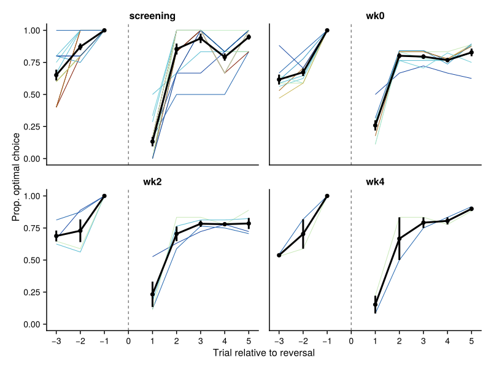
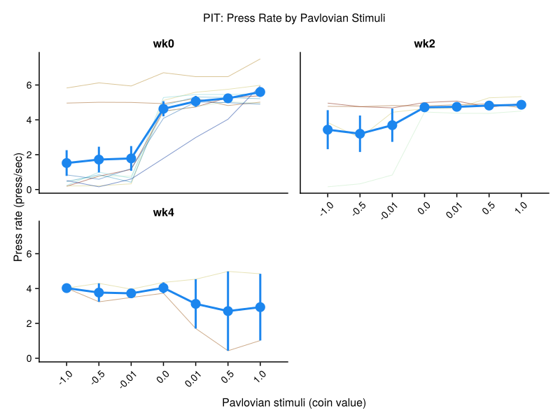
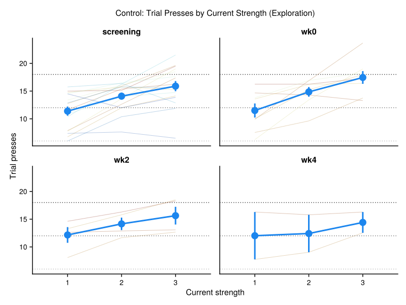
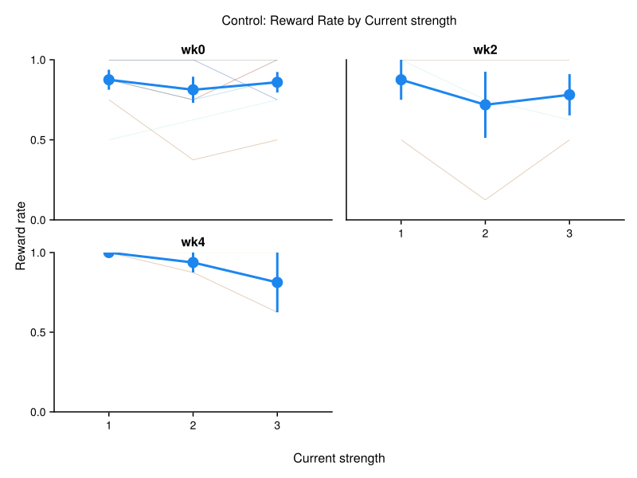
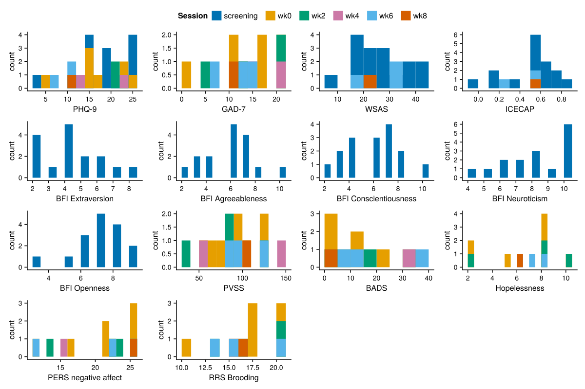

# Behaviour Analysis Dashboard

Generated on: 2025-10-26 23:22:51

This dashboard contains all the generated figures from the behaviour analysis.

## 1. PILT Learning Curves by Session

## 2. PILT Learning Curves by Session and Valence

## 3. PILT Learning Curves by Block

## 4. Working Memory Learning Curves by Session

## 5. Working Memory Learning Curves by Delay Bins and Session (Individual Participants)

## 6. Working Memory Learning Curves by Delay Bins and Session (Group Average)

## 7. Reversal Learning Accuracy Curve

## 8. Delay Discounting Curve by Session

## 9. Vigour: Press Rate by Reward Rate

## 10. PIT: Press Rate by Pavlovian Stimuli

## 11. Control: Exploration Presses by Current Strength

## 12. Control: Prediction Accuracy Over Time

## 13. Control: Confidence Ratings Over Time

## 14. Control: Controllability Ratings Over Time

## 15. Control: Reward Rate by Current Strength

## 16. Control: Reward Rate by Reward Amount

## 17. Questionnaire Score Distributions

## 18. Max Press Rate Distribution by Session

## 19. Pavlovian Lottery Reaction Times by Pavlovian Value and Session

## 20. Open Text Response Lengths by Session

---

**Summary**: Generated 20 figures from the behaviour analysis pipeline.

**Figure files**: All figures are saved as SVG files in the `results/` directory.
