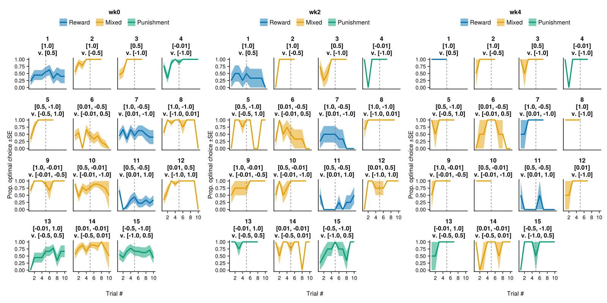
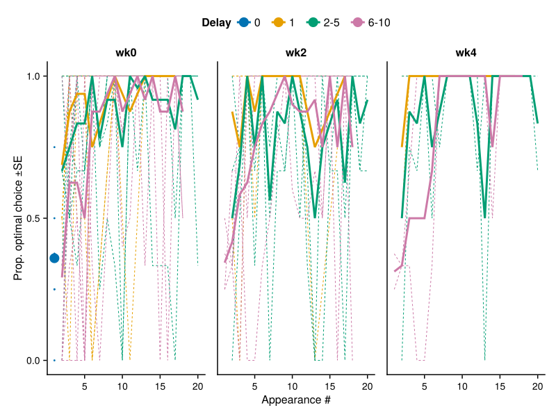
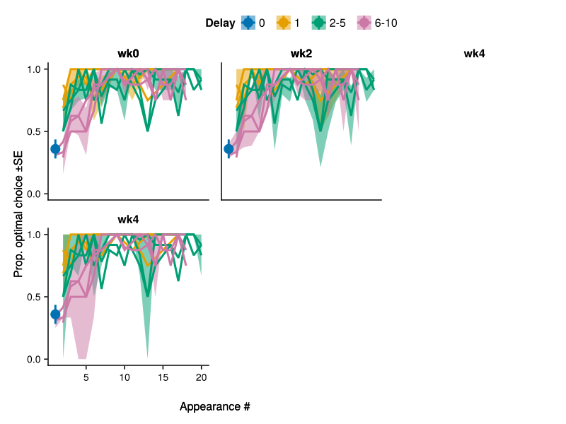
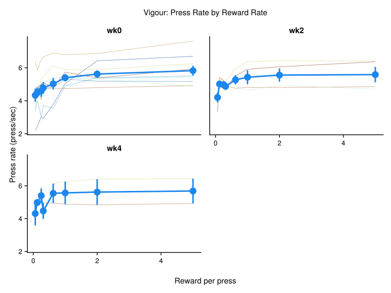
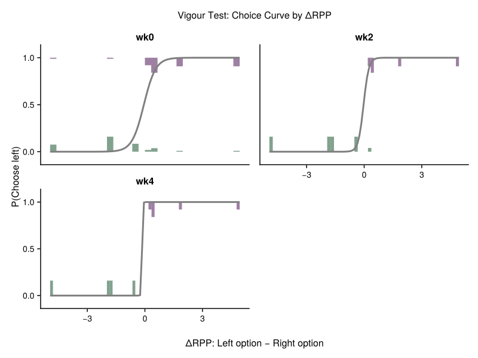
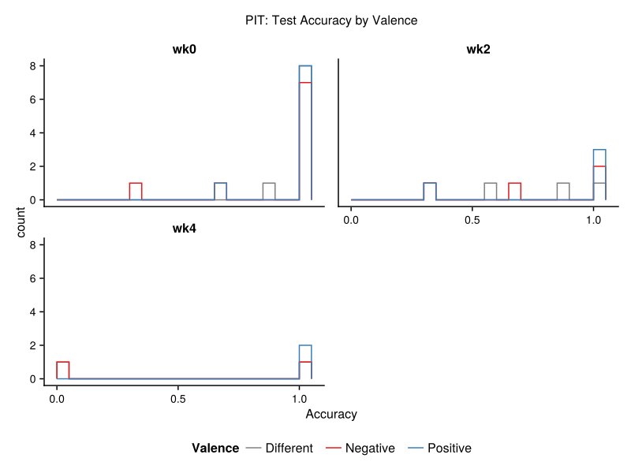
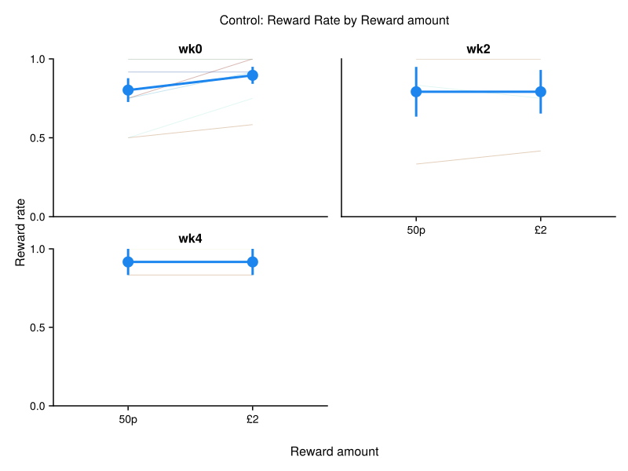
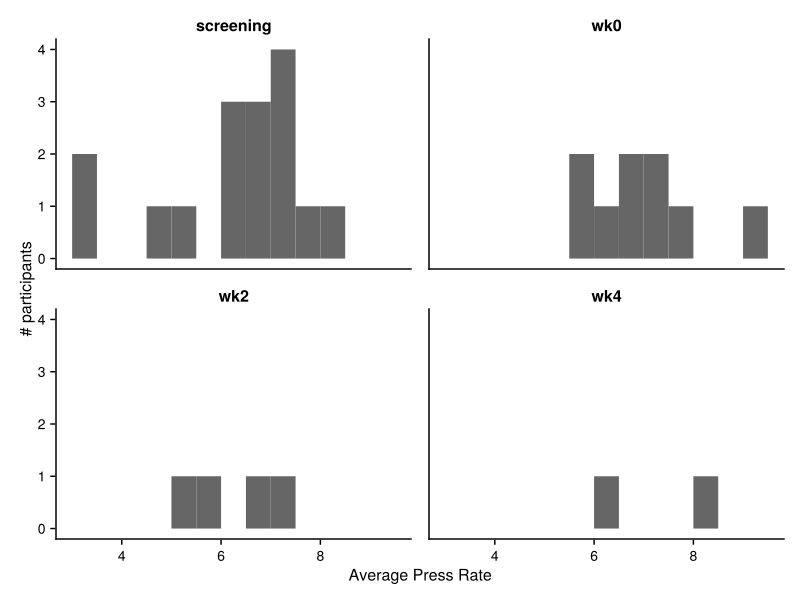
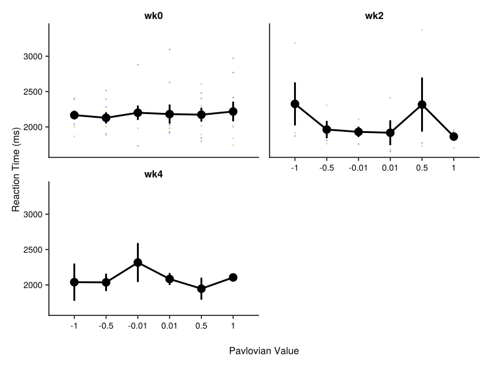
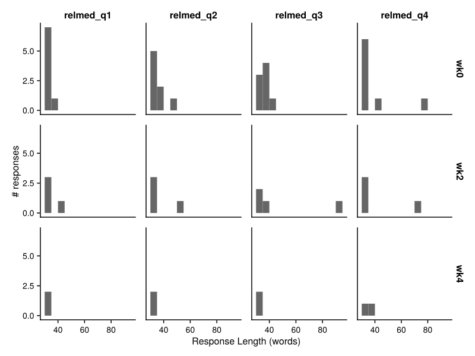

# Behaviour Analysis Dashboard

Generated on: 2025-12-11 18:31:32

This dashboard contains all the generated figures from the behaviour analysis.

## 1. PILT Learning Curves by Session


## 2. PILT Learning Curves by Session and Valence


## 3. PILT Learning Curves by Block



## 4. Working Memory Learning Curves by Session


## 5. Working Memory Learning Curves by Delay Bins and Session (Individual Participants)



## 6. Working Memory Learning Curves by Delay Bins and Session (Group Average)



## 7. Reversal Learning Accuracy Curve


## 8. Delay Discounting Curve by Session


## 9. Vigour: Press Rate by Reward Rate



## 10. Vigour: Test Curve by ΔRPP



## 11. PIT: Press Rate by Pavlovian Stimuli


## 12. PIT: Test Accuracy by Valence



## 13. Control: Exploration Presses by Current Strength


## 14. Control: Prediction Accuracy Over Time


## 15. Control: Confidence Ratings Over Time


## 16. Control: Controllability Ratings Over Time


## 17. Control: Reward Rate by Current Strength


## 18. Control: Reward Rate by Reward Amount



## 19. Questionnaire Score Distributions


## 20. PVSS Domain Distributions


## 21. Max Press Rate Distribution by Session



## 22. Pavlovian Lottery Reaction Times by Pavlovian Value and Session



## 23. Open Text Response Lengths by Session




---

**Summary**: Generated 23 figures from the behaviour analysis pipeline.

**Figure files**: All figures are saved as SVG files in the `results/` directory.


### Data Quality Overview

<details><summary>Click to expand</summary>

```text
┌────────────────┬───────────┬─────────┬───────────────────────┬───────────────────┬──────────────────────────┬──────────────────────────────┬─────────────────────────────┬─────────────────────┬──────────────────┬──────────────────┬───────────────────┬─────────────────────────┬───────────────┬─────────────────────┬─────────────┬───────────────────┬──────────────┬──────────────────────┬────────────────┬───────────────────────────┬──────────────────────────┬──────────────────────────────┬─────────────────────────┬────────────────────┬────────────────────────┬─────────────┬─────────────┬────────────────┬───────────────────┬────────────────────────┬─────────────────────┬─────────────────────────────────────────────────────────────────────────────────────────────────────────────────────────────────────────────────────────────────────────────────────────────────────────────────────────────────────────┬─────────────┐
│ participant_id │   session │ include │ prop_missing_reversal │ prop_missing_pilt │ prop_missing_discounting │ prop_missing_control_presses │ prop_missing_control_choice │ prop_missing_vigour │ prop_missing_pit │ prop_missing_all │ reversal_accuracy │ reversal_critical_value │ pilt_accuracy │ pilt_critical_value │ wm_accuracy │ wm_critical_value │ any_accuracy │ n_pilt_quiz_attempts │ max_press_rate │ completion_time_screening │ completion_time_reversal │ completion_time_pilt-to-test │ completion_time_control │ completion_time_wm │ completion_time_quests │ rt_reversal │     rt_pilt │ rt_discounting │ focus_loss_events │ fullscreen_exit_events │  session_start_time │                                                                                                                                                                                                                  all_module_start_times │ total_bonus │
│         String │    String │   Bool? │              Float64? │          Float64? │                 Float64? │                     Float64? │                    Float64? │            Float64? │         Float64? │         Float64? │          Float64? │                Float64? │      Float64? │            Float64? │    Float64? │          Float64? │        Bool? │               Int64? │       Float64? │                   String? │                  String? │                      String? │                 String? │            String? │                String? │     String? │     String? │        String? │            Int64? │                 Int64? │           DateTime? │                                                                                                                                                                                                                       Vector{DateTime}? │    Float64? │
├────────────────┼───────────┼─────────┼───────────────────────┼───────────────────┼──────────────────────────┼──────────────────────────────┼─────────────────────────────┼─────────────────────┼──────────────────┼──────────────────┼───────────────────┼─────────────────────────┼───────────────┼─────────────────────┼─────────────┼───────────────────┼──────────────┼──────────────────────┼────────────────┼───────────────────────────┼──────────────────────────┼──────────────────────────────┼─────────────────────────┼────────────────────┼────────────────────────┼─────────────┼─────────────┼────────────────┼───────────────────┼────────────────────────┼─────────────────────┼─────────────────────────────────────────────────────────────────────────────────────────────────────────────────────────────────────────────────────────────────────────────────────────────────────────────────────────────────────────┼─────────────┤
│    REL-LON-041 │ screening │   false │                   0.0 │               0.0 │                  missing │                     0.541667 │                         0.0 │             missing │          missing │         0.132653 │              0.76 │                0.607843 │          0.83 │             missing │     missing │           missing │      missing │                    2 │        7.71429 │                     18:28 │                  missing │                      missing │                 missing │            missing │                missing │   256 (177) │   717 (276) │        missing │                 2 │                      0 │ 2025-10-30T12:55:12 │                                                                                                                                                                                                       [DateTime("2025-10-30T12:55:12")] │     missing │
│    REL-LON-048 │ screening │   false │                   0.0 │               0.0 │                  missing │                        0.375 │                         0.0 │             missing │          missing │              0.1 │               0.7 │                0.627451 │           1.0 │             missing │     missing │           missing │      missing │                    1 │        7.42857 │                     21:15 │                  missing │                      missing │                 missing │            missing │                missing │   280 (383) │ 1657 (1083) │        missing │                 2 │                      0 │ 2025-11-06T07:49:29 │                                                                                                                                                                      [DateTime("2025-11-06T07:49:29"), DateTime("2025-11-06T07:51:10")] │     missing │
│    REL-LON-003 │ screening │    true │                   0.0 │               0.0 │                  missing │                    0.0416667 │                        0.25 │             missing │          missing │        0.0222222 │               0.7 │                0.627451 │           1.0 │             missing │     missing │           missing │      missing │                    1 │        7.14286 │                     14:07 │                  missing │                      missing │                 missing │            missing │                missing │   350 (266) │   591 (249) │        missing │                 0 │                      0 │ 2025-08-02T20:50:36 │                                                                                                                                                                                                       [DateTime("2025-08-02T20:50:36")] │     missing │
│    REL-LON-004 │ screening │    true │                   0.0 │               0.0 │                  missing │                    0.0416667 │                         0.0 │             missing │          missing │        0.0102041 │              0.66 │                0.607843 │          0.69 │             missing │     missing │           missing │      missing │                    1 │        4.85714 │                     10:52 │                  missing │                      missing │                 missing │            missing │                missing │   374 (332) │   763 (233) │        missing │                 0 │                      0 │ 2025-08-07T17:40:30 │                                                                                                                                                                                                       [DateTime("2025-08-07T17:40:30")] │     missing │
│    REL-LON-005 │ screening │    true │                   0.0 │               0.0 │                  missing │                    0.0833333 │                        0.25 │             missing │          missing │         0.032967 │              0.78 │                0.607843 │          0.83 │             missing │     missing │           missing │      missing │                    1 │        8.28571 │                     20:35 │                  missing │                      missing │                 missing │            missing │                missing │   267 (145) │   556 (201) │        missing │                 5 │                      0 │ 2025-08-09T16:52:30 │                                                                                                                                                                                                       [DateTime("2025-08-09T16:52:30")] │     missing │
│    REL-LON-007 │ screening │    true │                   0.0 │               0.0 │                  missing │                    0.0416667 │                         0.0 │             missing │          missing │        0.0103093 │              0.76 │                0.607843 │           1.0 │             missing │     missing │           missing │      missing │                    2 │        7.42857 │                     13:39 │                  missing │                      missing │                 missing │            missing │                missing │   328 (204) │   733 (315) │        missing │                 0 │                      0 │ 2025-08-29T15:31:52 │                                                                                                                                                                                                       [DateTime("2025-08-29T15:31:52")] │     missing │
│    REL-LON-008 │ screening │    true │                   0.0 │               0.0 │                  missing │                    0.0833333 │                         0.0 │             missing │          missing │        0.0140845 │               0.7 │                0.607843 │          0.38 │             missing │     missing │           missing │      missing │                    2 │        6.85714 │                     15:22 │                  missing │                      missing │                 missing │            missing │                missing │   343 (469) │   514 (314) │        missing │                 0 │                      0 │ 2025-08-29T17:40:18 │                                                                                                                                                                                                       [DateTime("2025-08-29T17:40:18")] │     missing │
│    REL-LON-019 │ screening │    true │                   0.0 │               0.0 │                  missing │                          0.0 │                        0.25 │             missing │          missing │        0.0105263 │              0.78 │                0.607843 │           0.8 │             missing │     missing │           missing │      missing │                    1 │            6.0 │                     13:08 │                  missing │                      missing │                 missing │            missing │                missing │   238 (195) │   577 (212) │        missing │                 0 │                      0 │ 2025-10-07T19:26:06 │                                                                                                                                                                                                       [DateTime("2025-10-07T19:26:06")] │     missing │
│    REL-LON-023 │ screening │    true │                  0.02 │               0.0 │                  missing │                          0.0 │                         0.0 │             missing │          missing │         0.010989 │           0.77551 │                    0.62 │          0.83 │             missing │     missing │           missing │      missing │                    1 │            6.0 │                     15:06 │                  missing │                      missing │                 missing │            missing │                missing │   376 (367) │   592 (210) │        missing │                 0 │                      0 │ 2025-10-08T20:36:54 │                                                                                                                                                                                                       [DateTime("2025-10-08T20:36:54")] │     missing │
│    REL-LON-026 │ screening │    true │                   0.0 │               0.0 │                  missing │                          0.0 │                         0.0 │             missing │          missing │              0.0 │               0.7 │                0.627451 │          0.83 │             missing │     missing │           missing │      missing │                    1 │            6.0 │                     15:30 │                  missing │                      missing │                 missing │            missing │                missing │   282 (190) │   509 (130) │        missing │                 0 │                      0 │ 2025-10-13T13:17:27 │                                                                                                                                                                                                       [DateTime("2025-10-13T13:17:27")] │     missing │
│    REL-LON-029 │ screening │    true │                   0.0 │               0.0 │                  missing │                          0.0 │                         0.0 │             missing │          missing │              0.0 │              0.68 │                0.627451 │          0.63 │             missing │     missing │           missing │      missing │                    2 │        5.42857 │                     29:54 │                  missing │                      missing │                 missing │            missing │                missing │   251 (133) │   648 (212) │        missing │                 0 │                      0 │ 2025-10-18T11:21:18 │                                                                                                                                                                                                       [DateTime("2025-10-18T11:21:18")] │     missing │
│    REL-LON-031 │ screening │    true │                  0.04 │               0.0 │                  missing │                    0.0416667 │                        0.25 │             missing │          missing │        0.0421053 │            0.8125 │                0.612245 │           0.8 │             missing │     missing │           missing │      missing │                    1 │        3.28571 │                     50:48 │                  missing │                      missing │                 missing │            missing │                missing │   575 (493) │  1381 (629) │        missing │                 0 │                      0 │ 2025-10-20T13:29:04 │                                                                                                                                                                                                       [DateTime("2025-10-20T13:29:04")] │     missing │
│    REL-LON-033 │ screening │    true │                   0.0 │               0.0 │                  missing │                          0.0 │                        0.25 │             missing │          missing │       0.00840336 │              0.74 │                0.607843 │          0.59 │             missing │     missing │           missing │      missing │                    1 │        7.28571 │                     20:26 │                  missing │                      missing │                 missing │            missing │                missing │   270 (219) │   756 (419) │        missing │                 1 │                      0 │ 2025-10-29T20:37:59 │                                                                                                                                                                                                       [DateTime("2025-10-29T20:37:59")] │     missing │
│    REL-LON-037 │ screening │    true │                   0.0 │               0.0 │                  missing │                    0.0833333 │                        0.25 │             missing │          missing │        0.0280374 │              0.74 │                0.607843 │          0.59 │             missing │     missing │           missing │      missing │                    1 │        6.85714 │                     18:23 │                  missing │                      missing │                 missing │            missing │                missing │   258 (196) │   737 (583) │        missing │                 1 │                      0 │ 2025-10-24T11:02:28 │                                                                                                                                                                                                       [DateTime("2025-10-24T11:02:28")] │     missing │
│    REL-LON-038 │ screening │    true │                   0.0 │               0.0 │                  missing │                    0.0416667 │                         0.5 │             missing │          missing │        0.0315789 │              0.82 │                0.607843 │           0.9 │             missing │     missing │           missing │      missing │                    1 │        6.85714 │                     21:45 │                  missing │                      missing │                 missing │            missing │                missing │   435 (298) │   765 (337) │        missing │                 0 │                      0 │ 2025-10-25T11:20:12 │                                                                                                                                                                                                       [DateTime("2025-10-25T11:20:12")] │     missing │
│    REL-LON-039 │ screening │    true │                   0.0 │               0.0 │                  missing │                    0.0833333 │                        0.25 │             missing │          missing │        0.0275229 │              0.72 │                0.607843 │          0.62 │             missing │     missing │           missing │      missing │                    1 │        3.14286 │                     24:05 │                  missing │                      missing │                 missing │            missing │                missing │   310 (219) │   623 (633) │        missing │                 0 │                      0 │ 2025-10-27T20:32:59 │                                                                                                                                                                                                       [DateTime("2025-10-27T20:32:59")] │     missing │
│    REL-LON-043 │ screening │    true │                   0.0 │               0.0 │                  missing │                     0.291667 │                        0.25 │             missing │          missing │        0.0879121 │              0.74 │                0.607843 │          0.83 │             missing │     missing │           missing │      missing │                    1 │        7.42857 │                     12:45 │                  missing │                      missing │                 missing │            missing │                missing │   292 (240) │   720 (248) │        missing │                 2 │                      0 │ 2025-10-29T14:20:11 │                                                                                                                                                                                                       [DateTime("2025-10-29T14:20:11")] │     missing │
│    REL-LON-047 │ screening │    true │                   0.0 │               0.0 │                  missing │                          0.0 │                        0.25 │             missing │          missing │       0.00925926 │              0.76 │                0.607843 │          0.56 │             missing │     missing │           missing │      missing │                    2 │        7.71429 │                     28:44 │                  missing │                      missing │                 missing │            missing │                missing │   261 (232) │   817 (359) │        missing │                 0 │                      0 │ 2025-11-02T08:40:42 │                                                                                                                                                                                                       [DateTime("2025-11-02T08:40:42")] │     missing │
│    REL-LON-056 │ screening │    true │                   0.0 │               0.0 │                  missing │                    0.0833333 │                        0.75 │             missing │          missing │        0.0549451 │              0.74 │                0.627451 │          0.83 │             missing │     missing │           missing │      missing │                    1 │        5.14286 │                     23:11 │                  missing │                      missing │                 missing │            missing │                missing │   397 (427) │ 2268 (2231) │        missing │                 0 │                      0 │ 2025-11-16T11:20:42 │                                                                                                                                                                                                       [DateTime("2025-11-16T11:20:42")] │     missing │
│    REL-LON-059 │ screening │    true │                   0.0 │               0.0 │                  missing │                          0.0 │                         0.0 │             missing │          missing │              0.0 │               0.7 │                0.627451 │           0.9 │             missing │     missing │           missing │      missing │                    1 │            6.0 │                     11:01 │                  missing │                      missing │                 missing │            missing │                missing │   409 (190) │   709 (252) │        missing │                 1 │                      0 │ 2025-11-13T15:04:35 │                                                                                                                                                                                                       [DateTime("2025-11-13T15:04:35")] │     missing │
│    REL-LON-061 │ screening │    true │                  0.02 │               0.0 │                  missing │                        0.125 │                         0.0 │             missing │          missing │        0.0408163 │          0.693878 │                    0.62 │          0.83 │             missing │     missing │           missing │      missing │                    2 │        7.57143 │                     30:46 │                  missing │                      missing │                 missing │            missing │                missing │   293 (234) │   906 (586) │        missing │                 0 │                      0 │ 2025-11-15T12:09:50 │                                                                                                                                                                                                       [DateTime("2025-11-15T12:09:50")] │     missing │
│    REL-LON-062 │ screening │    true │                   0.0 │               0.0 │                  missing │                        0.125 │                         0.0 │             missing │          missing │        0.0315789 │               0.7 │                0.607843 │           0.8 │             missing │     missing │           missing │      missing │                    1 │        7.28571 │                     15:01 │                  missing │                      missing │                 missing │            missing │                missing │   230 (292) │  1109 (747) │        missing │                 2 │                      0 │ 2025-11-26T01:53:08 │                                                                                                                                                                                                       [DateTime("2025-11-26T01:53:08")] │     missing │
│    REL-LON-063 │ screening │    true │                   0.0 │               0.0 │                  missing │                          0.0 │                        0.25 │             missing │          missing │       0.00917431 │              0.68 │                0.607843 │          0.54 │             missing │     missing │           missing │      missing │                    1 │        7.57143 │                     18:37 │                  missing │                      missing │                 missing │            missing │                missing │   274 (216) │   730 (435) │        missing │                 0 │                      0 │ 2025-11-26T20:38:59 │                                                                                                                                                                      [DateTime("2025-11-26T20:38:59"), DateTime("2025-11-26T20:44:01")] │     missing │
│    REL-LON-064 │ screening │    true │                   0.0 │               0.0 │                  missing │                          0.0 │                         0.0 │             missing │          missing │              0.0 │               0.7 │                0.607843 │          0.89 │             missing │     missing │           missing │      missing │                    2 │            8.0 │                     16:16 │                  missing │                      missing │                 missing │            missing │                missing │   385 (457) │   797 (356) │        missing │                 1 │                      0 │ 2025-11-26T18:50:25 │                                                                                                                                                                                                       [DateTime("2025-11-26T18:50:25")] │     missing │
│    REL-LON-067 │ screening │    true │                   0.0 │               0.0 │                  missing │                          0.0 │                         0.0 │             missing │          missing │              0.0 │              0.78 │                0.607843 │          0.83 │             missing │     missing │           missing │      missing │                    1 │            7.0 │                     17:09 │                  missing │                      missing │                 missing │            missing │                missing │   201 (121) │   567 (176) │        missing │                 1 │                      0 │ 2025-12-01T19:51:29 │                                                                                                                                                                                                       [DateTime("2025-12-01T19:51:29")] │     missing │
│    REL-LON-068 │ screening │    true │                   0.0 │               0.0 │                  missing │                    0.0416667 │                         0.0 │             missing │          missing │         0.010989 │               0.8 │                0.607843 │          0.83 │             missing │     missing │           missing │      missing │                    1 │        7.28571 │                     31:39 │                  missing │                      missing │                 missing │            missing │                missing │   316 (241) │   850 (470) │        missing │                 2 │                      0 │ 2025-11-27T12:11:35 │                                                                                                                                                                                                       [DateTime("2025-11-27T12:11:35")] │     missing │
│    REL-LON-069 │ screening │    true │                   0.0 │               0.0 │                  missing │                    0.0416667 │                        0.25 │             missing │          missing │         0.021978 │              0.76 │                0.607843 │          0.83 │             missing │     missing │           missing │      missing │                    1 │        8.14286 │                     17:37 │                  missing │                      missing │                 missing │            missing │                missing │   216 (179) │   810 (372) │        missing │                 0 │                      0 │ 2025-11-28T17:53:18 │                                                                                                                                                                                                       [DateTime("2025-11-28T17:53:18")] │     missing │
│    REL-LON-070 │ screening │    true │                   0.0 │               0.0 │                  missing │                    0.0416667 │                         0.0 │             missing │          missing │         0.010101 │               0.7 │                0.607843 │          0.71 │             missing │     missing │           missing │      missing │                    1 │        6.42857 │                     18:33 │                  missing │                      missing │                 missing │            missing │                missing │   210 (219) │   830 (354) │        missing │                 0 │                      0 │ 2025-12-05T00:08:35 │                                                                                                                                                                                                       [DateTime("2025-12-05T00:08:35")] │     missing │
│    REL-LON-071 │ screening │    true │                   0.0 │               0.0 │                  missing │                          0.0 │                         0.0 │             missing │          missing │              0.0 │              0.66 │                0.627451 │          0.75 │             missing │     missing │           missing │      missing │                    1 │        6.85714 │                     19:33 │                  missing │                      missing │                 missing │            missing │                missing │   350 (189) │   663 (263) │        missing │                 2 │                      0 │ 2025-12-03T15:40:31 │                                                                                                                                                                                                       [DateTime("2025-12-03T15:40:31")] │     missing │
│    REL-LON-003 │       wk0 │    true │                   0.0 │               0.0 │                 0.037037 │                          0.0 │                   0.0833333 │                 0.0 │         0.111111 │        0.0110132 │              0.66 │                0.562914 │          0.68 │            0.570518 │        0.54 │          0.416667 │         true │                    1 │        5.71429 │                   missing │                     6:19 │                        56:26 │                   15:39 │               7:00 │                   9:58 │   411 (594) │   515 (244) │     1573 (687) │                 5 │                      0 │ 2025-08-19T19:24:51 │                                                                   [DateTime("2025-08-19T19:24:51"), DateTime("2025-08-19T19:37:27"), DateTime("2025-08-19T21:51:01"), DateTime("2025-08-19T22:07:05"), DateTime("2025-08-19T22:46:47")] │        4.46 │
│    REL-LON-004 │       wk0 │    true │                   0.0 │               0.0 │                      0.0 │                    0.0208333 │                   0.0416667 │                 0.0 │              0.0 │       0.00671141 │          0.693333 │                0.563245 │          0.55 │            0.569493 │        0.88 │          0.407407 │         true │                    1 │        6.57143 │                   missing │                     5:09 │                        30:30 │                   15:15 │               7:29 │                   6:52 │   242 (252) │   627 (235) │     1983 (636) │                 0 │                      0 │ 2025-09-02T16:31:18 │                                                                   [DateTime("2025-09-02T16:31:18"), DateTime("2025-09-02T16:43:36"), DateTime("2025-09-02T17:15:47"), DateTime("2025-09-03T09:27:24"), DateTime("2025-09-03T09:34:59")] │        4.31 │
│    REL-LON-005 │       wk0 │    true │                   0.0 │               0.0 │                      0.0 │                          0.0 │                   0.0833333 │                 0.0 │              0.0 │       0.00453515 │          0.686667 │                0.556291 │          0.74 │            0.567385 │        0.84 │           0.40787 │         true │                    1 │        9.42857 │                   missing │                     5:34 │                        50:17 │                   32:55 │              10:21 │                   8:34 │   337 (123) │   617 (178) │     1897 (450) │                 1 │                      0 │ 2025-08-23T18:29:31 │                                                                   [DateTime("2025-08-23T18:29:31"), DateTime("2025-08-23T18:35:25"), DateTime("2025-08-23T19:27:13"), DateTime("2025-08-23T22:50:00"), DateTime("2025-08-23T23:01:10")] │        4.75 │
│    REL-LON-007 │       wk0 │    true │                   0.0 │               0.0 │                 0.037037 │                     0.260417 │                   0.0416667 │                 0.0 │        0.0555556 │        0.0615385 │          0.673333 │                0.562914 │          0.71 │            0.571478 │        0.89 │          0.407407 │         true │                    1 │        7.57143 │                   missing │                     5:33 │                        28:50 │                   14:18 │               8:05 │                   7:54 │   216 (140) │   842 (509) │     1646 (530) │                 1 │                      0 │ 2025-09-05T12:22:56 │                                                                   [DateTime("2025-09-05T12:22:56"), DateTime("2025-09-05T12:28:45"), DateTime("2025-09-05T12:57:53"), DateTime("2025-09-05T13:12:27"), DateTime("2025-09-05T13:20:44")] │         4.6 │
│    REL-LON-008 │       wk0 │    true │                   0.0 │               0.0 │                 0.037037 │                    0.0104167 │                       0.125 │                 0.0 │        0.0555556 │        0.0133929 │          0.653333 │                0.562914 │          0.61 │            0.567568 │        0.86 │          0.407407 │         true │                    1 │        6.71429 │                   missing │                   537:56 │                        21:12 │                   15:46 │               7:48 │                   9:31 │   350 (353) │   665 (231) │     2096 (430) │                 4 │                      0 │ 2025-09-30T00:22:53 │ [DateTime("2025-09-30T00:22:53"), DateTime("2025-10-01T20:24:56"), DateTime("2025-10-02T05:23:04"), DateTime("2025-10-02T22:44:08"), DateTime("2025-10-02T22:57:15"), DateTime("2025-10-02T23:13:10"), DateTime("2025-10-02T23:21:05")] │         4.3 │
│    REL-LON-019 │       wk0 │    true │                   0.0 │               0.0 │                 0.037037 │                          0.0 │                   0.0454545 │                 0.0 │              0.0 │       0.00470588 │              0.66 │                0.562914 │          0.69 │            0.567651 │        0.76 │          0.416667 │         true │                    1 │        6.28571 │                   missing │                     5:23 │                        28:11 │                   10:18 │               7:56 │                   9:50 │   181 (178) │   746 (443) │     2008 (393) │                 0 │                      0 │ 2025-10-15T17:43:12 │ [DateTime("2025-10-15T17:43:12"), DateTime("2025-10-15T17:43:53"), DateTime("2025-10-15T17:55:51"), DateTime("2025-10-15T18:25:45"), DateTime("2025-10-15T18:42:14"), DateTime("2025-10-15T18:46:13"), DateTime("2025-10-15T18:54:20")] │        4.48 │
│    REL-LON-023 │       wk0 │    true │                   0.0 │               0.0 │                 0.037037 │                          0.0 │                   0.0416667 │                 0.0 │         0.222222 │        0.0136364 │          0.713333 │                0.563245 │           0.6 │            0.571478 │        0.88 │          0.407407 │         true │                    1 │            7.0 │                   missing │                     5:47 │                        29:05 │                   14:51 │               8:17 │                  10:58 │   259 (151) │   739 (556) │     2103 (519) │                 0 │                      0 │ 2025-10-22T19:17:46 │                                                                   [DateTime("2025-10-22T19:17:46"), DateTime("2025-10-22T19:23:53"), DateTime("2025-10-23T20:33:24"), DateTime("2025-10-23T20:48:22"), DateTime("2025-10-23T20:56:45")] │         4.6 │
│    REL-LON-026 │       wk0 │    true │            0.00666667 │               0.0 │                 0.037037 │                          0.0 │                         0.0 │                 0.0 │        0.0555556 │       0.00674157 │          0.671141 │                    0.56 │          0.68 │            0.567385 │        0.91 │          0.407407 │         true │                    1 │        7.28571 │                   missing │                     5:55 │                        54:04 │                   14:12 │               7:48 │                  14:41 │   265 (226) │   465 (150) │     1633 (236) │                 0 │                      0 │ 2025-10-23T11:51:09 │                                                                   [DateTime("2025-10-23T11:51:09"), DateTime("2025-10-23T12:19:40"), DateTime("2025-10-23T13:14:48"), DateTime("2025-10-23T13:29:09"), DateTime("2025-10-23T13:37:05")] │        4.58 │
│    REL-LON-029 │       wk0 │    true │                   0.0 │               0.0 │                 0.037037 │                    0.0104167 │                   0.0416667 │                 0.0 │        0.0555556 │       0.00884956 │          0.653333 │                0.563245 │          0.66 │            0.569241 │         0.9 │          0.416667 │         true │                    1 │        4.85714 │                   missing │                     6:22 │                        31:19 │                   14:55 │               9:05 │                  11:00 │   422 (302) │   887 (458) │     1665 (357) │                 0 │                      0 │ 2025-11-06T10:54:03 │                                                                   [DateTime("2025-11-06T10:54:03"), DateTime("2025-11-07T10:21:26"), DateTime("2025-11-07T14:27:07"), DateTime("2025-11-07T14:42:34"), DateTime("2025-11-07T14:51:47")] │        4.53 │
│    REL-LON-031 │       wk0 │    true │                   0.0 │        0.00787402 │                 0.037037 │                    0.0208333 │                         0.0 │                 0.0 │              0.0 │       0.00881057 │          0.626667 │                0.562914 │          0.62 │            0.566481 │        0.79 │          0.407407 │         true │                    1 │        5.71429 │                   missing │                     7:02 │                        33:58 │                   31:50 │               8:58 │                  16:35 │   378 (355) │  1015 (526) │     2550 (556) │                 7 │                      0 │ 2025-10-29T18:16:08 │                                                                   [DateTime("2025-10-29T18:16:08"), DateTime("2025-10-31T00:03:50"), DateTime("2025-10-31T13:06:15"), DateTime("2025-10-31T13:38:09"), DateTime("2025-10-31T13:47:11")] │        4.29 │
│    REL-LON-033 │       wk0 │    true │                   0.0 │               0.0 │                 0.037037 │                          0.0 │                         0.0 │                 0.0 │         0.111111 │       0.00671141 │          0.693333 │                0.556291 │          0.69 │            0.569241 │        0.93 │          0.407407 │         true │                    1 │        7.57143 │                   missing │                     6:18 │                        38:00 │                   15:01 │               8:27 │                  13:28 │   200 (179) │   729 (348) │     2066 (574) │                12 │                      0 │ 2025-11-12T16:44:04 │                                                                   [DateTime("2025-11-12T16:44:04"), DateTime("2025-11-12T16:50:51"), DateTime("2025-11-12T17:29:03"), DateTime("2025-11-12T17:44:27"), DateTime("2025-11-12T17:52:57")] │        4.64 │
│    REL-LON-037 │       wk0 │    true │                   0.0 │               0.0 │                 0.037037 │                      0.21875 │                   0.0416667 │                 0.0 │              0.0 │        0.0515695 │          0.646667 │                0.562914 │          0.74 │            0.567568 │        0.88 │          0.407407 │         true │                    1 │        5.28571 │                   missing │                     5:53 │                        27:21 │                   15:21 │              12:46 │                  14:20 │   274 (284) │   662 (350) │     2065 (365) │                 0 │                      0 │ 2025-11-02T17:41:19 │                                                                   [DateTime("2025-11-02T17:41:19"), DateTime("2025-11-02T17:47:15"), DateTime("2025-11-02T18:15:07"), DateTime("2025-11-02T18:30:44"), DateTime("2025-11-02T18:43:34")] │        4.57 │
│    REL-LON-038 │       wk0 │    true │                   0.0 │        0.00917431 │                 0.037037 │                          0.0 │                   0.0833333 │                 0.0 │        0.0555556 │        0.0114679 │          0.693333 │                0.556291 │           0.8 │            0.570518 │        0.91 │           0.40787 │         true │                    1 │        6.57143 │                   missing │                     5:58 │                        31:13 │                   16:14 │               6:53 │                  14:52 │   350 (247) │  1150 (701) │     2064 (522) │                 0 │                      0 │ 2025-11-04T10:50:49 │                                                                   [DateTime("2025-11-04T10:50:49"), DateTime("2025-11-04T10:57:00"), DateTime("2025-11-04T11:30:00"), DateTime("2025-11-04T11:46:20"), DateTime("2025-11-04T11:55:09")] │        3.75 │
│    REL-LON-041 │       wk0 │    true │                   0.0 │         0.0483871 │                 0.037037 │                     0.291667 │                   0.0416667 │                 0.0 │              0.0 │        0.0798226 │          0.673333 │                0.562914 │          0.62 │            0.567385 │        0.93 │          0.407407 │         true │                    1 │        8.14286 │                   missing │                     5:09 │                        28:34 │                   15:59 │               8:05 │                   8:48 │   144 (137) │   696 (480) │     1318 (306) │                 0 │                      0 │ 2025-11-24T16:33:10 │                                  [DateTime("2025-11-24T16:33:10"), DateTime("2025-11-24T16:38:31"), DateTime("2025-11-24T17:07:14"), DateTime("2025-11-25T16:13:22"), DateTime("2025-11-25T16:13:46"), DateTime("2025-11-25T16:22:09")] │        4.56 │
│    REL-LON-043 │       wk0 │    true │                   0.0 │               0.0 │                 0.037037 │                       0.1875 │                   0.0416667 │                 0.0 │        0.0555556 │        0.0470852 │              0.66 │                0.562914 │          0.63 │            0.565232 │        0.88 │          0.411215 │         true │                    1 │        9.71429 │                   missing │                     6:25 │                        27:57 │                   15:20 │               8:33 │                  11:28 │   274 (208) │   642 (295) │     1995 (569) │                 0 │                      0 │ 2025-11-10T22:23:27 │                                                                   [DateTime("2025-11-10T22:23:27"), DateTime("2025-11-10T22:30:11"), DateTime("2025-11-10T22:58:20"), DateTime("2025-11-10T23:13:53"), DateTime("2025-11-10T23:22:32")] │        4.62 │
│    REL-LON-047 │       wk0 │    true │                   0.0 │               0.0 │                 0.037037 │                    0.0208333 │                   0.0416667 │                 0.0 │              0.0 │       0.00904977 │          0.626667 │                0.562914 │          0.62 │            0.571429 │     missing │           missing │      missing │                    1 │        8.28571 │                   missing │                     6:48 │                        28:54 │                   16:22 │               1:13 │                  19:08 │   238 (211) │   606 (240) │     1875 (726) │                 0 │                      0 │ 2025-11-19T09:37:14 │                                  [DateTime("2025-11-19T09:37:14"), DateTime("2025-11-19T09:44:07"), DateTime("2025-11-19T10:13:11"), DateTime("2025-11-19T10:29:39"), DateTime("2025-11-19T10:39:04"), DateTime("2025-11-19T10:40:29")] │        4.29 │
│    REL-LON-048 │       wk0 │    true │                   0.0 │        0.00847458 │                 0.037037 │                     0.177083 │                   0.0416667 │                 0.0 │              0.0 │        0.0449438 │          0.666667 │                0.562914 │          0.78 │            0.570518 │        0.92 │          0.407407 │         true │                    1 │        7.57143 │                   missing │                     6:13 │                        62:53 │                   15:23 │               8:25 │                  14:45 │   283 (319) │  1034 (868) │     1990 (459) │                 7 │                      0 │ 2025-11-20T22:12:35 │                                                                   [DateTime("2025-11-20T22:12:35"), DateTime("2025-11-20T22:19:02"), DateTime("2025-11-20T23:22:05"), DateTime("2025-11-20T23:37:35"), DateTime("2025-11-20T23:46:10")] │         4.7 │
│    REL-LON-056 │       wk0 │    true │            0.00666667 │        0.00892857 │                 0.037037 │                    0.0208333 │                   0.0833333 │                 0.0 │         0.111111 │        0.0205011 │          0.637584 │                    0.56 │          0.71 │            0.565517 │        0.84 │           0.40787 │         true │                    1 │            5.0 │                   missing │                     6:35 │                        33:31 │                   17:19 │               9:42 │                  17:03 │   458 (301) │  1038 (555) │     2481 (482) │                 0 │                      0 │ 2025-11-20T13:45:48 │                                                                   [DateTime("2025-11-20T13:45:48"), DateTime("2025-11-20T13:52:42"), DateTime("2025-11-20T14:28:24"), DateTime("2025-11-20T14:45:51"), DateTime("2025-11-20T14:55:45")] │         4.5 │
│    REL-LON-059 │       wk0 │    true │                   0.0 │               0.0 │                      0.0 │                          0.0 │                   0.0416667 │                 0.0 │              0.0 │       0.00225225 │          0.606667 │                0.562914 │          0.72 │            0.569444 │         0.9 │          0.407407 │         true │                    1 │        6.28571 │                   missing │                     5:22 │                        27:15 │                   13:32 │               7:22 │                   7:24 │   362 (100) │   724 (262) │     1975 (677) │                 1 │                      0 │ 2025-11-26T14:07:31 │                                                                   [DateTime("2025-11-26T14:07:31"), DateTime("2025-11-26T14:13:00"), DateTime("2025-11-26T19:01:08"), DateTime("2025-11-27T08:36:50"), DateTime("2025-11-27T08:44:17")] │        4.65 │
│    REL-LON-063 │       wk0 │    true │                   0.0 │               0.0 │                 0.037037 │                          0.0 │                   0.0416667 │                 0.0 │              0.0 │       0.00446429 │              0.64 │                0.562914 │          0.66 │            0.570425 │         0.8 │          0.407407 │         true │                    1 │        7.85714 │                   missing │                     5:53 │                        31:16 │                   15:08 │               8:54 │                  15:09 │   246 (146) │   825 (389) │     2227 (721) │                 0 │                      0 │ 2025-12-03T14:41:25 │                                                                   [DateTime("2025-12-03T14:41:25"), DateTime("2025-12-03T14:47:27"), DateTime("2025-12-03T15:19:03"), DateTime("2025-12-03T15:34:19"), DateTime("2025-12-03T15:43:18")] │         4.6 │
│    REL-LON-064 │       wk0 │    true │                   0.0 │               0.0 │                 0.037037 │                    0.0208333 │                   0.0416667 │                 0.0 │              0.0 │       0.00888889 │          0.686667 │                0.562914 │          0.71 │            0.569241 │        0.89 │          0.411215 │         true │                    1 │        7.28571 │                   missing │                     5:42 │                        31:40 │                   14:20 │               8:07 │                  10:22 │   375 (440) │   588 (288) │     1721 (649) │                 6 │                      0 │ 2025-12-02T14:23:41 │                                                                   [DateTime("2025-12-02T14:23:41"), DateTime("2025-12-02T14:30:43"), DateTime("2025-12-02T20:20:43"), DateTime("2025-12-04T21:27:36"), DateTime("2025-12-04T21:35:49")] │        4.54 │
│    REL-LON-003 │       wk2 │    true │                   0.0 │               0.0 │                 0.037037 │                          0.0 │                   0.0416667 │                 0.0 │              0.0 │       0.00457666 │          0.693333 │                0.562914 │          0.74 │            0.569493 │        0.72 │          0.411215 │         true │                    1 │        5.14286 │                   missing │                     5:22 │                        45:13 │                   14:46 │               8:24 │                   9:46 │   217 (192) │   569 (427) │     1526 (431) │                 2 │                      0 │ 2025-09-10T19:56:10 │                                                                   [DateTime("2025-09-10T19:56:10"), DateTime("2025-09-10T20:01:44"), DateTime("2025-09-10T20:47:08"), DateTime("2025-09-10T21:02:01"), DateTime("2025-09-10T21:10:33")] │        4.56 │
│    REL-LON-004 │       wk2 │    true │            0.00666667 │        0.00840336 │                 0.037037 │                    0.0104167 │                   0.0833333 │                 0.0 │              0.0 │        0.0134529 │          0.630872 │                0.566667 │           0.6 │            0.569496 │        0.59 │          0.407407 │         true │                    1 │        5.57143 │                   missing │                     5:13 │                        42:01 │                   15:48 │               7:31 │                   5:49 │   264 (299) │   595 (219) │     1305 (481) │                 6 │                      0 │ 2025-09-25T15:03:58 │                                                                   [DateTime("2025-09-25T15:03:58"), DateTime("2025-09-25T15:09:50"), DateTime("2025-09-25T20:52:57"), DateTime("2025-09-25T21:08:56"), DateTime("2025-09-25T21:16:46")] │        4.12 │
│    REL-LON-007 │       wk2 │    true │                   0.0 │               0.0 │                 0.037037 │                     0.260417 │                         0.0 │                 0.0 │              0.0 │        0.0593607 │          0.673333 │                0.563245 │          0.73 │            0.571478 │         0.9 │          0.407407 │         true │                    1 │        7.28571 │                   missing │                     5:13 │                        26:31 │                   18:31 │               7:39 │                   8:49 │   197 (193) │   754 (371) │     1725 (534) │                 4 │                      0 │ 2025-10-01T11:27:05 │                                                                   [DateTime("2025-10-01T11:27:05"), DateTime("2025-10-01T11:32:38"), DateTime("2025-10-01T11:59:20"), DateTime("2025-10-01T12:23:49"), DateTime("2025-10-01T12:31:32")] │        4.68 │
│    REL-LON-008 │       wk2 │    true │             0.0133333 │         0.0420168 │                      0.0 │                    0.0208333 │                       0.125 │                 0.0 │        0.0555556 │         0.029148 │          0.662162 │                0.564094 │          0.58 │            0.570473 │        0.88 │          0.407407 │         true │                    1 │        6.57143 │                   missing │                     5:58 │                        29:07 │                   20:01 │               7:55 │                   9:04 │   322 (610) │   864 (756) │     2213 (515) │                 3 │                      0 │ 2025-10-28T10:41:21 │ [DateTime("2025-10-28T10:41:21"), DateTime("2025-10-28T16:27:53"), DateTime("2025-10-28T16:57:32"), DateTime("2025-10-28T16:57:55"), DateTime("2025-10-28T19:01:12"), DateTime("2025-10-28T19:21:22"), DateTime("2025-10-28T19:29:31")] │         4.4 │
│    REL-LON-019 │       wk2 │    true │                   0.0 │               0.0 │                      0.0 │                          0.0 │                         0.0 │                 0.0 │        0.0555556 │       0.00236407 │          0.666667 │                0.562914 │          0.68 │            0.567598 │        0.68 │          0.398148 │         true │                    1 │        6.28571 │                   missing │                     5:13 │                        31:37 │                   12:05 │               7:23 │                   9:40 │   217 (169) │   611 (309) │     2522 (459) │                 0 │                      0 │ 2025-11-11T16:43:03 │                                  [DateTime("2025-11-11T16:43:03"), DateTime("2025-11-11T16:49:13"), DateTime("2025-11-11T17:24:36"), DateTime("2025-11-11T17:39:31"), DateTime("2025-11-11T17:40:51"), DateTime("2025-11-11T17:48:23")] │        4.39 │
│    REL-LON-023 │       wk2 │    true │                   0.0 │               0.0 │                 0.037037 │                    0.0104167 │                   0.0833333 │                 0.0 │              0.0 │       0.00892857 │          0.686667 │                0.556291 │          0.75 │            0.571478 │        0.89 │           0.40787 │         true │                    1 │            7.0 │                   missing │                     5:37 │                        30:05 │                   14:14 │               7:53 │                   8:51 │   277 (165) │   614 (325) │     1846 (337) │                 0 │                      0 │ 2025-11-17T13:09:11 │                                                                   [DateTime("2025-11-17T13:09:11"), DateTime("2025-11-19T21:18:01"), DateTime("2025-11-19T21:48:14"), DateTime("2025-11-19T22:02:33"), DateTime("2025-11-19T22:10:31")] │        4.61 │
│    REL-LON-026 │       wk2 │    true │                   0.0 │               0.0 │                      0.0 │                    0.0104167 │                         0.0 │                 0.0 │        0.0555556 │       0.00452489 │          0.653333 │                0.562914 │          0.71 │            0.571478 │        0.89 │          0.416667 │         true │                    1 │        6.71429 │                   missing │                     5:50 │                        28:22 │                   14:11 │               7:19 │                  15:07 │   460 (389) │   585 (240) │     2111 (551) │                 0 │                      0 │ 2025-11-16T16:10:12 │                                                                   [DateTime("2025-11-16T16:10:12"), DateTime("2025-11-16T16:16:14"), DateTime("2025-11-16T16:48:03"), DateTime("2025-11-16T17:02:19"), DateTime("2025-11-16T17:09:43")] │         4.6 │
│    REL-LON-029 │       wk2 │    true │                   0.0 │        0.00862069 │                 0.037037 │                          0.0 │                   0.0416667 │                 0.0 │         0.111111 │        0.0112867 │          0.646667 │                0.562914 │          0.71 │            0.571429 │        0.88 │          0.407407 │         true │                    1 │        5.71429 │                   missing │                     6:25 │                        30:47 │                   18:40 │               9:05 │                   8:56 │   507 (507) │   872 (378) │     2006 (543) │                 0 │                      0 │ 2025-12-02T16:39:29 │                                                                   [DateTime("2025-12-02T16:39:29"), DateTime("2025-12-02T16:47:51"), DateTime("2025-12-02T21:56:14"), DateTime("2025-12-02T22:17:28"), DateTime("2025-12-02T22:26:46")] │         4.5 │
│    REL-LON-033 │       wk2 │    true │                   0.0 │               0.0 │                 0.037037 │                          0.0 │                   0.0416667 │                 0.0 │              0.0 │        0.0044843 │          0.646667 │                0.563245 │          0.65 │            0.572419 │        0.92 │          0.407407 │         true │                    1 │        7.71429 │                   missing │                     5:24 │                        30:56 │                   14:50 │               8:00 │                  13:25 │   263 (226) │   712 (403) │     2181 (644) │                 4 │                      0 │ 2025-12-10T13:14:15 │                                                                   [DateTime("2025-12-10T13:14:15"), DateTime("2025-12-10T13:22:46"), DateTime("2025-12-10T14:10:47"), DateTime("2025-12-11T00:20:54"), DateTime("2025-12-11T00:28:59")] │        4.68 │
│    REL-LON-037 │       wk2 │    true │                   0.0 │               0.0 │                 0.037037 │                    0.0520833 │                   0.0416667 │                 0.0 │              0.0 │        0.0163934 │          0.626667 │                0.562914 │          0.76 │            0.572564 │        0.92 │          0.407407 │         true │                    1 │        6.14286 │                   missing │                     5:29 │                        26:44 │                   15:11 │               8:01 │                  12:13 │   199 (134) │   747 (419) │     2297 (606) │                 0 │                      0 │ 2025-11-24T15:05:30 │                                                                   [DateTime("2025-11-24T15:05:30"), DateTime("2025-11-24T15:11:06"), DateTime("2025-11-24T15:37:56"), DateTime("2025-11-24T15:53:26"), DateTime("2025-11-24T16:01:31")] │        4.63 │
│    REL-LON-038 │       wk2 │    true │                   0.0 │        0.00813008 │                      0.0 │                          0.0 │                   0.0833333 │                 0.0 │         0.111111 │        0.0111111 │               0.7 │                0.556291 │          0.67 │            0.572564 │        0.66 │          0.407407 │         true │                    1 │        6.57143 │                   missing │                     6:54 │                        29:52 │                   15:35 │               9:49 │                  13:04 │   409 (189) │   918 (583) │     2056 (543) │                 0 │                      0 │ 2025-11-25T09:59:50 │                                                                   [DateTime("2025-11-25T09:59:50"), DateTime("2025-11-25T10:06:55"), DateTime("2025-11-25T17:33:18"), DateTime("2025-11-25T17:49:05"), DateTime("2025-11-25T17:59:02")] │        4.51 │
│    REL-LON-039 │       wk2 │    true │            0.00666667 │               0.0 │                 0.037037 │                      0.03125 │                       0.125 │                 0.0 │         0.111111 │        0.0212314 │           0.66443 │                    0.56 │          0.56 │            0.569236 │        0.81 │          0.407407 │         true │                    1 │            6.0 │                   missing │                     7:00 │                        33:59 │                   18:59 │               8:36 │                  15:31 │   326 (132) │   672 (437) │     1864 (694) │                 0 │                      0 │ 2025-11-17T18:32:08 │                                                                   [DateTime("2025-11-17T18:32:08"), DateTime("2025-11-17T18:47:14"), DateTime("2025-11-17T19:21:27"), DateTime("2025-11-17T19:40:38"), DateTime("2025-11-17T19:49:28")] │        4.23 │
│    REL-LON-047 │       wk2 │    true │                   0.0 │               0.0 │                      0.0 │                          0.0 │                   0.0416667 │                 0.0 │        0.0555556 │       0.00433839 │              0.66 │                0.562914 │          0.62 │            0.570375 │        0.95 │          0.407407 │         true │                    1 │        8.14286 │                   missing │                     6:31 │                        30:15 │                   14:26 │               7:24 │                  14:15 │   196 (178) │   526 (173) │     1634 (411) │                 0 │                      0 │ 2025-12-09T08:20:55 │                                                                   [DateTime("2025-12-09T08:20:55"), DateTime("2025-12-09T08:28:18"), DateTime("2025-12-09T08:58:40"), DateTime("2025-12-09T09:13:13"), DateTime("2025-12-09T09:20:45")] │        4.52 │
│    REL-LON-056 │       wk2 │    true │                   0.0 │               0.0 │                 0.037037 │                    0.0104167 │                   0.0416667 │                 0.0 │              0.0 │       0.00696056 │              0.64 │                0.556291 │           0.7 │            0.571478 │         0.9 │          0.407407 │         true │                    1 │        6.28571 │                   missing │                     6:06 │                        30:55 │                   16:16 │               9:09 │                  15:32 │   271 (339) │   893 (415) │     2275 (418) │                 0 │                      0 │ 2025-12-09T15:15:26 │                                                                   [DateTime("2025-12-09T15:15:26"), DateTime("2025-12-09T15:21:43"), DateTime("2025-12-09T15:53:00"), DateTime("2025-12-09T16:09:26"), DateTime("2025-12-09T16:18:40")] │        4.56 │
│    REL-LON-004 │       wk4 │    true │                   0.0 │               0.0 │                      0.0 │                          0.0 │                   0.0416667 │                 0.0 │        0.0555556 │       0.00498753 │          0.616667 │                0.570248 │          0.78 │            0.569394 │        0.89 │          0.416667 │         true │                    1 │            6.0 │                   missing │                     4:09 │                        28:27 │                   13:22 │               7:03 │                   6:36 │   208 (168) │   656 (266) │     1021 (237) │                 0 │                      0 │ 2025-10-13T09:09:25 │                                                                   [DateTime("2025-10-13T09:09:25"), DateTime("2025-10-13T09:42:03"), DateTime("2025-10-13T10:10:38"), DateTime("2025-10-13T10:24:05"), DateTime("2025-10-13T10:31:13")] │        4.09 │
│    REL-LON-007 │       wk4 │    true │                   0.0 │               0.0 │                      0.0 │                     0.291667 │                         0.0 │                 0.0 │              0.0 │        0.0651163 │          0.666667 │                0.556623 │          0.77 │            0.573432 │        0.79 │          0.407407 │         true │                    1 │            8.0 │                   missing │                     5:12 │                        25:02 │                   14:23 │               7:26 │                   7:07 │   217 (179) │   665 (386) │     1591 (521) │                 0 │                      0 │ 2025-10-19T20:41:14 │                                                                   [DateTime("2025-10-19T20:41:14"), DateTime("2025-10-19T20:46:35"), DateTime("2025-10-19T21:11:48"), DateTime("2025-10-19T21:26:15"), DateTime("2025-10-19T21:33:47")] │        4.64 │
│    REL-LON-008 │       wk4 │    true │                   0.0 │               0.0 │                 0.037037 │                    0.0520833 │                   0.0416667 │                 0.0 │        0.0555556 │        0.0182232 │          0.653333 │                0.562914 │           0.7 │            0.571429 │        0.76 │          0.411215 │         true │                    1 │        6.42857 │                   missing │                     5:02 │                        31:54 │                   18:30 │               9:09 │                  42:02 │   216 (243) │   753 (328) │     1811 (334) │                 5 │                      0 │ 2025-11-14T08:44:46 │                                                                   [DateTime("2025-11-14T08:44:46"), DateTime("2025-11-14T09:14:35"), DateTime("2025-11-14T15:25:39"), DateTime("2025-11-14T16:42:04"), DateTime("2025-11-14T17:23:48")] │        4.59 │
│    REL-LON-019 │       wk4 │    true │                   0.0 │               0.0 │                      0.0 │                          0.0 │                         0.0 │                 0.0 │        0.0555556 │       0.00227273 │          0.653333 │                0.556623 │          0.73 │            0.573576 │        0.88 │          0.407407 │         true │                    1 │            6.0 │                   missing │                     4:53 │                        24:57 │                   13:53 │               7:01 │                   7:38 │   135 (114) │   507 (204) │     1994 (368) │                 0 │                      0 │ 2025-12-01T22:09:30 │                                                                   [DateTime("2025-12-01T22:09:30"), DateTime("2025-12-01T22:14:35"), DateTime("2025-12-01T22:39:48"), DateTime("2025-12-01T22:53:48"), DateTime("2025-12-01T23:00:58")] │        4.54 │
│    REL-LON-023 │       wk4 │    true │                   0.0 │               0.0 │                      0.0 │                    0.0104167 │                         0.0 │                 0.0 │              0.0 │       0.00231481 │          0.673333 │                0.556291 │          0.64 │            0.570473 │        0.93 │          0.407407 │         true │                    1 │        6.85714 │                   missing │                     5:33 │                        26:10 │                   12:56 │               7:54 │                  10:05 │   312 (115) │   520 (303) │     1810 (366) │                 0 │                      0 │ 2025-12-06T21:15:39 │                                                                   [DateTime("2025-12-06T21:15:39"), DateTime("2025-12-06T21:25:19"), DateTime("2025-12-07T22:16:07"), DateTime("2025-12-07T22:29:09"), DateTime("2025-12-07T22:37:08")] │        4.61 │
│    REL-LON-026 │       wk4 │    true │                   0.0 │               0.0 │                      0.0 │                          0.0 │                         0.0 │                 0.0 │         0.111111 │       0.00454545 │          0.653333 │                0.556623 │          0.67 │            0.571429 │        0.92 │          0.407407 │         true │                    1 │        6.42857 │                   missing │                     5:24 │                        28:06 │                   14:49 │               7:12 │                  12:02 │   331 (183) │   493 (178) │     1679 (447) │                 1 │                      0 │ 2025-12-05T12:50:55 │                                                                   [DateTime("2025-12-05T12:50:55"), DateTime("2025-12-05T13:03:53"), DateTime("2025-12-05T13:40:08"), DateTime("2025-12-05T13:55:03"), DateTime("2025-12-05T14:02:20")] │        4.59 │
│    REL-LON-003 │       wk6 │ missing │               missing │           missing │                  missing │                      missing │                     missing │             missing │          missing │          missing │           missing │                 missing │       missing │             missing │     missing │           missing │      missing │              missing │        missing │                   missing │                  missing │                      missing │                 missing │            missing │                   3:40 │     missing │     missing │        missing │                 0 │                      0 │ 2025-10-08T13:30:25 │                                                                                                                                                                                                       [DateTime("2025-10-08T13:30:25")] │     missing │
│    REL-LON-004 │       wk6 │ missing │               missing │           missing │                  missing │                      missing │                     missing │             missing │          missing │          missing │           missing │                 missing │       missing │             missing │     missing │           missing │      missing │              missing │        missing │                   missing │                  missing │                      missing │                 missing │            missing │                   4:17 │     missing │     missing │        missing │                 0 │                      0 │ 2025-10-25T06:29:44 │                                                                                                                                                                                                       [DateTime("2025-10-25T06:29:44")] │     missing │
│    REL-LON-007 │       wk6 │ missing │               missing │           missing │                  missing │                      missing │                     missing │             missing │          missing │          missing │           missing │                 missing │       missing │             missing │     missing │           missing │      missing │              missing │        missing │                   missing │                  missing │                      missing │                 missing │            missing │                   6:25 │     missing │     missing │        missing │                 1 │                      0 │ 2025-10-30T15:47:36 │                                                                                                                                                                                                       [DateTime("2025-10-30T15:47:36")] │     missing │
│    REL-LON-008 │       wk6 │ missing │               missing │           missing │                  missing │                      missing │                     missing │             missing │          missing │          missing │           missing │                 missing │       missing │             missing │     missing │           missing │      missing │              missing │        missing │                   missing │                  missing │                      missing │                 missing │            missing │                   4:45 │     missing │     missing │        missing │                 0 │                      0 │ 2025-12-01T21:39:44 │                                                                                                                                                                      [DateTime("2025-12-01T21:39:44"), DateTime("2025-12-01T22:15:12")] │     missing │
│    REL-LON-003 │       wk8 │ missing │               missing │           missing │                  missing │                      missing │                     missing │             missing │          missing │          missing │           missing │                 missing │       missing │             missing │     missing │           missing │      missing │              missing │        missing │                   missing │                  missing │                      missing │                 missing │            missing │                   6:44 │     missing │     missing │        missing │                 0 │                      0 │ 2025-10-22T17:26:36 │                                                                                                                                                                                                       [DateTime("2025-10-22T17:26:36")] │     missing │
│    REL-LON-004 │       wk8 │ missing │               missing │           missing │                  missing │                      missing │                     missing │             missing │          missing │          missing │           missing │                 missing │       missing │             missing │     missing │           missing │      missing │              missing │        missing │                   missing │                  missing │                      missing │                 missing │            missing │                   2:53 │     missing │     missing │        missing │                 0 │                      0 │ 2025-11-08T07:08:09 │                                                                                                                                                                                                       [DateTime("2025-11-08T07:08:09")] │     missing │
│    REL-LON-007 │       wk8 │ missing │               missing │           missing │                  missing │                      missing │                     missing │             missing │          missing │          missing │           missing │                 missing │       missing │             missing │     missing │           missing │      missing │              missing │        missing │                   missing │                  missing │                      missing │                 missing │            missing │                   5:08 │     missing │     missing │        missing │                 7 │                      0 │ 2025-11-13T16:59:43 │                                                                                                                                                                                                       [DateTime("2025-11-13T16:59:43")] │     missing │
│    REL-LON-008 │       wk8 │ missing │               missing │           missing │                  missing │                      missing │                     missing │             missing │          missing │          missing │           missing │                 missing │       missing │             missing │     missing │           missing │      missing │              missing │        missing │                   missing │                  missing │                      missing │                 missing │            missing │                   3:20 │     missing │     missing │        missing │                 0 │                      0 │ 2025-12-10T15:33:50 │                                                                                                                                                                                                       [DateTime("2025-12-10T15:33:50")] │     missing │
└────────────────┴───────────┴─────────┴───────────────────────┴───────────────────┴──────────────────────────┴──────────────────────────────┴─────────────────────────────┴─────────────────────┴──────────────────┴──────────────────┴───────────────────┴─────────────────────────┴───────────────┴─────────────────────┴─────────────┴───────────────────┴──────────────┴──────────────────────┴────────────────┴───────────────────────────┴──────────────────────────┴──────────────────────────────┴─────────────────────────┴────────────────────┴────────────────────────┴─────────────┴─────────────┴────────────────┴───────────────────┴────────────────────────┴─────────────────────┴─────────────────────────────────────────────────────────────────────────────────────────────────────────────────────────────────────────────────────────────────────────────────────────────────────────────────────────────────────────┴─────────────┘
```

</details>
